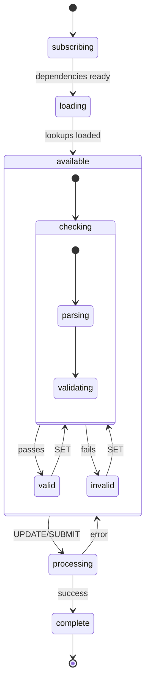

# XState Machine Patterns Analysis

## Machines Reviewed

| Machine | Type | Key Pattern |
|---------|------|-------------|
| [dataManager](file:///Users/domdacosta/Dev/Upmind/monorepo/packages/headless/src/modules/dataManager/dataManager.machine.ts) | CRUD | ✅ Full checking pattern |
| [product](file:///Users/domdacosta/Dev/Upmind/monorepo/packages/headless/src/modules/product/product.machine.ts) | Configurator | ✅ Full checking pattern |
| [paymentDetail](file:///Users/domdacosta/Dev/Upmind/monorepo/packages/headless/src/modules/paymentDetails/paymentDetail.machine.ts) | Selector | ✅ Full checking pattern |
| [payment](file:///Users/domdacosta/Dev/Upmind/monorepo/packages/headless/src/modules/payment/payment.machine.ts) | Flow | ✅ Checking + processing |
| [basket](file:///Users/domdacosta/Dev/Upmind/monorepo/packages/headless/src/modules/basket/basket.machine.ts) | Orchestrator | Parallel states |
| [domain](file:///Users/domdacosta/Dev/Upmind/monorepo/packages/headless/src/modules/domain/domain.machine.ts) | Multi-flow | Type-specific states |
| [auth](file:///Users/domdacosta/Dev/Upmind/monorepo/packages/headless/src/modules/auth/auth.machine.ts) | Auth | ⚠️ Missing checking pattern |

---

## Normalized State Lifecycle



---

## State Definitions

### 1. `subscribing`

**Purpose**: Wait for external dependencies (auth, basket, etc.)

```typescript
subscribing: {
  entry: ["setAuthHelper"],
  on: {
    AUTHENTICATED: { target: "loading" }
  }
}
```

### 2. `loading`

**Purpose**: Fetch initial data/lookups

```typescript
loading: {
  entry: ["clearError"],
  invoke: {
    src: "loadLookups",
    onDone: { target: "available", actions: ["setLookups", "setSchemas"] },
    onError: { target: "error", actions: ["setError"] }
  }
}
```

### 3. `available` (with checking pattern)

**Purpose**: Model editing with real-time validation

```typescript
available: {
  initial: "checking",
  states: {
    checking: {
      entry: ["clearError"],
      initial: "parsing",
      states: {
        parsing: {
          invoke: {
            src: "parse",
            onDone: { target: "validating", actions: ["setParsed", "setSchemas"] }
          }
        },
        validating: {
          invoke: {
            src: "validate",
            onDone: { target: "#valid" },
            onError: { target: "#invalid", actions: ["setError"] }
          }
        }
      }
    },
    valid: {
      id: "valid",
      on: {
        SET: "checking",
        UPDATE: "#processing"
      }
    },
    invalid: {
      id: "invalid",
      on: { SET: "checking" }
    }
  }
}
```

### 4. `processing` (with pre-validation)

**Purpose**: Submit to API, validates first to prevent wasted requests

```typescript
processing: {
  id: "processing",
  initial: "validating",
  states: {
    validating: {
      invoke: {
        src: "validate",
        onDone: { target: "submitting" },
        onError: { target: "#invalid", actions: ["setError"] }
      }
    },
    submitting: {
      invoke: {
        src: "update",
        onDone: { target: "#complete", actions: ["setModel"] },
        onError: { target: "#error", actions: ["setError"] }
      }
    }
  }
}
```

### 5. `complete`

**Purpose**: Terminal state with data export

```typescript
complete: {
  id: "complete",
  type: "final",
  data: ({ model }) => model
}
```

---

## Machine Variants

### Form Machine (CRUD)

Single form with model validation. Examples: `dataManager`, `auth`

```
subscribing → loading → available.checking → valid/invalid → processing → complete
```

### Configurator Machine

Complex product/domain configuration. Examples: `product`, `domain`

```
subscribing → loading.lookups → loading.model → available → processing → complete
```

### Orchestrator Machine

Manages child actors. Examples: `basket`

```
subscribing → loading.actors → shopping [parallel states]
```

### Flow Machine

Sequential steps. Examples: `payment`

```
loading → checking → valid → processing → processed → approving → complete
```

---

## Key Events

| Event | When | Target |
|-------|------|--------|
| `SET` | Model update | `checking` |
| `UPDATE`/`SUBMIT` | User initiates save | `processing` |
| `REFRESH` | External data changed | `loading` or `checking` |
| `CANCEL` | User aborts | Previous state or `idle` |
| `xstate.update` | Child actor updated | `checking` |

---

## Standard Actions

| Action | Purpose |
|--------|---------|
| `setContext` | Initialize from provided data |
| `setParsed` | Set parsed model + lookups |
| `setModel` | Update model after parse |
| `setSchemas` | Update JSON/UI schemas |
| `setError` | Map error to `ResponseError` format |
| `clearError` | Clear error state |

---

## Gap Analysis: Auth Machine

**Current**: `SET → setModel action (no validation)`
**Should be**: `SET → checking → valid/invalid`

---

## Recommendations

### 1. The `processed` State

**Current pattern:**

```typescript
processed: { after: { wait: { target: "complete" } } }
```

**Recommendation**: ⚠️ **Remove** - The delay is a UI concern. Instead:

- Transition immediately to `complete`
- Let the composable handle success feedback via `isComplete` computed

**Exception**: Keep for debouncing rapid re-submissions.

### 2. Flatten Checking When Possible

If parsing is synchronous, combine into single service:

```typescript
checking: {
  invoke: {
    src: async (ctx) => { const p = parse(ctx); await validate(p); return p; },
    onDone: { target: "valid", actions: ["setParsed"] },
    onError: { target: "invalid", actions: ["setError"] }
  }
}
```

### 3. Meta Flags

Use only `isValid` - derive `isInvalid` as `!isValid` in consuming code.

### 4. Error Auto-Clear

```typescript
invalid: {
  on: { SET: { target: "checking", actions: ["clearError"] } }
}
```

Clear error when user acts - no explicit RETRY needed.

### 5. Simplified Base Pattern

```typescript
states: {
  subscribing: { always: { target: "loading", cond: "ready" } },
  loading: { invoke: { src: "load", onDone: "available", onError: "error" } },
  available: {
    initial: "checking",
    states: {
      checking: { invoke: { src: "parseAndValidate", onDone: "valid", onError: "invalid" } },
      valid: { on: { SUBMIT: "#processing" } },
      invalid: {}
    },
    on: { SET: ".checking" }
  },
  processing: { invoke: { src: "submit", onDone: "complete", onError: "available.invalid" } },
  complete: { type: "final" }
}
```

**Key Principles:**

1. Validate on every `SET`, not just `SUBMIT`
2. Validate again before API to prevent wasted requests
3. Machines = business logic, composables = reactivity
4. Single source of truth for model in context
