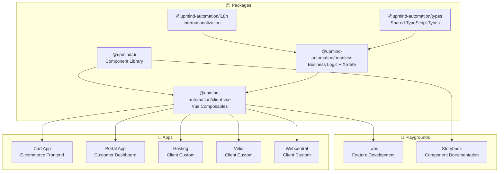
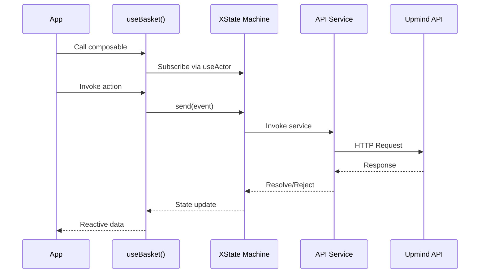

# Upmind Monorepo Deep Analysis

**Analysis Date:** January 19, 2026  
**Target:** Complete monorepo including packages, apps, playgrounds, labs, and storybook  

> [!NOTE]
> **Historical snapshot.** Mentions of `DEVX.md` below reflect the state as of the analysis date. `DEVX.md` has since been retired; its coding standards now live in [`.agent/rules/code-generation.md`](/.agent/rules/code-generation.md) and [`.agent/rules/scoped-composables.md`](/.agent/rules/scoped-composables.md) (see [`docs/devx-distillation-plan.md`](/docs/devx-distillation-plan.md)). The body is left unedited as a point-in-time record.

---

## Executive Summary

The Upmind monorepo is a **mature, well-architected** Vue 3 + TypeScript platform powering e-commerce/billing applications. The codebase demonstrates:

| Aspect | Rating | Summary |
|--------|--------|---------|
| **Architecture** | ⭐⭐⭐⭐ | Clean separation with headless core, Vue layer, and UI library |
| **TypeScript** | ⭐⭐⭐⭐ | Strong typing throughout with proper interfaces |
| **State Management** | ⭐⭐⭐⭐⭐ | Sophisticated XState implementation |
| **Documentation** | ⭐⭐⭐ | Good style guide (DEVX.md), some module READMEs |
| **Testing** | ⭐⭐ | Playwright E2E present, unit test coverage unknown |
| **DX** | ⭐⭐⭐⭐ | Good tooling, consistent patterns |

### Key Findings

| Finding | Priority | Impact |
|---------|----------|--------|
| Excellent module architecture with XState | 🟢 Strength | High code maintainability |
| Comprehensive DEVX.md coding standards | 🟢 Strength | Team consistency |
| Limited test file visibility | 🟡 Moderate | Confidence in changes |
| Some module READMEs incomplete/TODO | 🟡 Moderate | Onboarding friction |
| Modern dependency stack | 🟢 Strength | Future-proofed |

---

## Architecture Overview



### Directory Structure

```
monorepo/
├── packages/                 # Reusable libraries
│   ├── types/               # TypeScript type definitions (git submodule)
│   ├── i18n/                # Localazy-powered translations
│   ├── headless/            # Core business logic (XState machines)
│   ├── client-vue/          # Vue 3 composables wrapping headless
│   └── ui/                  # Radix-Vue based component library
├── apps/                    # Production applications
│   ├── cart/                # Shopping cart (v0.12.5)
│   ├── portal/              # Customer portal (v0.0.1)
│   ├── adminPanel/          # Admin interface
│   ├── hosting/             # Client-specific cart
│   ├── velia/               # Client-specific cart
│   └── webcentral/          # Client-specific cart
├── playgrounds/             # Development environments
│   ├── labs/                # Feature exploration (79 pages)
│   └── storybook/           # UI documentation (39 stories)
├── docs/                    # VitePress + TypeDoc documentation
└── tests/                   # Playwright E2E tests
```

---

## Technology Stack & Dependencies

### Core Framework Dependencies

| Category | Package | Version | Purpose |
|----------|---------|---------|---------|
| **Framework** | vue | ^3.5.18 | UI framework |
| **Routing** | vue-router | ^4.5.1 | SPA routing |
| **State** | xstate | ^4.38.3 | State machines |
| **State (Vue)** | @xstate/vue | ^2.0.0 | XState Vue bindings |
| **Data Fetching** | @tanstack/vue-query | ^5.83.1 | Server state management |
| **Styling** | tailwindcss | ^4.1.11 | Utility-first CSS |
| **i18n** | vue-i18n | ^11.1.11 | Internationalization |
| **UI Primitives** | radix-vue | ^1.9.17 | Accessible primitives |

### Development Dependencies

| Category | Package | Version | Purpose |
|----------|---------|---------|---------|
| **Build** | vite | ^7.1.2 | Build tool |
| **Testing** | @playwright/test | ^1.54.2 | E2E testing |
| **Styling** | class-variance-authority | ^0.7.1 | Component variants |
| **Documentation** | storybook | ^8.6.14 | Component docs |
| **Error Tracking** | @sentry/vue | ^10.4.0 | Error monitoring |

### Dependency Assessment

> [!TIP]
> The dependency stack is **modern and well-maintained**. All major dependencies are current versions with strong community support.

| Assessment | Status |
|------------|--------|
| All dependencies pinned properly | ✅ |
| No deprecated packages detected | ✅ |
| Using latest Vue 3 ecosystem | ✅ |
| XState v4 (v5 available) | ⚠️ Migration opportunity |

---

## Core Modules Analysis

### Package: @upmind-automation/headless

The headless package is the **business logic core** with 20 domain modules:

| Module | Purpose | Files |
|--------|---------|-------|
| `basket` | Shopping cart management | machine, composables, billing, currency, promotions |
| `session` | User authentication | client/guest sub-modules |
| `client` | Customer profile | address, company, email, phone |
| `payment` | Payment processing | Gateway integrations |
| `paymentDetails` | Stored payment methods | 42 files |
| `domain` | Domain purchase flows | DAC, transfers |
| `product` | Product configuration | |
| `productCatalogue` | Product listings | |
| `feedback` | User feedback system | |
| `recommendations` | Product recommendations | |
| `system` | System configuration | 53 files |
| `routing` | Flow routing engine | |

#### Module Architecture Pattern

Each module follows a consistent structure:

```
module/
├── index.ts              # Public exports
├── types.ts              # TypeScript interfaces
├── services.ts           # API services
├── [module].machine.ts   # XState machine definition
├── use[Module].ts        # Main composable (follows DEVX.md)
├── use[Module][Sub].ts   # Sub-feature composables
├── utils.ts              # Helper functions
├── README.md             # Module documentation
└── __tests__/            # Unit tests
```

### Package: @upmind-automation/client-vue

Vue-specific layer that wraps headless with **14 parallel modules**:

- basket, basket-product, billing, brand, catalogue
- checkout, domain, feedback, order, product
- recommendations, session, system, theming

Key pattern: `UpmindClient` class wraps `useUpmind` to inject custom themes and expose a consistent API.

### Package: @upmind/ui

Component library with **50+ components** built on Radix-Vue:

| Category | Components |
|----------|-----------|
| **Forms** | input, textarea, select, checkbox, radio-cards, number-field, autocomplete |
| **Feedback** | alert, toast (sonner), loading, skeleton, spinner |
| **Overlays** | dialog, drawer, popover, tooltip, dropdown-menu |
| **Layout** | card, accordion, tabs, collapsible, separator |
| **Navigation** | breadcrumb, pagination, link |
| **Media** | image, icon, icon-animated, carousel |
| **Data** | description-list, badge, indicator, avatar |

Each component exports:

- Vue component (`.vue`)
- Custom Element (`defineCustomElement`)
- TypeScript props interface
- CVA variant configuration

---

## Data Structures & Patterns

### Core Data Flow



### XState Pattern

The codebase uses XState v4 with a **singleton pattern** for long-lived machines:

```typescript
// Machine instantiated at module scope (not started)
const service = interpret(basketMachine, { devTools: true });

// Composable starts on first use
export const useBasket = () => {
  if (service.status !== InterpreterStatus.Running) {
    service.start();
  }
  // ...
};
```

### Composable Return Pattern (from DEVX.md)

Every composable follows strict structure:

```typescript
return {
  // --- state
  isReady,      // Promise<boolean>
  meta,         // Computed with is/has/can flags
  
  // --- context
  basket,       // Reactive context values
  errors,       // Error state
  
  // --- methods
  add,          // Public actions
  remove,
  refresh,
};
```

---

## Coding Patterns Assessment

### ✅ Good Patterns Identified

| Pattern | Location | Description |
|---------|----------|-------------|
| **Comprehensive Style Guide** | [DEVX.md](file:///Users/domdacosta/Dev/Upmind/monorepo/DEVX.md) | 552-line coding standards document |
| **Consistent JSDoc** | All composables | Detailed documentation above return properties |
| **Type-safe Context Access** | headless | Using stateMatches, useContext utilities |
| **CVA Variants** | UI components | Consistent styling approach |
| **Lodash-es** | Throughout | Consistent utility function usage |
| **Git Submodule Types** | packages/types | Shared types as submodule |
| **Dynamic Route Registration** | Labs router | Glob-based route imports |

### ⚠️ Areas for Improvement

| Pattern | Location | Recommendation |
|---------|----------|----------------|
| Incomplete READMEs | basket/README.md | Fill in TODO sections |
| XState v4 | All machines | Consider v5 migration planning |
| Test visibility | packages | Ensure **tests** directories populated |
| Error boundaries | Apps | Add Vue error boundaries |

---

## Security Assessment

### Authentication & Authorization

| Aspect | Implementation | Status |
|--------|----------------|--------|
| Session management | XState machine with client/guest modes | ✅ |
| Token handling | Via session module services | ✅ |
| Environment variables | .env files with proper .gitignore | ✅ |
| API key management | Not exposed in client code | ✅ |

### Data Security

| Aspect | Status | Notes |
|--------|--------|-------|
| Input sanitization | DOMPurify used in i18n/ui | ✅ |
| XSS prevention | marked + DOMPurify for markdown | ✅ |
| Secrets in code | None detected | ✅ |

### Third-Party Integrations

| Integration | Security Considerations |
|-------------|-------------------------|
| Stripe | Official @stripe/stripe-js SDK |
| Braintree | braintree-web-drop-in |
| Google Maps | Official SDK |
| reCAPTCHA | Integrated in headless |
| Sentry | @sentry/vue for error tracking |

---

## Performance Analysis

### Bundle Considerations

| Factor | Status | Notes |
|--------|--------|-------|
| Tree-shaking | ✅ | ESM modules with proper exports |
| Code splitting | ✅ | Dynamic imports for routes |
| CSS | ⚠️ | TailwindCSS - ensure purging configured |
| XState machines | ✅ | Singleton pattern reduces bundle |

### Runtime Performance Patterns

| Pattern | Status |
|---------|--------|
| Computed caching | ✅ Extensive use of computed() |
| TanStack Query caching | ✅ Proper query client setup |
| Debounce/throttle | ✅ Via Lodash utilities |
| Virtual scrolling | ❓ Not detected in UI components |

### Data Fetching

| Aspect | Implementation |
|--------|----------------|
| Caching | TanStack Query with persist-client-core |
| Deduplication | Built into TanStack Query |
| Loading states | XState state matching |

---

## Developer Experience (DX)

### Onboarding Estimate

| Developer Level | Time to Productive |
|-----------------|-------------------|
| Senior (Vue/XState exp.) | 1-2 days |
| Mid-level (Vue exp.) | 3-5 days |
| Junior | 1-2 weeks |

### Workflow Setup

| Tool | Purpose | Status |
|------|---------|--------|
| pnpm | Package manager | ✅ pnpm@10.26.1 |
| Husky | Git hooks | ✅ Configured |
| lint-staged | Pre-commit linting | ✅ Configured |
| ESLint | Code linting | ✅ v9.33.0 |
| Prettier | Code formatting | ✅ v3.6.2 |
| TypeScript | Type checking | ✅ v5.9.2 |

### Code Discoverability

| Aspect | Rating | Notes |
|--------|--------|-------|
| Naming conventions | ⭐⭐⭐⭐ | Consistent camelCase |
| File organization | ⭐⭐⭐⭐ | Clear module boundaries |
| Import paths | ⭐⭐⭐⭐ | Workspace aliases configured |
| Public APIs | ⭐⭐⭐⭐ | Clean index.ts exports |

---

## Error Handling & Logging

### Error Handling Patterns

| Pattern | Location | Implementation |
|---------|----------|----------------|
| Machine error states | All XState machines | `error` state with retry/cancel |
| API error handling | services.ts files | Promise rejection handling |
| Error exposure | Composables | `errors` context + `meta.hasError` |
| Error tracking | Apps | Sentry integration |

### Logging Infrastructure

| Aspect | Status |
|--------|--------|
| Structured logging | Not detected |
| Log levels | Not detected |
| Sentry integration | ✅ @sentry/vue |

> [!NOTE]
> Consider adding structured logging with log levels for better debugging in production.

---

## Documentation Quality

### README Assessment

| File | Status | Notes |
|------|--------|-------|
| [Root README.md](file:///Users/domdacosta/Dev/Upmind/monorepo/README.md) | ✅ Good | Installation, usage, overview |
| [DEVX.md](file:///Users/domdacosta/Dev/Upmind/monorepo/DEVX.md) | ✅ Excellent | 552-line style guide |
| [basket/README.md](file:///Users/domdacosta/Dev/Upmind/monorepo/packages/headless/src/modules/basket/README.md) | ⚠️ Partial | TODOs present |
| [session/README.md](file:///Users/domdacosta/Dev/Upmind/monorepo/packages/headless/src/modules/session/README.md) | ✅ Good | |

### API Documentation

| Aspect | Status |
|--------|--------|
| TypeDoc setup | ✅ In /docs |
| VitePress docs | ✅ Configured |
| Storybook | ✅ 39 component stories |

### Inline Documentation

| Aspect | Status |
|--------|--------|
| JSDoc on returns | ✅ Enforced by DEVX.md |
| @typedef for meta | ✅ Required pattern |
| Comment sections | ✅ `// --- state` etc. |

---

## Storybook Analysis

### Configuration

| Aspect | Status |
|--------|--------|
| Version | Storybook 8.6.14 |
| Framework | @storybook/vue3-vite |
| Addons | essentials, interactions, themes, docs |
| Components documented | 39 stories |
| Assets | 1549 files |

### Story Structure

```
storybook/stories/
├── Getting Started.mdx      # Onboarding
├── assets/                  # 1549 files
└── components/              # 39 component stories
```

---

## Strengths

1. **Mature XState Architecture** - Sophisticated state management with clear patterns
2. **Comprehensive Style Guide** - DEVX.md ensures consistency
3. **Modern Stack** - Vue 3.5, Vite 7, TailwindCSS 4, TypeScript 5.9
4. **Clean Package Separation** - headless → client-vue → apps
5. **Accessible UI Components** - Built on Radix-Vue primitives
6. **Internationalization Ready** - Localazy integration with i18n package
7. **Developer Tooling** - Husky, lint-staged, Sentry, Storybook

---

## Areas for Improvement

### Immediate Actions

| Action | Effort | Impact |
|--------|--------|--------|
| Complete basket/README.md TODOs | Low | Medium |
| Add structured logging utility | Medium | High |
| Document test running instructions | Low | Medium |

### Short-term (1-3 months)

| Action | Effort | Impact |
|--------|--------|--------|
| Increase unit test coverage visibility | Medium | High |
| Add Vue error boundaries to apps | Low | Medium |
| Create migration plan for XState v5 | Medium | High |
| Document all module READMEs | Medium | Medium |

### Medium-term (3-6 months)

| Action | Effort | Impact |
|--------|--------|--------|
| Implement structured logging | Medium | High |
| Add virtual scrolling to lists | Medium | Medium |
| Create architecture decision records (ADRs) | Medium | Medium |

### Long-term (6-12 months)

| Action | Effort | Impact |
|--------|--------|--------|
| XState v5 migration | High | High |
| PWA capabilities | High | Medium |
| Performance monitoring | Medium | Medium |

---

## Recommendations

### For New Developers

1. Read [DEVX.md](file:///Users/domdacosta/Dev/Upmind/monorepo/DEVX.md) before writing code
2. Study `useDomain`, `useBasket`, `useBrand` as reference composables
3. Run Storybook to explore UI components
4. Use the Labs playground for feature exploration

### For Team Leads

1. Enforce DEVX.md compliance in code reviews
2. Prioritize completing module documentation
3. Consider XState v5 migration planning
4. Establish test coverage targets

### For Architecture

1. The headless/client-vue/ui separation is excellent - maintain it
2. Consider extracting common patterns into shared utilities
3. Document the singleton vs instance machine decision process

---

## Next Steps

1. **Analyze another layer** - Deep dive into specific apps (cart/portal)
2. **Create implementation plan** - For addressing prioritized improvements
3. **Test coverage audit** - Detailed analysis of existing tests
4. **Performance profiling** - Bundle size and runtime analysis
