# Tasks: FE-3031

Conversion of `packages/headless/src/modules/invoices/` from M1 (unscoped single
read) to M3 (scoped query-backed collection + single read). Variant `query`,
cells `client×self` + `client×client`, arms `none` on all five layers.

**Read `design.md` first.** Every task below is derived from it; where a task and
the design disagree, the design wins.

**Baseline is GREEN** — `pnpm build` `REAL_EXIT=0` across
`packages/{types,headless,client-vue}`, `design-system/packages/{tokens,ui}`,
`apps/cart`. Any red this run introduces is this run's defect.

**Protected core.** `packages/headless/**` is protected-core under
`permissions.deny`; `packages/types` is a git submodule and **must not be
modified** (that is what parity row R08 defers). No task below writes outside
`packages/headless/src/modules/invoices/`.

**Seat law.** The seat that writes the code does not write its own assertions.
Code-steps are `seat: developer`; test-steps are `seat: prover`. The developer
authors the `.must-fail.patch` mutants (it knows the line it changed); the prover
applies them blind, confirms RED, and reverts — per
`.claude/rules/agent-seat-separation.companion.md`.

**Shared test kit** already exists: `packages/headless/src/__tests__/criteria-int-kit.ts`
and `packages/headless/src/__tests__/int-test-helpers.ts`. Fixtures are
**recorded**, never hand-authored (`verify-cosplay.companion.md`, the 2026-08-05
data-provenance receipt).

---

## Execution order

```mermaid
graph LR
  T1[T1 types+matrices] --> T2[T2 schemas]
  T2 --> T3[T3 mappers]
  T3 --> T4[T4 services core]
  T4 --> T5[T5 services reads]
  T5 --> T6[T6 services mutation]
  T6 --> T7[T7 collection layers]
  T7 --> T8[T8 single-read layers]
  T8 --> T9[T9 barrel + README]
  T9 --> T10[T10 fixtures]
  T10 --> T11[T11 prove reads]
  T11 --> T12[T12 prove criteria]
  T12 --> T13[T13 prove client×client]
  T13 --> T14[T14 prove mutation]
  T14 --> T15[T15 prove mapping]
  T15 --> T16[T16 negative controls]
  T16 --> T17[T17 build + orders green]
```

## Complexity

| Task | Seat | Complexity | Est |
|------|------|-----------|-----|
| T1 types + matrices | developer | S | 20 min |
| T2 schemas (criteria) | developer | M | 35 min |
| T3 mappers | developer | M | 30 min |
| T4 services core | developer | S | 20 min |
| T5 services reads | developer | M | 30 min |
| T6 services mutation | developer | XS | 10 min |
| T7 collection layers | developer | M | 30 min |
| T8 single-read layers | developer | M | 25 min |
| T9 barrel + README | developer | S | 15 min |
| T10 fixtures | prover | M | 30 min |
| T11 prove reads | prover | M | 30 min |
| T12 prove criteria | prover | M | 30 min |
| T13 prove client×client | prover | M | 25 min |
| T14 prove mutation | prover | S | 15 min |
| T15 prove mapping | prover | M | 30 min |
| T16 negative controls | developer + prover | M | 30 min |
| T17 build + orders green | developer | S | 15 min |

---

## Task 1: Types, the two scope matrices, and the staff-deprecation docblock — seat: developer (code-step)

- Reality Check: `pnpm --filter @upmind-automation/headless test:integration src/modules/invoices/__tests__/invoices.collection.int.test.ts src/modules/invoices/__tests__/invoices.criteria-presets.int.test.ts src/modules/invoices/__tests__/invoices.consolidatable-count.int.test.ts` → the collection resolves and issues its outbound `GET /api/invoices`; a scope matrix that refuses the CLIENT context, or a single-read matrix that still admits `.for()`, cannot reach that request. Paired with T11's own read-back; a typecheck may accompany but never constitute this.

### Input State
- [ ] `packages/headless/src/modules/invoices/invoices.types.ts` exists at its M1 shape (`:8-59`).

### Actions
1. Edit `packages/headless/src/modules/invoices/invoices.types.ts`.
2. Add `InvoicesContextTypes { CLIENT = AccessRoleTypes.CLIENT }` — model `client-email-history/client-email-history.types.ts:65-68`.
3. Add `INVOICES_SCOPE_MATRIX` = `{ SELF: null as never, STAFF: null as never, CLIENT: InvoicesContextTypes.CLIENT, GUEST: null as never } as const` + its derived type. Model `client-email-history.types.ts:91-96`.
4. Attach the **staff-deprecation docblock** to the `STAFF` cell: the operator ruling verbatim ("this is client only, staff is being deprecated"), its date (2026-09-01), the oracle capability it withdraws (`oracle:25-34` admin path; `oracle:279-542` admin writes), and the note that a matrix cell states what the shipped code does, never what the wire can do. Model `client-email-history.types.ts:71-88`.
5. Add `INVOICE_SCOPE_MATRIX` = all four `null as never` + its derived type, with the `templates/SINGLE-READ.md` "all-`never` matrix" rationale in its docblock. **Not** re-exported from the barrel.
6. Extend `Invoice` with `category`, `consolidation`, `attribution`, `bundle`, `nextChargeDate`; extend `summary` with `balance`, `balanceFormatted`. Field-by-field wire receipts are in `design.md` §"Field map".
7. Add `InvoiceBundleGroup`, extend `Payment` with `attemptAgeMs` + `isAwaitingClient`.
8. Add `InvoiceUnpaidAmount`, `InvoicePaymentDetailsModel` (`{ payment_details_id: string | null }`), `InvoiceQueryModel`, `InvoicesServices`, `InvoicesSchemas`.
9. Add `InvoicesListQuery` / `InvoiceItemQuery` as **aliases** of the platform's `ListQuery` / `SimpleQuery`. Never `ReturnType<typeof localServiceFn>` — `query.types.ts` bans it verbatim.
10. Keep `PAYMENT_STATE` (`:8-16`) — T7/T8 wire it (design D3).

### Output State
- [ ] Both matrices exist; `STAFF` is `never` with the ruling docblock adjacent.
- [ ] Every field in `design.md` §"Field map" has a declared VM home.
- [ ] No `any`; no wire type inlined outside `invoices.types.ts`.

## Task 2: `invoices.schemas.ts` — the ONE criteria schema — seat: developer (code-step)

- Reality Check: `pnpm --filter @upmind-automation/headless test:integration src/modules/invoices/__tests__/invoices.collection.int.test.ts src/modules/invoices/__tests__/invoices.criteria-presets.int.test.ts src/modules/invoices/__tests__/invoices.consolidatable-count.int.test.ts` → asserts the outbound `GET /api/invoices` query string carries exactly the filters, sort and pagination the criteria model declares, and that an undeclared column is unspellable.

### Input State
- [ ] Task 1 output state holds.

### Actions
1. Create `packages/headless/src/modules/invoices/invoices.schemas.ts`.
2. `useQuerySchema(): JsonSchema7` — `$schema` draft-07, `additionalProperties: false` at **every** level. Model `client-email-history/client-email-history.schemas.ts:30-118`.
3. Declare **every filter column** in `design.md` §"Filter columns" with **only** the operators listed there. Each column's `title` is an i18n key.
4. Declare the sort branch: the 8-value `field` enum + `dir`, `default: [{ field: "create_datetime", dir: SortDirection.DESC }]`, `minItems: 1`, `uniqueItems: true`.
5. Declare pagination: `offset` (`integer`, `minimum: 0`) and `limit` as `oneOf: [{ type: "integer", minimum: 0 }, { const: "count" }]` — the **declared** form of the oracle's raw `limit: "count"` literal (`oracle:559`, `:581`). `minimum: 0`, not 1. The declaration is **dormant**: it cannot reach the wire (`design.md` §"The `"count"` sentinel"), so no preset spells it — every count preset sends `limit: 1`.
6. `useQueryUischema(): UISchemaElement` — `type: "FilterBar"`, one `Control` per column marked "drawn in the bar" in `design.md`. Every element carries `i18n` (mandatory, `code-ui.companion.md`), `optionalText: ""`, and `noLabel` where the catalogue names the control by its placeholder.
7. `useSortUischema()` for the sort control.
8. `createInvoicesSchemas(scopeActor)` with only its `default:` case (arms: none). **No** `useSchema`/`useUischema`/model parser — design.md §"No FORM schema pair".
9. Export the three criteria presets from `design.md` §"The three criteria presets" as named criteria-model constants, spelled entirely in declared columns.

### Output State
- [ ] One schema owns filters + sort + pagination + limit.
- [ ] `grep -n 'filter\[' packages/headless/src/modules/invoices/` returns **zero** — no raw filter string anywhere in the module.
- [ ] The three presets are criteria models, not URL builders.

## Task 3: `invoices.mappers.ts` — list mapper, new fields, marker restructure — seat: developer (code-step)

- Reality Check: `pnpm --filter @upmind-automation/headless test:integration -t "consolidation identity and credit fields"` → asserts the mapped invoice exposes the consolidation, balance, bundle, attribution and next-charge fields from recorded fixtures.

### Input State
- [ ] Task 1 output state holds.

### Actions
1. Edit `packages/headless/src/modules/invoices/invoices.mappers.ts`.
2. Add `mapInvoices(raw: IInvoice | IInvoice[]): Invoice[]` using `map(castArray(raw), mapInvoice)` — the `T | T[]` pair the template requires (`templates/query/{module}.mappers.ts:53-61`).
3. Extend `mapInvoice`: `summary.balance` + `balanceFormatted`; `consolidation` (8 fields per the field map — use `partial_amount_to_credit_converted`/`_formatted`, **not** the bare field, per R08); `category` (`slug` + `label` with the `is_consolidation`-**first** precedence from `oracle:172-179`); `bundle` (`productCount` from `products_count`, `isLarge` = `> 5`, `groups`); `nextChargeDate` tolerating absent/null; `attribution`.
4. `attribution`: `isChildOfClient` compares the **reading** client's id against `raw.client?.parent_client_config?.parent_client_id` (`oracle:126-133`); `isDelegated` = `!!raw.delegate_related` **only when `isChildOfClient` is false** (child-first, `oracle:135`); `isOwn` = neither; `isSettleable` = `!isDelegated` (`invoiceStatusMsg.vue:118-124`). The reading client's id is a mapper argument supplied by the services `select:` closure.
5. Bundle grouping: group `products` on `contracts_product_id` (`packages/types/src/models/baskets.ts:157`), falling back to `contract_id` (`:155`), un-linked lines in one trailing `null`-keyed group. Use `lodash-es` `groupBy`/`map` — never native array methods (Lodash mandate).
6. Extend `mapPayments`: `attemptAgeMs` from `payment.created_at`; `isAwaitingClient` from `payment.gateway?.type === GatewayTypes.AWAITING_CLIENT` (`oracle:93-101`).
7. **Marker restructure (design D2):** delete the blanket `/** @internal */` at `:1`; mark `mapPayments` and the grouping helper `@internal` individually; give `mapInvoice`/`mapInvoices` a JSDoc contract naming `orders/order.machine.ts` as a supported consumer.

### Output State
- [ ] `mapInvoices` exists; every field-map row is mapped.
- [ ] Child-first attribution holds; no native array method in the file.
- [ ] `mapInvoice`/`mapInvoices` are documented public exports; the private helpers carry their own `@internal`.

## Task 4: `invoices.services.ts` — rename, factory, the ONE identity seam — seat: developer (code-step)

- Reality Check: `pnpm --filter @upmind-automation/headless test:integration -t "retarget my reading at an entitled client"` → asserts the outbound request is addressed to the target client and carries the reading client's own bearer token — the seam is what makes that true.

### Input State
- [ ] Tasks 1-3 output state holds.

### Actions
1. `git mv packages/headless/src/modules/invoices/invoices.service.ts packages/headless/src/modules/invoices/invoices.services.ts` (plural, per the template).
2. Keep `export const queryKey: QueryKey = ["invoices"]` unchanged (cache continuity with `orders`' own keys).
3. Add `resolveClientId(scopeContext?: ScopeContext)` returning a `computed` — CLIENT context id, else `activeUser.value?.id`. Compares the **context**, never the actor (variance-law clause 4). Model `client-email-history.services.ts:59-67`.
4. Add `isAddressable(clientId?)` = `isAuthenticated.value && !!clientId`, used by **both** `guard` and `enabled` on every request-issuing function. Model `client-email-history.services.ts:139-148`, `:169-181`.
5. Add `scopedServices(scopeActor, scopeContext)` with only `default: return {}` (arms: none).
6. Add `createInvoicesServices(scopeActor, scopeContext): InvoicesServices` resolving `clientId` once and returning `{ queryKey, clientId, isAvailable, error, loadList, loadOne, loadUnpaidAmount, loadUnpaidExistence, updatePaymentDetails }`. Keep the `scopeActor` parameter even though unused (a future arm needs no call-site change) — model `client-email-history.services.ts:195-212`.
7. Delete the old `loadInvoice` default-object export.

### Output State
- [ ] One factory; one `resolveClientId` seam; both composables will call it.
- [ ] No `ScopeActorTypes.SELF` branch anywhere in the file (clause 4).

## Task 5: The five reads — seat: developer (code-step)

- Reality Check: `pnpm --filter @upmind-automation/headless test:integration -t "the live unpaid-amount re-read"`, `-t "find out whether I owe anything at all"` and `-t "consolidatableCount coexists"` → assert each outbound request, its URL and its query string, and that the two count reads are separately keyed from the list.

### Input State
- [ ] Task 4 output state holds.

### Actions
1. `loadList(params?)` — `list<IInvoice[], Invoice[], InvoiceQueryModel>({ criteria: { schema: useQuerySchema() }, queryKey: [...queryKey, { client: clientId }], url: useUrl("invoices", { with: <the loadList set>, with_count: "products" }), withAccessToken: true, guard, enabled, select: mapInvoices, staleTime: useTime().DAY, placeholderData: keepPreviousData })`. The `with=` list is `design.md` §"The include sets", `loadList` block — verbatim.
2. `loadOne(invoiceId?)` — `query<IInvoice, Invoice>` at `useUrl(\`invoices/${invoiceId}\`, { with: <the loadOne set>, with_count: "products" })`, `queryKey: [...queryKey, "invoice", invoiceId, { client: clientId }]`. **The existing 17 relations are the floor** — copy them from `invoices.service.ts:22-38` (pre-rename) and add the nine named in the design, including `address,address.country` (which fixes the always-undefined mapped address). An **absent id issues NO request**.
3. `loadUnpaidAmount(invoiceId?, currencyId?)` — `query<InvoiceUnpaidAmount, InvoiceUnpaidAmount>` at `useUrl(\`invoices/unpaid_amount/${invoiceId}\`, { <currency param> })`, `staleTime: 0`, currency in the query key so a change re-reads (`oracle:621-633`).
4. `loadUnpaidExistence()` — its **own** `list()`, own query key `[...queryKey, "unpaid_existence", { client: clientId }]`, own criteria object seeded with the **Unpaid-existence preset** (`status.code in InvoiceStatusGroups.UNPAID` + `pagination.limit: 1`, **not** `"count"` — the sentinel cannot survive `withPageWindow`/`useValidation`; see `design.md` §"The `"count"` sentinel" and `requirements.md` AC10's "Oracle divergence"). **Reuse `InvoiceStatusGroups.UNPAID`** from `packages/types/src/data/enums/invoice.ts:13-18` — do not re-declare the triple. No relations: count only.
5. `loadConsolidatableCount()` — AC2/`R04`'s count read. Same shape as (4): its **own** `list()`, own query key `[...queryKey, "consolidatable_count", { client: clientId }]`, own criteria object seeded with the **Consolidatable count preset** (the consolidatable filters `+ pagination.limit: 1`). It must **never** be served by `setCriteria` on the list query — that is the ABSENT #2 finding (`verify.md:157-172`); the notice count and the client's own list have to coexist.
6. Both count reads: a `requested` ref gates `enabled`, flipped by a `request…()` service member the meta layer calls on read — so a scope nobody asks issues no count request.
7. Every read: `withAccessToken: true`, `guard` rejecting `NotAuthenticatedError` when not addressable, `enabled` gated on the same predicate.

### Output State
- [ ] Five reads exist; all request state on the list paths travels through `criteria`.
- [ ] The two count reads each own a distinct query key and a distinct criteria object — neither shares the list query's.
- [ ] `grep -n 'limit.*count\|"limit"' invoices.services.ts` shows no raw literal — the page window lives in the schema's presets.

## Task 6: The assigned-method mutation — seat: developer (code-step)

- Reality Check: `pnpm --filter @upmind-automation/headless test:integration -t "assign a payment method to an invoice"` → asserts the `PATCH` body carries the chosen id, and that clearing sends `payment_details_id: null` as a **present** key.

### Input State
- [ ] Task 5 output state holds.

### Actions
1. Add `updatePaymentDetails(invoiceId: string, model: InvoicePaymentDetailsModel): Promise<unknown>` — `patch({ url: useUrl(\`invoices/${invoiceId}/payment_details\`), data: model, withAccessToken: true })` (`oracle:288-302`).
2. Serialise `payment_details_id: null` explicitly — the key must be **present** in the body when clearing (design D1). Do not `omitBy(isNil)` the payload.

### Output State
- [ ] One mutation, no machine, no form schema (design D1).

## Task 7: `useInvoices` + its four layers — seat: developer (code-step)

- Reality Check: `pnpm --filter @upmind-automation/headless test:integration src/modules/invoices/__tests__/invoices.collection.int.test.ts src/modules/invoices/__tests__/invoices.criteria-presets.int.test.ts src/modules/invoices/__tests__/invoices.consolidatable-count.int.test.ts` → the collection resolves per scope, mints exactly ONE query, and its actions/context/meta members drive the observable request behaviour.

### Input State
- [ ] Tasks 1-6 output state holds.

### Actions
1. Create `useInvoices.ts` — `createInvoicesForScope(config, scopeKey)` minting `service.loadList()` **once**, returning only the four sub-composable factories. `createScopedComposable<..., InvoicesScopeMatrix>("invoices", createInvoicesForScope)`.
2. Create `useInvoices.actions.ts` — `destroy`, `isReady` (**bounded** attempt count, not the uncapped 100 ms poll at the old `useInvoice.ts:46-59`), `refresh`, `invalidate`, `setCriteria` (`query.setCriteria`), `sortBy`, `assignPaymentMethod(invoiceId, id | null)` (invalidates the list **and** the item key), `refreshAfterPayment()`.
3. Create `useInvoices.context.ts` — `data` (`castArray`), `error` (`criteriaError ?? error`), `findOne`, `getOne`, `pagination`, `query` (`query.criteria`, republished read-only), `total`, `schemas: { query: { schema, uischema, sortUischema } }`. Model `client-email-history/useClientReceivedEmails.context.ts:76-86`.
4. Create `useInvoices.meta.ts` — `hasError`, `isEmpty`, `isLoading`, `isFiltered`, `hasUnpaid`, `isAvailable`. One `computed` per flag; `is`/`has`/`can` prefixes.
5. Create `useInvoices.internals.ts` — `actorScope`, `query`, `clientId`, `translateQuery(query.schema, query.criteria.value)`.
6. Every layer factory takes `actorScope` and spreads no arm (arms: none), with the clause-2 comment marking where an arm would merge.

### Output State
- [ ] `useInvoices().as('self')` and `useInvoices().as('client').for('client', id)` both resolve.
- [ ] Exactly one query per scope key; no layer re-mints one.

## Task 8: `useInvoice` rewritten scoped + its four layers — seat: developer (code-step)

- Reality Check: `pnpm --filter @upmind-automation/headless test:integration -t "invoices single read"` → asserts `.withId(id)` issues exactly one `GET /api/invoices/{id}`, and that an absent id issues **none**.

### Input State
- [ ] Task 7 output state holds.

### Actions
1. Rewrite `useInvoice.ts` as the scoped single read over `service.loadOne(config.id)`, minted once. **Two type arguments** — `createScopedComposable<ReturnType<typeof createInvoiceForScope>, InvoiceScopeMatrix>("invoices", createInvoiceForScope)`. No third runtime argument.
2. Create `useInvoice.actions.ts` / `.context.ts` / `.meta.ts` / `.internals.ts` by copying the collection's layer shapes over the item query and renaming the factories — the single read's layers are the collection's shape over an item query, not a different contract (`templates/query/use{Module}Item.ts:16-21`).
3. Actions add `refreshUnpaidAmount()`; context adds `unpaidAmount` (AC1).
4. Meta adds `paymentState` — **wire `PAYMENT_STATE`** (design D3) — plus `isPaid`, `isFree`, `isPartiallyPaid`, `isPending`, `isLocked`, `isSettleable`.
5. The record id rides on `config.id` from `.withId(id)`. **Never** re-derive it from `config.context`.

### Output State
- [ ] `useInvoice().withId(id)` works; `.for("anything", id)` is a compile error.
- [ ] `PAYMENT_STATE` is referenced (no longer dead).

## Task 9: Barrel + module README — seat: developer (code-step)

- Reality Check: `pnpm --filter @upmind-automation/headless test:integration -t "the include set may not shrink below its floor"` → asserts the barrel's exported surface resolves and that `orders`' mapping path still produces a mapped invoice through it.

### Input State
- [ ] Task 8 output state holds.

### Actions
1. Rewrite `packages/headless/src/modules/invoices/index.ts`: `useInvoices` + `UseInvoices`; `useInvoice` + `UseInvoice`; the scope matrix + `InvoicesContextTypes` + `InvoicesScopeMatrix`; the four layer types per composable; the public item/model types; **curated named** `mapInvoice` + `mapInvoices` (design D2). Do **not** export `INVOICE_SCOPE_MATRIX` (it names no context a consumer can spell).
2. Create `packages/headless/src/modules/invoices/README.md` (module-root, internal-facing) per `templates/query/README.md`: What Is This, Public Surface, Quick Start, Actor Usage (`.as('self')` · `.as('client').for('client', id)` · `useInvoice().withId(id)`), Actor Arms (**ships armless** — state the derivation), File Layout, Dependencies, Gotchas (the criteria law; the bounded readiness poll; `balance` ≠ `unpaidAmount` after consolidation; `category.slug` — trust the enum, not `docs/foundation.md:28`).

### Output State
- [ ] The barrel is the module's only public surface; no wholesale re-export.
- [ ] `README.md` exists and records `arms: none` with its reason.

## Task 10: Record the fixtures — seat: prover (test-step)

- Reality Check: `pnpm --filter @upmind-automation/headless test:integration -t "invoices"` → the integration project runs green against the recorded fixture set (fixture-backed, not mock-only).

### Input State
- [ ] Task 9 output state holds.

### Actions
1. Record fixtures into `packages/headless/src/modules/invoices/__tests__/fixtures/` using `FIXTURE_MODE=record` (`pnpm --filter @upmind-automation/headless test:integration:record`). **Never hand-author a fixture and present it as recorded** — the 2026-08-05 data-provenance receipt (`verify-cosplay.companion.md`).
2. Required fixture set: an unpaid invoice; a paid invoice; a **consolidation** invoice (`is_consolidation: true`, with `consolidation_invoice_id` / `credit_invoice_id` / the `partial_amount_to_credit_*` variants and `balance ≠ unpaid_amount`); a **credit note** (`category.slug = credit_note`); a **consolidation credit note** (both `is_consolidation` and a credit-note category — the label-precedence case); a large bundle (`products_count > 5`) and a small one; an invoice with a **pending** payment and one with an **AWAITING_CLIENT** gateway; an invoice carrying `next_charge_date` and one omitting it; a **co-mingled list page** carrying an own row, a sub-account row (`client.parent_client_config.parent_client_id` = the reader) and a delegate row (`delegate_related: true`); the list `count`-limit response; the `unpaid_amount` response; the `payment_details` PATCH response.
3. If any fixture cannot be recorded from staging, say so explicitly and name the missing configuration — do **not** substitute a hand-written file.

### Output State
- [ ] Every fixture in the list exists and is provably recorded.
- [ ] Any un-recordable fixture is reported, not faked.

## Task 11: Prove the reads (AC1, AC2, AC9, AC10) — seat: prover (test-step)

- Reality Check: `pnpm --filter @upmind-automation/headless test:integration -t "the live unpaid-amount re-read"`, `src/modules/invoices/__tests__/invoices.collection.int.test.ts`, `-t "consolidatableCount coexists"`, `-t "the next charge date"`, `-t "find out whether I owe anything at all"` → each asserts its named outbound request contract and mapped outcome against recorded fixtures.

### Input State
- [ ] Task 10 output state holds.

### Actions
1. Author `packages/headless/src/modules/invoices/__tests__/invoices.reads.int.test.ts`.
2. AC1: one `GET /api/invoices/unpaid_amount/{id}` with the client bearer; the currency param in the query string; a currency change issues a **second** request (assert request count, not just the payload).
3. AC2 (list): one `GET /api/invoices`; the query string carries the criteria-declared filters/sort/pagination; the mapped collection exposes the server total.
4. AC2 (coexistence, `R04`): reading `useMeta().consolidatableCount` issues a **second, separately-keyed** `GET /api/invoices` carrying `filter[status.code|in]`, `filter[is_consolidation|eq]=false`, `filter[category.slug|in]=recurrent`, `filter[paid_amount|eq]=0` and `limit=1`; the count reads the server total; and the list request's own criteria and returned rows are **unchanged** afterwards.
5. AC9: `nextChargeDate` present on the carrying fixture, absent (not epoch, not thrown) on the omitting one.
6. AC10: a **dedicated** count request, separate from the list request, whose query string carries `filter[status.code|in]` (the unpaid group) and `limit=1` — **not** the string `count`, which cannot reach the wire (`design.md` §"The `"count"` sentinel"); the boolean derives from the server total, not from the row array.

### Output State
- [ ] Five named read-backs execute green.
- [ ] No assertion in this file matches on the literal token `count` in a request URL.

## Task 12: Prove the criteria law (AC6, AC7, criteria-subversion) — seat: prover (test-step)

- Reality Check: `pnpm --filter @upmind-automation/headless test:integration src/modules/invoices/__tests__/invoices.collection.int.test.ts src/modules/invoices/__tests__/invoices.criteria-presets.int.test.ts src/modules/invoices/__tests__/invoices.consolidatable-count.int.test.ts`, `-t "read my credit notes as a filtered view"`, `-t "the large-bundle flag"` → assert the wire query string, the preset's outbound values, and that the bundle flag derives from `products_count`; plus `pnpm --filter @upmind-automation/headless test:integration src/modules/invoices/__tests__/invoices.scope-identity.int.test.ts -t "AC-15"` → asserts the undeclared column never enters the published criteria and never reaches the wire on any request the scope issues (**AC15**, promoted 2026-09-08; verified by this seat — selects 1 test in 1 file, green).

### Input State
- [ ] Task 11 output state holds.

### Actions
1. Author `packages/headless/src/modules/invoices/__tests__/invoices.criteria.int.test.ts` using `packages/headless/src/__tests__/criteria-int-kit.ts`.
2. Assert every declared filter column reaches the wire in its declared operator form; assert an **undeclared** column is rejected by validation and issues **no** request.
3. AC7: the credit-note preset's `category.slug` values reach the query string; the credit-partner filter reaches it when scoped to one invoice; the consolidation credit note resolves to the **consolidation** label.
4. AC6: the outbound request carries `with_count=products`; `isLarge` is true above the threshold and false at/below it.
5. Assert the sort control's options derive from the schema's own `sort.items.field` enum — no parallel list.

### Output State
- [ ] The criteria channel is proven to be the only request-state path.

## Task 13: Prove `client×client` (AC12, AC13) — seat: prover (test-step)

- Reality Check: `pnpm --filter @upmind-automation/headless test:integration -t "retarget my reading at an entitled client"` and `-t "attribute each invoice in a co-mingled list"` → assert the outbound request contract **and** the auth identity transport, plus per-row attribution.

### Input State
- [ ] Task 12 output state holds.

### Actions
1. Author `packages/headless/src/modules/invoices/__tests__/invoices.scope.int.test.ts`.
2. AC12 — assert all three, per `.claude/rules/verify-reality-check.companion.md` (the A7 clause): (a) the outbound `GET /api/invoices` query string carries the **target** client's id as the declared `client_id` filter; (b) the credential sent is the **reading** client's own session token, with **no** impersonation/acting-as header and no token swap; (c) the same call with **no** target resolves to the reading client's own id.
3. AC13 — on the co-mingled fixture: each row resolves to exactly one of own / sub-account / delegated; a row carrying **both** inputs resolves to sub-account (child-first); a delegated row reports `isSettleable: false`.

### Output State
- [ ] The retarget is proven at the request contract, never from the response payload alone.

## Task 14: Prove the mutation (AC4) — seat: prover (test-step)

- Reality Check: `pnpm --filter @upmind-automation/headless test:integration -t "assign a payment method to an invoice"` → asserts both PATCH bodies.

### Input State
- [ ] Task 13 output state holds.

### Actions
1. Author `packages/headless/src/modules/invoices/__tests__/invoices.mutations.int.test.ts`.
2. Assert `PATCH /api/invoices/{id}/payment_details` with the chosen id in the body.
3. Assert the clearing call sends `payment_details_id: null` as a **present** key — parse the serialised body and assert key presence, not just value equality (an omitted key would pass a naive value check).
4. Assert the list and item query keys are invalidated after a successful write.

### Output State
- [ ] "None selected" is proven to be a sent value, not an omission.

## Task 15: Prove the mapping (AC3, AC5, AC8, AC11) — seat: prover (test-step)

- Reality Check: `pnpm --filter @upmind-automation/headless test:integration -t "consolidation identity and credit fields"`, `-t "awaiting-client"`, `-t "balance diverges from the raw unpaid amount"`, `-t "refetches after a payment outcome"` → each asserts its named mapped outcome or outbound request contract against recorded fixtures; plus `pnpm --filter @upmind-automation/headless test:integration src/modules/invoices/__tests__/invoices.payment-state.int.test.ts` → asserts the paid / free / partial / pending state derivation, and that a failed load (a 500 and the recorded 404) reports the failure rather than a guessed state (**AC16**, promoted 2026-09-08; verified by this seat — 6 tests in 1 file, 6/6 green).

### Input State
- [ ] Task 14 output state holds.

### Actions
1. Author `packages/headless/src/modules/invoices/__tests__/invoices.mapping.int.test.ts`.
2. AC5: consolidation identity + credit fields from the consolidation fixture; line items group under one entry per originating subscription; un-linked lines land in the trailing group.
3. AC8: the outbound request carries the gateway relation; the pending flag, the attempt age, and the distinct awaiting-client signal resolve — the last **only** when the gateway type says so.
4. AC11: on the consolidated fixture `summary.balance !== summary.unpaidAmount`, and both are exposed.
5. AC3: assert a **second** outbound `GET /api/invoices` after the payment-outcome signal (request count, not payload), the new row present from the recorded post-payment fixture, and the composable instance never re-created. Do **not** route this through `labs-nuxt test:e2e` — that lane is broken on `develop` (`playwright.config.ts:6-7` imports a missing `./tests/e2e/`) and its `missingSteps: "skip-scenario"` would let a step-less scenario skip green.

### Output State
- [ ] Four named read-backs execute green.

## Task 16: Negative controls — seat: developer (authors the mutants) + prover (verifies RED blind)

- Reality Check: for each mutant, `git apply <patch> && pnpm --filter @upmind-automation/headless test:integration -t "<the paired test>"` → the paired assertion goes **RED**; `git apply -R <patch>` restores green. A control that cannot go red is not a control.

### Input State
- [ ] Tasks 11-15 output state holds (every assertion green).

### Actions — developer authors, naming the exact production line each mutates
1. `__tests__/invoices.scope.retarget-drop.must-fail.patch` — make `resolveClientId` ignore `scopeContext` and always return `activeUser.id`. Must flip AC12 red. **This is the FE-2824 mutant** — the silent capability drop this whole story guards.
2. `__tests__/invoices.attribution-child-first.must-fail.patch` — remove the child-first gate in `mapInvoice` so `isDelegated` can be true alongside `isChildOfClient`. Must flip AC13 red.
3. `__tests__/invoices.criteria-bypass.must-fail.patch` — append a raw `filter[status.code]` param beside `criteria`. Must flip the criteria test red.
4. `__tests__/invoices.clear-method-omitted.must-fail.patch` — `omitBy(isNil)` the PATCH body so the null key vanishes. Must flip AC4's clearing assertion red.
5. `__tests__/invoices.bundle-count-from-array.must-fail.patch` — derive `bundle.isLarge` from `products.length` instead of `products_count`. Must flip AC6 red on a truncated fixture.
6. `__tests__/invoices.balance-aliased.must-fail.patch` — map `balance` from `unpaid_amount`. Must flip AC11 red.
7. `__tests__/invoices.category-label-precedence.must-fail.patch` — check `category.slug` before `is_consolidation`. Must flip AC7's label assertion red.
8. `__tests__/invoices.include-set-shrunk.must-fail.patch` — drop `payments.gateway` from the `loadOne` include set. Must flip AC8's awaiting-client assertion red.

### Actions — prover, blind
9. Apply each patch **without reading production source**, run the paired test, confirm RED, revert, confirm green. Author-of-mutation ≠ verifier-of-red (`.claude/rules/agent-seat-separation.companion.md`).

### Output State
- [ ] All eight mutants exist beside their tests and each is proven to flip its paired assertion red.

## Task 17: Build green + `orders` unbroken — seat: developer (code-step)

- Reality Check: `pnpm build` → `REAL_EXIT=0` across all six packages with zero error lines, matching the recorded baseline; plus `pnpm --filter @upmind-automation/headless test:integration -t "the include set may not shrink below its floor"` → `orders`' mapping path still produces a mapped invoice.

### Input State
- [ ] Tasks 1-16 output state holds.

### Actions
1. Run `pnpm build`. Compare against the green baseline (six packages, `REAL_EXIT=0`).
2. Confirm `orders/order.machine.ts:4`,`:175` still compiles against the barrel — design D2 keeps `mapInvoice` exported, so this requires **no** change to `orders`. If a change to `orders` appears necessary, **stop**: that means D2 was not implemented as designed.
3. Run `pnpm --filter @upmind-automation/headless lint` and fix only this module's findings.
4. Run `pnpm graph` to refresh the knowledge graph (AST-only, no API cost) — **not** `graphify update .` (this is a monorepo and that command drops cross-package edges).

### Output State
- [ ] Build green; `orders` untouched and compiling; graph refreshed.

---

## Per-AC executable-proof vetting (planner seat)

Every AC in `requirements.md` maps to at least one task bearing a
non-excluded Reality Check. No gaps, nothing parked.

**Re-swept 2026-09-08 (4th pass), after AC14–AC16 were promoted into `requirements.md`** by conductor ruling (`review-notes.md` H3). The sweep now covers **16** ACs, not 13. Two Reality Checks were extended so the named pattern actually executes the landed proof — T12 for AC15 and T15 for AC16; AC14's proof was already inside T11's named file. **Task titles are NOT authoritative for AC coverage** — they still list the AC subsets they were authored with (T11 "AC1, AC2, AC9, AC10", T12 "AC6, AC7", T15 "AC3, AC5, AC8, AC11"); this table is the AC → task map. No task was added: all three behaviours were already landed and green, so nothing new is owed to the build.

| AC | Capability | Proving task(s) |
|----|-----------|-----------------|
| AC1 | Unpaid-amount live re-read | T5 (code) → **T11** (proof) |
| AC2 | Collection read with criteria, **and** the consolidatable count coexisting with it (`R04`) | T2/T5/T7 (code) → **T11** (both read-backs, incl. the coexistence half), **T12** (proof) |
| AC3 | Refetch after payment | T7 (code) → **T15** (integration proof — the e2e lane is baseline-broken, see `bdd.md`) |
| AC4 | Assigned method + none selected | T6 (code) → **T14** (proof) |
| AC5 | Consolidation surface + bundle groups | T1/T3/T5 (code) → **T15** (proof) |
| AC6 | Large-bundle flag from `products_count` | T3/T5 (code) → **T12** (proof) |
| AC7 | Credit notes as criteria preset + label precedence | T2/T3/T5 (code) → **T12** (proof) |
| AC8 | Pending + attempt age + awaiting-client | T3/T5 (code) → **T15** (proof) |
| AC9 | `next_charge_date` mapped | T3 (code) → **T11** (proof) |
| AC10 | Unpaid existence, from a dedicated read (`filter[status.code|in]` + `limit=1`, server total) | T5 (code) → **T11** (proof) |
| AC11 | `balance` ≠ `unpaidAmount` after consolidation | T1/T3 (code) → **T15** (proof) |
| AC12 | `client×client` retarget | T1/T4/T5/T7 (code) → **T13** (proof) |
| AC13 | Co-mingled row attribution | T1/T3 (code) → **T13** (proof) |
| AC14 | Refuses to read when no client is addressable | T1/T7 (code) → **T11** (proof — its Reality Check names the whole `invoices.collection.int.test.ts`, which carries the AC-14 case at `:234`) |
| AC15 | Refuses an undeclared filter, and never lets one bypass the declared criteria | T2 (code — its own Reality Check already reads "an undeclared column is unspellable") → **T12** (proof; its Reality Check was extended 2026-09-08 to name `invoices.scope-identity.int.test.ts -t "AC-15"`, which is where the case landed) |
| AC16 | Whole-invoice payment state, incl. a failed load reporting no guessed state | T3/T8 (code) → **T15** (proof; its Reality Check was extended 2026-09-08 to name `invoices.payment-state.int.test.ts`) |

Every AC also carries a negative control in T16 except AC1, AC2, AC3, AC9 and
AC10, whose controls are the retarget and criteria-bypass mutants they share a
request path with. Gap count: **0**.

**Negative-control coverage of the three promoted ACs, stated honestly rather than back-filled.** AC15's control is T16 mutant **#3** (`invoices.criteria-bypass.must-fail.patch` — appends a raw `filter[status.code]` beside `criteria`), which is the mutant that AC15's own read-back is paired with. **AC14 and AC16 carry no dedicated mutant in T16.** Their feature scenarios are tagged `@guard`, not `@negative-control`, and this seat did not mint new mutants: authoring a `.must-fail.patch` is the developer's lane (`.claude/rules/agent-seat-separation.companion.md`) and would be new work, which the promotion explicitly is not. Recorded for the reviewer as a coverage observation, not as a gap in the AC → task map, which stands at **0**.
