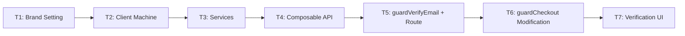

# Tasks: FE-1329

## Task Order



> **BE Dependencies:** Brand config key and code verification endpoint are TBD from ATBE-580. T1 is blocked until key is provided. T3 code-based service is blocked until endpoint is provided. All other tasks can be scaffolded with placeholders.

## Task 1: Consume Brand Email Verification Setting

⏳ **Blocked** — brand config key TBD from ATBE-580.

### Input State

- `useBrand` exists with `ensureConfig` pattern (see `guest/services.ts` L40 for reference)
- `BrandConfigKeys` enum exists in `@upmind-automation/types`

### Actions

1. Add the email verification enforcement key to `BrandConfigKeys` (key TBC from ATBE-580)
2. Add `enforceEmailVerification` computed to `useBrand`
3. Ensure the config is loaded at session init alongside existing keys

### Output State

- `useBrand().enforceEmailVerification` returns a boolean

| Complexity | Time Est |
| --- | --- |
| XS | 10 min |

---

## Task 2: Add `unverified` State to Client Machine

### Input State

- Task 1 complete (or placeholder key)
- `client.machine.ts` exists with flow: `loading → available`
- `guest.machine.ts` has existing 2FA challenge pattern (`challenging → verifying`) as reference

### Actions

1. Add `unverified` compound state to `client.machine.ts` between `loading` and `available`:
   - On `loading → onDone`: add guard `requiresEmailVerification` → target `unverified` (else → `available` as before)
   - `unverified` sub-states:
     - `idle` — show code input, await `VERIFY` event
     - `verifying` — invoke service to validate code (on success → `available`, on error → `idle`)
   - Events:
     - `VERIFY` from `idle` → `verifying` with `{ code: string }`
     - `CANCEL` from `idle` → re-check guard (if now verified → `available`, else stay)
2. Add guard: `requiresEmailVerification` — checks brand enforcement + `!client.primaryEmail.isVerified`
3. Add actions:
   - `notifyVerificationSuccess` → toast via `useFeedback` ("Email verified")
   - `notifyVerificationFailure` → toast via `useFeedback` (error message from BE)
   - `setError` / `clearError` — error management

### Output State

- Client machine has `loading → unverified → available` flow when enforcement is on
- Client machine has `loading → available` flow when enforcement is off or email is verified
- `useFeedback` toasts fire on success/failure

| Complexity | Time Est |
| --- | --- |
| M | 35 min |

---

## Task 3: Add Verification Services

### Input State

- Task 2 complete
- `send_verify` exists: `PATCH /clients/{id}/emails/{emailId}/send_verify`
- `check_verify` exists in vue-app: `PATCH /clients/{id}/emails/{emailId}/check_verify` with `{ reg_hash }`

### Actions

1. Add `checkVerifyEmail(clientId, emailId, regHash)` service — port from vue-app `verifyEmailAddress` action (`vue-app/src/store/modules/auth/client/index.ts` L372-398)
2. Add `verifyEmailCode(code)` service — ⏳ endpoint TBD from ATBE-580 (scaffold with placeholder)
3. Wire services to the `unverified` state machine invocations

### Output State

- Link-based verification works via `check_verify` endpoint
- Code-based verification is scaffolded (blocked on BE endpoint)

| Complexity | Time Est |
| --- | --- |
| S | 20 min |

---

## Task 4: Extend Composable API

### Input State

- Task 3 complete
- `useSession` has existing `verify2fa()` method and `show2fa` meta flag as reference

### Actions

1. Add meta flag:
   - `isUnverified` — true when client is in `unverified` state
2. Add method:
   - `verifyEmail({ code })` — sends `VERIFY` event with the code
3. JSDoc all new return properties

### Output State

- `useSession().meta.isUnverified` drives the UI
- `useSession().verifyEmail({ code })` submits the code

| Complexity | Time Est |
| --- | --- |
| S | 15 min |

---

## Task 5: Add `guardVerifyEmail` Funnel Service + Route

### Input State

- Task 4 complete
- `apps/cart/src/router/services.ts` exists with other guard services as reference
- `apps/cart/src/router/funnels/cart.ts` registers routes

### Actions

1. Register `ROUTE.VERIFY_EMAIL` in the route index (`/auth/verify-email`)
2. Add `guardVerifyEmail` funnel service to `services.ts`:
   - **Has hash param?** → call `checkVerifyEmail(client_id, email_id, hash)`
     - Success → toast via `useFeedback`, redirect to `returnUrl` (or fallback route)
     - Failure → toast error via `useFeedback`, resolve route (fall through to code form)
   - **No hash?** → check client state
     - `isUnverified` → resolve route (show code input form)
     - Already verified → reject, redirect to `returnUrl` (or fallback)
3. Register route + guard in `cart.ts` funnel machine
4. Define fallback route for missing `returnUrl` (dashboard/basket)

### Output State

- `/auth/verify-email` route registered and guarded
- Link-based verification auto-verifies from email link
- Code-based verification shows the form
- Already-verified clients are redirected away

| Complexity | Time Est |
| --- | --- |
| M | 30 min |

---

## Task 6: Modify `guardCheckout` for Email Verification

### Input State

- Task 5 complete
- `guardCheckout` exists in `apps/cart/src/router/services.ts` L566-638
- Existing `needsAuth` check provides the exact pattern to follow

### Actions

1. After the existing `needsAuth` check (L577-592), add `isUnverified` check:
   ```typescript
   const { meta: clientMeta } = useSession();
   if (clientMeta.value.isUnverified) {
     const returnUrl = router.resolve({ name: ROUTE.CHECKOUT }).fullPath;
     return Promise.reject({
       target: {
         name: ROUTE.VERIFY_EMAIL,
         query: { returnUrl }
       }
     } as FunnelResponse);
   }
   ```
2. Same `reject → redirect → returnUrl` pattern

### Output State

- Unverified clients are redirected to `/auth/verify-email?returnUrl=/checkout` when attempting checkout
- On successful verification, redirected back to checkout

| Complexity | Time Est |
| --- | --- |
| S | 10 min |

---

## Task 7: Create Verification UI

### Input State

- Task 6 complete
- 2FA modal UI exists as reference

### Actions

1. Create verification page/component for `/auth/verify-email` route:
   - **Heading:** "Verify your email address"
   - **Message:** "We've sent a verification code to your email. Enter it below to continue."
   - 6-digit code input field
   - "Continue" button → calls `verifyEmail({ code })` (sends VERIFY event)
   - "Resend code" link → calls `send_verify` directly from composable (60s cooldown)
   - **Non-dismissable** — no close/back/skip button
2. Create styles file with CVA
3. Handle error states (invalid code → show error from machine context, remain on form)
4. Handle loading states (verifying → show spinner on button)

### Output State

- Verification UI renders and accepts code input
- Submit and resend actions work
- Error/loading states handled

| Complexity | Time Est |
| --- | --- |
| M | 25 min |

---

## Verification (end-to-end)

Manual browser testing:

1. Enable email verification enforcement in brand org settings
2. Log in with unverified email → client enters `unverified` state, redirected to `/auth/verify-email`
3. Enter valid code → toast "Email verified", client transitions to `available`
4. Enter wrong code → error toast, remains on form
5. Click email verification link (another tab) → click CANCEL → re-checks, transitions to `available`
6. Click "Resend code" → new code sent (60s cooldown)
7. Try to checkout while unverified → `guardCheckout` redirects to `/auth/verify-email?returnUrl=/checkout`
8. After verification → redirected back to checkout
9. Log in with verified email → no interstitial, straight to `available`
10. Disable enforcement → no interstitial at any point
11. Visit `/auth/verify-email?hash=...&client_id=...&email_id=...` → auto-verifies via link

---

## Summary

| Task | Complexity | Time Est | Status |
| --- | --- | --- | --- |
| T1: Brand Setting | XS | 10 min | ⏳ Blocked (key TBD) |
| T2: Client Machine (`unverified` state) | M | 35 min | Ready (can use placeholder key) |
| T3: Services (`check_verify` + code TBD) | S | 20 min | Partial (link ready, code blocked) |
| T4: Composable API | S | 15 min | Ready |
| T5: `guardVerifyEmail` + Route | M | 30 min | Ready |
| T6: `guardCheckout` Modification | S | 10 min | Ready |
| T7: Verification UI | M | 25 min | Ready |
| **Total** | | **~145 min** | |
