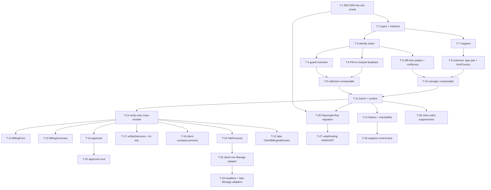

# client-address — Tasks

**Companion to** `requirements.md` (R1–R8 + **R10**, AC-1…AC-40), `design.md` (D-1…D-14), `parity.yaml` (8 cells, 99 rows, arms), `client-address.feature` (40 scenarios).
**Date:** 2026-08-14 (revision 2, + operator ruling **R10** applied) · **Seat:** planner · **Branch:** `feature/client-address-scoped-conversion` @ base `bff994868`

> **R10 changed three things in this file.** **T-6** inverted from *remove* the module's feedback to **PIN** it; **T-23 is DELETED** (tombstoned in place, number left vacant so every downstream reference stays stable); **T-13** absorbed the i18n verify-only check. AC-14 and AC-40 are now both proven by **T-6b**, at the module.

---

## 0. How to read this file

- Every task carries a **seat label** and a **Reality Check**. The seat that writes the code does **not** write its own assertions (ADR-021 §Principles).
- Tasks come in `Na` (**developer**, code-step) / `Nb` (**prover**, test-step) pairs. `parity.yaml`'s `task:` fields cite the bare number (`T-14`), meaning the pair.
- **Reality Check exclusions.** No task is satisfied by a mock-only assertion, by "it compiles" / bare `tsc`, or by the unit suite alone. The full exclusion list lives in `rules/verify-reality-check.md`.
- **`pnpm --filter @upmind-automation/headless type-check` exit 0 is a post-condition on EVERY task** (NFR-6) and is **never** the whole Reality Check. Under **R5** it is explicitly *necessary but not sufficient*.
- **Negative controls.** The **developer** authors each `*.must-fail.patch` (it knows the line it changed); the **prover** applies it blind, confirms the named assertion goes RED, reverts. A prover that reads module src to construct one has breached diff-blindness — route it back to the developer.
- **Fixtures are RECORDED**, never hand-authored: `pnpm --filter @upmind-automation/headless test:integration:record` (NFR-3). Fabricated-data-presented-as-recorded IS cosplay.

**Commands used below, all real and in `package.json`:**

| Alias | Command |
| --- | --- |
| `<int>` | `pnpm --filter @upmind-automation/headless test:integration` (add `-t "<test name>"` to target) |
| `<record>` | `pnpm --filter @upmind-automation/headless test:integration:record` |
| `<unit>` | `pnpm --filter @upmind-automation/headless test:unit` *(accompanies; never the whole proof)* |
| `<e2e>` | `pnpm test:e2e --grep "<title>"` |
| `<tc>` | `pnpm --filter @upmind-automation/headless type-check` |
| `<lint>` | `./node_modules/.bin/eslint packages/headless/src/modules/client-address` |
| `<quarantine>` | `pnpm quarantine:enforce` |

**The e2e suite runs only against `apps/cart`** (`tests/Playwright/scripts/run-e2e.sh` boots the test-mode cart server). That is a real constraint on `apps/cart-nuxt` and `playgrounds/labs` and is confronted per-task, not papered over — see T-20, T-24 and `review-notes.md` §6.

---

## 1. Task order

**T-1 is a hard prerequisite for the whole run.** It records the oracle; a task that edits `address-setup.ts` before T-1 has destroyed the thing it is graded against.

---

## 2. Tasks

### Phase 0 — record the oracle

## Task T-1: Record the Playwright address flow's current outbound requests — seat: prover

- **Reality Check:** `<e2e>` with `--grep "Existing Address - Billing Details at checkout"` and `--grep "Round-trip: update address on billing page"`, run with request logging on, produces a committed capture of every outbound `clients/*/addresses*` request (method, URL, body) **from the unmodified tree**. The capture is a file under `__tests__/fixtures/` and is the diff target for AC-38. **Asserting the specs pass is not the deliverable — the recording is.**
- **Blocks:** every other task.

### Input State
- [ ] Working tree is clean at `bff994868`; `<tc>` exits 0 (§3 baseline)
- [ ] `tests/Playwright/e2e/support/flows/address-setup.ts` is **unmodified**

### Actions
1. Run the two named specs against the unmodified tree with outbound-request capture.
2. Commit the capture under `packages/headless/src/modules/client-address/__tests__/fixtures/`.

### Output State
- [ ] A committed pre-migration request recording exists
- [ ] `parity.yaml` row `C16` names it

---

### Phase 1 — types

## Task T-2a: Scope matrices, context enums, `verifiedLevel` — seat: developer

- **Reality Check:** `<int> -t "scope matrix"` — an integration spec resolves `useClientAddresses().as(ScopeActorTypes.CLIENT)` and `useClientAddressManager().as(CLIENT).for(ADDRESS, id)` against a recorded fixture and both mint a scope. Type-check alone is **not** the proof; the read-back is that a scope resolves and issues its request.
- **Rows:** CELL-1…CELL-8, L7 · **ACs:** AC-32, AC-33, AC-34

### Input State
- [ ] T-1 complete

### Actions
1. `packages/headless/src/modules/client-address/client-address.types.ts` — add `ClientAddressesContextTypes`, `ClientAddressContextTypes`, `CLIENT_ADDRESSES_SCOPE_MATRIX`, `CLIENT_ADDRESS_SCOPE_MATRIX` (`design.md` §1). `SELF`/`STAFF`/`GUEST` are `null as never`.
2. Add `Address.verifiedLevel: IAddress["verified"]` (D-7). Do **not** change `meta.isVerified`.
3. **Do NOT** add `staged_import`, `meta.isStaged`, or any `with_staged_imports` param (R8g, row `N2`).

### Output State
- [ ] Both matrices exist with the exact shape of `client-company.types.ts:57–62, 81–86`
- [ ] `<tc>` exits 0

## Task T-2b: Prove staff and guest are compile-time errors — seat: prover

- **Reality Check:** `<int> -t "scope matrix"` green, **plus** `<unit>` running `client-address.surface.test.ts` whose `@ts-expect-error` assertions on `.as(STAFF)` and `.as(GUEST)` fail the suite if the error disappears. The integration half is the non-unit proof; the type-level half is the discriminator.
- **ACs:** AC-33, AC-34, AC-32

### Actions
1. Author `__tests__/client-address.surface.test.ts` type-level assertions.
2. Author the `verifiedLevel` read-back in `__tests__/client-address.mappers.test.ts` at `verified: 2` and `verified: null` (fed by T-7).

---

### Phase 2 — services

## Task T-3a: One `resolveClientId` identity seam — seat: developer

- **Reality Check:** `<int> -t "scope identity"` — the manager is opened for an address, the session's `activeUser` is cleared mid-flight, and the captured `PUT` URL **still** carries the scope-resolved client id. **The proof is the request URL plus the `Authorization` header (which token) and the absence of an acting-as header — never the response payload.**
- **Rows:** W12, L10 · **ACs:** AC-2, AC-30 · **Pre-change: RED**

### Input State
- [ ] T-2a complete

### Actions
1. `client-address.services.ts` — add `resolveClientId(scopeContext)` (pattern `client-email.services.ts:63–80`). Route `loadList`, `loadOne`, `add`, `update`, `remove`, `setDefault`, `ensure` and `loadLookups` through it. Today each re-reads the session independently at `:43, :134, :150, :196, :229`.
2. `useClientAddressManager.ts` — seed machine context from the seam, never from `activeUser`. **Remove the `clientId` parameter** from the signature (PR-2 / D-3): a parameter that claims retargeting and does not retarget is cosplay.
3. Author `client-address.scope-identity.must-fail.patch` — make one request re-read the session instead of the seam.

### Output State
- [ ] No call site in the module reads the session directly for a client id
- [ ] `<tc>` exits 0

## Task T-3b: Prove the request is retargeted and the identity transported — seat: prover

- **Reality Check:** `<int> -t "scope identity"` green against **recorded** fixtures; then apply `client-address.scope-identity.must-fail.patch` **blind**, confirm the assertion goes RED, revert.
- **ACs:** AC-2, AC-30

### Actions
1. Author `__tests__/client-address.scope-identity.int.test.ts` asserting the URL segment, the selected session token, and the absence of acting-as headers.
2. Apply / verify RED / revert the developer's patch. **Do not read module src to construct it.**

## Task T-4a: Fix the inverted auth guards — seat: developer

- **Reality Check:** `<int> -t "auth guard"` — with `isAuthenticated === false` **and** `clientId === undefined`, `remove(id)` and `setDefault(id)` leave the request-capture log **EMPTY**. Asserting a rejection surfaced **does not discriminate** and is rejected as a proof.
- **Rows:** L1, A14, A15 · **ACs:** AC-3, AC-11, AC-13 · **Pre-change: RED**

### Actions
1. `client-address.services.ts:203` and `:236` — replace `if (isAuthenticated.value || !clientId.value)` with the correct `&&` + positive `!!clientId` form used by the siblings at `:54`, `:137`, `:153`.
2. Author `client-address.auth-guard.must-fail.patch`, `client-address.default-guard.must-fail.patch`, `client-address.client-id-limb.must-fail.patch`.

## Task T-4b: Prove NO request is issued — seat: prover

- **Reality Check:** `<int> -t "auth guard"` green; the assertion is on an **empty capture log**, not on a rejection. Apply all three must-fail patches blind, confirm each flips its named AC RED, revert.
- **ACs:** AC-3, AC-11, AC-13

### Actions
1. Author `__tests__/client-address.auth-guard.int.test.ts`.
2. Record the **pre-change RED** run before T-4a lands, as evidence the read-back discriminates.

## Task T-5a: Diff-only update body + the second brand-config key — seat: developer

- **Reality Check:** `<int> -t "diff-only"` — load an existing address, change **only** `city`, save; the captured `PUT` body has **exactly** the changed key(s) and **does not contain** `country_id`. Asserting the request succeeded does not discriminate.
- **Rows:** L3, W5, W11, M8, M12 · **ACs:** AC-23 · **Pre-change: RED**

### Actions
1. `client-address.services.ts:157–162` — hold a clone taken at open and send only the delta (legacy shape: `addEditClientAddressModal.vue:220–224`).
2. `client-address.services.ts:92–95` — add `CLIENT_ALLOW_ADDRESS_UPDATE` to the `ensureConfig` key list.
3. Author `client-address.diff-payload.must-fail.patch`.

## Task T-5b: Prove the wire body is a diff — seat: prover

- **Reality Check:** `<int> -t "diff-only"` green over **recorded** fixtures; apply the patch blind, confirm AC-23 RED, revert.
- **ACs:** AC-23

## Task T-6a: PIN the module's own feedback through the conversion — seat: developer

> **Operator ruling R10 inverted this task.** Revision 2 had it *removing* the in-module feedback (design decision D-14). R10 overturned that: **feedback stays in the module.** The task is now a preservation task — the conversion's four-layer split must not drop the raises on the floor.

- **Reality Check:** `<int> -t "address feedback"` — over recorded fixtures, `remove(id)` on success lands **exactly one** success entry carrying `confirm.address_removed`, and on a forced 422 **exactly one** error entry carrying `error.client_address_update_failed`; `setDefault(id)` likewise lands `confirm.address_set_default` / `error.client_address_set_default_failed`. Asserted **with no consumer subscribed**, and the consumer promise chain is **not** rejected.
- **Rows:** F1, F2, A14, A15 · **ACs:** AC-14, AC-40 · **Ruling:** R10 · **Decision:** D-14 (overturned)

### Actions
1. `client-address.services.ts` — **keep** the `useFeedback` import (`:4`) and all four raises (`:210, :220, :244, :254`) intact through the layer split. They move file only if the services factory moves; their behaviour does not change.
2. **Delete no i18n key and add none.** All four are already present in **all 28 locales** (verified at Plan) — `confirm.address_removed`, `confirm.address_set_default`, `error.client_address_update_failed`, `error.client_address_set_default_failed`.
3. **Do not** add a consumer-side raise anywhere (T-22, T-24) — the module already raises, and a second raise would double every message.
4. Author `client-address.feedback.must-fail.patch` — drop the `onSuccess` raise from `remove`. `client-company` ships the equivalent control (`client-company.feedback.must-fail.patch`).

## Task T-6b: Prove the feedback survives the conversion — seat: prover

- **Reality Check:** `<int> -t "address feedback"` green on all four paths (remove success/failure, setDefault success/failure). Apply `client-address.feedback.must-fail.patch` blind, confirm AC-40 goes RED, revert.
- **ACs:** AC-14, AC-40

---

### Phase 3 — mappers

## Task T-7a: `description` field set + `verifiedLevel` + drop the `type` hardcode — seat: developer

- **Reality Check:** `<int> -t "mapped address reads"` over a **recorded** fixture whose row carries `address_1`, `address_2`, `city`, `state`, `postcode`, `region.name`, `country.name` — `description` contains all seven **in that order** and no `street` lookup remains. (`<unit>` `mappers.test.ts` accompanies; it is not the whole proof.)
- **Rows:** L2, L7, L5 · **ACs:** AC-31, AC-32, AC-22 (partial) · **Pre-change: RED**

### Actions
1. `client-address.mappers.ts:20–29` — compose `address_1, address_2, city, state, postcode, region.name, country.name`; delete the dead `street` `get()`. Separator stays `", "` (legacy's `",\n"` is presentation, explicitly not claimed).
2. `:47` — keep `meta.isVerified: !!raw.verified`; **add** `verifiedLevel: raw.verified`.
3. `:62` — **delete** the `type: 1` hardcode in `mapIAddressData`; carry the model's `type`.
4. Add the line-1 `/** @internal */` marker (already present — verify it survives).
5. Author `client-address.description-order.must-fail.patch` and `client-address.address-type.must-fail.patch`.

## Task T-7b: Prove the address reads like the portal's — seat: prover

- **Reality Check:** `<int> -t "mapped address reads"` green; apply both patches blind, confirm AC-31 and AC-22 RED, revert.
- **ACs:** AC-31, AC-32

---

### Phase 4 — schemas

## Task T-8a: Restore the `type` control (pair) and add `lockCountry` — seat: developer

- **Reality Check:** `<int> -t "address form lookups"` — (a) on an **existing** address with `CLIENT_ALLOW_ADDRESS_UPDATE === false`, the brand-config request included that key **and** `useContext().uischema`'s country control carries the disabled/read-only rule; on a new address it does not. (b) The context schema exposes `type` with four options; setting `type: 3` puts `type: 3` in the captured `PUT` body.
- **Rows:** X8, L4, L5, X2, W11 · **ACs:** AC-20, AC-21, AC-22 · **Pre-change: RED**

### Actions
1. `client-address.schemas.ts:110–121` — un-comment the `type` property **and** add a matching `Control` to `useUischemaDefinitions`. Schema without control ships a required-but-invisible input (D-12, the pair law).
2. Add a `config` key to `useUischemaDefinitions`'s `Partial<AddressContext>` destructure and gate the country control's read-only rule on `id && config[CLIENT_ALLOW_ADDRESS_UPDATE] === false`. **Additive only** — all four cross-module callers pass object literals into a `= {}` default (`client-company.schemas.ts:134, 247`; `unified/schemas.ts:42, 68, 106`), so none breaks.
3. Swap the file's line-1 `/** @internal */` for `@public @schema-fragment` (D-6, R7).
4. Author `client-address.lock-country.must-fail.patch`.

## Task T-8b: Prove the lock and the type control — seat: prover

- **Reality Check:** `<int> -t "address form lookups"` green over recorded lookup fixtures; apply the patch blind, confirm AC-21 RED, revert.
- **ACs:** AC-20, AC-21, AC-22, AC-27

---

### Phase 5 — the collection composable

## Task T-9a: Convert `useClientAddresses` to the scoped four-layer shape — seat: developer

- **Reality Check:** `<int> -t "client addresses collection"` — one outbound `GET clients/<scopeClientId>/addresses?with=region,country` per scope; `data` maps one row per fixture row; `default()` returns the default row's **id string**; `findOne({address:{city}})` matches; with a never-settling list, `isReady()` resolves `false` **within the bound** and leaves no scheduled interval.
- **Rows:** A1–A16, L6, L8, A4 · **ACs:** AC-1, AC-4…AC-10, AC-12, AC-14, AC-15 · **Pre-change: RED** on AC-4, AC-5, AC-7

### Actions
1. Split into `useClientAddresses.ts` + `.actions.ts` + `.context.ts` + `.meta.ts` + `.internals.ts` via `createScopedComposable` (`client-phone/useClientPhones.ts:6, 83` is the live shape). Mint the query **once at construction**, never inside a layer factory.
2. `context.default` → `getDefaultId()` (`getDefault()?.id`), exactly `client-company/useClientCompanies.context.ts:40–41, 69` (**R5 / D-4**).
3. `actions.isReady` → `whenSessionSettles()` then `whenListFetched()` (`client-company/useClientCompanies.actions.ts:92–96`). **Delete** the `setInterval` at `:42–51`.
4. Contain `findOne` locally with a deep-partial match on nested plain objects (`client-phone/useClientPhones.context.ts:49–68`). **Do not edit the shared `useCollection` helper.** Correct the false JSDoc at `:143–145`.
5. Wrap `nextPage` / `prevPage` in `async` so a forced call past the end settles.
6. Author `client-address.default-id.must-fail.patch`, `client-address.readiness-bound.must-fail.patch`, `client-address.find-one.must-fail.patch`.

### Output State
- [ ] No `.{actor}.ts` arm file exists — the module is **armless** (`parity.yaml` `arms:`); the developer seat re-derives this independently and **a mismatch halts the run**
- [ ] `<lint>` clean (`scope-based/complete-layer-set`, `no-self-branch`, `no-cosplay-arm`)

## Task T-9b: Prove every collection behaviour — seat: prover

- **Reality Check:** `<int> -t "client addresses collection"` and `<int> -t "client addresses filters"` green over **recorded** fixtures (`<record>` to capture). `default()` is asserted `=== <id string>` and `typeof === "string"` — asserting truthiness does not discriminate between the id and the row. Apply the three patches blind, confirm AC-5 / AC-4 / AC-7 RED, revert.
- **ACs:** AC-1, AC-4, AC-5, AC-6, AC-7, AC-8, AC-9, AC-10, AC-12, AC-14, AC-15

---

### Phase 6 — the manager composable

## Task T-10a: Convert `useClientAddressManager` + the typed machine-config factory — seat: developer

- **Reality Check:** `<int> -t "client address manager"` — `.fresh()` issues **no** `GET …/addresses/<id>` and seeds the brand's default country; `.for(ADDRESS, id)` loads the mapped row; changing country issues a regions request for the new country and clears an out-of-country `regionId`; a missing `postcode` leaves the capture log **empty**; with the lookup chain stalled, `isReady()` settles within the bound.
- **Rows:** M1–M19, L6, L9, D-9 · **ACs:** AC-15…AC-19, AC-24…AC-29

### Actions
1. Split into the five manager files; key the interpreter by **scope key**, not entity id.
2. `useClientAddressManager.machine.ts` — one `createClientAddressMachineConfig(service): Parameters<typeof dataManagerMachine.withConfig>[0]`, absorbing `actions.ts`, replacing the three `as any` casts at `:56–58`. **The schemas stay context-derived** — `useSchema(context)` / `useUischema(context)` consume `countries`, `regions`, `config`, `id`; this is a genuine Δ from `client-email`'s static `setSchemas`. **Expect design, not transcription.**
3. Replace `waitFor(…, { timeout: Infinity })` at `:90–93` with a bounded wait whose expiry is a catchable `DetailedError`.
4. **Delete** `actions.ts` and `client-address.utils.ts`.
5. `dataManagerMachine` and every `*.machine.ts` under `data-manager/**` are **read-only** (NFR-4). A test disagreeing with the machine presumes the **test** wrong; genuine machine evidence **stops and asks the operator**.
6. Author `client-address.manager-amputation.must-fail.patch`.

## Task T-10b: Prove every editor behaviour — seat: prover

- **Reality Check:** `<int> -t "client address manager"`, `<int> -t "client address mutations"` and `<int> -t "address form lookups"` green over recorded fixtures. Apply the amputation patch blind, confirm AC-23 and AC-24 RED, revert.
- **ACs:** AC-15…AC-19, AC-24…AC-29

---

### Phase 7 — the barrel

## Task T-11a: Curated barrel; retire `useClientAddressServices` — seat: developer

- **Reality Check:** `<int> -t "module surface"` — a spec importing **only** from `packages/headless/src/modules/client-address` exercises the collection and the manager end-to-end against recorded fixtures. Plus a tree grep asserting no file outside the module imports `client-address.services` or `client-address.mappers` by deep path.
- **Rows:** A16, C19, C20 · **ACs:** AC-35, AC-36 · **Rulings:** R4, R6, R7

### Actions
1. Rewrite `index.ts` to the curated list in `design.md` §3. **Delete all three `export *` lines** (`:1–3`).
2. **Delete** `export { useClientAddressServices }` (`:5`) — retired, not deprecated. A `@deprecated` re-export was tried and collapsed under type-check; **do not revive it** (R4 supersedes PR-1).
3. **Keep** `mapAddress` (R6) and `useSchemaDefinitions` / `useUischemaDefinitions` (R7). The parsers `useSchema` / `useUischema` stay internal.
4. Replace the module's top-level `README.md` with `docs/README.md` (Docs stage authors the six artifacts).

## Task T-11b: Pin the public surface exactly — seat: prover

- **Reality Check:** `<int> -t "module surface"` green. The surface spec asserts the barrel's export set **exactly equals** the declared list, that `useClientAddressServices` is **absent**, and that every exported symbol is reachable — specifically that `AddressTypes` / `ADDRESS_TYPE_KEYS` are consumed by the live `type` control (AC-22), and that the manager signature no longer takes `clientId`.
- **ACs:** AC-35, AC-36

---

### Phase 8 — the feature file

## Task T-12: Co-locate the feature and enforce traceability — seat: prover

- **Reality Check:** `<unit>` running `__tests__/client-address.traceability.test.ts`, which reads the **co-located** `__tests__/client-address.feature` and fails **both ways**: a non-`@todo` scenario with no proving test fails, and a test naming an AC the feature does not tag fails. Accompanied by the full `<int>` run, which is the non-unit half.
- **ACs:** all 40

### Actions
1. Copy `docs/story-bundles/client-address/client-address.feature` to `packages/headless/src/modules/client-address/__tests__/client-address.feature`. **The co-located copy is the source of truth.** Nothing in the suite reads a planning artefact.
2. Author `client-address.traceability.test.ts` (mirror `client-company/__tests__/client-company.traceability.test.ts`).

---

### Phase 9 — cross-module verification (no edit)

## Task T-13: Verify the untouched-by-necessity consumers — seat: developer

- **Reality Check:** `<int>` full run green **and** `<tc>` exit 0 **with zero edits** to the five type-only importers, to `unified/schemas.ts`, and to any locale file. A grep proves `unified/schemas.ts:2–5` still reaches the **barrel**, not a deep path; that no new `eslint-disable @internal/no-cross-module-imports` was added anywhere; and that `git status --porcelain packages/i18n` is **empty**. (Type-check alone is not the proof — the full integration run through `unified` is.)
- **Rows:** C18, C19, C20

### Actions
1. Verify no edit is needed at `modules/index.ts:12`, `system-places.types.ts:1`, `unified/types.ts:1`, `client-company.types.ts:30`, `invoices.types.ts:4`.
2. Verify `client-company.schemas.ts:134, 247` and `unified/schemas.ts:42, 68, 106` still compile against T-8a's **additive** `config` parameter.
3. `invoices/` is **untouched-by-necessity** (R6). Its deep import of `client-address.types` is pre-existing and is **not** widened.
4. **Row `C18` (R10).** Verify all four feedback keys resolve in **all 28 locales** — `confirm.address_removed`, `confirm.address_set_default`, `error.client_address_update_failed`, `error.client_address_set_default_failed` — and that **no locale file was touched**. Under R10 the module keeps raising its own feedback, so there is no i18n work; this step exists so the absence of an edit is verified rather than assumed.

---

### Phase 10 — consumer migration (R3). One task per site, each with its own Reality Check.

> **R5 warning, restated on every task in this phase.** After R5, `defaultAddress()` **is** the id and `?.id` yields `undefined` — and **this still type-checks**, because `string | undefined` flows into `addressId` exactly as `Address | undefined ?. id` did. `<tc>` exit 0 is a post-condition, **never** the Reality Check.

## Task T-14a: `BillingForm.vue` — seat: developer

- **Reality Check:** `<e2e> --grep "Inline billing form shown when standalone is disabled"` **and** `<e2e> --grep "Summary displays selected address"` — the inline billing form renders and shows the client's saved address.
- **Rows:** C1, C2 · **ACs:** AC-37

### Actions
1. `packages/client-vue/src/modules/billing/components/BillingForm.vue:179` → `useClientAddresses().as(ScopeActorTypes.CLIENT).useActions().isReady()`.
2. `:198–203` → layer split for `getOne` / `meta`. **Remove** the unused `default: _defaultAddress` binding — do not carry it (NFR-1).

## Task T-14b: Prove the inline billing form still resolves an address — seat: prover
- **Reality Check:** both named e2e greps green.

## Task T-15a: `BillingSummary.vue` — seat: developer

- **Reality Check:** `<e2e> --grep "Summary displays selected address"` **and** `<e2e> --grep "BillingSummary card is visible at checkout"`.
- **Rows:** C3, C4 · **ACs:** AC-37

### Actions
1. `:191` → `.as(CLIENT).useActions().isReady()`; `:198` → `.as(CLIENT).useContext().getOne`.

## Task T-15b: Prove the summary still renders the right address — seat: prover
- **Reality Check:** both named e2e greps green.

## Task T-16a: `TabPersonal.vue` — the four `defaultAddress()` sites — seat: developer

- **Reality Check:** `<e2e> --grep "Continue button is rendered once the client has at least one saved address"` — proves the **default-address** path resolves to a real address rather than `undefined`. Plus `<e2e> --grep "Round-trip: update address on billing page"`.
- **Rows:** C5 · **ACs:** AC-37, AC-39 · **THE HIGHEST-RISK TASK IN THE STORY**

### Actions
1. `:139–144` → `.as(CLIENT)` + layer split.
2. `:224` `defaultAddress()?.id` → `defaultAddress()`.
3. `:227` `find(addresses.value, ["id", val]) ?? defaultAddress()` → `?? getAddress(defaultAddress())`. **Today this returns a row-or-id union; unmigrated after R5 it returns row-or-STRING and type-checks.**
4. `:257` and `:269` → `defaultAddress()` without `?.id`.

## Task T-16b: Prove each of the four sites resolves a real address — seat: prover

- **Reality Check:** the two named e2e greps green, **plus** an assertion that the billing model's `addressId` equals the seeded default row's id — not `undefined`. A passing type-check is explicitly rejected as the proof for this task.
- **ACs:** AC-37

## Task T-17a: `basket-billing/unified/services.ts` + its integration test — seat: developer

- **Reality Check:** `<int> -t "unified"` — the existing `unified.int.test.ts` suite green after the mock is re-pointed, **plus** `<e2e> --grep "Existing Address - Billing Details at checkout"`.
- **Rows:** C6, C7, C8, C15 · **ACs:** AC-15, AC-35, AC-37

### Actions
1. `:48–52` → `.as(CLIENT)` + layer split; `:97` `defaultAddress()?.id` → `defaultAddress()`.
2. `:136` → `useClientAddresses().as(CLIENT).useActions().ensure` (**R4**); drop the `:5` import.
3. `:311` → `.as(CLIENT).useActions().invalidate`.
4. `__tests__/unified.int.test.ts:83` — re-point the by-name `useClientAddressServices` mock at the scoped surface. **This breaks the instant R4 lands.**

## Task T-17b: Prove the unified billing path still ensures and invalidates — seat: prover
- **Reality Check:** `<int> -t "unified"` green **plus** the named e2e grep green.

## Task T-18a: `client-company.services.ts` — address call sites only — seat: developer

- **Reality Check:** `<int> -t "client company lookups"` and `<int> -t "client company mutations"` green, **plus** `<e2e> --grep "Round-trip: add company on billing page"`.
- **Rows:** C9, C10 · **ACs:** AC-35, AC-37

### Actions
1. `:506–510` → `.as(CLIENT)` + layer split; `:559` and `:561` → `defaultAddress()` without `?.id`.
2. `:222` → `.as(CLIENT).useActions().ensure` (**R4**); drop the `:7` import.
3. **NFR-8:** touch nothing else in `client-company/`. Its own conversion is not revisited.

## Task T-18b: Prove company creation still seeds an address — seat: prover
- **Reality Check:** both `<int>` greps and the named e2e grep green.

## Task T-19a: `apps/cart` funnel engine — seat: developer

- **Reality Check:** `<e2e> --grep "Existing Address - Billing Details at checkout"` — the funnel auto-selects the seeded default address at `:155`.
- **Rows:** C11 · **ACs:** AC-37

### Actions
1. `apps/cart/src/router/funnels/engine/services.ts:134–135` → `.as(CLIENT)` + layer split; `:155` `defaultAddress()?.id` → `defaultAddress()`.

## Task T-19b: Prove the cart funnel preselects the default address — seat: prover
- **Reality Check:** the named e2e grep green, asserting the preselected address is the seeded row.

## Task T-20a: `apps/cart-nuxt` funnel engine — seat: developer

- **Reality Check:** `diff apps/cart/src/router/funnels/engine/services.ts apps/cart-nuxt/app/funnels/engine/services.ts` exits **0 (empty)**. **Verified at Plan: the two files are byte-identical today.** The behaviour itself is proven by T-19b's e2e; this check proves cart-nuxt received the *identical* edit. Stated plainly: **the e2e suite runs only against `apps/cart`** (`run-e2e.sh` boots the test-mode cart server), so cart-nuxt has no independent runtime proof in this repo — byte-identity to a behaviourally-proven twin is the honest strongest available check, and it is recorded as such in `review-notes.md` §6.
- **Rows:** C12 · **ACs:** AC-37

### Actions
1. Apply T-19a's edit verbatim to `apps/cart-nuxt/app/funnels/engine/services.ts:134–135, :155`.

## Task T-20b: Prove the twin is still a twin — seat: prover
- **Reality Check:** the `diff` exits 0 **and** T-19b's e2e is green on the same commit.

## Task T-21a: `playgrounds/labs/.../ClientBillingAddresses.vue` — seat: developer

- **Reality Check:** see T-24 — the labs pages share the adapter shape T-22 proves by e2e. This task's own check is `pnpm --filter @upmind-automation/labs type-check` exit 0 **plus** a structural diff showing the migrated expression matches the e2e-proven `client-vue` form. Recorded as a **weaker proof than every other consumer task** (`review-notes.md` §6) — labs has no test harness in this repo.
- **Rows:** C13 · **ACs:** AC-37

### Actions
1. `:94–95` → `.as(CLIENT)` + layer split; `:99` `ref(defaultAddress()?.id)` → `ref(defaultAddress())`.

## Task T-21b: Confirm the labs expression matches the proven form — seat: prover
- **Reality Check:** the structural diff against the T-16-migrated `client-vue` expression is empty in shape, and the labs type-check is green.

---

### Phase 11 — the `Manage` renderer adapters (D-13)

> **Z7 — the compiler cannot help here.** `MinimalListComposable = (...args: any) => …` (`manage/types.ts:15`) and all four value-pass sites sit inside `as any` casts. Handing the renderer an unadapted scope builder **compiles cleanly and fails at runtime**. Every Reality Check in this phase is a **rendered** read-back.

## Task T-22a: `TabPersonal.vue` address adapters — seat: developer

- **Reality Check:** `<e2e> --grep "Can add new address on billing page"` **and** `<e2e> --grep "Round-trip: update address on billing page"` — the address list renders, an address is added, and an edit reaches the wire (that spec already asserts the `PUT` payload at `update-billing-details.spec.ts:236–245`).
- **Rows:** C14, M19 · **ACs:** AC-39

### Actions
1. Add `useAddressListForManage()` / `useAddressManagerForManage(id?)` beside the existing `usePhoneListForManage` (`:163–200`), modelled on `TabBusiness.vue:172–248`.
2. `default: () => getAddress(defaultAddressId())` — the adapter **re-hydrates to a ROW**, because `Select.vue:97` reads `defaultItem()?.id`.
3. Map `stop` → `destroy`, or every opened address leaks a registry entry holding a live TanStack observer (`TabBusiness.vue:242–246`).
4. Point `:24–25` at the adapters.
5. **Do not edit `packages/client-vue/src/components/manage/**`** — the shared renderer is consumed, not changed.
6. **Add NO feedback raise (R10).** The module already raises `confirm.address_removed` / `confirm.address_set_default` and their error counterparts; a consumer-side raise on top would double every message. This is the one place the address adapters deliberately differ from `TabBusiness.vue:183–199`, whose company equivalents *do* raise because `client-company` moved feedback out of its module.

## Task T-22b: Prove the billing tab still manages addresses — seat: prover
- **Reality Check:** both named e2e greps green, including the existing `PUT`-payload assertion. **AC-39 explicitly may not be discharged by a type-check.**
- **ACs:** AC-39

## ~~Task T-23: Consumer feedback obligation + i18n~~ — **DELETED by operator ruling R10**

> **Tombstone. Do not resurrect; do not renumber around it.**
>
> This task existed only to discharge revision 2's design decision **D-14**, which moved the module's toasts to the consumer. **R10 overturned D-14 — feedback stays in the module** (`requirements.md` §4 R10, `design.md` D-14). With the relocation withdrawn there is nothing for this task to do:
>
> - **No consumer-side raise.** The module already raises; a second raise would double every message. T-22 and T-24 explicitly acquire **no** feedback obligation.
> - **No i18n work.** Measured at Plan, all four keys already exist in **all 28 locales** — `confirm.address_removed`, `confirm.address_set_default`, `error.client_address_update_failed`, `error.client_address_set_default_failed`. Row `C18` is now untouched-by-necessity, verified by **T-13**.
> - **AC-40 moved, not dropped.** It is now proven at the module by **T-6b**, which is both a stronger read-back (it catches a regression in any of the eight consumers, not one) and a cheaper one (integration, not e2e).
>
> The number is left vacant so every downstream reference in `parity.yaml`, `review-notes.md` and the Task Order graph stays stable.

## Task T-24a: Headless + labs `Manage` adapters — seat: developer

- **Reality Check:** for `client-company.schemas.ts:256–257`, `<e2e> --grep "Round-trip: add company on billing page"` — the company form's embedded address control renders and saves. For the two labs pages, the structural diff against T-22's e2e-proven adapter plus `pnpm --filter @upmind-automation/labs type-check` (recorded as the weaker proof, `review-notes.md` §6).
- **Rows:** C14 · **ACs:** AC-39

### Actions
1. `client-company/client-company.schemas.ts:256–257` — adapters, in the file's existing `useCompanyEmailList` style (`:56–60`). **This is the only `client-company` file this story touches besides its services address call sites** (NFR-8).
2. `playgrounds/labs/src/pages/client/Addresses.vue:8–9, 24–25` and `playgrounds/labs/.../ClientBillingAddresses.vue:14–15` — the same adapters.
3. **Add NO feedback raise (R10)** — as T-22a action 6.

## Task T-24b: Prove the embedded address control still works — seat: prover
- **Reality Check:** the named e2e grep green; labs verified by structural diff + type-check.

---

### Phase 12 — acceptance, ledger, handoff

## Task T-25a: Migrate the Playwright address seeding flow — seat: developer

- **Reality Check:** `<e2e> --grep "Existing Address - Billing Details at checkout"` and `<e2e> --grep "Round-trip: update address on billing page"` green, **and** the outbound `clients/*/addresses*` requests diffed against **T-1's pre-migration recording** with every divergence explained on a parity row before the task is done.
- **Rows:** C16 · **ACs:** AC-38 · **Requires:** T-1

### Actions
1. `tests/Playwright/e2e/support/flows/address-setup.ts:42, 59` — replace `window.Upmind.useClientAddressManager(undefined, { clientId })` with the scoped surface. The `clientId` parameter no longer exists (T-3a).
2. Check `order-billing-setup.ts:3` and `flows/index.ts:1` still resolve.

## Task T-25b: Prove the seeded journey is unchanged — seat: prover
- **Reality Check:** both e2e greps green **and** the request diff against T-1 is empty or fully explained.
- **ACs:** AC-38

## Task T-26: Retire the grandfathered `any` suppressions — seat: developer

- **Reality Check:** `<lint>` clean **and** `pnpm lint:verify` green with `eslint-suppressions.json:477–486` **deleted**, not re-ledgered. Accompanied by the full `<int>` run, which is the non-unit half.
- **Rows:** C17 · **ACs:** AC-36

### Actions
1. Delete both `client-address` blocks (11 entries) from `eslint-suppressions.json`. The typed machine-config factory (T-10a) removed the casts. `client-company` retired 13 equivalent lines — **do not re-ledger**.

## Task T-27: velia / hosting submodule HANDOFF — seat: developer (record only, NO EDIT)

- **Reality Check:** `grep -n "useClientAddresses" apps/velia/src/router/funnels/engine/services.ts apps/hosting/src/router/funnels/engine/services.ts` still returns the **unmodified** `:18` and `:135` lines, proving nothing in this branch touched them; and `git status --porcelain apps/velia apps/hosting` is **empty**.
- **Rows:** C21 · **ACs:** AC-37 (out-of-scope half)

> ### ⚠ HANDOFF — DO NOT SOFTEN, DO NOT EDIT
>
> `apps/velia/src/router/funnels/engine/services.ts` and `apps/hosting/src/router/funnels/engine/services.ts` are **git submodules with their own remotes** (`.gitmodules`: `velia-checkout.git`, `hosting.com-checkout.git`). Operator ruling **R3 part 2** puts them out of scope; the operator lands a follow-up commit, precedent `39521e4a5`.
>
> **AFTER THIS BRANCH MERGES, BOTH FUNNEL ENGINES WILL NOT TYPE-CHECK UNTIL THAT FOLLOW-UP LANDS.**
>
> They break in **two** ways at once:
> 1. `useClientAddresses()` at `:135` no longer returns the flat surface — **the compiler catches this**.
> 2. `defaultAddress()?.id` at `:155` silently yields `undefined` under R5 — **the compiler does NOT catch this**.
>
> The follow-up must fix **both**. Fixing only the signature leaves a live, type-clean, wrong-behaviour bug in two checkout funnels.

### Actions
1. **No code change.** Confirm the two files are untouched and record the handoff in the merge request description verbatim from this box.

## Task T-28: Run the negative-control lane — seat: prover

- **Reality Check:** `<quarantine>` green with **all thirteen** `*.must-fail.patch` controls registered (`design.md` §7). No story reaches Linear **Needs Review** without it (NFR-7).

### Actions
1. Confirm each control was applied blind, flipped its named AC RED, and was reverted.
2. Confirm no control was authored by the seat that verifies it (NFR-5).

---

## 3. Per-AC executable-proof vetting sweep (planner seat, Step 7)

Every AC in `requirements.md` maps to at least one task bearing a Reality-Check-compliant, **non-unit** proof. **No AC is parked, deferred, or split out on effort grounds.**

| AC | Proving task(s) | Proof kind |
| --- | --- | --- |
| AC-1 | T-9b | `<int>` request + mapped data |
| AC-2 | T-3b | `<int>` URL + auth transport |
| AC-3 | T-4b | `<int>` **empty** capture log |
| AC-4 | T-9b | `<int>` bounded settle + no scheduled timer |
| AC-5 | T-9b | `<int>` `=== id string` |
| AC-6 | T-9b | `<int>` deep-equal |
| AC-7 | T-9b | `<int>` nested-partial match (pre-change RED) |
| AC-8 | T-9b | `<int>` second request with filter |
| AC-9 | T-9b | `<int>` offset/limit params + settled rejection |
| AC-10 | T-9b | `<int>` DELETE + invalidation |
| AC-11 | T-4b | `<int>` **empty** capture log (pre-change RED) |
| AC-12 | T-9b | `<int>` PUT body `{default:true}` |
| AC-13 | T-4b | `<int>` **empty** capture log (pre-change RED) |
| AC-14 | T-6b | `<int>` one error entry raised by the module, consumer chain not rejected *(corrected under R10)* |
| AC-15 | T-9b, T-10b | `<int>` refetch without consumer refresh |
| AC-16 | T-10b | `<int>` no GET + seeded model |
| AC-17 | T-10b | `<int>` mapped model |
| AC-18 | T-10b, T-8b | `<int>` lookup responses |
| AC-19 | T-10b | `<int>` regions request for the new country |
| AC-20 | T-8b | `<int>` required list + config request |
| AC-21 | T-8b | `<int>` uischema rule + config key (pre-change RED) |
| AC-22 | T-8b, T-7b | `<int>` schema options + PUT body `type: 3` |
| AC-23 | T-5b | `<int>` PUT body diff (pre-change RED) |
| AC-24 | T-10b | `<int>` POST + id |
| AC-25 | T-10b | `<int>` validation error + **empty** log |
| AC-26 | T-10b | `<int>` bounded settle (pre-change RED) |
| AC-27 | T-8b, T-10b | `<int>` schema/machine agreement |
| AC-28 | T-10b | `<int>` model reset |
| AC-29 | T-10b | `<int>` two scope keys |
| AC-30 | T-3b | `<int>` URL + auth transport |
| AC-31 | T-7b | `<int>` field set + order (pre-change RED) |
| AC-32 | T-7b, T-2b | `<int>` two fixture values |
| AC-33 | T-2b, T-11b | `<int>` scope resolution + `@ts-expect-error` discriminator |
| AC-34 | T-2b | as AC-33 |
| AC-35 | T-11b, T-13 | `<int>` barrel-only exercise + tree grep |
| AC-36 | T-11b, T-26 | `<int>` reachability + `<lint>` |
| AC-37 | T-14b…T-21b | `<e2e>` per site (T-20b: byte-identity to a proven twin; T-21b: structural diff — both recorded as weaker in `review-notes.md` §6) |
| AC-38 | T-25b | `<e2e>` + request diff vs the T-1 recording |
| AC-39 | T-22b, T-24b | `<e2e>` rendered read-back — **explicitly not a type-check** |
| AC-40 | T-6b | `<int>` four feedback paths at the module, no consumer subscribed *(moved from T-23 by R10 — a stronger read-back: it catches a regression in any of the eight consumers, not one)* |

**Gaps found: 0.** Two proofs are **weaker than the rest and are named as such rather than dressed up** — T-20b (`apps/cart-nuxt`, byte-identity to a behaviourally-proven twin) and T-21b / the labs half of T-24b (structural diff + type-check). Both are filed to `review-notes.md` §6 as an accepted limitation of the repo's harness coverage, not of this plan's rigour.

---

## 4. Complexity

| Task | Complexity | Est. |
| --- | --- | --- |
| T-1 record oracle | S | 15 min |
| T-2 types | XS | 10 min |
| T-3 identity seam | M | 30 min |
| T-4 guards | XS | 10 min |
| T-5 diff-only + config key | S | 20 min |
| T-6 pin feedback (R10) | XS | 10 min |
| T-7 mappers | S | 20 min |
| T-8 schemas (pair + lock) | M | 30 min |
| T-9 collection | L | 45 min |
| T-10 manager + machine factory | L | 45 min |
| T-11 barrel | S | 15 min |
| T-12 feature + traceability | S | 20 min |
| T-13 verify-only | XS | 10 min |
| T-14…T-21 consumers (8) | S each | ~15 min each |
| T-22, T-24 adapters (2) | M each | ~30 min each |
| ~~T-23~~ | — | **deleted by R10** |
| T-25 e2e flow | S | 20 min |
| T-26 suppressions | XS | 5 min |
| T-27 handoff (record only) | XS | 5 min |
| T-28 negative-control lane | S | 15 min |

Every read-back runs inside the standing **30-minute** ceiling, EN / targeted specs, per **ADR-021**.
