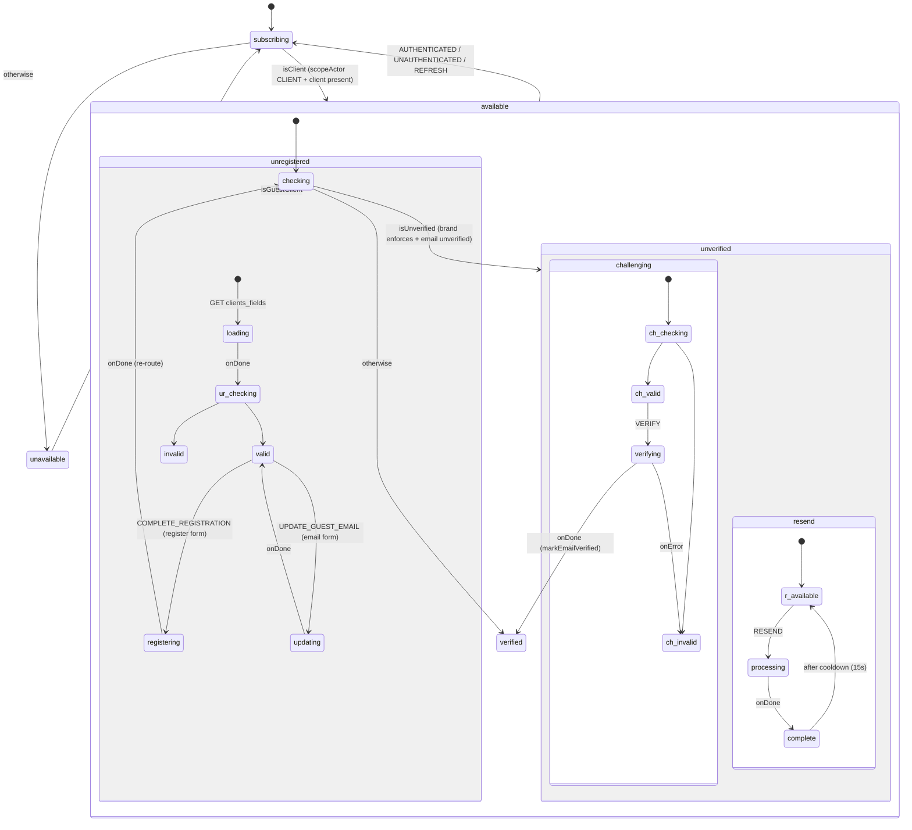
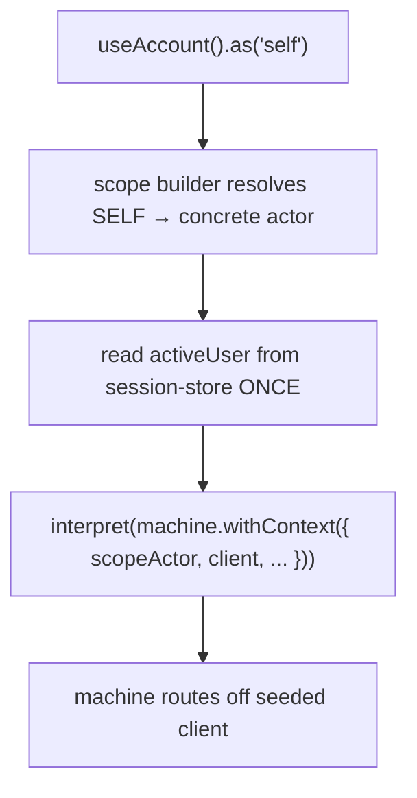

# account — Architecture

## Overview

`account` is a scoped composable (`useAccount`) wrapping an XState machine that manages a client's **standing** after authentication. It is instantiated per `(actor, sessionId)`, seeds the concrete client from the session store once at construction, and thereafter reads only its own machine context — no store reads, no `/self` fetch inside the machine.

## Why `useAccount` is the canonical scoped-composable exemplar

The **design council (FE-2945, 2026-06-25)** reversed FE-2826's earlier plan to fold auth + lifecycle into a scoped `useSession`. That folding recreated the "mega-facade" the FE-2826 retro warned against. The council settled on **three peers**:

| Composable                        | Owns                                                       | Scoped?                                                  |
| --------------------------------- | ---------------------------------------------------------- | -------------------------------------------------------- |
| `useAuth`                         | credentials — login, register, 2FA, recover, guest-mint    | ✅ `createScopedComposable`                              |
| **`useAccount`**                  | **post-auth standing — guest upgrade, email verification** | ✅ **`createScopedComposable` — the canonical exemplar** |
| `useSession` / `useActiveSession` | pure identity — who you are, token, active actor           | ❌ no scoping, no folding                                |

`useAccount` (`useAccount.ts:100`) is now the reference implementation of the scoped four-layer pattern: `createScopedComposable`, `.as('self')`, one uniform return shape across actors, and **variance living in services, not in per-layer shapes**. `session-store` carries zero `createScopedComposable` usage by design (source: `docs/sdd/FE-2826/retro-rollout.md`, reconciliation log 2026-06-29).

> **🔧 For Contributors:** When scaffolding a new scoped composable, copy `useAccount`'s shape — uniform `useActions`/`useContext`/`useMeta`/`useInternals`, shared logic in the factory file, actor variance in `.client.ts`/`.staff.ts` service files. Do **not** reintroduce per-actor meta/context shapes.

## State Machine

The machine (`account.machine.ts`) routes the seeded client into a standing branch, then hosts the relevant form.

Key machine facts:

- `subscribing` spawns an `authSubscription` helper and routes off the seeded client. `isClient` requires `scopeActor === CLIENT` **and** a client present.
- `unverified` is a **parallel** state: the verify-code form (`challenging`) and the resend cooldown (`resend`) run independently.
- On successful code verification, `verifying.onDone` fires `markEmailVerified` (flips the local `primaryEmail.isVerified`) and jumps to `#available` → `checking`, which re-routes to `verified`. This is deliberate: trusting the POST result avoids racing a stale `/self` that could still read `verified: 0`.
- Guest upgrade `registering.onDone` re-enters `#available.checking` with the updated client, so the client re-routes (to `unverified` or `verified`) rather than assuming success = verified.
- `AUTHENTICATED` / `UNAUTHENTICATED` / `REFRESH` are global — any of them resets to `subscribing`.

> **🧪 For Testers:** After `verify()` resolves `true`, the machine is in `available.verified` and `useMeta().showVerifyEmailForm` is `false`. The transition does not wait on a `/self` refetch — it flips off the POST result alone.

## Data Flow

### Instantiation (seed the client)

The client is read from `useSessionStore().useContext().activeUser` at mint and injected into `context.client`. The machine never reads the store again — it reacts to `REFRESH`/`AUTHENTICATED`/`UNAUTHENTICATED` events instead.

### Verify-by-code side effect

On success, `verifyEmailCode` (in `account.services.ts`) also reaches into the session store: it optimistically sets `activeUser.primaryEmail.isVerified = true`, calls `updateUser(...)`, and invalidates the cached `/self` query so it refetches in the background. The machine's local `markEmailVerified` and this store update keep the two views consistent.

### Guest upgrade side effect

`completeRegistration` maps the updated client through `mapSessionUser` and calls `updateUser(...)` so the session's active user reflects `is_guest: false` immediately.

## Dependencies

### This module reads from

| Module                                             | Uses                                                                                               |
| -------------------------------------------------- | -------------------------------------------------------------------------------------------------- |
| `session-store`                                    | `useSessionStore` (activeUser/activeSessionId, `updateUser`), `mapSessionUser`, `authSubscription` |
| `query`                                            | `useQuery` — `get`/`post`/`put`/`patch`, `useUrl`, `queryClient`                                   |
| `brand`                                            | `useBrand().enforceEmailVerification` (routes unverified vs verified)                              |
| `auth`                                             | `useRegisterSchema` / `useRegisterUischema` / `RegisterModel` (reuses the register form)           |
| `system`                                           | `useSystem().ensureCountries` (phone default country)                                              |
| `system-recaptcha`                                 | `useRecaptcha` (upgrade token)                                                                     |
| `system-localisation`                              | `useI18n`                                                                                          |
| `feedback`                                         | `useFeedback().addError`                                                                           |
| `client` / `client-phone` / `client-custom-fields` | `Client`, `IPhoneData` types; `mapCustomField`                                                     |
| `scope`                                            | `createScopedComposable`, `ScopeActorTypes`, `remove`                                              |

### Modules that read from this one

None (headless domain modules). Account is a leaf — consumed only by the presentation layer (client-vue `Account`, `GuestEmail`, `Order`; the cart's verify-email overlay + checkout).

## Integration Points

- **Cart verify-email overlay** drives `challenging` (verify by code) + `resend`.
- **Checkout guest email** drives the guest-email form (`showGuestEmail()` → `updateGuestEmail()`).
- **Guest upgrade form** drives `register()`.
- **Routing** owns link-based verification (`auth.services.client.email.ts` `verifyFromLink`), not this module — see gotchas.
