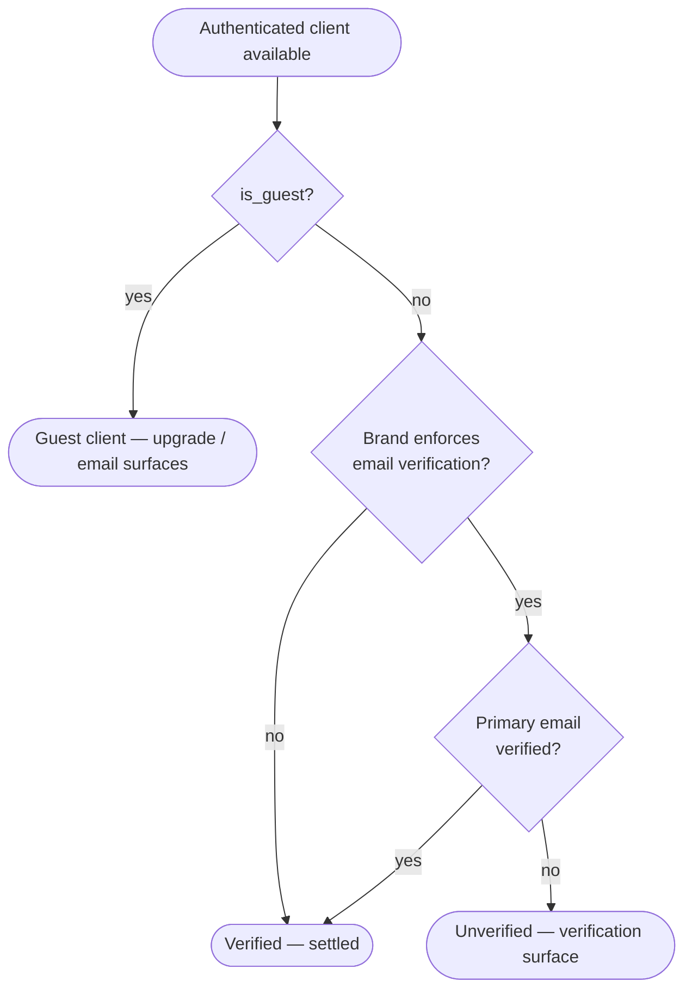
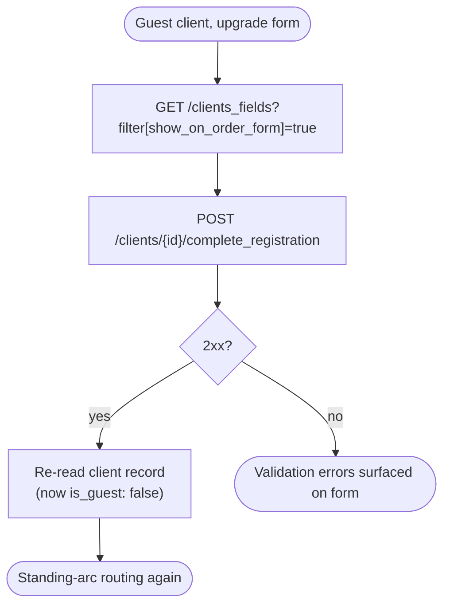
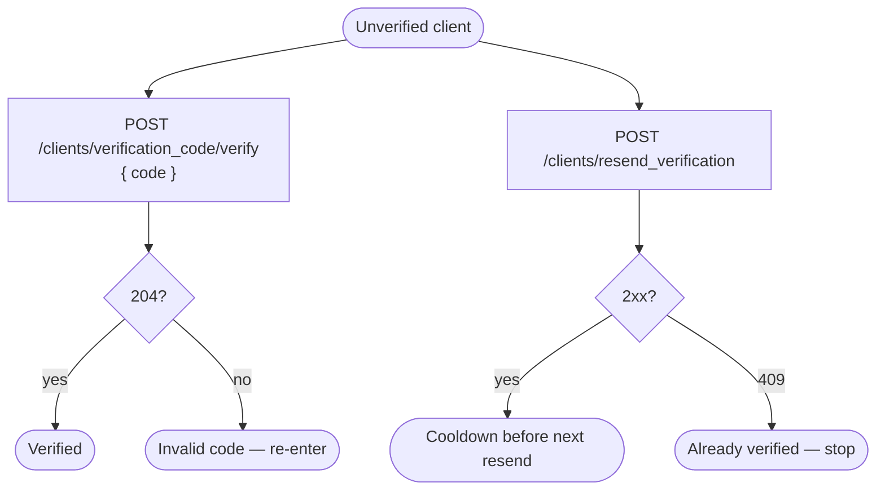

# Module: account

## What it is

The **account** module owns a client's _standing_ after they have authenticated: the arc from **unregistered guest** → **unverified** (owes email verification) → **verified**. It manages the two ways a client's standing changes under their own control — upgrading a guest checkout into a full registered client, and verifying the client's primary email — plus the order-form custom fields the upgrade form needs.

_Any `meta` field returned by Upmind endpoints is UI-specific to our own client — ignore for spec purposes._

Account shares its problem space with two siblings and demarcates against both. Credential authentication (login, password grants, 2FA, password recovery, initial guest-token minting, from-scratch registration) lives in the **auth** module; identity, token lifecycle, and the active-actor/session surfaces live in the **session-store** module. Account picks up _after_ an authenticated client exists: it reads that client's standing from the active session and drives the calls that advance it. It does not authenticate, mint tokens, or track the session — it changes and reads the standing of a client the session already holds.

## Core concepts

- **Standing** — where a client sits on the post-auth arc. Derived from client-record fields, not a single status enum: a _guest client_ has `is_guest: true`; an _unverified client_ is a full client whose primary email is not yet verified (`verified: false` / the primary email's `verified: false`); a _verified client_ is a full client with a verified primary email.
- **Guest client** — a client created for checkout without full registration. Holds a working token but has no full profile; its email is stored in `username`, not `email`.
- **Guest upgrade** — converting a guest client into a full registered client by supplying registration details. The existing token keeps working after the upgrade; no new auth payload is returned.
- **Email verification** — proving ownership of the client's primary email. Two independent routes: a **verification code** the client enters (OTP), and a **verification link** the client clicks (a hashed URL). Verified state is a client-record fact the platform returns.
- **Resend** — re-issuing the verification email so the client can request a fresh code/link.
- **Enforce-email-verification** — a brand-level flag. When a brand does not enforce email verification, an unverified full client is treated as fully settled (the verification step is not required of them).

## State model

The client's standing is a platform-observable lifecycle. The state is not a single returned enum — it is derived from boolean fields on the client record, and each transition is driven by a discrete back-end call the caller makes.

| Standing       | Derived from                                          | Advances via                                                                                                   |
| -------------- | ----------------------------------------------------- | -------------------------------------------------------------------------------------------------------------- |
| **Guest**      | `is_guest: true`                                      | `POST /clients/{id}/complete_registration` → full client (`is_guest: false`)                                   |
| **Unverified** | `is_guest: false` and primary email `verified: false` | `POST /clients/verification_code/verify` **or** `PATCH /clients/{id}/emails/{emailId}/check_verify` → verified |
| **Verified**   | `is_guest: false` and primary email `verified: true`  | terminal                                                                                                       |

Guest is evaluated first: a guest client is never treated as "unverified", even if its email is unverified — it must upgrade first, then verify. When the brand does not enforce email verification, an unverified full client is treated as verified for standing purposes (no verification call required).

> ⚠️ UNRATIFIED: This lifecycle is backed by boolean fields (`is_guest`, `verified`), not a single `status` enum in `packages/types`. Whether it warrants a formal State-model section or should be demoted to a Flow is a reviewer call.

## Operations

| #   | Capability                           | Inputs                                                                         | Outputs                                                                              |
| --- | ------------------------------------ | ------------------------------------------------------------------------------ | ------------------------------------------------------------------------------------ |
| 1   | **Read client standing record**      | client id, access token                                                        | Full client record incl. `is_guest`, `verified`, primary email + its `verified` flag |
| 2   | **Read order-form custom fields**    | access token (filter fixed: `show_on_order_form=true`)                         | Array of custom-field definitions                                                    |
| 3   | **Upgrade guest → full client**      | email, firstname, lastname, password, phone?, custom fields?, recaptcha token? | Updated client record (`is_guest: false`)                                            |
| 4   | **Update guest order-receipt email** | email                                                                          | Accepted; guest's email persists in `username`                                       |
| 5   | **Resend verification email**        | access token (email id derived from client's primary email)                    | `200` on send; `409` if the client is already verified                               |
| 6   | **Verify email by code**             | 6-digit code                                                                   | `204` no content on success                                                          |
| 7   | **Verify email by link**             | client id, email id, registration hash                                         | Verification result                                                                  |

No back-end call sits behind capability 1 inside this module — the client record is read from the active session, not re-fetched (see Dependencies and the UNRATIFIED note under API endpoints). Capability 7's back-end call is defined in this module but the live wiring for it currently lives in the auth sibling (see UNRATIFIED note).

## Data shape

Client record (returned by the client-record read; the standing signals the arc routes off). `meta` stripped per the top note.

```ts
type ClientRecord = {
  // --- identity
  id: string;
  firstname: string;
  lastname: string;
  public_name: string;
  fullname: string;
  has_login: boolean;
  email: string | null; // full client's email; a guest keeps its email in `username` (email is null)
  username: string;
  number: string | null; // client reference number
  user_id: string; // creating user; "sys" for system-created
  // --- standing signals (the fields the arc routes off)
  verified: boolean; // client-level verification flag
  is_guest: boolean; // true = guest checkout client, not fully registered
  // --- 2FA / login security
  enabled_2fa: boolean;
  secret_2fa_exists: boolean;
  provider_2fa_id: string;
  failed_login_attempts: number;
  failed_2fa_attempts: number;
  last_login: string | null;
  last_password_change_at: string | null;
  // --- tenancy
  brand_id: string;
  org_id: string;
  status_id: string; // client status; enum in packages/types
  reseller_account_id: string | null;
  bf_id: string; // "none" = no billing frequency set (sentinel, not an id)
  // --- language
  interface_language_id: string;
  interface_language_code: string; // e.g. "en"
  document_language_id: string;
  document_language_code: string;
  // --- location
  location_source: string; // e.g. "default_address"
  location_town: string | null;
  location_country_code: string | null; // ISO 3166-1 alpha-2
  location_ip: string | null;
  ip_address: string | null;
  // --- fraud / tax
  fraud_policy: number; // enum in packages/types
  fraud_status: number; // enum in packages/types
  tax_type: number; // enum in packages/types
  tax_exempt_code: string | null;
  tax_exempt_number: string | null;
  // --- billing / credit (admin-side; none consumed by the standing arc)
  apply_credit: number; // 0/1 flag
  credit: number | null;
  consolidate_invoice: number; // 0/1 flag
  consolidation_day: number | null;
  invoice_consolidation_enabled: number; // 0/1 flag
  invoice_consolidation_base_rule: string | null;
  invoice_consolidation_base_rule_date_of_month_day: number | null;
  invoice_consolidation_base_rule_day_of_week: number | null;
  invoice_consolidation_due_date_day: number | null;
  before_due_date_charge_interval: number | null;
  before_due_date_charge_interval_dd: number | null;
  topup_enabled: boolean | null; // null in capture
  has_legacy_invoices: boolean;
  order_template_code: string | null;
  // --- lifecycle protections (admin-side)
  never_suspend: boolean;
  never_cancel: boolean;
  never_close: boolean;
  block_new_tickets_from_email: boolean;
  notifications_disabled: boolean;
  // --- support / import provenance
  support_pin: string | null;
  support_pin_expiry_datetime: string | null;
  import_id: string | null;
  staged_import: boolean;
  external_id: string | null;
  deleted_at: string | null;
  // --- presentation extras
  picture: number; // 0/1 flag — whether a picture is set
  image_url: string | null;
  upmind_package_limits: unknown[]; // empty in capture
  settings: unknown[]; // empty in capture
  parent_client_config: unknown | null;
  created_at: string;
  updated_at: string;
  // --- primary email (routes unverified → verified)
  default_email: {
    id: string;
    client_id: string;
    user_id: string;
    type: number; // email-type enum in packages/types (1 = primary/default)
    default: boolean;
    verified: boolean; // primary-email verification flag — routes unverified→verified
    email: string;
    bounced: boolean;
    bounced_at: string | null;
    can_delete: boolean;
    import_id: string | null;
    staged_import: boolean;
    external_id: string | null;
    created_at: string;
    updated_at: string;
  };
};
```

Order-form custom-field definition (returned by capability 2):

```ts
type OrderFormCustomField = {
  id: string;
  object_type: string; // "client"
  name: string;
  name_translated: string;
  description: string | null;
  type: number; // custom-field type enum in packages/types (8 = image)
  type_code: string; // e.g. "image"
  display_type: string; // e.g. "Image"
  group: number;
  code: string; // stable field key, e.g. "profile_picture"
  order: number;
  required: boolean;
  hidden: boolean;
  client_readonly: boolean;
  user_only: boolean;
  show_on_order_form: boolean;
  show_on_invoice: boolean;
  values: unknown[];
  validation_rules: unknown[];
  brand_id: string;
  org_id: string;
};
```

Request models (inputs to the mutation capabilities):

```ts
// Guest upgrade (capability 3) — the client-facing form model
type CompleteRegistrationModel = {
  email: string;
  firstname: string;
  lastname: string;
  password: string;
  phone?: PhoneData; // national number + country calling code + country
  customFields?: Record<string, unknown>;
};

// Guest order-receipt email (capability 4)
type GuestEmailModel = { email?: string };

// Email verification by code (capability 6)
type VerifyEmailModel = { code?: string }; // 6-digit numeric
```

## Dependencies

### Dependants — modules that read from this one

Fan-in from `graphify-out/graph.json` (cross-module import edges) and confirmed by code grep: **no headless domain module imports the account module.** Account is currently a leaf — the arc is driven entirely by the presentation layer.

| Module             | Weight | Reads                                                                                           | Why                                                                                                                                                                                                         |
| ------------------ | ------ | ----------------------------------------------------------------------------------------------- | ----------------------------------------------------------------------------------------------------------------------------------------------------------------------------------------------------------- |
| Presentation layer | —      | standing flags (guest / unverified / verified), active form schema + model, resend availability | Cart verify-email overlay, guest order-receipt email form, and guest→full upgrade form (client-vue `Account`, `GuestEmail`, `Order`; cart checkout + verify-email modal) render and drive the standing arc. |

No domain-module row exists because the graph returns zero cross-module importers of the account module. Foundational consumers (the HTTP transport layer and app-level framework helpers) are excluded per the foundational-consumer rule.

### This module's own dependencies

- **HTTP transport layer** — issues the reads/mutations, attaches the access token, injects currency, normalises error shape.
- **Session identity read** — the active session supplies the client record the arc routes off (the `is_guest` and primary-email `verified` flags). Account reads this record; it does not fetch it.
- **Brand context** — the enforce-email-verification flag that decides whether an unverified full client must verify.
- **reCAPTCHA** — a token attached to the guest-upgrade request when available.
- **Localisation** — error message translation.
- **Shared types / enums** — client, phone, custom-field, and access-role types from `packages/types`.

## API endpoints

> The client-record read (`GET /clients/{id}`) and its unauthenticated `401` are recorded as the standing-source contract. In this stack the account module receives that record via the active session rather than issuing the `GET` itself.
> **Ruling:** `GET /clients/{id}` is not a call any module in this codebase currently issues — not account, not session-store. The fields account actually routes standing off (`is_guest`, primary-email `verified`) arrive as part of the identity profile that `session-store`'s own back-end call returns (`GET /self` — see session-store's Operations capability 2, "Read the active client identity"), and account is hydrated from that record rather than fetching anything itself. `GET /clients/{id}` is a captured, uncalled contract shape — useful as a reference for what a direct client-record read would look like, but it is not owned as a live endpoint by account (nor by session-store, whose live mechanism is `/self`, not this URL). Kept below for the response shape and the `401` behaviour, not as a claimed account capability.

### GET /clients/{clientId}

Role: reads the full client record whose `is_guest` and primary-email `verified` fields determine the client's standing.

```bash
curl "$API/clients/mock-uuid-1" \
  -H "Authorization: Bearer $ACCESS_TOKEN" \
  -H "Accept: application/json"
```

Sample response (`200`):

```json
{
  "status": "ok",
  "data": {
    "id": "mock-uuid-1",
    "firstname": "Checkout",
    "lastname": "Test",
    "public_name": "Checkout T.",
    "fullname": "Checkout Test",
    "email": "mock-email-1@example.com",
    "username": "mock-email-1@example.com",
    "has_login": true,
    "verified": true,
    "is_guest": false,
    "brand_id": "mock-uuid-5",
    "org_id": "mock-uuid-4",
    "status_id": "mock-uuid-6",
    "interface_language_code": "en",
    "default_email": {
      "id": "mock-uuid-7",
      "client_id": "mock-uuid-1",
      "type": 1,
      "default": true,
      "verified": true,
      "email": "mock-email-1@example.com",
      "bounced": false,
      "can_delete": false
    }
  },
  "related": null,
  "total": 1,
  "error": null,
  "messages": []
}
```

Fixture: `__tests__/fixtures/get-clients-id.json`

### GET /clients_fields?filter[show_on_order_form]=true

Role: fetches the custom-field definitions the guest-upgrade form must render (the same order-form fields the full registration form uses).

```bash
curl "$API/clients_fields?filter[show_on_order_form]=true" \
  -H "Authorization: Bearer $ACCESS_TOKEN" \
  -H "Accept: application/json"
```

Sample response (`200`):

```json
{
  "status": "ok",
  "data": [
    {
      "id": "mock-uuid-8",
      "object_type": "client",
      "name": "Profile Picture",
      "name_translated": "Profile Picture",
      "type": 8,
      "type_code": "image",
      "display_type": "Image",
      "group": 0,
      "code": "profile_picture",
      "order": 2,
      "required": false,
      "hidden": false,
      "client_readonly": false,
      "user_only": false,
      "show_on_order_form": true,
      "show_on_invoice": false,
      "values": [],
      "validation_rules": [],
      "brand_id": "mock-uuid-5",
      "org_id": "mock-uuid-4"
    }
  ],
  "related": null,
  "total": 1,
  "error": null,
  "messages": []
}
```

Fixture: `__tests__/fixtures/get-clients-fields-filter-show-on-order-form-true.json`

### POST /clients/{clientId}/complete_registration

Role: upgrades a guest client to a full registered client. Returns no auth payload — the existing guest token keeps working; the caller re-reads the client afterwards to see `is_guest: false`.

Request body:

```ts
type CompleteRegistrationBody = {
  email: string;
  username: string; // set equal to email
  firstname: string;
  lastname: string;
  password: string;
  phone?: string; // national number only
  phone_code?: string; // country calling code, e.g. "44"
  phone_country_code?: string; // ISO country, e.g. "GB"
  custom_fields?: Record<string, unknown>;
  recaptcha_token?: string; // attached when reCAPTCHA is available; omitted otherwise
};
```

```bash
curl -X POST "$API/clients/mock-uuid-1/complete_registration" \
  -H "Authorization: Bearer $ACCESS_TOKEN" \
  -H "Content-Type: application/json" \
  -d '{
    "email": "new@example.com",
    "username": "new@example.com",
    "firstname": "New",
    "lastname": "Client",
    "password": "s3cret-passw0rd",
    "phone": "7700900000",
    "phone_code": "44",
    "phone_country_code": "GB",
    "custom_fields": {},
    "recaptcha_token": "..."
  }'
```

Sample response: not captured — this mutation is staging-mutating and was intentionally not recorded. The response is the updated client record (`data` as in `GET /clients/{id}`, with `is_guest: false`).

### PUT /clients/{clientId}

Role: autosaves a guest client's order-receipt email during checkout.

Request body:

```ts
type UpdateGuestEmailBody = { email: string };
```

```bash
curl -X PUT "$API/clients/mock-uuid-1" \
  -H "Authorization: Bearer $ACCESS_TOKEN" \
  -H "Content-Type: application/json" \
  -d '{ "email": "receipt@example.com" }'
```

Sample response: not captured — staging-mutating. For a guest, the saved value lands in `username`, and the record's `email` is returned `null` (the value is read back from `username`). See Failure modes.

### POST /clients/resend_verification

Role: re-issues the verification email for the active client's primary email. Takes no body — the target email is resolved server-side from the authenticated client.

```bash
curl -X POST "$API/clients/resend_verification" \
  -H "Authorization: Bearer $ACCESS_TOKEN" \
  -H "Accept: application/json"
```

Sample response (`409`, client already verified):

```json
{
  "status": "error",
  "data": null,
  "related": null,
  "total": null,
  "error": {
    "id": "7391a9dd8ac60984cf9710a016cd100016272efd",
    "type": 0,
    "code": 409,
    "message": "Customer is already verified!",
    "data": []
  },
  "messages": null
}
```

Fixture: `__tests__/fixtures/post-clients-resend-verification.json`

The `200` happy-path response is not recorded — the captured account is already verified, so only the `409` path is producible from it.

### POST /clients/verification_code/verify

Role: verifies the client's email against a code the client entered.

Request body:

```ts
type VerifyCodeBody = { code: string }; // 6-digit numeric
```

```bash
curl -X POST "$API/clients/verification_code/verify" \
  -H "Authorization: Bearer $ACCESS_TOKEN" \
  -H "Content-Type: application/json" \
  -d '{ "code": "000000" }'
```

Sample response (`204`, no content): empty body.

Fixture: `__tests__/fixtures/post-clients-verification-code-verify.json`

> ⚠️ STILL OPEN (not resolved by the multi-session model — this is a fixture-coverage gap, not a session-store scoping question): the single captured case is an **already-verified** account submitting `code: "000000"`, which returned `204 No Content`. That is the full extent of what the fixture proves. Whether the endpoint accepts _other_ code values on an already-verified account is an inference, not an observation. The `4xx` rejection shape for a wrong code on a genuinely **unverified** account is unverified inference, pending an unverified-account capture (the fixture-generation report for this module records the same gap: no unverified test account was available to capture it). Do not assert behaviour beyond the captured case.

### PATCH /clients/{clientId}/emails/{emailId}/check_verify

Role: verifies the client's email from a hashed link (the client clicks a verification URL carrying `client_id`, `email_id`, and a hash).

Request body:

```ts
type CheckVerifyBody = { reg_hash: string };
```

```bash
curl -X PATCH "$API/clients/mock-uuid-1/emails/mock-uuid-7/check_verify" \
  -H "Authorization: Bearer $ACCESS_TOKEN" \
  -H "Content-Type: application/json" \
  -d '{ "reg_hash": "..." }'
```

Sample response: not captured.

> ⚠️ STILL OPEN (a code-cleanup/ownership decision, not settled by the session-store model): this endpoint's back-end call is defined in the account module (`checkVerifyEmail` in `account.services.ts`), confirmed to have **zero importers** and to be absent from the account machine's own `services` object — it is never invoked from account. The live link-verification flow (`verifyFromLink`, with the surrounding `/self` refresh) is fully implemented in the **auth** sibling (`auth.services.client.email.ts` + `useVerifyEmail.ts`) and invoked from there via routing. The facts are confirmed; what remains open is a product/cleanup call: remove the dead account copy and document the endpoint solely under auth, or keep it in account as a scope claim. The code-based route (`POST /clients/verification_code/verify`) is unambiguously account's regardless of this ruling.

## Failure modes

- **Read while unauthenticated → `401`.** The client-record read returns `401` with `error.message: "Please log in to continue"` and `data: null` when there is no valid session. No client data comes back. Fixture: `__tests__/fixtures/get-clients-id-case-unauthenticated.json`.
- **Resend when already verified → `409`.** `POST /clients/resend_verification` returns `409` with `error.message: "Customer is already verified!"` and `data: []`. The caller should treat this as "nothing to resend", not a transient error to retry.
- **Verify on a verified client → `204` (captured case).** In the one recorded case, `POST /clients/verification_code/verify` returned `204` for an already-verified client submitting the placeholder code `000000`. Any broader "success is indistinguishable from a no-op" claim is inference pending an unverified-account capture (see UNRATIFIED note above).
- **Guest email PUT soft path.** For a guest, `PUT /clients/{id}` with `{ email }` succeeds but the record's `email` reads back `null`; the value is persisted to `username`. A caller reading `email` after the save will see `null` and must read `username` instead. (Uncaptured — behaviour taken from the mutation's documented handling, not a fixture.)
- **Guest-upgrade validation.** `POST /clients/{id}/complete_registration` validates the submitted fields; a `4xx` carries the field errors. (Response uncaptured — staging-mutating.)

## Flows

### Standing-arc routing

One-line purpose: decide, from a loaded client, which standing surface applies.



Guarantees the platform holds: a guest is always routed to the guest surface before verification is ever considered; the same client record carries every field the routing needs (`is_guest`, `verified`, primary email `verified`).

Constraints the caller has to plan around: standing is derived from booleans, not a single status; when the brand does not enforce email verification, an unverified full client is indistinguishable from a verified one for routing purposes.

### Guest → full upgrade

One-line purpose: convert a guest checkout client into a full registered client.



Guarantees the platform holds: the existing guest token keeps working after the upgrade — no new auth payload is issued; the response is the updated client record.

Constraints the caller has to plan around: the upgrade does not itself return the new standing — the caller re-reads the client to observe `is_guest: false`; a successful upgrade may land the client in _unverified_ (if the brand enforces verification and the email is unverified) rather than straight to _verified_.

### Email verification (code) with resend

One-line purpose: verify an unverified full client's email.



Guarantees the platform holds: a successful code verification is authoritative for the client's verified state (the caller need not wait for a fresh record read to treat the email as verified).

Constraints the caller has to plan around: resend is rate-limited by a client-side cooldown between attempts; an already-verified client's resend returns `409`; the link route (`PATCH .../check_verify`) is an independent path to the same verified outcome.

## Lessons (hard-won)

- **A guest's email is not in `email`.** The back end keeps a guest client's email in `username`; the `email` field is `null` until the guest upgrades. Reading `email` for a guest yields nothing — the value lives in `username`, and a guest-email save reads back `null` on `email`.
- **Verification success is not observable by re-reading the record.** A code verification that returns `2xx` is authoritative immediately, but a follow-up client-record read can still return the pre-verification `verified: false` for a short window. A caller that gates "verified" on a fresh read races a stale record.
- **An already-verified client does not hard-fail verification calls.** Resend against a verified client returns a `409` conflict rather than sending; a code-verify against a verified client returned `204` in the captured case (placeholder code `000000`). A `204` from `verification_code/verify` on a verified client is not proof the submitted code was correct.
- **Standing has no single status field.** It is reconstructed from `is_guest`, `verified`, and the primary email's `verified` flag, gated by a brand-level enforcement flag. A client with an unverified email on a non-enforcing brand is, for standing purposes, verified — there is no field that says so directly.
- **The client record arrives from the session, not a fetch.** The standing arc routes off the client the active session already holds; it does not issue its own client read. An equivalent that re-fetches the client per standing check pays a redundant round-trip the platform does not require.
- **The link-verify and code-verify routes are separate implementations of one outcome.** Both drive the same unverified → verified transition, but through different endpoints and, in this stack, different owners. An equivalent that assumes a single verification endpoint will miss one of the two entry points a client can arrive through.
