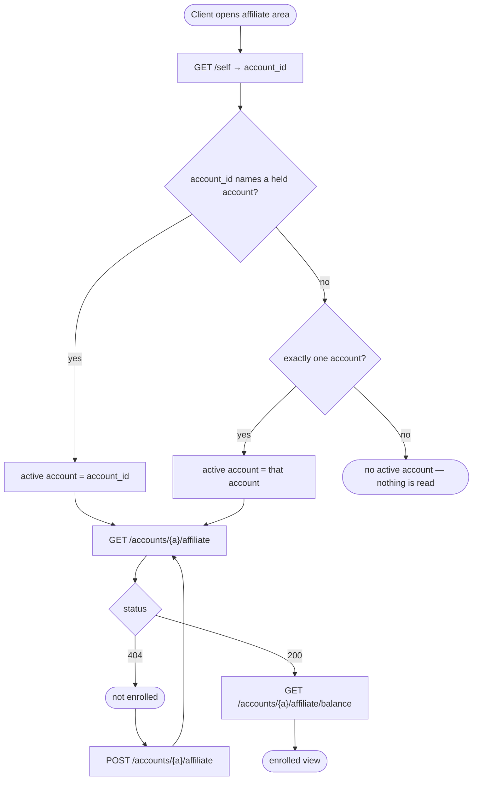
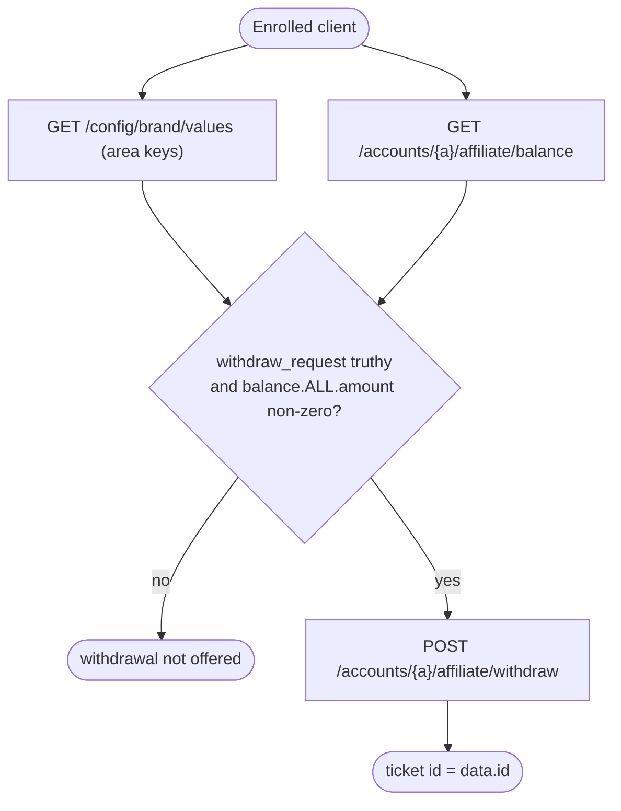
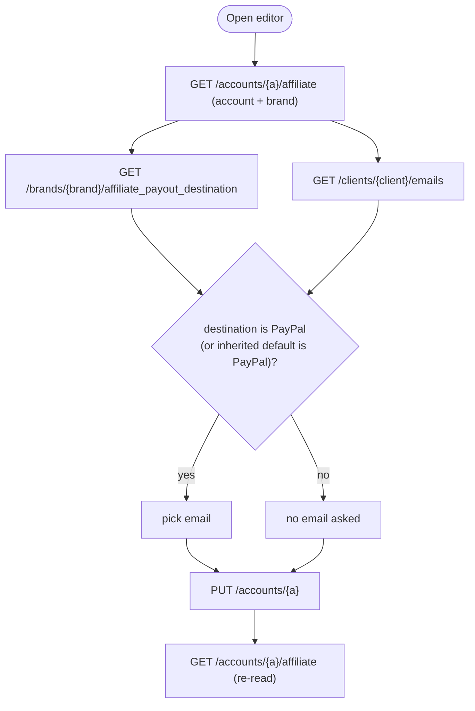
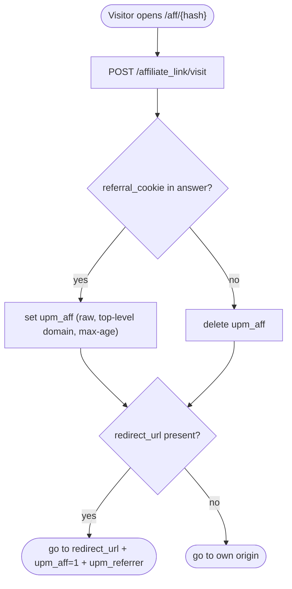

# Module: affiliate

## What it is

The affiliate module is a client's self-service view of the affiliate programme. A client who holds an account can enrol in the programme, read the account's balance and referral statistics, manage referral links, review the referrals, pending commissions and payouts those links produced, request a withdrawal, and choose where payouts are sent. The module also covers the visitor side: an anonymous visitor who opens a referral link is recorded, receives an attribution cookie and is sent to the link's target.

Two actors exist in this module. The client acts on their own account only. The guest acts on nothing: the visit request carries no credentials and addresses no account. Staff acting on behalf of a client is not part of this module, and no capability of that kind is documented here. Client-account reads, such as the emails page used by the payout editor, live in the client modules; the affiliate module picks up after the account id is known.

*Any `meta` field returned by Upmind endpoints is UI-specific to our own client — ignore for spec purposes.*

Keys by lifecycle phase (brand configuration read as flat dotted keys):

| Phase | Keys | Relevance |
| --- | --- | --- |
| Programme gate (before any affiliate area renders) | `affiliate_systems.upmind.enabled`, `affiliate_systems.upmind.customer_controls_enabled` | Both must be truthy for the programme to be offered to clients. |
| Affiliate area (after the account is known) | `affiliate_systems.settings.withdraw_request`, `affiliate_systems.settings.default_redirect` | The first switches withdrawal requests on. The second is the brand's default redirect that pre-fills a new link. |

## Core concepts

- **Active account** — the one account the module addresses. It is the session's own account id when that id names one of the client's accounts, otherwise the client's only account. A client with several accounts and no matching own-account id resolves no account. There is no chooser and no way to switch.
- **Affiliate account** — the programme record attached to an account. It exists only after enrolment; before that, reading it answers 404.
- **Referral link** — a named link with a target URL and a hash. The shareable URL is the brand's default origin, `/aff/`, then the link's hash.
- **Referral** — a client who arrived through a link, recorded against the affiliate account (and the link, when known).
- **Pending commission** — a commission earned on a referral's invoice. It moves through approval and payment states reported by flags on the record.
- **Payout** — a settled withdrawal to a payout destination.
- **Payout destination** — a brand-defined place payouts go, such as a wallet or PayPal. A PayPal destination also needs one of the client's emails.
- **Referral cookie** — the `upm_aff` attribution cookie the visit endpoint hands out.

## Operations

| # | Capability | Inputs | Outputs |
| --- | --- | --- | --- |
| 1 | **Resolve the client's own account** | session | The own-account id, or none |
| 2 | **Read the affiliate account** — and, as the brand fallback, the client's own record with its brand | account id | The affiliate record with its account, brand, clients and payout destination, or "not enrolled". The client's brand, for the referral origin and the link editor's brand name |
| 3 | **Enrol in the programme** | account id; no body | The new affiliate record |
| 4 | **Read the balance** | account id | Available, pending, withdrawn and suspended balances per currency and combined |
| 5 | **Read programme gate and area settings** | brand id (area keys only) | Flat map of the four configuration keys above |
| 6 | **Manage referral links** — list (search, sort, page), read one, create, update, delete | account id; link id; name and redirect URL | Link rows with visit and referral counts |
| 7 | **List referrals** (sort, page, filter by link columns and date) | account id | Referral rows with the link and client |
| 8 | **List pending commissions** (sort by amount or date, page, filter by date) | account id | Commission rows with invoice and invoice client |
| 9 | **List payouts** (sort by amount or date, page, filter by date) | account id | Payout rows with the destination and payment log |
| 10 | **Request a withdrawal** | account id; message text | The id of the support ticket the platform raises |
| 11 | **Choose the payout destination** — read brand destinations and the client's emails, save the choice | brand id; client id; destination id; PayPal email id | Destination list, email list, the saved account |
| 12 | **Record a referral-link visit** | visit URL, referrer URL, user agent, existing cookie value | Redirect target, cookie value and cookie lifetime |

Derived from loaded records (client-side, no request):

| Derivation | Rule |
| --- | --- |
| Enrolled | An account id is active and the affiliate record is non-empty |
| Disabled / staged | The affiliate record's `disabled` / `staged_import` flag |
| Programme enabled | Both gate keys are truthy |
| Has payable commissions | The combined available balance amount is non-zero |
| Can withdraw | The withdraw setting is truthy and there are payable commissions |
| Referral URL | `{origin of the brand's default oauth client}/aff/{link hash}`; empty origin when the brand has no default client |
| Commission status | Six values: rejected, on hold, awaiting payment, pending approval, cancelled, approved. Two orderings exist (see Lessons) |
| PayPal destination | The chosen destination's code is `paypal`; an unset destination inherits the brand's default destination |

Always-on behaviours: every client read is skipped while no account is active; a collection discards the previous account's rows the moment the active account clears; a reload re-reads account, balance and settings together.

## Data shape

Types follow the captured responses. Canonical type names live in the shared types package: `IAffiliate`, `IAffiliateBalance`, `IAffiliateLink`, `IAffiliateReferral`, `IAffiliatePendingCommission`, `IAffiliatePayout`, `IAffiliateBrandPayoutDestination`, `IEmail`, `ISelf`. Timestamps are `"YYYY-MM-DD HH:mm:ss"` strings. Every response is wrapped in the platform envelope `{ status, data, related, total, error, messages }`; `total` is populated on lists.

```ts
type Affiliate = {
  id: string;
  import_id: string | null;
  staged_import: boolean;
  external_id: string | null;
  external_client_id: string | null;
  imported_link_visit_count: number | null;
  imported_referral_count: number;
  account_id: string;
  disabled: boolean;
  referral_count: number;
  link_visit_count: number;
  created_at: string;
  updated_at: string;
  deleted_at: string | null;
  account?: Account; // with=account...
  import?: unknown | null;
};

type Account = {
  id: string;
  brand_id: string;
  name: string;
  currency_id: string;
  affiliate_tier_id: string;
  affiliate_payout_destination_id: string | null; // null = inherit brand default
  affiliate_payout_paypal_email_id: string | null;
  // plus pricing, wallet and status fields
};

type Balance = {
  balance: Record<string, Amount>;            // "ALL" and one key per currency code
  withdrawn_balance: Record<string, Amount>;
  pending_balance: Record<string, Amount & Counts>;
  suspended_balance: Record<string, Amount & Counts>;
};
type Amount = { amount: number; amount_formatted: string };
type Counts = {
  commission_count: number;
  referral_count: number;
  order_count?: number;
  min_date?: string | null; // pending only
  max_date?: string | null; // pending only
};

type Link = {
  id: string;
  name: string;
  affiliate_account_id: string;
  hash: string;
  redirect_url: string;
  visit_count: number;
  referral_count: number;
  created_at: string;
  updated_at: string;
  deleted_at: string | null;
  affiliate_account?: Affiliate; // present on the single-link read
};

type Referral = {
  id: string;
  affiliate_account_id: string;
  affiliate_account_link_id: string | null;
  client_id: string;
  account_id: string;
  external_affiliate_id: string | null;
  external_referrer_url: string | null;
  created_at: string;
  updated_at: string;
  deleted_at: string | null;
  affiliate_account?: Affiliate;
  affiliate_link?: Link | null;
  client?: unknown; // with=client,client.image
};

type PendingCommission = {
  id: string;
  affiliate_account_id: string;
  brand_id: string;
  affiliate_account_referral_id: string;
  affiliate_tier_id: string;
  affiliate_tier_condition_id: string;
  account_id: string;
  contract_product_id: string;
  contract_id: string;
  invoice_id: string;
  invoice_product_id: string;
  affiliate_commission_id: string;
  currency_id: string;
  invoice_paid: boolean;
  commission_approved: boolean;
  payout_calculated_date: string; // "YYYY-MM-DD"
  amount: number;
  currency_exchange_rate: number;
  created_at: string;
  updated_at: string;
  deleted_at: string | null;
  approved_at: string | null;
  suspended: boolean;
  reject_reason: string | null;
  keep_until: string;
  rejected: boolean;
  rejected_at: string | null;
  purchase_date: string;
  amount_formatted: string;
  amount_converted: number;
  amount_converted_formatted: string;
  product_name: string;
  invoice?: unknown; // with=invoice,invoice.client
};

type Payout = {
  id: string;
  affiliate_account_id: string;
  brand_id: string;
  currency_id: string;
  payment_log_id: string | null;
  amount: number;
  currency_exchange_rate: string; // decimal string, unlike commissions
  created_at: string;
  updated_at: string;
  affiliate_payout_destination_id: string;
  success: boolean;
  amount_formatted: string;
  amount_converted: number;
  amount_converted_formatted: string;
  affiliate_payout_destination?: PayoutDestination;
  payment_log?: unknown | null;
};

type PayoutDestination = {
  id: string;
  code: string; // "wallet" | "paypal"
  name: string;
  name_translated: string;
  brand_id: string;
  default: boolean;
  visible_for_clients: boolean;
  created_at: string;
  updated_at: string;
  deleted_at: string | null;
};
```

Brand configuration reads answer a flat map keyed by the literal dotted key. A key the brand has not set is absent from the map, not `null`.

```ts
type BrandValues = Partial<{
  "affiliate_systems.upmind.enabled": boolean;
  "affiliate_systems.upmind.customer_controls_enabled": boolean;
  "affiliate_systems.settings.withdraw_request": boolean;
  "affiliate_systems.settings.default_redirect": string;
}>;
```

Request-state shapes accepted by the four list endpoints (the wire form is listed per endpoint):

```ts
type Operators<T> = Partial<Record<"eq" | "neq" | "gt" | "gte" | "lt" | "lte" | "like" | "before" | "after", T>>;
type ListState<Filters, SortField> = {
  filters?: Filters;
  sort?: { field: SortField; dir: "asc" | "desc" }[];
  pagination?: { limit?: number; offset?: number };
};
// links:       sort fields created_at | visit_count | referral_count; filters name, redirect_url, visit_count, referral_count, created_at
// referrals:   sort field created_at; filters created_at and the dotted columns affiliate_link.name, .redirect_url, .visit_count, .referral_count, .created_at
// commissions: sort fields amount | created_at; filter created_at
// payouts:     sort fields amount | created_at; filter created_at
```

The default sort on every list is newest first (`created_at` descending). Default page size is 10 for links, commissions and payouts and 5 for referrals.

## Dependencies

### Dependants — modules that read from this one

No other headless module imports the affiliate module. Its only consumers are application screens (the client portal's affiliate area and the public referral-link landing route).

| Module | Weight | Reads | Why |
| --- | --- | --- | --- |
| Presentation layer | — | affiliate record, balances, link rows, referral rows, commission rows, payout rows, destination list, referral origin, redirect target | Renders the affiliate area; the landing route follows the redirect target of a visit |

### This module's own dependencies

- **HTTP transport layer** — authenticated requests for every client call; the visit call is sent without credentials. Error normalisation turns failed responses into the module's error value.
- **Session** — the client's own account list, client id and brand id.
- **Brand** — brand id and name, and the brand's oauth clients (for the referral origin).
- **Shared types / enums** — type-level only: `packages/types/src/models/` (the affiliate record types) the brand configuration key enum in `packages/types/src/data/constants.ts`, and the payout destination code enum in `packages/types/src/data/enums/`.

## API endpoints

Paths are logical (no `/api` prefix). `$API` is the API base, `$ACCESS_TOKEN` a client token. Samples come from recorded captures with the client-only `meta` bag removed.

### GET /self

Role: reads the signed-in client's own record. This bare call uses only `account_id`, to name the active account. It sends no relations. A second call, `GET /self?with=actor.brand`, backs the brand fallback (next entry).

```bash
curl "$API/self" -H "Authorization: Bearer $ACCESS_TOKEN"
```

```json
{ "status": "ok", "data": { "role": "client", "actor_id": "25d96e76-3ed0-913d-d52c-417482528340", "brand_id": "2785d26e-9678-3d16-999f-314502e70439", "account_id": "d0367942-4d0e-7109-92eb-3153698d582e" } }
```

Fixture: `get-self.json` (trimmed to the used keys; the capture carries the full actor record).

### GET /self?with=actor.brand

Role: reads the signed-in client's own record with the client's brand attached. It backs two reads: the referral origin falls back to this brand's oauth clients when the affiliate account carries no brand, and the link editor takes the brand name from the record's branding value, else from the brand's name. A failed read, like a record with no branding value, falls back to the brand name from the brand context.

Query: `with=actor.brand`.

```bash
curl "$API/self?with=actor.brand" -H "Authorization: Bearer $ACCESS_TOKEN"
```

```json
{ "status": "ok", "data": { "role": "client", "brand_id": "2785d26e-9678-3d16-999f-314502e70439", "branding": null, "actor": { "brand": { "id": "2785d26e-9678-3d16-999f-314502e70439", "name": "QA Automation Testing", "code": "kn6x1dzbtcgb" } } } }
```

Fixture: `get-self.json`, trimmed to the keys above. The capture was recorded with a wider relation list (the actor, its account, brand and image, the accounts and enabled modules) that includes `actor.brand`, and replays for both `/self` calls. In that capture `branding` is `null` and the brand holds no oauth clients, so the fallback origin is `""`.

### GET /accounts/{account}/affiliate

Role: reads the affiliate record. Answers 404 when the account never enrolled.

Query: `with_staged_imports=1`, `with=account,account.brand,account.clients,import.credentials,import.source,account.affiliate_payout_destination`.

```bash
curl "$API/accounts/$ACCOUNT_ID/affiliate?with_staged_imports=1&with=account,account.brand,account.clients,import.credentials,import.source,account.affiliate_payout_destination" \
  -H "Authorization: Bearer $ACCESS_TOKEN"
```

```json
{
  "status": "ok",
  "data": {
    "id": "68d63250-7980-65d1-e6f8-174e234e98d2",
    "staged_import": false,
    "account_id": "d0367942-4d0e-7109-92eb-3153698d582e",
    "disabled": false,
    "referral_count": 3,
    "link_visit_count": 16,
    "created_at": "2026-09-29 18:16:33",
    "account": {
      "id": "d0367942-4d0e-7109-92eb-3153698d582e",
      "brand_id": "2785d26e-9678-3d16-999f-314502e70439",
      "name": "Default",
      "affiliate_payout_paypal_email_id": "20e43579-5e78-d184-430c-31643202d986",
      "affiliate_payout_destination_id": "57898574-2648-9701-25c2-1e325d0ed369"
    },
    "import": null
  }
}
```

Fixtures: `get-accounts-id-affiliate-with-staged-imports-1.json` (enrolled; sample trimmed), `get-accounts-id-affiliate-case-not-enrolled-with-staged-imports-1.json` (404 `{ "status": "error", "data": null, "error": { "code": 404, "message": "Affiliate Account not found!" } }`), `get-accounts-id-affiliate-case-reenrol2-empty-destination-with-staged-imports-1.json` (enrolled with no saved destination).

### POST /accounts/{account}/affiliate

Role: enrols the account. No request body. Returns the new affiliate record.

```bash
curl -X POST "$API/accounts/$ACCOUNT_ID/affiliate" -H "Authorization: Bearer $ACCESS_TOKEN"
```

Fixture: `post-accounts-id-affiliate.json` (200; `referral_count: 0`, `link_visit_count: 0`). A repeated enrolment of an already-enrolled account answers 409 with the message `Affiliate account already exists`. Fixture: `post-accounts-id-affiliate-case-rejected.json`.

### GET /accounts/{account}/affiliate/balance

Role: reads the balance. Answers 404 when the account never enrolled. Query: `with_staged_imports=1`.

```bash
curl "$API/accounts/$ACCOUNT_ID/affiliate/balance?with_staged_imports=1" -H "Authorization: Bearer $ACCESS_TOKEN"
```

```json
{
  "status": "ok",
  "data": {
    "balance": { "ALL": { "amount": 5, "amount_formatted": "£5.00" }, "GBP": { "amount": 5, "amount_formatted": "£5.00" } },
    "withdrawn_balance": { "ALL": { "amount": 5, "amount_formatted": "£5.00" } },
    "pending_balance": { "ALL": { "amount": 0, "amount_formatted": "£0.00", "commission_count": 0, "referral_count": 0, "order_count": 0, "min_date": null, "max_date": null } },
    "suspended_balance": { "ALL": { "amount": 0, "amount_formatted": "£0.00", "commission_count": 0, "referral_count": 0, "order_count": 0 } }
  }
}
```

Fixture: `get-accounts-id-affiliate-balance-with-staged-imports-1.json` (GBP sample trimmed).

### GET /config/brand/values

Role: reads brand configuration values. The module sends two key sets. `brand_id` is added to the area key set only when it is not the organisation-level id.

```bash
# programme gate
curl "$API/config/brand/values?keys=affiliate_systems.upmind.enabled,affiliate_systems.upmind.customer_controls_enabled" -H "Authorization: Bearer $ACCESS_TOKEN"
# area settings
curl "$API/config/brand/values?keys=affiliate_systems.settings.default_redirect,affiliate_systems.settings.withdraw_request&brand_id=$BRAND_ID" -H "Authorization: Bearer $ACCESS_TOKEN"
```

```json
{ "status": "ok", "data": { "affiliate_systems.settings.withdraw_request": true } }
```

Fixtures: `get-config-brand-values-6b52bc3c.json` (gate, both keys `true`), `get-config-brand-values-63a08b76.json` (area, no `brand_id`), `get-config-brand-values-dba1bf2f.json` (area, with `brand_id`). Each area capture holds `withdraw_request` and no `default_redirect`.

### GET /accounts/{account}/affiliate/links

Role: lists the account's links. Query: `with_staged_imports=1`, plus `filter[name|like]`, `order` (`-created_at`, `visit_count`, …), `limit`, `offset`.

```bash
curl "$API/accounts/$ACCOUNT_ID/affiliate/links?with_staged_imports=1&order=-created_at&limit=10&offset=0" -H "Authorization: Bearer $ACCESS_TOKEN"
```

```json
{
  "status": "ok",
  "data": [{
    "id": "24d03679-424d-0e71-04b3-153698d582e8",
    "name": "Affiliate Starter Hosting",
    "affiliate_account_id": "68d63250-7980-65d1-e6f8-174e234e98d2",
    "hash": "f55dc9bd547b9c9dc54ab91ce979ceee69ebb677",
    "redirect_url": "http://kn6x1dzbtcgb.staging.upmind.dev/order/product?pid=3de78642-de53-9714-76df-21208469530d",
    "visit_count": 16,
    "referral_count": 0,
    "created_at": "2026-09-29 18:21:46",
    "updated_at": "2026-09-29 18:21:46",
    "deleted_at": null
  }],
  "total": 1
}
```

Fixture: `get-accounts-id-affiliate-links-with-staged-imports-1.json`.

### GET /accounts/{account}/affiliate/links/{link}

Role: reads one link, used to seed the edit form. Fixture: `get-accounts-id-affiliate-links-id.json` (adds the embedded affiliate record).

### POST /accounts/{account}/affiliate/links

Role: creates a link.

```ts
type CreateLinkBody = {
  name: string;         // empty strings are omitted by the client before sending
  redirect_url: string; // required by the platform
};
```

```bash
curl -X POST "$API/accounts/$ACCOUNT_ID/affiliate/links" -H "Authorization: Bearer $ACCESS_TOKEN" \
  -H "Content-Type: application/json" \
  -d '{"name":"Spring campaign","redirect_url":"https://shop.example.com/order/"}'
```

Fixtures: `post-accounts-id-affiliate-links.json` (200, returns the link), `post-accounts-id-affiliate-links-case-rejected.json` (422).

### PUT /accounts/{account}/affiliate/links/{link}

Role: updates a link. The body has the same two fields as the create body; both are sent on update.

```ts
type UpdateLinkBody = {
  name: string;
  redirect_url: string;
};
```

```bash
curl -X PUT "$API/accounts/$ACCOUNT_ID/affiliate/links/$LINK_ID" -H "Authorization: Bearer $ACCESS_TOKEN" \
  -H "Content-Type: application/json" \
  -d '{"name":"Spring campaign","redirect_url":"https://shop.example.com/order/"}'
```

Fixtures: `put-accounts-id-affiliate-links-id.json` (200), `put-accounts-id-affiliate-links-id-case-rejected.json` (422, `{ "redirect_url": ["Redirect url must be a valid URL"] }`).

### DELETE /accounts/{account}/affiliate/links/{link}

Role: deletes a link. Fixtures: `delete-accounts-id-affiliate-links-id.json` (200, `data: null`), `delete-accounts-id-affiliate-links-id-case-rejected.json` (404, `"Affiliate Account Link not found!"`).

### GET /accounts/{account}/affiliate/referrals

Role: lists referrals. Query: `with=affiliate_account,affiliate_link,client,client.image`, plus filter, `order`, `limit`, `offset`. The request does not send `with_staged_imports`.

```bash
curl "$API/accounts/$ACCOUNT_ID/affiliate/referrals?with=affiliate_account,affiliate_link,client,client.image&order=-created_at&limit=5&offset=0" -H "Authorization: Bearer $ACCESS_TOKEN"
```

```json
{
  "status": "ok",
  "data": [{
    "id": "68d63250-7980-65d1-e6f8-174e234e98d2",
    "affiliate_account_id": "68d63250-7980-65d1-e6f8-174e234e98d2",
    "affiliate_account_link_id": null,
    "client_id": "63250798-065d-1ed6-39da-8174e234e98d",
    "account_id": "085e69d5-6237-1946-787f-218e940d4237",
    "created_at": "2026-09-29 18:37:21",
    "affiliate_link": null
  }],
  "total": 3
}
```

Fixture: `get-accounts-id-affiliate-referrals.json` (embedded record trimmed). `affiliate_link` is `null` when the referral cannot be attributed to a link.

### GET /accounts/{account}/affiliate/pending_commissions

Role: lists pending commissions. Query: `with_staged_imports=1`, `with=invoice,invoice.client`, plus filter, `order` (`amount`, `created_at`), `limit`, `offset`. Fixture: `get-accounts-id-affiliate-pending-commissions-with-staged-imports-1.json` (row shape in Data shape).

### GET /accounts/{account}/affiliate/payouts

Role: lists payouts. Query: `with_staged_imports=1`, `with=affiliate_payout_destination,payment_log`, plus filter, `order`, `limit`, `offset`. Fixture: `get-accounts-id-affiliate-payouts-with-staged-imports-1.json`. The client shows `amount_converted_formatted` as the row amount and the destination's `name_translated` as the destination name; a missing destination reads as an empty name.

### POST /accounts/{account}/affiliate/withdraw

Role: asks the platform to pay out the available balance. The platform raises a support ticket and returns it.

```ts
type WithdrawBody = {
  message: string; // free text shown on the ticket
};
```

```bash
curl -X POST "$API/accounts/$ACCOUNT_ID/affiliate/withdraw" -H "Authorization: Bearer $ACCESS_TOKEN" \
  -H "Content-Type: application/json" -d '{"message":"Please process my withdrawal"}'
```

```json
{
  "status": "ok",
  "data": {
    "id": "7d738248-5079-3153-74df-81e642d59e06",
    "reference": "EHR-678-54253",
    "subject": "Affiliate system withdraw request",
    "client_id": "25d96e76-3ed0-913d-d52c-417482528340",
    "account_id": "d0367942-4d0e-7109-92eb-3153698d582e",
    "brand_id": "2785d26e-9678-3d16-999f-314502e70439",
    "source_type": "system",
    "spam": false
  }
}
```

Fixture: `post-accounts-id-affiliate-withdraw.json` (ticket trimmed). The ticket id is `data.id`.

### GET /brands/{brand}/affiliate_payout_destination

Role: lists the brand's payout destinations. Query: `order=-created_at`, `limit=10`, `offset=0`.

```bash
curl "$API/brands/$BRAND_ID/affiliate_payout_destination?order=-created_at&limit=10&offset=0" -H "Authorization: Bearer $ACCESS_TOKEN"
```

```json
{
  "status": "ok",
  "data": [{
    "id": "57898574-2648-9701-25c2-1e325d0ed369",
    "code": "paypal",
    "name": "PayPal",
    "brand_id": "2785d26e-9678-3d16-999f-314502e70439",
    "default": false,
    "visible_for_clients": true,
    "name_translated": "PayPal",
    "created_at": "2026-09-30 08:12:59",
    "updated_at": "2026-09-30 08:12:59",
    "deleted_at": null
  }],
  "total": 3
}
```

Fixture: `get-brands-id-affiliate-payout-destination.json` (first of the page shown).

### GET /clients/{client}/emails

Role: lists the client's emails for the PayPal email choice. Query: `with_staged_imports=1`, `order=-default,-id`, `limit=0` (all rows). Fixtures: `get-clients-id-emails-with-staged-imports-1.json`, `get-clients-id-emails-case-reenrol2-empty-destination-with-staged-imports-1.json`.

### PUT /accounts/{account}

Role: saves the payout choice onto the account (not onto the affiliate record). The response is the account.

```ts
type SavePayoutDestinationBody = {
  affiliate_payout_destination_id: string | null; // null = inherit the brand default destination
  affiliate_payout_paypal_email_id: string | null; // asked for only when the destination is PayPal
};
```

```bash
curl -X PUT "$API/accounts/$ACCOUNT_ID" -H "Authorization: Bearer $ACCESS_TOKEN" \
  -H "Content-Type: application/json" \
  -d '{"affiliate_payout_destination_id":"57898574-2648-9701-25c2-1e325d0ed369","affiliate_payout_paypal_email_id":"20e43579-5e78-d184-430c-31643202d986"}'
```

Fixtures: `put-accounts-id.json` (PayPal save), `put-accounts-id-case-non-paypal-save.json` (non-PayPal save).

### POST /affiliate_link/visit

Role: records a visit by an anonymous visitor and returns where to send them. Sent without credentials.

```ts
type VisitBody = {
  visit_url: string;        // the full URL the visitor opened, ending /aff/{hash}
  referrer_url: string;     // "" when there is none
  user_agent: string;
  referral_cookie?: string; // the existing attribution cookie value, when one is held
};
```

```bash
curl -X POST "$API/affiliate_link/visit" -H "Content-Type: application/json" \
  -d '{"visit_url":"https://shop.example.com/aff/f55dc9bd547b9c9dc54ab91ce979ceee69ebb677","referrer_url":"","user_agent":"Mozilla/5.0"}'
```

```json
{
  "status": "ok",
  "data": {
    "redirect_url": "http://kn6x1dzbtcgb.staging.upmind.dev/order/product?pid=3de78642-de53-9714-76df-21208469530d",
    "referral_cookie": "<opaque>",
    "referral_cookie_max_age": 2591999
  }
}
```

Fixtures: `post-affiliate-link-visit.json`, `post-affiliate-link-visit-case-unknown-hash.json`.

## Failure modes

| Endpoint | Hard failure | Soft failure |
| --- | --- | --- |
| Affiliate record, balance | 404 for an account that never enrolled. This is a state, not a fault: the account is "not enrolled". Other statuses are faults. | — |
| Create / update link | 422, with the reason keyed by field in `error.data`, e.g. `{ "redirect_url": ["The redirect url field is required."] }`. The top-level `error.message` is only `"API request invalid!"`. | — |
| Enrol | 409 `Affiliate account already exists` when the account is already enrolled. The record is unaffected. | — |
| Delete link | 404 when the link is not found. The row is unaffected. | — |
| Save payout destination | 422 or 5xx leaves the account unchanged. | — |
| Visit | — | An unknown hash answers `200` with only `redirect_url` (the brand origin) and no cookie. A visit with no `referral_cookie` in the answer means "clear the cookie". |
| Brand configuration | — | A key the brand never set is missing from `data`; an unset key is not an error. |

A failed destination list or email list does not fail the editor: the lookup is empty and the form still seeds from the account.

## Side effects

The visit capability sets a cookie another system reads.

- Name `upm_aff`. Path `/`. Written at the top-level (registrable) domain so every subdomain of the brand sees it.
- The value is the opaque string from the response, written raw: no JSON encoding, no base64.
- Lifetime is the response's `referral_cookie_max_age` in seconds; absent means a session cookie.
- When the response carries no cookie value the cookie is deleted at the same scope.
- The redirect target is the response's `redirect_url` with `upm_aff=1` appended, plus `upm_referrer=<referrer>` when a referrer exists. The referrer is URI-encoded before it is set as a query value, so it is encoded twice on the wire. A failed visit request redirects to the visitor's own origin.

## Flows

### Enrol and read



Guarantees the platform holds: a 404 on the affiliate record and the balance is the "not enrolled" answer for the same account; enrolling needs no body and returns the new record.

Constraints the caller has to plan around: the own-account id of `/self` may be missing; a client with more than one account and no usable own-account id has no active account; enrolling a second time answers 409 (`Affiliate account already exists`).

### Withdraw



Guarantees the platform holds: a successful request answers with the created support ticket.

Constraints the caller has to plan around: the request does not move the balance; the payout appears later in the payout list.

### Choose the payout destination



Guarantees the platform holds: the save is a plain account update; the re-read returns the stored ids.

Constraints the caller has to plan around: an unset destination (`null`) means the brand's default destination applies; a PayPal destination needs one of the client's own emails.

### Visit a referral link



Guarantees the platform holds: an unknown hash never errors; it answers with the brand origin.

Constraints the caller has to plan around: the call is anonymous; the existing cookie value must be sent back so attribution persists.

## Lessons (hard-won)

1. **A 404 is data on two reads.** The affiliate record and the balance answer 404 for a client who never enrolled. A fetch layer that treats every non-2xx as a fault reports an error for a normal state, and a fetch layer that rejects `undefined` results reports an error for an empty one.
2. **Brand configuration answers a flat map of literal dotted keys.** `affiliate_systems.settings.withdraw_request` is one key, not a path into nested objects. Reading it by path returns nothing.
3. **The area keys accept `brand_id`, and the recorded answers do not show what it changes.** The same key set read with and without `brand_id` answered identical values for the one recorded brand, so whether a brand-level value overrides an organisation-level one is not observed. The organisation-level id is never sent as `brand_id`.
4. **The brand default redirect may be absent.** A brand whose default redirect is set in the admin settings can still answer an empty map for the key. Pre-filling a new link from it then yields an empty redirect.
5. **The own-account id of `/self` is the active account, and a second account is invisible.** A client holding several accounts resolves the one `/self` names; the rest are unreachable by design.
6. **The two commission status orderings disagree.** The per-row tag checks rejected, on hold, awaiting payment, pending approval, cancelled, approved. The summary checks rejected, awaiting payment, pending approval, on hold, cancelled, approved. A held commission that is also awaiting payment is "on hold" in one and "awaiting payment" in the other. Both orderings also test "pending approval" before "cancelled", so a cancelled status is never produced by either.
7. **Dotted filter columns stay literal on the wire.** The referral list filters link columns as `filter[affiliate_link.name|like]`; splitting the dot into a nested path produces a rejected parameter.
8. **A like filter is contains-only.** The platform wraps the value in wildcards on both sides, so "starts with" and "ends with" are not expressible.
9. **An empty filter value means "match empty", not "no filter".** A cleared control has to remove the parameter rather than send it blank.
10. **The email page for the PayPal choice is unpaged.** `limit=0` returns every email; a default page can hide the client's default email.
11. **Payouts and commissions carry different decimal types.** `currency_exchange_rate` is a number on commissions and a decimal string on payouts.
12. **The attribution cookie is not JSON.** A cookie layer that JSON-encodes or base64-encodes values writes a value the platform does not recognise on the next visit.
13. **The visit referrer is double-encoded on the redirect.** The referrer is URI-encoded and then encoded again as a query value; a target that decodes once sees an encoded referrer.
14. **Refused saves carry their reasons by field.** Link saves answer 422 with per-field reasons in `error.data`; the top-level message is generic and does not carry the useful text.
