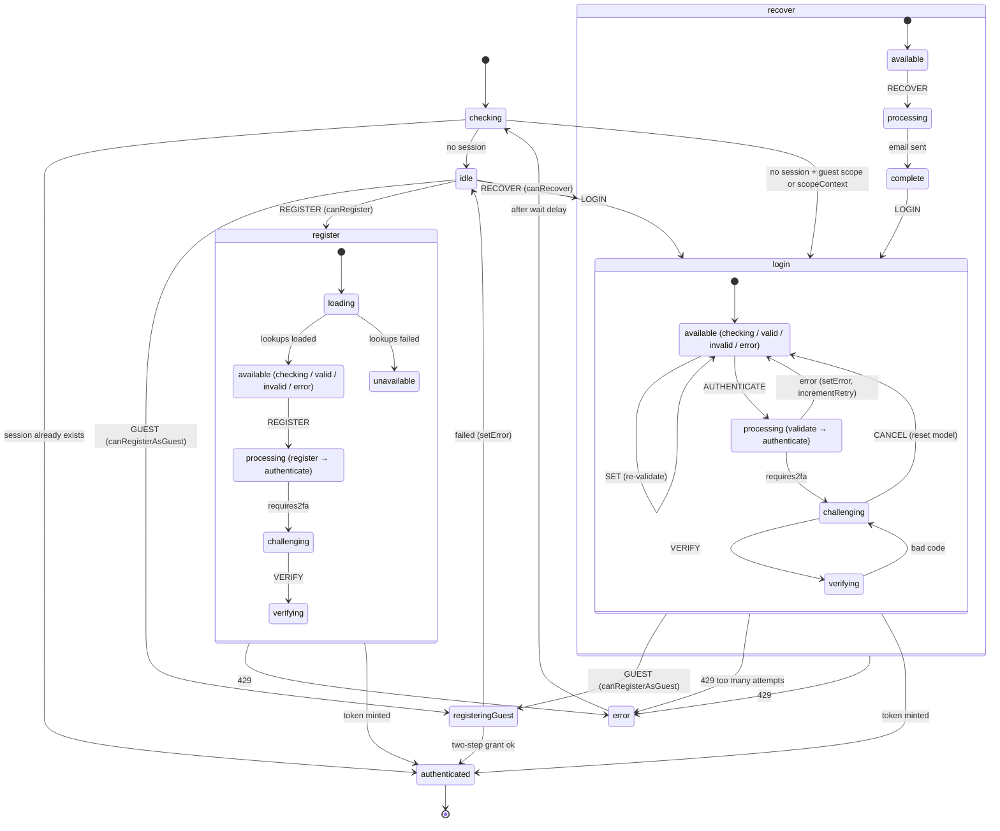

# Auth Module Architecture

## Overview

`useAuth` is a scoped composable wrapping a single XState machine (`auth.machine.ts`). The machine is an **ephemeral flow machine**: it boots, checks whether a session already exists, drives exactly one authentication flow (login / register / recover / guest-register), and terminates in a final `authenticated` state once a token has been minted and persisted to the session store. Actor-specific behaviour (client vs staff vs guest) is injected at the service layer — the machine shape is identical for every actor; the services it invokes differ.

## State Machine

Key structural facts:

- **`authenticated` is `type: "final"`** — a topology invariant. `session-store`'s `mintGuestToken()` resolves via `service.onDone`, which only fires on final states. Never nest children under it.
- **The `GUEST` event is global** and guarded by `canRegisterAsGuest` (reads brand config `GUEST_CHECKOUT_ENABLED`). The guard on the _transition_ is what makes the gate non-bypassable from the composable surface.
- **Every form state re-validates on `SET`** (parse → validate → `valid`/`invalid`), and processing states validate again before invoking a service.
- **`error` is the rate-limit parking state**: a 429 routes here, and a timed delay sends the machine back through `checking`.

## Data Flow

1. **Instantiation** — `useAuth().as("client")` resolves the actor via the scope builder, interprets the machine with `{ scopeActor, scopeContext, brandId }` in context, and registers an auto-destroy hook on session-store's `onLogout`.
2. **Service resolution** — every invoked service goes through `authMachineServices`, which routes to `createClientAuthServices()` / `createGuestAuthServices()` / `createStaffAuthServices()` by `context.scopeActor`. Shared `parse`/`validate`/`checkSession` live in the factory file.
3. **Token hand-off** — successful services call `persistTokenToStorage(token, { event })` (session-store util) _inside the service_, before the machine even transitions. The machine stores the token in context (`setToken`) purely for the final-state done-data.
4. **Session check** — `checkSession` reads session-store's `staffSessions`/`clientSessions`. Guest sessions are **not** counted as authenticated; only client/staff sessions short-circuit to `authenticated`.
5. **Forms** — schemas come from `auth.schemas.*` (JSON Forms); the register schema is extended at runtime with brand custom fields fetched by `loadLookups` (`GET clients_fields`).

### Actor-specific service matrix

| Service           | client                                                                                           | guest                | staff                                                                  |
| ----------------- | ------------------------------------------------------------------------------------------------ | -------------------- | ---------------------------------------------------------------------- |
| `authenticate`    | `password` grant (or child-client token via `clients/{id}/access_token` when `scopeContext` set) | `guest` grant        | `admin` grant (or impersonation via `admin/clients/{id}/access_token`) |
| `verify2fa`       | `twofa` grant                                                                                    | ❌ throws Forbidden  | `twofa-admin` grant                                                    |
| `register`        | `POST clients/register` (+recaptcha, referral, tracking)                                         | ❌ throws Forbidden  | `POST org/register`                                                    |
| `registerAsGuest` | `POST clients/register/guest` → `guest_customer` grant                                           | —                    | —                                                                      |
| `recover`         | `POST clients/password_reset`                                                                    | ❌ throws Forbidden  | `POST admin/users/password_reset`                                      |
| `loadLookups`     | `GET clients_fields`                                                                             | resolves `undefined` | `GET org/clients_fields`                                               |

## Dependencies

### Uses

- `session-store` — `persistTokenToStorage`, `useSessionStore` (session check, `onLogout`, impersonation registry). Static one-way import.
- `scope` — `createScopedComposable`, `ScopeActorTypes`, scope registry.
- `query` — all HTTP (services only, never composables).
- `brand` — `GUEST_CHECKOUT_ENABLED` config for the guest-register guard.
- `basket` — active currency id attached to guest-customer registration.
- `system-recaptcha`, `system-analytics` — captcha token + tracking enrichment on register/recover.
- `client-custom-fields` — custom-field mapping for register lookups.
- `system-localisation`, `feedback` — i18n + success toast on recovery.
- `routing` — `router.replace("/")` in `useVerifyEmail`.

### Used by

- `session-store` — `mintGuestToken()` **dynamically** imports `../auth` at boot to mint a guest token when no session exists. The dynamic import is deliberate (breaks the static cycle auth → session-store → auth); do not "tidy" it.
- `account` — reuses `useRegisterSchema` / `useRegisterUischema` and the `RegisterModel` shape for the guest → full-account upgrade form.
- `client-vue` session components (`Auth.vue`, `Register.vue`, `LoginPopover.vue`) and app funnel engines (cart, cart-nuxt, velia, hosting) — drive flows and gate routes on auth outcomes.

## Integration Points

| Boundary           | Contract                                                                                                                                                            |
| ------------------ | ------------------------------------------------------------------------------------------------------------------------------------------------------------------- |
| Token endpoint     | `POST /oauth/access_token`, form-urlencoded, grants `password`/`admin`/`twofa`/`twofa-admin`/`guest`/`guest_customer`/`refresh_token`; bare (non-envelope) response |
| Registration       | `POST clients/register`, `POST clients/register/guest`, `POST org/register`                                                                                         |
| Recovery           | `POST clients/password_reset`, `POST admin/users/password_reset`                                                                                                    |
| Email verification | `PATCH clients/{clientId}/emails/{emailId}/check_verify` with `{ reg_hash }`; URL params `client_id`/`email_id`/`hash` (shared contract with email templates)       |
| Session store      | minted tokens flow out via `persistTokenToStorage`; logout flows back in via `onLogout` → instance auto-destroy                                                     |
| Recordings         | co-located fixtures in `../__tests__/fixtures/` (ADR-025) are the wire-contract source of truth                                                                     |

> **🧪 For Testers:** After any successful authentication the session layer holds the new token and the auth instance reports `isAuthenticated` — but starting a _new_ flow (e.g. logging in as someone else) requires a fresh instance, because the machine has finalised. Logging out destroys the cached instance, so the next `useAuth()` call starts from `checking` again.

> **🔧 For Contributors:** If you move or rename a machine state node, sweep every `stateMatches`/`waitForProcessing` path string in `useAuth.actions*.ts` and `useAuth.meta.ts` in the same change — these strings don't typecheck (see `code-composables-scoped.md`).
