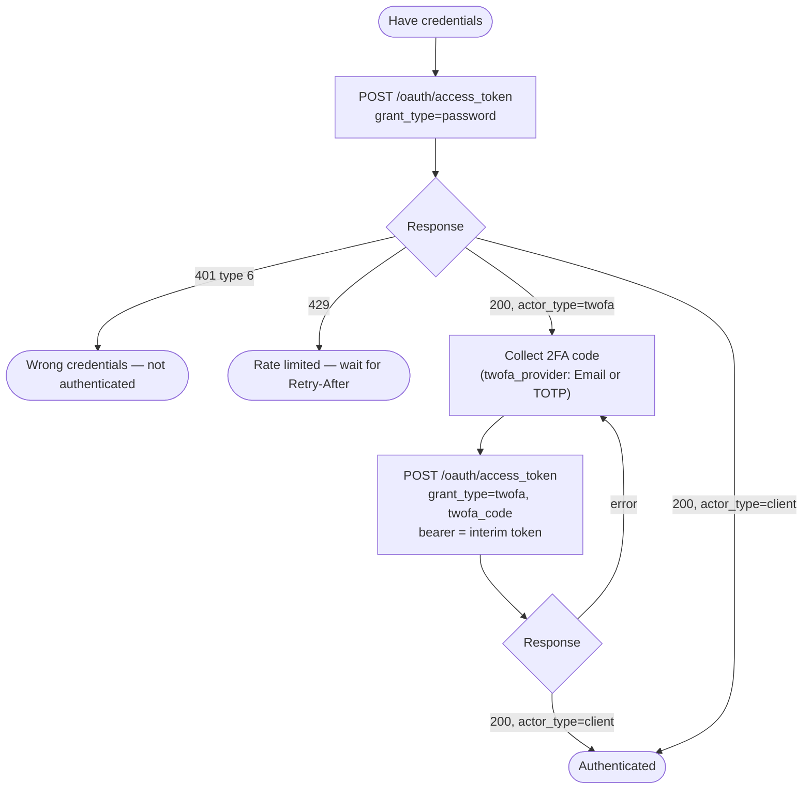
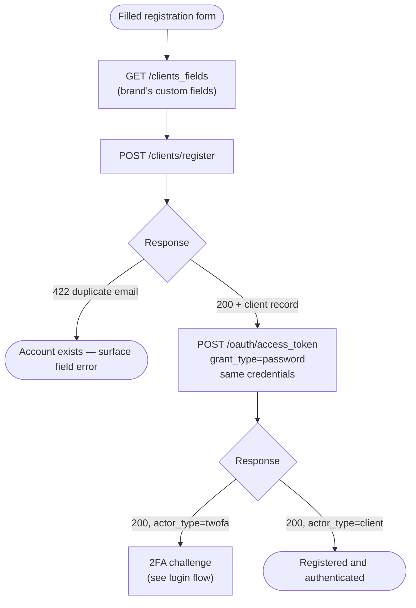
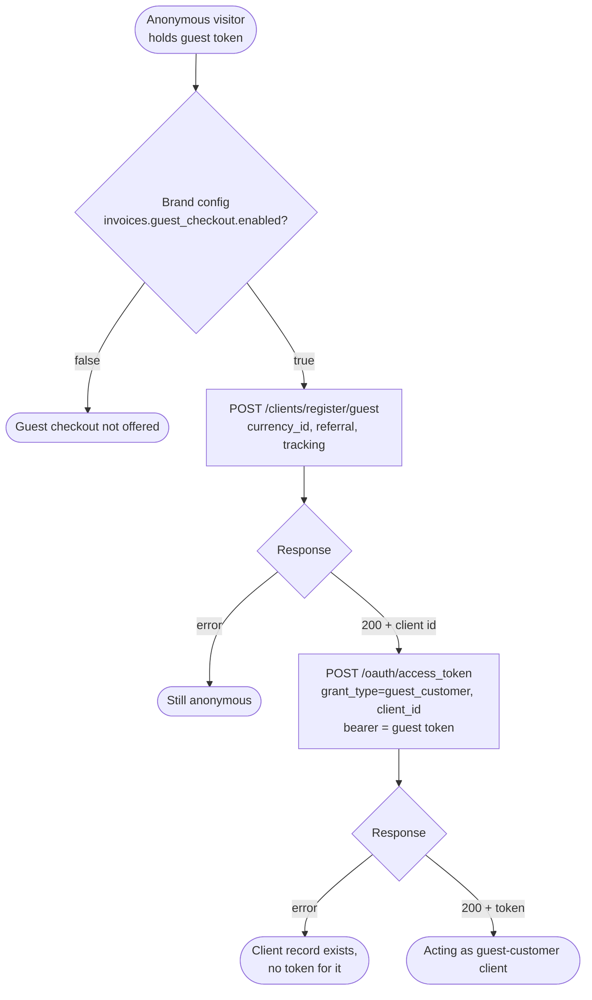
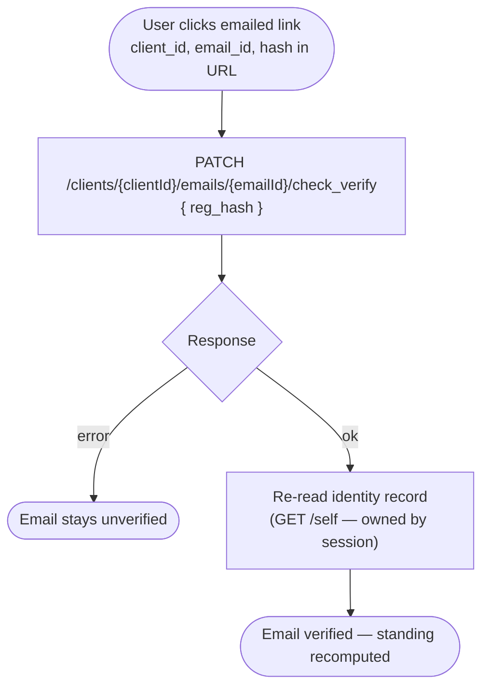

# Module: auth

## What it is

Auth is the platform's credential-exchange surface: it turns credentials (or nothing at all, for guests) into access tokens, and it owns the account-entry operations that surround that exchange — client registration, two-step guest-customer registration, password recovery, two-factor verification, and email verification from a link. Every token the platform ever issues comes out of one endpoint (`POST /oauth/access_token`) discriminated by a `grant_type`; auth is the module that knows which grant to use when, what each grant needs, and what comes back.

Token persistence, refresh scheduling, actor sessions, and the identity record (`/self`) live in the sibling `session` module; auth picks up when a token needs to be _minted_ and hands off the moment one exists. Post-authentication account standing — the guest → unverified → verified upgrade arc and its enforcement — lives in the sibling `account` module; auth's email-verification operation is the raw link-proof exchange that `account` builds its standing model on.

## Core concepts

- **Grant** — a named token-issuance strategy. One endpoint (`POST /oauth/access_token`) serves them all; the `grant_type` field in the request body selects the strategy (`password`, `admin`, `twofa`, `twofa-admin`, `guest`, `guest_customer`, `refresh_token`).
- **Actor** — who a token acts as: `guest`, `client`, or staff (`user`). Tokens carry an `actor_type` and `actor_id`; capabilities differ per actor (guests cannot register, recover, or use 2FA).
- **Guest token** — an anonymous token minted with no credentials (`grant_type: guest`). It has no actor identity (`actor_id` is an empty string) and exists so an unauthenticated visitor can hold a basket and browse priced content.
- **Guest-customer** — a real client record created _without_ credentials via the two-step guest registration (`POST /clients/register/guest` then the `guest_customer` grant). Distinguished from a fully-registered client only by `is_guest: true` on the identity record — not by anything on the token.
- **Interim 2FA token** — when an account has two-factor enabled, the password grant still returns `200` with a token, but that token is a limited challenge token (`actor_type: "twofa"` / `"twofa-admin"`, `twofa_provider` set). It is _not_ an authenticated session; it is the bearer credential for the follow-up `twofa` grant.
- **Verification hash (`reg_hash`)** — the proof carried in an email-verification link. It is session-agnostic: presenting the hash to the check-verify endpoint verifies the email regardless of who (if anyone) is logged in.

## Operations

| #   | Capability                              | Inputs                                                                                                                          | Outputs                                                      |
| --- | --------------------------------------- | ------------------------------------------------------------------------------------------------------------------------------- | ------------------------------------------------------------ |
| 1   | **Log in with credentials**             | username, password (grant `password` for clients, `admin` for staff)                                                            | token — either a full session token or an interim 2FA token  |
| 2   | **Complete a 2FA challenge**            | 2FA code + the interim token as bearer (grant `twofa` / `twofa-admin`)                                                          | full session token                                           |
| 3   | **Mint an anonymous guest token**       | — (grant `guest`)                                                                                                               | guest token with empty actor identity                        |
| 4   | **Refresh a token**                     | refresh token (grant `refresh_token`)                                                                                           | new access + refresh token pair                              |
| 5   | **Register a client account**           | email, name, password; optionally phone, custom fields, anti-bot token, referral cookie, tracking                               | client record (`id`, `public_name`, `org_id`) — **no token** |
| 6   | **Register a guest-customer**           | optionally currency id, referral cookie, tracking (step 1); returned client id (step 2, grant `guest_customer`)                 | client id, then a client-scoped token                        |
| 7   | **Request a password reset**            | username (email address)                                                                                                        | reset email dispatched                                       |
| 8   | **Read registration custom fields**     | —                                                                                                                               | custom-field definitions that extend the registration form   |
| 9   | **Verify an email address from a link** | client id, email id, verification hash                                                                                          | email marked verified                                        |
| 10  | **Mint a token for another client**     | target client id + a staff bearer (`/admin/clients/{id}/access_token`) or a parent-client bearer (`/clients/{id}/access_token`) | token acting as that client                                  |
| 11  | **Register an organisation (staff)**    | registration details                                                                                                            | organisation record                                          |
| 12  | **Request a staff password reset**      | username                                                                                                                        | reset email dispatched                                       |

## Data shape

Token responses come back as a **bare object** — no envelope:

```typescript
// Response of POST /oauth/access_token (all grants)
type Token = {
  access_token: string;
  refresh_token: string;
  token_type: string;
  expires_in: number; // seconds until access_token expires
  refresh_expires_in: number; // seconds until refresh_token expires
  actor_type: string; // "client" | "guest" | "user" — or "twofa" / "twofa-admin" on an interim 2FA token
  actor_id: string; // "" on guest tokens (no identity)
  second_factor_required: boolean; // true when this is an interim 2FA token
  password_change_required: boolean; // true = limited token; a new password must be set before a full session
  twofa_provider: "Email" | "TOTP" | null; // which second factor challenges the user; null when none
  redirect?: string; // present on some grants: origin to continue on
};
```

Every other auth endpoint wraps its payload in the standard response envelope:

```typescript
// Envelope for /clients/* and /org/* endpoints
type Envelope<T> = {
  status: "ok" | "error";
  data: T | null;
  related: unknown | null;
  total: number | null;
  error: null | {
    id: string; // server-side error trace id
    type: number; // error category (observed: 0 validation, 3 malformed request, 6 bad credentials, 9 denied)
    code: number; // mirrors the HTTP status
    message: string;
    data: Record<string, string[]> | null; // field-keyed validation messages on 422s
  };
  messages: string[] | { hint: string } | null; // servers attach hints here on some errors
};

// data of POST /clients/register (success)
type RegisteredClient = {
  id: string;
  public_name: string; // display-shortened name, e.g. "Jane D."
  org_id: string;
  image_url: string | null;
};

// data of POST /clients/register/guest (step 1 of guest registration)
type RegisteredGuestClient = {
  id: string; // client id used for the follow-up guest_customer grant
};
```

## Dependencies

### Dependants — modules that read from this one

Cross-module fan-in verified against `graphify-out/graph.json` plus direction-checking greps (the graph's auth edges are import-direction-ambiguous; each row below is grep-confirmed as importing _from_ auth).

| Module             | Weight | Reads                                                               | Why                                                                                                                                |
| ------------------ | ------ | ------------------------------------------------------------------- | ---------------------------------------------------------------------------------------------------------------------------------- |
| `account`          | 1      | registration form contract (schema + model shape)                   | the guest → full-account upgrade form collects the same fields as first-time registration                                          |
| `session`          | 1      | guest-token minting                                                 | at boot, when no session exists, the session layer requests an anonymous guest token so the visitor always has a bearer credential |
| Presentation layer | —      | login / register / recover / 2FA form state, authentication outcome | login popovers and account menus render the forms; app funnel engines gate checkout routes on the authentication outcome           |

_The HTTP transport layer and app-level routing consume most modules and are excluded as non-domain consumers._

### This module's own dependencies

- **HTTP transport layer** — bearer-token attachment, currency injection, error-shape normalisation, retry policy.
- **Session persistence (sibling `session`)** — every minted token is handed off for storage and lifecycle management; auth also asks it whether a session already exists before starting a login flow.
- **Brand configuration** — the guest-registration capability is gated on the brand config key `invoices.guest_checkout.enabled`.
- **Basket** — the active basket's currency id is attached to guest-customer registration so pricing context survives the registration.
- **Anti-bot / attribution inputs** — a captcha token, the `upm_aff` referral cookie, and tracking values enrich registration and recovery requests when available.
- **Shared types / enums** — grant types, actor types, 2FA providers (type-level only).

## API endpoints

> The token endpoint lives at the API root (`/oauth/access_token`) and takes **form-urlencoded** bodies; all other endpoints live under the standard API path and take JSON.

### POST /oauth/access_token

The single token mint. Every grant goes through here; the request body's `grant_type` selects the behaviour.

```typescript
// grant_type: "password" (client login) | "admin" (staff login)
type PasswordGrantBody = {
  grant_type: "password" | "admin";
  username: string;
  password: string;
};

// grant_type: "twofa" | "twofa-admin" — bearer must be the interim 2FA token
type TwofaGrantBody = {
  grant_type: "twofa" | "twofa-admin";
  twofa_code: string;
};

// grant_type: "guest" — anonymous, no credentials
type GuestGrantBody = {
  grant_type: "guest";
};

// grant_type: "guest_customer" — step 2 of guest registration; bearer = current guest token
type GuestCustomerGrantBody = {
  grant_type: "guest_customer";
  client_id: string; // id returned by POST /clients/register/guest
};

// grant_type: "refresh_token"
type RefreshGrantBody = {
  grant_type: "refresh_token";
  refresh_token: string;
};
```

An `auth_code` grant also exists for cross-origin session transfer; that flow is owned by the `session` module and is not re-documented here.

```bash
# Client login
curl -X POST "$API/oauth/access_token" \
  -H "Content-Type: application/x-www-form-urlencoded" \
  --data-urlencode "grant_type=password" \
  --data-urlencode "username=jane@example.com" \
  --data-urlencode "password=s3cret-pass"

# Guest token
curl -X POST "$API/oauth/access_token" \
  -H "Content-Type: application/x-www-form-urlencoded" \
  --data-urlencode "grant_type=guest"

# Refresh
curl -X POST "$API/oauth/access_token" \
  -H "Content-Type: application/x-www-form-urlencoded" \
  --data-urlencode "grant_type=refresh_token" \
  --data-urlencode "refresh_token=$REFRESH_TOKEN"

# 2FA challenge (bearer = the interim token from the password grant)
curl -X POST "$API/oauth/access_token" \
  -H "Content-Type: application/x-www-form-urlencoded" \
  -H "Authorization: Bearer $INTERIM_2FA_TOKEN" \
  --data-urlencode "grant_type=twofa" \
  --data-urlencode "twofa_code=123456"

# Guest-customer grant (bearer = the current guest token; step 2 of guest registration)
curl -X POST "$API/oauth/access_token" \
  -H "Content-Type: application/x-www-form-urlencoded" \
  -H "Authorization: Bearer $GUEST_ACCESS_TOKEN" \
  --data-urlencode "grant_type=guest_customer" \
  --data-urlencode "client_id=$CLIENT_ID"
```

Sample response — client password grant, `200`:

```json
{
  "second_factor_required": false,
  "password_change_required": false,
  "refresh_expires_in": 35999,
  "actor_id": "mock-uuid-1",
  "actor_type": "client",
  "twofa_provider": "Email",
  "token_type": "mock-token_type",
  "expires_in": 3599,
  "access_token": "mock-access_token",
  "refresh_token": "mock-refresh_token"
}
```

Sample response — guest grant, `200` (note the empty `actor_id`):

```json
{
  "second_factor_required": false,
  "password_change_required": false,
  "refresh_expires_in": 36000,
  "actor_id": "",
  "actor_type": "guest",
  "twofa_provider": null,
  "token_type": "mock-token_type",
  "expires_in": 3600,
  "access_token": "mock-access_token",
  "refresh_token": "mock-refresh_token"
}
```

Fixtures: `../__tests__/fixtures/post-oauth-access-token-client.json`, `post-oauth-access-token-guest.json`, `post-oauth-access-token-case-refresh-client.json` (each captures the request body too). 2FA-grant fixtures are not yet captured (pending FE-2788); the request shape above is the shipped contract.

### POST /clients/register

Creates a client account. Succeeds with the new client record — **not** a token; authentication is a separate follow-up call (see Flows).

```typescript
type RegisterBody = {
  email: string; // both fields carry the same address
  username: string;
  firstname: string;
  lastname: string;
  password: string;
  phone?: string; // national number
  phone_code?: string; // calling code, e.g. "44"
  phone_country_code?: string; // ISO country, e.g. "GB"
  custom_fields?: Record<string, unknown>; // values for fields from GET /clients_fields
  recaptcha_token?: string; // anti-bot proof when captcha is enabled
  referral_cookie?: string; // raw upm_aff cookie value — sent undecoded
  tracking?: Record<string, unknown>; // attribution values
};
```

```bash
curl -X POST "$API/clients/register" \
  -H "Content-Type: application/json" \
  -H "Authorization: Bearer $ACCESS_TOKEN" \
  -d '{
    "email": "jane@example.com",
    "username": "jane@example.com",
    "firstname": "Jane",
    "lastname": "Doe",
    "password": "s3cret-pass",
    "phone": "7700900000",
    "phone_code": "44",
    "phone_country_code": "GB",
    "custom_fields": { "company_size": "10-50" },
    "recaptcha_token": "captcha-proof",
    "referral_cookie": "aff-cookie-value",
    "tracking": { "utm_source": "newsletter" }
  }'
```

Sample response — `200`:

```json
{
  "status": "ok",
  "data": {
    "id": "mock-uuid-2",
    "public_name": "Fixture G.",
    "org_id": "mock-uuid-3",
    "image_url": null
  },
  "related": null,
  "total": null,
  "error": null,
  "messages": []
}
```

Sample response — duplicate email, `422` (field errors key on `username` even though the input is an email):

```json
{
  "status": "error",
  "data": null,
  "related": null,
  "total": null,
  "error": {
    "id": "70ea2690a11163f0fae8e561b4f08cbdec9b0d02",
    "type": 0,
    "code": 422,
    "message": "API request invalid!",
    "data": {
      "username": ["Already in use."]
    }
  },
  "messages": null
}
```

Fixtures: `../__tests__/fixtures/post-clients-register.json`, `post-clients-register-case-duplicate-email.json`, `post-clients-register-case-invalid-token.json` (401 with a malformed bearer).

### POST /clients/register/guest

Step 1 of guest-customer registration: creates a client record with **no credentials and no email**. The caller then exchanges the returned `id` via the `guest_customer` grant (step 2). The guest's email is attached later through the account-standing flow (sibling `account` module).

```typescript
type RegisterGuestBody = {
  currency_id?: string; // pricing currency to register under (e.g. the active basket's)
  referral_cookie?: string; // raw upm_aff cookie value
  tracking?: Record<string, unknown>;
};
```

```bash
curl -X POST "$API/clients/register/guest" \
  -H "Content-Type: application/json" \
  -H "Authorization: Bearer $GUEST_ACCESS_TOKEN" \
  -d '{
    "currency_id": "currency-uuid",
    "referral_cookie": "aff-cookie-value",
    "tracking": { "utm_source": "newsletter" }
  }'
```

Response: envelope with `data: { "id": "client-uuid" }`. No captured fixture yet.

### POST /clients/password_reset

Dispatches a password-reset email for a client account.

```typescript
type PasswordResetBody = {
  username: string; // the account email address
  recaptcha_token?: string; // anti-bot proof when captcha is enabled
};
```

```bash
curl -X POST "$API/clients/password_reset" \
  -H "Content-Type: application/json" \
  -d '{ "username": "jane@example.com", "recaptcha_token": "captcha-proof" }'
```

No captured fixture yet.

### GET /clients_fields

Returns the custom-field definitions a brand requires at registration; callers merge these into the registration form and submit the values back under `custom_fields`. Staff variant: `GET /org/clients_fields`.

```bash
curl "$API/clients_fields" -H "Authorization: Bearer $ACCESS_TOKEN"
```

No captured fixture yet.

### PATCH /clients/{clientId}/emails/{emailId}/check_verify

Marks an email address verified using the hash from the verification email. Session-agnostic: the `reg_hash` is the proof, so the call succeeds whether or not the verifying browser holds the account's session.

```typescript
type CheckVerifyBody = {
  reg_hash: string; // hash carried in the emailed verification link
};
```

```bash
curl -X PATCH "$API/clients/$CLIENT_ID/emails/$EMAIL_ID/check_verify" \
  -H "Content-Type: application/json" \
  -H "Authorization: Bearer $ACCESS_TOKEN" \
  -d '{ "reg_hash": "verification-hash-from-link" }'
```

No captured fixture yet.

### POST /admin/clients/{clientId}/access_token · POST /clients/{clientId}/access_token

Mints a token that acts as the target client — the admin path for staff impersonation (staff bearer), the client path for a parent client acting as a child account (parent-client bearer). No request body; the bearer token authorises the mint.

```bash
curl -X POST "$API/admin/clients/$CLIENT_ID/access_token" \
  -H "Authorization: Bearer $STAFF_ACCESS_TOKEN"
```

Response: bare token object. The returned token can arrive without `actor_type`/`actor_id` populated (see Lessons). No captured fixture yet.

### POST /org/register · POST /admin/users/password_reset

Staff-side counterparts of registration and recovery: organisation registration takes the same name/email/password field family as client registration; the admin password reset takes `{ username }`. Both wrap responses in the standard envelope.

```bash
curl -X POST "$API/admin/users/password_reset" \
  -H "Content-Type: application/json" \
  -d '{ "username": "ops@example.com" }'
```

No captured fixtures yet.

## Failure modes

For `POST /oauth/access_token` and `POST /clients/register`, three outcome classes exist — and the third is the one that bites:

1. **Hard success** — `200` with a full token (`actor_type` is a real actor) or, for register, `status: "ok"` and the client record in `data`.
2. **Hard failure** — `4xx` with a categorised error:
   - `401`, error type `6`, `"The user credentials were incorrect."` — wrong username/password. Fixture: `post-oauth-access-token-case-bad-password.json`.
   - `400`, error type `3`, malformed grant (e.g. `password` grant missing `username`) — the server attaches the culprit in `messages.hint` ("Check the username parameter"). Fixture: `post-oauth-access-token-case-malformed.json`.
   - `401`, error type `9`, `"The resource owner or authorization server denied the request."` with `messages.hint: "The JWT string must have two dots"` — a garbage bearer on an authenticated call. Fixture: `post-clients-register-case-invalid-token.json`.
   - `422`, error type `0`, field-keyed validation errors in `error.data` — e.g. duplicate email keyed under `username`.
   - `429` — rate limited after repeated attempts; `Retry-After` and `X-RateLimit-Limit` response headers are CORS-exposed on auth failures.
3. **Soft success (`200` but not authenticated)** — the password grant returns `200` with a token that is _not_ a session:
   - **Interim 2FA token**: `actor_type` is `"twofa"` / `"twofa-admin"` and `second_factor_required`/`twofa_provider` are set. Trigger: the account has 2FA enabled. Recovery: collect the code and call the `twofa` grant with this token as bearer. Treating this `200` as logged-in stores a challenge token as a session.
   - **Password-change-required token**: `password_change_required: true` marks a limited token; a new password must be set before a full session is granted.

## Flows

### Credential login with a 2FA branch

How a caller gets from credentials to a session token when the account may have two-factor enabled.



Guarantees the platform holds:

- One endpoint covers every step; only `grant_type` and the bearer change.
- The interim token is a working bearer credential for exactly one purpose: the `twofa` grant.
- `twofa_provider` on the interim token tells the caller which second factor to prompt for (`Email` or `TOTP`).

Constraints the caller has to plan around:

- A `200` from the password grant does not mean authenticated — the discriminator is `actor_type` / `second_factor_required` on the token.
- A wrong 2FA code leaves the user unauthenticated at the challenge step; the interim token, not the password, is what authorises retries.
- Repeated failures rate-limit the endpoint globally (`429`), not per form.

### Client registration, then authentication

Registration creates the account; it does not log the user in.



Guarantees the platform holds:

- A `200` register response means the account exists; the returned record carries the new client `id`.
- The same credentials submitted to register work immediately for the password grant.

Constraints the caller has to plan around:

- Register returns **no token** — authentication is a second, independently-fallible call. Between the two, the account exists but the user is not logged in; a retry of register then fails `422` (duplicate).
- Duplicate-address errors come back keyed on `username` in `error.data`, even when the user only ever saw an "email" field.
- Newly registered accounts can still hit the 2FA branch (org-level policy), so the login flow's branching applies here too.

### Two-step guest-customer registration

Turns an anonymous visitor into a client record that can check out — without credentials or an email.



Guarantees the platform holds:

- The client record minted in step 1 needs no email and no password.
- The step-2 token acts as that client for basket, checkout, and order reads; the identity record carries `is_guest: true` as the discriminator.

Constraints the caller has to plan around:

- The brand toggle is configuration the client reads — the endpoints themselves accept the calls regardless of it (see Lessons).
- A failure between step 1 and step 2 strands a credential-less client record with no token pointing at it.
- Nothing on the token distinguishes a guest-customer from a full client; consumers that branch on token fields alone misroute them.

### Email verification from a link



Guarantees the platform holds:

- The `reg_hash` is the whole proof — the call verifies the email with or without an active session for that account.

Constraints the caller has to plan around:

- The verified flag lives on the identity record, not in this endpoint's response — consumers that gate on verification only observe the change after re-reading identity.
- Links arrive with three parameters (`client_id`, `email_id`, `hash`); any of them missing makes the call unresolvable, so the URL contract with the email template is load-bearing.

## Lessons (hard-won)

- **A `200` from the token endpoint is not authentication.** Interim 2FA tokens and `password_change_required` tokens both arrive as `200` with a complete-looking token object. Consumers that treat any `200` as logged-in persist a challenge token as a session and fail downstream in confusing ways.
- **Two response shapes coexist in one module.** The token endpoint returns a bare object; every other auth endpoint wraps payloads in the `status`/`data`/`error` envelope. A single response parser mishandles one of them.
- **Registration success and authentication failure can co-occur.** Register creates the account; the follow-up password grant is a separate request that can independently fail (rate limit, network). The user then owns an account they never logged into, and re-submitting the registration form yields `422` duplicate errors.
- **Impersonation and child-client token mints return underspecified tokens.** Tokens from `/admin/clients/{id}/access_token` and `/clients/{id}/access_token` can arrive without `actor_type`/`actor_id`, so the caller cannot infer from the response alone who the token acts as — the request context is the only record of it.
- **The guest-checkout toggle is data, not enforcement.** `invoices.guest_checkout.enabled` is a brand config key the client reads; `POST /clients/register/guest` and the `guest_customer` grant accept direct calls regardless of its value. A brand that disables guest checkout is not protected by the platform from a client that ignores the key.
- **Guest-customers are invisible on the token.** Only `is_guest: true` on the identity record distinguishes a guest-customer from a full client. Session layers that route on `actor_type` alone send guest-customers down the wrong path after a reload.
- **`email` and `username` are the same value with two names.** Registration sends the address in both fields, and validation errors key on `username` — surfacing them under an "email" form field requires knowing this mapping.
- **Auth failures are rate-limited globally.** Repeated bad logins produce `429` with `Retry-After`; the limit spans the auth surface, so a lockout in one form (login) also stalls another (recovery) for the same origin.
- **The email-verification URL contract is shared with the email template.** The three link parameters are produced by the platform's emails and consumed by the client; either side renaming a parameter silently breaks verification for every new signup.
