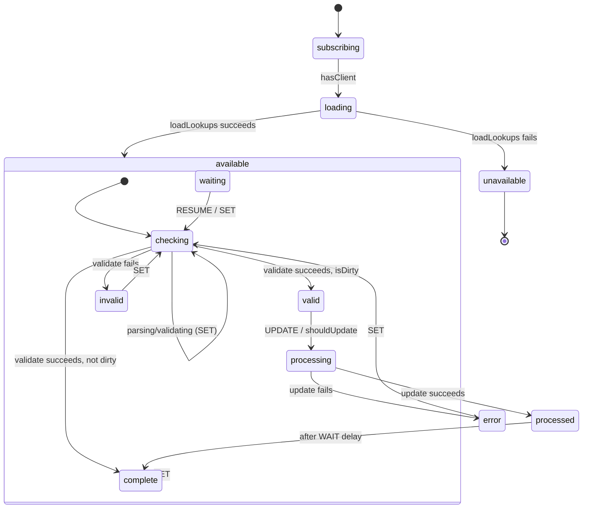

# basket-billing Architecture

## Overview

`basket-billing` is not a top-level composable module in the usual sense — its state machine (`billing.machine.ts`) is spawned as a **child actor of the basket machine** (`../basket/basket.machine.ts`), and only once the loaded basket carries a `client_id` (`spawnActors`, `basket.machine.ts:592`). `useBasketBilling()` reads that child actor off `useBasket().actors.billing` rather than owning any machine of its own. A second, fully independent machine — `dataManagerMachine`, configured by `unified/actions.ts` / `unified/services.ts` — drives the separate "create a new billing detail" form via `useUnified()`.

## State Machine



`REFRESH` (fired whenever the parent basket changes) re-enters `available.checking` from any state when the basket id or client id has actually changed. `CLEAR` resets the model and also re-enters `available.checking`. `WAIT` / `RESUME` move into and out of a `waiting` sub-state used while a sibling flow (e.g. adding a new address) is in progress.

## Data Flow

```text
┌──────────────┐     ┌────────────────────┐     ┌──────────────────────┐
│  basket.machine│───▶│ billing.machine     │───▶│ basket-billing.services│
│ (spawns on     │    │ (subscribing→       │    │ loadLookups / update   │
│  client_id)    │    │  loading→available…) │    │ (PUT /orders/{id})    │
└──────────────┘     └────────────────────┘     └──────────────────────┘
                              │                            │
                              ▼                            │
                     ┌──────────────────┐                  │
                     │      context      │◀─────────────────┘
                     │ model / schema /   │
                     │ config / error     │
                     └──────────────────┘
                              │
                              ▼
                     useBasketBilling() — read-only view + set/update/clear
```

1. **Basket load resolves a claimed basket** → `basket.machine` spawns the billing child, seeding it with the basket's `id` and `client_id`.
2. **`loading` invokes `loadLookups`** → reads the brand's requirement flags (`CHECKOUT_REQUIRE_PHONE`, `REQUIRE_COMPANY_FOR_ORDERS`, `REQUIRE_ADDRESS_FOR_ORDERS`), builds the JSON Schema / UI Schema, and resolves the base model.
3. **`checking` parses and validates** every time the caller `SET`s a new model.
4. **`processing` invokes `update`** → `PUT /orders/{basketId}?case=billing`; on success it notifies the parent basket to refresh (`sendParent({ type: "REFRESH" })`), which recomputes tax against the new address.

## Sub-Composables

`useBasketBilling()` does not follow the four-layer (`useActions` / `useContext` / `useMeta` / `useInternals`) scoped-composable factory pattern — it is a flat composable that returns every value directly (see [usage.md](./usage.md)). It is not itself actor-scoped (`.as('client')` / `.as('staff')`); the acting client is always whichever client owns the hosting basket.

`useUnified()` (exposed as `useUnifiedBillingDetail`) is a second, self-contained composable built on the shared `dataManagerMachine`, with its own `services.ts` / `schemas.ts` / `actions.ts` split.

## Services

| File | Purpose |
|------|---------|
| `basket-billing.services.ts` | `loadLookups` (brand requirement flags + base model), `parse`, `validate`, `update` (`PUT /orders/{basketId}?case=billing`). |
| `unified/services.ts` | `loadLookups` (countries/regions/phones/emails/addresses/companies + brand flags), `add` (delegates the create to `client-address` / `client-company` / `client-phone`), `parse`, `validate`, `invalidate`. |
| `basket-billing.schema.ts` / `unified/schemas.ts` | Derive the JSON Schema / UI Schema from the resolved requirement flags. |

Neither service file splits by actor (`client` / `staff`) — `basket-billing` has no staff-facing variant; a staff user acting on behalf of a client resolves through the client's own session, not a separate service arm.

## Dependencies

### basket-billing Depends On

| Module | Usage |
|--------|-------|
| `brand` | Reads the requirement flags (`CHECKOUT_REQUIRE_PHONE`, `REQUIRE_COMPANY_FOR_ORDERS`, `REQUIRE_ADDRESS_FOR_ORDERS`, `REQUIRE_REGION_IN_ADDRESS`). |
| `system` | Country / region lookups for the new-billing-detail form. |
| `client-address` / `client-company` / `client-phone` / `client-email` | Own the actual create for a new billing detail; `unified/services.ts` delegates to them rather than issuing its own POST. |
| `session-store` | Confirms an authenticated session before loading lookups. |
| `query` | HTTP dispatch for the billing `PUT`. |

### Modules That Depend On basket-billing

| Module | Usage |
|--------|-------|
| `basket` | Hosts and spawns the billing child once a basket is claimed (populator direction — see [foundation.md](./foundation.md) Dependencies). |

Presentation-layer and storefront-funnel consumption is documented in [foundation.md](./foundation.md) Dependants (billing components under `client-vue/src/modules/billing` and `checkout`, and the funnel engines in `apps/cart`, `apps/cart-nuxt`, `apps/hosting`, `apps/velia`).

## Integration Points

| System | Integration |
|--------|-------------|
| **basket machine** | Parent/child actor relationship — billing is spawned only once `basket.client_id` is set, and stopped/restarted alongside the other basket child actors. |
| **HTTP transport (`query`)** | `PUT /orders/{basketId}?case=billing` for the commit; brand/system reads for lookups. |
| **JSONForms** | `schema` / `uischema` drive a schema-based form renderer for both the selection form and the new-detail form. |
