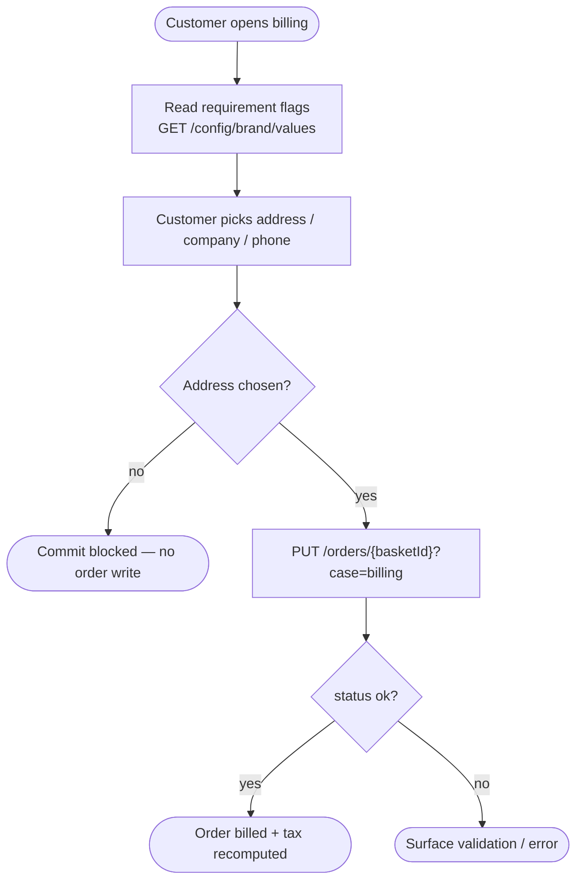
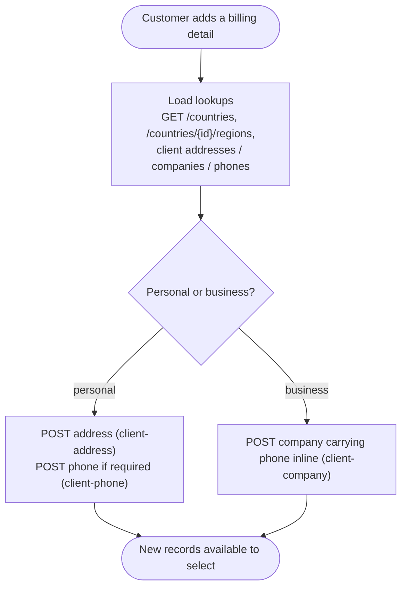

# Module: basket-billing

## What it is

`basket-billing` owns the **billing details attached to a basket/order**: which address, company, and phone the order bills to, and the creation of a new billing detail when the customer has none to select. It attaches a chosen selection to the order and recomputes the order's tax against that address. It also drives the "add a new billing detail" form — a **personal** detail (an address, plus a phone when the brand requires one) or a **business** detail (a company that carries its own address and phone).

Address, company, and phone records themselves live in `client-address`, `client-company`, and `client-phone`; country and region lookups live in `system`; the brand requirement flags live in `brand`. `basket-billing` picks up after those exist: it reads them to build the form, delegates record creation to them, and writes only the resulting selection onto the order.

> _Any `meta` or `object_meta` field returned by these endpoints is UI-specific to our own client — ignore for spec purposes._

### Keys by lifecycle phase

| Phase    | Keys                         | Relevance                                                 |
| -------- | ---------------------------- | --------------------------------------------------------- |
| Checkout | `CHECKOUT_REQUIRE_PHONE`     | Whether a phone is mandatory on a billing detail.         |
| Checkout | `REQUIRE_COMPANY_FOR_ORDERS` | Whether a company is mandatory before an order can bill.  |
| Checkout | `REQUIRE_ADDRESS_FOR_ORDERS` | Whether an address is mandatory before an order can bill. |
| Checkout | `REQUIRE_REGION_IN_ADDRESS`  | Whether a region/state is mandatory inside an address.    |

The requirement flags are read from keyed brand configuration; their values are booleans.

## Core concepts

- **Billing selection** — the trio of ids (address, company, phone) held on the order. Only the address is needed for a selection to bill; company and phone are optional unless a requirement flag makes them mandatory.
- **Billing detail** — a customer-owned address / company / phone record the selection points at. `personal` = an address and optional phone; `business` = a company that carries its own address and phone.
- **Requirement flags** — the four brand booleans above. They decide which parts of a billing detail the customer must supply before the order can bill.

## Operations

| #   | Capability                          | Inputs                                                  | Outputs                                                            |
| --- | ----------------------------------- | ------------------------------------------------------- | ------------------------------------------------------------------ |
| 1   | **Read billing readiness**          | —                                                       | whether the billing surface has finished loading and is usable     |
| 2   | **Read billing requirements**       | —                                                       | which of address / company / phone / region the brand requires     |
| 3   | **Set the billing selection**       | address id, company id, phone id                        | the pending selection, held but not yet committed                  |
| 4   | **Commit the billing selection**    | basket id, address id (company / phone optional)        | the recomputed order, with the selection and refreshed tax applied |
| 5   | **Clear the billing selection**     | —                                                       | the selection reset to empty                                       |
| 6   | **Capture the initial selection**   | —                                                       | the last committed selection, as a stable snapshot                 |
| 7   | **Open a new billing detail**       | detail kind (`personal` / `business`), acting client id | a prepared, empty detail form with lookups loaded                  |
| 8   | **Validate a billing-detail input** | a partial detail model                                  | the checked model, or the list of validation failures              |
| 9   | **Create a billing detail**         | detail kind, detail model                               | the created address / company / phone records                      |

Additional always-on behaviours: a readiness signal that resolves once loading settles; a refresh that re-reads the selection when the underlying basket changes; a pause/resume that holds validation while the customer adds a new record, then re-checks.

## Data shape

TypeScript-ish notation. The `meta` / `object_meta` bags are stripped per the top-of-doc note.

```ts
// The billing selection held on the order.
type BillingSelection = {
  addressId?: string | null; // null on commit → server assigns the client default address
  companyId?: string | null; // null → no company
  phoneId?: string | null; // null → no phone
};

// The requirement flags, resolved from keyed brand config.
type BillingRequirements = {
  requiresPhone: boolean;
  requiresCompany: boolean;
  requiresAddress: boolean;
  requiresRegion: boolean;
};

// A new billing detail being created.
type BillingDetailKind = "personal" | "business";

type BillingDetailModel = {
  address?: {
    address1?: string | null;
    city?: string | null;
    postcode?: string | null;
    countryId?: string | null;
    regionId?: string | null;
  };
  company?: {
    name?: string;
    addressId?: string | null; // an existing address id the company bills from
    emailId?: string | null;
    phoneId?: string | null;
  };
  phone?: {
    number?: string | null; // E.164, e.g. "+441632960001"
    nationalNumber?: string | null;
    countryCallingCode?: string | null;
    country?: string | null; // ISO country code, e.g. "GB"
  };
};
```

The commit response is the **full order object** (owned and documented by the basket/order module); the fields this module sets and reads back are `address_id`, `company_id`, `phone_id`, and the recomputed tax/total amounts.

## Dependencies

### Dependants — modules that read from this one

| Consumer                                             | Weight | Reads                                                                   | Why                                                                                                |
| ---------------------------------------------------- | ------ | ----------------------------------------------------------------------- | -------------------------------------------------------------------------------------------------- |
| Storefront checkout funnels (cart / hosting / velia) | 6      | billing readiness, billing validity, selected address / company / phone | Apply the default billing selection and gate checkout progression on a valid, committed selection. |
| Presentation layer (billing + checkout components)   | 6      | billing selection, requirement flags, validation state, form schema     | Render and drive the billing forms (personal / business tabs), the summary, and checkout alerts.   |

The HTTP transport layer and app navigation are excluded as foundational consumers. No sibling headless module reads this module; the basket module is a **dependency** (it hosts and populates the billing surface), not a dependant.

### This module's own dependencies

- **HTTP transport layer** — request dispatch, auth token attachment, currency injection, error normalisation.
- **Shared types / enums** — the order and detail model types (address / company / phone / country / region).
- **Sibling data modules** — `brand` (requirement flags), `system` (country / region lookups), `client-address` / `client-company` / `client-phone` / `client-email` (the records a detail is built from and created in). A billing-detail creation delegates the address / company / phone POSTs to these modules rather than issuing its own.

## API endpoints

### `PUT /orders/{basketId}?case=billing`

**Role** — attach a billing selection to the order and recompute its tax. Invoked when the customer confirms an address (and optionally a company / phone), or when a default selection is applied at checkout entry.

**Request body**

```ts
type CommitBillingBody = {
  address_id: string | null; // null → server assigns the client's default address
  company_id: string | null; // null → no company on the order
  phone_id: string | null; // null → no phone on the order
};
```

**Curl**

```bash
curl -X PUT "$API/orders/0e435795-e78d-1886-502b-31643202d986?case=billing" \
  -H "Authorization: Bearer $ACCESS_TOKEN" \
  -H "Content-Type: application/json" \
  -d '{ "address_id": null, "company_id": null, "phone_id": null }'
```

**Sample response** (abridged to the billing-relevant fields; the endpoint returns the full order object)

```jsonc
{
  "status": "ok",
  "data": {
    "id": "0e435795-e78d-1886-502b-31643202d986",
    "client_id": "25d96e76-3ed0-913d-d52c-417482528340",
    "address_id": "d6325079-8065-d1e3-dd8b-8174e234e98d", // default applied though request sent null
    "company_id": null,
    "phone_id": null,
    "currency_id": "3825d96e-763e-d091-3dc4-174825283406",
    "net_amount": 60,
    "tax_amount": 12,
    "total_amount": 72,
    "display_status": "Draft"
  },
  "error": null,
  "messages": []
}
```

**Fixture** — `__tests__/fixtures/put-orders-id-case-billing.json` (captures request and response).

### Billing-detail creation — forwarded

Creating a new billing detail issues `POST` calls to the sibling record modules, not to this module's own endpoint:

- **personal** — an address create (`client-address`) and, when a phone is supplied, a phone create (`client-phone`).
- **business** — a single company create (`client-company`) that carries the address and phone inline.

Those endpoints are documented by their owning modules. This module's contribution is the orchestration described under Flows.

## Failure modes

`PUT /orders/{basketId}?case=billing`:

1. **Hard success** — `200 + status: "ok"` with the order's `address_id` populated and amounts recomputed.
2. **Hard failure** — `4xx + status: "error"` with a category and message; a validation failure (`422`) carries per-field errors.
3. **Commit blocked before the wire** — a commit with no address resolves to no request at all: the selection is treated as incomplete and no order write is attempted. The caller sees an "address not available" failure, not a server error.

The commit recomputes tax server-side, so the returned amounts can differ from the pre-commit order even when only the address changed.

## Flows

### Configure, then commit a selection

Purpose: attach the customer's chosen address / company / phone to the order and refresh its tax.



Guarantees the platform holds: the same endpoint accepts every combination of address / company / phone; the response is the fully recomputed order, so amounts are always consistent with the committed address.

Constraints the caller has to plan around: an address is required for the order to bill; a commit without one never reaches the server; the returned tax can change on every commit.

### Create a new billing detail

Purpose: create the address / company / phone records a selection can then point at.



Guarantees the platform holds: a business detail creates the phone as part of the single company create; a personal detail creates the phone on its own.

Constraints the caller has to plan around: all lookups (countries, regions, config, existing client records) must resolve before the form can render; a region is only meaningful once its country is chosen, and changing the country invalidates a previously chosen region.

## Lessons (hard-won)

- A billing selection cannot bill without an address, but company and phone are optional unless a requirement flag makes them mandatory. The four flags are independent, so a valid detail for one brand is incomplete for another.
- Sending a null address on commit does not clear the address — the server substitutes the client's default. A caller that means "no address" and one that means "use the default" send the same value and get the default.
- The commit returns the whole recomputed order, not just the billing fields. Consumers that need "what changed" diff the returned order against the pre-commit state; the platform surfaces no change pointer.
- Creating a business detail with a phone as two separate creates double-writes the phone: the company create already carries the phone inline. The personal path is the only one where the phone is created on its own.
- Country and region form a dependent pair: a region is validated against its country's region list, and a country change strands any previously chosen region until the new list loads.
- The billing surface is populated by the basket it hangs off; a consumer that reads the selection at boot can race the basket's own load and see an empty selection before it settles.
- A billing detail is created against the acting client's records. When staff act on behalf of a client, the address / company / phone must resolve to that client, not to the staff account.
