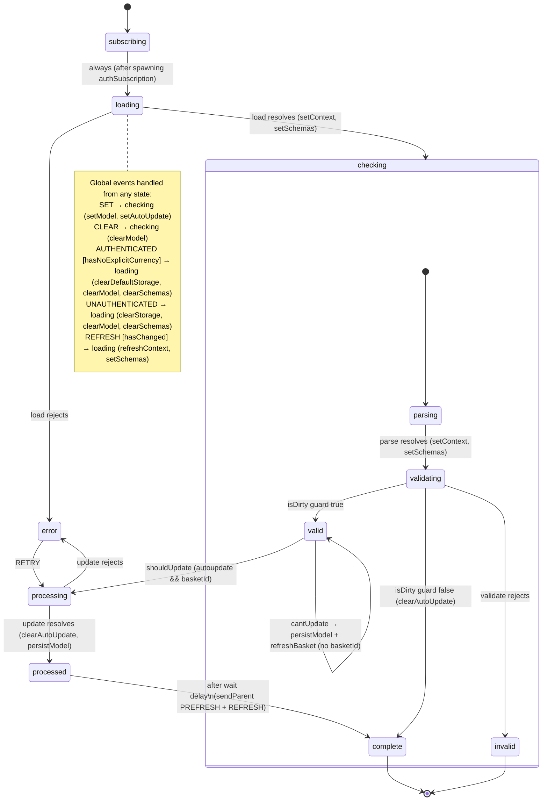

# basket-currency — Architecture

## Overview

`basket-currency` is a child actor spawned by the basket machine. It manages the cart's display currency for the lifetime of the basket session. The machine subscribes to auth changes via a spawned `authSubscription` actor, resolves the correct currency using a six-step precedence chain, optionally PUTs the chosen currency to the basket API, and notifies the parent basket on completion.

## State Machine

Machine id: `basketCurrencyManager` (XState v4, [`basket-currency.machine.ts`](../basket-currency.machine.ts))



## State Reference

| State                 | Entry/Invoke                           | What happens                                                                                                         |
| --------------------- | -------------------------------------- | -------------------------------------------------------------------------------------------------------------------- |
| `subscribing`         | `setAuthHelper`, `clearError`          | Spawns `authSubscription` actor; transitions immediately to `loading`                                                |
| `loading`             | `clearError`; invokes `load`           | Awaits `useBrand`, runs `resolveBaseModel`, hydrates model from currency code                                        |
| `checking.parsing`    | invokes `parse`                        | Calls `useBrand().validateCurrency()` to hydrate model from supported currencies                                     |
| `checking.validating` | invokes `validate`                     | Runs JSON Schema validation; rejects with `DetailedError` on failure                                                 |
| `valid`               | —                                      | Clean model; auto-advances to `processing` if `shouldUpdate`; calls `persistModel` + `refreshBasket` if `cantUpdate` |
| `invalid`             | —                                      | Validation failed; idles until next `SET`                                                                            |
| `processing`          | `clearError`; invokes `update`         | PUTs `{ currency_code }` to `/orders/{basketId}/currency`; debounced (leading, 1 s)                                  |
| `processed`           | sends `PREFRESH` + `REFRESH` to parent | Triggers basket refresh; auto-advances after `wait` delay                                                            |
| `complete`            | —                                      | Idle resting state; ready for next `SET`                                                                             |
| `error`               | —                                      | Load or update failed; `RETRY` re-enters `processing`                                                                |

## Guards

| Guard                   | Logic                                                              |
| ----------------------- | ------------------------------------------------------------------ |
| `isDirty`               | `model.id !== baseModel.id`                                        |
| `shouldUpdate`          | `autoupdate && basketId`                                           |
| `cantUpdate`            | `autoupdate && !basketId`                                          |
| `hasBasket`             | `!!basketId`                                                       |
| `hasNoExplicitCurrency` | `!getExplicitCurrency()` — reads the `currency` sessionStorage key |
| `hasChanged`            | incoming basket `currency_id` or `id` differs from stored context  |

## Currency Resolution — `resolveBaseModel`

Defined in [`basket-currency.utils.ts`](../basket-currency.utils.ts). Called by the `load` service on every machine (re)load.

```
resolveBaseModel(model?)
  │
  ├─ 1. model.code set? → find in supported currencies by id OR code (case-insensitive) → return
  ├─ 2. sessionStorage["currency"] set? → find in supported currencies → return
  ├─ 3. sessionStorage["currency_default"] set? → find in supported currencies → return (short-circuit)
  └─ 4. compute:
         accountCurrency() → localeCurrency() [only if BASKET_DEFAULT_CURRENCY=language] → brand default
         → persistDefaultCurrency(computed.code) → return
```

Once computed (step 4), the result is written to `currency_default` so the next reload short-circuits at step 3. This mirrors the `useLocale` warm-reload pattern.

> **🔧 For Contributors:** The test suite at [`__tests__/basket-currency.utils.test.ts`](../__tests__/basket-currency.utils.test.ts) is the behavioural contract for this resolver. All six precedence lanes (a–f), the store-on-compute caching, unsupported-candidate rejection, and each storage helper are covered by 25 unit tests.

## Data Flow

```
Cart route entry
    │
    ▼
actions.ts::setCurrency          ← reads ?currency= query param
    │ useBasket().setCurrency(code)
    ▼
basket machine
    │ sends SET { code, update:true } to currency actor
    ▼
basketCurrencyManager (this machine)
    │
    ├─ checking → valid → processing
    │    PUT /orders/{basketId}/currency { currency_code }
    │
    └─ processed
         sendParent PREFRESH + REFRESH → basket reloads
```

On login the server claims the guest basket onto the account and resets it to the account currency. The basket's `currency` then arrives in the machine's context via `REFRESH`, wins at resolver step 1, and the account currency is shown. A user's explicit pick (sessionStorage `currency`) is preserved across plain reloads but is outranked by an incoming server-supplied basket currency.

## Integration Points

| Consumer                   | How it integrates                                                                                                                                               |
| -------------------------- | --------------------------------------------------------------------------------------------------------------------------------------------------------------- |
| `basket` machine           | Spawns `basketCurrencyManager` as a child actor; receives `PREFRESH`/`REFRESH` on update                                                                        |
| `apps/cart` funnel actions | [`actions.ts::setCurrency`](../../../../apps/cart/src/router/funnels/engine/actions.ts) reads `?currency=` and calls `useBasket().setCurrency()` on route entry |
| `brand` module             | Provides supported currencies list, `validateCurrency`, `BASKET_DEFAULT_CURRENCY` config                                                                        |
| `session-store`            | `authSubscription` actor provides `AUTHENTICATED`/`UNAUTHENTICATED` events; `useActiveSession` provides account currency                                        |
| `system-localisation`      | `SupportedLocaleCodes`/`WIPLocaleCodes` drive the locale → currency mapping in `localeCurrencyCandidates`                                                       |

## Design Decisions

**Why two sessionStorage keys?**
Separating the explicit pick (`currency`) from the auto-default (`currency_default`) lets login clear only the default — preserving the user's hand-pick — while still allowing the account currency to win for users who never manually changed currency. If a single key were used, login would have to decide between clearing it (losing the user's pick) or keeping it (ignoring the account currency).

**Why debounce the `update` service?**
Rapid currency changes (e.g. scrubbing a picker) would fire multiple PUTs. The service uses `asyncDebounce` from `@tanstack/pacer` with `leading: true` and a 1 s wait, so the first call fires immediately and subsequent calls within the window are dropped.

**Why does `AUTHENTICATED` have the `hasNoExplicitCurrency` guard?**
A user who picked USD before login keeps USD after login — their intent is explicit. The guard reads `getExplicitCurrency()` directly from sessionStorage so it cannot be fooled by in-memory state.
