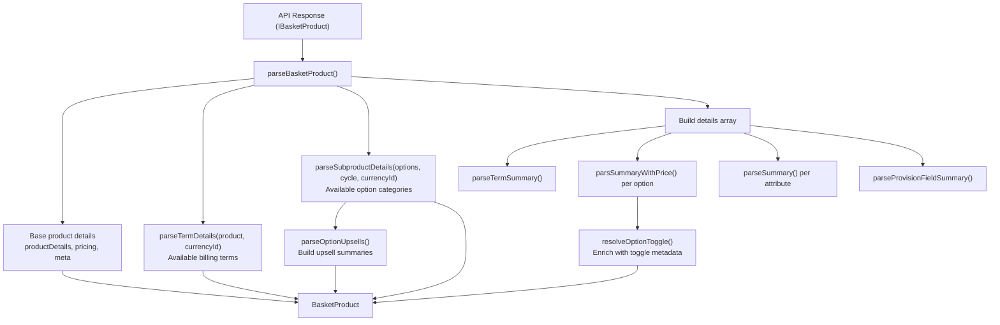
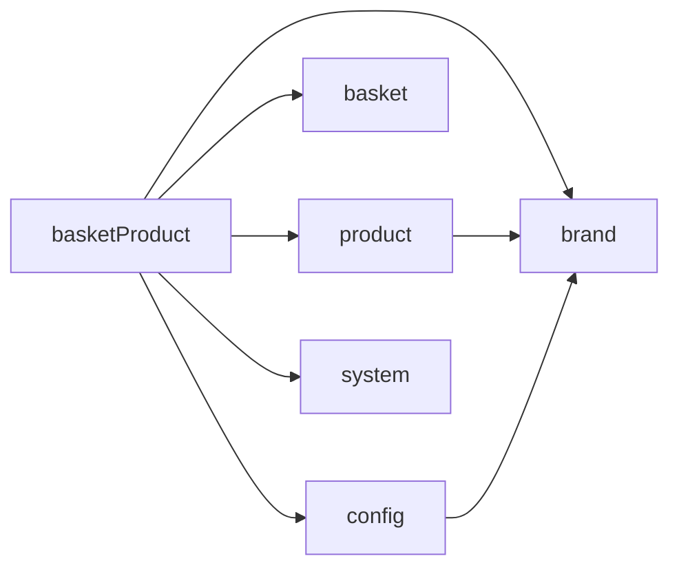

# Architecture

## Module Structure

```text
basketProduct/
├── docs/                          # Documentation
├── __tests__/                     # Test fixtures and specs
├── helper.ts                      # BasketHelperContext factory
├── index.ts                       # Public exports
├── services.ts                    # API service calls
├── types.ts                       # All module types
├── useBasketProduct.ts            # Single product composable
├── useBasketProductInline.ts      # Inline editing composable (FE-1502)
├── useBasketProductPending.ts     # Pre-basket product management
├── useBasketProducts.ts           # All basket products composable
├── useBasketProductsPending.ts    # All pending products composable
└── utils.ts                       # Parsing and transformation utilities
```

## Data Flow

### Basket Product Parsing Pipeline



### Key Steps

1. **Base parsing** — `parseBasketProduct()` converts the raw API response into a `BasketProduct`, resolving pricing, product details, and errors.
2. **Term/option lookups** — `availableTerms` and `availableOptions` are pre-parsed and scoped to the basket product's currency (`base_price_currency_id`).
3. **Details array** — Built from options, attributes, and provision fields. Each option is enriched with `resolveOptionToggle()` metadata.
4. **Upsells** — `parseOptionUpsells()` pre-computes upsell summaries from available options for the inline editing UI (see [Inline Editing](./inline-editing.md)).

### Currency-Scoped Parsing

`parseTermDetails` and `parseSubproductDetails` accept an optional `currencyId` parameter. Basket products have a known currency (`base_price_currency_id`), so prices are filtered to the correct currency before parsing — avoiding incorrect multi-currency pricing display.

---

## Integration Points

| Module      | Relationship                                                                            |
| ----------- | --------------------------------------------------------------------------------------- |
| **product** | Reuses `parseTermDetails`, `parseSubproductDetails`, product machine                    |
| **basket**  | Parent module — owns the basket state, provides `configure()`                           |
| **config**  | Config engine resolves inline editing flags (see [Inline Editing](./inline-editing.md)) |
| **brand**   | `useBrand()` for tax-inclusive pricing                                                  |
| **system**  | `useI18n()` for translations                                                            |

## Dependencies


