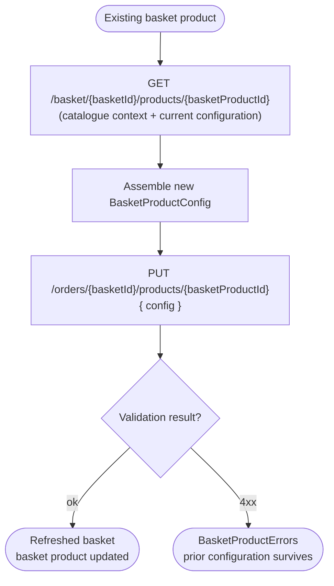
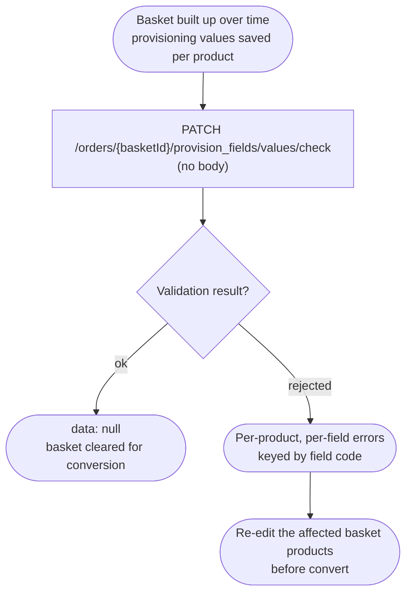
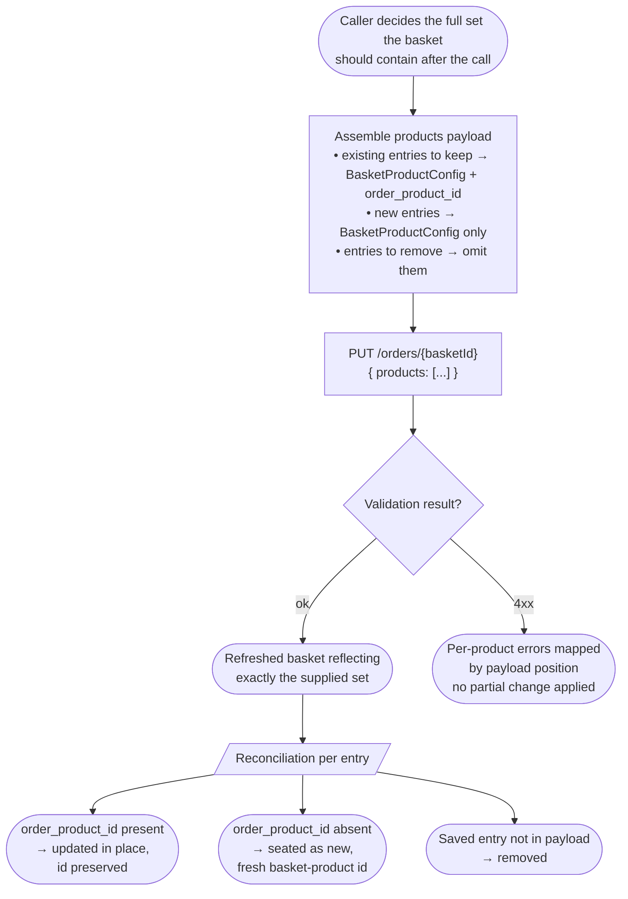

# Module: basketProduct

## What it is

basketProduct manages products that are already seated in a basket. It owns the configuration model — billing term, quantity, option / attribute selections, provisioning-field values, per-product promotion codes, free-trial opt-in — and the back-end-side validation against those values.

Catalogue browsing (what's available to add) and the act of seating a catalogue product into a basket are out of scope for this module: they live in the `productCatalogue` module. basketProduct picks up once an entry is in the basket and covers every subsequent operation against it — re-read with full catalogue context, edit, quantity change, remove, validate provisioning fields, re-read stored provisioning state.

The configuration model submitted on update and the model returned on every read are the same shape: an architect rebuilding the platform implements one configuration contract and reuses it across every basket-product call.

> _Any `meta` field returned by Upmind endpoints is UI-specific to our own client — ignore for spec purposes._

## Core concepts

- **Basket product** — a product already seated in the basket. Carries its own id (the basket-product id, distinct from the catalogue `product_id`), a configuration, computed pricing, the embedded catalogue product snapshot, and any back-end-derived errors. The same record shape is the response to every update call.
- **Configuration** — the user's choices for one basket product: term (billing cycle months), quantity, option selections, attribute selections, provisioning field values, optional per-product promotion codes, optional free-trial opt-in. The same configuration model is submitted on update and returned (resolved) on every read.
- **Sub-product** — a product selected _inside_ another product's configuration. Two shapes share the same wire format: **options** (mutually-exclusive or quantifiable choices, e.g. plan tiers, additional licences) and **attributes** (informational choices that don't affect price, e.g. server region). Sub-products themselves are basket-product records on the wire.
- **Provisioning field** — a key/value input the back end requires before a product can be provisioned (e.g. a region for a VPS, a username for a hosting plan). Field shape is product-defined; values are validated server-side and the basket carries the rejection back per-field.

## Operations

| #   | Capability                                                 | Inputs                                                                                                                                                                                     | Outputs                                                                                                                                                                                                                                                                                                                                                                                                                         |
| --- | ---------------------------------------------------------- | ------------------------------------------------------------------------------------------------------------------------------------------------------------------------------------------ | ------------------------------------------------------------------------------------------------------------------------------------------------------------------------------------------------------------------------------------------------------------------------------------------------------------------------------------------------------------------------------------------------------------------------------- |
| 1   | **Read a basket product with catalogue context**           | `basketId`, `basketProductId`, optional `currencyId`, optional `promotions`                                                                                                                | The basket product hydrated with the full catalogue product (terms, options, attributes, prices) scoped to the basket's currency and promotion context, plus the basket product's own configuration and any back-end-derived errors. Used to re-open a basket product in a configurator and resume editing.                                                                                                                     |
| 2   | **Update a basket product**                                | `basketId`, basket-product id, configured product                                                                                                                                          | The refreshed basket. Every mutation kind — term change, quantity change, option toggle, attribute change, provisioning-field edit, per-product promotion change — flows through this single capability. Quantity is bounded and stepped per the catalogue product's `min`, `max`, `step`.                                                                                                                                      |
| 3   | **Remove product from basket**                             | `basketId`, basket-product id                                                                                                                                                              | The refreshed basket.                                                                                                                                                                                                                                                                                                                                                                                                           |
| 4   | **Validate the basket's saved provisioning configuration** | `basketId`                                                                                                                                                                                 | Pass-through (no body) on success; per-product, per-field errors on rejection. Validates the back end's currently-stored provisioning values for every basket product in the basket — a checkout-readiness check on the saved state, not a between-keystrokes validator.                                                                                                                                                        |
| 5   | **Read stored provisioning-field values**                  | `basketId`, basket-product id                                                                                                                                                              | Array of provisioning-field values currently stored on the basket product. Empty array when no values have been supplied yet.                                                                                                                                                                                                                                                                                                   |
| 6   | **Replace the basket's full product set**                  | `basketId`, the complete list of products the basket should contain after the call (each as a `BasketProductConfig`, optionally carrying `order_product_id` to preserve an existing entry) | The refreshed basket reflecting exactly the supplied set. Destructive: any basket product absent from the payload is removed, entries without `order_product_id` are seated as fresh basket products with new ids, entries with `order_product_id` are updated in place. Exists for flows that need to seat / edit / remove several products in one round-trip; a per-entry update path (capability 2) covers the typical case. |

## Data shape

```ts
// What the front end submits when seating a NEW product into the basket
// (POST /orders/{basketId}/products). Field names use snake_case — they
// hit the wire unchanged.
//
// IMPORTANT — POST vs PUT divergence: the seat-create body differs from the
// in-place update body. See `BasketProductUpdate` below.
type BasketProductCreate = {
  product_id: string; // catalogue product id
  quantity: number; // unit quantity for the main product (subject to product's min/max/unit_quantity — see sentinel notes on `product` foundation doc)
  billing_cycle_months: number; // 0 for one-off, otherwise months in the cycle

  // Provisioning field values: typically omitted (or `{}`) on seating because
  // the user fills them later. Pair with `provision_field_values_validate:
  // false` on seating to suppress validation errors that would otherwise
  // reject the seat for "required field missing".
  provision_field_values?: Record<string, unknown>;

  // WIRE FLAG (load-bearing). When `false`, the back end SKIPS validation of
  // `provision_field_values` for this call. Set to `false` on initial seating
  // and on bulk-add so the seat succeeds even when required provisioning
  // fields haven't been collected yet (user fills them in a later step via
  // PUT /orders/{basketId}/products/{basketProductId}). Default (or `true`)
  // applies validation and rejects with per-field errors if any required
  // field is missing.
  //
  // This is a PLATFORM flag, not a client convenience — the BE behaviour
  // changes based on its value. The wrapper concept "silent seat" is a
  // client-side framing for sending `provision_field_values_validate: false`.
  provision_field_values_validate?: boolean;

  // Per-product promotion codes. Distinct from basket-level promotions:
  // these attach to this basket product specifically.
  promotions?: { promocode: string }[];

  // Opt-in to start a free trial when the product supports it.
  start_trial?: boolean;

  // Options and attributes are NOT sent on seating (POST). They are
  // applied via subsequent PUT calls once the basket product exists and the
  // user has had a chance to configure it. The seating call creates the
  // basket product with the catalogue defaults; the configurator then
  // sends a `BasketProductUpdate` to apply selections.
};

// What the front end submits when UPDATING an existing basket product
// (PUT /orders/{basketId}/products/{basketProductId}). Same envelope as
// `BasketProductCreate` plus the slot-replacement fields.
type BasketProductUpdate = {
  product_id: string; // catalogue product id (echoed on update)
  quantity: number; // unit quantity for the main product
  billing_cycle_months: number; // 0 for one-off, otherwise months in the cycle

  // Selected option products (priced choices, e.g. plan tiers, licences).
  // **OMIT = CLEAR on PUT** (see Lessons). The platform does NOT honour
  // partial bodies: a field omitted from the payload is treated as "clear
  // it", not "leave it alone". The caller must re-send every option the
  // basket product should retain on every PUT. Send `[]` and `options`
  // wipe; omit and they also wipe. This is the inverse of the POST seat
  // where options aren't sent at all (and the basket product is created
  // with catalogue defaults).
  options?: SubproductSelection[];

  // Selected attribute products (informational choices, no price impact).
  // Same OMIT = CLEAR semantics as `options` above.
  attributes?: SubproductSelection[];

  // Provisioning-field values, keyed by the field's stable code (e.g.
  // "region", "username"). Value shape is field-defined (string, number,
  // bool, structured). On PUT the BE validates per-field by default; pair
  // with `provision_field_values_validate: false` to suppress validation
  // during in-progress edits (e.g. when the user has partially filled the
  // form and you want to persist progress without surfacing errors).
  provision_field_values?: Record<string, unknown>;

  // Same wire flag as on create. Default-true on update because the typical
  // call is "user submitted the configurator and wants validation".
  provision_field_values_validate?: boolean;

  promotions?: { promocode: string }[];
  start_trial?: boolean;
};

// Backwards-compatible alias retained for callers that don't distinguish
// create vs update. Prefer the specific shapes above.
type BasketProductConfig = BasketProductCreate | BasketProductUpdate;

type SubproductSelection = {
  product_id: string; // catalogue id of the option / attribute product
  unit_quantity: number; // quantity of this sub-product
  billing_cycle_months: number; // term of this sub-product (may differ from parent)
};

// What the back end returns inside `basket.products` for one basket product.
// Shape is the canonical IBasketProduct from packages/types — listed here
// trimmed to fields a customer-facing storefront commonly reads. The full
// payload also carries admin-adjacent columns (cost, contract linkage,
// provisioning routing, fraud) that ride on the same envelope.
type BasketProduct = {
  id: string; // basket-product id (NOT catalogue product id)
  product_id: string; // catalogue product id
  product: CatalogueProduct; // populated catalogue product (with prices, options, attributes)
  product_name: string; // catalogue display name at time of add
  name: string; // display name on this basket product (may be overridden)
  description: string;
  service_identifier: string | null; // back-end-generated short label

  // Configuration
  quantity: number;
  unit_quantity: number; // count of the underlying provisionable unit (often == quantity)
  billing_cycle_months: number;
  billing_cycle_days: number; // derived day-count for the same cycle
  from_date: string | null; // service start, when known at add time
  to_date: string | null; // service end, when known at add time
  in_trial: boolean; // currently in a free trial

  // Sub-products: same shape, recursively, scoped to this parent.
  options: BasketProduct[];
  attributes: BasketProduct[];

  // Provisioning-field values currently on this basket product, plus a flag
  // indicating a child option has overridden the parent's price (e.g. an
  // option upsell bumped the main product's price band).
  provision_fields: unknown[];
  price_option_override: boolean;
  price_type: "manual" | null; // "manual" when a staff price override is in effect

  // Pricing — see the "Pricing field taxonomy" table below the type for the
  // prefix / suffix conventions covering the cartesian product of facets.
  base_price: number;
  base_price_currency_id: string;
  base_price_exchange_rate: string;
  base_price_formatted: string;
  base_currency_code: string;
  cost: number;
  cost_currency_id: string;
  cost_currency_code: string;
  cost_exchange_rate: string;
  cost_formatted: string;
  selling_price: number;
  selling_price_converted: number;
  selling_price_formatted: string;
  net_amount: number;
  net_amount_formatted: string;
  net_selling_price: number;
  net_selling_price_formatted: string;
  net_selling_price_discounted_converted: number;
  net_selling_price_discounted_formatted: string;
  net_unit_selling_price_formatted: string;
  net_product_discount_amount: number;
  net_product_discount_amount_formatted: string;
  net_global_discount_amount: number;
  net_global_discount_amount_formatted: string;
  total_amount: number;
  total_amount_converted: number;
  total_amount_formatted: string;
  total_discount_amount: number;
  total_discount_amount_formatted: string;
  tax_amount: number;
  tax_amount_formatted: string;
  // … configuration__ and __converted variants of the same fields ride on the
  // line, used when the displayed total has to include sub-product contributions
  // or be expressed in a currency that differs from base_currency_code.

  // Linkage to upstream / downstream platform records (populated as the
  // basket is converted into an invoice and then a contract).
  invoice_id: string;
  main_invoice_product_id: string;
  contract_id: string | null;
  contracts_product_id: string | null;
  product_group_id: string | null;
  product_set_id: string | null;

  // Provisioning routing — back-end-resolved as soon as the basket product lands.
  provision_provider_id: string | null;
  provision_center_id: string | null;
  provision_server_id: string | null;

  // Bookkeeping
  tags: Tag[];
  created_at: string;
  updated_at: string;
  deleted_at: string | null;
};

// Per-product validation errors. Returned on update calls when the back end
// rejects a configuration. The shape mirrors the submitted configuration
// paths so the consumer can attach errors to the right field.
type BasketProductErrors = {
  quantity?: string[];
  billing_cycle_months?: string[];
  options?: Array<{
    unit_quantity?: string[];
    billing_cycle_months?: string[];
  }>;
  attributes?: Array<{
    unit_quantity?: string[];
    billing_cycle_months?: string[];
  }>;
  provision_field_values?: Record<string, string[]>;
};
```

### Pricing field taxonomy

A basket product carries roughly two dozen pricing fields covering the cartesian product of {prefix} × {suffix}. The same prefix and suffix conventions apply across `BasketProduct` and the basket envelope.

| Prefix            | Meaning                                                                                                                                        |
| ----------------- | ---------------------------------------------------------------------------------------------------------------------------------------------- |
| `base_price_*`    | The catalogue's own currency (pre-conversion). Use for the basket product's term parsing.                                                      |
| `cost_*`          | Cost-side amount (admin / reporting facet). Not customer-facing.                                                                               |
| `selling_price_*` | List price per unit (pre-promotion), inc. tax.                                                                                                 |
| `net_*`           | Net (ex-tax) amount for this basket product.                                                                                                   |
| `total_*`         | Gross (inc-tax) total.                                                                                                                         |
| `configuration_*` | Variants of the above that include sub-product contributions — the "configured" total of the whole entry including its options and attributes. |

| Suffix                        | Meaning                                                                                                        |
| ----------------------------- | -------------------------------------------------------------------------------------------------------------- |
| (raw, e.g. `net_amount`)      | Numeric value in the field's native currency.                                                                  |
| `_formatted`                  | Currency-formatted string for display (locale-aware).                                                          |
| `_converted`                  | Value re-expressed in the basket's currency when the field's native currency differs (multi-currency baskets). |
| `_discounted` / `_discount_*` | Variants reflecting discount application — net vs gross, per-product vs global.                                |

Reading rule: choose prefix by what's being shown (configured-vs-base × inc-vs-ex tax × discounted-vs-list), then choose suffix by the currency and presentation context. A consumer that reaches for the first numerically-sensible field will render the wrong value for any basket whose brand, quantity, currency, or promotion shape doesn't match its hardcoded choice — see Lessons below.

## Dependencies

### Dependants — modules that read from this one

| Module             | Weight | Reads                                                                                     | Why                                                                                                                                                                                           |
| ------------------ | ------ | ----------------------------------------------------------------------------------------- | --------------------------------------------------------------------------------------------------------------------------------------------------------------------------------------------- |
| `product`          | 3      | basket-product reference (when re-editing), quantity / option / sub-product configuration | The product configurator hydrates from and writes back to basketProduct when re-editing an existing basket product — the parsed basket product is the source of truth for current selections. |
| `basket`           | 4      | basket-product list, per-product configuration, per-product errors, per-product pricing   | Basket aggregates basketProducts: refresh, totals, claim, currency switches, and promotion application all walk the basket-product collection.                                                |
| `recommendations`  | 2      | basket-product references, per-product configuration                                      | Cross-sell and upsell surfaces key off what's already configured in the basket — quantities and option choices on existing basket products determine which add-ons are compatible.            |
| `invoices`         | 2      | basket-product ids, basket-product names, configuration                                   | Invoice-derived views reuse the basket-product shape for parity with what the customer saw before conversion.                                                                                 |
| `system`           | 2      | basket-product references, provisioning-field shapes                                      | Analytics dispatch (`add_to_cart`, `remove_from_cart`, `select_item`) and locale-driven error message translation walk the basket-product collection.                                         |
| `productCatalogue` | 1      | basket-product references                                                                 | Catalogue browsing surfaces cross-reference basket products to flag already-added items and surface "in your basket" badges.                                                                  |
| Presentation layer | —      | basket-product titles, prices, sub-product details, errors, configuration controls        | Basket page rows, mini-cart summaries, inline edit popovers, upsell prompts, checkout review screens.                                                                                         |

### This module's own dependencies

- **HTTP transport layer** — bearer-token attachment, locale injection, currency-code injection on mutation calls, error shape normalisation.
- **Basket envelope** — the basket id (every basket-product call is scoped to a specific basket) and the basket's currency (mutation responses are re-priced against it).
- **Product (catalogue side)** — the catalogue product defines the constraints a basket product's configuration must satisfy: valid terms, available options, attribute choices, quantity bounds, the provisioning blueprint that drives provisioning-field shape. The catalogue product is the platform's source of truth for what's configurable; the basket product is the source of truth for what the consumer has actually configured. Both surfaces resolve against the same back-end product record — the catalogue read returns it standalone, the basket-product read returns it embedded — so an architect rebuilding can treat them as one contract evaluated in two contexts.
- **Shared types / enums** — `IBasket`, `IBasketProduct`, `IBasketPromotion`, `IProduct` from `packages/types/src/models/baskets.ts` and `packages/types/src/models/products.ts`; `IProvisionFieldValue` and related provisioning types from `packages/types/src/models/provisioning.ts`; `ProductOrderTypes`, `PromotionDisplayTypes`, `PriceType` from `packages/types/src/data/enums/`.

## API endpoints

### `GET /basket/{basketId}/products/{basketProductId}`

Read an existing basket product hydrated with the full catalogue context — terms, options, attributes, prices, provisioning blueprint, related products — scoped to the basket's currency and active promotions. Used to re-open a basket product in a configurator and resume editing without re-fetching the catalogue product separately.

```bash
curl -s "$API/basket/63250798-065d-1e20-388f-8174e234e98d/products/98574264-8970-12d8-576b-21e325d0ed36?currency_id=e47d7382-4850-7931-56c8-1e642d59e063&promotions=&basket_id=63250798-065d-1e20-388f-8174e234e98d&basket_product_id=98574264-8970-12d8-576b-21e325d0ed36&with=image,images,prices,products_attributes,products_attributes.icon,products_options,products_options.icon,products_options.prices,category.top_category.top_category.top_category.top_category,provision_blueprint.category&lang=en" \
  -H "Authorization: Bearer $ACCESS_TOKEN"
```

Response is the catalogue product shape (same envelope as the catalogue read in `productCatalogue`), with prices and option / attribute prices scoped to the basket's currency, promotion context, and the basket product's own selections.

### `PUT /orders/{basketId}/products/{basketProductId}`

Update one existing basket product. **Request body: `BasketProductUpdate`** (see Data shape — distinct from `BasketProductCreate`). The back end reconciles selections — options and attributes in the payload replace the existing sets wholesale; provisioning fields merge by code; pricing is recomputed against the new configuration. Used for: term change, quantity change, option toggle, attribute change, provisioning-field edit, per-product promotion change.

```bash
curl -s "$API/api/orders/63250798-065d-1e20-388f-8174e234e98d/products/98574264-8970-12d8-576b-21e325d0ed36" \
  -X PUT \
  -H "Authorization: Bearer $ACCESS_TOKEN" \
  -H "Content-Type: application/json" \
  --data '{
    "product_id": "47d73824-8507-9315-345f-81e642d59e06",
    "quantity": 2,
    "billing_cycle_months": 0,
    "options": [],
    "attributes": [],
    "provision_field_values": { "region": "eu-west-1" },
    "provision_field_values_validate": true
  }'
```

Response is the refreshed basket (`IBasket`).

**Failure modes:**

1. **Hard success** — `200 + status: "ok"`, the refreshed basket carries the updated basket product with the new configuration applied.
2. **Hard failure** — `4xx + status: "error"`, basket product is **not** mutated, response carries per-field errors (see `BasketProductErrors` in Data shape) keyed by provisioning-field code.
3. **Soft failure (silent strip)** — `200 + status: "ok"` but the basket product is missing from `data.products[]` and `data.warning_notes` is populated. The platform accepted the request at HTTP level, ran post-acceptance validation, found the line non-viable, and stripped it. The caller must inspect `warning_notes` after every PUT (and POST seat). See `basket.md` for the `warning_notes` shape.

The caller cannot rely on `2xx` alone: silent strip looks identical to success at the HTTP layer. Diff the post-call basket against the pre-call basket — if the basket product you submitted isn't in `data.products[]` and `data.warning_notes` is non-empty, you hit the silent strip path. Common triggers: quantity doesn't satisfy the catalogue product's `unit_quantity` stepping; mandatory option not satisfied; basket-product combination disallowed by brand rules.

### `DELETE /orders/{basketId}/products/{basketProductId}`

Remove one basket product. Returns the refreshed basket (without that entry).

```bash
curl -s "$API/orders/63250798-065d-1e20-388f-8174e234e98d/products/98574264-8970-12d8-576b-21e325d0ed36" \
  -X DELETE \
  -H "Authorization: Bearer $ACCESS_TOKEN"
```

### `PATCH /orders/{basketId}/provision_fields/values/check`

Validate the back end's currently-stored provisioning configuration for every basket product in the basket. No body — the call validates whatever is already saved, against the same rules that apply at conversion time. A checkout-readiness gate, not a pre-save check.

```bash
curl -s "$API/orders/63250798-065d-1e20-388f-8174e234e98d/provision_fields/values/check?lang=en" \
  -X PATCH \
  -H "Authorization: Bearer $ACCESS_TOKEN"
```

```json
{
  "status": "ok",
  "data": null,
  "error": null,
  "messages": []
}
```

On rejection the response carries per-product, per-field error arrays keyed by field code, scoped to whichever basket products are currently saved with invalid or missing values.

### `PUT /orders/{basketId}` (with `products` body)

Replace the basket's entire product set in one call. The body's `products` array is the complete set after the call: omitted entries are removed, entries without `order_product_id` are seated fresh (new basket-product ids), entries with `order_product_id` are updated in place.

The same URL accepts billing-shape and notes-shape bodies (documented in the `basket` module); the body shape determines which mutation runs. The shapes are mutually exclusive per call.

```bash
curl -s "$API/orders/63250798-065d-1e20-388f-8174e234e98d" \
  -X PUT \
  -H "Authorization: Bearer $ACCESS_TOKEN" \
  -H "Content-Type: application/json" \
  --data '{
    "products": [
      {
        "order_product_id": "98574264-8970-12d8-576b-21e325d0ed36",
        "product_id": "47d73824-8507-9315-345f-81e642d59e06",
        "quantity": 1,
        "billing_cycle_months": 0
      },
      {
        "product_id": "3825d96e-763e-d091-3dc4-174825283406",
        "quantity": 1,
        "billing_cycle_months": 12,
        "options": [],
        "attributes": []
      }
    ]
  }'
```

```json
{
  "status": "ok",
  "data": {
    "id": "63250798-065d-1e20-388f-8174e234e98d",
    "brand_id": "47d73824-8507-9315-e54f-81e642d59e06",
    "client_id": "8d632507-9806-5d1e-48dc-8174e234e98d",
    "currency_id": "e47d7382-4850-7931-56c8-1e642d59e063",
    "pricelist_id": "5952098d-3de4-0917-86a3-1578626e347e",
    "total_amount": 198,
    "total_amount_formatted": "$198.00",
    "net_amount": 198,
    "tax_amount": 0,
    "balance": 198,
    "promotions": [],
    "products": [
      {
        "id": "98574264-8970-12d8-576b-21e325d0ed36",
        "invoice_id": "63250798-065d-1e20-388f-8174e234e98d",
        "product_id": "47d73824-8507-9315-345f-81e642d59e06",
        "name": "Logo Design",
        "quantity": 2,
        "billing_cycle_months": 0,
        "selling_price": 99,
        "net_amount": 198,
        "total_amount": 198,
        "price_type": "pricelist",
        "options": [],
        "attributes": []
      }
    ]
  }
}
```

> Sample trimmed for readability — the full response is the complete `IBasket` shape (every field documented in the basket module's data shape, plus the products array containing the reconciled set). Full capture available at [`tests/fixtures/recordings/put-orders-63250798-065d-1e20-388f-8174e234e98d.json`](../../../../../../tests/fixtures/recordings/put-orders-63250798-065d-1e20-388f-8174e234e98d.json) — that capture is a billing-variant PUT, but the response envelope is identical regardless of body shape (same URL, same `IBasket` response).

On rejection the response carries per-product errors mapped to the payload position; the call is not partial — either the whole replacement applies or none of it does. Entries seated without `order_product_id` receive fresh basket-product ids that the caller has to capture from the response — there is no positional guarantee that response order matches request order, so consumers correlate by configuration fields rather than by index.

### `GET /orders/{basketId}/products/{basketProductId}/provision_fields/values`

Read the currently-stored provisioning-field values for one basket product. Empty array when no values have been supplied yet.

```bash
curl -s "$API/orders/63250798-065d-1e20-388f-8174e234e98d/products/98574264-8970-12d8-576b-21e325d0ed36/provision_fields/values?lang=en-US" \
  -H "Authorization: Bearer $ACCESS_TOKEN"
```

```json
{
  "status": "ok",
  "data": [],
  "error": null,
  "messages": []
}
```

## Flows

The module exposes two multi-step interactions a caller plans around. Each is the _what_ and the _order_ of back-end calls, not how to drive it. The "guarantees" / "constraints" pair captures what the platform holds across the sequence and the failure modes it won't paper over.

### Edit a basket product

A basket product already in the basket has its term, quantity, options, attributes, provisioning fields, or per-product promotion changed. One round-trip per change, identical body shape across every mutation kind.



Guarantees the platform holds:

- Selections are reconciled wholesale. Options and attributes in the payload replace the existing sets entirely; provisioning fields are merged by code; pricing is recomputed against the new configuration.
- A failed validation leaves the basket product unchanged. The 4xx response carries the per-field errors but the prior configuration survives — the caller can keep the form open and retry.
- The same endpoint is the right one for every mutation kind. Term change, quantity change, option toggle, attribute change, provisioning-field edit, and per-product promotion change all share this call.

Constraints the caller has to plan around:

- The platform to honour a partial body. A field omitted from the payload is treated as "clear it", not "leave it alone"; the caller has to re-send every field the basket product should retain.
- A successful edit to preserve the basket-product id. Some edits (notably a term change that crosses a price-band boundary) cause the back end to replace the basket product with a new id; consumers keying off the old id lose the reference.
- The catalogue read to be skippable when the configurator already has the catalogue snapshot embedded in the basket product. The embedded `product` carries enough to render most controls; the standalone hydration call is for cases where the consumer needs fresh price / option data scoped to the basket's current currency or promotion context.

### Validate the basket's saved provisioning configuration

A checkout-readiness gate. Run before conversion (or any time the caller needs to know the back end's stored state is still valid) to surface any basket product whose saved provisioning values are invalid or missing.



Guarantees the platform holds:

- The call is non-mutating and body-less. The back end re-runs its provisioning-field validation against whatever is currently saved on each basket product.
- The errors surfaced are the same ones conversion will surface — if this check passes, conversion will not fail on provisioning-field grounds for the same saved state.
- Errors come back keyed by basket-product id and field code (`{ <basket-product-id>: { username: ["unavailable"] } }`), so each affected basket product can be re-edited individually.

Constraints the caller has to plan around:

- The check to cover candidate values not yet saved. It only inspects what the back end has stored; a value typed into a form but not yet sent through the update endpoint is invisible to this call.
- The check to fail-fast on the first invalid basket product. The response enumerates every offending basket product and field; the caller has to handle a partial-failure shape, not a binary pass/fail.

### Replace the basket's full product set

Seat, edit, and remove multiple basket products in one round-trip. The payload is the complete set the basket should contain after the call — every existing basket product the caller wants to preserve must be re-listed with its `order_product_id`.



Guarantees the platform holds:

- The call is atomic. Either every reconciliation rule applies and the response is the new basket state, or the call is rejected and the basket is unchanged.
- Entries with `order_product_id` keep their basket-product id across the call — consumers tracking those ids can rely on them surviving.
- The response is the full refreshed basket, including totals, taxes, and promotions recomputed against the new product set.

Constraints the caller has to plan around:

- The payload to be a delta. The platform reads it as a complete-set declaration; basket products not represented are removed, no exception.
- Newly-seated entries to retain any client-side reference. Entries seated without `order_product_id` get a fresh basket-product id on every bulk call, so client references built up over earlier interactions are invalidated.
- Errors to come back per basket product without a payload-position pointer. The response keys errors by submitted product position; the caller has to map them back themselves.

## Lessons (hard-won)

- **Validity ownership is split.** The basket aggregates basket-product validity (it reports `hasErrors` over the cart) but the back end is the authority on whether any given configuration is valid — it rejects on update with per-field errors and the basket product cannot independently know its own validity. A storefront that treats per-product validity as locally derivable (from selections alone) drifts out of sync the first time the back end rejects a configuration the UI thought was complete.

- **Configuration shape recurses.** Options and attributes are themselves basket-products on the wire, with their own quantities and billing cycles, and the back end allows option terms to differ from the parent product's term. A consumer that types the configuration as flat (one term, one quantity, one currency) will silently coerce option terms to the parent's term and produce wrong totals where customers expect to pick a monthly add-on on a yearly main product.

- **Provisioning-field validation runs at two distinct moments.** Update-time validation runs against the candidate body the caller submits and rejects the call on any per-field violation. The standalone `/provision_fields/values/check` call runs against whatever the back end has already saved on each basket product, with no body — it's a checkout-readiness gate. A storefront that conflates the two (treating the standalone check as a per-input validator) either fires it speculatively against unsaved values it doesn't inspect, or fails to gate conversion on stored state that's slipped out of validity since the last update (e.g. a username taken between submit and checkout).

- **The catalogue product carried on the basket product is more than scenery.** Conditional rules on basket screens (term-selector visibility, option-upsell eligibility, trial badges) resolve against fields that live on the catalogue product (`term_count`, `option_count`, `trial_days`, `bcm`) rather than the basket product itself. Stripping the embedded `product` to keep payloads small breaks every basket-screen control that depends on those fields, and the breakage is silent — the controls just disappear or render in the wrong state.

- **`product_id` is not the basket product's identity in the basket.** A basket can contain the same catalogue product more than once (different terms, different option selections, different provisioning fields). The basket product's own `id` is the addressable identifier for update / remove / re-edit. A consumer that keys basket products off `product_id` cannot represent "two copies of the same plan, configured differently" and overwrites the wrong one when the customer edits.

- **Price is a fan of fields, not a number.** Each basket product carries roughly two dozen pricing fields covering the cartesian product of {net, gross, list, total, configured-with-subproducts} × {raw, formatted, converted}. The choice of which field to render is policy: tax-inclusion at the brand level picks net-vs-gross; quantity > 1 selects unit-vs-total; promotions select discounted-vs-undiscounted; the _configured_ variants include sub-product contributions and the non-configured variants do not. A consumer that reaches for the first numerically-sensible field will render the wrong value for any basket whose brand, quantity, or promotion shape doesn't match its hardcoded choice.

- **Same-currency assumption breaks on cross-currency baskets.** A basket product carries both `base_price__` (the catalogue's currency) and `__converted` (the basket's currency). When they differ — multi-currency storefronts, currency switches mid-session, manual exchange-rate overrides — only the converted fields are correct for display; the base fields are correct for the basket product's own term parsing. Consumers that treat the two as interchangeable produce wrong totals on cross-currency baskets and wrong term prices on same-currency ones.

- **Configuration-change side effects land _after_ the basket settles.** Analytics events (`add_to_cart`, `remove_from_cart`), basket pricing recalculation, and per-product cache invalidation all wait for the basket to re-fetch following a mutation. A storefront that fires its own analytics events at submission time double-counts (the platform also fires one once the basket lands) and a storefront that reads basket totals immediately after an update call sees the _pre-mutation_ totals until the re-fetch resolves.

- **Removed basket products carry information forward.** A `remove_from_cart` event needs the configured shape of the _removed_ basket product — its options, term, quantity, price — to populate the analytics envelope; that information is only available _before_ the removal completes and the basket refresh strips the entry out. Consumers that capture the removed basket product _after_ the response see an empty envelope.

- **Per-product errors are addressed by code, not by index.** Provisioning-field errors come back keyed by field code (`{ username: ["unavailable"] }`); option / attribute errors come back as an array indexed by position. A consumer that flattens the two into a generic error bag loses the per-field addressing and cannot attach a "value is invalid" message to the right input.

- **Dynamic field references cross product boundaries.** A configuration field can be supplied as `${service_identifier}` and resolved at submit time against another basket product (e.g. a hosting product's region field referencing a sibling product's identifier). The back end never receives `${…}` literal strings — references are resolved client-side before the body is submitted. Resolution sources are limited to basket products present at submit time and to fields the consumer reads off the canonical basket-product shape. Resolving these references too early (before the source basket product exists) or too late (after submit has begun) leaves literal `${…}` strings in the provisioning payload and the call is rejected.

- **Free trials are a configuration opt-in, not a separate product.** A product that supports trials still ships through the same update endpoint; the trial state is a single boolean on the configuration shape and the resulting basket product carries `in_trial: true` plus a zero gross total. A consumer that branches into a separate "trial product" code path duplicates configuration logic and drifts as the trial-supported product catalogue grows.

- **`unit_quantity` and `quantity` are not the same.** On many products they coincide; on quantifiable option products they diverge (an option of "5 additional seats" can sit under a parent basket product with `quantity: 1`). Conflating the two over- or under-prices any cart that includes quantifiable options.

- **Every mutation triggers a full basket recomputation.** Each update to a basket product causes the back end to re-price the basket, re-apply every promotion, and re-calculate every tax — for the whole basket, not just the changed entry. The cost is non-trivial and paid in full on every call, regardless of whether the final state actually differs from the prior one. A UI that fires a mutation per keystroke, per slider tick, or per option toggle stacks dozens of round-trips inside a few seconds and the platform's responsiveness degrades visibly. Consumers that surface high-frequency edit controls have to either debounce inputs, batch user intent into a single update at submit time, or accept the latency cost.

- **Bulk product replacement is destructive.** `PUT /orders/{basketId}` with a `products: [...]` body replaces the basket's entire product set. Three reconciliation rules apply per entry: an entry with `order_product_id` is updated in place; an entry without `order_product_id` is seated as a new basket product with a fresh basket-product id; any basket product the back end currently has but the payload omits is removed. A consumer that reaches for this endpoint as an "update some products" call without re-listing the unchanged ones empties the basket of everything else. Even when used correctly, the fresh-id rule means consumers keying off the prior basket-product ids of seated entries lose the references on every bulk call.
