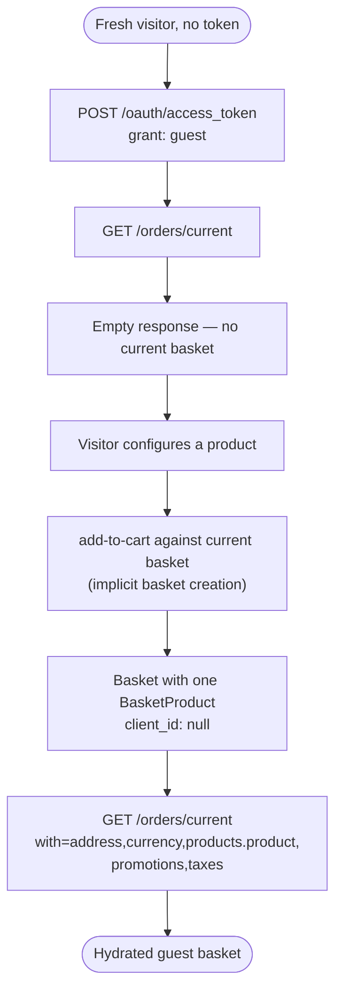
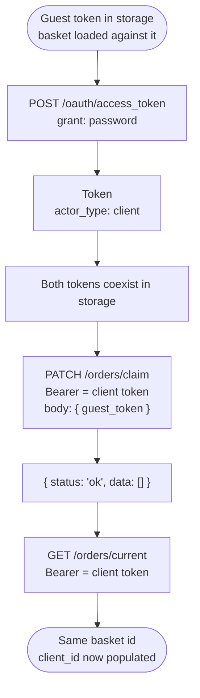
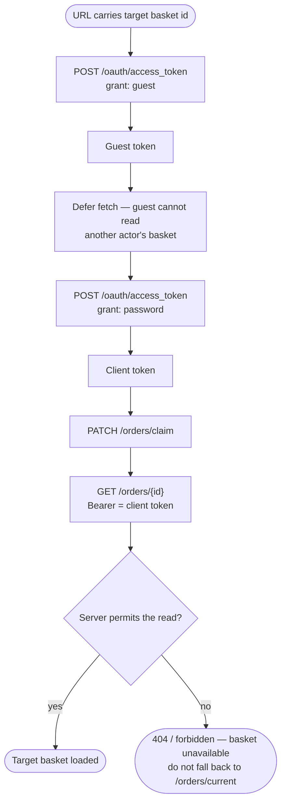
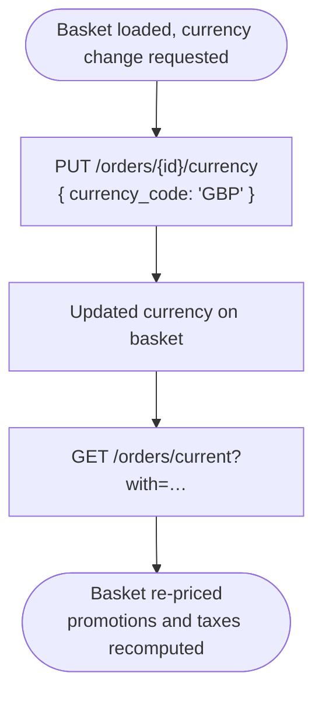
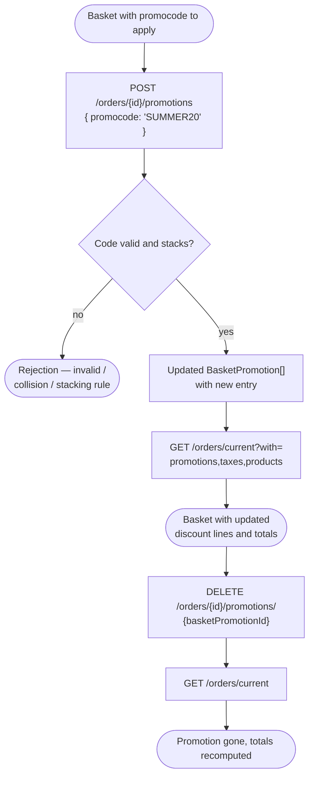
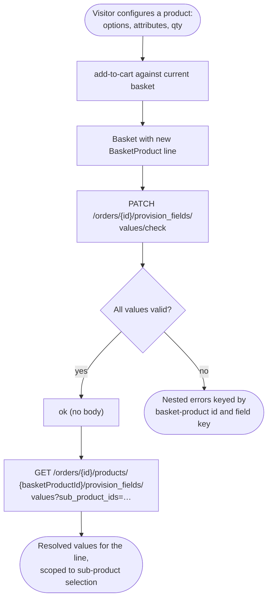
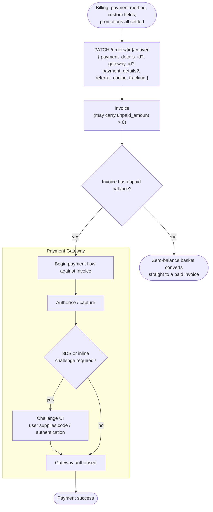

# Module: basket

## What it is

Basket owns the in-flight order — the working object that a visitor accumulates products into, configures, prices, discounts, attaches an address and payment method to, and ultimately converts into an invoice. It is the central coordinator of the cart: products, currency, promotions, billing details (address / company / phone), per-basket custom fields, payment-method selection, and warning notes all hang off a single basket record. Every signed-in visitor has at most one _current_ basket at a time; an anonymous visitor's basket carries forward through registration or login so nothing browsed pre-auth is lost. A storefront cannot meaningfully take a customer from "browsing" to "paid" without basket — the basket id is the join key for every checkout-time operation, and the basket's lifecycle status drives whether the cart can still be edited, must be paid, or has been finalised.

> _Any `meta` or `object_meta` field returned by Upmind endpoints is UI-specific to our own client — ignore for spec purposes. Both keys appear on basket records; both are out of scope._

## Core concepts

- **Basket** — the in-flight order. Backed by the `orders` resource (`orders/current`, `orders/{id}`). Carries products, currency, address, promotions, taxes, and a running financial summary.
- **Current basket** — the one basket the back end will return for `orders/current` against the calling token. Different tokens get different current baskets; a guest's current basket is distinct from a client's current basket until claim runs.
- **Claim** — the operation that re-parents a guest's basket onto a newly-authenticated client. Without it, login produces a client whose `orders/current` is empty even though the visitor was mid-cart a moment earlier.
- **Basket product** — a line item on the basket. Carries its own `id`, its product link, configuration (quantity, billing cycle, options, attributes), provisioning field values, and per-line pricing and discounts.
- **Promotion** — a discount applied to the basket. Stacked: zero, one, or many can be on a single basket simultaneously. Each entry carries its `promocode`, the resolved `promotion` object, and a server-computed contribution to the basket total.
- **Warning note** — a non-fatal server-side advisory attached to the basket (e.g. "your address may incur tax"). Has a hidden / visible state per note.
- **Summary** — the financial breakdown of the basket: subtotal, discount, taxes (one entry per tax tag), total. Formatted strings are server-computed and locale-aware.

## Operations

| #   | Capability                                                           | Inputs                                                                               | Outputs                                                                                                                                                                                                                                                                                                                                                                                                                                                                                                                                                    |
| --- | -------------------------------------------------------------------- | ------------------------------------------------------------------------------------ | ---------------------------------------------------------------------------------------------------------------------------------------------------------------------------------------------------------------------------------------------------------------------------------------------------------------------------------------------------------------------------------------------------------------------------------------------------------------------------------------------------------------------------------------------------------- |
| 1   | **Read a basket**                                                    | (none → current) OR `basketId`                                                       | The basket the calling token owns when called without an id (`GET /orders/current`), or the specific basket at `GET /orders/{id}` if the calling token may read it (`targetBasketInvalid` rejection otherwise). The deep-link form is used for cart-recovery emails and "continue your order" URLs. Empty / 204-shaped response if no current basket exists yet for the actor.                                                                                                                                                                             |
| 2   | **Claim a guest basket onto a client**                               | guest token + client token                                                           | Re-parents the guest's basket onto the authenticated client. Idempotent and silently no-ops when either token is missing; only drops the guest token on success so a failed claim can be retried.                                                                                                                                                                                                                                                                                                                                                          |
| 3   | **Change basket currency**                                           | `{ currency_code }`                                                                  | New currency set on the basket; all prices, discounts, and taxes re-computed server-side and returned on the next basket read.                                                                                                                                                                                                                                                                                                                                                                                                                             |
| 4   | **Apply a promotion**                                                | `{ promocode }`                                                                      | Adds a `basket_promotion` linking the promotion to the basket. Returns the updated promotion list; `promocode` collisions on a basket are rejected. Supports stacking — multiple promotions can be live at once subject to server-side rules.                                                                                                                                                                                                                                                                                                              |
| 5   | **Remove a promotion**                                               | `basketPromotionId`                                                                  | Detaches the named basket-promotion link.                                                                                                                                                                                                                                                                                                                                                                                                                                                                                                                  |
| 6   | **Set billing details**                                              | `{ address_id, company_id?, phone_id? }`                                             | Persists the chosen client-owned address / company / phone onto the basket. Triggers tax re-computation. Requires an authenticated actor.                                                                                                                                                                                                                                                                                                                                                                                                                  |
| 7   | **Set per-basket custom fields and notes**                           | `{ notes, custom_fields }`                                                           | Persists order-form-level custom field values and a free-text notes block onto the basket.                                                                                                                                                                                                                                                                                                                                                                                                                                                                 |
| 8   | **Read per-basket custom field definitions**                         | —                                                                                    | Brand-configured custom fields the order form should collect at basket level (distinct from per-client and per-product custom fields).                                                                                                                                                                                                                                                                                                                                                                                                                     |
| 9   | **Check & read provisioning field values for the basket's products** | `basketId`, `productId`, optional `sub_product_ids`                                  | This capability covers **two BE calls**: a basket-wide check (`PATCH /orders/{id}/provision_fields/values/check`) that returns no body on success and validation errors against specific products on failure; and a per-product read (`GET /orders/{id}/products/{basketProductId}/provision_fields/values`) of resolved provisioning field values. The two are folded into one capability row because the check is a precondition for the read. Sub-product ids participate because option / attribute selection changes which provisioning fields apply. |
| 10  | **Convert basket to invoice**                                        | basket (must have products, billing, payment method selected, all preconditions met) | `PATCH orders/{id}/convert` posts the chosen payment-method payload, the referral cookie, and the analytics tracking envelope. Returns the resulting invoice. Locked products pass through unchanged.                                                                                                                                                                                                                                                                                                                                                      |
| 11  | **Dismiss warning notes**                                            | `{ ids[] }`                                                                          | Server-side hides one or more warning notes on the basket. The dismissed notes still exist on the record but no longer surface as visible advisories.                                                                                                                                                                                                                                                                                                                                                                                                      |
| 12  | **Explicitly create a basket**                                       | —                                                                                    | `POST /orders` mints an empty basket for the calling actor and returns its full `Basket` shape. The platform also creates a basket implicitly on first `GET /orders/current` against an actor without one, so most storefronts never need to call this directly — the explicit POST is for flows that need to materialise a basket id _before_ products are added (e.g. server-rendered cart pages that must surface the basket URL in the initial markup).                                                                                                |

Additional always-on behaviours (not endpoints):

- **Readiness signal** — resolves once the basket has reached `shopping` or a terminal non-error state.
- **Refresh** — re-fetch the basket and broadcast a "basket is updating" signal to downstream consumers so they can stage their own state ahead of the new data landing. A separate "pre-refresh" path lets callers merge optimistic data immediately while the server confirms.
- **Reset / Clear** — drop the loaded basket and re-enter loading. Used after a completed conversion and when the caller deliberately wants `orders/current` re-acquired (e.g. switching out of a deep-linked basket).

## Data shape

### Basket — `IBasket`

```ts
// Returned by GET /orders/current and GET /orders/{id}, also by POST /orders and
// PATCH /orders/{id}. The same shape is the response from many basket mutations.
type Basket = {
  id: string;
  number: string | null; // invoice-style number once converted
  brand_id: string; // resolving brand
  account_id: string; // account the basket bills against
  client_id: string; // null-ish until claim/authentication
  user_id: string; // "sys" for self-service baskets
  reseller_account_id: string | null;

  status: Status; // lifecycle (e.g. invoice_draft, abandoned, …)
  status_id: string;
  display_status: string; // server-computed status label for UI ("Active", "Abandoned", …)

  category: BasketCategory; // category slug, e.g. "new_contract"
  category_id: string;

  // Pricing context
  pricelist_id: string; // resolved pricelist for this basket; drives line-item base prices

  // Currency
  currency: Currency;
  currency_id: string;
  currency_exchange_rate: number;
  today_exchange_rate: string;
  payment_currency: Currency | null;
  payment_currency_id: string | null;
  payment_currency_exchange_rate: string | null;

  // Address / company / phone (set via the billing operation)
  address: Address | null;
  address_id: string | null;
  company: Company | null;
  company_id: string | null;
  phone: Phone | null;
  phone_id: string | null;

  // Products and promotions
  products: BasketProduct[]; // line items
  promotions: BasketPromotion[]; // stacked basket-promotion links
  custom_fields: CustomFieldValue[]; // brand-defined extension fields on the basket
  taxes: AppliedTax[]; // one entry per applicable tax tag
  warning_notes: WarningNote[]; // non-fatal advisories with per-note hide state

  // Financial summary — server-computed, all currency-aware, dual-currency where relevant
  net_amount: number; // sum of line-item net prices, in basket currency
  net_amount_formatted: string; // locale + currency-symbol formatted
  net_amount_converted: number; // value in the basket's display currency
  net_selling_price: number;
  net_selling_price_formatted: string;

  net_discount_amount: number;
  net_discount_amount_formatted: string;
  net_global_discount_amount: number; // discount on the whole basket
  net_global_discount_amount_formatted: string;
  net_product_discount_amount: number; // discount aggregated across line items
  net_product_discount_amount_formatted: string;
  total_discount_amount: number;
  total_discount_amount_formatted: string;

  tax_amount: number;
  tax_amount_formatted: string;
  tax_amount_converted: number;

  total_amount: number; // grand total
  total_amount_formatted: string;
  total_amount_converted: number;

  paid_amount: number; // non-zero after a part-pay
  paid_amount_formatted: string;
  paid_amount_converted: number;
  unpaid_amount: number;
  unpaid_amount_formatted: string;
  unpaid_amount_converted: number;
  balance: number;
  balance_formatted: string;

  // Conversion / lifecycle metadata
  due_date: string | null;
  paid_datetime: number | null;
  abandoned: boolean;
  abandon_date: string | null; // when the BE will consider the basket abandoned
  auto_cancel_date: string | null;
  auto_cancel_pro_rata_date: string | null;
  cancellation_datetime: string | null;
  cancellation_reason: string | null;
  consolidation_status: number;
  consolidation_invoice_id: string | null;
  credit_invoice_id: string | null;
  credited: number;
  partial_amount_credited: number;
  partial_amount_credited_formatted: string;
  partial_amount_credited_converted: number;
  partial_amount_to_credit: number; // amount queued for crediting on next consolidation
  partial_amount_to_credit_formatted: string;
  partial_amount_to_credit_converted: number;
  refund_status: number;
  refund_request: string | null;
  refund_changed: string | null;
  to_be_credited: boolean;
  is_consolidation: boolean;
  fraud_score: number | null; // server-side fraud assessment
  fraud_status: number; // numeric status enum
  fraud_policy: number;
  legacy: number;
  locked: boolean | null;
  temp_token_id: string | null;
  payment_failed_attempts: number;
  pre_due_notification_date: string | null;
  overdue_notification_date: string | null;
  overdue_left_attempts: number | null;
  next_charge_date: string | null;
  payment_details_id: string | null; // gets set once a payment method is chosen
  gateway_id: string | null; // populated post-conversion

  ip: string; // origin IP captured at creation
  notes: string; // free-text basket notes
  delegate_related: boolean;
  grouped_taxes: AppliedTax[] | null;
  allow_product_credit: boolean;

  // Deep-link context (admin-adjacent)
  import_id: string | null;
  staged_import: boolean;
  external_id: string | null;
  external_contract_id: string | null;
  proforma: boolean;
  proforma_number: string | null;
  proforma_create_datetime: string | null;
  duplicate_from_invoice_id: string | null;
  duplicated_with_invoice_id: string | null;

  created_at: string;
  updated_at: string;
  deleted_at: string | null;
  create_datetime: string | null;
};

type BasketCategory = {
  id: string;
  name: string; // human label, e.g. "New Contract"
  slug: "new_contract" | "renewal" | "upgrade" | "downgrade" | "addon" | string;
};
```

### Basket product — `IBasketProduct`

```ts
type BasketProduct = {
  id: string; // line-item id (stable across refreshes)
  invoice_id: string; // basket id (same value)
  product_id: string; // catalogue product link
  main_invoice_product_id: string | null; // parent line for sub-products
  product_set_id: string | null;
  product_group_id: string | null;
  product_name: string; // catalogue name at time of add
  name: string; // display name (may include configuration)
  description: string; // server-computed line description
  service_identifier: string | null; // populated post-provisioning

  // Configuration
  quantity: number;
  unit_quantity: number | null;
  billing_cycle_months: number;
  billing_cycle_days: number;
  from_date: string | null;
  to_date: string | null;
  options: BasketProduct[]; // sub-products of type "option"
  attributes: BasketProduct[]; // sub-products of type "attribute"
  set_products: BasketProduct[]; // sub-products of type "set member"

  // Provisioning
  provision_provider_id: string | null;
  provision_server_id: string | null;
  provision_center_id: string | null;
  provision_configuration_id: string | null;
  provision_fields: unknown[]; // resolved values fetched separately
  vat_country_id: string;
  vat_percentage: string;

  // Pricing — base prices in catalogue currency, conversions in basket currency
  cost: number;
  cost_currency_id: string;
  cost_currency_code: string;
  cost_formatted: string;
  cost_exchange_rate: string;
  base_price: number;
  base_price_currency_id: string;
  base_currency_code: string;
  base_price_formatted: string;
  base_price_exchange_rate: string;
  selling_price: number;
  selling_price_formatted: string;
  selling_price_converted: number;
  price_type: "pricelist" | "manual" | "override" | null;
  price_option_override: boolean; // true when a child option's price replaces parent

  // Aggregates — gross of discount
  net_amount: number;
  net_amount_formatted: string;
  net_selling_price: number | string; // may arrive as string from BE
  net_selling_price_formatted: string;
  net_unit_selling_price_formatted: string;
  total_amount: number;
  total_amount_formatted: string;
  total_amount_converted: number;

  // Discounts
  net_global_discount_amount: number;
  net_global_discount_amount_formatted: string;
  net_product_discount_amount: number;
  net_product_discount_amount_formatted: string;
  total_discount_amount: number;
  total_discount_amount_formatted: string;
  net_selling_price_discounted: number;
  net_selling_price_discounted_formatted: string;
  net_selling_price_discounted_converted: number;

  // Configuration-aware mirrors of the above (used when the product configuration —
  // not the catalogue product — drives the displayed totals)
  configuration_selling_price_formatted: string;
  configuration_selling_price_discount_formatted: string;
  configuration_selling_price_discount_converted: number;
  configuration_selling_price_discounted_formatted: string;
  configuration_selling_price_discounted_converted: number;
  configuration_net_selling_price_formatted: string;
  configuration_net_selling_price_discount_formatted: string;
  configuration_net_selling_price_discount_converted: number;
  configuration_net_selling_price_discounted_formatted: string;
  configuration_net_selling_price_discounted_converted: number;
  configuration_net_amount_formatted: string;
  configuration_net_amount_converted: number;
  configuration_net_amount_discount_formatted: string;
  configuration_net_amount_discount_converted: number;
  configuration_net_amount_discounted_formatted: string;
  configuration_net_amount_discounted_converted: number;
  configuration_total_amount_formatted: string;
  configuration_total_amount_converted: number;
  configuration_total_discount_amount_formatted: string;
  configuration_total_discount_amount_converted: number;
  configuration_total_discounted_amount_formatted: string;
  configuration_total_discounted_amount_converted: number;
  configuration_future_renewal_price: number | null;
  future_renewal_price: number | null;

  // Taxes
  tax_amount: number;
  tax_amount_formatted: string;
  tax_amount_converted: string | number;

  // Trial
  in_trial: boolean;
  trial_duration: number;
  trial_end_action: number;
  trial_end_date: string | null;
  trial_pre_expire_notification: number;
  trial_pre_expire_notification_date: string | null;

  // Contract linkage (only set after conversion / for renewals)
  contract_id: string | null;
  contracts_product_id: string | null;

  // Credit / refund (admin-adjacent, present on every line)
  partial_amount_credited: number;
  partial_amount_credited_formatted: string;
  partial_amount_credited_converted: number;
  partial_amount_to_credit_formatted: string;
  partial_amount_to_credit_converted: number;
  change_product_direction: number | null;
  reactivate_skip: number | null;
  calculated_contract_product_due_date: string | null;
  accounting_revenue_recognition: number;

  // Embedded product snapshot (the catalogue record at time of add)
  product: Product;
  tags: Tag[];

  created_at: string;
  updated_at: string;
  deleted_at: string | null;
};
```

### Basket-promotion link — `IBasketPromotion`

```ts
type BasketPromotion = {
  id: string; // basket-promotion link id
  invoice_id: string; // basket id
  promotion_id: string;
  promotion: Promotion; // resolved promotion details
  autoapply: 0 | 1; // 1 when applied automatically by rule
  created_at: string;
  updated_at: string;
  deleted_at: string | null;
};

type Promotion = {
  id: string;
  code: string; // the promocode visitors enter
  name: string;
  description: string | null;
  discount_type: number; // numeric enum (percentage / amount / …)
  discount_value: number;
  adjusted_basket_id: string | null; // non-null when this promotion is a custom-priced basket
  // … plus eligibility / scope / scheduling fields per the platform's promotion engine
};
```

### Warning note — `IWarningNote`

```ts
type WarningNote = {
  id: string;
  message: string;
  is_hidden: boolean; // server-side dismissed state; see "Dismissal semantics" below
  created_at: string;
  updated_at: string;
};
```

**What triggers a warning note.** The platform appends to `basket.warning_notes` after any mutation that succeeded at HTTP level but had to be downgraded post-acceptance. Two distinct patterns:

1. **Silent strip on seat / update** — a `POST /orders/{basketId}/products` or `PUT /orders/{basketId}/products/{basketProductId}` returns `200 + status: "ok"`, but the basket product the caller submitted is absent from `data.products[]` because the platform found it non-viable after acceptance (quantity didn't satisfy `unit_quantity` stepping, mandatory option missing, basket-product combination disallowed by brand rules, etc.). The corresponding warning note explains why. **This is not a hard error and not a hard success — it is a third category the caller must inspect for** (see `basketProduct.md` "Failure modes" on the PUT endpoint).
2. **Advisory** — the basket was mutated successfully but the platform wants the caller to surface context (e.g. "currency was switched, prices were re-converted", "promotion expired and was removed"). The mutation succeeded; the note is informational.

The two cannot be distinguished by the note shape alone — the caller must correlate the note against the mutation they just made (was the basket product they POSTed present in `data.products[]`?).

**Dismissal semantics.** A `PUT /orders/{basketId}/dismiss-warnings` flips `is_hidden: true` on the named notes. The note record persists; subsequent reads return it with `is_hidden: true` (clients typically filter these out). Dismissal is **server-side and durable** — it survives basket reload, actor swap, and session lifetime. The note re-surfaces only if the same underlying condition triggers a fresh note creation (new id, `is_hidden: false`); the original record stays dismissed.

### Applied tax — `IAppliedTax`

```ts
type AppliedTax = {
  id: string;
  invoice_id: string; // basket id
  tax_tag_id: string;
  amount: number;
  amount_formatted: string;
  invoice_currency_id: string;
  invoice_currency_exchange_rate: string;
  invoice_currency: Currency;
  tax_tag_data: TaxTagDetail[]; // per-line breakdown
  created_at: string;
  updated_at: string;
};

type TaxTagDetail = {
  id: string;
  invoice_id: string;
  invoice_product_id: string; // basket-product line id
  tax_tag_id: string;
  amount: number;
  amount_formatted: string;
  tax_tag_name: string; // e.g. "VAT 20%"
  tax_tag_type: number;
  tax_tag_amount: number;
  tax_tag_company_type: number;
  tax_tag_company_amount: number;
  tax_tag_base_type: "net_taxes" | string;
  tax_tag_currency_id: string | null;
  tax_tag_show_on_item: boolean;
  tax_tag_show_on_invoice: boolean;
  tax_tag_apply_on_main_product_only: boolean;
  tax_tag_apply_based_on_product_quantity: boolean;
  tax_tag_fixed_amount_apply_on_zero: boolean;
  tax_tag_require_company_vat_number: boolean;
  tax_tag_require_company_reg_number: boolean;
  for_company: boolean;
  reason: string[]; // why this tax applied: country, region, postcode, city
  invoice_currency_id: string;
  invoice_currency_exchange_rate: string;
  invoice_currency: Currency;
};
```

### Bodies for mutations

```ts
// PATCH /orders/{id}/currency
type SetCurrencyBody = { currency_code: string };

// PUT /orders/{id} — billing details
type SetBillingBody = {
  address_id: string; // required
  company_id?: string | null;
  phone_id?: string | null;
};

// PUT /orders/{id} — per-basket fields
type SetFieldsBody = {
  notes: string;
  custom_fields: CustomFieldValue[];
};

// POST /orders/{id}/promotions
type AddPromotionBody = { promocode: string };

// PATCH /orders/{id}/convert — body carries the resolved payment method
// plus side data captured by the storefront at order time.
type ConvertBody = {
  payment_details_id?: string; // stored card or saved method
  gateway_id?: string; // selected payment gateway
  payment_details?: Record<string, unknown>; // inline new-card details
  referral_cookie?: string; // opaque affiliate cookie, do not decode
  tracking?: Record<string, unknown>; // analytics envelope
};

// PUT /orders/{id}/warnings/hide
type DismissWarningsBody = { ids: string[] };

// PATCH /orders/claim
type ClaimBody = { guest_token: string }; // bearer is the client token; body carries the guest token
```

## Dependencies

### Dependants — modules that read from this one

| Module             | Weight | Reads                                                                                                                                            | Why                                                                                                                                                                                                                                                          |
| ------------------ | ------ | ------------------------------------------------------------------------------------------------------------------------------------------------ | ------------------------------------------------------------------------------------------------------------------------------------------------------------------------------------------------------------------------------------------------------------ |
| `system`           | 25     | basket lifecycle transitions, currency, locale, basket-derived analytics events                                                                  | The data-layer pushes (`add_shipping_info`, `add_payment_info`, `purchase`, `invoice_paid`) and currency-aware locale formatting consume basket lifecycle transitions. The high edge count reflects analytics + locale wiring across many consumer surfaces. |
| `client`           | 22     | basket id, basket products, basket currency, basket addresses / phones / companies, basket lifecycle state                                       | User-context surfaces (profile, billing, contracts, invoices listing) reconcile against the active basket: which addresses / companies are eligible to bind, which open basket the client currently owns, which line items are mid-checkout.                 |
| `basketProduct`    | 20     | basket id, basket currency, basket products, basket-product validity                                                                             | Architecturally a sub-module of basket: it operates against the same `/orders/{basketId}/products` endpoints, reading the basket id out of basket's state to scope every add / configure / remove / validate call against the current basket.                |
| `session`          | 17     | basket lifecycle state, claim coordination, basket invalidation on logout                                                                        | Session orchestrates basket claim on `AUTHENTICATED`, basket reset on `UNAUTHENTICATED`, and basket survival across token refresh; the cross-module edges fan out across the auth lifecycle.                                                                 |
| `checkout`         | 11     | basket id, basket products, basket totals, basket payment readiness                                                                              | The checkout flow consumes basket state end-to-end: line items for the summary, totals for the payment-amount field, billing-set state for the payment step's preconditions, conversion outcome for the success route.                                       |
| `brand`            | 7      | basket currency, basket-driven currency switching, basket-derived pricing context                                                                | Brand's currency-resolution path consults the basket's currency so brand-derived prices align with whatever the basket is charging in; brand-config gates (`REQUIRE_PAYMENT_METHOD_FOR_FREE_ORDERS`, etc.) are evaluated against basket totals.              |
| `productCatalogue` | 5      | basket id, basket currency, basket products                                                                                                      | Catalogue browsing surfaces quote prices in the basket's currency, target add-to-cart actions at the active basket id, and filter out items already on the basket.                                                                                           |
| `product`          | 4      | basket id, basket currency                                                                                                                       | The catalogue product page reads the basket's currency to render prices in the same units the basket will charge, and links "buy" actions to the active basket id.                                                                                           |
| `domain`           | 2      | basket id, basket products, domain line items                                                                                                    | The domain registrant / transfer / lookup flows add, configure, and reconcile domain line items inside the active basket, keying off the basket id and reading the existing product list to decide whether a domain is already present.                      |
| `invoices`         | 2      | basket conversion to invoice, basket id, invoice id from basket                                                                                  | Once the basket converts at checkout, the resulting invoice id is read off the basket to drive the post-checkout payment / receipt views.                                                                                                                    |
| `routing`          | 2      | basket loaded, basket has products, payment ready, target basket id                                                                              | Route guards and redirect-after-add behaviour key off basket lifecycle state (is the cart populated? is checkout reachable? is a deep-linked basket valid?).                                                                                                 |
| `recommendations`  | 1      | basket id, basket products, basket currency                                                                                                      | Recommendation surfaces (upsells, cross-sells, suggested add-ons) read the current basket contents to filter out already-present items and quote prices in the basket's currency.                                                                            |
| Presentation layer | —      | product list, line-item pricing, discounts, taxes, totals, currency switcher state, promotion chips, warning banners, checkout button enablement | The cart UI, mini-cart, summary panel, and order-review surfaces all consume basket state directly.                                                                                                                                                          |

> **Internal sub-directories vs peer modules.** Basket has internal sub-directories that don't appear in this table because they share its ownership boundary: `packages/headless/src/modules/basket/currency/`, `.../promotions/`, `.../fields/`, `.../billing/`. The graph counts edges from these sub-directories as part of basket itself.
>
> `basketProduct`, `payment`, `paymentDetails`, and `config` are **separate top-level modules** at `packages/headless/src/modules/<name>/`. `basketProduct` appears above (weight 20) because it operates against `/orders/{basketId}/products` endpoints scoped to basket — architecturally sub-module-shaped but physically a distinct module folder. `config` (the UI override module) does not import basket and is correctly absent from the table.
>
> `query` is excluded here despite the graph edges (≈6): it is the shared HTTP transport layer, not a domain consumer of basket state.

### This module's own dependencies

- **HTTP transport layer** — bearer-token attachment (the bearer determines whose `orders/current` is returned), currency-bypass for non-priced endpoints, error shape normalisation, mutation-key cancellation so a stale in-flight basket read doesn't overwrite a fresher one.
- **Brand readiness** — basket fetches block on the brand being resolved; the default currency, tax-inclusion policy, and the `require_payment_method_for_free_orders` config key are read at load time and affect basket-product configuration and the checkout-availability rules.
- **Session readiness** — the basket waits for a session token before its first fetch (a guest token is sufficient); AUTHENTICATED transitions trigger a refresh; UNAUTHENTICATED drops the basket.
- **Token storage** — claim reads the persisted guest token and the persisted client token out of cookie storage directly. Both must coexist until claim succeeds.
- **Shared types / enums** — `IBasket`, `IBasketProduct`, `IBasketPromotion`, `IBasketCategory`, `IWarningNote`, `IAppliedTax`, `IInvoice` from `packages/types/src/models/baskets.ts` and `packages/types/src/models/invoices.ts`; `IPromotion` from `packages/types/src/models/promotions.ts`; `ICustomField`, `ICustomFieldValue` from `packages/types/src/models/`; `BrandConfigKeys` (specifically `REQUIRE_PAYMENT_METHOD_FOR_FREE_ORDERS`, `CHECKOUT_REQUIRE_PHONE`, `REQUIRE_COMPANY_FOR_ORDERS`, `REQUIRE_ADDRESS_FOR_ORDERS`, `CHECKOUT_HIDE_DISCOUNT_CODE_FIELD`) and `Contexts` (actor slugs `GUEST` / `CLIENT`) from `packages/types/src/data/enums/`; `InvoiceStatus`, `TaxTagTypes`, `GatewayContext` from `packages/types/src/data/enums/`.

> **Brand config keys read by basket.** The five `BrandConfigKeys` above are owned by the brand module — see the _Keys by lifecycle phase_ table in [`brand/docs/foundation.md`](../../brand/docs/foundation.md) for the canonical schema (allowed values, defaults, scope). Basket reads them at load time (`REQUIRE_*` field-requirement gates) and at checkout-availability time (`REQUIRE_PAYMENT_METHOD_FOR_FREE_ORDERS`).

## API endpoints

### `GET /orders/current`

The calling token's current basket. Returns an empty / 204-shaped response when no current basket exists. The `with` query parameter expands the basket's related records inline (currency, address+country, products+product+category, promotions, taxes, taxes.tax_tag_data, custom_fields.field, client).

```bash
curl -s "$API/orders/current?with=address,address.country,currency,custom_fields.field,promotions,taxes,taxes.tax_tag_data,client,products.product.image,products.product.images,products.product.prices,products.product.products_attributes,products.product.products_attributes.category,products.product.products_options,products.product.products_options.category,products.product.products_options.prices,products.product.provision_blueprint.category,products.product.provision_field_values,products.product.related,products.product.category&lang=en" \
  -H "Authorization: Bearer $ACCESS_TOKEN"
```

```json
{
  "status": "ok",
  "data": {
    "id": "63250798-065d-1e20-388f-8174e234e98d",
    "brand_id": "47d73824-8507-9315-e54f-81e642d59e06",
    "account_id": "320e4357-95e7-8d18-699a-31643202d986",
    "client_id": "8d632507-9806-5d1e-48dc-8174e234e98d",
    "currency_id": "e47d7382-4850-7931-56c8-1e642d59e063",
    "pricelist_id": "5952098d-3de4-0917-86a3-1578626e347e",
    "status_id": "e47d7382-4850-7931-56c8-1e642d59e063",
    "address_id": "7d738248-5079-3153-358f-81e642d59e06",
    "category_id": "3825d96e-763e-d091-3dc4-174825283406",
    "company_id": null,
    "phone_id": "825d96e7-63ed-0913-043b-417482528340",
    "gateway_id": null,
    "payment_details_id": null,
    "total_amount": 198,
    "total_amount_formatted": "$198.00",
    "net_amount": 198,
    "net_amount_formatted": "$198.00",
    "net_selling_price": 198,
    "net_selling_price_formatted": "$198.00",
    "tax_amount": 0,
    "tax_amount_formatted": "$0.00",
    "total_discount_amount": 0,
    "total_discount_amount_formatted": "$0.00",
    "net_discount_amount": 0,
    "net_global_discount_amount": 0,
    "net_product_discount_amount": 0,
    "paid_amount": 0,
    "paid_amount_formatted": "$0.00",
    "unpaid_amount": 198,
    "unpaid_amount_formatted": "$198.00",
    "balance": 198,
    "balance_formatted": "$198.00",
    "currency_exchange_rate": 1,
    "today_exchange_rate": "1.000000",
    "abandoned": false,
    "abandon_date": "2026-05-15 23:47:53",
    "fraud_status": 1,
    "fraud_score": null,
    "warning_notes": [],
    "category": {
      "id": "3825d96e-763e-d091-3dc4-174825283406",
      "name": "New Contract",
      "slug": "new_contract"
    },
    "currency": {
      "id": "e47d7382-4850-7931-56c8-1e642d59e063",
      "code": "USD",
      "name": "US Dollar",
      "prefix": "$",
      "suffix": "",
      "base": true,
      "decimals": true,
      "manual": 0
    },
    "address": {
      "id": "7d738248-5079-3153-358f-81e642d59e06",
      "client_id": "8d632507-9806-5d1e-48dc-8174e234e98d",
      "default": true,
      "name": "Deonte Loop",
      "address_1": "4979 The Coppice Apt. 979",
      "address_2": "55870",
      "country_id": "2785d26e-9678-3d16-75ec-314502e70439",
      "city": "Milpitas",
      "postcode": "00794-0614",
      "country": {
        "id": "2785d26e-9678-3d16-75ec-314502e70439",
        "code": "US",
        "name": "United States",
        "phone_code": "+1"
      }
    },
    "promotions": [],
    "taxes": [
      {
        "id": "85d26e96-783d-1622-007b-314502e70439",
        "invoice_id": "63250798-065d-1e20-388f-8174e234e98d",
        "tax_tag_id": "20403869-6e54-721d-69c5-18d9305e7d23",
        "amount": 0,
        "amount_formatted": "$0.00",
        "tax_tag_data": [
          {
            "id": "085e69d5-6237-1974-e4d4-c218e940d423",
            "invoice_product_id": "98574264-8970-12d8-576b-21e325d0ed36",
            "tax_tag_name": "VAT 0%",
            "tax_tag_amount": 0,
            "tax_tag_base_type": "net_taxes",
            "reason": [
              "location_country",
              "location_region",
              "location_post_code",
              "location_city"
            ],
            "amount": 0,
            "amount_formatted": "$0.00"
          }
        ]
      }
    ],
    "products": [
      {
        "id": "98574264-8970-12d8-576b-21e325d0ed36",
        "invoice_id": "63250798-065d-1e20-388f-8174e234e98d",
        "product_id": "47d73824-8507-9315-345f-81e642d59e06",
        "product_name": "Logo Design",
        "name": "Logo Design",
        "description": "Design Services - Logo Design",
        "quantity": 2,
        "billing_cycle_months": 0,
        "selling_price": 99,
        "selling_price_formatted": "$99.00",
        "base_price": 99,
        "base_price_formatted": "$99.00",
        "net_amount": 198,
        "net_amount_formatted": "$198.00",
        "total_amount": 198,
        "total_amount_formatted": "$198.00",
        "total_discount_amount": 0,
        "tax_amount": 0,
        "tax_amount_formatted": "$0.00",
        "price_type": "pricelist",
        "in_trial": false,
        "options": [],
        "attributes": [],
        "set_products": []
      }
    ]
  }
}
```

> Sample trimmed for readability — the captured fixture preserves the full product, embedded catalogue snapshot, pricelist rows, and admin-adjacent fields (fraud, refund, consolidation, partial credit) that are not load-bearing for the customer surface but are present on every basket read.

### `GET /orders/{id}`

Same response shape as `/orders/current`, but addressed to a specific basket id. Used to load a deep-linked basket — typically a cart-recovery email or a "continue your order" link. Returns the basket if the calling token may read it; rejects (404) otherwise.

```bash
curl -s "$API/orders/63250798-065d-1e20-388f-8174e234e98d?with=address,currency,products.product,promotions,taxes,client&lang=en" \
  -H "Authorization: Bearer $ACCESS_TOKEN"
```

```json
// stubbed — real capture replaces this. Body is identical in shape to GET /orders/current.
{
  "status": "ok",
  "data": {
    "id": "63250798-065d-1e20-388f-8174e234e98d",
    "/* … same shape as /orders/current */": null
  }
}
```

### `PATCH /orders/claim`

Re-parents a guest's basket onto a newly-authenticated client. Bearer is the client token; the body carries the guest's access token. The endpoint is idempotent — repeated calls with the same pair have no effect — and the response body is an empty array on success.

```bash
curl -s -X PATCH "$API/orders/claim?lang=en" \
  -H "Authorization: Bearer $CLIENT_ACCESS_TOKEN" \
  -H "Content-Type: application/json" \
  --data '{"guest_token":"$GUEST_ACCESS_TOKEN"}'
```

```json
{
  "status": "ok",
  "data": [],
  "related": null,
  "total": null,
  "error": null,
  "messages": []
}
```

### `POST /orders`

Creates a new basket for the calling token. Returns the full basket shape. The platform also creates a basket implicitly on the first add-to-cart for actors that have no current basket, so explicit creation is only used in specific recovery / admin paths.

```bash
curl -s -X POST "$API/orders?lang=en" \
  -H "Authorization: Bearer $ACCESS_TOKEN" \
  -H "Content-Type: application/json" \
  --data '{}'
```

```json
{
  "status": "ok",
  "data": {
    "id": "63250798-065d-1e20-388f-8174e234e98d",
    "brand_id": "47d73824-8507-9315-e54f-81e642d59e06",
    "account_id": "320e4357-95e7-8d18-699a-31643202d986",
    "client_id": "8d632507-9806-5d1e-48dc-8174e234e98d",
    "currency_id": "e47d7382-4850-7931-56c8-1e642d59e063",
    "pricelist_id": "5952098d-3de4-0917-86a3-1578626e347e",
    "status_id": "e47d7382-4850-7931-56c8-1e642d59e063",
    "address_id": "825d96e7-63ed-0913-46df-417482528340",
    "company_id": "320e4357-95e7-8d18-28b3-1643202d9860",
    "phone_id": null,
    "category_id": "3825d96e-763e-d091-3dc4-174825283406",
    "total_amount": 198,
    "total_amount_formatted": "$198.00",
    "net_amount": 198,
    "tax_amount": 0,
    "balance": 198,
    "products": [],
    "promotions": [],
    "taxes": [],
    "warning_notes": []
  }
}
```

> Sample trimmed — full shape matches `GET /orders/current`.

### `PUT /orders/{id}`

Updates basket-level fields. Used for billing details (`address_id`, `company_id`, `phone_id`) and for per-basket fields (`notes`, `custom_fields`). The same endpoint accepts either body shape; only the included fields are updated. Response is the full updated basket — same shape as `GET /orders/current`.

```bash
# Set billing details
curl -s -X PUT "$API/orders/63250798-065d-1e20-388f-8174e234e98d?lang=en-US" \
  -H "Authorization: Bearer $ACCESS_TOKEN" \
  -H "Content-Type: application/json" \
  --data '{
    "address_id":"7d738248-5079-3153-358f-81e642d59e06",
    "company_id":null,
    "phone_id":"825d96e7-63ed-0913-043b-417482528340"
  }'

# Set notes + per-basket custom fields
curl -s -X PUT "$API/orders/63250798-065d-1e20-388f-8174e234e98d?lang=en-US" \
  -H "Authorization: Bearer $ACCESS_TOKEN" \
  -H "Content-Type: application/json" \
  --data '{
    "notes":"Please deliver between 9am and 5pm",
    "custom_fields":[{"id":"5d085e69-d562-3719-4eb2-18e940d42370","value":"PO-12345"}]
  }'
```

Response (200) is the full `Basket` shape (same as `GET /orders/current`). Real fixture available at `tests/__fixtures__/recordings/put-orders-63250798-065d-1e20-388f-8174e234e98d.json`.

### `PUT /orders/{id}/currency`

Changes the basket currency. The server re-prices every line item, re-computes promotions and taxes, and returns the updated basket. Requires that the requested code be on the brand's supported currency list.

```bash
curl -s -X PUT "$API/orders/63250798-065d-1e20-388f-8174e234e98d/currency?lang=en" \
  -H "Authorization: Bearer $ACCESS_TOKEN" \
  -H "Content-Type: application/json" \
  --data '{"currency_code":"GBP"}'
```

```json
// stubbed — real capture replaces this.
{
  "status": "ok",
  "data": {
    "id": "e47d7382-4850-7931-56c8-1e642d59e063",
    "code": "USD",
    "name": "US Dollar",
    "prefix": "$",
    "suffix": "",
    "base": true,
    "decimals": true,
    "manual": 0
  }
}
```

### `POST /orders/{id}/promotions`

Applies a promotion to the basket by promocode. The server resolves the promotion, evaluates eligibility, and returns the updated basket-promotion list. Duplicate codes on the same basket are rejected.

```bash
curl -s -X POST "$API/orders/63250798-065d-1e20-388f-8174e234e98d/promotions?lang=en" \
  -H "Authorization: Bearer $ACCESS_TOKEN" \
  -H "Content-Type: application/json" \
  --data '{"promocode":"SUMMER20"}'
```

```json
// stubbed — real capture replaces this.
{
  "status": "ok",
  "data": [
    {
      "id": "5e69d562-3719-4eb2-18e9-40d42370abcd",
      "invoice_id": "63250798-065d-1e20-388f-8174e234e98d",
      "promotion_id": "abcd1234-…",
      "promotion": {
        "id": "abcd1234-…",
        "code": "SUMMER20",
        "name": "Summer 20% off",
        "discount_type": 1,
        "discount_value": 20
      },
      "autoapply": 0,
      "created_at": "2026-05-15 12:00:00",
      "updated_at": "2026-05-15 12:00:00",
      "deleted_at": null
    }
  ]
}
```

### `DELETE /orders/{id}/promotions/{basketPromotionId}`

Removes one applied promotion from the basket. Triggers a recomputation of prices, discounts, and taxes on the next basket read.

```bash
curl -s -X DELETE "$API/orders/63250798-065d-1e20-388f-8174e234e98d/promotions/5e69d562-3719-4eb2-18e9-40d42370abcd?lang=en" \
  -H "Authorization: Bearer $ACCESS_TOKEN"
```

```json
// stubbed — real capture replaces this.
{ "status": "ok", "data": null }
```

### `GET /basket_fields`

The brand-configured per-basket custom field definitions to render on the order form. Distinct from per-client custom fields (`/clients_fields`) and per-product provisioning fields. Empty list means the brand has no order-form-level custom fields.

```bash
curl -s "$API/basket_fields?lang=en" \
  -H "Authorization: Bearer $ACCESS_TOKEN"
```

```json
{
  "status": "ok",
  "data": [],
  "related": null,
  "total": 0,
  "error": null,
  "messages": []
}
```

### `PATCH /orders/{id}/provision_fields/values/check`

Validates the basket's product provisioning field values in one pass. A successful call returns no body content; a failed call returns nested validation errors keyed by basket-product id and provisioning field key.

```bash
curl -s -X PATCH "$API/orders/63250798-065d-1e20-388f-8174e234e98d/provision_fields/values/check?lang=en-US" \
  -H "Authorization: Bearer $ACCESS_TOKEN"
```

```json
{
  "status": "ok",
  "data": null,
  "related": null,
  "total": null,
  "error": null,
  "messages": []
}
```

### `GET /orders/{id}/products/{basketProductId}/provision_fields/values?sub_product_ids=…`

Reads the resolved provisioning field values for one line item. The `sub_product_ids` query parameter — a comma-separated list of selected option / attribute product ids — is required because option / attribute choice changes which provisioning fields apply.

```bash
curl -s "$API/orders/63250798-065d-1e20-388f-8174e234e98d/products/98574264-8970-12d8-576b-21e325d0ed36/provision_fields/values?sub_product_ids=&lang=en-US" \
  -H "Authorization: Bearer $ACCESS_TOKEN"
```

```json
{
  "status": "ok",
  "data": [],
  "related": null,
  "total": null,
  "error": null,
  "messages": []
}
```

> Empty `data` array indicates no provisioning fields apply for the current sub-product selection. Fields with values populate as objects keyed by field id; the exact shape varies by field type (string, number, dropdown).

### `PATCH /orders/{id}/convert`

Converts the basket into an invoice. Body carries the resolved payment-method payload (a `payment_details_id` for stored methods, an inline `payment_details` object for new ones, plus the `gateway_id`), the referral cookie captured from the affiliate link (opaque — never decoded by the client), and the analytics tracking envelope. Response is the resulting invoice. If the invoice has a non-zero unpaid amount the storefront moves on to the payment flow against that invoice id.

```bash
curl -s -X PATCH "$API/orders/63250798-065d-1e20-388f-8174e234e98d/convert?lang=en" \
  -H "Authorization: Bearer $ACCESS_TOKEN" \
  -H "Content-Type: application/json" \
  --data '{
    "payment_details_id":"5e69d562-3719-4eb2-18e9-40d42370abcd",
    "gateway_id":"e47d7382-4850-7931-56c8-1e642d59e063",
    "referral_cookie":"upm_aff_value",
    "tracking":{}
  }'
```

```json
{
  "status": "ok",
  "data": {
    "id": "63250798-065d-1e20-388f-8174e234e98d",
    "number": "CS-INV-02642",
    "brand_id": "47d73824-8507-9315-e54f-81e642d59e06",
    "client_id": "8d632507-9806-5d1e-48dc-8174e234e98d",
    "status_id": "45952098-d3de-4091-76a3-1578626e347e",
    "category_id": "3825d96e-763e-d091-3dc4-174825283406",
    "gateway_id": null,
    "payment_details_id": null,
    "currency_id": "e47d7382-4850-7931-56c8-1e642d59e063",
    "pricelist_id": "5952098d-3de4-0917-86a3-1578626e347e",
    "address_id": "7d738248-5079-3153-358f-81e642d59e06",
    "phone_id": "825d96e7-63ed-0913-043b-417482528340",
    "company_id": null,
    "contract_id": "89857426-4897-0123-d94f-21e325d0ed36",
    "due_date": "2026-05-15",
    "next_charge_date": "2026-05-12",
    "auto_cancel_date": "2026-05-22 00:00:00",
    "abandon_date": "2026-05-16 07:39:51",
    "total_amount": 198,
    "total_amount_formatted": "$198.00",
    "net_amount": 198,
    "tax_amount": 0,
    "paid_amount": 0,
    "unpaid_amount": 198,
    "unpaid_amount_formatted": "$198.00",
    "balance": 198,
    "balance_formatted": "$198.00",
    "category": {
      "id": "3825d96e-763e-d091-3dc4-174825283406",
      "name": "New Contract",
      "slug": "new_contract"
    },
    "currency": {
      "id": "e47d7382-4850-7931-56c8-1e642d59e063",
      "code": "USD",
      "name": "US Dollar",
      "prefix": "$",
      "suffix": "",
      "base": true,
      "decimals": true,
      "manual": 0
    },
    "products": [
      {
        "id": "98574264-8970-12d8-576b-21e325d0ed36",
        "invoice_id": "63250798-065d-1e20-388f-8174e234e98d",
        "product_id": "47d73824-8507-9315-345f-81e642d59e06",
        "name": "Logo Design",
        "quantity": 2,
        "selling_price": 99,
        "net_amount": 198,
        "total_amount": 198,
        "contracts_product_id": "952098d3-de40-9173-509b-31578626e347"
      }
    ],
    "promotions": [],
    "warning_notes": []
  }
}
```

> Sample trimmed for readability — full Invoice shape (incl. embedded catalogue products, taxes, partial-credit metadata, and refund/fraud fields) is in [`tests/__fixtures__/recordings/patch-orders-63250798-065d-1e20-388f-8174e234e98d-convert.json`](../../../../../../tests/__fixtures__/recordings/patch-orders-63250798-065d-1e20-388f-8174e234e98d-convert.json). The same record id (`63250798-…`) is reused as the invoice id; the basket transitions to invoice lifecycle and `contract_id` is now populated.

### `PUT /orders/{id}/warnings/hide`

Hides one or more warning notes on the basket. Body is `{ ids: string[] }`. The notes still exist on the basket record but `is_hidden` flips to true and they no longer surface in `warning_notes` for the calling actor.

```bash
curl -s -X PUT "$API/orders/63250798-065d-1e20-388f-8174e234e98d/warnings/hide?lang=en" \
  -H "Authorization: Bearer $ACCESS_TOKEN" \
  -H "Content-Type: application/json" \
  --data '{"ids":["5e69d562-3719-4eb2-18e9-40d42370abcd"]}'
```

```json
// stubbed — real capture replaces this.
{ "status": "ok", "data": null }
```

## Flows

The basket exposes several multi-step interactions a caller plans around. Each is described as a sequence of calls between the caller and the platform — the _what_ and the _order_, not how to drive it. The `Guarantees the platform holds:` and `Constraints the caller has to plan around:` lists capture the platform-level invariants the caller cannot influence.

### Anonymous browse and add-to-cart

The first time a visitor adds a product, the platform creates a basket implicitly against the guest token. No explicit `POST /orders` is required.



Guarantees the platform holds:

- A guest token is sufficient to own a basket. `client_id` stays null until claim runs against an authenticated token.
- The first add-to-cart implicitly creates the basket — no separate `POST /orders` step is needed for the customer-facing flow.
- The basket persists for the lifetime of the guest token, across page reloads and navigations.

Constraints the caller has to plan around:

- The basket to be addressable across guest tokens. Losing the guest token strands the basket — there is no email or device fingerprint that resurrects it.
- The platform to dedupe identical add-to-cart calls. A double-submitted add produces two line items unless the caller debounces.
- An empty `orders/current` to be returned with a distinct status code; the platform uses an empty payload, the caller has to recognise it as "no basket yet" rather than "error".

### Guest → client claim on login

The guest basket survives the actor swap. Without the explicit claim step the just-authenticated client sees an empty `orders/current` even though the visitor was mid-cart a moment earlier.



Guarantees the platform holds:

- The claim endpoint is idempotent — repeated calls with the same token pair have no effect after the first.
- The basket id is preserved across the claim; line items, currency, applied promotions, and warning notes all survive unchanged.
- A successful claim returns an empty `data` array, not the claimed basket. The caller re-reads `orders/current` to observe the re-parented record.

Constraints the caller has to plan around:

- The guest token to be dropped before claim succeeds. Dropping it earlier leaves no token to claim against on a retry. Both tokens must coexist in storage until the claim returns 2xx.
- The platform to retry a failed claim automatically. Network blips during the claim leave the basket on the guest token; the caller has to keep the guest token and retry.
- The same claim to be valid forever. The guest token has its own expiry; once it lapses, the basket is unreachable from the client side.

### Deep-link into a specific basket

A cart-recovery URL carries a specific basket id. Until an authenticated token exists, `orders/{id}` against a guest bearer returns a 404 — the fetch is meaningful only after authentication.



Guarantees the platform holds:

- The basket id is the join key for every checkout-time operation; the same id resolves the same record regardless of which authenticated token reads it (subject to authorisation).
- A 404 / forbidden response against `orders/{id}` is distinct from a missing current basket — the calling token is being denied access to a specific record.

Constraints the caller has to plan around:

- A guest token to read another actor's basket. The fetch must wait until the visitor authenticates.
- A silent fallback from `orders/{id}` to `orders/current`. Falling back produces a different basket than the URL named — the two failure modes have to be distinguishable end-to-end.

### Currency switch on an active basket

The server re-prices every line item, re-computes promotions, and re-derives taxes. The returned record carries the new currency and updated financial summary.



Guarantees the platform holds:

- All re-pricing happens server-side in a single pass — the caller never recomputes totals locally.
- Applied promotions are re-evaluated against the new currency. Stacking, eligibility, and rounding all resolve before the response.
- The dual-currency fields (`*_converted`) update so the basket can render against either the basket currency or the brand's display currency.

Constraints the caller has to plan around:

- An arbitrary currency code to be accepted. The requested code must be on the brand's supported list; otherwise the call is rejected.
- The platform to debounce rapid switches. Each call hits the server and runs the full re-pricing.
- Pre-existing optimistic merges on the basket to survive the currency switch. Any client-held diff has to be re-applied against the freshly-priced record.

### Apply or remove a promotion

Multiple promotions can be live on a single basket. Stacking and eligibility are server-side decisions; the caller cannot pre-empt them.



Guarantees the platform holds:

- Whether a code is valid, eligible, and combinable with existing promotions is decided server-side per call.
- A `BasketPromotion` carries the resolved `Promotion` record, including the stacking rules and an `adjusted_basket_id` reference for custom-priced sibling baskets.
- Duplicate promocode application against the same basket is rejected; the rejection is deterministic.
- Removal triggers full recomputation of line discounts, basket discounts, and taxes on the next read.

Constraints the caller has to plan around:

- The platform to expose which codes will combine before submission. The decision lives on the server.
- A promotion's contribution to be a simple percentage or amount off subtotal. Some promotions replace the basket reference entirely (`adjusted_basket_id` set); the line items render the alternate prices rather than discounts.

### Configure-then-add (per-line provisioning fields)

Some products require provisioning field values resolved against the chosen option / attribute selection. The platform exposes a check call and a per-line read.



Guarantees the platform holds:

- The check call is one pass per basket — every line item's provisioning fields are validated together.
- A successful check returns no body content; errors are nested by line id and field key.
- The per-line read is scoped by `sub_product_ids` because option / attribute choice determines which provisioning fields apply.

Constraints the caller has to plan around:

- A provisioning-field error to block the whole basket. Other line items remain usable; the basket can still render and totals are still authoritative.
- The cache key for resolved values to be the line id alone. The `sub_product_ids` list participates in the cache identity — stale values outlive their selection if the cache key skips it.

### Convert basket to invoice and pay

Conversion is the basket's terminal transition. The same record id now resolves to an invoice in a different lifecycle state; the customer-facing surfaces that remembered the basket id have to recognise it.



Guarantees the platform holds:

- The conversion call carries the resolved payment method (stored card id, gateway id, or inline new-card payload), the referral cookie, and the tracking envelope in one request.
- The response is the resulting `Invoice` — the basket id is reused as the invoice id; `orders/{old_id}` now resolves the invoice record in its new lifecycle state.
- Lines flagged readonly pass through conversion unchanged. Quantity, configuration, and removal edits on those lines are rejected throughout the basket's lifetime.

Constraints the caller has to plan around:

- A zero-total basket to skip payment-method selection. Brand policy can require a stored payment instrument even for free orders so the resulting subscription has a way to charge at renewal.
- The referral cookie to be decoded or rewritten by the caller. It is opaque and round-trips verbatim from the affiliate link to the conversion call.
- The basket to remain editable after conversion. The id now names an invoice; further edits target the invoice surfaces, not basket endpoints.

## Lessons (hard-won)

- **A guest basket and a client basket can both exist for the same visitor at the same moment.** Between the guest's session and the client's first authenticated request there is a window in which both tokens are valid and each addresses a different `orders/current`. Without an explicit re-parenting step the just-logged-in client sees an empty basket even though the visitor was mid-cart a moment earlier. The two tokens must coexist in storage across the transition — losing the guest token before claim runs strands the basket on a token nobody is signing requests with anymore.

- **Claim is required after login _and_ after the basket refresh that login triggers.** After authentication completes the basket runs claim, and then any subsequent refresh path that goes back to `orders/current` must also re-attempt claim — because the previous attempt can race past the moment the client token was actually persisted and silently no-op. A refresh that skips claim produces a client-scoped basket read with no `client_id` on the underlying record, and downstream modules (billing, payment-method) never proceed because they require a claimed basket.

- **The guest token must only be dropped on a successful claim.** A naive flow that nukes the guest token at the start of login leaves no token to claim against if the claim call fails for any reason (network blip, server hiccup, race against another tab). Keeping the guest token until claim returns 2xx is what makes the operation retryable.

- **Deep-linked baskets and current baskets need different failure modes.** When a deep-linked basket id (`orders/{id}`) returns 404 or forbidden, falling back to `orders/current` silently is a worse failure than reporting "this basket is unavailable" — the user is on a URL that names a specific basket, and the basket they get instead is a different order with no relationship to the link they clicked. The two paths have to be distinguishable end-to-end.

- **Pre-authentication, a target basket cannot be fetched.** A storefront opened on a deep-linked basket URL holds a guest token initially. `orders/{id}` against that token returns 404. A speculative read fired on SESSION (which is also true for a guest token) produces a 401/404 storm and a flicker into the "unavailable" state before authentication completes — the read is only meaningful after AUTHENTICATED.

- **A single basket fetch is actually several requests.** The basket read itself is one call, but per-product provisioning field reads and a batch validity check on those fields fan out from it. If any of those product reads fails partially, the basket still has to render — the line items are usable even without resolved provisioning fields — but the per-product error envelope needs to be carried through so each affected product can surface its own state without the whole basket entering an error.

- **Provisioning field values are per-line and per-sub-product-selection.** Changing an option or attribute on a basket-product changes which provisioning fields are relevant — so caching their values by basket-product id alone is wrong. The sub-product id list participates in the cache key, and a stale value can outlive its selection if the cache key skips it.

- **A basket refresh needs an "intent" signal that fires before the network response, not just the response itself.** Multiple modules (currency, promotions, custom fields, billing, payment-method) and external consumers (recommendations, route guards, analytics) all hold their own derived state off the basket. Their "is ready?" semantics are what gates the visible UI. Without a "basket updating" signal that fires before the network call resolves, downstream consumers see an intermediate "no products" snapshot during a long refresh and a route guard can redirect the user off the cart mid-update.

- **A mutation echo is not authoritative on its own.** Promotion apply, currency change, and billing update each return the updated basket inline — but the next authoritative `orders/current` read still produces server-only fields the echo did not. Merge logic that matches by index instead of by id clobbers new line items added in the same window.

- **In-flight basket reads can land out of order.** If the cart triggers a refresh, then a second one a moment later, the second response can land before the first one — and the slower first response can then overwrite it on arrival. Without cancellation of the prior read, the user sees the basket "regress" momentarily to a stale snapshot.

- **Promotion stacking is real and the rejection rules are server-side.** Two valid codes on the same basket may or may not be combinable depending on each promotion's eligibility and stacking rules. The server is the arbiter — applying a second code can succeed, succeed with the first replaced, or be rejected. A storefront that pre-empts the call to "decide if the code is allowed" will reject codes the server would have accepted and vice versa.

- **Promocode collisions on a single basket are rejected client-side too.** The same code applied twice to the same basket is a meaningful client-side error — there is no value in re-issuing the API call to learn that — so duplicate-code rejection is cheap to surface immediately. But every _other_ validity question belongs server-side.

- **Currency selection persists across sessions but cannot diverge from the basket.** A visitor's preferred currency outlives their basket (a returning visitor on a new device picks up the same default), but the basket itself has one authoritative currency. If the persisted preference and the basket currency disagree, the basket wins until the user explicitly changes currency — anything else races against the basket's totals and produces a moment of wrong prices.

- **Currency changes thrash a slow API.** Rapid-fire switches between USD / GBP / EUR will issue a `PUT currency` per click if unguarded. Debouncing on the client is the only way to keep the basket from churning through redundant re-pricings; debouncing on the server alone is not enough because the client's perceived totals come from its own most-recent response.

- **Tax behaviour reads from three places.** Tax-inclusion policy on the brand, the per-client tax exemption flag, and the basket's billing address all contribute to which taxes apply. Changing the billing address invalidates the running tax breakdown — not just the address field — because the same line item priced for one country resolves to a different tax outcome priced for another.

- **The basket's financial summary is server-computed; the client recomputing it locally drifts.** Discounts, taxes, and totals come back as both raw numbers and formatted strings on every basket read. Re-computing them client-side (e.g. summing line items minus a percentage discount) produces totals that match for simple cases and silently drift for stacked promotions, currency conversion, and tax-inclusive pricing.

- **Custom fields exist at three levels and they do not share a definition source.** The order form's basket-level custom fields come from `/basket_fields`. Client-profile custom fields come from `/clients_fields`. Product-level provisioning fields come per-line. Conflating the three (or rendering them on the wrong surface) produces a basket that asks for the same data twice or a checkout that misses a server-required value entirely.

- **Local-only logout leaves the basket on screen.** Clearing the persisted session token is necessary but not sufficient — the loaded basket, its derived module state, and any optimistic merges in flight all remain in memory. Without an explicit logout signal the basket observes, a fresh guest session can see the previous client's basket on screen until each consumer happens to invalidate on its own schedule.

- **Free-order checkout still needs a payment method on some brands.** A zero-total basket cannot always skip payment-method selection — the brand controls (via a single config key) whether a stored card or new card is required even for free orders so the resulting subscription has a payment instrument at renewal time. A storefront that hard-codes "if total = 0 then skip payment" ships a regression on every brand with that setting on.

- **Some products lock the basket configuration.** A line item flagged readonly (locked / bespoke / pre-configured) survives the checkout transition unchanged — quantity edits, configuration changes, and removals are all rejected. The basket cannot treat configuration as universally editable; the per-line lock state is authoritative.

- **Warning notes have a hidden state that persists per basket.** Hiding a warning hides it for the basket, not for the session — the same warning will not resurface on reload unless the underlying condition re-triggers it. A storefront that treats dismissal as client-local will re-show the same warning every time the page loads.

- **Mutations can silently strip what they accepted.** `POST /orders/{basketId}/products` and `PUT /orders/{basketId}/products/{basketProductId}` can return `200 + status: "ok"` and still have stripped the basket product post-acceptance. The platform validates at HTTP level (returns 4xx for hard rejections) but applies a second pass of viability checks after acceptance — quantity stepping, mandatory options, brand-specific combination rules. A failure in the second pass produces `200 + data.products: [...]` missing the line the caller submitted, with `data.warning_notes` populated to explain why. This is a third response category alongside hard success and hard 4xx: same HTTP shape as success, different content. A caller that branches solely on HTTP status (or on `status: "ok"`) misses the strip and tells the user their product was added when it wasn't. Detection requires diffing the post-call basket against the pre-call basket — every mutation that adds or updates a line must verify the line is present in the response before treating the call as successful.

- **The basket categorises itself by lifecycle slug.** `new_contract`, `renewal`, `upgrade`, `downgrade`, `addon` and other category slugs ride on every basket. The cart UI flow, the conversion semantics, and the resulting invoice category all key off this — a basket marked `renewal` is not an editable cart in the same sense a `new_contract` basket is. Treating every basket as an editable new-contract cart breaks the panel-driven flows (mid-term upgrades, scheduled renewals, add-on additions).

- **Analytics events ride basket transitions, not button clicks.** `add_shipping_info`, `add_payment_info`, `purchase`, and `invoice_paid` map to specific basket-machine transitions — not to "the user clicked Continue". Tying them to UI buttons produces events that fire on cancelled or rolled-back transitions; tying them to the state transitions keeps the analytics envelope consistent with what actually happened on the server.

- **The basket id changes on conversion.** After conversion the basket id becomes an invoice id; `orders/{old_id}` will return the now-converted record in a different lifecycle state. The customer-facing surfaces that remember the basket id (e.g. a "view your cart" link in an email) have to know which lifecycle stage the id is in to route correctly.

- **Convert is single-use; basket and invoice share the same UUID.** `PATCH /orders/{basketId}/convert` flips the same record from basket-lifecycle to invoice-lifecycle in place — `basket.id === invoice.id` after conversion. A second call to convert against the now-converted record returns 4xx (`409` or `422` with an "already converted" / "already an invoice" message). Consumer-side implication: payment-retry flows that re-fire convert blindly produce a confusing 4xx on the second attempt when the invoice in fact already exists. The right retry pattern is to record the invoice id in client state on first successful convert and **skip convert on retry** — go straight to the payment call with the known invoice id. The platform's "already converted" 4xx is recoverable: read it, treat as success, proceed.

- **`/invoices/{id}` returns the pre-convert basket as an "invoice".** Because basket and invoice share the UUID, calling the invoices read endpoint with a basket id that hasn't been converted yet returns the basket — wrapped in the invoice-shaped envelope, with a `status.code` carrying `invoice_draft` (or a similar pre-conversion state). The status is the only signal distinguishing a basket-pretending-to-be-an-invoice from a real invoice. Confirmation / detail surfaces that don't status-check render the unpaid basket as a valid unpaid invoice. The fix is one line — check `status.code` for a `draft` indicator before treating the response as a real invoice — but the consequence of omission is a customer-facing UI showing an order as "unpaid" that was never actually placed.

- **PUT / PATCH responses inflate only what `?with=` requests.** A mutating call (`PUT /orders/{id}` for billing, `PUT /orders/{id}/products/{...}` for line edits, `POST /orders/{id}/promotions` for promo apply) returns the basket envelope but **without the wide expand the caller used on the initial rehydrate**. The response carries `address_id` populated but `address: null`; `client_id` populated but `client: null`; line items present but `products[].product` null. A consumer that updates state from the mutation response loses every expanded relation that was in state from the prior rehydrate. Either (a) re-issue `GET /orders/current` with the wide expand after every mutation, or (b) pass the same `?with=` query parameter to the mutation itself and consume its inflated response. (b) is fewer round-trips; (a) is simpler. Pick one and apply consistently.

- **Abandonment is server-side and time-bound.** Every basket carries an `abandon_date` from creation. Past that timestamp the back end will consider the basket abandoned and may stop accepting edits. A storefront that doesn't surface this either lets the user keep editing a basket that will fail at checkout, or worse, lets a marketing flow re-engage a visitor with a cart they can no longer pay for.

- **Promotion adjustments can rewrite the basket reference.** A promotion with `adjusted_basket_id` set is one whose effect is "use these prices instead" — the basket carries a reference to a custom-priced sibling rather than line-item discounts. Treating promotions as always-discount-shaped misses this case and renders incorrect line totals for any custom-priced basket.
