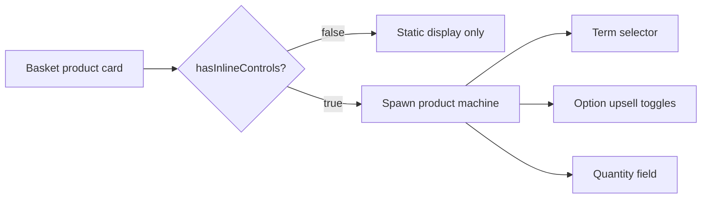
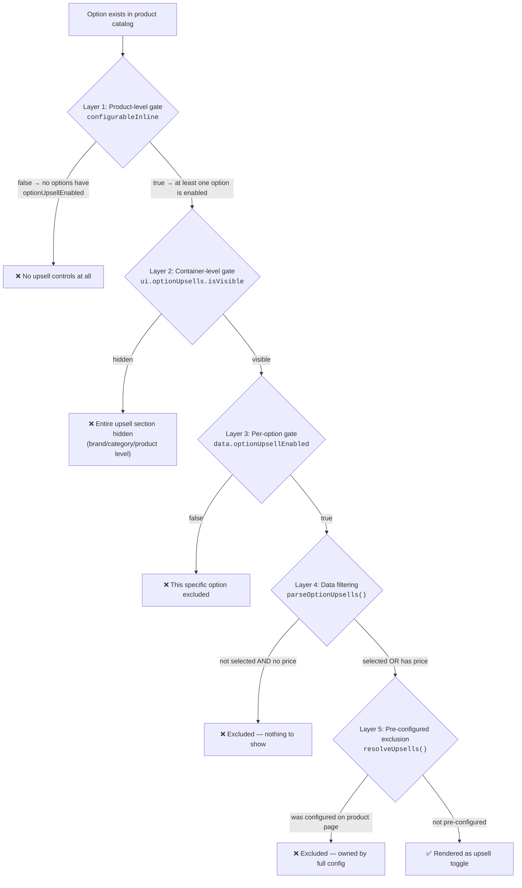
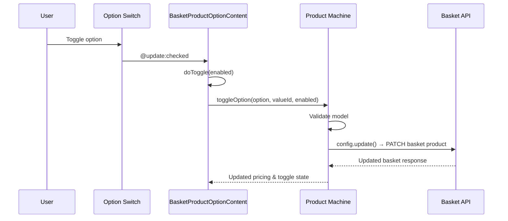

# Inline Editing (FE-1502)

Basket products can be edited directly in the basket card without navigating to the full configuration page. This covers billing term changes, option toggling (upsells), and quantity editing.

## Overview



The inline composable (`useBasketProductInline`) is created for every basket product. It resolves **meta flags** that determine which controls to show. If _any_ control is needed, the product machine is spawned in light mode. All changes auto-save to the basket API.

---

## Meta Flags

`useBasketProductInline(bpid).meta` returns:

```typescript
{
  hasInlineControls: boolean; // master switch — if false, machine is never spawned
  hasUpsellOptions: boolean; // product has inline-configurable options
  showOptionUpsells: boolean; // upsell section should render
  showTermSelector: boolean; // term dropdown should render
}
```

| Flag                | True when                                                                                             | Config property                                       |
| ------------------- | ----------------------------------------------------------------------------------------------------- | ----------------------------------------------------- |
| `hasUpsellOptions`  | Any option has `data.optionUpsellEnabled === true`                                                    | `optionUpsellEnabled` (OPTION scope)                  |
| `showOptionUpsells` | `hasUpsellOptions` AND `ui.optionUpsells.isVisible`                                                   | `optionUpsells` (UI visibility)                       |
| `showTermSelector`  | `ui.productTermSelector.isVisible` AND product is not one-off                                         | `productTermSelector` (UI visibility, default HIDDEN) |
| `hasInlineControls` | Any of the above two are `true`, OR `productDetails.quantifiable` is `true` (quantity/remove control) | —                                                     |

> The quantity/remove control always renders inline: `NumberField` when `productDetails.quantifiable` is `true`, otherwise a trash-icon button to remove the item. It is not guarded by a `meta` flag — consumers read `productDetails.quantifiable` directly.

> **🧪 For Testers:** If no inline controls appear, check: is `productTermSelector` set to visible? Does the product have options with `optionUpsellEnabled`? Is the product quantifiable?

---

## Upsell Visibility: Decision Tree

An option must pass **four layers of gating** to appear as a toggleable upsell in the basket.



### Layer 1: `configurableInline` (Product-Level Gate)

**Where:** [parseProductDetails()](file:///Users/rhodri/upmind-monorepo/packages/headless/src/modules/product/utils.ts#L547-L565) in `product/utils.ts`

At product-parsing time, iterates over _all_ options and attributes. If _any_ have `data.optionUpsellEnabled === true` (resolved via the config engine at `OPTION` scope), the product is marked `configurableInline: true`.

If `false`, `meta.hasUpsellOptions` is `false` and upsell controls never render. The machine may still spawn if the term selector or quantity controls are needed.

```typescript
configurableInline: (() => {
  const config = useConfig();
  return (
    some(rawProduct.products_options, option => {
      const { data } = config.with({
        product: () => ({ productDetails: { uiMeta: rawProduct.meta } }),
        option: () => ({ uiMeta: option.meta })
      });
      return !!data.optionUpsellEnabled;
    }) ||
    some(rawProduct.products_attributes, attr => { /* same check */ })
  );
})(),
```

### Layer 2: `ui.optionUpsells.isVisible` (Container-Level Gate)

**Where:** [BasketProduct.vue](file:///Users/rhodri/upmind-monorepo/packages/client-vue/src/modules/basket-product/components/card/BasketProduct.vue#L144) — `filteredUpsells` computed

| Property        | Default   | Contexts         | Scopes                                      |
| --------------- | --------- | ---------------- | ------------------------------------------- |
| `optionUpsells` | `VISIBLE` | Basket, Checkout | Brand → Category → Product → OptionCategory |

If `hidden`, `filteredUpsells` returns `[]` — no upsell toggles render regardless of per-option settings. Checked in two places:

1. `useBasketProductInline.meta` → `showOptionUpsells`
2. `BasketProduct.vue` → `filteredUpsells` computed (first line)

### Layer 3: `data.optionUpsellEnabled` (Per-Option Gate)

**Where:** [BasketProduct.vue](file:///Users/rhodri/upmind-monorepo/packages/client-vue/src/modules/basket-product/components/card/BasketProduct.vue#L157) — inside `filteredUpsells` map

| Property              | Default | Contexts         | Scopes      |
| --------------------- | ------- | ---------------- | ----------- |
| `optionUpsellEnabled` | `false` | Basket, Checkout | Option only |

Each option value is checked individually via the config engine. **Defaults to `false`** — upsells are opt-in, not opt-out.

```typescript
// BasketProduct.vue — per-option check
map(resolvedUpsells, upsell => {
  const { data } = productConfig.with({
    optionGroup: () => resolveOptionGroup(upsell),
    option: () => upsell
  });
  if (!data.optionUpsellEnabled) return undefined; // ← excluded
  return { upsell, benefits: data.optionBenefits };
});
```

### Layer 4: Data Filtering (`parseOptionUpsells`)

**Where:** [utils.ts](file:///Users/rhodri/upmind-monorepo/packages/headless/src/modules/basketProduct/utils.ts#L389-L429)

After config gates pass, the actual data is filtered:

- **Selected options** (matching `product_id` in basket) → always included
- **Unselected options with a price** → included (available for upsell)
- **Unselected options with no price** → excluded (nothing to show)

### Layer 5: Pre-Configured Option Exclusion

**Where:** [useBasketProductInline.ts](file:///Users/rhodri/upmind-monorepo/packages/headless/src/modules/basketProduct/useBasketProductInline.ts#L122-L140) — `resolveUpsells()`

Options that were already selected before the inline editor opened (i.e., configured on the full product page) are tracked via `preConfiguredIds` and excluded. This prevents duplicate toggle controls — the full config page owns those options.

```typescript
// Capture IDs of options already selected at editor open time
const preConfiguredIds = compact(
  map(
    filter(
      basketProduct.upsells as BasketOptionSummary[],
      "meta.toggle.selected"
    ),
    "meta.toggle.valueId"
  )
);

// Later, in resolveUpsells():
return filter(
  summaries,
  s => !includes(preConfiguredIds, s.meta.toggle?.valueId)
);
```

> **🧪 For Testers:** Configure a product with options on the product page. In the basket, verify those options appear in the summary but NOT as toggleable upsell switches. Only options that weren't pre-selected should show as inline toggles.

### Summary Table

| Gate                         | Check                           | Default   | Where Configured    |
| ---------------------------- | ------------------------------- | --------- | ------------------- |
| `configurableInline`         | Any option has upsell enabled?  | Computed  | Product option meta |
| `ui.optionUpsells.isVisible` | Section visible?                | `VISIBLE` | Brand config engine |
| `data.optionUpsellEnabled`   | This specific option enabled?   | `false`   | Option meta         |
| `parseOptionUpsells()`       | Has price or is selected?       | N/A       | Catalog data        |
| Pre-configured exclusion     | Was configured on product page? | N/A       | Runtime state       |

---

## Term Selector

The inline term selector appears as a `Select` dropdown when `showTermSelector` is `true`.

| Condition                                       | Required                                              |
| ----------------------------------------------- | ----------------------------------------------------- |
| `ui.productTermSelector.isVisible`              | Yes — default is `HIDDEN`, must be explicitly enabled |
| Product is not one-off (`!meta.oneoff`)         | Yes — one-off products have no term to change         |
| Product has multiple terms (`terms.length > 1`) | Yes — single-term products hide the selector          |

The dropdown shows `parseBillingCycle(cycle).numeric` labels (e.g., "1 month", "12 months").

**When the term changes:**

1. `config.updateTerm(value)` is called
2. The product machine re-validates — option prices update for the new cycle
3. Options without a price for the new term are removed from the available list
4. `config.update()` auto-saves to the basket API

> **🧪 For Testers:** Change the billing term. Verify option prices update, options without a price for the new term disappear, and one-off options (cycle 0) remain visible.

### Pricing Display: Full Term Price (Forced)

The basket term selector **always shows the full term price** (e.g., `$120/yr`) — never the monthly breakdown (e.g., `$10/mo`). This is enforced via the `type` prop on `TermCard` in `BasketProductTermSelector.vue`:

```vue
<!-- BasketProductTermSelector.vue — dropdown slot -->
<TermCard v-bind="slotProps.item" :type="PriceDisplayTypes.CYCLE" />
```

**Why?** The basket product card displays the total price for the selected billing cycle (via `CurrentPrice` / `ExPrice` in `BasketProductContent.vue`). If the term selector showed monthly prices but the card showed the full term price, the user would see two different price formats side by side — confusing. Forcing `CYCLE` display ensures the term selector matches the adjacent product price.

> **🔧 For Contributors:** `TermCard` accepts an optional `type` prop (`PriceDisplayTypes` enum from `@upmind-automation/types`). When set, it overrides the `meta.useMonthlyFromPrice` flag derived from the brand's `PRICE_DISPLAY_TYPE` setting. Available values: `CYCLE` (full term), `MONTHLY_FROM` (monthly breakdown), `LOWEST_MONTHLY_PRICE` (lowest monthly).

### Price Display Logic (Background)

The brand's `PRICE_DISPLAY_TYPE` setting controls how prices appear across the app:

| Setting             | Enum Value                                        | `useMonthlyFromPrice` | Display   |
| ------------------- | ------------------------------------------------- | --------------------- | --------- |
| Show cycle price    | `CYCLE` (`"min"`)                                 | `false`               | `$120/yr` |
| Show monthly from   | `MONTHLY_FROM` (`"abs_min"`)                      | `true`                | `$10/mo`  |
| Show lowest monthly | `LOWEST_MONTHLY_PRICE` (`"lowest_monthly_price"`) | `true`                | `$10/mo`  |

This flag is set during `parseSummaryDetail()` in the headless layer and passed via `meta.useMonthlyFromPrice` on each term. `TermCard` reads this flag by default. The `priceDisplayType` prop overrides it when a specific display format is required regardless of brand configuration.

> **🧪 For Testers:** When verifying the basket term selector, toggle the brand's `PRICE_DISPLAY_TYPE` between all three values. The product listing card term selector should change format, but the basket term selector should **always** show the full cycle price.

---

## Quantity Editing

Appears when `productDetails.quantifiable` is `true` — the product's `order_type` is `QUANTIFIABLE`. When `false`, the same slot renders a trash button so the item can still be removed inline.

Quantity changes are **debounced** (500ms) before auto-saving to prevent API spam while the user clicks +/-.

---

## Toggle & Auto-Save Flow



Changes flow through computed `v-model` bindings in `BasketProduct.vue`:

| Model           | Trigger               | Save Mechanism                                               |
| --------------- | --------------------- | ------------------------------------------------------------ |
| `termModel`     | User selects new term | `config.updateTerm(value).then(config.update)` — immediate   |
| `optionsModel`  | User toggles switch   | `config.toggleOption(...).then(config.update)` — immediate   |
| `quantityModel` | User changes quantity | `config.updateQuantity(value)` + debounced `config.update()` |

---

## Machine Pricing Resolution

Upsell pricing can come from two sources:

| Source                                 | When Used                  | Includes Coupons? |
| -------------------------------------- | -------------------------- | ----------------- |
| Catalog data (`basketProduct.upsells`) | Machine not yet resolved   | No                |
| Machine data (`config.options`)        | Machine resolved and ready | Yes               |

`resolveUpsells()` prefers machine data when available. During the brief window between spawning the machine and it resolving, catalog prices are shown. Prices may shift once the machine resolves if coupons apply.

---

## Benefits

Option benefits (`data.optionBenefits`) are resolved per-upsell via the config engine at `OPTION_CATEGORY → OPTION` scope. They're displayed below the toggle using the `BasketProductBenefits` component.

| Property         | Default | Contexts                    | Scopes                  |
| ---------------- | ------- | --------------------------- | ----------------------- |
| `optionBenefits` | `[]`    | Configure, Basket, Checkout | OptionCategory → Option |

---

## Config Engine Properties Reference

### UI Properties

| Property              | Type         | Default   | Scope                                       | Purpose                         |
| --------------------- | ------------ | --------- | ------------------------------------------- | ------------------------------- |
| `optionUpsells`       | `VISIBILITY` | `VISIBLE` | Brand → Category → Product → OptionCategory | Show/hide entire upsell section |
| `productTermSelector` | `VISIBILITY` | `HIDDEN`  | Brand → Category → Product                  | Show/hide inline term selector  |

### Data Properties

| Property              | Type        | Default | Scope                   | Purpose                                  |
| --------------------- | ----------- | ------- | ----------------------- | ---------------------------------------- |
| `optionUpsellEnabled` | `boolean`   | `false` | Option                  | Enable specific option for inline upsell |
| `optionBenefits`      | `Benefit[]` | `[]`    | OptionCategory → Option | Benefit labels shown below toggle        |

> **🔧 For Contributors:** `optionUpsellEnabled` defaults to `false`. You must explicitly enable it per-option via brand meta. `optionUpsells` (UI visibility) defaults to `VISIBLE` — it's the container, not the per-option flag.

---

## Components

| Component                        | Purpose                                                                  |
| -------------------------------- | ------------------------------------------------------------------------ |
| `BasketProduct.vue`              | Orchestrates inline editing — spawns machine, computes `filteredUpsells` |
| `BasketProductContent.vue`       | Main product summary — renders term selector and quantity                |
| `BasketProductOptionContent.vue` | Option row with toggle switch and pricing (used for upsells)             |
| `BasketProductBenefits.vue`      | Renders benefit list below an upsell toggle                              |
| `BasketProductTermSelector.vue`  | `Select` dropdown for billing term                                       |
| `BasketProductOptionSwitch.vue`  | Full option switch (used in expanded config, NOT in inline upsells)      |
