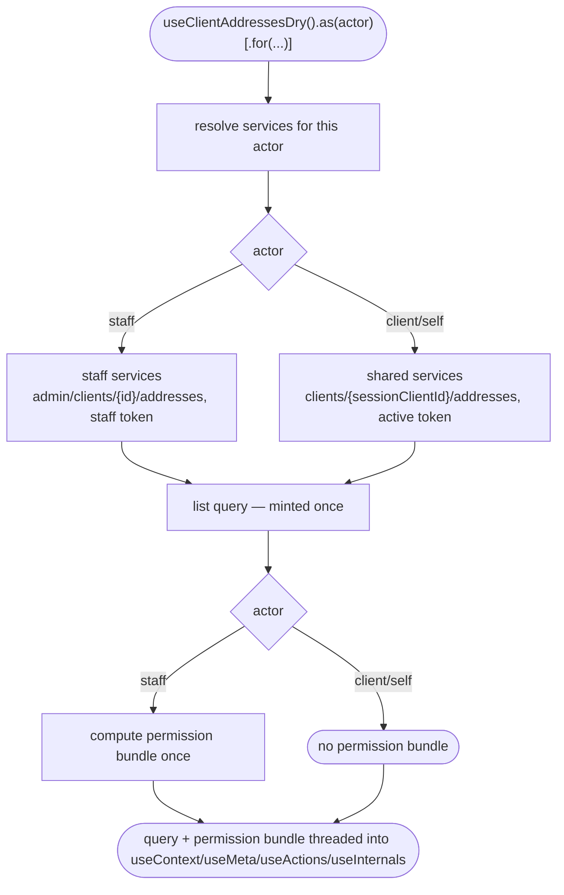

# client-address-dry Architecture

## Overview

`useClientAddressesDry` is a scoped composable built on this codebase's query-variant factory template — a single TanStack Query list query per concrete `(actor, context)` scope, minted once at construction, with mutations composed alongside it. There is no state machine: readiness/loading/error are derived directly off the query's own state. Actor-specific behaviour (client/self vs staff acting on behalf of a named client) is injected at three layers — **services**, **actions**, and **meta** — via an opt-in `.staff.ts` arm each; `context` and `schemas` are shared, byte-identical factories with no arm, because no actor gives either an exclusive or overriding member at those layers.

This follows the same actor-scoping pattern this codebase uses for every module where an actor can act on behalf of another: a module factory receives an already-resolved, concrete actor and never branches on "the active actor" itself — that resolution happens one layer up, in the shared scope-building code every scoped module goes through.

## Sub-composables

| Sub-composable   | Purpose                                                                                                                                                                                    |
| ---------------- | ------------------------------------------------------------------------------------------------------------------------------------------------------------------------------------------ |
| `useActions()`   | mutations (`add`/`update`/`remove`/`setDefault`/`ensure`), lifecycle (`refresh`/`nextPage`/`prevPage`/`invalidate`/`destroy`/`isReady`), form helpers (`parse`/`validate`/`filters.query`) |
| `useContext()`   | reactive list (`data`/`default`/`pagination`/`error`/`findOne`/`getOne`), form seed (`model`/`schema`/`uischema`/`lookups`)                                                                |
| `useMeta()`      | collection state flags (`isLoading`/`isError`/`isEmpty`/`isAvailable`/`isAuthenticated`) plus, staff-only, the four permission flags                                                       |
| `useInternals()` | `actorScope`, the raw query, the raw (ungated) service object, `queryKey`                                                                                                                  |

## Data flow

1. **Instantiation** — `useClientAddressesDry().as(actor)[.for('client', id)]` resolves the actor via the shared scope builder and calls the module's own per-scope factory once per concrete scope key.
2. **Service resolution** — the services factory routes to the staff-specific service set for a staff actor and returns the shared set otherwise. The staff arm's `loadList`/`add`/`update`/`remove`/`setDefault` override the shared ones by object-spread; `ensure`/`parse`/`validate`/`loadLookups` are always the shared implementations, and `ensure` closes over _whichever_ `loadList`/`add` won the resolution (shared or staff-overridden) so a staff `ensure()` never silently falls through to the client's own endpoint.
3. **Query mint** — the list query is requested exactly once, at construction, and the resulting query object is threaded into every sub-composable factory. A sub-composable requesting the list again would mint a second, independent query — this does not happen anywhere in the module.
4. **Permission bundle** — for a staff actor, the four permission booleans (`canList`/`canCreate`/`canUpdate`/`canDelete`) are computed exactly once per scope instance, at the same point the query is minted, and the same computed bundle is handed to both the actions arm (which gates whether each write member exists at all) and the meta arm (which exposes the same four booleans as readable state). Neither arm runs its own independent permission check — the values a caller reads off `useMeta()` and the availability of the matching `useActions()` member are guaranteed to come from one source, not two that could drift apart.
5. **Actions arm** — the shared action set is built first, then the staff-specific set is spread in last when the actor is staff, so the staff arm's conditionally-`undefined` members win over the shared always-present ones for the same keys.
6. **Context/meta (shared parts)** — both are single, armless factories over the resolved query; the staff-vs-client difference the query itself already carries (different URL, different readiness guard) is sufficient — no branch is needed at these layers for the members every actor shares.

## Query lifecycle

Guarantees the platform holds:

- The resolved `(actor, context)` scope is fixed at construction; a single instance never re-targets to a different client mid-life.
- The staff arm's `loadList`/mutations always read the named target id, never the active session's own client id.
- A staff instance's permission bundle is computed once and shared between the actions gate and the meta read-state — the two can never disagree for the same instance.

Constraints the caller has to plan around:

- A staff instance's query is gated on both a resolvable staff token **and** a target id being present; either missing leaves the query permanently unauthenticated rather than retried.
- Re-scoping to a different target client requires a new instance (a new `(actor, context)` scope key), not a mutation of the existing one.

## Services

| Actor                        | Retargets                                                                                                                                                   |
| ---------------------------- | ----------------------------------------------------------------------------------------------------------------------------------------------------------- |
| client/self (shared, no arm) | `clients/{sessionClientId}/addresses[/{id}]`, active-session token                                                                                          |
| staff (arm)                  | `admin/clients/{scopeContext.id}/addresses[/{id}]`, staff session token selected explicitly from the multi-session store (never the active-session default) |

Both list forms request staged-import rows be included — the staff arm re-authors `loadList` entirely rather than inheriting the shared list's own query parameter, so it is set independently in each.

A staff member acting as a client during an impersonation session never touches the staff arm at all: the shared self-path services already read whichever session token is currently active, and impersonation makes the impersonated client's own token the active one — so the same client-path request goes out, carrying that client's token, with no branch anywhere in this module.

## Actions

| Actor                             | Behaviour                                                                                                                                                                                                        |
| --------------------------------- | ---------------------------------------------------------------------------------------------------------------------------------------------------------------------------------------------------------------- |
| client/self + shared write guards | always-present `add`/`update`/`remove`/`setDefault`/`ensure`/lifecycle; `remove` additionally requires the target's own delete-eligibility flag                                                                  |
| staff (arm)                       | overrides `refresh`/`add`/`ensure`/`update`/`setDefault`/`remove` to `undefined` unless the staff session carries the matching permission code; re-enforces the delete-eligibility check inline where applicable |

The staff arm's permission check reads a permissions array off the active staff session's own user profile, read directly from the session store's multi-session entries rather than through the generic "currently active session" accessor — under multi-session the active session can be a client session even while a staff session is held, so the staff arm always resolves its own identity independent of what is currently active.

## Meta

| Actor                | Behaviour                                                                                                            |
| -------------------- | -------------------------------------------------------------------------------------------------------------------- |
| every actor (shared) | `isLoading`/`isError`/`isEmpty`/`isAvailable`/`isAuthenticated` — derived purely off the query's own state           |
| staff (arm)          | adds `canList`/`canCreate`/`canUpdate`/`canDelete`, sourced from the same permission bundle the actions arm gates on |

On a non-staff scope, the four permission keys are still present on the returned object, explicitly set to `undefined` — the return shape stays uniform across every actor; a client reading `useMeta().canDelete` gets `undefined`, never a missing key.

## Dependencies

### Depends on

| Module               | Usage                                                                                     |
| -------------------- | ----------------------------------------------------------------------------------------- |
| session store        | staff-session lookup (token select, permission-field read)                                |
| HTTP transport layer | all HTTP calls (services only, never composables)                                         |
| system data          | country/region lookup for form seeding/formatting                                         |
| brand configuration  | active-brand region-required setting, active-brand country for the new-address seed       |
| feedback             | success/error notices on mutations                                                        |
| localisation         | translated strings for feedback messages                                                  |
| scope registry       | the shared scoping accessor and actor-scope registry every scoped module resolves through |

### Depended on by

None currently — net-new, no consumer in the tree.

## Integration points

| Boundary                                 | Contract                                                                                                                                                                                                                       |
| ---------------------------------------- | ------------------------------------------------------------------------------------------------------------------------------------------------------------------------------------------------------------------------------ |
| Self path                                | `clients/{sessionClientId}/addresses[/{id}]`, active-session bearer                                                                                                                                                            |
| Admin (staff) path                       | `admin/clients/{targetId}/addresses[/{id}]`, staff-session bearer selected explicitly                                                                                                                                          |
| Impersonation (staff acting as a client) | same as the self path — the impersonation session's own client token is the active-session bearer at call time; no distinct code path exists                                                                                   |
| Permission gate                          | reads a permissions field off the staff session's own user profile, computed once per scope and shared by the actions gate and the meta read-state                                                                             |
| Recordings                               | list/create/update/delete responses for both the self and admin paths are captured, co-located recordings; session-bootstrap fixtures (token/self responses) are reused cross-module from the session store's own fixture pool |

> **For Contributors:** the staff services, actions, and meta arms are the only layers that may earn a `.staff.ts` file for this module — `context`/`schemas` are confirmed shared across every actor and should stay that way unless a genuine per-actor override is found.
