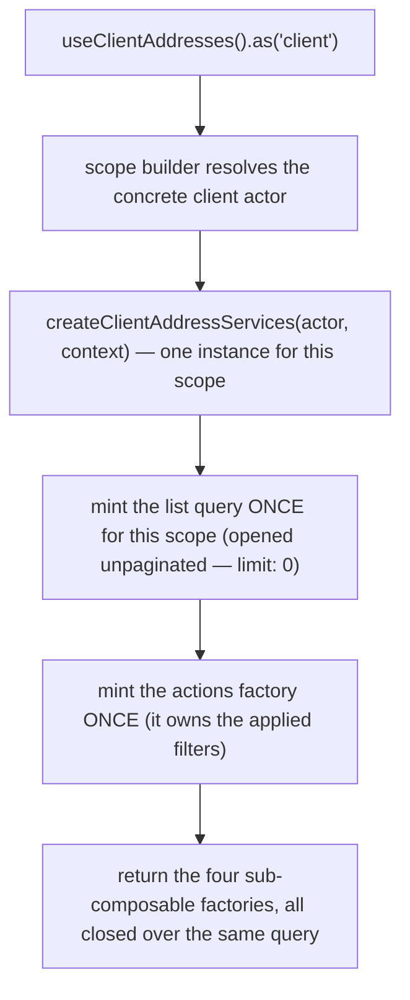
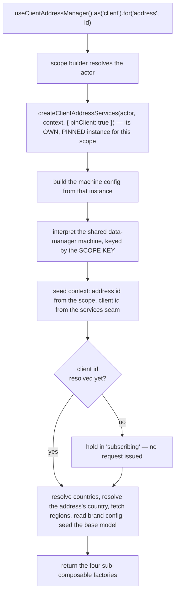
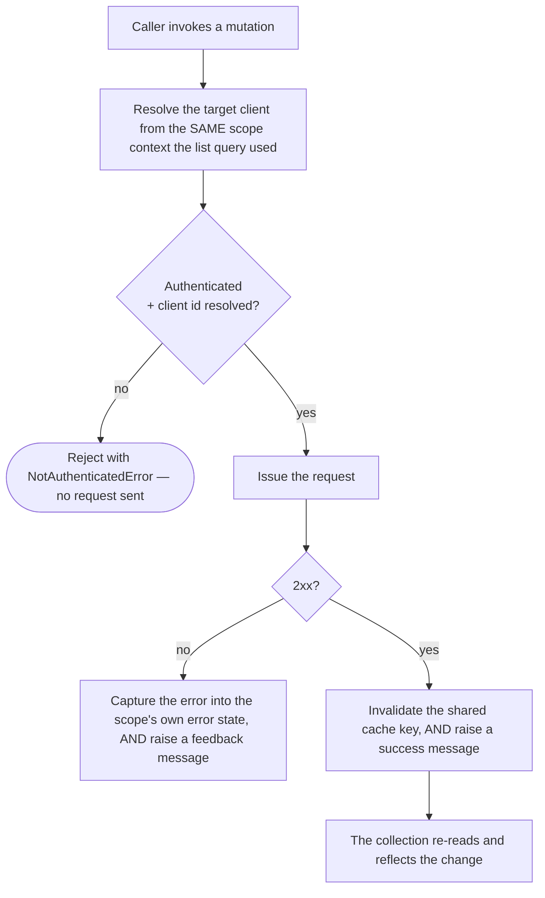
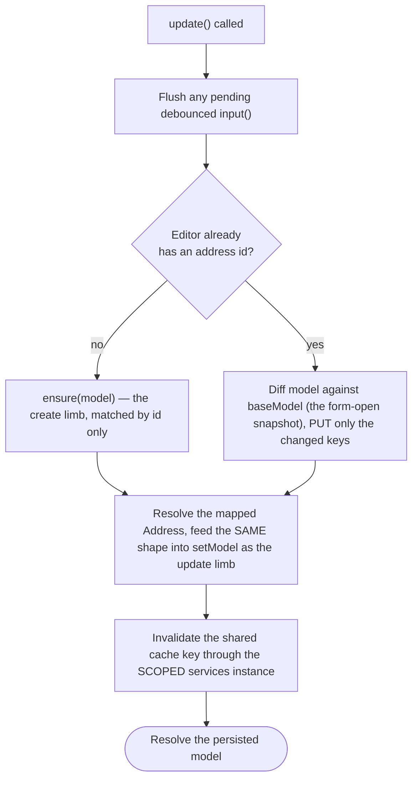
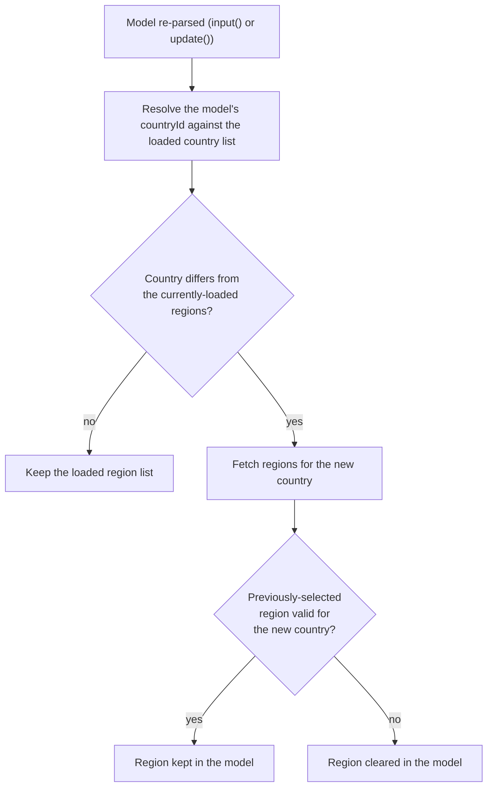
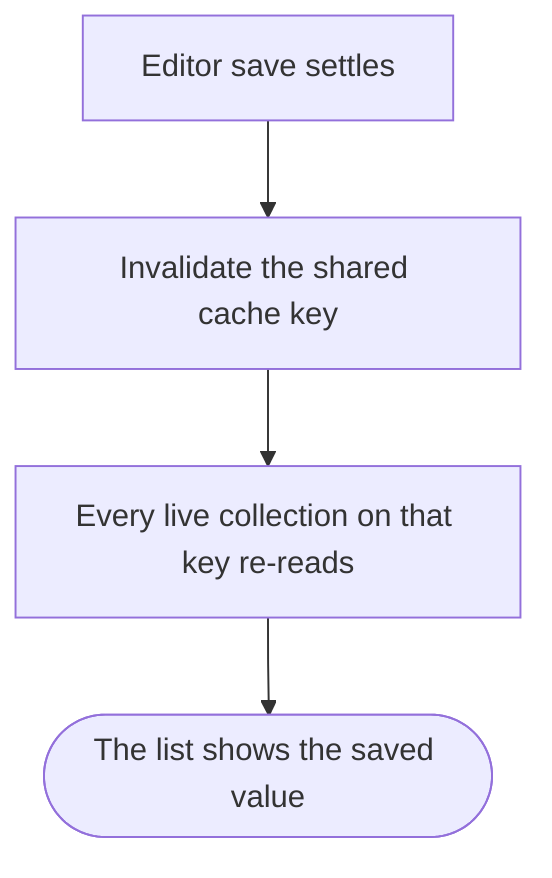

# client-address — Architecture

## Overview

The module ships **two** scoped composables over one shared data layer:

- **`useClientAddresses`** — the collection. Query-backed, no state machine. One list query is minted per resolved `(actor, context)` scope, at construction, so it survives component lifecycles.
- **`useClientAddressManager`** — the per-address editor. Backed by the shared data-manager machine, one interpreter per resolved `(actor, address)` scope.

Both are registered under the same module name; the composable name and the scope key carry the differentiation. Both build their own services instance from **one factory**, so the two halves share one identity seam, one cache key and one set of request gates.

The single most important property of this module is that **every request URL derives from the resolved scope**, never from a direct session read. One resolution function in the services layer is the only place a target client is decided, and every request-issuing function in the services file — list, read-one, add, update, ensure, remove, set-default — goes through it. The manager seeds its machine context from that same seam rather than reading the session itself, and **pins** the resolved client for its own lifetime: an editor addresses the account it was opened for, even if the session moves to a different client while the form is still open. The collection does not pin — a list follows the live session, the same as its sibling modules.

Only one actor currently resolves in either scope matrix: the client acting for themself, addressed as `ScopeActorTypes.CLIENT`. Both matrices declare the other actors as unreachable at compile time rather than silently omitting them — see "What this module does not do" below and [gotchas.md](./gotchas.md) for what that means in practice.

## Data Flow

### Instantiation — the collection

`useContext()`, `useMeta()` and `useInternals()` are lazy — they build on call. `useActions()` is **not**: it is minted once per scope, because the applied `filters` live inside it.

The collection's list query opens with `pagination: { limit: 0 }` — an intentionally unpaginated read that returns the client's entire address collection in one response, with the embedded `region` and `country` objects requested alongside every row. A consumer of `useContext().data` never needs a second page. This is also why the public `nextPage()` / `prevPage()` members cannot succeed through this composable — see [gotchas.md](./gotchas.md#4-nextpage--prevpage-cannot-move-through-this-surface).

### Instantiation — the editor

The interpreter is keyed by the **scope key**, not the address id: `.fresh()` mints a unique key per call, so two concurrent drafts get two independent editors instead of colliding on one shared identifier.

Like the collection, the editor's `useActions()` is minted once per scope — `input` is debounced, and a debouncer minted per call would give two keystrokes two independent timers and leave `update`'s pre-save flush with nothing to flush.

### Mutation flow — the collection

`remove` and `setDefault` both raise a user-visible success or failure message on top of capturing the failure into state — a deliberate divergence from a silent-by-default sibling pattern elsewhere in this codebase, kept because this module's own data layer already raised those two confirmations before conversion and dropping them would be a behaviour change wearing a refactor's clothes.

### Mutation flow — the editor's save

The `add:` and `update:` machine services resolve the **same mapped shape** into the machine's model-setting action — a create resolves a mapped `Address` through find-or-create, and the update limb is explicitly re-mapped to match it. Before this symmetry, a raw wire response with no `address` key would have the shared model-parser silently refill the address from the form-open snapshot on a successful save, which reads as the save having reverted itself.

### Country-change flow (the editor's `parse`)

The clearance itself is a model-level `undefined`, not a wire-level `null` — the schema's region field carries an `enum` once regions are loaded, and an explicit `null` there would fail validation and wedge the form on the very country change this step exists to serve. The `undefined` → `null` conversion for the wire happens one layer up, in the diff mapper, and only when a baseline exists to diff against — a create has nothing to clear.

### How a save in the editor reaches the collection

Both halves resolve the same base cache key. The editor never reaches into the collection's query instance — that instance belongs to a different scope key and may not exist in the consumer at all. Instead a settled save invalidates the shared key through the editor's own services instance, and any live collection re-reads.

## Sub-composables

| Sub-composable   | Collection                                                                     | Editor                                                                                    |
| ---------------- | ------------------------------------------------------------------------------ | ----------------------------------------------------------------------------------------- |
| `useActions()`   | 10 members — row mutations, list controls, lifecycle                           | 7 members — form input, save, lifecycle                                                   |
| `useContext()`   | 6 members — reactive list, lookups, captured error                             | 14 members — model, schema pair, resolved country/region/config, id, errors, display text |
| `useMeta()`      | 7 flags — errors, four pagination-metadata flags, availability, empty, loading | 8 flat flags — availability, loading, dirty, valid, new, processing, complete, errors     |
| `useInternals()` | 2 — actor scope, raw query                                                     | 4 — actor scope, raw sender, raw service, raw state                                       |

Both halves return the identical four-layer shape; only the contents differ, because one is query-backed and the other machine-backed. The editor's context carries five more members than a comparable sibling editor with no country/region dependency (`baseModel`, `config`, `country`, `countries`, `regions`) — a direct consequence of this form needing to resolve and expose those lookups.

## Services

One services file serves both halves. There are no per-actor service arms today — the actor switch exists with only a default branch, so the shape is the same whether or not an arm is ever earned.

| Concern                   | Where it lives                                                                                                           |
| ------------------------- | ------------------------------------------------------------------------------------------------------------------------ |
| Target-client resolution  | one function, consumed by every request-issuing function in the file                                                     |
| Addressability predicate  | one function; its reactive form is what `isAvailable` exposes                                                            |
| Cache key                 | one base key, shared by both halves                                                                                      |
| Wire ↔ view-model mapping | pure mappers, no actor awareness — a create mapper, and a diff mapper that composes the create mapper against a baseline |
| Machine services adapter  | takes the already-scoped services instance as an argument, so the machine inherits the same resolved client              |

The module owns **no machine of its own** — it builds a typed configuration payload for the shared data-manager machine, whose actions, guards and invoked services it overrides. One guard override is load-bearing: the editor is held out of its loading state until a client id exists, which is what stops it firing an unaddressed request on a cold boot.

The identity-resolution function accepts a context branch for "a client other than the session's own" that is **currently unreachable** from either live scope matrix — both matrices resolve exactly one actor (the client, acting for themself). The branch is kept anyway, deliberately: it is the single point every request gate reads, so a future restoration of a second acting cell becomes an edit to that one function and the scope matrices, not a rewrite of the identity seam. See [gotchas.md](./gotchas.md#10-staff-address-management-is-not-delivered-here--its-tracked-not-forgotten).

### Arms

Every layer in this module — services, actions, context, meta, schemas — is **armless**: no layer has a member exclusive to one actor, or one that overrides the shared implementation for a genuine actor-vs-actor divergence. That is a direct consequence of only one actor resolving in either scope matrix: with a single resolving actor, there is no second actor for a member to be exclusive against.

## Errors

Errors are **state**, not events, on the editor half; the collection half is split (see above).

| Surface                                           | Where a failure lands                                                                                                                    |
| ------------------------------------------------- | ---------------------------------------------------------------------------------------------------------------------------------------- |
| Collection row mutation (`remove` / `setDefault`) | a user-visible failure message, AND the services instance's captured error → `useContext().error`, `useMeta().hasError`                  |
| Collection list read                              | the query's own error → the same two members                                                                                             |
| Editor save                                       | the machine's context error → `useContext().errors`, `useMeta().hasErrors`; the action also rejects with a detailed error for the caller |
| Editor field validation                           | the validation errors → `useContext().validationErrors`, `useMeta().isValid`                                                             |

A consumer that wants user-visible feedback for anything other than `remove()` / `setDefault()` renders it from those members, or from the editor's `onDone()` completion signal — nothing else in this module raises one for you.

## Dependencies

### This module reads from

| Module                | Uses                                                                                                                                                  |
| --------------------- | ----------------------------------------------------------------------------------------------------------------------------------------------------- |
| `session-store`       | the active client identity (the addressed client when no other context is supplied), whether the session is authenticated, and whether it has settled |
| `query`               | the shared request layer — list reads, single mutations, URL building, cache invalidation                                                             |
| `data-manager`        | the shared form-editor machine the per-address editor interprets                                                                                      |
| `system`              | brand-agnostic reference data — the countries and regions the form resolves and validates against                                                     |
| `brand`               | the two address-form rules (region-required, country-locked) the form fetches                                                                         |
| `scope`               | the actor-scoping accessor and its instance registry                                                                                                  |
| `feedback`            | the success/failure messages `remove()` / `setDefault()` raise                                                                                        |
| `system-localisation` | translated caller-facing text on rejected reads and saves, and the two success confirmations `remove()` / `setDefault()` raise                        |
| shared utilities      | schema validation, model parsing, collection lookups, state-read helpers, and the typed unauthenticated-access error                                  |

### Modules that read from this one

| Module                     | Uses                                                                                                                                                                              |
| -------------------------- | --------------------------------------------------------------------------------------------------------------------------------------------------------------------------------- |
| `client-company`           | the FULL collection and editor pair — list, default, `getOne`, `remove`, `setDefault`, and the editor's create/edit form, composed into its own company form as an address picker |
| `basket-billing` (unified) | find-or-create by id, the client's default address, the full list, and the readiness signal while composing billing contact details                                               |
| `invoices`                 | the pure `mapAddress` shape mapper only — to render an address already embedded on an invoice response, with no request of its own                                                |

The `client-company` and `basket-billing` consumers both reach the collection and manager only through `.as('client')` — followed by the mandatory four-layer destructure that shape forces. Neither re-implements the list read or the find-or-create check. `invoices` is a schema-only consumer: it imports `mapAddress` from the barrel and never touches a composable, a scope, or a request.

## Integration Points

- **Client company composition** embeds this module's own composables directly — an address list and editor pair, adapted to the shape a shared list-and-form renderer expects — so a client can pick, create or edit an address while managing one of their companies without leaving that form.
- **Billing-detail composition** reuses the collection's find-or-create and default-address reporting while assembling a client's billing contact details.
- Any consumer rendering addresses directly — list, delete, set default — drives the collection; any consumer rendering an add/edit **form** drives the editor, which serves its own schema pair.
- Two consumers elsewhere in this codebase compose the address form's _fields_ into a larger schema at module scope, where no editor instance exists to read from machine context — `client-company` and `basket-billing/unified` both import `useSchemaDefinitions()` / `useUischemaDefinitions()` for exactly this. This is the one documented route to the form definition that does not go through the editor's own context, and it is a pure-function route: no scope, no session, no request.

## Module boundary

The barrel is the module's only public surface: two composables, two scope matrices, two context enums, the address-type constants, three model types, one cross-module mapper (`mapAddress`), the two schema fragment functions, and eight sub-composable types. Curated named re-exports only — no `export *`.

Everything else is internal and carries a file-level internal marker: the services, the schema **parsers** (as opposed to the fragment builders), and the machine configuration. In particular the _parsed_ schema pair is **not** exported — it enters the system in the machine configuration and reaches consumers through the editor's context, because a form rendered from a definition the editor has not adopted validates against a different contract than the one that saves. The two schema **fragment** functions are the one deliberate exception to this module's own "no schema exports" default, kept narrow: they are pure functions with no scope, session, request or reactive state, published specifically because two other modules compose this form's fields into their own schemas at module scope, where no editor instance exists yet to read from.

## What this module does not do

Two categories of capability are visibly out of scope for this module as it stands, and both are recorded rather than silently absent:

- **Acting on behalf of another client.** Both scope matrices declare exactly one resolving actor. A staff member reading or writing another client's addresses — including impersonating that client, and the capability gates that govern staff creating, updating or deleting a client's address — is real on the wider platform and is tracked for this module, not delivered. See [gotchas.md](./gotchas.md#10-staff-address-management-is-not-delivered-here--its-tracked-not-forgotten).
- **A wire-level assertion that the brand's address-form rules were requested by exactly this module.** The capability those rules gate — locking the country field, requiring a region — works, from whatever the shared brand-configuration cache holds; a request distinguishably naming this module's own two keys, separate from any other caller's ask, cannot reliably be demonstrated on the wire. See [foundation.md](./foundation.md#the-dedicated-wire-level-request-for-this-forms-brand-settings-is-not-reliably-observable).
