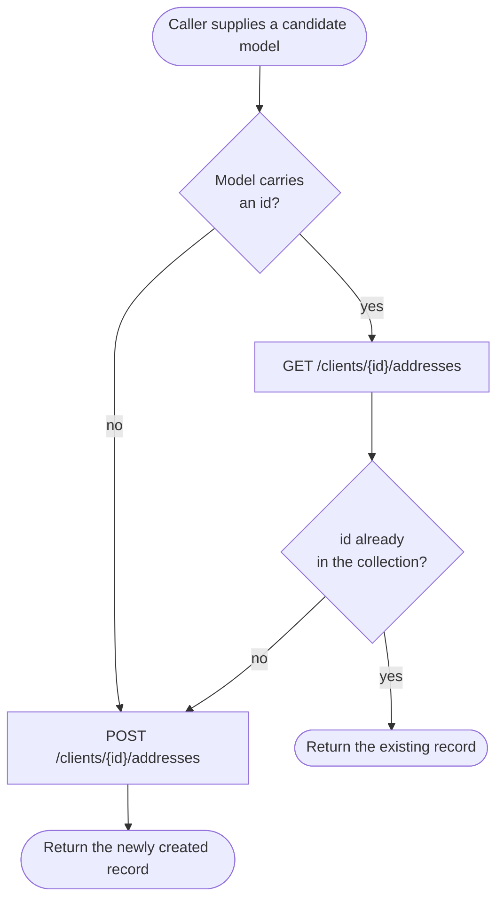
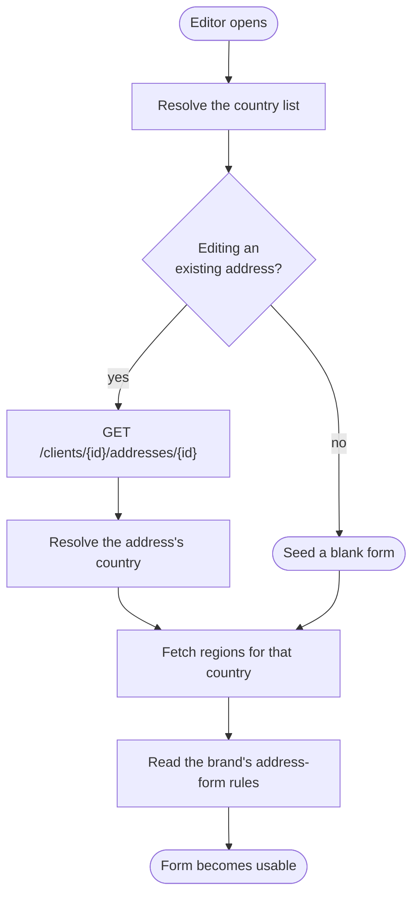
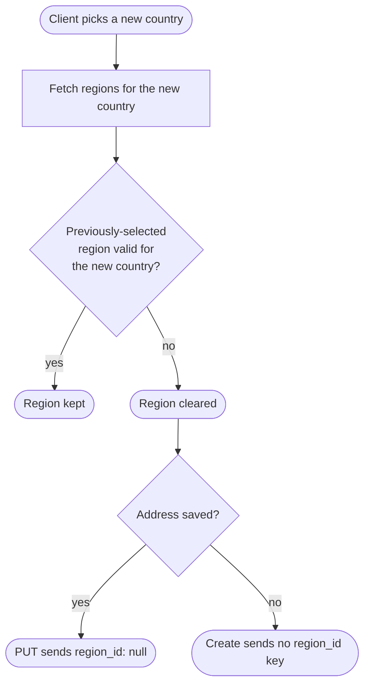

# Module: client-address

## What it is

The **client-address** module covers the collection of postal addresses attached to a single client account: read the list, read one entry, add an address, change one, delete one, and mark one as the default. Every operation acts on one client's own collection — the addressed client is fixed when the collection or the editor is opened, and no operation reaches across accounts.

Two working surfaces sit over the same data: a **collection**, read and acted on row by row, and a **single-address editor** used to add or change one address through a validated form that also resolves the address's country and, where the country has them, its regions. Both address the same client and share one cached read, so a save made through the editor is reflected the next time the collection is read.

## Core concepts

- **Address record** — one entry in a client's collection: the address lines, city, postcode, country and (where applicable) region, plus a display type, a verification level, and status flags for default and deletability.
- **Default address** — the single record flagged as the client's default. Promoting a different record un-defaults the previous one.
- **Address type (`type`)** — a numeric classification (1 Home, 2 Office, 3 Holiday, 4 Company). Unlike some sibling collections in this codebase, this one lets the client **choose** the type when editing an existing address; a newly created address always starts as Home and the type control only appears once the address exists.
- **Region** — a country subdivision (state/province) that some countries require and others do not. The form resolves the region list for whichever country is selected and re-resolves it whenever the country changes.
- **Verification level** — a numeric value carried from the platform unchanged, describing how far an address has been confirmed. This collection only ever displays it; nothing in this module changes it.
- **Find-or-create** — resolving a candidate address to a record already in the collection, or creating one when no match exists, as a single step. This module's find-or-create matches only on a supplied **id** — see "Not captured" below for what that means in practice.

## Operations

| #   | Capability                                                                            | Inputs                                                        | Outputs                                                                                     |
| --- | ------------------------------------------------------------------------------------- | ------------------------------------------------------------- | ------------------------------------------------------------------------------------------- |
| 1   | **List one client's addresses**                                                       | (none — reads the whole collection in one request)            | Array of address records, each with its lines, status flags and a total count               |
| 2   | **Read one address by id**                                                            | address id                                                    | The single address record                                                                   |
| 3   | **Add an address**                                                                    | address lines, city, postcode, country, optional region, name | The created address record                                                                  |
| 4   | **Change an address**                                                                 | address id, changed fields only                               | The updated record                                                                          |
| 5   | **Delete an address**                                                                 | address id                                                    | Confirmation; the record is gone from the collection                                        |
| 6   | **Set an address as the default**                                                     | address id                                                    | The updated record; the previously default record is no longer default                      |
| 7   | **Find or create an address by id**                                                   | a candidate model, optionally carrying an `id`                | The matching existing record if the `id` is already held, otherwise a newly created one     |
| 8   | **Filter the collection**                                                             | a search term                                                 | The list narrowed to matching addresses (request-level; see note below)                     |
| 9   | **Page through the collection**                                                       | page size, page direction                                     | The next or previous page of the list, at the underlying request layer (see note below)     |
| 10  | **Resolve country, region and brand rules before the form is usable**                 | (none — reads platform reference data)                        | The resolved country, its regions, and the brand's address-form rules, seeded into the form |
| 11  | **Parse typed input into the address shape, re-resolving region on a country change** | a partially-typed address                                     | The re-derived address, with the region list refreshed and an invalid region cleared        |

> Note on operation 9: the platform genuinely supports `limit` / `offset` pagination on the list endpoint (see the paged variant under "API endpoints" below), and a caller integrating directly against the HTTP surface can page normally. This module's own collection reads the entire list in a single unpaginated request and does not exercise the platform's paging at all through its public surface.

**Additional always-on behaviours:**

- Reporting whether the collection is addressable at all — that is, whether a client has been resolved to read on behalf of.
- Reporting whether the list is loading, empty, or errored, and signalling when it is ready to read.
- Re-reading the collection from the server on demand.
- Marking the cached collection stale so the next read re-fetches it.
- Reporting the editor's own progress: ready, changed, valid, saving, finished, and whether the address being edited is new.

**Not captured by this platform surface:** setting an address's category from the create form (it appears only once an address exists, and a newly created address always starts as Home), and a request-level guarantee that the brand's address-form rules were actually fetched — the capability those rules gate (locking the country field, requiring a region) works from cached configuration, but the dedicated request for them can, under one specific condition, never leave the client. See "Failure modes" below.

## Data shape

The record returned for each address:

```ts
type AddressRecord = {
  id: string;
  name?: string; // an optional label, e.g. "My Home Address"
  title: string; // display title — the first address line, or "New Address"
  description: string; // address_1, address_2, city, state, postcode, region, country — joined with ", ", empty parts skipped
  countryName?: string;
  regionName?: string;
  type: number; // 1 Home, 2 Office, 3 Holiday, 4 Company
  verifiedLevel: number; // carried unchanged from the platform
  clientId: string;
  address: {
    address1: string;
    address2?: string;
    city: string;
    countryId: string;
    postcode: string;
    regionId?: string;
    state?: string;
  };
  meta: {
    isDefault: boolean;
    canDelete: boolean;
    isVerified: boolean;
  };
};
```

The raw wire record this is derived from:

```ts
type WireAddress = {
  id: string;
  import_id: string | null;
  staged_import: boolean;
  external_id: string | null;
  client_id: string;
  user_id: string; // the platform user who created the record; "sys" for system-created
  name: string;
  type: number;
  default: boolean;
  verified: number; // a level, not a boolean — 0 unverified in every capture behind this module
  address_1: string;
  address_2: string;
  city: string;
  county: string | null; // present on every capture; never read by this module
  state: string;
  postcode: string;
  region_id: string | null;
  country_id: string;
  created_at: string; // "YYYY-MM-DD HH:mm:ss", space-separated — not ISO-8601 with a "T"
  updated_at: string;
  deleted_at: string | null;
  can_delete: boolean;
};
```

> On a list or single-address read, the wire record can also carry embedded `region` and `country` objects (the list request asks for them with `with=region,country`) — `region.name` and `country.name` are what populate the display record's `regionName` / `countryName` and feed into `description`.

Every response is wrapped in the same envelope:

```ts
type Envelope<T> = {
  status: "ok" | "error";
  data: T | null;
  related: unknown | null;
  total: number | null; // populated on list reads; matches the x-total-count header
  error: {
    id: string;
    type: number;
    code: number; // mirrors the HTTP status
    message: string;
    data: unknown[] | Record<string, string[]>;
  } | null;
  messages: string[] | null;
  meta: null;
};
```

Request bodies (inputs to the mutation capabilities):

```ts
// Create (capability 3) — the model is ALWAYS sent whole; a create has no
// prior state to diff against.
type AddressCreateBody = {
  name: string;
  address_1: string;
  address_2: string;
  city: string;
  state: string;
  postcode: string;
  region_id?: string; // OMITTED entirely on a region-less create — never `null`, never an empty string
  country_id: string;
  type: number; // 1 (Home) when the caller supplies none
};

// Edit (capability 4) — ONLY the fields that changed since the form opened.
// A region cleared by a country change is the one exception: it crosses as an
// explicit `null`, never simply omitted.
type AddressEditBody = Partial<AddressCreateBody> & {
  region_id?: string | null;
};

// Set as default (capability 6)
type SetDefaultBody = { default: true };
```

## Dependencies

### Dependants — collections that read from this one

| Consumer                      | Weight | Reads                                                                                                                | Why                                                                                                 |
| ----------------------------- | ------ | -------------------------------------------------------------------------------------------------------------------- | --------------------------------------------------------------------------------------------------- |
| Client company composition    | 3      | the full collection and editor pair — list, default, `getOne`, `remove`, `setDefault`, the editor's create/edit form | choosing or creating a client's registered address while managing one of the client's own companies |
| Billing-detail composition    | 2      | find-or-create by id, the client's default address, the full address list, the readiness signal                      | reusing or creating a client's own address while composing a client's billing contact details       |
| An invoice's embedded address | 1      | the pure shape mapper only — no request, no scope, no reactive state                                                 | rendering an address that already arrived embedded on an invoice, without a second fetch            |

The HTTP transport layer and app-level navigation reference this collection as they do most others; they are not domain consumers and are excluded from the table.

### This collection's own dependencies

- **Active client session** — supplies the acting client's id when no other client is named, and gates every read and mutation on being authenticated.
- **HTTP transport layer** — bearer-token attachment, URL construction, error normalisation, response caching and invalidation.
- **Reference data (countries and regions)** — resolves the country and region list the editor's form opens on and validates against, before the form becomes usable.
- **Brand configuration** — two settings the form consults: whether a region is required for a given country, and whether the client is allowed to change an existing address's country at all.
- **Localisation** — translates the caller-facing text attached to a rejected read or save, and the two success confirmations this collection raises (see below).

## API endpoints

### GET /clients/{clientId}/addresses

Role: lists one client's addresses. Called whenever the collection is opened or re-read. Accepts `limit` and `offset` query parameters; with no page size the whole collection returns in a single response. Always asks for the embedded `region` and `country` objects (`with=region,country`).

```bash
curl "$API/clients/25d96e76-3ed0-913d-d52c-417482528340/addresses?with=region,country" \
  -H "Authorization: Bearer $ACCESS_TOKEN" \
  -H "Accept: application/json"
```

Sample response (`200`, abbreviated to one row):

```json
{
  "status": "ok",
  "data": [
    {
      "id": "20e43579-5e78-d184-78db-31643202d986",
      "import_id": null,
      "staged_import": false,
      "external_id": null,
      "client_id": "25d96e76-3ed0-913d-d52c-417482528340",
      "user_id": "sys",
      "default": true,
      "type": 1,
      "name": "10 Downing St",
      "address_1": "197 Highfield Road",
      "address_2": "",
      "region_id": "8d632507-9806-5d1e-82ec-8174e234e98d",
      "country_id": "825d96e7-63ed-0913-46c4-174825283406",
      "verified": 0,
      "can_delete": true
    }
  ],
  "related": null,
  "total": 98,
  "error": null,
  "messages": [],
  "meta": null
}
```

The response also carries an `x-total-count` header with the overall count, which matches the envelope's `total`.

Fixture: `__tests__/fixtures/get-clients-id-addresses.json`

**Paged variant** — `?limit=2&offset=0` returns the first two records with `total: 98` and `x-total-count: 98`; `?limit=2&offset=2` returns the next two.

Fixtures: `__tests__/fixtures/get-clients-id-addresses-case-page-1.json`, `__tests__/fixtures/get-clients-id-addresses-case-page-2.json`

**Filtered variant** — `?query=London` narrows the collection to matching addresses.

Fixture: `__tests__/fixtures/get-clients-id-addresses-case-query-filter-query-london.json`

### GET /clients/{clientId}/addresses/{addressId}

Role: reads a single address by id. Called when one address is opened for editing.

```bash
curl "$API/clients/25d96e76-3ed0-913d-d52c-417482528340/addresses/25d96e76-3ed0-913e-649f-417482528340?with=region,country" \
  -H "Authorization: Bearer $ACCESS_TOKEN" \
  -H "Accept: application/json"
```

Sample response (`200`):

```json
{
  "status": "ok",
  "data": {
    "id": "25d96e76-3ed0-913e-649f-417482528340",
    "client_id": "25d96e76-3ed0-913d-d52c-417482528340",
    "user_id": "sys",
    "default": false,
    "type": 3,
    "name": "client-address-fixture-1786703542909",
    "address_1": "1 Prover Street",
    "address_2": "Flat 2",
    "region_id": "8d632507-9806-5d1e-82ec-8174e234e98d",
    "country_id": "825d96e7-63ed-0913-46c4-174825283406",
    "city": "Guildford",
    "county": null,
    "postcode": "GU4 8PH",
    "created_at": "2026-08-14 10:32:33",
    "updated_at": "2026-08-14 10:32:33",
    "deleted_at": null,
    "verified": 2,
    "can_delete": true
  },
  "related": null,
  "total": null,
  "error": null,
  "messages": [],
  "meta": null
}
```

Fixture: `__tests__/fixtures/get-clients-id-addresses-id.json`

### POST /clients/{clientId}/addresses

Role: adds a new address to the client's collection. The body is always the whole model — a create has nothing to diff against.

```bash
curl -X POST "$API/clients/25d96e76-3ed0-913d-d52c-417482528340/addresses" \
  -H "Authorization: Bearer $ACCESS_TOKEN" \
  -H "Content-Type: application/json" \
  -d '{
    "name": "1 Prover Street",
    "type": 3,
    "address_1": "1 Prover Street",
    "address_2": "Flat 2",
    "city": "Guildford",
    "state": "",
    "postcode": "GU4 8PH",
    "region_id": "8d632507-9806-5d1e-82ec-8174e234e98d",
    "country_id": "825d96e7-63ed-0913-46c4-174825283406"
  }'
```

Sample response (`200`):

```json
{
  "status": "ok",
  "data": {
    "client_id": "25d96e76-3ed0-913d-d52c-417482528340",
    "address_1": "1 Prover Street",
    "address_2": "Flat 2",
    "country_id": "825d96e7-63ed-0913-46c4-174825283406",
    "region_id": "8d632507-9806-5d1e-82ec-8174e234e98d",
    "city": "Guildford",
    "county": null,
    "postcode": "GU4 8PH",
    "name": "1 Prover Street",
    "type": 3,
    "default": false,
    "verified": 0,
    "user_id": "sys",
    "updated_at": "2026-08-14 10:32:33",
    "created_at": "2026-08-14 10:32:33",
    "id": "25d96e76-3ed0-913e-649f-417482528340",
    "can_delete": true
  },
  "related": null,
  "total": null,
  "error": null,
  "messages": [],
  "meta": null
}
```

Fixture: `__tests__/fixtures/post-clients-id-addresses.json` (captures the request body as well as the response)

> **A region-less create omits `region_id` from the body entirely** — not `null`, not an empty string, the key is absent. That is a genuine platform case (a country with no regions, or none picked), distinct from an edit that clears a previously-set region (see the PUT below).

### PUT /clients/{clientId}/addresses/{addressId}

Role: this one endpoint serves two distinct intents, discriminated by the request body.

**Changing the address** — request body carries only the fields that changed since the form opened.

```bash
curl -X PUT "$API/clients/25d96e76-3ed0-913d-d52c-417482528340/addresses/25d96e76-3ed0-913e-649f-417482528340" \
  -H "Authorization: Bearer $ACCESS_TOKEN" \
  -H "Content-Type: application/json" \
  -d '{ "city": "Manchester" }'
```

Sample response (`200`):

```json
{
  "status": "ok",
  "data": {
    "id": "25d96e76-3ed0-913e-649f-417482528340",
    "client_id": "25d96e76-3ed0-913d-d52c-417482528340",
    "user_id": "sys",
    "default": false,
    "type": 3,
    "name": "client-address-fixture-1786703542909",
    "address_1": "1 Prover Street",
    "address_2": "Flat 2",
    "region_id": "8d632507-9806-5d1e-82ec-8174e234e98d",
    "country_id": "825d96e7-63ed-0913-46c4-174825283406",
    "city": "Manchester",
    "county": null,
    "postcode": "GU4 8PH",
    "created_at": "2026-08-14 10:32:33",
    "updated_at": "2026-08-14 10:32:34",
    "deleted_at": null,
    "verified": 0,
    "can_delete": true
  },
  "related": null,
  "total": null,
  "error": null,
  "messages": [],
  "meta": null
}
```

Fixture: `__tests__/fixtures/put-clients-id-addresses-id.json`

**Clearing a region on a country change** — a country change that leaves the previously-selected region invalid for the new country PUTs an explicit `null`:

```bash
curl -X PUT "$API/clients/25d96e76-3ed0-913d-d52c-417482528340/addresses/25d96e76-3ed0-913e-649f-417482528340" \
  -H "Authorization: Bearer $ACCESS_TOKEN" \
  -H "Content-Type: application/json" \
  -d '{ "region_id": null, "country_id": "…" }'
```

An `undefined` value is dropped by JSON serialisation and would leave the server holding the stale region against the new country; an explicit `null` survives serialisation and clears it. This is the one field this module ever sends as `null` rather than simply omitting.

**Marking the address as the default** — request body is **exactly** `{ default: true }` — no other key.

```bash
curl -X PUT "$API/clients/25d96e76-3ed0-913d-d52c-417482528340/addresses/25d96e76-3ed0-913e-649f-417482528340" \
  -H "Authorization: Bearer $ACCESS_TOKEN" \
  -H "Content-Type: application/json" \
  -d '{ "default": true }'
```

Sample response (`200`):

```json
{
  "status": "ok",
  "data": {
    "id": "25d96e76-3ed0-913e-649f-417482528340",
    "client_id": "25d96e76-3ed0-913d-d52c-417482528340",
    "default": true,
    "type": 3,
    "name": "client-address-fixture-1786703542909",
    "address_1": "1 Prover Street",
    "address_2": "Flat 2",
    "region_id": "8d632507-9806-5d1e-82ec-8174e234e98d",
    "country_id": "825d96e7-63ed-0913-46c4-174825283406",
    "city": "Manchester",
    "postcode": "GU4 8PH",
    "created_at": "2026-08-14 10:32:33",
    "updated_at": "2026-08-14 10:32:34",
    "verified": 0,
    "can_delete": true
  },
  "related": null,
  "total": null,
  "error": null,
  "messages": [],
  "meta": null
}
```

Fixture: `__tests__/fixtures/put-clients-id-addresses-id-case-set-default.json`

### DELETE /clients/{clientId}/addresses/{addressId}

Role: removes an address the platform currently marks deletable.

```bash
curl -X DELETE "$API/clients/25d96e76-3ed0-913d-d52c-417482528340/addresses/25d96e76-3ed0-913e-649f-417482528340" \
  -H "Authorization: Bearer $ACCESS_TOKEN" \
  -H "Accept: application/json"
```

Sample response (`200`):

```json
{
  "status": "ok",
  "data": null,
  "related": null,
  "total": null,
  "error": null,
  "messages": [],
  "meta": null
}
```

Fixture: `__tests__/fixtures/delete-clients-id-addresses-id.json`

## Failure modes

### An invalid address id is rejected — `422`

Trigger: `PUT /clients/{clientId}/addresses/{addressId}` against an id the platform does not recognise as a valid identifier.

```json
{
  "status": "error",
  "data": null,
  "related": null,
  "total": null,
  "error": {
    "id": "c53a58de989917a4737925644e996390e721ad86",
    "type": 0,
    "code": 422,
    "message": "API request invalid!",
    "data": {
      "address_id": ["The identifier (address id) is invalid!"]
    }
  },
  "messages": null,
  "meta": null
}
```

Fixture: `__tests__/fixtures/put-clients-id-addresses-id-case-set-default-rejected.json`

### A delete is rejected by the platform — `409`

Trigger: `DELETE` against an address the platform refuses to remove (for example, one still referenced elsewhere on the account).

```json
{
  "status": "error",
  "data": null,
  "related": null,
  "total": null,
  "error": {
    "id": "ab259a08d87e4b99f53853b8e265cb850d891f67",
    "type": 0,
    "code": 409,
    "message": "…",
    "data": []
  },
  "messages": null,
  "meta": null
}
```

Fixture: `__tests__/fixtures/delete-clients-id-addresses-id-case-remove-rejected.json`

### No addressable client → no request at all

Every read and mutation resolves the target client first. With no authenticated session, or with a session that authenticates without resolving a client, no request is issued and the operation is rejected locally. This is a hard local stop, not a request that goes out and fails: there is no HTTP exchange to observe.

### The dedicated wire-level request for this form's brand settings is not reliably observable

The two brand settings this form needs — whether a region is required, and whether an existing address's country can be changed at all — are read through a brand-configuration cache shared across every module that consults it. That cache keeps one stable entry that only ever grows the set of keys it has been asked for, and is never treated as stale once populated; asking it for a key already covered by an earlier caller's request — anywhere in the session, not just in this module — is answered from the existing cached data, with no new request issued for it. The platform behaviour this form depends on (the country lock, the region requirement) works correctly from whatever the cache holds — but a dedicated request naming exactly this module's two keys, distinguishable on the wire from every other caller's ask, cannot reliably be demonstrated. This is a property of the shared cache this module depends on, not a defect in this module's own request logic, and it does not affect the country lock or region requirement themselves — both work.

### Soft failures

The `data: null` response on delete is a plain acknowledgement with `status: "ok"` and no warning channel populated.

### Not captured

- **Setting an address's category on create.** The platform accepts and returns a numeric `type` on every record, and this module's editor DOES let a client choose it — but only once the address already exists. A brand-new address is always created as Home (`type: 1`); the type control is not shown until the address has been saved once.
- **A dedicated create-time verification of the wire-level brand-config request**, described above.

## Flows

### Find-or-create an address by id

One-line purpose: resolve a candidate address to a record already in the collection without creating a duplicate — but only when the candidate already carries an `id`.



Guarantees the platform holds: a candidate whose `id` is already in the loaded collection is never re-created.

Constraints the caller has to plan around: this find-or-create matches **only** on a supplied `id` — a candidate with a full set of address lines but no `id` always creates, even if an identical address already exists in the collection. It is not a value-based duplicate check.

### Open the editor and resolve the form's dependencies

One-line purpose: show why the form is not immediately usable on a cold open.



Guarantees the platform holds: the form never becomes usable before its country, region and brand-config dependencies have resolved, so validation always has something to check the address against.

Constraints the caller has to plan around: every step is network-backed; a caller opening the editor before these resolve sees the form in a loading state rather than immediately usable.

### Changing the country re-resolves the region

One-line purpose: show why picking a new country can clear a previously-picked region.



Guarantees the platform holds: a region left over from a different country is never sent to the server as if it still applied.
