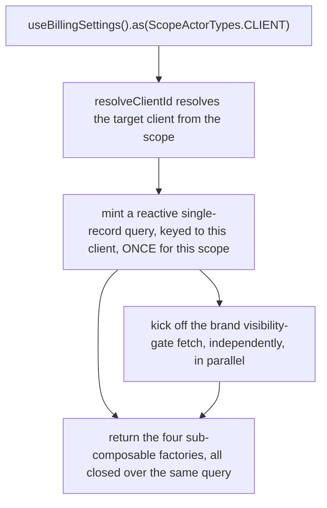
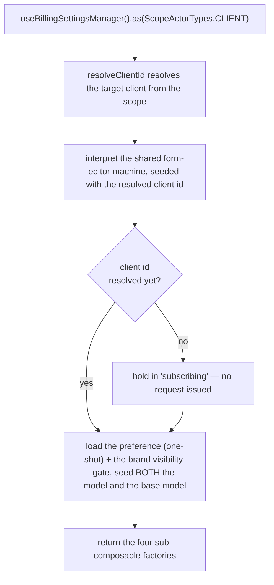
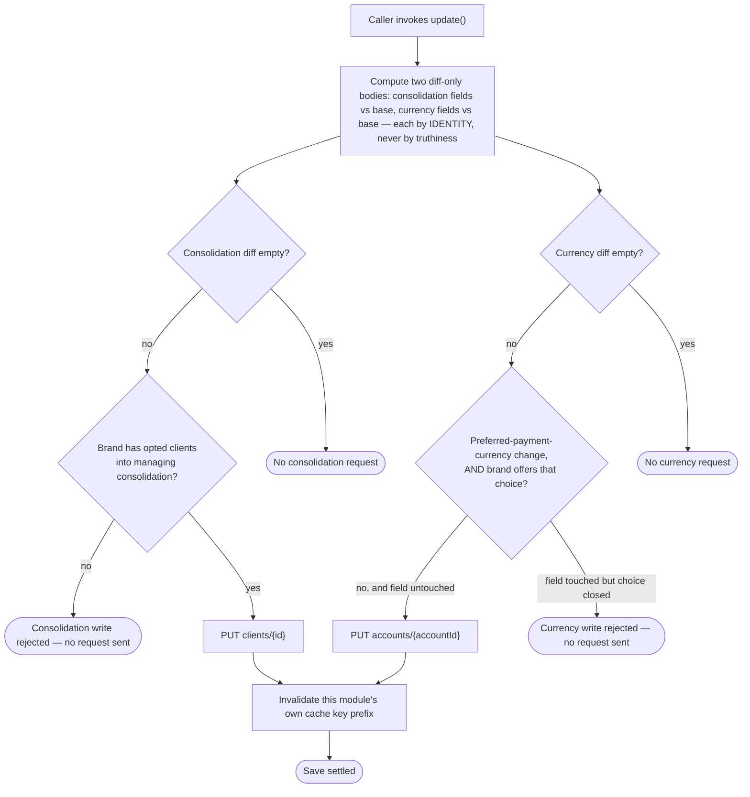
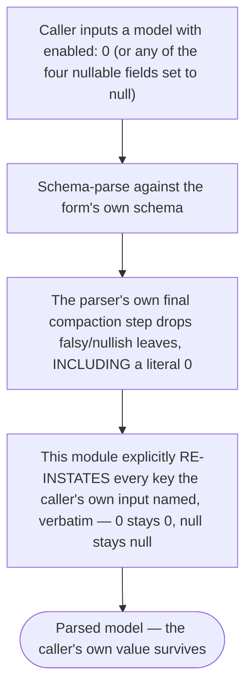

# client-billing-settings — Architecture

## Overview

The module ships **two** scoped composables over one shared services factory:

- **`useBillingSettings`** — the read view. Query-backed, no state machine. One reactive record query per resolved `(actor, context)` scope, minted at construction.
- **`useBillingSettingsManager`** — the editor. Backed by the platform's shared form-editor machine, one interpreter per resolved scope.

Both share the **same** scope matrix and context enum — a client has exactly one consolidation preference, so both composables scope on the identical entity. Only `client` resolves; `self`, `staff`, and `guest` are all `null as never` in the shared matrix, making `.as('self')`, `.as('staff')`, and `.as('guest')` compile-time errors rather than advertised-but-absent capabilities.

Because a client's preference has only one member in its context enum, `.as(ScopeActorTypes.CLIENT)` with no further argument is the _normal_ call for both halves — sharing one registry name would give the read view and the editor the identical scope key, and the registry would hand one consumer the other's instance. **This module registers the two composables under two different internal names** for exactly that reason, mirroring the sibling `client-personal-details` module's own precedent.

The single most important property of this module is that **every request resolves its target client from the scope**, never from a direct session read — one identity-resolution function, shared by both halves, branching on the resolved context rather than on which actor is calling. That single seam is what makes a read and a write always agree on the same target client.

## Data Flow

### Instantiation — the read view

The reactive read shares its cache key and its URL with two sibling modules (`client-personal-details`, `client-custom-fields`) — deliberately, so a page that mounts more than one of the three dedupes onto one request instead of three. See "The shared cache key" below.

### Instantiation — the editor

A late-resolving client id (a cold boot, where the session hasn't settled yet) tops up the already-interpreting machine through a **self-stopping** watch on the same resolved client id the rest of the module uses — never a second, independent read of the session.

### The save path — two independent diffs, each with its own gate

Guarantees the platform holds: each diff is gated and short-circuited independently — a save that only touches the account's currency fields issues no `clients/{id}` request at all, and a save touching only consolidation fields issues no `accounts/{accountId}` request. The consolidation gate reads the same brand configuration `isAvailable` reads: a missing or staff-only value refuses the write, checked after the empty-diff short-circuit so a currency-only save is unaffected by it.

Constraints the caller has to plan around: the on/off/follow field's own "off" value (`0`) is falsy; every step between the caller's input and the outbound diff has to test for "did this change" rather than "does this look like a value", or the off state silently vanishes from the request. See "The falsy-zero restoration" below.

### The falsy-zero restoration

Guarantees the platform holds: a value the caller explicitly set is never silently dropped from the model before the diff step ever sees it — the restoration re-instates the caller's own value exactly, never a placeholder.

Constraints the caller has to plan around: this restoration only re-instates what the caller's own input explicitly named; a field the caller never touched is never invented into existence.

## Sub-composables

| Sub-composable | Read view | Editor |
| --- | --- | --- |
| `useActions()` | readiness, refresh, lifecycle | input, save, revert, clear, lifecycle |
| `useContext()` | the preference, account currency fields, captured error | the full context object, model, base model, schema pair, id, title, visibility, currency options, errors |
| `useMeta()` | state flags, including visibility and payment-currency-choice | state flags, including visibility and payment-currency-choice |
| `useInternals()` | 2 — actor scope, raw query | 4 — actor scope, raw sender, raw service, raw state |

## Services

One services file serves both halves:

| Concern | Where it lives |
| --- | --- |
| Target-client resolution | one function, consumed by both the read view and the editor |
| Addressability predicate | one function; its reactive form is what `isAvailable` exposes on both composables |
| The reactive preference read | a reactive query sharing its cache key and URL with a sibling module |
| A one-shot preference read | used by the editor's own lookups; deliberately bypasses the shared reactive cache entirely — see "The shared cache key" below |
| The visibility-gate read | resolved once per scope, shared between the readiness wait and the synchronous flag reads so neither can observe a still-in-flight fetch |
| The diff-only update bodies | pure, no side effects beyond the request itself; compares each field by identity, never by truthiness — one body for the consolidation fields, a separate one for the account's currency fields |
| The machine-services adapter | takes the already-scoped services instance as an argument, so the machine inherits the same resolved client as the rest of the module |

The module owns **no machine of its own** — it builds a typed configuration payload for the shared form-editor machine, overriding its actions, guards, and invoked services. The shared machine has no dedicated "revert" event; revert is composed as an ordinary form input carrying the last-saved values back through the same validation path a normal edit takes.

## Errors

Errors are **state**, not events. Nothing in this module raises a toast or notification.

| Surface | Where a failure lands |
| --- | --- |
| Read view's own query | the query's own error → `useContext().error`, `useMeta().hasErrors` |
| Visibility-gate fetch | a dedicated recoverable flag → `useMeta().hasVisibilityError` on the read view; fails closed (hidden) on both halves regardless |
| Editor save | the machine's context error → `useContext().errors`, `useMeta().hasErrors`; the action also rejects with a detailed error |
| Editor field validation | the validation errors → `useContext().validationErrors`, `useMeta().isValid` |

## Dependencies

### This module reads from

| Module | Uses |
| --- | --- |
| Active client session | the acting client's identity when no other context is supplied; whether the session is authenticated |
| Brand configuration | the single visibility-gate key |
| The shared request layer | the reactive preference read, the one-shot lookup read, the diff-only PUT, URL building, cache invalidation |
| Localisation | translated caller-facing text on rejected reads and saves |
| The shared form-editor machine | interpreted, never redefined |

### Modules that read from this one

None yet — this is a newly introduced module. Its own scope is deliberately narrower than the wider client-billing surface the legacy application groups it with; a second, not-yet-built capability is expected to become its first consumer once it lands.

## The shared cache key

This module and `client-personal-details` both read the **identical** `clients/{id}?with=custom_fields,custom_fields.field` resource, under the **identical** cache key — deliberately, so a page mounting both dedupes onto a single request rather than issuing one each.

This is safe because the reactive read primitive this module uses applies its own field-selection **per observer**, in isolation — a second reactive observer on the same key gets its own independent projection at zero extra requests, and cannot change what the other observer sees. `client-custom-fields` reads a different endpoint entirely (`custom_fields`, scoped by access token) and does not touch this shared key.

## Module boundary

The barrel is the module's only public surface: two composables and their own type, one scope-matrix constant and its matching type, one context enum, four model types, and eight sub-composable types (four per composable). Curated named re-exports only — no `export *`.

Everything else is internal and carries a file-level internal marker: the services, the mappers, the schemas, and the machine-config file. The machine-config file is **not** a machine definition — it is a configuration payload for the platform's shared, unmodified form-editor machine.
