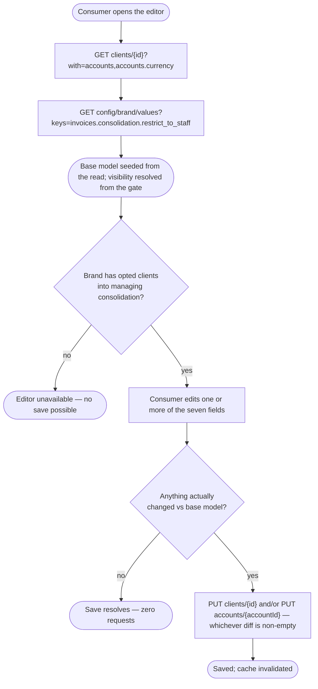
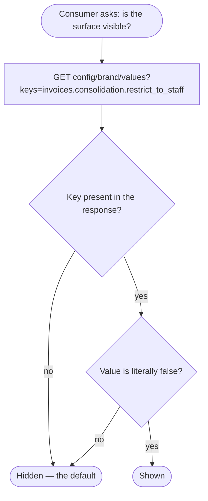

# Module: client-billing-settings

## What it is

The **client-billing-settings** module covers a client's own invoice-consolidation preference on their billing record: exposing its five persisted values, editing them through a validated form, and persisting only what actually changed. It is the entity-holding half of a larger billing-settings surface a legacy client-billing page groups together — a second, not-yet-built capability picks up the rest of that surface: resolving what a `null` field actually displays as (the brand's own default), deciding which fields are visible for a given base-rule selection, and coordinating a combined save/revert across the other billing panels the same page shows alongside this preference. This module writes the preference and reports its own persisted values; it does not resolve what an absent value means for display, and it does not coordinate with any sibling panel's own save.

One working surface sits over the preference: a **form editor**, whose model holds the client's currently saved values and which is used to change the preference and save only the difference from what was loaded. It addresses the preference by its owning client's entity id, always the caller's own — there is no capability in this module for one client to act on another client's record, and there is no capability for a party other than the client to act on it at all. A separate record kept alongside this one lists, capability by capability, the administrative surface a legacy application supports over the same preference that this module deliberately does not build.

## Core concepts

- **Consolidation preference** — the five values that decide whether, and how, a client's invoices are grouped into one consolidated bill: on/off/follow-the-brand, the cadence rule, the day the cadence runs on, and the day an invoice becomes due.
- **"Follow the brand"** — every one of the five fields has its own way of deferring to the brand's own default instead of stating an explicit value. Four of the fields defer with a literal absence (`null`); the on/off/follow field defers with its own **third value**, not with absence — see the next concept.
- **A three-way on/off/follow switch, not a two-way toggle with a null.** The field that turns consolidation on or off is never absent — it always holds one of three literal values: off, on, or "follow the brand's own default". This is deliberately different from the other four fields, where the deferring value **is** absence.
- **A literal "off" and "never set" are different values that must not collapse into each other.** The off value is representable as a plain falsy number. A processing step that treats "falsy" as "equivalent to unset" would silently turn an explicit off into no preference at all — the single highest-risk failure mode this module's own construction guards against (see Lessons).
- **The visibility gate.** A brand can choose whether to expose this whole surface to clients at all. The gate defaults to **hidden** — only an explicit, positive brand configuration reveals it. An absent or misconfigured gate value must fail toward hidden, never toward shown. The identical gate value also decides whether the editor accepts a consolidation-field save at all: a brand that has never opted clients in, or has opted staff-only, refuses the write before any request is sent.
- **Diff-only update** — the save only ever describes what changed since the form was opened (or since the last save); an unchanged field is never mentioned in the request at all, and a save with nothing dirty issues no request.
- **Account currency fields.** The editor also carries the client's own account currency and preferred payment currency, saved through a second, independent diff against a different entity (the account, not the client). A brand can separately opt clients into choosing a different payment currency at all; when that choice is closed, the preferred-payment-currency field is not offered, and any attempt to write it is refused.

## Operations

| # | Capability | Inputs | Outputs |
| --- | --- | --- | --- |
| 1 | **Read a client's own consolidation preference** | — | The five persisted values, plus the account's own currency and preferred payment currency |
| 2 | **Determine whether the preference surface should be shown at all** | — | A boolean, gated by the brand's own visibility configuration (defaults to hidden) |
| 3 | **Input a candidate model into the editor** | a partial or full model | The parsed, schema-validated model; invalid fields are reported without rejecting |
| 4 | **Save the current (or a supplied) model** | — | The persisted model; issues no request for a field group that has nothing dirty; the consolidation write is rejected locally — before any request — when the model is dirty but invalid, or when the brand has not opted clients into managing consolidation; the currency write is rejected locally when it carries a preferred-payment-currency change the brand has not opted clients into |
| 5 | **Revert to the last-saved values** | — | The model restored to its persisted baseline |
| 6 | **Clear the editor's form context** | — | The form reset to its starting state |

**Additional always-on behaviours:**

- Reporting whether the editor is addressable at all — whether a client has been resolved to act on behalf of.
- Reporting whether the preference load is in progress, errored, or has settled, and resolving once it is settled (bounded — never an unbounded wait).
- Reporting the editor's own progress: available (settled AND the brand has opted clients into managing consolidation), valid, dirty, processing, complete.
- Re-reading the preference AND re-checking the visibility gate on demand. A successful save also marks this module's own cached read stale on its own, so the next read reflects it without a separate call.

## Data shape

The preference as read:

```ts
type ConsolidationPreference = {
  id: string;
  enabled: number; // 0 = off, 1 = on, 2 = follow the brand's own default — never absent
  baseRule: string | null; // one of a fixed set of cadence rules; null = follow the brand
  dayOfWeek: string | null; // one of the seven weekday names; relevant only for a weekly cadence rule
  dateOfMonthDay: number | null; // 1-31; relevant only for a day-of-month cadence rule
  dueDateDay: number | null; // 1-28; null = earliest available due date
  neverSuspend: boolean; // the client's own suspend-exemption flag; gates the due-date-day control's own visibility
};
```

The editor's own model — every field but the on/off/follow switch is nullable, because a cleared field must be able to survive as an explicit `null` through the editor's own parsing round trip. The on/off/follow switch is deliberately never modelled nullable — see Core concepts. The two currency fields ride alongside the five consolidation fields in the SAME model, and are diffed and persisted separately, against a different entity:

```ts
type ConsolidationPreferenceModel = {
  enabled?: number; // 0 | 1 | 2 — present or absent (untouched), never null
  baseRule?: string | null;
  dayOfWeek?: string | null;
  dateOfMonthDay?: number | null;
  dueDateDay?: number | null;
  currencyId?: string; // the account's own billing currency — never null
  preferredPaymentCurrencyId?: string | null; // null clears it; absent entirely when the brand has not opted clients into a different payment currency
};
```

The update body a consolidation save produces — **not** the same shape as the read record, and **not** the same request as the currency save below. Only the fields that changed are present at all, each renamed to its own persisted key:

```ts
type ConsolidationPreferenceUpdateBody = {
  invoice_consolidation_enabled?: number; // 0 | 1 | 2
  invoice_consolidation_base_rule?: string | null;
  invoice_consolidation_base_rule_day_of_week?: string | null;
  invoice_consolidation_base_rule_date_of_month_day?: number | null;
  invoice_consolidation_due_date_day?: number | null;
};
```

The update body a currency save produces — a separate request, against the account rather than the client, with its own two keys:

```ts
type AccountCurrencyUpdateBody = {
  currency_id?: string;
  preferred_payment_currency_id?: string | null;
};
```

The fixed set of cadence-rule values: a daily cadence, a day-of-month cadence, a day-of-week cadence, the first day of the month, or the last day of the month. The seven weekday values are the standard weekday names, lower-cased.

## Dependencies

### Dependants — modules that read from this one

No other module in this codebase currently reads from this one — it is newly introduced, and the capability that groups it with the rest of a larger client-billing surface (brand-default resolution, conditional field visibility, and the combined multi-panel save) has not been built yet. That forthcoming capability is expected to become this module's first consumer.

### This module's own dependencies

- **Active client session** — supplies the acting client's id when no other client is named, and gates every read and save on being authenticated.
- **Brand configuration** — the single key that decides whether the preference surface is shown to a client at all.
- **HTTP transport layer** — bearer-token attachment, URL construction, error normalisation, response caching and invalidation.
- **Localisation** — translates caller-facing text attached to a rejected validation or a rejected save.

## API endpoints

### GET /clients/{clientId}

Role: reads a client's own record, including the five persisted consolidation values and the `never_suspend` flag.

```bash
curl "$API/clients/25d96e76-3ed0-913d-d52c-417482528340?with=accounts,accounts.currency" \
  -H "Authorization: Bearer $ACCESS_TOKEN" \
  -H "Accept: application/json"
```

The `with` parameter expands the client's accounts and each account's currency, which supply the account currency fields. The sample below is trimmed to the consolidation fields.

Sample response (`200`) — trimmed to the fields this module reads:

```json
{
  "status": "ok",
  "data": {
    "id": "25d96e76-3ed0-913d-d52c-417482528340",
    "never_suspend": false,
    "invoice_consolidation_enabled": 1,
    "invoice_consolidation_base_rule": null,
    "invoice_consolidation_base_rule_day_of_week": null,
    "invoice_consolidation_base_rule_date_of_month_day": null,
    "invoice_consolidation_due_date_day": null
  },
  "total": 1,
  "error": null,
  "messages": [],
  "meta": null
}
```

Fixture: `__tests__/fixtures/get-clients-id.json`.

### GET /config/brand/values?keys=invoices.consolidation.restrict_to_staff

Role: reads the single brand-configuration key that decides whether the preference surface is shown to a client at all.

```bash
curl "$API/config/brand/values?keys=invoices.consolidation.restrict_to_staff" \
  -H "Authorization: Bearer $ACCESS_TOKEN" \
  -H "Accept: application/json"
```

Sample response (`200`) — the surface-revealing case:

```json
{
  "status": "ok",
  "data": {
    "invoices.consolidation.restrict_to_staff": false
  },
  "total": null,
  "error": null,
  "messages": [],
  "meta": null
}
```

The key can also be **absent from `data` entirely**, or present as a literal `true` — both of those, like the `false` case shown, are real, observed states; see Core concepts and Failure modes for what each one means for visibility.

Fixture: `__tests__/fixtures/get-config-brand-values-keys-invoices-consolidation-restrict-to-staff.json`.

### PUT /clients/{clientId}

Role: persists a diff-only update against the client's own record. Only the fields that changed since the base model are present; an update with nothing dirty is never issued at all.

Request body: see `ConsolidationPreferenceUpdateBody` above. Every key is optional and independent — none is required by the shape itself, only by what actually changed. A field is sent whenever it differs from the last-loaded value by identity comparison, never by whether the new value "looks empty" — see Lessons for why that distinction matters for the off value specifically.

**Turn consolidation off — a literal `0`, not an omission:**

```bash
curl -X PUT "$API/clients/25d96e76-3ed0-913d-d52c-417482528340" \
  -H "Authorization: Bearer $ACCESS_TOKEN" \
  -H "Content-Type: application/json" \
  -d '{ "invoice_consolidation_enabled": 0 }'
```

**Set two fields in one save:**

```bash
curl -X PUT "$API/clients/25d96e76-3ed0-913d-d52c-417482528340" \
  -H "Authorization: Bearer $ACCESS_TOKEN" \
  -H "Content-Type: application/json" \
  -d '{ "invoice_consolidation_enabled": 1, "invoice_consolidation_base_rule": "daily" }'
```

**Clear a field back to "follow the brand":**

```bash
curl -X PUT "$API/clients/25d96e76-3ed0-913d-d52c-417482528340" \
  -H "Authorization: Bearer $ACCESS_TOKEN" \
  -H "Content-Type: application/json" \
  -d '{ "invoice_consolidation_base_rule": null }'
```

Sample response (`200`) — the full updated client record, in the same shape the read endpoint returns.

Fixtures: `put-clients-id-case-enabled-off.json` (off, `0`), `put-clients-id-case-enabled-on.json` (on, `1`), `put-clients-id-case-enabled-inherit.json` (follow the brand, `2`), `put-clients-id-case-base-rule-set.json` / `-clear.json`, `put-clients-id-case-day-of-week-set.json` / `-clear.json`, `put-clients-id-case-day-of-month-set.json` / `-clear.json`, `put-clients-id-case-due-date-day-set.json` / `-clear.json`, `put-clients-id-case-diff-only.json` (two fields in one save), `put-clients-id-case-restore.json` (multiple fields restored to "follow the brand" together).

### PUT /accounts/{accountId}

Role: persists a diff-only update against the account's own record — the two currency fields, entirely separate from the client record the consolidation fields live on. Only the fields that changed since the base model are present; an update with nothing dirty is never issued at all.

Request body: see `AccountCurrencyUpdateBody` above.

**Set the account's own billing currency:**

```bash
curl -X PUT "$API/accounts/d0367942-4d0e-7109-92eb-3153698d582e" \
  -H "Authorization: Bearer $ACCESS_TOKEN" \
  -H "Content-Type: application/json" \
  -d '{ "currency_id": "825d96e7-63ed-0913-5dc4-174825283406" }'
```

Sample response (`200`) — the full updated account record; only the two currency keys are relevant to this module:

```json
{
  "status": "ok",
  "data": {
    "id": "d0367942-4d0e-7109-92eb-3153698d582e",
    "currency_id": "825d96e7-63ed-0913-5dc4-174825283406",
    "preferred_payment_currency_id": null
  },
  "total": null,
  "error": null,
  "messages": [],
  "meta": null
}
```

**Setting `preferred_payment_currency_id` while the brand has not opted clients into a different payment currency is refused locally, before any request** — this module's own gate. The platform's own endpoint holds a related, independent constraint: a captured `409` response (`Payments in different than the document (invoice) currencies are disabled!`) shows the server itself can also refuse the same field.

Fixtures: `put-accounts-id-case-currency-set.json` (billing currency only), `put-accounts-id-case-preferred-set.json` / `-clear.json`, `put-accounts-id-case-both.json` (both fields — captured `409`), `put-accounts-id-case-restore.json`.

## Failure modes

### A consolidation save is refused before any request when the brand has not opted clients in

A save attempted against the consolidation fields while the brand's own configuration is absent or staff-only is refused locally, with a dedicated error, before anything is sent to the network. This gate does not affect the account-currency write, which has its own, separate gate for the preferred-payment-currency field only.

### An empty diff issues no request — the caller's own responsibility to check

A save invoked with nothing changed since the base model resolves successfully without ever reaching the network. This is not a soft failure from the platform's side — it is a local short-circuit, so there is no request to observe or mock against for this case.

### A locally-invalid model is rejected before any request

An invalid model — for example, a day-of-month value outside 1–31 — is rejected with a field-level validation error before anything is sent.

### Soft failures

No soft-failure path (a `2xx` response that silently declines part of the update) has been observed on this endpoint's own contract — the mutation either returns the full updated record or rejects with a `4xx`/`5xx`. The historical risk in this domain was not a platform soft failure but a **client-side** one: a diff computed by a value-emptiness test, rather than by comparing against the last-loaded value, can treat an explicit "off" the same as "nothing here" and silently drop it from the outbound update — see Lessons.

### Not captured

The rejection shape for a save whose diff is invalid against the schema, or for a consolidation save while the brand has not opted clients in, has not needed a live capture — this module's own checks stop both cases locally before any request is issued.

## Flows

### Read, edit, and save a preference

One-line purpose: the end-to-end shape a consumer plans around.



Guarantees the platform holds: a value the caller explicitly set to an off/false-shaped value is never treated the same as a field the caller never touched — the outbound diff is decided by identity comparison against the last-loaded value, never by whether the new value looks empty.

Constraints the caller has to plan around: a consolidation save attempted while the brand has not opted clients into managing it is refused before any request is sent, regardless of whether the model itself is valid; a currency save carrying a preferred-payment-currency change is refused the same way when that choice is closed.

### Resolving whether the surface should be shown at all

One-line purpose: the visibility gate is a separate read from the preference itself, and the two must not be conflated.



Guarantees the platform holds: an absent key, a `true` value, and a failed fetch of this key all resolve to the same outcome — hidden. Only an explicit, literal `false` ever reveals the surface.

Constraints the caller has to plan around: this is a separate read from the preference's own five values — a consumer that reads the preference successfully has learned nothing yet about whether it should be shown.

## Lessons (hard-won)

- **An explicit "off" and "never set" can be the same falsy value, and a pipeline that tests for emptiness rather than for "did this change" will silently confuse them.** The off state of the on/off/follow switch is representable as a plain falsy number. A parsing or diffing step that drops "empty-looking" values before comparing against the last-loaded value will silently strip an explicit "off" from the outbound update — the request still succeeds, still returns `200`, and changes nothing. The only reliable diff test is identity comparison against the last-loaded value, never a value's own truthiness.
- **A brand-level visibility default that must fail toward "hidden" needs its absence preserved as absence, all the way through — collapsing an unknown value to a literal `false` early is indistinguishable, downstream, from an explicit opt-in.** A gate that defaults to hidden is only safe if "the brand hasn't set this" and "the brand explicitly showed it" stay two different values as they travel through the system. A step that turns "not set" into a concrete `false` partway through — even meaning "not restricted" — makes a later check that tests for `false` unable to tell an unset gate from an explicit opt-in, and the surface leaks open for every client whose brand simply never touched this setting.
- **Reading the same underlying record through two different access patterns can silently corrupt a cache one of them doesn't even know it shares.** A request-caching layer that stores whichever access pattern's own field-selection happened to win the race to populate a shared cache entry means a narrow, one-off read of a shared resource can leave every subsequent reader of the FULL resource looking at that narrow shape instead, for as long as the entry stays fresh. Each surface that reads this client record with its own field expansion therefore needs its own cache entry; sharing one is only safe when every reader applies its field selection per observer.
- **Multiple independent editing surfaces can safely coexist on the same record only if each one sends a diff scoped to the fields it itself owns.** A record that several distinct forms can each edit stays safe from one form clobbering another's just-changed field only as long as every form's own save describes just the fields it changed, never the record as a whole. A save that instead always sends the whole record — even fields it never touched — will silently overwrite whatever another form saved moments earlier, with no error from either side.
- **A save attempted while a dependent async fetch is still in flight can read a value that looks resolved but isn't.** A visibility gate resolved by its own asynchronous fetch, run in parallel with the rest of the editor's own setup, can be read by a consumer before that fetch has actually settled if nothing forces the two to synchronise — the read returns whatever the gate's placeholder value happens to be, not an error, so nothing signals that the answer is provisional.
