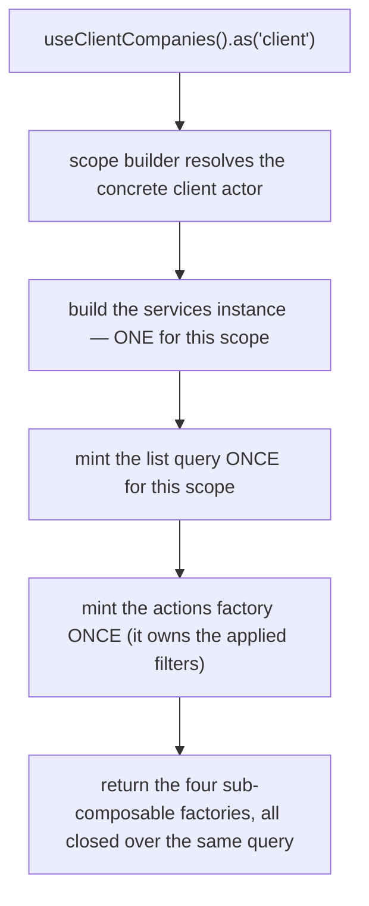
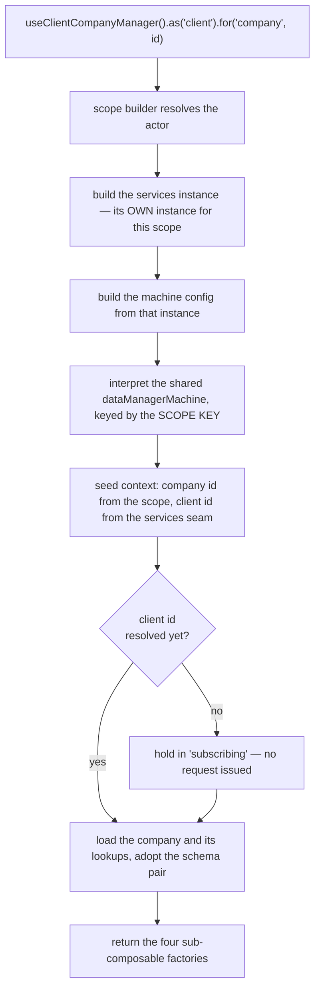
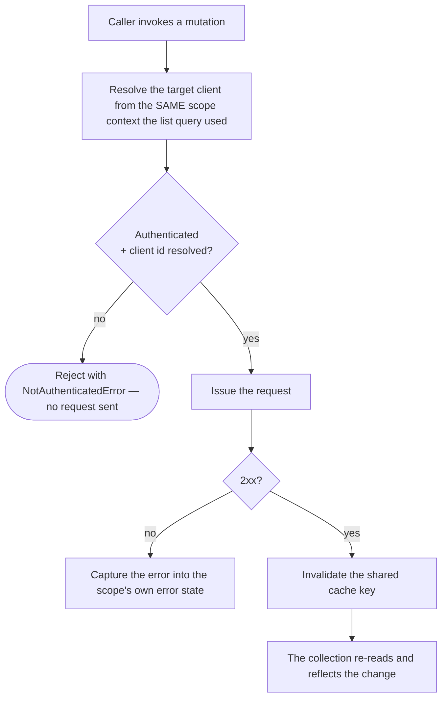
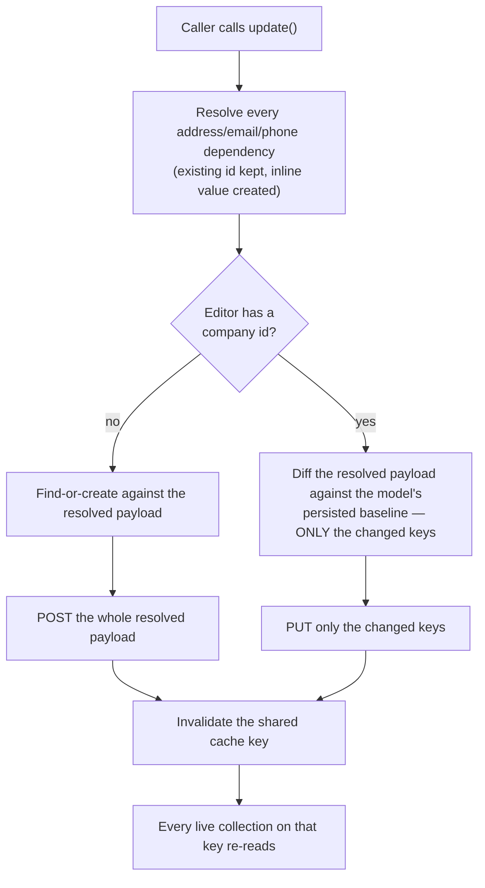

# client-company — Architecture

## Overview

The module ships **two** scoped composables over one shared data layer:

- **`useClientCompanies`** — the collection. Query-backed, no state machine.
  One list query is minted per resolved `(actor, context)` scope, at
  construction, so it survives component lifecycles.
- **`useClientCompanyManager`** — the per-company editor. Backed by the shared
  `dataManagerMachine`, one interpreter per resolved `(actor, company)` scope.

Both are registered under the same module name; the composable name and the
scope key carry the differentiation. Both build their own services instance
from **one factory**, so the two halves share one identity seam, one cache key
and one set of request gates.

The single most important property of this module is that **every request URL
derives from the resolved scope**, never from a direct session read. One
function in the services layer is the only place a target client is decided,
and every request-issuing function — list, read-one, create, update,
find-or-create, delete, set-default — goes through it. The manager seeds its
machine context from that same function's reactive result rather than reading
the session itself.

Only one actor meaningfully resolves anywhere in this module today: the
client acting on their own companies. A staff member acting for a named
client — a capability the wider platform genuinely supports elsewhere — is
not something this module carries: neither scope matrix defines a context for
`staff` (or `self`, or `guest`), so there is no way to _name_ a target for any
of them — `.for(...)` after any actor but `client` fails to compile. See
[gotchas.md](./gotchas.md) §1 for the precise boundary of what that does and
does not block.

## Data Flow

### Instantiation — the collection

`useContext()`, `useMeta()` and `useInternals()` are lazy — they build on
call. `useActions()` is **not**: it is minted once per scope, because the
applied `filters` live inside it. A factory minted per call would give every
handle its own filter state.

### Instantiation — the editor

The interpreter is keyed by the **scope key**, not the company id. `.fresh()`
mints a unique key per call, so two concurrent drafts get two independent
editors instead of colliding on one shared "new company" identity.

Like the collection, the editor's `useActions()` is minted once per scope —
`input` is debounced, and a debouncer minted per call would give two
keystrokes two independent timers and leave `update`'s pre-save flush with
nothing to flush.

### Mutation flow

The guard is the **same predicate** the collection's `isAvailable` flag
exposes — one function, read by meta, by the actions layer and by every
request gate. A consumer cannot render "available" while the wire refuses the
call, or vice versa.

### Creating or editing through the editor

A create has no prior baseline to diff against, so it always sends the whole
resolved payload; an edit sends exactly the keys that changed relative to the
model's persisted baseline — a change to one field does not resend the other
five.

### How a save in the editor reaches the collection

Both halves resolve the same base cache key. The editor never reaches into the
collection's query instance — that instance belongs to a different scope key
and may not exist in the consumer at all. Instead a settled save invalidates
the shared key through the editor's own services instance, and any live
collection re-reads.

## Sub-composables

| Sub-composable   | Collection                                                                                                          | Editor                                                                                              |
| ---------------- | ------------------------------------------------------------------------------------------------------------------- | --------------------------------------------------------------------------------------------------- |
| `useActions()`   | 12 members — row mutations, criteria writes (`filterBy`/`sortBy`/`setCriteria`), list controls, lifecycle           | 7 members — form input, save, lifecycle                                                             |
| `useContext()`   | 8 members — reactive list, the active query criteria, the query schema family, lookups, captured error              | 16 members — model, schema pair, look-ups (addresses/emails/phones/countries/regions), display text |
| `useMeta()`      | 8 flags — `hasError`, `hasNextPage`, `hasPages`, `hasPrevPage`, `isAvailable`, `isEmpty`, `isFiltered`, `isLoading` | 8 flat flags — availability, loading, dirty, valid, new, processing, complete, errors               |
| `useInternals()` | 2 — actor scope, raw query                                                                                          | 4 — actor scope, raw sender, raw service, raw state                                                 |

Both halves return the identical four-layer shape; only the contents differ,
because one is query-backed and the other machine-backed.

## Services

One services file serves both halves. There are no per-actor service branches
today — every request-issuing function has only the one path, because only
one actor resolves in this module's scope.

| Concern                   | Where it lives                                                                                                    |
| ------------------------- | ----------------------------------------------------------------------------------------------------------------- |
| Target-client resolution  | one function, consumed by every request-issuing function                                                          |
| Addressability predicate  | one function; its reactive form is what `isAvailable` exposes                                                     |
| Cache key                 | one base key, shared by both halves                                                                               |
| Wire ↔ view-model mapping | pure mappers, no actor awareness                                                                                  |
| Dependency resolution     | one function that resolves an address/email/phone by id, or creates it from an inline value, for either save path |
| Payload diffing           | one function that diffs the resolved model against its persisted baseline for an edit, never for a create         |
| Machine services adapter  | takes the already-scoped services instance as an argument, so the machine inherits the same resolved client       |

The module owns **no machine of its own** — it builds a typed configuration
payload for the shared `dataManagerMachine`, whose actions, guards and invoked
services it overrides. One guard override is load-bearing: the editor is held
out of its loading state until a client id exists, which is what stops it
firing an unaddressed request on a cold boot.

## Errors

Errors are **state**, not events. Nothing in this module raises a toast or
notification.

| Surface                 | Where a failure lands                                                                                                                    |
| ----------------------- | ---------------------------------------------------------------------------------------------------------------------------------------- |
| Collection row mutation | the services instance's captured error → `useContext().error`, `useMeta().hasError`                                                      |
| Collection list read    | the query's own error → the same two members                                                                                             |
| Editor save             | the machine's context error → `useContext().errors`, `useMeta().hasErrors`; the action also rejects with a detailed error for the caller |
| Editor field validation | the validation errors → `useContext().validationErrors`, `useMeta().isValid`                                                             |

A consumer that wants user-visible feedback renders it from those members, or
from the editor's `onDone()` completion signal. The legacy application raised
its own toasts on delete and on set-default; this module does not, and any
consumer that wants that feedback back has to render it from the state above
itself.

## Dependencies

### This module reads from

| Module                | Uses                                                                                                                                                              |
| --------------------- | ----------------------------------------------------------------------------------------------------------------------------------------------------------------- |
| `session-store`       | the active client identity (the addressed client when no other context is supplied), whether the session is authenticated, and whether it has settled             |
| `query`               | the shared request layer — list reads with pagination/filtering, single mutations, URL building, cache invalidation                                               |
| `data-manager`        | the shared form-editor machine the per-company editor interprets                                                                                                  |
| `scope`               | the actor-scoping accessor and its instance registry                                                                                                              |
| `brand`               | brand configuration — whether tax-number validation is switched on, and whether an address requires a region                                                      |
| `client-address`      | the client's own address list and per-address editor, for the form's address control and for resolving an inline address                                          |
| `client-email`        | the client's own email list, `.as('self')`, for the form's email control, for resolving an inline email, and for the collection's `ensure` seam within the module |
| `client-phone`        | the client's own phone list and per-phone editor, for the form's phone control and for resolving an inline phone                                                  |
| `system`              | country and region reference data, for the inline address block's cascade                                                                                         |
| `system-localisation` | translated caller-facing text on rejected reads and saves                                                                                                         |
| shared utilities      | schema validation, model parsing, collection lookups, state-read helpers, and the typed unauthenticated-access error                                              |

### Modules that read from this one

| Module                       | Uses                                                                                                                         |
| ---------------------------- | ---------------------------------------------------------------------------------------------------------------------------- |
| checkout billing composition | the client's default company, the full list, the readiness signal, and find-or-create by id while composing a billing entity |
| parent-form composition      | the two pure schema-fragment functions, to embed the company form's fields inside a larger schema                            |

Both consume the collection through `.as('client')`, or the pure schema
fragments directly. Neither re-implements the list read, the dependency
resolution, or the partial-update diff.

## Integration Points

- **Checkout billing composition** opens the collection to reuse or create a
  company as part of assembling a billing entity, including creating a
  brand-new linked address inline.
- **Parent-form composition** composes the company's fields into a larger
  schema through the two pure fragment functions, with a different base model
  and a reduced field set than the editor's own form uses.
- Any consumer rendering the companies directly — list, delete, default,
  search — drives the collection; any consumer rendering a create/edit **form**
  drives the editor, which serves its own schema pair. Both surfaces are
  documented in [usage.md](./usage.md).

## Module boundary

The barrel is the module's only public surface: two composables, two scope
matrices, two context enums, the model types, and — deliberately — the two
schema-fragment functions described above. Curated named re-exports only — no
`export *`.

Everything else is internal and carries a file-level internal marker: the
services layer and the mappers. The services layer in particular is not
exported at all — every function in it resolves a client and issues a request,
so exposing it directly would be a second, unscoped route to the module's
data, bypassing the very scope resolution that makes the identity seam mean
anything. A cross-module consumer that used to reach the services layer
directly now goes through the collection's own `ensure` action instead, which
resolves through the same scope the rest of the module does.
