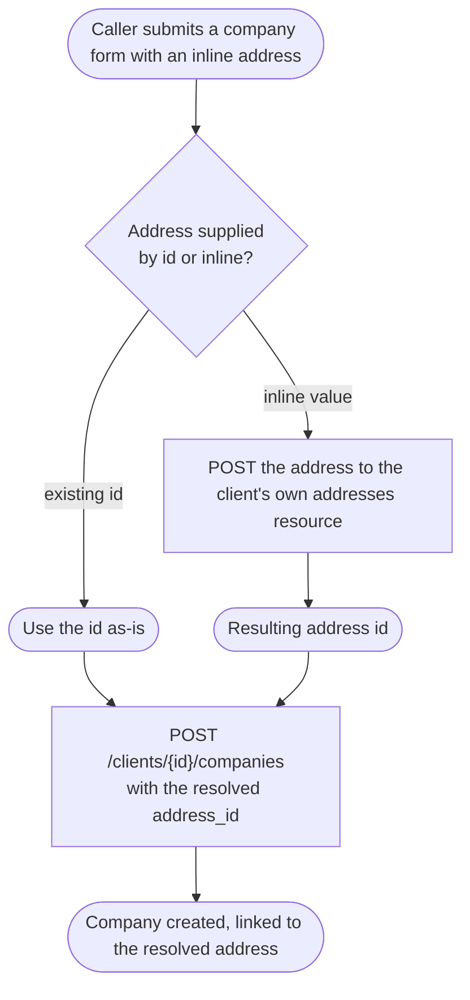
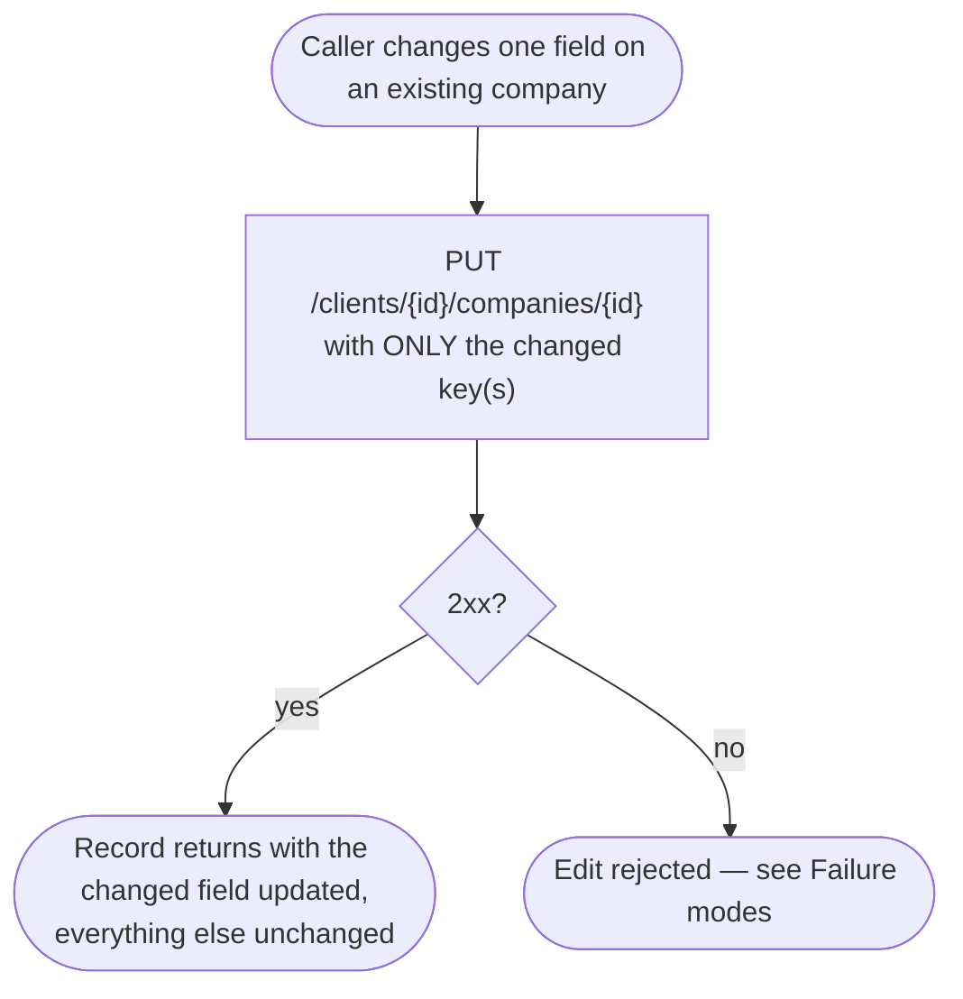
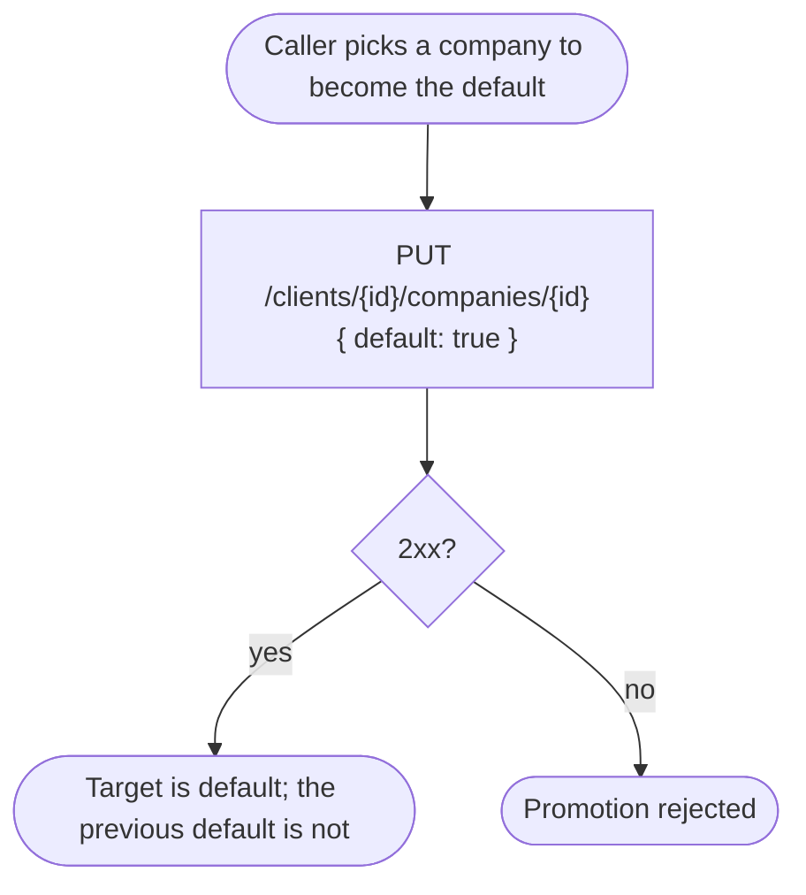

# Module: client-company

## What it is

The **client-company** module covers the _companies_ on a single client account —
the billable business entities a client uses for invoicing and checkout billing.
Each one carries a name, a registration number, a tax/VAT number, and a linked
address, email and phone. A client can read the list, read one company, create
one, edit one, delete one, and mark one as the default billing entity.

Two working surfaces sit over the same data: a **collection**, read and acted on
row by row, and a **single-company editor** used to create or change one company
through a validated form with a country → regions cascade and dependency
look-ups (the client's own addresses, emails and phones). Both address the same
client and share one cached read, so a save made through the editor is reflected
the next time the collection is read.

Every operation acts on one client's own collection — the addressed client is
fixed when the collection or the editor is opened, and no operation reaches
across accounts. Triggering VAT/tax-number validation and any capability
belonging to a party other than the client themselves are **not** part of this
collection; see [gotchas.md](./gotchas.md).

## Core concepts

- **Company record** — one entry in a client's collection: name, registration
  number, tax/VAT details, a linked address/email/phone, and status flags for
  default, verification and deletability.
- **Default company** — the single record flagged as the client's default
  billing entity. Promoting a different record un-defaults the previous one.
  Only a dedicated "set default" call can change this flag — a form save can
  never set or unset it.
- **Tax validation state** — whether a company's VAT/tax number has been
  checked, and by what service, is a per-record read. _Triggering_ a check is
  not part of this collection (see gotchas).
- **Dependency ensuring** — resolving a candidate address, email or phone
  supplied inline on the form to an existing record, or creating one when no
  match exists, as a single step, so the company form can offer "type a new
  one" alongside "pick an existing one".
- **Country/region cascade** — the form's inline address block re-offers a
  country's regions when the country changes, and clears a region that no
  longer applies to the new country.

## Operations

| #   | Capability                                  | Inputs                                                     | Outputs                                                                     |
| --- | ------------------------------------------- | ---------------------------------------------------------- | --------------------------------------------------------------------------- |
| 1   | **List one client's companies**             | optional page size + offset, optional search term          | Array of company records, each with display and status fields, plus a total |
| 2   | **Read one company by id**                  | company id                                                 | The single company record                                                   |
| 3   | **Create a company**                        | name, registration number, tax number, address/email/phone | The created company record                                                  |
| 4   | **Edit a company**                          | company id, changed fields only                            | The updated record                                                          |
| 5   | **Delete a company**                        | company id                                                 | Confirmation; the record is gone from the collection                        |
| 6   | **Set a company as the default**            | company id                                                 | The updated record; the previously default record is no longer default      |
| 7   | **Find or create a company**                | a candidate company (matched by id)                        | The matching existing record, or a newly created one                        |
| 8   | **Resolve a company's address/email/phone** | an existing id, or an inline value to create               | The resolved id, substituted into the company payload                       |
| 9   | **Filter the collection**                   | a search term                                              | The list narrowed to matching companies                                     |
| 10  | **Page through the collection**             | page size, page direction                                  | The next or previous page of the list                                       |

**Additional always-on behaviours:**

- Reporting whether the collection is addressable at all — that is, whether a
  client has been resolved to read on behalf of.
- Reporting whether the list is loading, empty or errored, and signalling when
  it is ready to read.
- Re-reading the collection from the server on demand.
- Marking the cached collection stale so the next read re-fetches it.
- Reporting the form editor's own progress: ready, changed, valid, saving,
  finished, and whether the company being edited is new.
- Re-resolving a country's regions when the inline address's country changes.

## Data shape

The record returned for each company:

```ts
type CompanyRecord = {
  id: string;
  import_id: string | null;
  staged_import: boolean;
  external_id: string | null;
  client_id: string;
  user_id: string; // the platform user who created the record; "sys" for system-created
  address_id: string | null;
  phone_id: string | null;
  email_id: string | null;
  default: boolean; // this company is the client's default billing entity
  verified: number | boolean; // wire returns 0/1; observed as JSON boolean in some captures
  name: string;
  vat_number: string | null;
  vat_validated: boolean | null;
  vat_validation_failed_reason: string | null;
  vat_validated_with: string | null;
  vat_validation_checked_at: string | null; // "YYYY-MM-DD HH:mm:ss", space-separated
  reg_number: string | null;
  vat_percent: number | null;
  can_delete: boolean;
  created_at: string; // "YYYY-MM-DD HH:mm:ss"
  updated_at: string;
  deleted_at: string | null;
  // Present when the list/single-read request asked for them via `with=`
  address?: AddressRecord;
  email?: EmailRecord;
  phone?: PhoneRecord;
};
```

> `verified` is captured as the numeric `1` on list/single reads and is treated
> as truthy by the consuming mapper (`!!raw.verified`). Do not assume it is a
> JSON boolean on the wire.

The `address`, `email` and `phone` nested objects, when requested, are each
that sibling resource's own full record shape (address country/region nested
one level further when the request also asks for `address.country` /
`address.region`).

Every response is wrapped in the same envelope every other client resource
under this platform uses:

```ts
type Envelope<T> = {
  status: "ok" | "error";
  data: T | null;
  related: unknown | null;
  total: number | null; // populated on list reads; matches the x-total-count header
  error: {
    id: string;
    type: number;
    code: number; // mirrors the HTTP status
    message: string;
    data: unknown[] | Record<string, string[]>; // a keyed map of field errors on a 422
  } | null;
  messages: string[] | null;
  meta: null;
};
```

Request bodies (inputs to the mutation capabilities):

```ts
// Create (capability 3) — every field the caller has, sent whole
type CreateCompanyBody = {
  name: string;
  reg_number: string;
  vat_number: string;
  address_id: string;
  phone_id?: string;
  email_id?: string;
};

// Edit (capability 4) — ONLY the keys that actually changed. Any subset of:
type EditCompanyBody = Partial<{
  name: string;
  reg_number: string;
  vat_number: string;
  address_id: string;
  phone_id: string;
  email_id: string;
}>;
// `default` is never sent through this body — see capability 6.

// Set as default (capability 6)
type SetDefaultBody = { default: true };
```

## Dependencies

### Dependants — collections that read from this one

| Consumer                                | Weight | Reads                                                                                   | Why                                                                         |
| --------------------------------------- | ------ | --------------------------------------------------------------------------------------- | --------------------------------------------------------------------------- |
| Checkout billing-detail composition     | 3      | the client's default company, the full list, find-or-create by id, the readiness signal | reconciling a billing entity during checkout, including creating one inline |
| Company-form composition (parent forms) | 2      | the company field/layout definitions as a schema fragment                               | embedding the company form inside a larger checkout or profile form         |

The HTTP transport layer and app-level navigation reference this collection as
they do most others; they are not domain consumers and are excluded from the
table.

### This collection's own dependencies

- **Active client session** — supplies the acting client's id when no other
  client is named, and gates every read and mutation on being authenticated.
- **HTTP transport layer** — bearer-token attachment, URL construction, error
  normalisation, response caching and invalidation.
- **Brand configuration** — whether tax-number validation is switched on for
  the brand, and whether a region is required on an address, both fetched
  before they are read.
- **The client's own addresses, emails and phones** — read (and, for an inline
  value, created) while filling in the form.
- **Country / region reference data** — for the inline address block's
  country → regions cascade.
- **Localisation** — translates the caller-facing text attached to a rejected
  read or save.

## API endpoints

### GET /clients/{clientId}/companies

Role: lists one client's companies. Called whenever the collection is opened or
re-read. Accepts `limit` and `offset` for paging, `with` to request nested
sibling records, `with_staged_imports` to include companies mid-import, and
`order` for sort direction on a field (`created_at` ascending / `-created_at`
descending observed).

```bash
curl "$API/clients/25d96e76-3ed0-913d-d52c-417482528340/companies?with=address,address.country,address.region&with_staged_imports=1&order=created_at" \
  -H "Authorization: Bearer $ACCESS_TOKEN" \
  -H "Accept: application/json"
```

Sample response (`200`, trimmed to one row):

```json
{
  "status": "ok",
  "data": [
    {
      "id": "2785d26e-9678-3d16-737f-314502e70439",
      "import_id": null,
      "staged_import": false,
      "external_id": null,
      "address_id": "20e43579-5e78-d184-78db-31643202d986",
      "phone_id": "25d96e76-3ed0-913d-357a-417482528340",
      "default": false,
      "verified": 1,
      "created_at": "2025-07-01 10:19:26",
      "updated_at": "2026-05-14 10:08:54",
      "deleted_at": null,
      "name": "Hegmann, Jacobson and Runte",
      "vat_number": "",
      "vat_validated": null,
      "vat_validation_failed_reason": null,
      "vat_validated_with": null,
      "vat_validation_checked_at": null,
      "reg_number": "",
      "vat_percent": null,
      "client_id": "25d96e76-3ed0-913d-d52c-417482528340",
      "email_id": "20e43579-5e78-d184-430c-31643202d986",
      "user_id": "sys",
      "can_delete": false,
      "address": {
        "id": "20e43579-5e78-d184-78db-31643202d986",
        "address_1": "197 Highfield Road",
        "city": "London",
        "postcode": "SW1A 2AB",
        "country": {
          "id": "825d96e7-63ed-0913-46c4-174825283406",
          "name": "Iceland",
          "code": "IS"
        },
        "region": {
          "id": "8d632507-9806-5d1e-82ec-8174e234e98d",
          "name": "Vesturland"
        }
      },
      "email": {
        "id": "20e43579-5e78-d184-430c-31643202d986",
        "email": "mock-email-1@example.com",
        "verified": true,
        "default": true
      },
      "phone": {
        "id": "25d96e76-3ed0-913d-357a-417482528340",
        "phone": "7111111111",
        "phone_code": "+44"
      }
    }
  ],
  "related": null,
  "total": 79,
  "error": null,
  "messages": [],
  "meta": null
}
```

The response also carries an `x-total-count` header matching the envelope's
`total`.

Fixture: `__tests__/fixtures/get-clients-id-companies-with-staged-imports-1.json`

**Paged variant** — `?limit=2&offset=0&order=created_at` returns the first two
records with `total: 79` and `x-total-count: 79`; a second request with
`offset=2` returns the next two.

Fixtures: `__tests__/fixtures/get-clients-id-companies-case-page-1.json`,
`-page-2.json`

**Order variant** — `order=created_at` returns oldest-first; `order=-created_at`
returns newest-first. The platform sorts server-side on request; it does not
sort by default with no `order` supplied.

Fixture: `__tests__/fixtures/get-clients-id-companies-case-order-check.json`

### GET /clients/{clientId}/companies/{companyId}

Role: reads a single company by id. Called when one company is opened for
editing and no matching row is already held.

```bash
curl "$API/clients/25d96e76-3ed0-913d-d52c-417482528340/companies/3de78642-de53-9714-663f-21208469530d?with=address,address.country,address.region" \
  -H "Authorization: Bearer $ACCESS_TOKEN" \
  -H "Accept: application/json"
```

Sample response (`200`):

```json
{
  "status": "ok",
  "data": {
    "id": "3de78642-de53-9714-663f-21208469530d",
    "address_id": "d6325079-8065-d1e3-dd8b-8174e234e98d",
    "phone_id": "25d96e76-3ed0-913d-357a-417482528340",
    "default": false,
    "verified": 1,
    "created_at": "2026-01-05 11:18:52",
    "updated_at": "2026-01-05 11:18:52",
    "deleted_at": null,
    "name": "Acme Corp",
    "vat_number": "12345678",
    "vat_validated": null,
    "vat_validation_failed_reason": null,
    "vat_validated_with": null,
    "vat_validation_checked_at": null,
    "reg_number": "12345678",
    "vat_percent": null,
    "client_id": "25d96e76-3ed0-913d-d52c-417482528340",
    "email_id": "20e43579-5e78-d184-430c-31643202d986",
    "user_id": "sys",
    "can_delete": true,
    "address": {
      "id": "d6325079-8065-d1e3-dd8b-8174e234e98d",
      "city": "Guildford",
      "postcode": "GU4 8PH"
    },
    "email": {
      "id": "20e43579-5e78-d184-430c-31643202d986",
      "email": "mock-email-1@example.com"
    },
    "phone": {
      "id": "25d96e76-3ed0-913d-357a-417482528340",
      "phone": "7111111111"
    }
  },
  "related": null,
  "total": null,
  "error": null,
  "messages": [],
  "meta": null
}
```

Fixture: `__tests__/fixtures/get-clients-id-companies-id.json`

### POST /clients/{clientId}/companies

Role: creates a new company. The whole resolved form is sent — a create has no
prior state to diff against.

```bash
curl -X POST "$API/clients/25d96e76-3ed0-913d-d52c-417482528340/companies" \
  -H "Authorization: Bearer $ACCESS_TOKEN" \
  -H "Content-Type: application/json" \
  -d '{ "name": "Acme Ltd", "reg_number": "REG-1", "vat_number": "", "address_id": "20e43579-5e78-d184-78db-31643202d986" }'
```

The two optional fields (`phone_id`, `email_id`) follow the same shape when
supplied — `-d '{ ..., "phone_id": "<id>", "email_id": "<id>" }'` — omitted
here because this particular capture did not supply either.

Sample response (`200`) — note that a field left unset on the request
(`phone_id`, `email_id` here) comes back `null` rather than being omitted:

```json
{
  "status": "ok",
  "data": {
    "id": "4d036794-24d0-e710-639b-3153698d582e",
    "address_id": "20e43579-5e78-d184-78db-31643202d986",
    "phone_id": null,
    "email_id": null,
    "default": false,
    "verified": 1,
    "created_at": "2026-08-08 10:36:31",
    "updated_at": "2026-08-08 10:36:31",
    "deleted_at": null,
    "name": "Acme Ltd",
    "vat_number": "",
    "reg_number": "REG-1",
    "can_delete": true,
    "address": {
      "id": "20e43579-5e78-d184-78db-31643202d986",
      "city": "London"
    },
    "email": null,
    "phone": null
  },
  "related": null,
  "total": null,
  "error": null,
  "messages": [],
  "meta": null
}
```

Fixture: `__tests__/fixtures/post-clients-id-companies.json` (captures the
request body as well as the response)

### PUT /clients/{clientId}/companies/{companyId}

Role: this one endpoint serves two distinct intents, discriminated by the
request body.

**Editing fields** — the body carries only the keys the caller actually
changed. A one-field edit is a valid, complete request:

```bash
curl -X PUT "$API/clients/25d96e76-3ed0-913d-d52c-417482528340/companies/4d036794-24d0-e710-639b-3153698d582e" \
  -H "Authorization: Bearer $ACCESS_TOKEN" \
  -H "Content-Type: application/json" \
  -d '{ "name": "Acme Ltd (edited)" }'
```

Sample response (`200`) — the full record, with only the edited field changed:

```json
{
  "status": "ok",
  "data": {
    "id": "4d036794-24d0-e710-639b-3153698d582e",
    "address_id": "20e43579-5e78-d184-78db-31643202d986",
    "phone_id": null,
    "email_id": null,
    "default": false,
    "verified": 1,
    "created_at": "2026-08-08 10:36:31",
    "updated_at": "2026-08-08 10:36:32",
    "name": "Acme Ltd (edited)",
    "vat_number": "",
    "reg_number": "REG-1",
    "can_delete": true
  },
  "related": null,
  "total": null,
  "error": null,
  "messages": [],
  "meta": null
}
```

Fixture: `__tests__/fixtures/put-clients-id-companies-id.json`

**Marking the company as the default** — request body: see `SetDefaultBody`
above.

```bash
curl -X PUT "$API/clients/25d96e76-3ed0-913d-d52c-417482528340/companies/4d036794-24d0-e710-639b-3153698d582e" \
  -H "Authorization: Bearer $ACCESS_TOKEN" \
  -H "Content-Type: application/json" \
  -d '{ "default": true }'
```

Sample response (`200`) — the targeted record now carries `"default": true`:

```json
{
  "status": "ok",
  "data": {
    "id": "4d036794-24d0-e710-639b-3153698d582e",
    "default": true,
    "verified": 1,
    "name": "Acme Ltd (edited)",
    "can_delete": true
  },
  "related": null,
  "total": null,
  "error": null,
  "messages": [],
  "meta": null
}
```

Fixture: `__tests__/fixtures/put-clients-id-companies-id-case-set-default.json`

An edit against an **invalid reference id** (an address, email or phone id
that does not resolve to a record the client owns) is rejected — see Failure
modes.

### DELETE /clients/{clientId}/companies/{companyId}

Role: removes a company the platform currently marks deletable.

```bash
curl -X DELETE "$API/clients/25d96e76-3ed0-913d-d52c-417482528340/companies/4d036794-24d0-e710-639b-3153698d582e" \
  -H "Authorization: Bearer $ACCESS_TOKEN" \
  -H "Accept: application/json"
```

Sample response (`200`):

```json
{
  "status": "ok",
  "data": null,
  "related": null,
  "total": null,
  "error": null,
  "messages": [],
  "meta": null
}
```

Fixture: `__tests__/fixtures/delete-clients-id-companies-id.json`

## Failure modes

### An invalid reference id on edit — `422`

Trigger: `PUT /clients/{clientId}/companies/{companyId}` with a body naming an
`address_id` (or `email_id` / `phone_id`) that does not resolve to a record the
client owns.

Response shape — `status: "error"`, `data: null`, and a keyed field-error map
in `error.data`:

```json
{
  "status": "error",
  "data": null,
  "related": null,
  "total": null,
  "error": {
    "id": "84743fb049eef25342224ac83574151ff2547ab0",
    "type": 0,
    "code": 422,
    "message": "API request invalid!",
    "data": {
      "address_id": ["The identifier (address id) is invalid!"]
    }
  },
  "messages": null,
  "meta": null
}
```

Recovery: resolve the reference to a real record first (an existing address,
email or phone the client owns, or a freshly created one) before retrying the
edit with its id.

Fixture: `__tests__/fixtures/put-clients-id-companies-id-case-update-rejected.json`

### No addressable client → no request at all

Every read and mutation resolves the target client first. With no
authenticated session, or with a session that authenticates without resolving
a client, no request is issued and the operation is rejected locally. This is
a hard local stop, not a request that goes out and fails: there is no HTTP
exchange to observe.

### Not captured

The rejection shape for deleting a record the platform marks non-deletable
(`can_delete: false`) has not been observed. The flag is documented as
informational until a rejection response is captured.

## Flows

### Create a company with an inline (not-yet-existing) address

One-line purpose: show how a brand-new address supplied on the company form
is resolved before the company itself is created.



Guarantees the platform holds: the company record always carries a resolved
`address_id`; an inline address is never rejected for not existing yet.

Constraints the caller has to plan around: the dependency resolution happens
before the company request — a company create is therefore always at least
two requests when any dependency is supplied inline.

### Editing a company sends only the changed fields

One-line purpose: show what a caller can rely on when submitting a partial
edit.



Guarantees the platform holds: a field the caller did not send is never
overwritten by the request.

Constraints the caller has to plan around: `default` is never carried on this
body — promoting a company to default is a separate, dedicated request (see
the PUT endpoint above).

### Promote a company to default

One-line purpose: show the one path that changes the default flag.



Guarantees the platform holds: exactly one company in the collection carries
the default flag; promoting one demotes the other in the same call.

## Lessons (hard-won)

- **A field the request body omits is left untouched on edit, but a field
  explicitly left unset on create comes back `null`, not omitted.** The create
  and edit responses use the same full record shape; a create with no phone or
  email returns `phone_id: null` / `email_id: null` rather than dropping the
  keys.
- **`default` never travels on the create/edit body.** It has its own request
  shape (`{ default: true }`) and its own endpoint call — a caller trying to
  set it through a create or edit payload is sending a field the platform
  ignores.
- **Timestamps are space-separated, not ISO-8601.** `"2026-08-08 10:36:31"`
  parses inconsistently across languages and runtimes compared with the
  `T`-separated form.
- **`verified` is captured as `1`/`0` on read**, not the JSON boolean some
  sibling resources return — treat it as a numeric flag on this resource.
- **The platform sorts only when asked.** With no `order` parameter, row order
  is whatever the server happens to return and is not guaranteed stable across
  reads; a caller needing a stable order supplies `order=created_at` (or the
  descending form) explicitly.
- **Paging is a real, server-honoured capability** (`limit` / `offset`, with
  `total` and `x-total-count` reported), but nothing about the platform
  requires a caller to use it — a request with no `limit` returns the whole
  collection in one response.
- **An inline dependency (address, email or phone) is resolved with its own
  request before the company request fires.** A caller measuring "how many
  requests did creating a company take" has to account for zero-to-three
  dependency requests ahead of the one company request.
- **A 422 on edit carries a keyed field-error map**, not a flat message list —
  `error.data` is an object keyed by field name, each value an array of
  reasons for that field.
- **No request reaches the network without a resolved client.** An integration
  exercised at an unauthenticated moment, or during the window before the
  session resolves which client it belongs to, sees an immediate local
  rejection rather than a request that goes out and fails.
