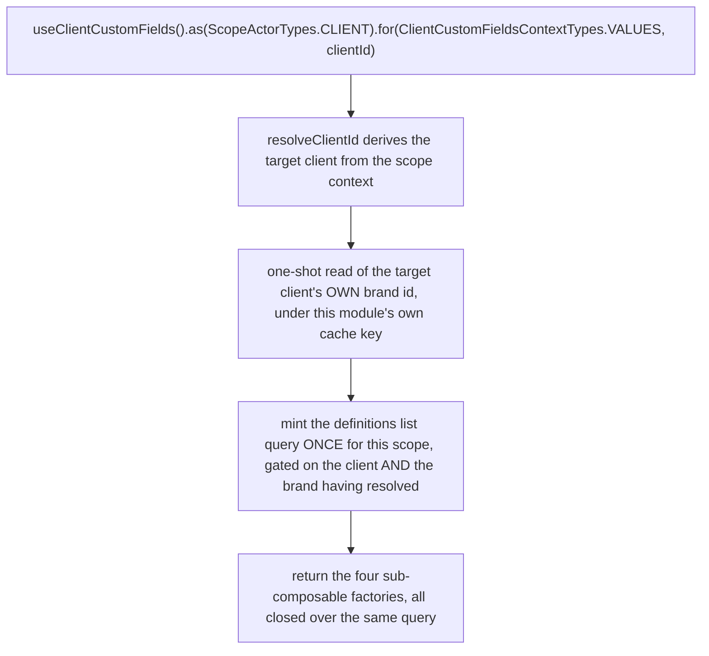
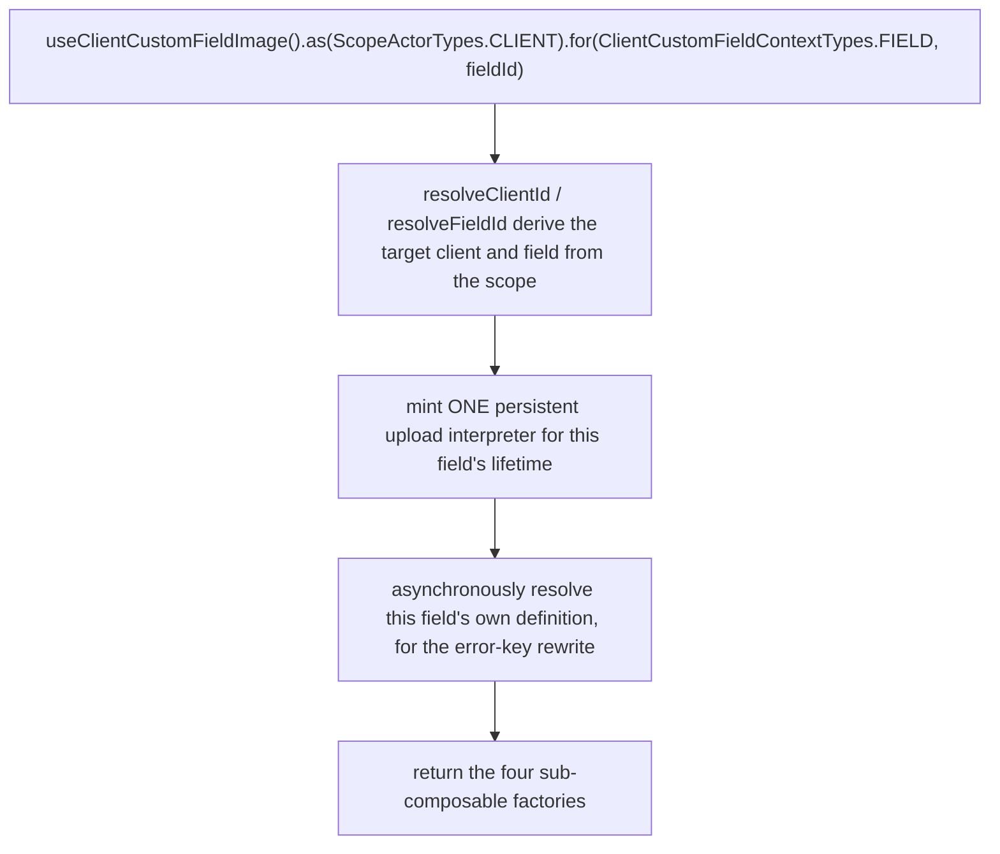
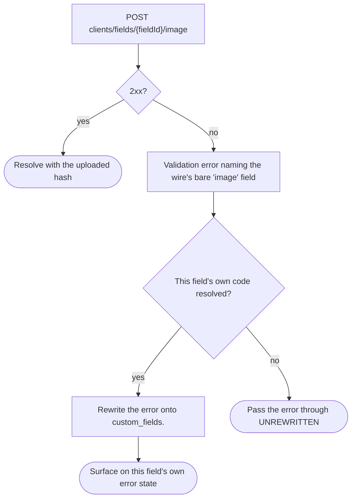

# client-custom-fields — Architecture

## Overview

The module ships **two** scoped composables over one shared services factory:

- **`useClientCustomFields`** — the definitions collection. Query-backed, no state machine. One list query is minted per resolved `(actor, context)` scope, at construction, so it survives component lifecycles.
- **`useClientCustomFieldImage`** — the per-field image editor. Wraps the platform's existing upload interpreter (`useUpload`, from `system-upload`) rather than owning a machine of its own — this module adds no machine file at all.

Both are registered under the **same** module name (`"client-custom-fields"`); the composable's own context-type enum (`VALUES` for the collection, `FIELD` for the image editor) is what keeps their registry entries apart in practice, not any name-level guarantee — a bare `.as(actor)` call with no `.for()` on either composable would produce the identical registry key, and the image editor is simply never called that way (it is meaningless without a field id).

The single most important property of this module is that **every request resolves its target client from the scope**, never from a direct session read — one `resolveClientId` function, consumed by every request-issuing path in the services file.

## Data Flow

### Instantiation — the definitions collection

The definitions request carries the **target client's** brand id, never the calling session's own brand — a client whose brand differs from the session's own still sees that client's definitions. The brand id is itself read from the same client record the profile module also reads. Both modules build their own cache key toward matching each other, but a small asymmetry in how each side forms its own key means the two end up as separate entries rather than one shared one — see "Two independently-keyed reads" under Dependencies below for why that gap is left alone rather than closed by force.

### Instantiation — the image editor

The field's own definition is resolved lazily and cached on the services instance; a consumer who triggers an upload before that resolution settles gets the same resolution awaited on demand, reusing the collection's own cache rather than issuing a second network round trip once the collection has loaded once.

### The image error-key rewrite

Guarantees the platform holds: a validation failure on an image upload always names the field it belongs to, once that field's own code has resolved.

Constraints the caller has to plan around: if the field's own code cannot resolve (its definition lookup came back empty), the rewrite intentionally does **not** fall back to keying on the field's id — an unrewritten `image` key is visibly incomplete, where a fallback to `id` would look complete while building a key nothing in the code-keyed value model could ever match.

## Sub-composables

| Sub-composable   | Collection                                                                                                                 | Image editor                                                       |
| ---------------- | -------------------------------------------------------------------------------------------------------------------------- | ------------------------------------------------------------------ |
| `useActions()`   | Readiness, refresh, invalidate, client-side filter, pagination controls, the aggregate image-flush pass-through, lifecycle | Upload, remove, flush, readiness, lifecycle                        |
| `useContext()`   | The reactive definitions list, lookups, captured error                                                                     | Value, hash, download URL, preview, captured error                 |
| `useMeta()`      | 5 flags — count, hasError, isAvailable, isEmpty, isLoading                                                                 | 5 flags — hasError, isAvailable, isComplete, isUploading, progress |
| `useInternals()` | Actor scope, raw list query                                                                                                | Actor scope, raw upload handle                                     |

## Services

One services file serves both composables, split into two factories that share the same identity-resolution functions:

| Concern                             | Where it lives                                                                                                                                                                                   |
| ----------------------------------- | ------------------------------------------------------------------------------------------------------------------------------------------------------------------------------------------------ |
| Target-client resolution            | one function, branching on the resolved scope context, consumed by every request-issuing path                                                                                                    |
| Addressability predicate            | one function; its reactive form is what `isAvailable` exposes on both composables                                                                                                                |
| The target client's own brand id    | resolved once per scope, under this module's own cache key — never the calling session's brand                                                                                                   |
| Definitions read + client-side sort | one function, gated on the client **and** the brand having settled (success or failure) — not merely having succeeded, which is what previously left readiness unbounded on a brand-read failure |
| Wire ↔ view-model mapping           | pure mappers, no actor awareness                                                                                                                                                                 |
| The image upload wrapper            | wraps the platform's existing upload interpreter; this module implements no upload endpoint of its own                                                                                           |
| The aggregate image flush           | resolves every dirty (pending-upload) value in a value set, using a throwaway upload instance per field rather than the persistent per-field one the image editor holds                          |

The module owns **no machine of its own**. The image editor's machine is the platform's existing upload interpreter, reached through the shared upload composable.

## Errors

Errors are **state**, not events. Nothing in this module raises a toast or notification.

| Surface                                            | Where a failure lands                                                                                                     |
| -------------------------------------------------- | ------------------------------------------------------------------------------------------------------------------------- |
| Collection mutation (validation, brand resolution) | the services instance's captured error → `useContext().error`, `useMeta().hasError`                                       |
| Definitions read                                   | the query's own error → the same two members                                                                              |
| Image upload                                       | the services instance's captured error, rewritten onto the field's own code → `useContext().errors`, `useMeta().hasError` |

## Dependencies

### This module reads from

| Module                                          | Uses                                                                                                                                                                                                                                             |
| ----------------------------------------------- | ------------------------------------------------------------------------------------------------------------------------------------------------------------------------------------------------------------------------------------------------ |
| Active client session                           | the acting client's identity when no other context is supplied; whether the session is authenticated                                                                                                                                             |
| The shared request layer                        | list reads, single-record one-shot reads, the image upload's own transport, URL building, cache invalidation                                                                                                                                     |
| The platform's existing image-upload capability | the per-field upload interpreter this module wraps rather than re-implements                                                                                                                                                                     |
| Localisation                                    | translated caller-facing text on a rejected validation                                                                                                                                                                                           |
| Shared field-rendering helpers                  | schema, form-definition and model-seeding generation — this module re-exports them under its own names rather than relocating them, since two other consumers outside this module's own contract import them directly at their existing location |

### Modules that read from this one

| Module                        | Uses                                                                                                                                         |
| ----------------------------- | -------------------------------------------------------------------------------------------------------------------------------------------- |
| A client's own profile record | the definitions, the value-semantics contract, and the aggregate image-flush step — the primary consumer of this module's published contract |
| Registration                  | the definition mapper and the definition type, for custom fields collected at registration                                                   |
| Account                       | the definition mapper, for custom fields returned alongside an account read                                                                  |
| In-basket custom fields       | the definition mapper and the definition type, for custom fields collected against a basket                                                  |

Every consumer above imports only the barrel's curated exports; none reaches into this module's internal services, mappers, or schema re-export file.

### Two independently-keyed reads of the same client record

This module's own brand-id read and the profile module's own read both target the identical underlying client record. Both are built to key against it as closely to each other as each side's own transport allows, but end up as **two separate cache entries today, not one shared one**, because of a small asymmetry in how each side forms its own key. That gap is left alone rather than closed by force: the underlying request platform bakes its own field-selection logic inside the cached fetch function itself, so a genuinely shared entry would be populated by whichever side's request happened to resolve first, silently corrupting the other side's read with the wrong shape. See [gotchas.md](./gotchas.md) and the profile module's own architecture doc for the full account — **do not quote a specific per-boot request count anywhere downstream of this doc**; the mechanism is settled, the count is not.

## Load-order note

Both composables defer their scope-registry registration to first call, rather than performing it at module-evaluation time — a deliberate departure from this module's own reference conversion, which registers eagerly. See [gotchas.md](./gotchas.md#4-both-composables-register-lazily--this-is-load-bearing-not-a-style-choice) for the load-order cycle this avoids and why it is the single most reusable fact in this module for the next module to convert the same way.

## Module boundary

The barrel is the module's only public surface: two composables and their own two types, two scope-matrix constants and their two matching types, two context enums, four model types, six pure value-semantics functions, three re-exported schema/form helpers, and eight sub-composable types (four per composable). Curated named re-exports only — no `export *`.

Everything else is internal and carries a file-level internal marker: the services file, the mappers, and the schema re-export file. A consumer reaching past the barrel into any of those fails the module's own visibility check.
