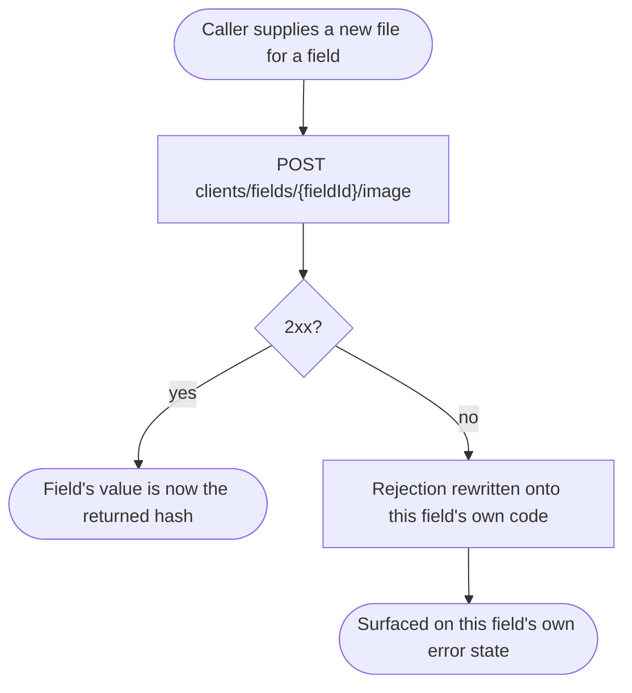
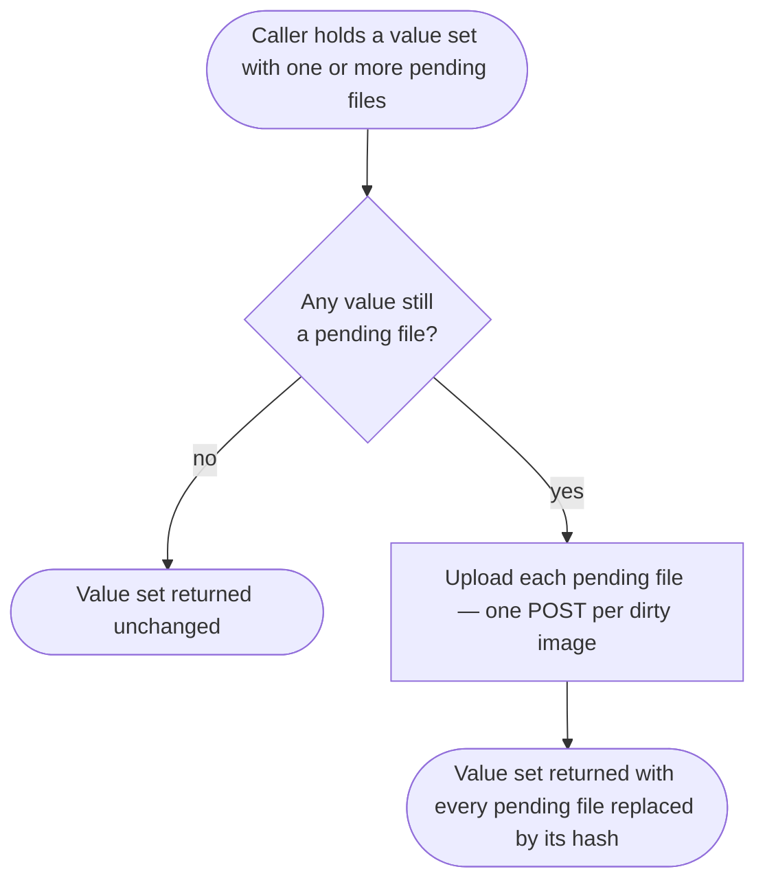

# Module: client-custom-fields

## What it is

The **client-custom-fields** module covers a brand's catalogue of custom field _definitions_ that apply to clients, and the _value semantics_ for reading and writing them — per-type coercion, schema/form generation, and the image upload flow for the one field type whose value is a file rather than a scalar. It owns the **contract**, not the client record: reading and persisting a specific client's values is a neighbouring concern, owned by the client's own profile record.

Two working surfaces sit over this contract: a **definitions collection**, read and filtered row by row, and a **per-field image editor**, used to upload, clear, and preview the stored image for one field of type IMAGE. The two are not addressed the same way. The **definitions collection** takes the target client as an explicit, caller-supplied entity id — usually the caller's own — and resolves that client's brand from it; the id is a plain value this contract does not validate locally against who is calling. The **image editor** takes a _field_ id instead, never a client id, and always acts for the calling session's own client — it cannot be pointed at another client's field. Neither composable has any capability for one client to act _as_ another (no actor retarget — see Core concepts); addressing a _named_ entity and acting _as_ a different party are different things, and only the first — on the definitions collection alone — exists in this contract.

A client's own profile record — the entity that actually holds a set of values for these definitions — is read and persisted elsewhere; that module consumes this one's schema, coercion, and image-flush contract rather than re-deriving any of it.

## Core concepts

- **Custom field definition** — a brand-level description of one field: its code, display name, type, whether it is required, and where it is visible. Definitions are shared across every client on the brand; only the _values_ differ per client.
- **Field type** — one of eight kinds a definition can declare: a short text, a password-style text, a single-select, a radio/checkbox, a multi-line text, a date, a number, or an image. The type decides how a raw value is read and how a form control is generated for it; a separate, display-only label travels alongside it for debugging but never decides behaviour.
- **Code-keyed value record** — the shape both an incoming value set and an outgoing update use: a plain object keyed by each field's own code (never by its id, and never a list of `{id, value}` pairs).
- **Value coercion** — turning a value exactly as it exists on a client's record into the typed form a consumer or a form control expects (a number, a yes/no, a formatted date, or a passthrough for an image hash).
- **Embedded definition** — a value that arrives already carrying its own definition, letting a consumer resolve type and display rules without a separate load of the definitions collection.
- **Aggregate image flush** — resolving every unsaved image value in a value set to its uploaded hash, in one step, immediately before that value set is persisted.
- **Entity id, not actor** — the definitions collection addresses a client entity id supplied by the caller; the image editor addresses a _field_ id instead and always acts for the calling session's own client. Neither has a separate notion of "acting as" a different party layered on top: the caller's own credentials are what travel with the request regardless of which id was named, and there is no capability anywhere in this contract for one client to act _as_ another, or for staff or a guest to act at all. Authorization of the collection's entity id is decided entirely on the platform side, not by anything local to this contract.

## Operations

| #   | Capability                                                                 | Inputs                            | Outputs                                                                                                 |
| --- | -------------------------------------------------------------------------- | --------------------------------- | ------------------------------------------------------------------------------------------------------- |
| 1   | **Read a brand's client custom field definitions**                         | —                                 | The brand's definitions, ordered by their declared display order                                        |
| 2   | **Filter the loaded definitions**                                          | a partial match (e.g. by type)    | The definitions narrowed to matches; no new request                                                     |
| 3   | **Look up one definition by id, from the currently loaded list**           | a definition id                   | The matching definition, or nothing if the list hasn't loaded yet or no definition matches              |
| 4   | **Resolve a value's definition, preferring the value's own embedded copy** | a value                           | The definition, without requiring the definitions collection to be loaded at all                        |
| 5   | **Coerce a raw value to its typed form**                                   | a raw value, its definition       | The value in the type its field declares (number, boolean, formatted date, or an unchanged image hash)  |
| 6   | **Project a value for read-only display**                                  | a raw value, its definition       | A display string, or — for an image — a download URL and a preview source                               |
| 7   | **Compute a dirty-only, code-keyed update**                                | a current value set, its baseline | Only the changed codes, with a cleared value expressed as `null`; no output at all when nothing changed |
| 8   | **Upload an image value for one field**                                    | a file                            | The resulting stored hash                                                                               |
| 9   | **Clear an image field's stored value**                                    | —                                 | —                                                                                                       |
| 10  | **Resolve an image's download URL and preview source**                     | —                                 | Both, once the value resolves                                                                           |
| 11  | **Flush every unsaved image value in a value set**                         | a value set                       | The same set, with every pending image replaced by its uploaded hash                                    |

Generating a schema from the definitions (for validating or rendering a form) is part of this module's contract but is reached through the shared field-rendering helpers this module re-exports (see Dependencies), not through the definitions collection directly.

**Additional always-on behaviours:**

- Reporting whether the collection is addressable at all — whether a client has been resolved to read the definitions on behalf of, and whether the brand this client belongs to has itself resolved.
- Reporting whether the definitions list is loading, empty, or errored.
- Re-reading the definitions from the server on demand, and marking the cached collection stale so the next read re-fetches it.
- Reporting whether an image field's upload is in flight, and whether it has settled — never an intermediate value.

## Data shape

A definition, at full catalogue fidelity:

```ts
type CustomField = {
  id: string;
  code: string; // the key a value record and an update body use — never the id
  name: string; // display name, translated when available
  type: string; // the wire's own type label — display/debug only, never a behavioural switch
  typeId: 1 | 2 | 3 | 4 | 5 | 6 | 7 | 8; // TEXT | PASSWORD | SELECT | SELECT_RADIO | TEXTAREA | DATE | NUMBER | IMAGE — the coercion/schema discriminator
  options?: unknown; // present for a fixed-choice field (e.g. a SELECT's list of {label, value})
  order: number; // display order — the collection sorts by this itself, regardless of what the server returned
  meta: {
    isRequired: boolean;
    isReadOnly: boolean; // the client may not change this field's value
    isDisabled: boolean; // disabled for input — the inverse of isEditable
    isHidden: boolean;
    isUserOnly: boolean;
    isEditable: boolean;
    showOnOrderForm: boolean;
    showOnInvoice: boolean;
    displayContexts: { invoice: boolean; order_form: boolean };
  };
};
```

The eight field types and their coercion:

| Type                             | Read coercion                                                                      | Notes                                                                                                                                                                                                                    |
| -------------------------------- | ---------------------------------------------------------------------------------- | ------------------------------------------------------------------------------------------------------------------------------------------------------------------------------------------------------------------------ |
| TEXT, PASSWORD, TEXTAREA, SELECT | a string, or `""` for a nullish/empty raw value                                    | never the literal strings `"undefined"` / `"null"`                                                                                                                                                                       |
| SELECT_RADIO                     | a boolean                                                                          | `"true"` / `"1"` (string) or any truthy value coerce to `true`                                                                                                                                                           |
| DATE                             | a formatted date-time string, or `undefined` for a nullish/empty/invalid raw value | the format is the platform's own fixed `"YYYY-MM-DD HH:mm:ss"`                                                                                                                                                           |
| NUMBER                           | a number, or `undefined` for a nullish/empty raw value                             | a nullish or empty raw value never coerces to `NaN` — it coerces to `undefined` instead. A present, non-numeric raw value is not specially guarded and coerces however the platform's own numeric conversion handles it. |
| IMAGE                            | passed through unchanged                                                           | the value is a stored hash, or a pending file awaiting upload                                                                                                                                                            |

A value set — the shape both a read model and an update body use:

```ts
type CustomFieldModel = Record<string /* field code */, unknown>;
```

There is no `{field_id, value}` array anywhere in this contract — a value set is always a plain object keyed by code.

A single value, as embedded on a client record (the shape `resolveFieldByValue`, capability 4, reads):

```ts
type EmbeddedCustomFieldValue = {
  id: string;
  field_id: string;
  value: unknown;
  field?: CustomField; // the embedded definition — present when the read requested it
};
```

The definitions-read envelope follows the platform's general response wrapper (`status`, `data`, `total`, `error`, `messages`); the image endpoints below wrap their own payload the same way.

## Dependencies

### Dependants — modules that read from this one

| Module                        | Weight  | Reads                                                                                                                                              | Why                                                                                |
| ----------------------------- | ------- | -------------------------------------------------------------------------------------------------------------------------------------------------- | ---------------------------------------------------------------------------------- |
| A client's own profile record | high    | the definitions, the value-semantics contract (coercion, schema/form generation, the embedded-definition resolver), the aggregate image-flush step | reading and persisting a specific client's values against this brand's definitions |
| Registration                  | 4 files | the definition mapper, the definition type                                                                                                         | rendering and reading custom fields collected at registration                      |
| Account                       | 1 file  | the definition mapper                                                                                                                              | mapping custom fields returned alongside an account read                           |
| In-basket custom fields       | 2 files | the definition mapper, the definition type                                                                                                         | rendering and reading custom fields collected against a basket                     |

The HTTP transport layer and app-level navigation reference this module as they do most others; they are not domain consumers and are excluded from the table.

### This module's own dependencies

- **Active client session** — supplies the acting client's id when no other client is named, and gates every definitions read on being authenticated.
- **Image upload service** — the module wraps an existing upload capability for the one field type whose value is a file; it does not implement the upload endpoint itself.
- **Localisation** — translates caller-facing text attached to a rejected validation.
- **Shared field-rendering helpers** — schema, form-definition and model-seeding generation, shared with two other consumers outside this contract (registration, in-basket custom fields) that render the same field types in their own forms.
- **Shared types / enums** — the definition's canonical shape and the numeric field-type enum.

## API endpoints

### GET /custom_fields

Role: reads the brand's client-facing custom field definitions. Called whenever the collection is opened or re-read; brand-scoped, not client-scoped — the brand is the one the target client belongs to, not the caller's own session brand.

```bash
curl "$API/custom_fields?filter[object_type]=client&brand_id=2785d26e-9678-3d16-999f-314502e70439&limit=0&sort=order:asc" \
  -H "Authorization: Bearer $ACCESS_TOKEN" \
  -H "Accept: application/json"
```

Sample response (`200`):

```json
{
  "status": "ok",
  "data": [
    {
      "id": "20403869-6e54-721d-29f5-18d9305e7d23",
      "name": "Age",
      "type": 7,
      "type_code": "number",
      "code": "age",
      "hidden": false,
      "client_readonly": false,
      "required": false,
      "order": 1,
      "values": {
        "min": { "label": "", "value": "" },
        "max": { "label": "", "value": "" },
        "step": { "label": "", "value": "" }
      },
      "user_only": false,
      "show_on_order_form": false,
      "show_on_invoice": false
    },
    {
      "id": "3de78642-de53-9714-7ec2-1208469530d0",
      "name": "Profile Picture",
      "type": 8,
      "type_code": "image",
      "code": "profile_picture",
      "hidden": false,
      "client_readonly": false,
      "required": false,
      "order": 2,
      "values": [],
      "user_only": false,
      "show_on_order_form": true,
      "show_on_invoice": false
    }
  ],
  "total": 2,
  "error": null,
  "messages": [],
  "meta": null
}
```

Every field the read coercion and schema generation use is present on the raw definition; only a subset is shown above for brevity.

Fixture: `__tests__/fixtures/get-custom-fields-brand-id-filter-object-type-client-sort-order-asc.json`.

### POST /clients/fields/{fieldId}/image

Role: uploads a new image value for one custom field. The request body is the raw file; there is no other field in the body.

```bash
curl -X POST "$API/clients/fields/3de78642-de53-9714-7ec2-1208469530d0/image" \
  -H "Authorization: Bearer $ACCESS_TOKEN" \
  -F "image=@profile-picture.png"
```

Sample response (`200`):

```json
{
  "status": "ok",
  "data": {
    "id": "47d73824-8507-9315-8d9c-81e642d59e06",
    "field_id": "3de78642-de53-9714-7ec2-1208469530d0",
    "value": "z5PJhA7etKR1iQxVdet8UMDxbPaRdWNK",
    "image_url": "https://api.example.com/images/z5PJhA7etKR1iQxVdet8UMDxbPaRdWNK/download",
    "field": {
      "id": "3de78642-de53-9714-7ec2-1208469530d0",
      "code": "profile_picture",
      "type": 8,
      "type_code": "image"
    }
  },
  "total": null,
  "error": null,
  "messages": [],
  "meta": null
}
```

The returned `value` is the hash a subsequent value set carries under this field's code.

Fixture: `__tests__/fixtures/post-clients-fields-id-image.json`.

## Failure modes

### A rejected image upload — `422`

Trigger: `POST /clients/fields/{fieldId}/image` with a file the platform cannot process.

Response shape — `status: "error"`, `data: null`, with the field-level reason inside `error.data`:

```json
{
  "status": "error",
  "data": null,
  "error": {
    "code": 422,
    "message": "API request invalid!",
    "data": { "image": ["Invalid or corrupt image."] }
  },
  "messages": null,
  "meta": null
}
```

The rejection is rewritten onto the rejected field's own code before it reaches a consumer — the module never surfaces the wire's bare `image` key on its own error state — so a consumer keys its rendered message off the field it was uploading for, not off a generic `image` field.

Fixture: `__tests__/fixtures/post-clients-fields-id-image-case-rejected.json`.

### No addressable client, or an unresolved brand → no request at all

The definitions read resolves the target client, and through it the target brand, before issuing anything. With no authenticated session, a session that authenticates without resolving a client, or a client whose brand has not yet resolved, no request is issued and the read is held pending (or rejected, for a forced re-read) rather than firing an unaddressed request.

### Soft failures

No soft-failure path has been observed on either endpoint. The definitions read is a plain list; the image upload either succeeds with the full record shown above or fails with the `422` above — no `2xx` response carrying a partial or downgraded result has been captured.

### Not captured

The rejection shape for a validation failure on the definitions collection itself (as opposed to the image upload) has not been observed.

## Flows

### Uploading a new image value

One-line purpose: show what a caller can rely on when replacing a field's stored image.



Guarantees the platform holds: a successful upload always returns the same shape a definitions read's embedded value would carry, so a consumer can treat the two identically once an upload settles.

Constraints the caller has to plan around: uploading again for the same field replaces the previous value outright — there is no history and no way to keep more than one stored value per field.

### Flushing every pending image ahead of a save

One-line purpose: show why an aggregate save-time step exists distinct from the per-field upload above.



Guarantees the platform holds: a value already holding a stored hash is never re-uploaded — only values that are still raw, pending files trigger a request.

Constraints the caller has to plan around: this step has to run, and settle, before a value set carrying it is treated as ready to persist elsewhere — a value set serialised before this step completes still carries an in-memory file object rather than a hash.

## Lessons (hard-won)

- **A definition's numeric type and its display-only type label can drift**, and only the numeric one is safe to branch on. A definition also carries a string label describing its type for display and debugging; two of the eight possible values have been directly confirmed against real data, and the rest are inferred from naming convention rather than confirmed. Branching read coercion or schema generation on the string label risks a silent fallback to a generic text behaviour for a type whose label turns out not to match what was assumed.
- **A value's request-shape neighbour (whether it clears as an empty string or as `null`) is decided by which side of the contract owns it, not by a single global rule.** This module's own dirty-diff step turns an empty string into `null` for every code it produces; a client's other, non-custom-field values follow a different rule entirely, decided by that other side of the contract. A consumer building an update body by hand, rather than through this module's diff step, has to apply the right rule to the right half.
- **An image value has no baseline of its own to diff against.** A code-keyed value set carries no marker distinguishing "a file waiting to be uploaded" from "an already-uploaded hash" other than the JavaScript type of the value itself — a raw file object versus a string. Any consumer that serialises a value set before this module's aggregate flush step runs risks serialising an in-memory file object instead of a hash.
- **The read coercion for a "yes/no" field accepts more truthy shapes than its own written form produces.** A stored value can arrive as the strings `"true"` / `"1"`, or as any other truthy value; only a plain boolean is ever written back. A consumer comparing a freshly-read value against a freshly-written one by strict type equality will find them unequal even when they mean the same thing.
- **Uploading a new image value replaces the previous one outright — there is no queue or history.** A second upload for the same field supersedes the first; the platform's own capability offers no way to keep more than one stored value per field.
- **Only two upload states are guaranteed observable through this contract: in-flight, and settled.** A byte-level percentage is not something this contract exposes on its own — a caller that needs one has to instrument the underlying transport directly, and a caller building against just this contract should not assume an intermediate value will ever arrive.
