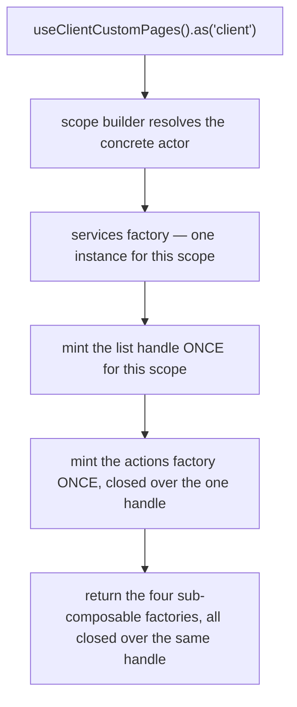
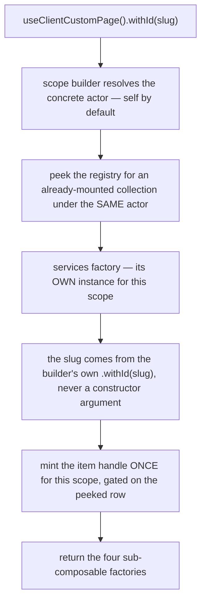
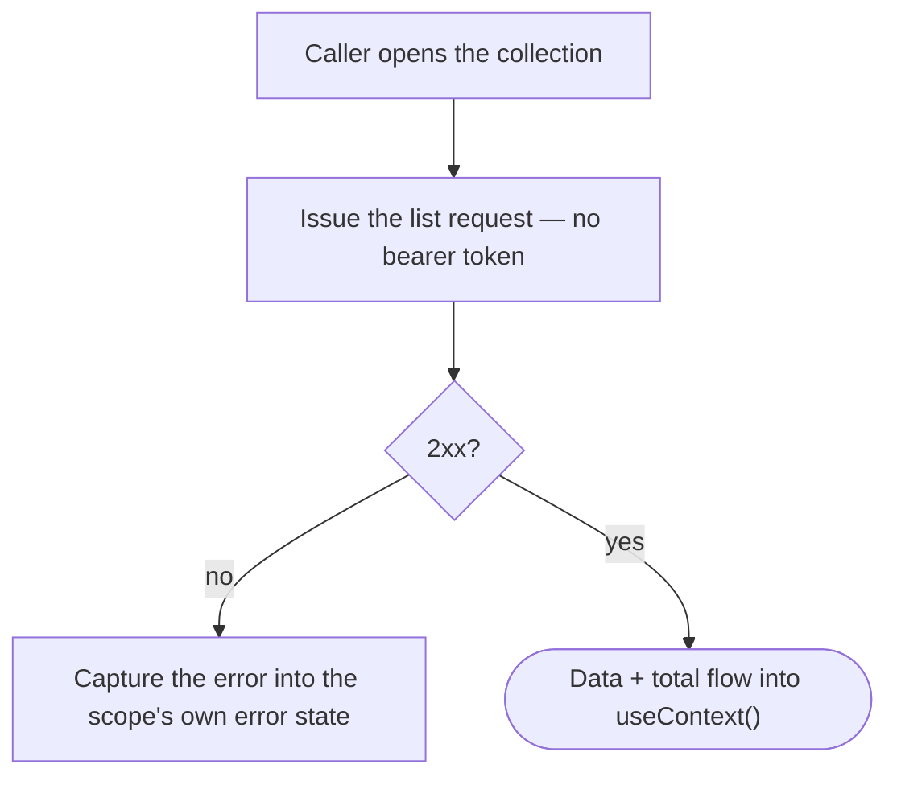
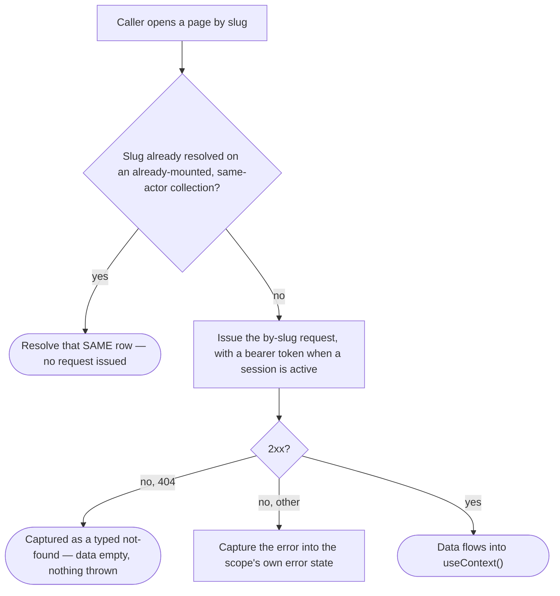

# client-custom-pages — Architecture

## Overview

The module ships **two** scoped composables over **one** shared services
layer:

- **`useClientCustomPages`** — the collection. Query-backed, no state
  machine. One list handle is minted per resolved scope, at construction, so
  it survives component lifecycles.
- **`useClientCustomPage`** — the single read. Query-backed, one item handle
  per resolved scope, keyed by the route slug named through the builder's
  `.withId(slug)` rather than a constructor argument.

Both are registered under the same module name; the composable name and the
scope key carry the differentiation. Both build their services instance from
**one factory**, so the two halves share one endpoint family and one cache
key prefix.

The module has **no mutation surface at all** — no form/mutation schema, no
state machine, no `mutate()`. The collection's one schema is a READ request
schema — what the filter/sort/page actions accept — not a write contract.
Both composables exist purely to read.

## Data Flow

### Instantiation — the collection

`useContext()`, `useMeta()` and `useInternals()` are lazy — they build on
call. `useActions()` is minted once per scope alongside the handle, because
the whole request state — filters, sort, pagination — lives on the request
platform's own criteria handle, never inside `useActions()` itself. Every
narrowing action (`filters.showOnMenu`, `filters.slug`, `sort`) forwards into
that one write path, merging over whatever the current filter state already
holds rather than replacing it wholesale — naming one filter does not clear
another that was already set.

### Instantiation — the single page

The instance is keyed by the scope key, which is itself keyed by the slug —
two different slugs resolve to two different instances. The registry peek at
construction time is a one-shot check: a collection that mounts LATER in this
scope's lifetime is not raced for — the peek happens once, when the single
read is constructed.

### Read flow — the collection

Guarantees the platform holds: the row count and the total row count arrive
on the SAME response — there is no separate count request. The default
window is the unpaged one (`limit=0` / `offset=0`), so the list's very first
read already asks for everything, matching the reference behaviour this
module reproduces.

### Read flow — the single page

The negative half of the "already resolved" guard (a slug NOT already on the
collection genuinely issuing its own request) is demonstrated. The positive
half (a slug that IS on the collection genuinely skipping the request, on a
live response) has not been demonstrated end-to-end against a real capture,
because no live capture currently contains a resolvable row for it to skip
in front of.

## Sub-composables

| Sub-composable   | Collection                                                              | Single read                                          |
| ---------------- | -------------------------------------------------------------------------- | --------------------------------------------------------- |
| `useActions()`   | 8 members — `destroy`, `filters` (2 named filters), `invalidate`, `isReady`, `nextPage`, `prevPage`, `refresh`, `sort` | 4 members — `destroy`, `invalidate`, `isReady`, `refresh` |
| `useContext()`   | 7 members — reactive list, lookups, error, pagination, live request state, request schemas | 2 members — the resolved page, error                 |
| `useMeta()`      | 8 flags — `hasError`, `isAvailable`, `isEmpty`, `isLoading`, `isReloading`, `hasNextPage`, `hasPrevPage`, `hasPages` | 6 flags — the shared four plus `isNotFound`, `isReloading` |
| `useInternals()` | 2 — actor scope, raw list handle                                         | 2 — actor scope, raw item handle                          |

Both halves return the identical four-layer shape; only the contents differ,
because the collection carries pagination/filter concerns the single read has
no use for.

## Services

One services file serves both halves. There are no per-actor service
variants — every in-scope actor hits the same endpoint family, because the
resource is brand-wide rather than identity-scoped.

| Concern                     | Where it lives                                                                                                          |
| ----------------------------- | ---------------------------------------------------------------------------------------------------------------------- |
| List request                | takes no scope context at all — the request state is the declared read schema, handed to the list call                 |
| Single-page request          | keyed by the slug named through `.withId(slug)`, plus an optional reference to an already-mounted collection's matching row |
| Bearer-token asymmetry        | the list omits the token entirely; the single-page read carries one whenever a session is active                       |
| Cache key                    | one base key, shared by both halves                                                                                     |
| Wire ↔ view-model mapping   | pure mapping functions, no actor awareness, consumed by BOTH surfaces                                                    |
| Readiness                   | settles even when there is nothing to read — never hangs behind a request that never fires                              |
| Request schema (collection only) | declares what the filter/sort/page actions accept and what a filter-bar/sort control renders; every write reaches the wire only through this schema-validated path |

**Documented divergence — the collection's client-scoping id.** The
collection's scope declares a context cell for the CLIENT actor. But the
underlying endpoint takes no client-id path segment at all — it is always the
same brand-wide read, regardless of any id supplied through that context. So
an id supplied through the collection's scope reaches only the instance's own
cache-key partition; it never reaches the outbound request. This is not a
data leak (every client of the same brand already sees the identical page
set; the wire request is unaffected), and no consumer in this module's tree
exercises it — but it is a real, deliberately-not-narrowed sharp edge. See
[gotchas.md](./gotchas.md#1-forclient-otherid-on-the-collection-type-checks--and-retargets-nothing)
for the consumer-facing statement of the same mechanism. The single read's
scope declares no context cell at all, for any actor — its slug is a record
identifier, not a scope, so this divergence does not reach it.

## Errors

Errors are **state**, not events. Nothing in this module raises a toast or
notification.

| Surface           | Where a failure lands                                          |
| ------------------ | ---------------------------------------------------------------- |
| Collection list read | the handle's own error → `useContext().error`, `useMeta().hasError` |
| Single-page read    | the same two members, plus `useMeta().isNotFound` for the specific not-found case |

A consumer that wants user-visible feedback renders it from those members.

## Dependencies

### This module reads from

| Module        | Uses                                                                                     |
| -------------- | ------------------------------------------------------------------------------------------- |
| `session-store` | whether a session is active, to decide the single read's bearer-token attachment           |
| `query`        | the shared request layer — list reads with pagination/filtering/sorting, single-item reads, URL building, cache invalidation |
| `scope`        | the actor-scoping accessor and its instance registry, including the peek the single read performs against an already-mounted collection |
| shared utilities | collection lookups (`findOne` / `getOne`), the typed response-error model                 |

### Modules that read from this one

None today. This module is net new; its two composables are consumed
directly by whatever browsing surface renders the brand's pages, and by a
driveable exploration page. A resolved page's own identifier is handed to a
separate, already-shipped content-rendering surface — that hand-off is a
one-way consumer relationship (this module supplies an id), not a dependency
in the other direction.

## Platform additions this build required

None. This module consumes the shared request layer exactly as every other
scoped composable does, and reuses an already-shipped content-rendering
surface for the one capability (rendering a page's body) that is out of this
module's own scope, keyed by the resolved page's id.

## Integration Points

- Any consumer rendering a menu or a browsable list of the brand's pages
  drives the collection.
- Any consumer opening one page in full drives the single read, keyed by the
  page's route slug.
- Any consumer wanting the page's actual rendered content drives the
  separate content-rendering surface with the resolved page's id — this
  module never renders it.
- Both composables are documented in [usage.md](./usage.md).

## Module boundary

The barrel is the module's only public surface: both composables, the
collection's scope matrix and its context enum, the sortable-properties
enum, the page model types, and the eight sub-composable type exports.
Curated named re-exports only — no `export *`.

Everything else is internal: the services, the mappers, and the request
schema factories. The services file in particular must never be imported
directly from outside this module — both composables resolve it internally.
A consumer's only door to the request schema is `useContext().schemas.query`
on the collection, never a direct import of the schema factories. The single
read's own scope matrix (an all-refusing one, so no context can be named on
it at all) is not exported from the barrel — it names no context a consumer
could spell.
