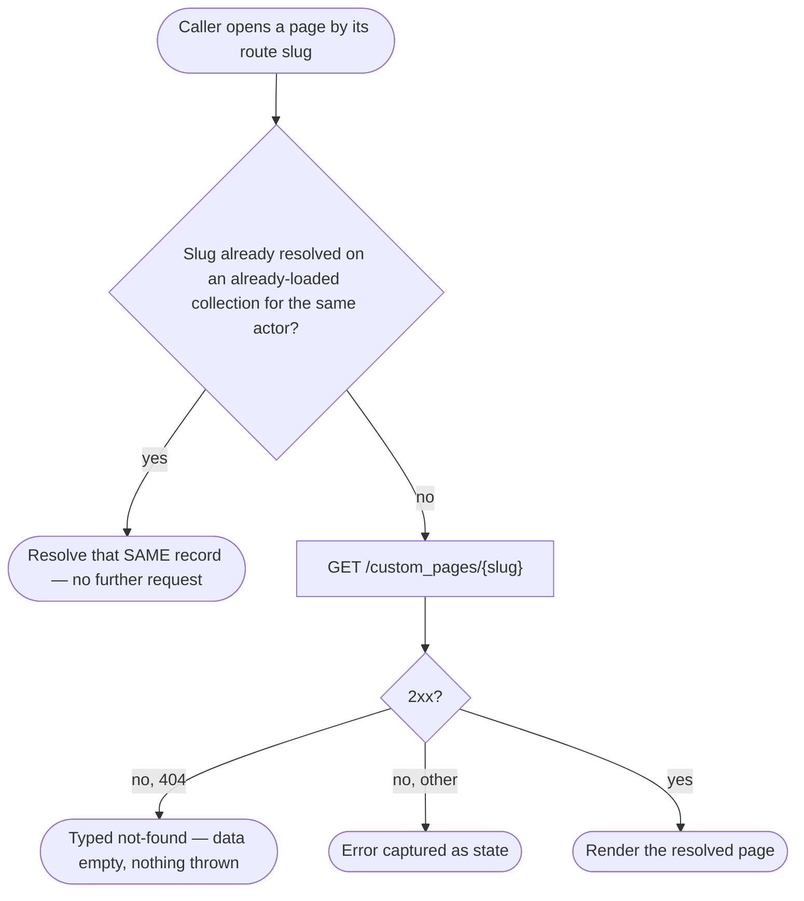
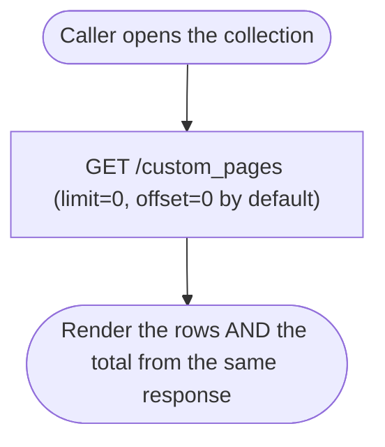

# Module: client-custom-pages

## What it is

The **client-custom-pages** module reads a brand's own custom content pages: a
**collection** for listing them (for a navigation menu, or any other browsing
surface) and a **single read by identifier** for opening one page in full. The
pages themselves belong to the brand, not to any individual customer — every
signed-in customer of the same brand sees the same set of pages, and there is
no capability here to create, edit, or remove one. This module only reads
pages a brand administrator has already configured elsewhere.

The identifier a caller opens a page by is its **route slug** — a short,
URL-safe string the brand assigns the page (e.g. `about`), not an opaque
internal id. The single read is addressed by slug specifically because that is
what a page's own URL carries.

There is no page **body** in this module's own data. Reading a page's
rendered content is a separate capability, addressed by the page's internal
id, that this module hands off to rather than duplicates — see
[Dependencies](#dependencies).

## Core concepts

- **Page record** — one custom page: its name, its route slug, a display
  title, a menu label, and whether it should appear in navigation. The
  collection's rows and the single read return the identical shape.
- **Menu visibility** — a boolean flag on each page (`showOnMenu`) recording
  whether navigation should surface it. The platform accepts this as a
  narrowing parameter on the list read (see [Lessons](#lessons-hard-won) for
  what is and is not confirmed about it).
- **Translated label / title** — a page's menu label and title each have an
  independent, optional translation. When no translation exists for the
  caller's locale, the platform returns it as an **empty string**, not as
  a missing field — this module resolves to the untranslated value in that
  case, so a caller always receives a usable string.

## Operations

| # | Capability | Inputs | Outputs |
| --- | --- | --- | --- |
| 1 | List the brand's custom pages | optional menu-visibility filter, optional slug filter, optional sort, optional page window | array of page records, plus a total count |
| 2 | Narrow the list to pages marked for menu display | a true/false flag, or none to clear it | re-issues the list read, narrowed |
| 3 | Narrow the list to one page by its route slug | a slug string, or none to clear it | re-issues the list read, narrowed |
| 4 | Sort the collection | one sortable field (creation order or name) plus a direction, or neither for the platform's own insertion order | re-issues the list read, ordered |
| 5 | Move through the collection's page window | next / previous | re-issues the list read at the new window |
| 6 | Read one page in full by its route slug | a slug | the single page record, or a typed not-found signal |
| 7 | Refresh either surface | — | a forced further read from the server |

**Additional always-on behaviours:**

- Reporting whether either surface is ready to read — a signal that always
  resolves, even when there is nothing to read.
- Reporting whether a read is loading, its first load having completed, or
  a background re-read is in flight — the last of these is a state a caller
  can render distinctly from the first-load state.
- Reporting whether the resolved slug does not exist as a page at all,
  distinct from any other read failure.
- Marking either surface's cached read stale so the next read re-fetches it.

**Derived from an already-loaded collection (non-network):**

- Finding one page already on a loaded collection by a partial match on its
  fields, or by its identifier — no request is issued for either lookup.
- Opening one page by slug when that exact slug is already present on an
  already-loaded collection resolves the SAME record with no further network
  request; a slug not already loaded is fetched directly. This capability's
  code path exists and its negative boundary (a slug absent from the loaded
  collection still issues its own request) is demonstrated. Its positive
  boundary (a slug present on the loaded collection skips the request) has
  not been observed against a live response, because the environment this
  module's fixtures were captured against currently has no configured pages
  to load into a collection in the first place — see
  [Lessons](#lessons-hard-won).

## Data shape

The record returned for each page, identical on the collection's rows and the
single read:

```ts
type CustomPageRecord = {
  id: string;
  brand_id: string;
  org_id: string;
  name: string;
  slug: string; // the page's route identifier
  title: string;
  title_translated: string; // "" when no translation exists — never absent
  menu_label: string;
  menu_label_translated: string; // "" when no translation exists — never absent
  show_on_menu: boolean;
  created_at: string;
  updated_at: string;
};
```

This module's own read of that record resolves the translation pair down to
one usable string per field, and does not surface `org_id` — no consumer of a
client-facing page read needs the owning organisation:

```ts
type CustomPage = {
  id: string;
  brandId: string;
  name: string;
  slug: string;
  title: string; // title_translated, falling back to title, when empty
  menuLabel: string; // menu_label_translated, falling back to menu_label, when empty
  showOnMenu: boolean;
};
```

> No example of a populated page record has been captured against a live
> environment: the environment this module's fixtures were recorded against
> currently has zero pages configured. The shapes above are declared from the
> platform's own typed model and this module's own field-by-field mapping,
> not confirmed against a live populated row. The synthetic row below
> illustrates the shape only — it is not a captured response:
>
> ```json
> {
>   "id": "page-1",
>   "brand_id": "brand-1",
>   "org_id": "org-1",
>   "name": "About",
>   "slug": "about",
>   "show_on_menu": true,
>   "menu_label": "About Us",
>   "menu_label_translated": "",
>   "title": "About Our Company",
>   "title_translated": "",
>   "created_at": "2026-01-01T00:00:00Z",
>   "updated_at": "2026-01-01T00:00:00Z"
> }
> ```

Every response is wrapped in the platform's standard envelope:

```ts
type Envelope<T> = {
  status: "ok" | "error";
  data: T | null;
  related: unknown | null;
  total: number | null; // the collection's total row count, on the SAME response as the rows
  error: {
    id: string;
    type: number;
    code: number; // mirrors the HTTP status
    message: string;
    data: unknown[] | null;
  } | null;
  messages: string[] | null;
  meta: null; // envelope wrapper only, never carries page data
};
```

## Dependencies

### Dependants — modules that read from this one

None today. This module is net new; its two capabilities are driven directly
by the pages a browsing surface displays and by a driveable exploration page,
not by another domain module.

### This module's own dependencies

- **HTTP transport layer** — URL construction, response caching, and (for the
  single read only) bearer-token attachment.
- **Active session identity** — read only to decide whether the single read
  carries a bearer token; the resource itself is not scoped to any individual
  identity (see [Lessons](#lessons-hard-won)).
- **Shared platform typing** — the page record and its response-error typing
  are type-level dependencies only; no runtime capability is imported from
  either.
- **A separate content-rendering surface** — once a page is resolved, its
  full body is rendered through that surface, keyed by the page's own id.
  This module hands off the id; it does not read or render the body itself.

## API endpoints

### GET /custom_pages

Role: lists the brand's custom pages. Resolves the brand from the request's
own origin — there is no brand-identifying parameter on this endpoint at all.
Accepts an optional menu-visibility filter, an optional slug filter, an
optional sort, and a page window (`limit` / `offset`). This read is issued
with **no bearer token** — it can be read before a customer is signed in.

```bash
curl "$API/custom_pages" \
  -H "Accept: application/json"
```

Sample response (`200`) — captured against an environment that currently has
no pages configured:

```json
{
  "status": "ok",
  "data": [],
  "related": null,
  "total": 0,
  "error": null,
  "messages": [],
  "meta": null
}
```

Fixture: `__tests__/fixtures/get-custom-pages.json`

**Unpaged by default.** When no page window is specified, this module's
default request still carries `limit=0` and `offset=0` on the wire, rather
than omitting the parameters — on this platform, a `0` limit is the positive
"return everything" signal, not "return nothing". A caller narrowing the
window supplies an explicit `limit` instead.

**Menu-visibility filter, probed but indeterminate.** A capture against
`filter[show_on_menu]=1` returns the identical empty envelope the unfiltered
read returns:

```bash
curl "$API/custom_pages?filter[show_on_menu]=1" \
  -H "Accept: application/json"
```

Fixture: `__tests__/fixtures/get-custom-pages-case-menu-filter-probe-filter-show-on-menu-1.json`

Because the environment currently has zero pages, an empty result is returned
whether or not the platform actually applies the filter — the capture cannot
tell the two apart. See [Lessons](#lessons-hard-won).

### GET /custom_pages/{slug}

Role: reads one page in full by its route slug. This read carries a bearer
token when a session is active — unlike the list, which never does (see
[Lessons](#lessons-hard-won)).

```bash
curl "$API/custom_pages/about" \
  -H "Authorization: Bearer $ACCESS_TOKEN" \
  -H "Accept: application/json"
```

No successful capture of this endpoint exists against a live environment,
because the environment has no configured page to read — see
[Failure modes](#failure-modes) for the one capture that does exist against
this endpoint, and [Lessons](#lessons-hard-won) for what that means for this
module's proof.

## Failure modes

### Unknown slug — a typed absence, not a thrown error

Reading a slug that does not exist as a page returns a normal HTTP 404 with a
structured error body; nothing is thrown, and the caller's data reads empty:

```bash
curl "$API/custom_pages/no-such-page-xyz" \
  -H "Accept: application/json"
```

Sample response (`404`):

```json
{
  "status": "error",
  "data": null,
  "related": null,
  "total": null,
  "error": {
    "id": "0fcfeaece2a94d93d574ad5036d5a5b676234b40",
    "type": 0,
    "code": 404,
    "message": "Custom Page not found!",
    "data": null
  },
  "messages": null,
  "meta": null
}
```

Fixture: `__tests__/fixtures/get-custom-pages-no-such-page-xyz.json`

This module discriminates this specific case (not-found, as opposed to any
other failure) from the error's own status code, so a caller can tell "this
page does not exist" apart from "the read failed for some other reason".

### Not captured

- **A successful single-page read.** Every capture against the by-slug
  endpoint that exists is the 404 shown above; no capture of a `200` response
  against this endpoint exists, because the environment recorded against has
  no page to resolve. The success-path response shape is declared from the
  platform's typed model and this module's mapping, not confirmed live.
- **A page carrying a real translation for its menu label or title.** Every
  captured list response is empty, so the translation-fallback behaviour
  (below) is proven only by a constructed input, never by a live row.

## Flows

### Opening one page by slug

One-line purpose: show the two paths a by-slug open can take, and where each
lands.



Guarantees the platform holds: a slug that does not exist as a page returns a
real 404 with a structured error body, discriminable from any other failure,
never a thrown exception.

Constraints the caller has to plan around: the "already resolved" skip
depends on a matching collection already being loaded under the same actor
at the moment the single read is constructed — a collection that loads
later does not retroactively trigger the skip for an already-constructed
single read.

### Listing the collection with an accurate total

One-line purpose: show that one request answers "give me the pages, and how
many are there" together, and that the default window is the whole
collection.



Guarantees the platform holds: the row count on the response and its total
count describe the same request — there is nothing else to reconcile, and
the unpaged default means the very first read already asks for the whole
collection.

Constraints the caller has to plan around: a caller that narrows by filter,
sort, or an explicit page window has to re-issue this request; the previous
response's total describes the previous request, not the new one, until the
new response lands.

## Lessons (hard-won)

- **The list and the single read carry opposite bearer-token treatment, on
  purpose.** The list omits a bearer token entirely — it is read at a point
  before a session necessarily exists, and the resource itself is not scoped
  to any signed-in identity at all. The single read carries a bearer token
  whenever a session is active, even though the resource still is not
  identity-scoped. Flattening either direction (a token-bearing list, or a
  token-free single read) changes observable behaviour, not just internal
  consistency.
- **A `0` page-window value is a real, positive instruction on this platform,
  not an omitted one.** A schema or client that treats a `0` limit as "no
  limit configured" and substitutes a small positive default silently
  truncates the collection on every single request — there is no error, no
  empty-list signal, nothing to notice locally. The failure only becomes
  visible once a brand has enough pages to exceed the substituted default.
- **An identifier-scoped narrowing on this collection type-checks and can
  still do nothing on the wire.** The underlying resource is owned by the
  brand as a whole, not by any individual account — its records carry no
  per-account owner field at all. A caller may still be able to name another
  account's identifier when opening this collection (depending on how a
  given consumer constructs its scope); doing so changes nothing about which
  rows come back, because there is no per-account id anywhere in the request
  or the resource to retarget. A caller relying on that kind of narrowing to
  restrict or redirect the read is relying on something the underlying
  resource has no way to honour.
- **A boolean narrowing parameter accepted by an endpoint is not proof the
  endpoint applies it.** Two probes against the menu-visibility filter, taken
  a day apart, both returned the identical empty result the unfiltered read
  returns. On a catalogue with zero rows this is structurally
  indistinguishable from "the filter is honoured and correctly returns
  nothing" — there is no way to tell "honoured" from "silently ignored" until
  at least one row exists to be filtered out or kept.
- **A background re-read and a first read are reported as two distinct
  states, not one.** A consumer that renders only "loading vs not loading"
  cannot tell a first load apart from a refresh that follows a completed
  first load — the two are exposed as separate signals precisely so a caller
  can, for example, keep the previous content visible while a re-read is in
  flight rather than blanking it.
- **An empty-string translation is a real value, not a missing one.** The
  platform's translation fields are always present as strings; "no
  translation configured" is an empty string, never an absent field. A
  fallback written to trigger only on a genuinely missing value (rather than
  an empty one) would let a cleared translation render as blank instead of
  falling back to the original text.
- **A record-identifying value is not the same thing as an access-scoping
  value, even when both are strings passed into the same call shape.** This
  module's by-slug read takes a route slug purely to select which record to
  return; it is never treated as, or convertible into, a value that changes
  whose data is being asked for. Conflating the two — for example, trying to
  use the slug to imply "read this on behalf of a particular account" — has
  no seam to attach to anywhere in this module.
