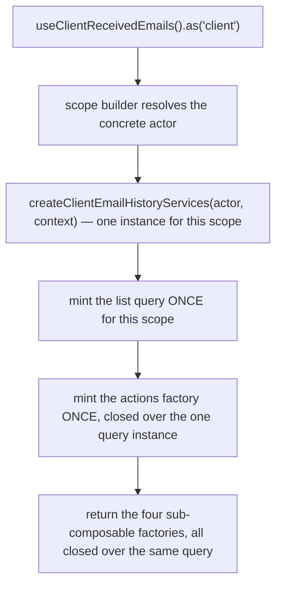
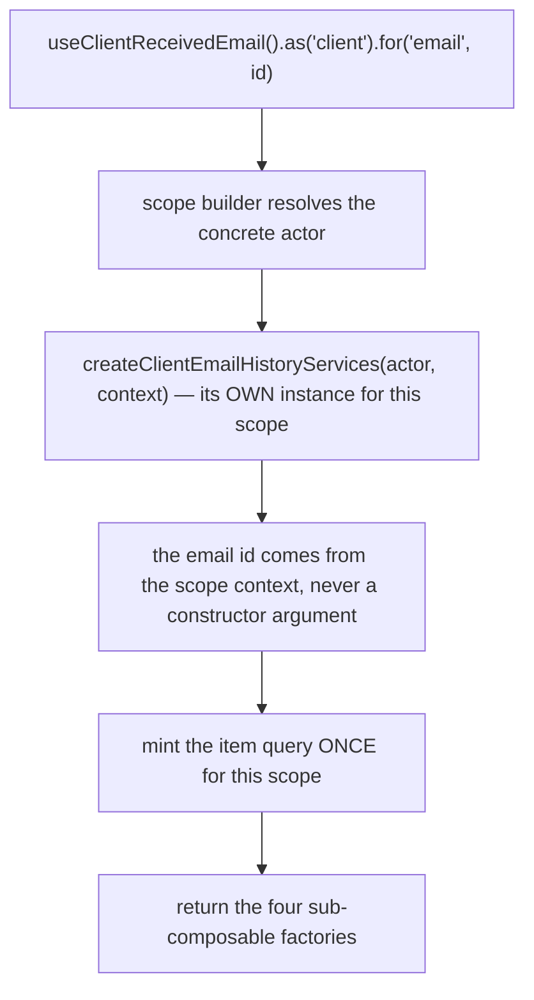
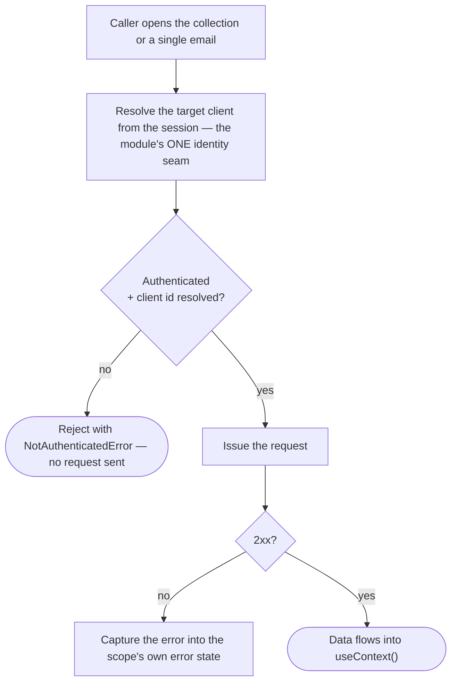

# client-email-history — Architecture

## Overview

The module ships **two** scoped composables over **one** shared data layer:

- **`useClientReceivedEmails`** — the collection. Query-backed, no state machine. One list query is minted per resolved scope, at construction, so it survives component lifecycles.
- **`useClientReceivedEmail`** — the single read. Query-backed, one item query per resolved scope, keyed by the email id named in the scope context rather than a constructor argument.

Both are registered under the same module name; the composable name and the scope key carry the differentiation. Both build their services instance from **one factory** (`createClientEmailHistoryServices`), so the two halves share one identity seam, one cache key, and one addressability predicate.

The single most important property of this module is that **every request resolves its target client from the scope the caller opened, never from a direct session read inside a request-issuing function.** `resolveClientId(scopeContext)` in the services layer is the only place that decision is made, and both `loadList` and `loadOne` go through it. An `.as('client')` call site is the documented API, not a branch this module makes on the actor itself.

The module has **no mutation surface at all** — no form/mutation schema, no state machine, no `mutate()`. The collection's one schema (`client-email-history.schemas.ts`) is a READ query schema — what `setCriteria` accepts and what a filter bar renders — not a write contract. Both composables exist purely to read.

## Data Flow

### Instantiation — the collection

`useContext()`, `useMeta()` and `useInternals()` are lazy — they build on call. `useActions()` is minted once per scope alongside the query, for the same reason every sub-composable ultimately closes over ONE `query` instance: the whole request state — filters, sort, pagination — lives on the query platform's own criteria handle (`query.criteria` / `query.setCriteria`), never inside `useActions()` itself. `setCriteria` on the collection's actions forwards straight to it.

`filterBy` and `sortBy` are the same forwarding shape, narrowed to one branch each: `filterBy(intent)` calls `query.setCriteria({ filters: intent })`, `sortBy(intent)` calls `query.setCriteria({ sort: intent })`. Neither closes over any state beyond the one shared `query` instance already captured — there is exactly one write path into the query's criteria handle, reached through three names on the actions factory, so a consumer that resolves an action by name (a generic list-driving control that expects a `sortBy` / `filterBy` verb, say) finds a real member rather than only the general-purpose `setCriteria`.

### Instantiation — the single read

The instance is keyed by the scope key, which is itself keyed by the email id — two different ids resolve to two different instances.

### Read flow (either surface)

The guard is the **same predicate** `isAvailable` exposes on both surfaces — one function, read by meta, by the actions layer, and by every request gate. A consumer cannot render "available" while the wire refuses the call, or vice versa.

### The collection's total arrives on the row response itself

The list request carries no count side-channel. The single response that carries the rows also carries the total in its own `total` field, so `pagination.total` / `.pages` update from the SAME response the rows render from — there is no second request to wait on, and no generation-tagging problem to solve, because there is only ever one in-flight answer for a given sort/filter at a time. A stale response is superseded the ordinary TanStack Query way: `placeholderData: keepPreviousData` keeps the previous page's rows and total on screen while a re-fire from a filter, sort, or page change is in flight, rather than flashing an empty list.

## Sub-composables

| Sub-composable   | Collection                                                                                                             | Single read                                                                        |
| ---------------- | ---------------------------------------------------------------------------------------------------------------------- | ---------------------------------------------------------------------------------- |
| `useActions()`   | 9 members — `setCriteria` (narrow/sort/page) plus its `filterBy`/`sortBy` single-branch adapters, page walk, lifecycle | 4 members — lifecycle only                                                         |
| `useContext()`   | 7 members — reactive list, lookups, captured error, pagination, live criteria, filter-bar schema                       | 2 members — the mapped email, captured error                                       |
| `useMeta()`      | 7 flags — `hasError`, `isAvailable`, `isEmpty`, `isLoading`, `hasNextPage`, `hasPrevPage`, `hasPages`                  | 8 flags — the same shared four plus `isComplete`, `isBounced`, `isError`, `isSent` |
| `useInternals()` | 2 — actor scope, raw list query                                                                                        | 2 — actor scope, raw item query                                                    |

Both halves return the identical four-layer shape; only the contents differ, because the collection carries pagination/filter concerns the single read has no use for.

## Services

One services file (`client-email-history.services.ts`) serves both halves. There are no per-actor service variants today — the only resolving actor in either scope matrix is `client` — and the same holds across every other layer (actions, context, meta). The one schema layer that exists (`client-email-history.schemas.ts`) is a READ query schema — filters/sort/pagination — never a form/mutation schema; the module still has no mutation surface to validate.

| Concern                        | Where it lives                                                                                                                                                                                                                                                                |
| ------------------------------ | ----------------------------------------------------------------------------------------------------------------------------------------------------------------------------------------------------------------------------------------------------------------------------- |
| Target-client resolution       | `resolveClientId`, the module's one identity seam, consumed by both `loadList` and `loadOne`                                                                                                                                                                                  |
| Addressability predicate       | `isAddressable`, exposed reactively as `service.isAvailable` and shared by both surfaces' `enabled` / `guard`                                                                                                                                                                 |
| Cache key                      | one base key (`["client", "emailHistory"]`), shared by both halves                                                                                                                                                                                                            |
| Wire ↔ view-model mapping      | pure mappers (`mapReceivedEmail`, `mapEmailHistory`, `mapEmailStatus`), no actor awareness, consumed by BOTH surfaces via the query's `select`                                                                                                                                |
| Readiness                      | the same three-step shape on both actions layers — settle addressability first, then wait on the fetch, so a readiness wait always resolves rather than hanging behind a query that never fires                                                                               |
| Query schema (collection only) | `useQuerySchema()` / `useQueryUischema()` (`client-email-history.schemas.ts`) — declares what `setCriteria` accepts and what a filter-bar renders; published at `useContext().schemas.query`, consumed only by the collection's `loadList` (`list({ criteria: { schema } })`) |

**Documented divergence — the collection's `.for(client, id)` hazard.** The collection's scope context names the CLIENT whose history is read, and `resolveClientId` genuinely honours it. But the underlying endpoint (`self/email_history`) takes no client-id path segment at all — it is always resolved from the authenticated session, never from a URL parameter. So a context id supplied through `.for(ScopeActorTypes.CLIENT, otherClientId)` reaches only two places: the **cache-key partition** (`[...queryKey, { client: clientId }]`) and the **addressability predicate**. It never reaches the outbound request. The practical effect: calling `.for(CLIENT, otherClientId)` compiles, runs, and returns the CALLER's own history — filed under a cache key that names a different client. This is not a data leak (the wire request is unaffected; the caller can never see a third party's data through it), and no consumer in this module's tree exercises it — but it is a real, deliberately-not-narrowed sharp edge. See [gotchas.md](./gotchas.md#1-forclient-otherid-is-type-reachable-on-the-collection--and-does-nothing-youd-expect) for the consumer-facing statement of this same mechanism. The type is not narrowed to prevent it, because doing so would mean touching the module's one identity seam to defend against a call no consumer makes; if a genuinely client-addressed capability is ever needed, it needs a client-addressed endpoint, which this module's oracle never had.

## Errors

Errors are **state**, not events. Nothing in this module raises a toast or notification.

| Surface              | Where a failure lands                                              |
| -------------------- | ------------------------------------------------------------------ |
| Collection list read | the query's own error → `useContext().error`, `useMeta().hasError` |
| Single read          | the query's own error → the same two members                       |

A consumer that wants user-visible feedback renders it from those members.

## Dependencies

### This module reads from

| Module           | Uses                                                                                                                                                    |
| ---------------- | ------------------------------------------------------------------------------------------------------------------------------------------------------- |
| `session-store`  | the active client identity (the resolved target when no `.for()` context is supplied), whether the session is authenticated, and whether it has settled |
| `query`          | the shared request layer — list reads with pagination/filtering/sorting, single-item reads, URL building, cache invalidation                            |
| `scope`          | the actor-scoping accessor and its instance registry                                                                                                    |
| shared utilities | date formatting, collection lookups (`findOne` / `getOne`), the typed unauthenticated-access error                                                      |

### Modules that read from this one

None today. This module's two composables are consumed directly by the client-facing email-history views; no other headless module builds on top of it.

## Platform additions this build required

None. This module consumes the shared `query` module (`packages/headless/src/modules/query/`) exactly as every other scoped composable does, and follows the same pagination/filter/query pattern `product-catalogue` (`packages/headless/src/modules/product-catalogue/`) already uses for its own list read: a single `list()` call, `placeholderData: keepPreviousData` so a filter/sort/page change keeps the previous rows and total on screen while the next response is in flight, and `enabled` gated on the module's own addressability predicate. The item-level query shape the single read needs (`ReceivedEmailItemQuery`) is declared locally in this module's own `.types.ts`, built from `typeof vueUseQuery` the same way the platform's own `ListQuery` is — never derived with `ReturnType<typeof loadOne>`. See [CHANGELOG.md](./CHANGELOG.md) for the history of this decision.

## Integration Points

- Any consumer rendering the history list — search, sort, outcome tabs, paging — drives the collection.
- Any consumer opening one email to read its full body drives the single read, keyed by the email's id.
- Both are documented in [usage.md](./usage.md).

## Module boundary

The barrel is the module's only public surface: both composables, both scope matrices, both context enums, the sortable-properties enum, the email model types, a re-export of the delivery-status enum, and the eight sub-composable type exports. Curated named re-exports only — no `export *`.

Everything else is internal and carries a file-level internal marker: the services, the mappers, and the query schema factories (`useQuerySchema()` / `useQueryUischema()`). The services file in particular must never be imported directly from outside this module — both composables resolve it internally. A consumer's only door to the schema pair is `useContext().schemas.query`, never a direct import of the schema factories.
