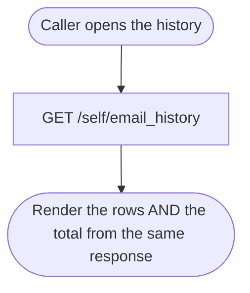
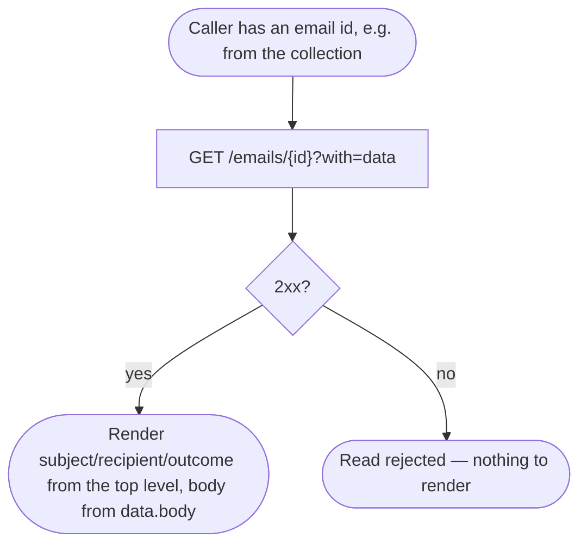

# Module: client-email-history

## What it is

The **client-email-history** module covers the emails the system has sent to one client, read two ways: a **collection** covering the whole history — browsed, searched, sorted, narrowed by delivery outcome, and paged through — and a **single full read** for opening one email to see its complete rendered body. Both surfaces address the same client's own history, under that client's own identity, and neither can be pointed at a different account's history: the underlying endpoints take no client identifier at all — they always resolve to whichever account is currently authenticated.

There is no capability here to compose, send, resend, or delete an email. This module only reads what the platform has already sent.

## Core concepts

- **Sent-email record** — one entry in a client's history: subject, sender, recipient, the dates it was sent / bounced / errored, and its delivery outcome. The collection's rows carry this; the single full read carries the same shape plus the rendered body.
- **Delivery outcome** — one of four states, in strict precedence order when more than one condition is true on the same record: an **error** outranks a **bounce**, a bounce outranks a plain **sent**, and a record that is none of those reports as still **sending**.
- **Recipient** — every record carries the recipient's display name, email address, and picture, resolved from the account the email was addressed to.

## State model

Every sent email settles into exactly one of four delivery states, reported directly on the record — never inferred client-side:

| State     | Reported by                           |
| --------- | ------------------------------------- |
| `sending` | none of the fields below are set yet  |
| `sent`    | the record's `sent` flag is `true`    |
| `bounced` | the record's `bounced` flag is `true` |
| `error`   | the record carries an `error_id`      |

The platform sets these fields as it attempts delivery; a caller only ever reads the current state, never drives a transition between them. When a record carries more than one of these fields populated at once (an `error_id` alongside a `bounced` flag, for example), the `error_id` takes precedence — the record reports `error`, not `bounced`.

## Operations

| #   | Capability                                | Inputs                                                                                       | Outputs                                              |
| --- | ----------------------------------------- | -------------------------------------------------------------------------------------------- | ---------------------------------------------------- |
| 1   | List my email history                     | optional sort, optional subject-text filter, optional delivery-outcome filter, optional page | array of email summaries, plus a total count         |
| 2   | Read one email in full                    | email id                                                                                     | the single email, including its rendered body        |
| 3   | Sort the collection                       | a sortable property + direction, or neither for the default                                  | re-issues the list read with the new order           |
| 4   | Search the collection by subject text     | search text                                                                                  | re-issues the list read, narrowed to subject matches |
| 5   | Narrow the collection by delivery outcome | one of sent / bounced / error, or none                                                       | re-issues the list read, narrowed                    |
| 6   | Page through the collection               | next / previous / a specific page number                                                     | re-issues the list read at that page                 |
| 7   | Refresh either surface                    | —                                                                                            | a further read from the server                       |

**Additional always-on behaviours:**

- Reporting whether either surface is addressable at all — that is, whether an authenticated client has been resolved to read on behalf of.
- Reporting whether a read is loading, empty, or errored, and signalling when it is ready to read (a signal that always resolves, even when there is nothing to read).
- Reporting how many pages the collection spans and whether a next/previous page exists.

## Data shape

The record returned for each email, on both the collection's rows and the single full read:

```ts
type SentEmailRecord = {
  id: string;
  sent: boolean;
  bounced: boolean;
  error_id: string | null; // present = this email errored; see State model for precedence
  subject: string;
  created_at: string; // "YYYY-MM-DD HH:mm:ss", space-separated — not ISO-8601 with a "T"
  updated_at: string;
  sent_at: string | null;
  bounced_at: string | null;
  from: string; // "Display Name <address@example.com>"
  to: string; // same format
  recipient: {
    fullname: string;
    email: string;
    image: { full_url: string } | null; // null when the recipient has no picture on file
  };
  recipient_type: { name: string; code: string };
};
```

> The `with=recipient` relation embeds the recipient's full account record; only the fields above are relevant to this module — the rest belong to that account's own profile data, out of scope here.

The single full read additionally carries a nested body object, reached through the `with=data` relation:

```ts
type SentEmailBody = {
  id: string;
  email_id: string;
  body: string; // the full rendered HTML the recipient received
  unsubscribe_link: string;
};
```

Every response is wrapped in the platform's standard envelope:

```ts
type Envelope<T> = {
  status: "ok" | "error";
  data: T | null;
  related: unknown | null;
  total: number | null; // the collection's total row count, carried on the SAME response as the rows
  error: {
    id: string;
    type: number;
    code: number; // mirrors the HTTP status
    message: string;
    data: unknown[];
  } | null;
  messages: string[] | null;
  meta: null;
};
```

## Dependencies

### Dependants — collections that read from this one

None today. This is the sole surface for a client's own sent-email history in the client-facing product; no other collection reuses it.

### This collection's own dependencies

- **Active client session** — supplies the acting client's identity and gates every read on being authenticated. There is no separate "which client" input anywhere in this module — see "Lessons" below.
- **HTTP transport layer** — bearer-token attachment, URL construction, response caching.

## API endpoints

### GET /self/email_history

Role: lists the caller's own sent-email history. Always resolves to the authenticated caller — there is no client-identifying parameter on this endpoint at all. Accepts `limit` / `offset` for paging, `order` for sorting (a leading `-` means descending), and a `filter[column]` / `filter[column|operator]` parameter family for narrowing: `filter[sent]` / `filter[sent|eq]` and `filter[bounced]` / `filter[bounced|eq]` for the delivery-outcome booleans, `filter[error_id|neq]=null` for narrowing to errored (`filter[error_id]=null` narrows to NOT errored), and `filter[subject|like]` for a wildcarded subject search. A bare `query=` / `subject=` parameter (no `filter[…]` wrapper) is **not** honoured by this endpoint — see the "Filtered variants" note below.

```bash
curl "$API/self/email_history?with=recipient,recipient_type,recipient.image&order=-created_at&limit=10" \
  -H "Authorization: Bearer $ACCESS_TOKEN" \
  -H "Accept: application/json"
```

Sample response (`200`, trimmed to one row — every row carries the full recipient record):

```json
{
  "status": "ok",
  "data": [
    {
      "id": "63250798-065d-1e24-eeec-8174e234e98d",
      "sent": false,
      "bounced": false,
      "error_id": "ed32754223fa3798745066f7f6d1ec8ee9dd67b7",
      "subject": "Security alert: new IP address used to access your account",
      "created_at": "2026-08-06 10:00:17",
      "updated_at": "2026-08-06 10:00:17",
      "sent_at": null,
      "bounced_at": null,
      "from": "\"Example Org\" <mock-email-1@example.com>",
      "to": "\"Checkout Test\" <mock-email-2@example.com>",
      "recipient": {
        "id": "25d96e76-3ed0-913d-d52c-417482528340",
        "fullname": "Checkout Test",
        "email": "mock-email-2@example.com",
        "image": null
      },
      "recipient_type": { "name": "Client", "code": "client" }
    }
  ],
  "related": null,
  "total": 2861,
  "error": null,
  "messages": [],
  "meta": null
}
```

The envelope's `total` carries the full row count for the current sort/filter on this SAME response — there is no separate count request to make. The count also arrives on an `x-total-count` response header, matching the envelope's `total`.

Fixture: `__tests__/fixtures/get-self-email-history-case-default.json`

**Paged variant** — `&offset=10` returns the next 10 rows with the same shape, `total` unchanged. Fixtures: `get-self-email-history-case-page-1.json`, `get-self-email-history-case-page-2.json`

**Sorted variant** — `order=-subject` sorts descending by subject instead of the default `order=-created_at`. Fixture: `get-self-email-history-case-subject-sort.json`

**Filtered variants** — `filter[sent|eq]=1` (or the equivalent bare `filter[sent]=true`) narrows to delivered; `filter[bounced|eq]=1` (or `filter[bounced]=true`) narrows to bounced; `filter[error_id|neq]=null` narrows to errored (read literally: "where the error id is not null"); `filter[error_id]=null` narrows to NOT errored; `filter[subject|like]=%welcome%` narrows by a wildcarded subject search. Each of these narrowed responses carries its OWN `total`, matching the narrowed row count, on the same response. Fixtures: `get-self-email-history-case-sent-eq-filter-sent-eq-1.json` / `get-self-email-history-filter-sent-true.json`, `get-self-email-history-case-bounced-eq-filter-bounced-eq-1.json` / `get-self-email-history-filter-bounced-true.json`, `get-self-email-history-case-error-neq-filter-error-id-neq-null.json` / `get-self-email-history-filter-error-id-neq-null.json`, `get-self-email-history-filter-error-id-null.json`, `get-self-email-history-case-subject-like-filter-subject-like-welcom.json`

**A bare `query=` / `subject=` parameter is accepted but applies NO narrowing.** A real capture against `query=invoice` (and against `query=invoice&subject=Invoice` together) returns `200` with the identical unfiltered `total` (`2861`) a plain default-list request returns — the endpoint silently ignores both parameters rather than erroring or narrowing by them. A caller wanting a subject search has to use `filter[subject|like]` instead. Fixtures (evidence of the no-op, not a working filter): `get-self-email-history-query-invoice.json`, `get-self-email-history-query-invoice-subject-invoice.json`

### GET /emails/{emailId}?with=data

Role: reads one email in full, including its rendered body, which lives at the NESTED `data.body` path (the `with=data` relation) — not at a top-level `body` field.

```bash
curl "$API/emails/63250798-065d-1e39-2d5c-8174e234e98d?with=data" \
  -H "Authorization: Bearer $ACCESS_TOKEN" \
  -H "Accept: application/json"
```

Sample response (`200`, body truncated for length — every capture is a full rendered HTML email):

```json
{
  "status": "ok",
  "data": {
    "id": "63250798-065d-1e39-2d5c-8174e234e98d",
    "sent": true,
    "bounced": false,
    "error_id": null,
    "subject": "New Support Ticket Message",
    "sent_at": "2026-02-11 15:21:06",
    "from": "\"Example Org\" <mock-email-1@example.com>",
    "to": "\"Checkout Test\" <mock-email-2@example.com>",
    "recipient": {
      "fullname": "Checkout Test",
      "email": "mock-email-2@example.com"
    },
    "data": {
      "id": "4038696e-5472-1d53-d20f-518d9305e7d2",
      "email_id": "63250798-065d-1e39-2d5c-8174e234e98d",
      "body": "<table class=\"wrapper\" ...full rendered HTML...</table>",
      "unsubscribe_link": "https://example.com/preferences?username=...&token=..."
    }
  },
  "related": null,
  "total": null,
  "error": null,
  "messages": [],
  "meta": null
}
```

Fixture: `__tests__/fixtures/get-emails-id.json`

## Failure modes

### No addressable client → no request at all

Every read resolves the target client first, from the active session, before either endpoint is called. With no authenticated session, no request is issued and the read is rejected locally — there is no HTTP exchange to observe.

### Not captured

- A record carrying BOTH an error id and a bounce flag has not been observed in the environment these fixtures were captured against — every sampled row shows at most one of the two. The precedence order stated above is the platform's own field semantics, not something inferred from a missing example.
- An email whose nested `data.body` is empty has not been observed either — every sampled row, across every subject category present, carried a populated body.

## Flows

### Reading the collection with an accurate total

One-line purpose: show that one request answers "give me the list and tell me how many there are" together.



Guarantees the platform holds: the row count on `data` and the `total` field on the same response always describe the SAME sort/filter — there is nothing else to reconcile.

Constraints the caller has to plan around: a caller that changes the filter, sort, or page has to re-issue this one request; the previous response's `total` describes the previous query, not the new one, until the new response lands. A caller that wants to avoid a flash of empty rows/total while that happens should keep showing the previous response until the next one settles, rather than clearing state on every change.

### Opening one email

One-line purpose: show where the full body lives.



Guarantees the platform holds: the top-level fields (subject, recipient, delivery outcome) read the SAME for an email whether it came from the collection or from this single read — one underlying record, two views onto it.

Constraints the caller has to plan around: the body is not part of the list response at all; a caller wanting the body has to make this second request, keyed on the email's id.

## Lessons (hard-won)

- **Neither endpoint has a client-identifying parameter.** `/self/email_history` and `/emails/{id}` both resolve to whichever account the bearer token authenticates as. Supplying a client id anywhere in the call does not retarget either endpoint — both continue to return the authenticated caller's own history, silently, rather than erroring or actually retargeting.
- **The total row count travels on the SAME response as the rows.** There is no separate count request against this endpoint — `total` is a field on the one list response, alongside `data`.
- **Omitting the sort parameter is not the same as restoring the default.** The platform's documented default ordering holds only while an explicit order value is present on the request; a request with no `order` parameter at all does not fall back to that default.
- **Each delivery-outcome column narrows independently — there is no required pairing.** `filter[sent|eq]=1` alone narrows correctly to the sent rows, with no need to also send `filter[bounced|eq]=0` alongside it; `sent`, `bounced` and `error_id` are three separate columns a caller combines only when it actually wants to.
- **A bare `query=` / `subject=` parameter is a silent no-op, not a working filter.** Real captures against both, alone and together, return the identical unfiltered `total` a plain default-list request returns. The endpoint's only working free-text search is the generic `filter[subject|like]=value` form — the same `filter[column|operator]` family every other narrowing column uses.
- **Delivery-outcome precedence is strict, not "whichever field is checked."** A record carrying both an error id and a bounced flag reports as errored — the error id takes precedence over every other outcome field on the same record.
- **Timestamps are space-separated, not ISO-8601.** `"2026-08-06 10:00:17"` parses inconsistently across languages and runtimes compared with the `T`-separated form.
- **A recipient with no picture on file returns a `null` image value, not an absent field.** A consumer expecting the "no picture" case to read as `undefined` will not find it that way.
