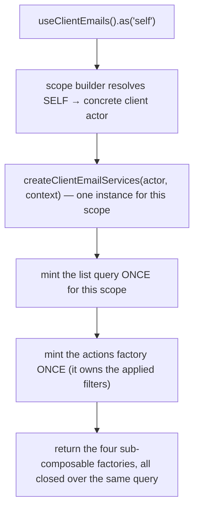
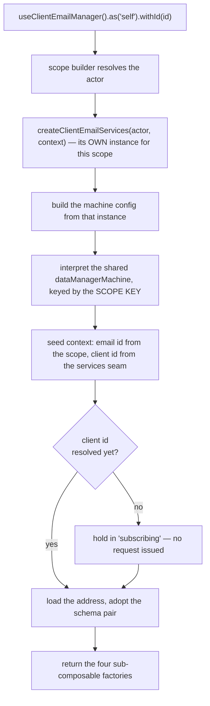
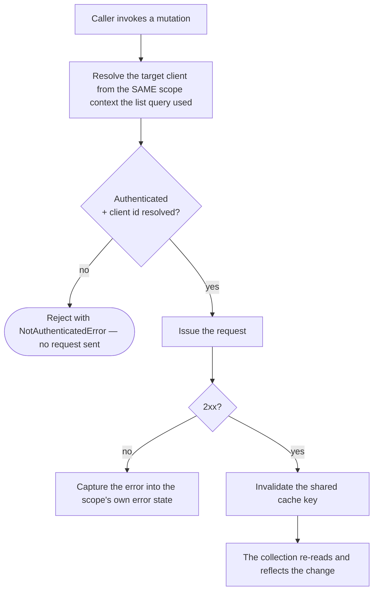
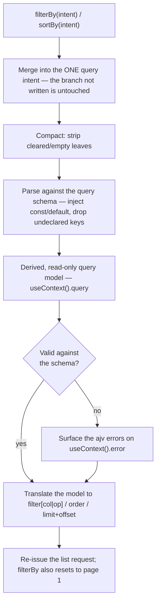
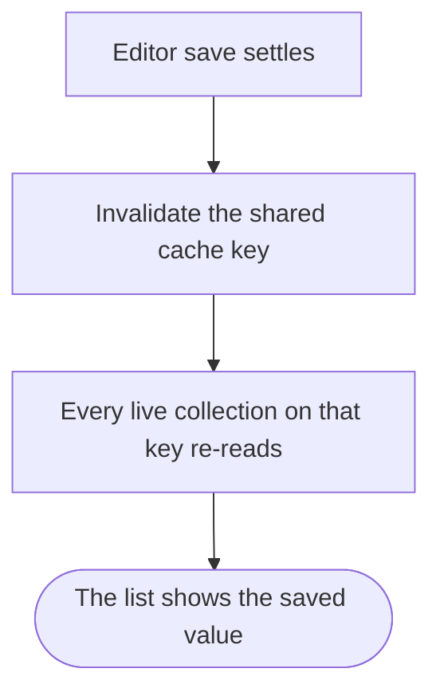

# client-email — Architecture

## Overview

The module ships **two** scoped composables over one shared data layer:

- **`useClientEmails`** — the collection. Query-backed, no state machine. One list query is minted per resolved `(actor, context)` scope, at construction, so it survives component lifecycles.
- **`useClientEmailManager`** — the per-email editor. Backed by the shared `dataManagerMachine`, one interpreter per resolved `(actor, email)` scope.

Both are registered under the same module name; the composable name and the scope key carry the differentiation. Both build their own services instance from **one factory**, so the two halves share one identity seam, one cache key and one set of request gates.

The single most important property of this module is that **every request URL derives from the resolved scope**, never from a direct session read. `resolveClientId(scopeContext)` in the services layer is the only place a target client is decided, and all eight request functions — list, read-one, add, update, ensure, remove, set-default, verify — go through it. The manager seeds its machine context from that same seam rather than reading the session itself.

## Data Flow

### Instantiation — the collection

`useContext()`, `useMeta()` and `useInternals()` are lazy — they build on call. `useActions()` is **not**: it is minted once per scope, because the applied `filters` live inside it. A factory minted per call would give every handle its own filter state.

### Instantiation — the editor

The interpreter is keyed by the **scope key**, not the email id. `.fresh()` mints a unique key per call, so two concurrent drafts get two independent editors instead of colliding on one shared "new email" identity.

Like the collection, the editor's `useActions()` is minted once per scope — `input` is debounced, and a debouncer minted per call would give two keystrokes two independent timers and leave `update`'s pre-save flush with nothing to flush.

### Mutation flow

The guard is the **same predicate** the collection's `isAvailable` flag exposes — one function, read by meta, by the actions layer and by every request gate. A consumer cannot render "available" while the wire refuses the call, or vice versa.

Editing an address appends a reset of the record's verified flag to the outgoing body. That is unconditional: the intent is stated by the caller (this is an existing record), not inferred from whether the address value actually changed.

### Filtering and sorting re-query the server

There is **one** query model per scope, not one per filter and a separate one for sort — setting either through `filterBy` / `sortBy` re-derives the whole model. A validation failure is captured as state on `useContext().error` and never silently reverts the model to its last-good value; the request still uses whatever the model resolves to. An undeclared column or operator never reaches the model at all — the schema is walked to build it, not the caller's input.

### How a save in the editor reaches the collection

Both halves resolve the same base cache key. The editor never reaches into the collection's query instance — that instance belongs to a different scope key and may not exist in the consumer at all. Instead a settled save invalidates the shared key through the editor's own services instance, and any live collection re-reads.

## Sub-composables

| Sub-composable   | Collection                                                                | Editor                                                                                |
| ---------------- | ------------------------------------------------------------------------- | ------------------------------------------------------------------------------------- |
| `useActions()`   | 12 members — row mutations, filter/sort, list controls, lifecycle         | 7 members — form input, save, lifecycle                                               |
| `useContext()`   | 8 members — reactive list, lookups, captured error, query state, schemas  | 9 members — model, schema pair, id, errors, display text                              |
| `useMeta()`      | 5 flags — `hasError`, `isAvailable`, `isEmpty`, `isFiltered`, `isLoading` | 8 flat flags — availability, loading, dirty, valid, new, processing, complete, errors |
| `useInternals()` | 3 — actor scope, raw query, per-action input-schema map                   | 4 — actor scope, raw sender, raw service, raw state                                   |

Both halves return the identical four-layer shape; only the contents differ, because one is query-backed and the other machine-backed.

## Services

One services file serves both halves. There are no per-actor service arms today — the actor switch exists with only a default branch, so the shape is the same whether or not an arm is ever earned.

| Concern                   | Where it lives                                                                                                                                                                                                                                                                              |
| ------------------------- | ------------------------------------------------------------------------------------------------------------------------------------------------------------------------------------------------------------------------------------------------------------------------------------------- |
| Target-client resolution  | one function, consumed by all eight request functions                                                                                                                                                                                                                                       |
| Addressability predicate  | one function; its reactive form is what `isAvailable` exposes                                                                                                                                                                                                                               |
| Cache key                 | one base key, shared by both halves                                                                                                                                                                                                                                                         |
| Wire ↔ view-model mapping | pure mappers, no actor awareness                                                                                                                                                                                                                                                            |
| Machine services adapter  | takes the already-scoped services instance as an argument, so the machine inherits the same resolved client                                                                                                                                                                                 |
| Request-state translation | one function, invoked whenever the declared model changes — turns it into `filter[col\|op]=` / `order=` / `limit=`&`offset=`. It now lives in the shared query layer's criteria seam, not this module's services file; `filterBy` / `sortBy` write intent only and never translate directly |

The module owns **no machine of its own** — it builds a typed configuration payload for the shared `dataManagerMachine`, whose actions, guards and invoked services it overrides. One guard override is load-bearing: the editor is held out of its loading state until a client id exists, which is what stops it firing an unaddressed request on a cold boot.

## Errors

Errors are **state**, not events. Nothing in this module raises a toast or notification.

| Surface                           | Where a failure lands                                                                                                                    |
| --------------------------------- | ---------------------------------------------------------------------------------------------------------------------------------------- |
| Collection filter/sort validation | the derived query model's ajv failure → `useContext().error`, checked BEFORE the two rows below                                          |
| Collection row mutation           | the services instance's captured error → `useContext().error`, `useMeta().hasError`                                                      |
| Collection list read              | the query's own error → the same two members                                                                                             |
| Editor save                       | the machine's context error → `useContext().errors`, `useMeta().hasErrors`; the action also rejects with a detailed error for the caller |
| Editor field validation           | the validation errors → `useContext().validationErrors`, `useMeta().isValid`                                                             |

A consumer that wants user-visible feedback renders it from those members, or from the editor's `onDone()` completion signal. On the collection, `error` checks the query-validation failure first — see [gotchas.md](./gotchas.md) for the consequence.

## Dependencies

### This module reads from

| Module                | Uses                                                                                                                                                  |
| --------------------- | ----------------------------------------------------------------------------------------------------------------------------------------------------- |
| `session-store`       | the active client identity (the addressed client when no other context is supplied), whether the session is authenticated, and whether it has settled |
| `query`               | the shared request layer — list reads with pagination/filtering, single mutations, URL building, cache invalidation                                   |
| `data-manager`        | the shared form-editor machine the per-email editor interprets                                                                                        |
| `scope`               | the actor-scoping accessor and its instance registry                                                                                                  |
| `system-localisation` | translated caller-facing text on rejected reads and saves                                                                                             |
| shared utilities      | schema validation, model parsing, date formatting, collection lookups, state-read helpers, and the typed unauthenticated-access error                 |

### Modules that read from this one

| Module                     | Uses                                                                                                                               |
| -------------------------- | ---------------------------------------------------------------------------------------------------------------------------------- |
| `client-company`           | the client's default address, the full list, the readiness signal, and find-or-create by address while assembling a contact record |
| `basket-billing` (unified) | the client's default address, the full list, and the readiness signal while composing billing details                              |

Both consume the collection only, through `.as('self')`. Neither re-implements the list read or the find-or-create check.

## Integration Points

- **Contact-record composition** and **billing-detail composition** both open the collection to reuse or create an address as part of building their own records.
- Any consumer rendering the addresses directly — list, delete, default, request verification — drives the collection; any consumer rendering an add/edit **form** drives the editor, which serves its own schema pair. Both surfaces are documented in [usage.md](./usage.md).

## Module boundary

The barrel is the module's only public surface: two composables, two scope matrices, two context enums, the email categories, three model types and eight sub-composable types. Curated named re-exports only — no `export *`.

Everything else is internal and carries a file-level internal marker: the services, the mappers, the schema factories and the machine configuration. In particular the schema pair is **not** exported. It enters the system in the machine configuration and reaches consumers through the editor's context, because a form rendered from a definition the editor has not adopted validates against a different contract than the one that saves.
