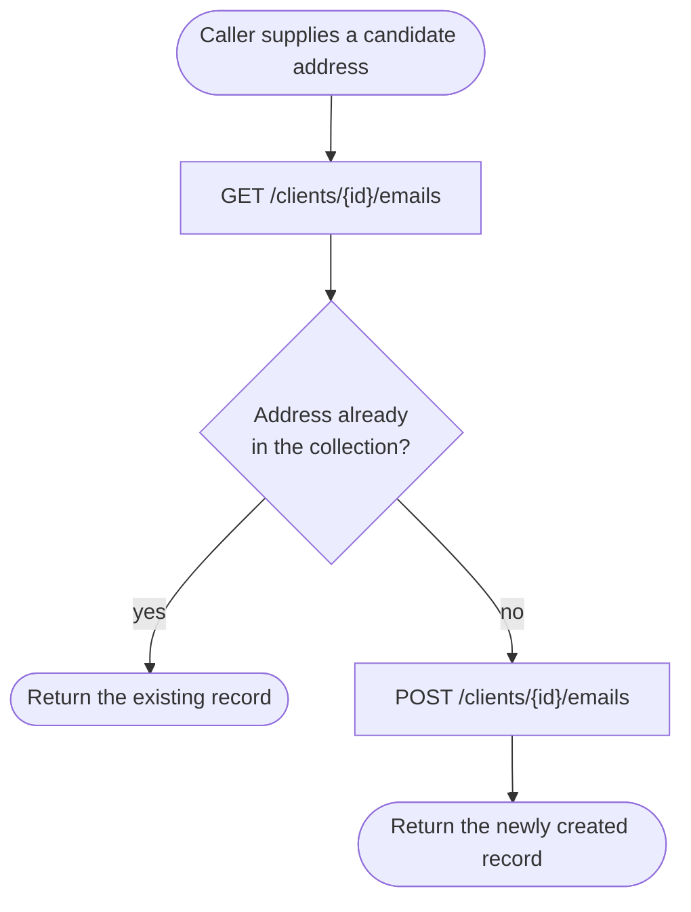
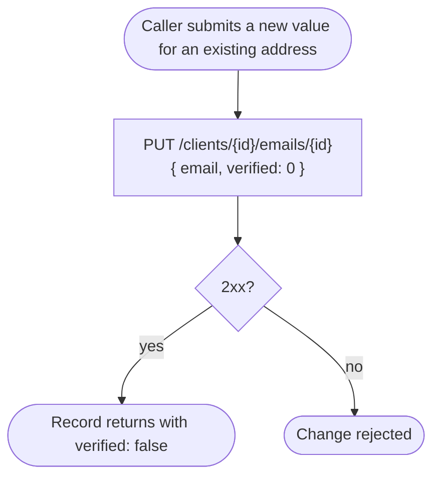
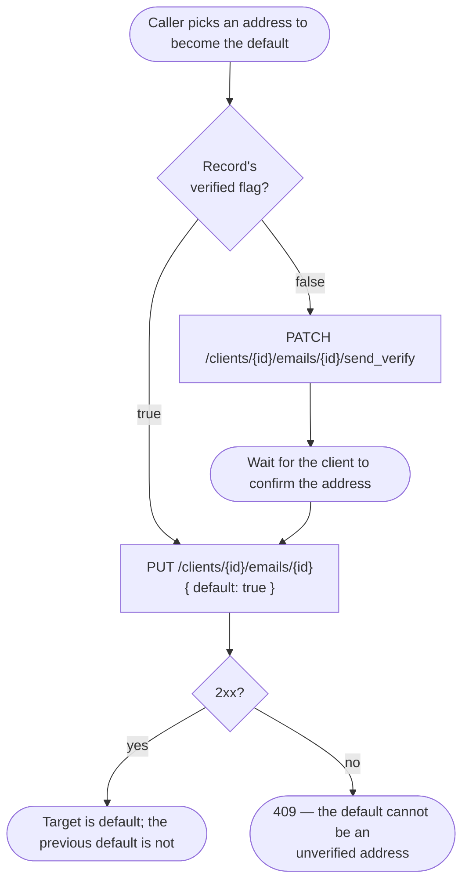

# Module: client-email

## What it is

The **client-email** module covers the collection of email addresses attached to a single client account: read the list, read one entry, add an address, change one, delete one, mark one as the default, and ask for a fresh verification message. Every operation acts on one client's own collection — the addressed client is fixed when the collection or the editor is opened, and no operation reaches across accounts.

Confirming ownership of an address — entering a one-time code, or following a clicked verification link — is a related but separate capability that lives outside this collection. What this collection owns is narrower: asking the platform to (re-)send a verification message to a given address.

Two working surfaces sit over the same data: a **collection**, read and acted on row by row, and a **single-address editor** used to add or change one address through a validated form. Both address the same client and share one cached read, so a save made through the editor is reflected the next time the collection is read.

## Core concepts

- **Email address record** — one entry in a client's collection: the address itself plus status flags for default, verification, bounce, and deletability.
- **Default address** — the single record flagged as the client's default contact address. Promoting a different record un-defaults the previous one.
- **Verification** — whether an address has been confirmed as belonging to the client. This collection can request that a verification message be sent; it never accepts a code or a click-through result back.
- **Bounced** — a platform-observed delivery failure against an address, with the timestamp of the most recent one.
- **Deletability** — a per-record signal for whether an address can currently be removed (for example, protecting a client's only or default address).
- **Find-or-create** — resolving a candidate address to a record already in the collection, or creating one when no match exists, as a single step.

## Operations

| #  | Capability                               | Inputs                                                                                     | Outputs                                                                                                        |
|----|------------------------------------------|--------------------------------------------------------------------------------------------|----------------------------------------------------------------------------------------------------------------|
| 1  | **List one client's email addresses**    | optional page size + offset                                                                | Array of address records, each carrying its status flags, plus a total count                                   |
| 2  | **Read one email address by id**         | address id                                                                                 | The single address record                                                                                      |
| 3  | **Add an email address**                 | address                                                                                    | The created address record                                                                                     |
| 4  | **Change an email address**              | address id, new address value                                                              | The updated record; the record's verification flag is reset                                                    |
| 5  | **Delete an email address**              | address id                                                                                 | Confirmation; the record is gone from the collection                                                           |
| 6  | **Set an email address as the default**  | address id                                                                                 | The updated record; the previously default record is no longer default. Rejected when the target is unverified |
| 7  | **Request a fresh verification message** | address id                                                                                 | Confirmation that a message was requested                                                                      |
| 8  | **Check an address before sending it**   | candidate address                                                                          | Accepted, or which field is wrong and why. No call leaves the client                                           |
| 9  | **Find or create an address**            | candidate address                                                                          | The matching existing record, or a newly created one                                                           |
| 10 | **Filter the collection**                | one column predicate — an email substring, or an exact verified / bounced / default status | The list narrowed to matching addresses. A bare free-text search term is NOT honoured — see note below         |
| 11 | **Sort the collection**                  | a sortable field (`created_at`, `email`, `default`) and a direction                        | The list re-ordered                                                                                            |
| 12 | **Page through the collection**          | page size, page direction                                                                  | The next or previous page of the list                                                                          |
**Additional always-on behaviours:**

- Reporting whether the collection is addressable at all — that is, whether a client has been resolved to read on behalf of.
- Reporting whether the list is loading, empty, or errored, and signalling when it is ready to read.
- Re-reading the collection from the server on demand.
- Marking the cached collection stale so the next read re-fetches it.
- Reporting the editor's own progress: ready, changed, valid, saving, finished, and whether the address being edited is new.

## Data shape

The record returned for each address:

```ts
type EmailAddressRecord = {
  id: string;
  import_id: string | null;
  staged_import: boolean;
  external_id: string | null;
  client_id: string;
  user_id: string; // the platform user who created the record; "sys" for system-created
  type: number; // record category — every record in this collection returns 1
  default: boolean; // this address is the client's default contact address
  verified: boolean; // confirmed as belonging to the client
  email: string;
  receive_emails: boolean;
  bounced: boolean; // the platform has flagged a delivery failure against this address
  created_at: string; // "YYYY-MM-DD HH:mm:ss", space-separated — not ISO-8601 with a "T"
  updated_at: string;
  bounced_at: string | null;
  can_delete: boolean; // whether the platform currently allows removing this record
};
```

> The `default` and `verified` fields are declared as a `0`/`1` numeric flag in the shared type contract; every capture of this collection's reads returns them as JSON booleans. The captured wire shape is followed here.
>
> The create response is **narrower than the read response**: it omits `import_id`, `staged_import`, `external_id`, `receive_emails`, `bounced` and `bounced_at`. See the POST sample below.

Every response is wrapped in the same envelope:

```ts
type Envelope<T> = {
  status: "ok" | "error";
  data: T | null;
  related: unknown | null;
  total: number | null; // populated on list reads; matches the x-total-count header
  error: {
    id: string;
    type: number;
    code: number; // mirrors the HTTP status
    message: string;
    data: unknown[];
  } | null;
  messages: string[] | null;
  meta: null;
};
```

Request bodies (inputs to the mutation capabilities):

```ts
// Add (capability 3)
type AddAddressBody = { email: string };
// No category or type field is sent — the platform assigns the record's type.

// Change the address value (capability 4)
type EditAddressBody = {
  email: string;
  verified: 0; // sent on every change, as the numeric flag — see Lessons
};

// Set as default (capability 6)
type SetDefaultBody = { default: true };
```

## Dependencies

### Dependants — collections that read from this one

| Consumer                          | Weight | Reads                                                                                                       | Why                                                                                  |
| --------------------------------- | ------ | ----------------------------------------------------------------------------------------------------------- | ------------------------------------------------------------------------------------ |
| Client contact-record composition | 3      | the client's default address, the full address list, find-or-create by address, the list's readiness signal | reusing or creating a client's own address while assembling a related contact record |
| Billing-detail composition        | 2      | the client's default address, the full address list, the list's readiness signal                            | the same reuse pattern while composing a client's billing contact details            |

The HTTP transport layer and app-level navigation reference this collection as they do most others; they are not domain consumers and are excluded from the table.

### This collection's own dependencies

- **Active client session** — supplies the acting client's id when no other client is named, and gates every read and mutation on being authenticated.
- **HTTP transport layer** — bearer-token attachment, URL construction, error normalisation, response caching and invalidation.
- **Localisation** — translates the caller-facing text attached to a rejected read or save.
- **Shared types / enums** — the address record's canonical shape and the role type used to express "acting as the client, on their own behalf".

## API endpoints

### GET /clients/{clientId}/emails

Role: lists one client's email addresses. Called whenever the collection is opened or re-read. Accepts `limit` and `offset` query parameters (with no page size the whole collection returns in a single response), `filter[<column>|<operator>]` parameters for narrowing (`filter[email|like]=%text%`, `filter[verified|eq]=1`/`0`, `filter[bounced|eq]=1`/`0`, `filter[default|eq]=1`/`0`), and `order=` for sorting (`order=created_at` ascending, `order=-created_at` descending, comma-separated for multiple keys — e.g. `order=-default,created_at`). A bare free-text search term (`q=`, `query=` or `search=`) is **not honoured** — it returns the unfiltered collection, so a search box must bind a `filter[…|like]` parameter on a specific column instead.

```bash
curl "$API/clients/25d96e76-3ed0-913d-d52c-417482528340/emails" \
  -H "Authorization: Bearer $ACCESS_TOKEN" \
  -H "Accept: application/json"
```

Sample response (`200`):

```json
{
  "status": "ok",
  "data": [
    {
      "id": "20e43579-5e78-d184-430c-31643202d986",
      "import_id": null,
      "staged_import": false,
      "external_id": null,
      "client_id": "25d96e76-3ed0-913d-d52c-417482528340",
      "user_id": "sys",
      "type": 1,
      "default": true,
      "verified": true,
      "email": "mock-email-1@example.com",
      "receive_emails": false,
      "bounced": false,
      "created_at": "2025-06-02 16:00:35",
      "updated_at": "2026-04-17 13:26:16",
      "bounced_at": null,
      "can_delete": false
    }
  ],
  "related": null,
  "total": 1,
  "error": null,
  "messages": [],
  "meta": null
}
```

The response also carries an `x-total-count` header with the overall count, which matches the envelope's `total`.

Fixture: `__tests__/fixtures/get-clients-id-emails.json`

**Paged variant** — `?limit=2&offset=0` returns the first two records with `total: 3` and `x-total-count: 3`; `?limit=2&offset=2` returns the third. Both responses carry the same record shape as above.

Fixtures: `__tests__/fixtures/get-clients-id-emails-case-page-1.json`, `__tests__/fixtures/get-clients-id-emails-case-page-2.json`

Two notes on reading these captures together: the record counts differ between the unpaged and paged samples because the captures were recorded across a sequence that created and deleted addresses, not because the two reads disagree. And filtering/sorting are further query parameters on this same endpoint — only the paging parameters appear in these particular capture files, but the `filter[column|operator]` / `order=` grammar itself is evidenced independently: it is the same grammar already live on other endpoints (e.g. `filter[provision_blueprint.category.code|neq]` on the product catalogue), and this collection's own client library asserts the literal outbound params it produces against a recorded corpus and shows them taking effect in a live rendering (see [README.md](./README.md#playground)).

### GET /clients/{clientId}/emails/{emailId}

Role: reads a single address by id. Called when one address is opened for editing and the full collection has not been read.

```bash
curl "$API/clients/25d96e76-3ed0-913d-d52c-417482528340/emails/d7382485-0793-15e5-770b-81e642d59e06" \
  -H "Authorization: Bearer $ACCESS_TOKEN" \
  -H "Accept: application/json"
```

Sample response (`200`):

```json
{
  "status": "ok",
  "data": {
    "id": "d7382485-0793-15e5-770b-81e642d59e06",
    "import_id": null,
    "staged_import": false,
    "external_id": null,
    "client_id": "25d96e76-3ed0-913d-d52c-417482528340",
    "user_id": "sys",
    "type": 1,
    "default": false,
    "verified": false,
    "email": "mock-email-2@example.com",
    "receive_emails": false,
    "bounced": false,
    "created_at": "2026-08-05 16:43:32",
    "updated_at": "2026-08-05 16:43:32",
    "bounced_at": null,
    "can_delete": true
  },
  "related": null,
  "total": null,
  "error": null,
  "messages": [],
  "meta": null
}
```

Fixture: `__tests__/fixtures/get-clients-id-emails-id.json`

### POST /clients/{clientId}/emails

Role: adds a new address to the client's collection.

Request body: see `AddAddressBody` above.

```bash
curl -X POST "$API/clients/25d96e76-3ed0-913d-d52c-417482528340/emails" \
  -H "Authorization: Bearer $ACCESS_TOKEN" \
  -H "Content-Type: application/json" \
  -d '{ "email": "mock-email-2@example.com" }'
```

Sample response (`200`) — note the reduced field set:

```json
{
  "status": "ok",
  "data": {
    "email": "mock-email-2@example.com",
    "type": 1,
    "verified": false,
    "default": false,
    "user_id": "sys",
    "client_id": "25d96e76-3ed0-913d-d52c-417482528340",
    "updated_at": "2026-08-05 16:43:32",
    "created_at": "2026-08-05 16:43:32",
    "id": "d7382485-0793-15e5-770b-81e642d59e06",
    "can_delete": true
  },
  "related": null,
  "total": null,
  "error": null,
  "messages": [],
  "meta": null
}
```

Fixture: `__tests__/fixtures/post-clients-id-emails.json` (captures the request body as well as the response)

### PUT /clients/{clientId}/emails/{emailId}

Role: this one endpoint serves two distinct intents, discriminated by the request body.

**Changing the address value** — request body: see `EditAddressBody` above. `verified` is sent as the numeric `0`, not the boolean the response returns.

```bash
curl -X PUT "$API/clients/25d96e76-3ed0-913d-d52c-417482528340/emails/d7382485-0793-15e5-770b-81e642d59e06" \
  -H "Authorization: Bearer $ACCESS_TOKEN" \
  -H "Content-Type: application/json" \
  -d '{ "email": "mock-email-3@example.com", "verified": 0 }'
```

Sample response (`200`):

```json
{
  "status": "ok",
  "data": {
    "id": "d7382485-0793-15e5-770b-81e642d59e06",
    "import_id": null,
    "staged_import": false,
    "external_id": null,
    "client_id": "25d96e76-3ed0-913d-d52c-417482528340",
    "user_id": "sys",
    "type": 1,
    "default": false,
    "verified": false,
    "email": "mock-email-3@example.com",
    "receive_emails": false,
    "bounced": false,
    "created_at": "2026-08-05 16:43:32",
    "updated_at": "2026-08-05 16:43:33",
    "bounced_at": null,
    "can_delete": true
  },
  "related": null,
  "total": null,
  "error": null,
  "messages": [],
  "meta": null
}
```

Fixture: `__tests__/fixtures/put-clients-id-emails-id.json`

**Marking the address as the default** — request body: see `SetDefaultBody` above.

```bash
curl -X PUT "$API/clients/25d96e76-3ed0-913d-d52c-417482528340/emails/20e43579-5e78-d184-430c-31643202d986" \
  -H "Authorization: Bearer $ACCESS_TOKEN" \
  -H "Content-Type: application/json" \
  -d '{ "default": true }'
```

Sample response (`200`):

```json
{
  "status": "ok",
  "data": {
    "id": "20e43579-5e78-d184-430c-31643202d986",
    "import_id": null,
    "staged_import": false,
    "external_id": null,
    "client_id": "25d96e76-3ed0-913d-d52c-417482528340",
    "user_id": "sys",
    "type": 1,
    "default": true,
    "verified": true,
    "email": "mock-email-1@example.com",
    "receive_emails": false,
    "bounced": false,
    "created_at": "2025-06-02 16:00:35",
    "updated_at": "2026-04-17 13:26:16",
    "bounced_at": null,
    "can_delete": false
  },
  "related": null,
  "total": null,
  "error": null,
  "messages": [],
  "meta": null
}
```

Fixture: `__tests__/fixtures/put-clients-id-emails-id-case-set-default.json`

The same body against an **unverified** address is rejected — see Failure modes.

### DELETE /clients/{clientId}/emails/{emailId}

Role: removes an address the platform currently marks deletable.

```bash
curl -X DELETE "$API/clients/25d96e76-3ed0-913d-d52c-417482528340/emails/d7382485-0793-15e5-770b-81e642d59e06" \
  -H "Authorization: Bearer $ACCESS_TOKEN" \
  -H "Accept: application/json"
```

Sample response (`200`):

```json
{
  "status": "ok",
  "data": null,
  "related": null,
  "total": null,
  "error": null,
  "messages": [],
  "meta": null
}
```

Fixture: `__tests__/fixtures/delete-clients-id-emails-id.json`

### PATCH /clients/{clientId}/emails/{emailId}/send_verify

Role: requests a fresh verification message for the given address. Takes no body.

```bash
curl -X PATCH "$API/clients/25d96e76-3ed0-913d-d52c-417482528340/emails/d7382485-0793-15e5-770b-81e642d59e06/send_verify" \
  -H "Authorization: Bearer $ACCESS_TOKEN" \
  -H "Accept: application/json"
```

Sample response (`200`):

```json
{
  "status": "ok",
  "data": null,
  "related": null,
  "total": null,
  "error": null,
  "messages": [],
  "meta": null
}
```

Fixture: `__tests__/fixtures/patch-clients-id-emails-id-send-verify.json`

## Failure modes

### Defaulting an unverified address is rejected — `409`

Trigger: `PUT /clients/{clientId}/emails/{emailId}` with `{ "default": true }` against a record whose `verified` is `false`.

Response shape — `status: "error"`, `data: null`, and the reason in `error`:

```json
{
  "status": "error",
  "data": null,
  "related": null,
  "total": null,
  "error": {
    "id": "7f6e0474ece629c847bd86c8b72a5c7c6edae9a0",
    "type": 0,
    "code": 409,
    "message": "The default email cannot be changed to unverified email address!",
    "data": []
  },
  "messages": null,
  "meta": null
}
```

Recovery: the address has to be verified first — request a verification message for it (`PATCH …/send_verify`), and retry the promotion once the record comes back `verified: true`. The record's own `verified` flag read from the list is the signal that predicts this rejection.

Fixture: `__tests__/fixtures/put-clients-id-emails-id-case-set-default-unverified.json`

### No addressable client → no request at all

Every read and mutation resolves the target client first. With no authenticated session, or with a session that authenticates without resolving a client, no request is issued and the operation is rejected locally. This is a hard local stop, not a request that goes out and fails: there is no HTTP exchange to observe.

### Soft failures

No soft-failure path has been observed on these endpoints. Both `data: null` responses (delete, verification request) are plain acknowledgements with `status: "ok"` and no warning channel populated; the mutation responses return the affected record in full. The one shape divergence to plan around is the create response's reduced field set, documented above — not a downgrade, but a caller reading `bounced_at` straight off a create response finds it absent rather than `null`.

### Not captured

The rejection shape when the platform declines to delete a record it marked `can_delete: false` has not been observed. The flag is documented as informational until a rejection response is captured.

## Flows

### Find-or-create an address

One-line purpose: resolve a candidate address to a record without creating a duplicate.



Guarantees the platform holds: calling this twice with the same address never produces two records for it.

Constraints the caller has to plan around: the match is decided against whatever the list read returned — the decision waits for that read to complete, and an address created by another session after the read lands is not seen.

### Changing an address resets its verification

One-line purpose: show the side effect a caller must plan around when changing an address's value.



Guarantees the platform holds: an edited address is never left marked verified for the value it had before the edit.

Constraints the caller has to plan around: a fresh verification request is a separate, later step — re-verification after a change is not automatic, and an address that was the default before the change is now an unverified default.

### Promote an address to default

One-line purpose: show why a promotion can fail on a record the caller can see.



Guarantees the platform holds: exactly one record in the collection carries the default flag; promoting one demotes the other in the same call.

Constraints the caller has to plan around: the verified precondition is enforced server-side, so a caller that promotes without checking the flag sees a `409` rather than a silent no-op.

## Lessons (hard-won)

- **Changing an address resets its verification even when the submitted value matches what's already stored.** A caller that treats the change endpoint as a generic "save" — including when nothing actually changed — unverifies an already-verified address every time.
- **The verified precondition on defaulting is enforced by the platform, but nothing enforces it before the request goes out.** A record's own `verified` flag is the only warning available client-side, and it reflects what the last read reported rather than the state at the moment of the call.
- **Adding an address carries no category or type field.** Every new record receives the same platform-assigned type, so a caller wanting to distinguish a billing address from a primary one inside this collection has no field for it.
- **The create response is a different shape from the read response.** Fields present on every listed record are simply absent from the created one, so code that maps both through a single reader hits undefined where it expected null.
- **The `verified` flag crosses the wire in two forms.** Reads return JSON booleans; the change request sends the numeric `0`. A caller that mirrors the read shape back on a write is sending a different type than the captures show.
- **Timestamps are space-separated, not ISO-8601.** `"2026-08-05 16:43:32"` parses inconsistently across languages and runtimes compared with the `T`-separated form.
- **The whole collection is read in a single unpaged request unless a page size is asked for.** Paging and filtering exist, but with no page size the entire collection returns in one response, so most integrations never observe more than one page — and paging bugs surface only for the callers who opt in.
- **Find-or-create only matches against what the list read returned.** The check waits for that read to finish rather than issuing a dedicated lookup, so its answer is exactly as fresh as the list.
- **No request reaches the network without a resolved client.** An integration exercised at an unauthenticated moment, or during the window before the session resolves which client it belongs to, sees an immediate local rejection rather than a request that goes out and fails.
- **The count arrives twice.** List reads carry the total in both the response envelope and an `x-total-count` header; the two agreed in every capture, but a caller has to pick one and stay with it.
- **A bare free-text search parameter is a live no-op, not a partial match.** `q=`, `query=` and `search=` all return the collection unfiltered — nothing about the request fails, so a caller relying on any of them ships a search box that silently does nothing. Filter on a specific column (`filter[email|like]=%text%`) instead.
- **An unrecognised `filter[…]` column or `order=` field is a `500`, not an empty result.** Every filterable column and sortable field this collection accepts is listed under Operations above; asking for one outside that list is a server error to plan around, not a degrade to a wider or unfiltered result.
