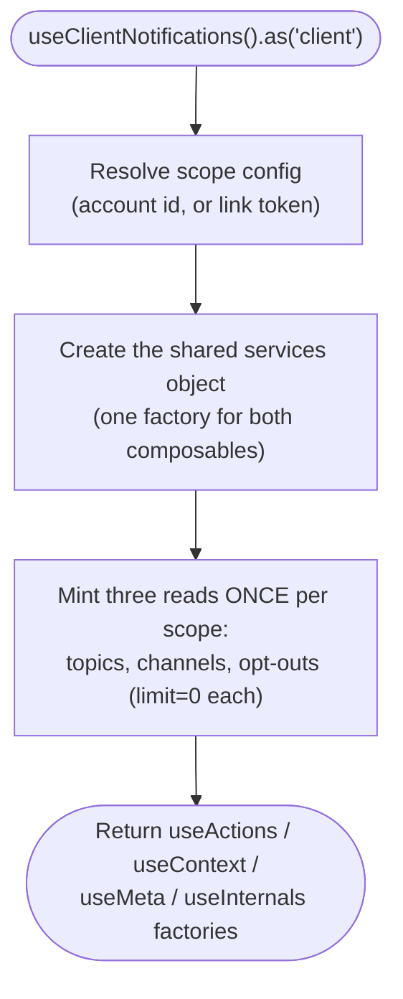
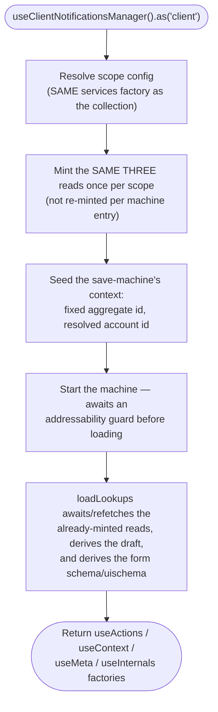
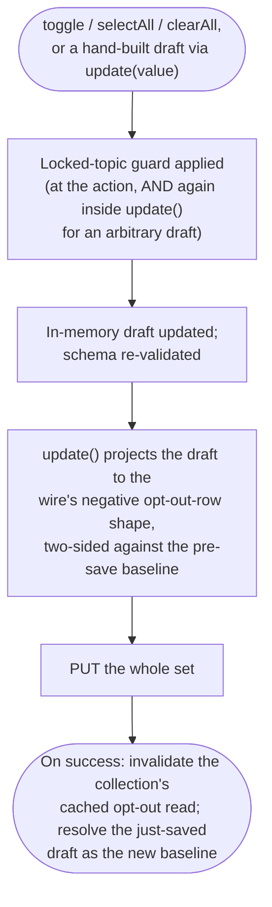

# client-notifications — Architecture

## Overview

This is a **hybrid** module (ADR-001): one file pair of scope matrices, two independently scoped composables sharing one services/mappers layer. The collection (`useClientNotifications`) is query-backed — a plain cached read with no state machine. The editor (`useClientNotificationsManager`) is backed by the shared data-manager machine, seeded with a fixed synthetic aggregate id (`opt-outs`) because the underlying resource has no per-record identity: every save is a full-set `PUT`, never a per-row create/update.

Both composables declare the **same shape** of scope matrix — every actor cell `never` — because every one of the three server resources is account-implicit; there is no server-side address a staff `.for('client', id)` retarget could resolve against (ADR-001's actor x context matrix, cited here as the governing structure, not restated). `guest` is live on `.as()` on both halves via `.withId(token)`; the matrix governs `.for()` only, and withholds it from every actor including guest.

## Data Flow

### Instantiation — the collection

### Instantiation — the editor

### Mutation flow

### How a save in the editor reaches the collection

Both composables' opt-out read shares one cache key, salted by account id and link token together (see "Identity and cache keying" below). A successful save invalidates that exact key, so an already-open collection instance re-reads and reflects the change on its next access — there is no direct call from the editor into the collection; the two agree only through the shared cache.

## Sub-composables

Both composables return the platform's uniform four-layer shape: `useActions`, `useContext`, `useMeta`, `useInternals`. Neither earns an actor-specific arm on any layer (see "Arms" below) — every factory is the same function regardless of which actor scope invoked it.

## Services

One services factory (`createClientNotificationsServices`) serves both composables — one identity resolution, one set of cache keys, one addressability predicate. The factory takes the scope config and resolves:

- **The acting account's id**, through the platform's shared identity-resolution seam (never a direct, second read of the ambient session) — this is what keeps a staff session from silently resolving _its own_ id and reading the session-implicit endpoint as itself, since `.as('staff')` still compiles even though no retarget capability is claimed by that path.
- **The link token**, read once off the scope's own address parameter, never off ambient session state.
- **One addressability predicate** — "a token is present, OR the session is authenticated and an account id is resolved" — computed once and read by every read's request guard and by the published readiness state alike, never recomputed per layer.

### Identity and cache keying

- Topics and channels are brand-wide reference data — the same for every caller — and are cached under a plain, unsalted key.
- The opt-out read and the save both key on **account id AND link token together**. Both limbs are necessary: account id alone collides two different guests (both `undefined`); token alone collides two different signed-in accounts (both absent). This salting is a deliberate adoption of the platform's own prior behaviour on this endpoint, not a new mechanism invented here.
- A save's cache invalidation is salted identically to the read it corresponds to — an unsalted invalidation would evict, and stampede a refetch for, every other identity's cached entry too.

### Arms

Every layer (services, schemas, actions, context, meta) is **armless** — no actor earns its own variant file. The reasoning is the same for every layer: the identity-resolution seam branches on the resolved scope _context_, and this module declares no context at all (every matrix cell `never`), so the seam collapses to one path regardless of which actor called it. The generated form schema/uischema likewise derives from the same topic/channel lookup regardless of actor, so the derived field set is identical by construction. A shared resolution seam exists in the schemas layer specifically so that an actor arm _could_ be added later without restructuring — it is wired to a live call site today, even though nothing currently populates it.

## Errors

- A read's failure is captured per-query and surfaced through the collection's `error` context member and its meta flags; it does not throw synchronously into a caller awaiting `isReady()`.
- A save's rejection (server-side, or local schema validation) is captured as machine-held state (`useContext().error`, `.validationErrors`), never re-raised as a thrown exception a caller must catch — the editor's `hasError` meta flag is the intended read path.
- A rejected save preserves the caller's draft; a draft that fails local schema validation is discarded and replaced by the rejected payload (see gotchas.md for the caveat this currently carries).

## Dependencies

### This module reads from

- **Active session** — the acting account's id (when signed in) and the bearer credential attached to every non-link-token request.
- **HTTP transport / query platform** — request construction, response caching, invalidation.
- **Localisation** — the save-validation failure message.

### Modules that read from this one

None today — this is a leaf preferences surface with no shared reference data another domain module consumes.

## Integration Points

- **The playground's generic form-flow surface** drives the editor entirely through the published `schema`/`uischema` pair and its existing generic "open a form, save it" handoff path — no bespoke per-cell grid component was added to the shared playground runtime to make this work; the shared runtime stays untouched, and the module side publishes a real, non-empty form definition instead.
- **The playground's generic table renderer** drives the collection as one row per topic, with the locked-topic flag surfaced as a badge derived from the same `canOptOut` field the write-side guard reads — never a second source of truth.

## Module boundary

- This module owns **preferences only** — topics, channels, and the opt-out set. It does not own an inbox, a message feed, or a "mark read" capability; those, if they exist on the platform, belong to a different module.
- This module does not own **channel or topic administration** — creating, renaming, or configuring a topic/channel is out of scope; this module only reads the resulting lists.
- This module does not own **staff-on-behalf-of-client** notification management — every endpoint here is account-implicit, with no server-side address for a retarget to resolve against.

## What this module does not do

- It does not provide a way to page, filter, or sort any of its three reads beyond the fixed full-set request every read already issues — no oracle-confirmed capability exists for any of those on this module's endpoints.
- It does not expose the guest link token on any published surface, including its own debugging/internals surface.
- It does not expose the raw underlying read objects on its debugging surface — only a narrowed, read-only projection.
