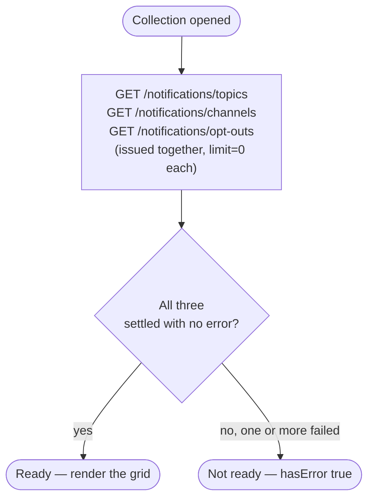
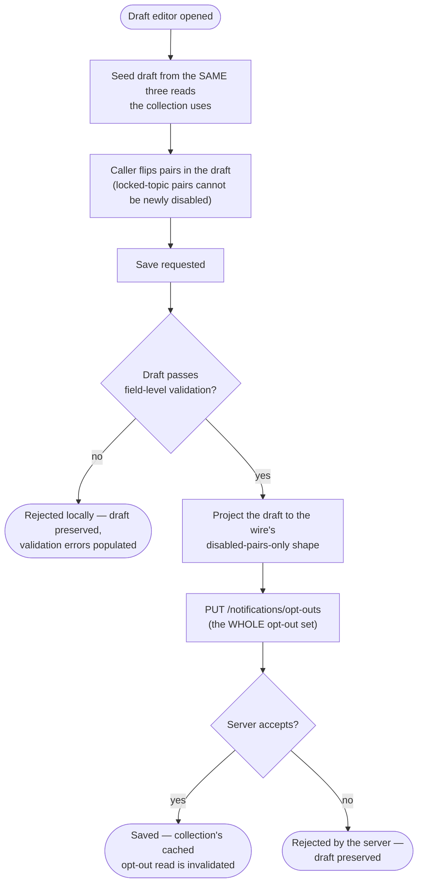

# Module: client-notifications

## What it is

The **client-notifications** module covers an account's notification **preferences** — which combinations of notification topic and delivery channel currently reach that account. It does not carry an inbox, a message list, or a mark-as-read capability; it is a preferences surface only.

Two working surfaces sit over the same three server resources: a **collection**, which reads the current topic list, channel list, and opt-out set for display, and a **draft editor**, which lets a caller build up changes to the opt-out set and save the whole set in one request. Both surfaces address the same account and share the same cached reads, so a save made through the editor is reflected the next time the collection re-reads.

There is no capability here for one account to read or change another account's preferences. The only two addressing modes are: the signed-in account itself, or a single-use link token that identifies one specific account without a sign-in (the mechanism behind an emailed "manage your notification preferences" link). A staff operator acting on behalf of a client is not supported — every one of the three server resources this module reads and writes carries no target-account identifier at all, so there is nothing in the resource's own address to redirect to another account.

## Core concepts

- **Topic** — a category of notification (e.g. billing, marketing, security). Every topic in the account's list is a candidate for opt-out.
- **Channel** — a delivery mechanism for a notification (e.g. email, in-app). This module always reads the subset of channels that can reach an end-account recipient, never an internal/staff-only channel.
- **Locked topic** — a topic flagged `canOptOut: false`: ineligible for opt-out at all, on either surface, enforced at the point of the write itself rather than only in a caller's own presentation of the choice. The rule is two-sided: it only ever blocks a pair from being **newly** disabled on a locked topic. A pair that was already disabled on that topic _before_ it became locked — a real, recorded state (a topic can become mandatory after an account already opted out of it) — is left exactly as it was by an unrelated save. A version of this rule that strips every locked-topic row unconditionally on every save would silently re-enable that pre-existing choice the next time the account saved anything else at all, which is a real data loss this module's history has hit twice (see "Lessons (hard-won)").
- **The opt-out inversion** — the single most important fact about this module's data. See its own section below; it governs both reading and writing.
- **The draft** — the editor's in-memory copy of the opt-out state, built from the same three reads the collection uses. Changes accumulate in the draft; nothing reaches the server until the draft is explicitly saved.
- **The link token** — a single-use identifier that stands in for a sign-in. See "The guest link token" below.

### The opt-out inversion

The preference model presented to a caller reads **positively**: a topic/channel pair is a plain `true`/`false`, and `true` means "this notification is enabled — it will be delivered." That is the opposite of how the server represents the same fact.

On the wire, there is no "enabled" flag anywhere. The server holds an **opt-out list** — one row per topic/channel pair that is currently **disabled**. A pair with no row in that list is enabled; a pair with a row present is disabled. Reading the positive model out of the negative wire list, and writing the positive model back as a negative wire list, is a projection this module performs at its two boundaries — reading, and saving — and nowhere else. A caller of this module never sees the opt-out list shape directly; a caller integrating against the raw HTTP surface directly (bypassing this module) sees only the negative list and must perform the inversion itself.

This inversion is also why a truncated read is dangerous: a topic/channel pair that is silently dropped from a page-limited read of the opt-out list is not "missing information" — it renders, unambiguously, as **enabled**. This is why all three reads always request the complete set (see "API endpoints" below).

### The guest link token

A caller identified only by a link token (no sign-in) is addressed differently at the transport level than a signed-in caller:

- The token rides the request as a URL query parameter (`?token=...`), never as an authorization header.
- The token also distinguishes one token-identified caller's cached reads from another's and from a signed-in caller's — two different tokens are treated as two completely independent identities, never sharing a cached result.
- The token is deliberately not exposed anywhere a caller of this module could read it back out — not on the returned data, not in a thrown error's payload, not on any debugging/diagnostic surface this module offers. A capability that returns the account's own preferences must never also hand the token back to the code that already had it, because anywhere the token is echoed becomes a second place it can leak from (logs, a monitoring service, a rendered error).

The reason the cache separation matters: a token distinguishes one specific account. Two different link tokens necessarily belong to two different accounts (or the same account's link minted twice), and serving one token's cached preferences to a request made under a different token would show one person another person's notification settings.

## Operations

| #   | Capability                                                           | Inputs                               | Outputs                                                                                                  |
| --- | -------------------------------------------------------------------- | ------------------------------------ | -------------------------------------------------------------------------------------------------------- |
| 1   | **Read the full topic list**                                         | none (an implicit account)           | Every topic, each with its name, description, and whether it can be opted out of                         |
| 2   | **Read the full channel list**                                       | none                                 | Every channel that can reach an end-account recipient                                                    |
| 3   | **Read the full opt-out set**                                        | none                                 | Every currently-disabled topic/channel pair                                                              |
| 4   | **Check whether a topic/channel pair is enabled**                    | topic id, channel id                 | `true`/`false`, read from the server-held state                                                          |
| 5   | **Open a draft editor for the same account**                         | none, or a link token                | A draft seeded from the same three reads, ready to accept changes                                        |
| 6   | **Flip one topic/channel pair in the draft**                         | topic id, channel id                 | The draft's in-memory state changes; refused with no effect on a locked topic                            |
| 7   | **Enable / disable every channel for one topic in the draft**        | topic id                             | Every pair for that topic set in the draft; refused with no effect on a locked topic                     |
| 8   | **Check whether every channel is enabled for a topic, in the draft** | topic id                             | `true`/`false`                                                                                           |
| 9   | **Discard the draft, restoring the last-saved state**                | none                                 | The draft reverts; nothing is sent to the server                                                         |
| 10  | **Save the draft**                                                   | optionally, a full replacement draft | The whole opt-out set is written in one request; rejects with "nothing to save" when nothing has changed |

**Additional always-on behaviours:**

- Reporting whether the account is currently addressable at all (signed in, or holding a valid-shaped link token).
- Resolving once the collection's three reads have all settled, `false` if any of them failed.
- Re-reading the three lists from the server on demand.
- Reporting the current draft's validity against its own field-level rules, and whether a save is in progress, has finished, or has failed.
- Publishing a ready-to-render form definition (a schema plus a UI layout) describing every topic/channel pair as a single togglable field, generated at read time from whatever topics and channels the account actually has — never a fixed, hand-authored field list.

## Data shape

The two view-model records both surfaces read:

```ts
type NotificationTopic = {
  id: string;
  name: string;
  description: string;
  code: string;
  /** false = this topic cannot be opted out of; always enabled. */
  canOptOut: boolean;
  /** Presentation-only, derived from canOptOut: { isMandatory: boolean }. */
  meta: { isMandatory: boolean };
};

type NotificationChannel = {
  id: string;
  name: string;
  code: string;
};

/** One DISABLED topic x channel pair. Absence from this list means ENABLED. */
type OptOut = { topicId: string; channelId: string };
```

The editor's draft is a different, positive-reading shape — a flat map keyed by a stable `"<topicId>::<channelId>"` string, one entry per topic/channel pair, `true` meaning enabled:

```ts
type NotificationsModel = { preferences: Record<string, boolean> };
```

The wire shapes underneath (every list read shares one envelope):

```ts
type Envelope<T> = {
  status: "ok" | "error";
  data: T[];
  related: unknown | null;
  total: number | null;
  error: unknown | null;
  messages: string[];
  meta: null;
};

type WireTopic = {
  id: string;
  name: string;
  description: string;
  code: string;
  can_opt_out: boolean;
  created_at: string; // "YYYY-MM-DD HH:mm:ss"
  updated_at: string;
  // A `mandatory` boolean is declared in this module's own type but is never
  // present on any recorded topic row — see "Lessons (hard-won)".
};

type WireChannel = {
  id: string;
  name: string;
  code: string;
  created_at: string;
  updated_at: string;
};

type WireOptOut = {
  id: string;
  topic_id: string;
  channel_id: string;
  created_at: string;
  updated_at: string;
};

// The save request body — no id, no timestamps, one row per DISABLED pair:
type OptOutRequestRow = { topic_id: string; channel_id: string };
type SaveBody = { opt_outs: OptOutRequestRow[] };
```

## Dependencies

### Dependants — surfaces that read from this one

No other collection in this codebase reads from this module's data today. It is a leaf preferences surface: notification topics and channels are its own reference data, not shared with another domain collection.

### This module's own dependencies

- **Active session** — resolves the acting account's id when the caller is signed in, and supplies the bearer credential attached to every request except a link-token request.
- **HTTP transport layer** — request construction, response caching and invalidation, error normalisation.
- **Localisation** — the draft editor's save-validation failure message is resolved through the platform's message catalogue.

## API endpoints

### GET /notifications/topics

Role: returns every notification topic the account can see. Called whenever the collection or the editor is opened. Always requested with `limit=0` — the full set, never a server-default page (see "Failure modes").

```bash
curl "$API/notifications/topics?limit=0" \
  -H "Authorization: Bearer $ACCESS_TOKEN" \
  -H "Accept: application/json"
```

```json
{
  "status": "ok",
  "data": [
    {
      "id": "3825d96e-763e-d091-3dc4-174825283406",
      "name": "System",
      "description": "System notifications are essential for the operation and security of your account and cannot be disabled",
      "code": "system",
      "can_opt_out": false,
      "created_at": "2024-01-08 13:56:33",
      "updated_at": "2024-11-22 12:36:42"
    },
    {
      "id": "85d085e6-9d56-2371-9ea2-18e940d42370",
      "name": "Billing",
      "description": "Stay informed with notifications about invoices, payments, and other billing-related events. Never miss a renewal again",
      "code": "billing",
      "can_opt_out": true,
      "created_at": "2024-01-08 13:56:33",
      "updated_at": "2024-11-22 12:36:42"
    }
  ],
  "related": null,
  "total": 6,
  "error": null,
  "messages": [],
  "meta": null
}
```

Fixture: `get-notifications-topics.json`.

### GET /notifications/channels?filter[recipient_types.code]=client

Role: returns every channel that can reach an end-account recipient. The recipient-type filter is a fixed constant always sent on this call — it is not a caller-configurable parameter, because there is exactly one recipient type this data is ever read for.

```bash
curl "$API/notifications/channels?filter[recipient_types.code]=client&limit=0" \
  -H "Authorization: Bearer $ACCESS_TOKEN" \
  -H "Accept: application/json"
```

```json
{
  "status": "ok",
  "data": [
    {
      "id": "3825d96e-763e-d091-3dc4-174825283406",
      "name": "Email",
      "code": "template_mail",
      "created_at": "2019-03-26 10:57:31",
      "updated_at": "2019-03-26 10:57:31"
    },
    {
      "id": "24d03679-424d-0e71-04b3-153698d582e8",
      "name": "In-App",
      "code": "template_websocket",
      "created_at": "2019-03-27 19:03:37",
      "updated_at": "2020-01-29 16:52:27"
    }
  ],
  "related": null,
  "total": 2,
  "error": null,
  "messages": [],
  "meta": null
}
```

Fixture: `get-notifications-channels-filter-recipient-types-code-client.json`.

### GET /notifications/opt-outs

Role: returns every currently-disabled topic/channel pair for the account. Called whenever the collection or the editor is opened. A signed-in caller authenticates the normal way; a link-token caller appends `?token=...` and sends no `Authorization` header at all.

```bash
# Signed in
curl "$API/notifications/opt-outs?limit=0" \
  -H "Authorization: Bearer $ACCESS_TOKEN" \
  -H "Accept: application/json"

# Link token — no Authorization header
curl "$API/notifications/opt-outs?limit=0&token=$LINK_TOKEN" \
  -H "Accept: application/json"
```

```json
{
  "status": "ok",
  "data": [
    {
      "id": "3825d96e-763e-d091-3dc4-174825283406",
      "topic_id": "45952098-d3de-4091-76a3-1578626e347e",
      "channel_id": "3825d96e-763e-d091-3dc4-174825283406",
      "created_at": "2026-04-08 07:24:11",
      "updated_at": "2026-04-08 07:24:11"
    },
    {
      "id": "85d085e6-9d56-2371-9ea2-18e940d42370",
      "topic_id": "45952098-d3de-4091-76a3-1578626e347e",
      "channel_id": "24d03679-424d-0e71-04b3-153698d582e8",
      "created_at": "2026-04-08 07:24:11",
      "updated_at": "2026-04-08 07:24:11"
    }
  ],
  "related": null,
  "total": 2,
  "error": null,
  "messages": [],
  "meta": null
}
```

Fixture: `get-notifications-opt-outs.json`. The recorded capture for this account has exactly two disabled pairs — the illustrative page boundary above, not a stated maximum.

### PUT /notifications/opt-outs

Role: saves the account's WHOLE opt-out set. Called on every editor save. The full list of currently-disabled pairs, never a diff against the previous save — a row omitted from this body that was present in the previous save is thereby re-enabled.

Request body:

```ts
type SaveBody = {
  opt_outs: Array<{
    topic_id: string;
    channel_id: string;
  }>;
};
// No id, no created_at/updated_at on a request row — those exist only on
// the response's echoed rows.
```

```bash
curl -X PUT "$API/notifications/opt-outs" \
  -H "Authorization: Bearer $ACCESS_TOKEN" \
  -H "Content-Type: application/json" \
  -d '{
    "opt_outs": [
      { "topic_id": "45952098-d3de-4091-76a3-1578626e347e", "channel_id": "3825d96e-763e-d091-3dc4-174825283406" }
    ]
  }'
```

```json
{
  "status": "ok",
  "data": [
    {
      "id": "3825d96e-763e-d091-3dc4-174825283406",
      "topic_id": "45952098-d3de-4091-76a3-1578626e347e",
      "channel_id": "3825d96e-763e-d091-3dc4-174825283406",
      "created_at": "2026-04-08 07:24:11",
      "updated_at": "2026-04-08 07:24:11"
    }
  ],
  "related": null,
  "total": null,
  "error": null,
  "messages": [],
  "meta": null
}
```

Fixture: `put-notifications-opt-outs.json` (request and response both captured).

## Failure modes

### An unrecognised sort or filter parameter is a hard failure, not an ignored one

None of the three read endpoints above are proven to accept a sort parameter or any filter beyond the fixed channel-recipient-type constant already shown. An unrecognised `order=` parameter on this platform's list endpoints is answered with an HTTP 500, not a silently-ignored parameter — this is why this module never speculatively declares a sort or filter capability it cannot confirm the server accepts.

### An invalid draft is rejected before it reaches the server

A draft that fails its own field-level validation is never sent to `PUT /notifications/opt-outs` at all; the save rejects locally with a validation-failure message and the field-level errors attached.

### A save touching a locked topic

A save that would newly disable a locked topic's pair is rejected at the pair level before the request is built — see "Locked topic" under "Core concepts" above. A pair that was already disabled on a locked topic _before_ it became locked is left untouched by an unrelated save; it is not force-re-enabled.

### No addressable account → no request at all

With neither a signed-in session nor a link token, none of the three reads fire, and a save is not attempted.

## Flows

### Reading the collection



Guarantees the platform holds: every read that succeeds returns the account's complete list for that resource (never a partial page).

Constraints the caller has to plan around: a failed opt-out read must not be treated the same as a successful empty one — because absence means enabled, presenting a failed read's data would show every pair as enabled regardless of the account's real, last-saved state.

### Editing and saving



Guarantees the platform holds: a save always carries the complete opt-out set, never a diff — a pair omitted from the saved body is thereby re-enabled. A pair on a locked topic that predates the topic's lock survives an unrelated save.

Constraints the caller has to plan around: a save that would newly disable a locked-topic pair is refused before the request is built, regardless of whether the caller went through the per-pair toggle or handed in a whole replacement draft.

## Lessons (hard-won)

- **A positive read-model built over a negative wire list is easy to get backwards, in either direction.** This module's data is the clearest case of it: the account-facing model reads "is this enabled," the wire holds only "which pairs are disabled," and the two are opposites of each other. Most of this module's recorded defects trace back to one direction or the other of that same inversion being wrong.
- **A page-limited read of an absence-means-enabled list is not a smaller correct answer — it is a wrong one.** Because absence means "enabled," a truncated read of the opt-out list makes missing rows silently render as enabled preferences the account never actually chose.
- **A "strip every locked-row" save filter is correct only until a topic locks after a row already exists on it.** A single unconditional "strip every locked-topic row from the save" implementation looks correct until a topic becomes locked _after_ an account has already opted out of it — at which point that unconditional strip silently re-enables the account's own prior, legitimate choice on the very next unrelated save. This has been the single most-repeated defect in this module's own history.
- **A readiness signal built only from "has the request settled" is indistinguishable from "did it succeed."** A caller acting on a readiness signal that does not separately carry failure state sees ready-and-fine after a failed read, and — on this module's own opt-out inversion — that renders a false-positive fully-enabled state, in a preferences surface, on a security- and billing-adjacent domain.
- **An identity token used as a cache key without differentiation collides two different identities.** An identical cache key across two different link tokens serves one account's private preferences to a different account's request — a case a generic HTTP-caching layer does not distinguish on its own.
