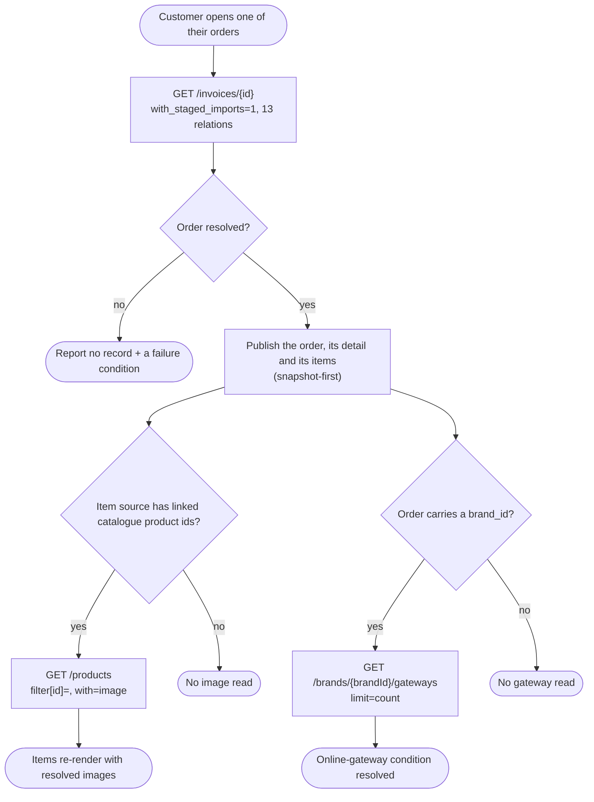

# Module: client-orders

## What it is

`client-orders` is the read view a signed-in customer gets of the orders they themselves have placed. A placed order is an invoice of the "new contract" category — the document the platform produces the moment a customer's basket converts into a billable order, as opposed to a renewal, a one-off add-on, or a credit note against an earlier order. The module offers two working surfaces over that same underlying record: a **history**, which lists, filters, sorts, quick-searches and paginates a customer's own placed orders, and a **detail read**, which loads one order in full — its items, its dates, its custom fields, and the conditions that decide whether the customer can pay it or cancel it. Every read in this module is addressed to the signed-in customer's own identity; there is no path in this module that lets one customer read another customer's orders, and there is no path that lets an operator act on a customer's behalf through it.

The module surfaces the gating conditions for paying and for cancelling an order, and it hands both actions off rather than performing them itself: paying delegates the order to the platform's existing payment capability, and cancelling hands the order's underlying contract off through an injectable seam to a separate contract-cancellation capability that connects to it independently.

**Scope boundaries with sibling capabilities:**

- The full invoice record — every invoice category, not only placed orders, and the wider invoice actions (assigning a payment method, reading another entitled customer's invoices) — is owned by the invoices capability. This module reuses its record-attribution logic (own / delegated) rather than re-deriving it, and otherwise reads and publishes the same underlying record shape, narrowed to the "new contract" category.
- Submitting a payment, handling an inline challenge or an off-site redirect, and confirming settlement are not this module's capability. This module hands the order to a payment capability that owns the whole multi-step payment interaction, and only observes when that capability reports the payment complete.
- Cancelling a subscription contract is not this module's capability either. This module exposes an injectable seam that a contract-cancellation capability connects to; until something connects to that seam, a cancel attempt on an otherwise-eligible order fails with a distinct "nothing is connected yet" outcome rather than silently doing nothing.
- Judging whether an unpaid invoice is still "due" or still eligible to be cancelled reuses the same judgment a sibling contract-product capability already makes for a customer's contract products — this module does not re-implement that judgment for orders.

## Core concepts

- **Placed order** — an invoice of the "new contract" category that a customer placed. Carries its own number, totals, dates, status, items and the contract it provisions. The wider term "invoice" keeps its own, broader meaning in the sibling invoices capability; a placed order is one narrowed reading of that same record type.
- **Order snapshot** — a frozen copy of an order's line items and prices, captured at the moment the order converted. An order's items are read from this snapshot first; only when no snapshot was ever captured does the read fall back to the order's live item relation. A snapshot that was captured but is empty is a real, final answer — it is not treated as "missing" and does not trigger the live fallback.
- **Order item** — one product line of a placed order, together with its billing term, its quantity, its price, its catalogue image, its tags, its contract links, and any of its own sub-items (product options or attributes attached to that line).
- **Order conditions** — the paid / due / overdue / cancellable / part-paid flags, and the pay/cancel gates derived from them, computed from an order's status and its paid/unpaid amounts by the same rules the storefront has always used for a placed order.
- **Cancellation seam** — the one point in this module where an external contract-cancellation capability plugs in. Nothing is wired to it by default; a cancel attempt on an order that would otherwise be cancellable fails distinctly until something registers against the seam.

## Operations

| # | Capability | Inputs | Outputs |
| --- | --- | --- | --- |
| 1 | **Read a filtered, sorted, paginated history of the customer's own placed orders** | optional filters (order number, total amount, status, item name, item category name, service identifier, created date, paid date — each with the comparison the column supports), a sort field and direction, a page window | A page of placed orders, plus the server's reported total across the whole matching history. `GET /invoices`, forced to the "new contract" category on every request. |
| 2 | **Read one placed order in full** | an order id | The order record, its detail fields (number, status, totals, dates, notes, custom fields, contract id, referrer), and its item list (snapshot-first, each item's term/price/tags/sub-items/catalogue image resolved). `GET /invoices/{id}`. |
| 3 | **Read the catalogue images for the items of one order** | the linked catalogue product ids of that order's items | A map from catalogue product id to image URL. `GET /products`, issued only once the order's items are known, and never blocking the order read. |
| 4 | **Check whether the order's brand offers an online payment gateway** | the order's brand id | A yes/no signal, read from the platform's reported total of matching gateways rather than from a page of rows. `GET /brands/{brandId}/gateways`. |
| 5 | **Pay a payable order** | the order | Hands the order to the platform's existing payment capability and republishes its whole return surface under its own names; once that capability reports the payment complete, this module marks the order and the wider order/invoice history stale so the next read reflects it. |
| 6 | **Cancel a cancellable order** | the order | When the order is cancellable, hands the order's contract id to whatever has connected to the cancellation seam and waits for it to complete; marks the order and the wider order/invoice history stale once it does. Resolves with nothing sent when the order is not cancellable, and fails with a distinct outcome when nothing has connected to the seam yet. |

Additional always-on behaviours (not endpoints):

- **Readiness signal** — resolves once the signed-in session has settled and the relevant read (the history, or one order) has completed, success or failure. Always settles, even against a stalled connection, rather than leaving a caller's wait open indefinitely.
- **Refresh** — re-issues the history read or the one-order read against the server. A page re-issues the one-order read every time the customer (re-)opens that order's view, because a previously-opened read can otherwise go stale without the customer noticing.
- **Invalidate** — marks the cached history or the cached one-order read stale so the next read goes back to the server.

### Derived from a loaded order or row (not a BE call)

| Derivation | From | Result |
| --- | --- | --- |
| Order conditions | a loaded order's status and paid/unpaid amounts | Whether the order is paid, due, overdue, cancelled, or part-paid, and the two more specific pay/cancel gates: payable (due, and something is still owed) and cancellable (due, and still in a status the customer may act on). |
| Delegated marker and pending-payment condition | a loaded order, mapped through the invoices capability's own record-attribution logic | Whether this order belongs to someone else who delegated it to the reading customer, and whether any payment on it is still pending. |
| Item name and reference | one order item | A human-readable line name, composed from the item's own name (or its catalogue product's translated name) plus its service identifier when it has one; and a customer-set reference label, when one was set. |
| Item billing term | one order item, against the billing-cycle reference list | Whether the item is a subscription, and — once the reference list has resolved — the human-readable name of its billing cycle. |
| Item catalogue link eligibility | one order item, against the brand's one-time-purchases visibility rule | Whether the item may link through to its catalogue product page — false only when the brand hides one-time purchases and the item carries no subscription term. |
| Item sub-items | one order item's own options and attributes | Two lists — quantifiable and non-quantifiable sub-items — each row named, quantified and priced from the same item. |
| Store visibility and storefront address | the operating brand's configuration | Whether a "browse the store" call-to-action should render for this brand, and the storefront address to send it to. |
| Multi-brand flag | the operating brand's identity | Whether the current deployment spans more than one brand — decides whether the history read also expands the brand relation on each row. |
| Filtered state | the history's own live filter set | Whether any filter other than the forced "new contract" category applies — distinguishes an empty result caused by a customer's own filter choice from a genuinely empty history. |

## Data shape

### Placed order record

A placed order is published as the same record shape documented as `Invoice` in the invoices capability's own foundation doc, narrowed on the wire to the "new contract" category. This module republishes that record unchanged on both the history's rows and the one-order read — it performs no field renaming or remapping of the raw record itself. The two reads differ only in which relations each expands: the history expands a leaner relation set (tags, client, client image, status, products, and the brand relation when the deployment is multi-brand); the one-order read expands a wider set (client, client tags, contract, contract-product tags, custom fields, payments, promotions, status, taxes, and — when it exists — the affiliate referral chain that names the order's referrer).

### History criteria

```ts
type OrderHistoryCriteria = {
  filters?: {
    "category.slug"?: "new_contract"; // forced on every request; not a customer-facing control
    number?: { like?: string; eq?: string; neq?: string };
    total_amount?: {
      eq?: number;
      neq?: number;
      gt?: number;
      gte?: number;
      lt?: number;
      lte?: number;
    };
    "status.code"?:
      | { eq: OrderStatusChoice[] }
      | { neq: OrderStatusChoice[] }; // one comparison at a time, never both together
    created_at?: OrderDateComparison;
    paid_datetime?: OrderDateComparison;
    "products.product.name"?: { like?: string; eq?: string; neq?: string };
    "products.product.category.name"?: {
      like?: string;
      eq?: string;
      neq?: string;
    };
    "products.service_identifier"?: {
      like?: string;
      eq?: string;
      neq?: string;
    };
  };
  sort?: {
    field: "id" | "total_amount" | "status_id" | "created_at";
    dir: "asc" | "desc";
  }[]; // defaults to created_at, newest first
  pagination?: { limit?: number; offset?: number }; // limit defaults to 10
};

// The five status choices offered to a customer. "Unpaid" is ONE choice
// that carries two underlying statuses, sent as a single joined value —
// never as two separate array entries.
type OrderStatusChoice =
  | "invoice_paid"
  | "invoice_unpaid,invoice_adjusted"
  | "invoice_overdue"
  | "invoice_cancelled"
  | "invoice_refunded";

type OrderDateComparison = {
  gt?: string; // absolute moment, "YYYY-MM-DD HH:mm:ss"
  gte?: string;
  lt?: string;
  lte?: string;
  after?: string; // relative period, e.g. "-7_days", "+7_days"
  before?: string;
};
```

### Order detail projection

```ts
import type { IClient as Client } from "@upmind-automation/types";

// Derived from the raw order record once it loads; every field individually
// falls back to `undefined` on a thin record rather than throwing.
type OrderDetail = {
  id: string | undefined;
  number: string | undefined;
  status: { code: string; name: string; order: number } | undefined;
  totalAmountFormatted: string | undefined;
  createdAt: string | undefined;
  paidDatetime: string | undefined;
  dueDate: string | undefined;
  refundChanged: string | undefined;
  cancellationDatetime: string | undefined;
  cancellationReason: string | undefined;
  notes: string | undefined;
  customFields: unknown[] | undefined;
  contractId: string | undefined;
  brandId: string | undefined;
  referrer: Client | undefined; // the order's affiliate referrer, when one exists
};
```

### Order item projection

```ts
// One entry per line in the order's item source (snapshot-first, see Core
// concepts). `billingCycle` resolves only once the billing-cycle reference
// list (a sibling capability's data — see Dependencies) has loaded; it stays
// unresolved until then.
type OrderItem = {
  id: string;
  brandId: string | undefined;
  contractProductId: string | null | undefined;
  contractId: string | null | undefined;
  name: string;
  reference: string;
  period: { from: string; to: string } | undefined;
  quantity: number | undefined;
  price: string | undefined; // formatted, e.g. "£4.00"
  total: string | undefined;
  billingCycleMonths: number;
  isSubscription: boolean;
  billingCycle: { months: number; name: string } | undefined;
  image: string | undefined; // resolved catalogue image URL, or a product fallback image
  tags: unknown[];
  quantifiableItems: OrderSubItem[];
  nonQuantifiableItems: OrderSubItem[];
  hasSubItems: boolean;
  canLink: boolean;
};

type OrderSubItem = {
  id: string;
  name: string;
  quantity: number;
  price: string;
  total: string; // quantifiable sub-items always report "" here
};
```

## Dependencies

### Dependants — capabilities that read from this one

No capability in the codebase reads from `client-orders` yet — it is newly delivered, and the customer-facing pages that will render its history and detail views have not been built against it. Once built, the intended reader is the presentation layer: a customer's order-history list view and single-order view.

### This module's own dependencies

- **HTTP transport layer** — bearer-token attachment, request validation, filter/sort/pagination translation to the wire, error normalisation.
- **Session readiness** — every read in this module gates on the session being authenticated and able to address the signed-in customer; a signed-out caller sends no request from this module at all.
- **[`invoices`](../../invoices/docs/foundation.md)** — this module reuses its record-attribution logic to compute the delegated marker and the pending-payment condition, rather than re-deriving either from the raw record itself.
- **[`contract-product`](../../contract-product/docs/foundation.md)** — this module reuses its due/cancellable judgment for an order's underlying unpaid invoice rather than re-implementing it.
- **[`brand`](../../brand/docs/foundation.md)** — reads the operating brand's identity (to decide whether to expand the brand relation on a multi-brand deployment), its store-visibility setting and storefront address, and its one-time-purchases visibility rule.
- **[`system`](../../system/docs/foundation.md)** — the billing-cycle reference list this module looks up each item's cycle name against is read once by this sibling capability; this module never issues that read itself.
- **A payment capability** — the "Pay a payable order" operation hands the order to it wholesale and republishes its return surface; this module issues no payment request of its own.
- **Shared types / enums** — `IOrder`, `IInvoice`, `IPaymentDetail`, `InvoiceStatus`, `InvoiceStatusGroups`, `InvoiceCategoryCode`, `StoreDisplayMode`, `BrandConfigKeys`, `OnlineGatewayTypes` from the platform's shared model/enum package.

## API endpoints

### `GET /invoices`

Read a filtered, sorted, paginated page of the customer's own placed orders. Every request forces the category filter to `new_contract`; there is no way to widen it from this endpoint. `with_count=products` is always sent so each row also reports its item count.

```bash
curl -s "$API/invoices?filter[category.slug]=new_contract&with=tags,client,client.image,status,products&with_count=products&order=-created_at&limit=10&offset=0" \
  -H "Authorization: Bearer $ACCESS_TOKEN"
```

```json
{
  "status": "ok",
  "total": 919,
  "data": [
    {
      "id": "52098d3d-e409-17e0-d957-c31578626e34",
      "number": "QA-INV-25144",
      "brand_id": "2785d26e-9678-3d16-999f-314502e70439",
      "client_id": "25d96e76-3ed0-913d-d52c-417482528340",
      "created_at": "2026-09-28 14:52:49",
      "due_date": "2026-09-28",
      "paid_datetime": null,
      "total_amount": 4.8,
      "total_amount_formatted": "£4.80",
      "paid_amount": 0,
      "contract_id": "63250798-065d-1e35-34da-8174e234e98d",
      "products_count": 1,
      "display_status": "Unpaid",
      "delegate_related": false,
      "to_be_credited": false,
      "cancellation_datetime": null,
      "refund_changed": null
    }
  ]
}
```

> Sample trimmed for readability — the full response carries every field the invoices capability's own record documents.

**Fixture reference:** [`__tests__/fixtures/get-invoices-case-orders-default.json`](../__tests__/fixtures/get-invoices-case-orders-default.json).

On a deployment spanning more than one brand, `with` additionally carries `,brand`. Each declared filter column emits `filter[<column>|<comparison>]=<value>` — an equal comparison included, with its own suffix rather than a bare `filter[<column>]=<value>`.

### `GET /invoices/{id}`

Read one placed order in full. The wider relation set expands the client (with tags), the contract, contract-product tags, custom fields (with their field definitions), payments, promotions, status, taxes (with per-line breakdown), and — when the order carries one — the affiliate referral chain that names its referrer.

```bash
curl -s "$API/invoices/{orderId}?with_staged_imports=1&with=account.affiliate_referral.affiliate_account.account.client,affiliate_commissions,brand,client,client.tags,contract,contract_product_tags,custom_fields.field,payments,promotions,status,taxes,taxes.tax_tag_data" \
  -H "Authorization: Bearer $ACCESS_TOKEN"
```

```json
{
  "status": "ok",
  "data": {
    "id": "d7382485-0793-153d-6e5e-c81e642d59e0",
    "number": "QA-INV-24815",
    "status": {
      "id": "73de7864-2de5-3971-4ef2-1208469530d0",
      "object_type": "invoice",
      "code": "invoice_paid",
      "order": 3,
      "name": "Paid"
    },
    "total_amount": 4.8,
    "paid_amount": 4.8,
    "contract_id": "03679424-d0e7-1092-962b-3153698d582e",
    "current_data": {
      "content": {
        "products": []
      }
    }
  }
}
```

> Sample trimmed for readability — the captured payload carries the full client, brand, contract, payment, and tax expansions.

**Fixture reference:** [`__tests__/fixtures/get-invoices-id-case-order-paid.json`](../__tests__/fixtures/get-invoices-id-case-order-paid.json). A snapshot-bearing order's captured item source is at [`__tests__/fixtures/get-invoices-id-case-order-snapshot.json`](../__tests__/fixtures/get-invoices-id-case-order-snapshot.json).

An id that does not resolve to an order this customer may read answers with no record; the read reports its own failure condition rather than an item shape.

### `GET /products`

Read the catalogue images for one order's items, addressed by each item's linked catalogue product id — never by the item's own line id, which resolves to a different record entirely. Issued only once the order's items are known, and never blocking the order read itself.

```bash
curl -s "$API/products?filter[id]=3de78642-de53-9714-76df-21208469530d&with=image&limit=1" \
  -H "Authorization: Bearer $ACCESS_TOKEN"
```

```json
{
  "status": "ok",
  "data": [
    {
      "id": "3de78642-de53-9714-76df-21208469530d",
      "name": " Starter Hosting",
      "image": {
        "full_url": "https://api.staging.upmind.io/api/images/3de78642-de53-9714-936a-21208469530d/download"
      }
    }
  ]
}
```

**Fixture reference:** [`__tests__/fixtures/get-products-case-order-images.json`](../__tests__/fixtures/get-products-case-order-images.json).

An item whose linked catalogue product carries no image at this endpoint falls back to that product's own image on the item's own embedded product relation; an item resolved by neither carries no image at all.

### `GET /brands/{brandId}/gateways`

Check whether the order's brand offers an online payment gateway, addressed by the order's own `brand_id` rather than the operating brand's identity — an order from a different brand than the one currently browsing is judged by its own brand. Reads the response envelope's reported total rather than a page of rows.

```bash
curl -s "$API/brands/{brandId}/gateways?limit=count&filter[gateway.type]=1,6,3,10,4" \
  -H "Authorization: Bearer $ACCESS_TOKEN"
```

```json
{
  "status": "ok",
  "data": [],
  "total": 21,
  "error": null,
  "messages": []
}
```

**Fixture reference:** [`__tests__/fixtures/get-brands-id-gateways-case-online.json`](../__tests__/fixtures/get-brands-id-gateways-case-online.json).

**Delegated endpoints (referenced by this module's flows, owned elsewhere):**

- `POST /payments` — submit a payment attempt. Owned by the payment capability.
- The contract-cancellation write behind the cancellation seam — owned by whatever contract-cancellation capability connects to the seam.
- `GET /billing_cycles` — the billing-cycle reference list this module looks up item cycle names against. Owned by [`system`](../../system/docs/foundation.md).

## Flows

### Open a placed order in full



Guarantees the platform holds:

- The order, its detail and its item list render as soon as the single order read settles — neither the catalogue-image read nor the gateway-count read blocks it.
- An item with no linked catalogue product id triggers no image read for that item at all, rather than a request that would fail to resolve.

Constraints the caller has to plan around:

- The image and gateway reads are two independent requests off the same order read; a caller that renders the order once and never re-renders on their resolution shows items with no image and an unresolved gateway condition even after both settle.
- The billing-cycle reference list a subscription item's cycle name depends on is read by a sibling capability, lazily, and is not guaranteed to have resolved by the time the order's items first render.

### Cancel a cancellable order

```mermaid
flowchart TD
    A([Customer requests cancellation]) --> B{Order is cancellable?}
    B -->|no| C([Resolve — nothing sent])
    B -->|yes| D{Something connected to the cancellation seam?}
    D -->|no| E([Fail with a distinct "nothing connected" outcome])
    D -->|yes| F["Hand the order's contract id to the connected capability"]
    F --> G{It completes?}
    G -->|resolves| H([Mark the order and the wider order/invoice history stale])
    G -->|rejects| I([Fail with the connected capability's own error])
```

Guarantees the platform holds:

- Nothing is sent from this module at all when the order is not cancellable, or when nothing has connected to the cancellation seam — both outcomes are distinguishable from a request that was sent and failed.
- The order and the wider order/invoice history are marked stale together once a cancellation completes, so a customer re-reading either sees the cancellation reflected.

Constraints the caller has to plan around:

- Until a contract-cancellation capability connects to the seam, every otherwise-eligible cancel attempt fails with the same "nothing connected yet" outcome, indistinguishable from a permanently unavailable feature unless the caller also has other context.

## Lessons (hard-won)

- **A frozen item snapshot and an empty item snapshot are different facts about the same order.** An order that never had a snapshot captured for it falls back to reading its live item relation; an order with a snapshot that was captured but is genuinely empty does not — it has no items, full stop. A reader that treats "zero snapshot rows" the same as "no snapshot at all" either invents items that were never meant to show, or hides an order that legitimately has none.
- **An item's images are addressed by its linked catalogue product id, not by the item's own line id.** The two ids look interchangeable but resolve to different records; requesting an item's image by its line id returns nothing, or the wrong product's image, on any order whose line id happens to also exist as a catalogue product id.
- **The online-gateway condition is the response envelope's reported total, not the length of the returned rows.** A page window narrow enough to return zero rows still reports the true total in the envelope; a reader that counts the returned array instead shows "no gateway available" for a brand that has several.
- **One status choice a customer sees can carry two underlying status codes joined as a single value.** The "Unpaid" choice is not simply the unpaid status — it also covers a second, closely related status. Sending the two as separate filter values causes the platform to see two comparisons on the same column, which it will not accept together; they have to travel as one joined value.
- **A relation that is not requested is silently absent, not an error.** An order read that expands a narrower relation set than usual returns success with the un-requested fields simply missing, which looks identical to "this order genuinely has no referrer" or "this order genuinely has no payments" unless the caller also confirms the wider relation set was actually requested.
- **A cancelled order can still carry a non-zero paid amount.** Cancellation and "nothing was ever paid" are not the same fact — an order can be cancelled after a partial payment landed on it. A reader that infers "nothing was paid" purely from a cancelled status misreports orders that were partially settled before they were cancelled.
- **Reading past the true end of a customer's history and reading an entirely empty history are not the same "no rows" outcome.** A history with orders in it, read at a page window beyond its last page, is not the same situation as a customer with no orders at all read at its very first page — the two only look alike because both return zero rows for that specific request.
