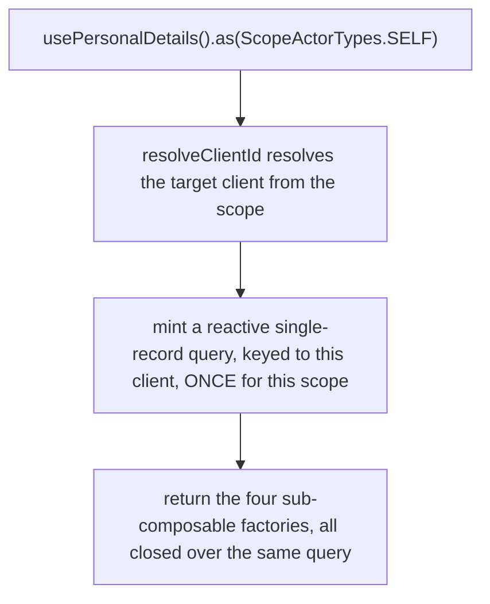
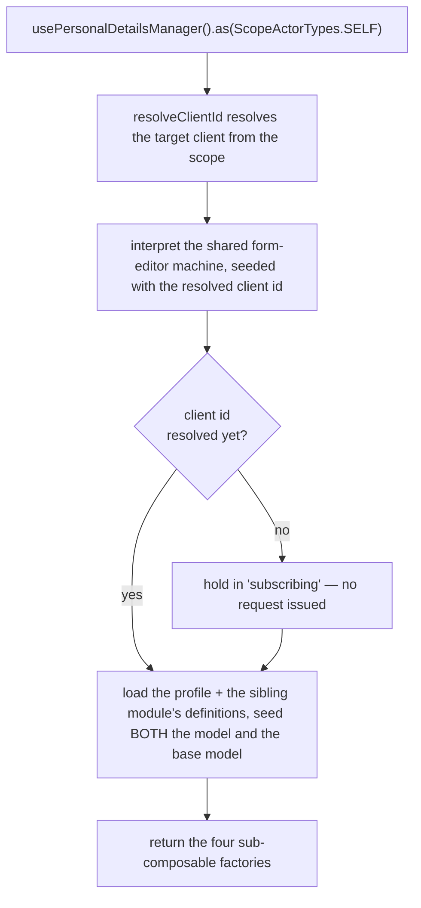
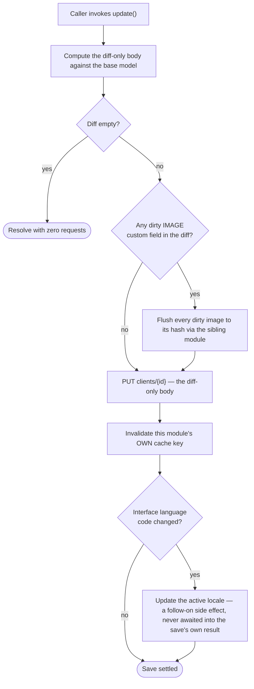
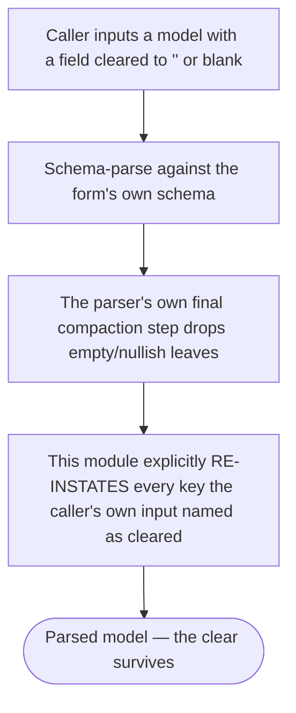

# client-personal-details — Architecture

## Overview

The module ships **two** scoped composables over one shared services factory:

- **`usePersonalDetails`** — the read view. Query-backed, no state machine. One reactive record query per resolved `(actor, context)` scope, minted at construction.
- **`usePersonalDetailsManager`** — the editor. Backed by the platform's shared form-editor machine, one interpreter per resolved scope.

Both share the **same** scope matrix and context enum — a client has exactly one profile, so both composables scope on the identical entity. Unlike the pattern this module's own reference conversion uses (one shared registry name for a query-backed collection and a machine-backed editor that always supplies a `.for()` or `.fresh()` of its own), **this module registers the two composables under two different internal names.** A client's profile has only one member in its context enum, so `.as(ScopeActorTypes.SELF)` with no further argument is the _normal_ call for both halves — sharing one registry name would give the read view and the editor the identical scope key, and the registry would hand one consumer the other's instance.

The single most important property of this module is that **every request resolves its target client from the scope**, never from a direct session read — one `resolveClientId` function, shared by both halves, branching on the resolved context rather than on which actor is calling.

## Data Flow

### Instantiation — the read view

The reactive read is built directly against the underlying query primitive rather than through this platform's own generic request wrapper — the generic wrapper appends its own reactive key segment that this read's key deliberately avoids, so it can stay as close as possible to a value the sibling custom-fields module also resolves against the same underlying resource. The two do not, in the event, end up sharing one cache entry — see "Two independently-keyed reads" below (after Dependencies) for why, and why closing that gap by force is not the safe fix.

### Instantiation — the editor

A late-resolving client id (a cold boot, where the session hasn't settled yet) tops up the already-interpreting machine through a **self-stopping** watch on the same resolved client id the rest of the module uses — never a second, independent read of the session.

### The save path — diff, image flush, then persist

Guarantees the platform holds: the profile update is never issued while a dirty image value is still a pending file — the image upload always resolves first, or the save fails before the profile PUT is ever sent.

Constraints the caller has to plan around: a locale-refresh side effect after a language change is fire-and-forget; a slow or failed locale load never delays or fails a save that has already landed.

### Clearing a field — where the clear survives, and where it doesn't

Guarantees the platform holds: a field the caller explicitly cleared is never silently dropped from the model before the diff step ever sees it — the diff step only ever fails to notice a clear if the caller's own input never named it in the first place.

Constraints the caller has to plan around: this re-instatement only restores what the caller's own input explicitly named as cleared (an empty string or `null`); it invents nothing, so a field the caller never touched is never accidentally treated as cleared.

## Sub-composables

| Sub-composable   | Read view                                                     | Editor                                                                                          |
| ---------------- | ------------------------------------------------------------- | ----------------------------------------------------------------------------------------------- |
| `useActions()`   | 3 members — readiness, refresh, lifecycle                     | 9 members — input, save, revert, clear, field-narrowing, lifecycle                              |
| `useContext()`   | 5 members — display list, raw values, lookups, captured error | 10 members — model, base model, schema pair, custom-field definitions, id, errors, display text |
| `useMeta()`      | 4 flags                                                       | 8 flags                                                                                         |
| `useInternals()` | 2 — actor scope, raw query                                    | 4 — actor scope, raw sender, raw service, raw state                                             |

## Services

One services file serves both halves:

| Concern                                              | Where it lives                                                                                                                                              |
| ---------------------------------------------------- | ----------------------------------------------------------------------------------------------------------------------------------------------------------- |
| Target-client resolution                             | one function, consumed by both the read view and the editor                                                                                                 |
| Addressability predicate                             | one function; its reactive form is what `isAvailable` exposes on both composables                                                                           |
| The reactive profile read                            | hand-built directly against the underlying reactive-query primitive, so its cache key can be made to match a value the sibling module also resolves against |
| A one-shot profile read for the editor's own lookups | deliberately bypasses the shared cache entirely — see "Two independently-keyed reads" below for why a shared, selected cache entry is unsafe here           |
| The diff-only update body                            | pure, no side effects beyond the request itself                                                                                                             |
| The machine-services adapter                         | takes the already-scoped services instance as an argument, so the machine inherits the same resolved client as the rest of the module                       |

The module owns **no machine of its own** — it builds a typed configuration payload for the shared form-editor machine, overriding its actions, guards and invoked services. One guard override is load-bearing: the editor is held out of its loading state until a client id exists, which is what stops it firing an unaddressed request on a cold boot.

## Errors

Errors are **state**, not events. Nothing in this module raises a toast or notification.

| Surface                 | Where a failure lands                                                                                                     |
| ----------------------- | ------------------------------------------------------------------------------------------------------------------------- |
| Read view's own query   | the query's own error → `useContext().error`, `useMeta().hasError`                                                        |
| Editor save             | the machine's context error → `useContext().errors`, `useMeta().hasErrors`; the action also rejects with a detailed error |
| Editor field validation | the validation errors → `useContext().validationErrors`, `useMeta().isValid`                                              |

## Dependencies

### This module reads from

| Module                                                    | Uses                                                                                                                                             |
| --------------------------------------------------------- | ------------------------------------------------------------------------------------------------------------------------------------------------ |
| The custom-field definitions and value-semantics contract | the definitions themselves, per-type coercion, schema/form-definition generation, and the pre-save image-flush step — consumed, never re-derived |
| Active client session                                     | the acting client's identity when no other context is supplied; whether the session is authenticated                                             |
| Brand configuration                                       | the interface language list                                                                                                                      |
| The shared request layer                                  | the reactive record read, the one-shot lookup read, the diff-only PUT, URL building, cache invalidation                                          |
| Localisation                                              | translated caller-facing text on rejected reads and saves; the active-locale update after a language change                                      |
| The shared form-editor machine                            | interpreted, never redefined                                                                                                                     |

### Modules that read from this one

| Module             | Uses                                                                                                                                        |
| ------------------ | ------------------------------------------------------------------------------------------------------------------------------------------- |
| Presentation layer | the display list and readiness on the read view; the model, schema, form definition, and save/input/clear/revert capabilities on the editor |

## Two independently-keyed reads of the same profile resource — and why they stay two

Both this module and the sibling custom-fields module read the identical underlying `clients/{id}` resource (with the same embedded custom-field values) — this module for the profile itself, the sibling for the target client's own brand id. Both are built to key against that resource as closely to each other as each one's own transport allows, so that where both paths run in the same boot, the two could in principle collapse onto a single request. **In the current shape, a small asymmetry in how each side forms its own cache key keeps the two as two separate entries rather than one** — established from source, not merely suspected.

That separation is left as-is rather than closed by force, because of what the underlying request platform does with a cache entry once populated: it bakes its own field-selection step _inside_ the fetch function it caches against, so a genuinely shared entry would store whichever side's selection happened to win the race to populate it first — this module's full profile shape, or the sibling's bare brand-id string — silently corrupting the loser's read. Reconciling the key asymmetry without first addressing that race would trade one known gap for a worse, silent one.

**How many reads a real page load actually issues is not settled.** The mechanism (two distinct keys, so the two entries cannot dedupe today) is established from source; the count observed varies by measurement layer and is not restated here. See [gotchas.md](./gotchas.md#3-two-independently-keyed-reads-of-the-same-profile-resource) before asserting a number anywhere downstream of this doc.

## Module boundary

The barrel is the module's only public surface: two composables and their own two types, one scope-matrix constant and its matching type, one context enum, four model types, and eight sub-composable types (four per composable). Curated named re-exports only — no `export *`.

Everything else is internal and carries a file-level internal marker: the services, the mappers, the schemas, and the machine-config file. The machine-config file is **not** a machine definition — it is a configuration payload for the platform's shared, unmodified form-editor machine.
