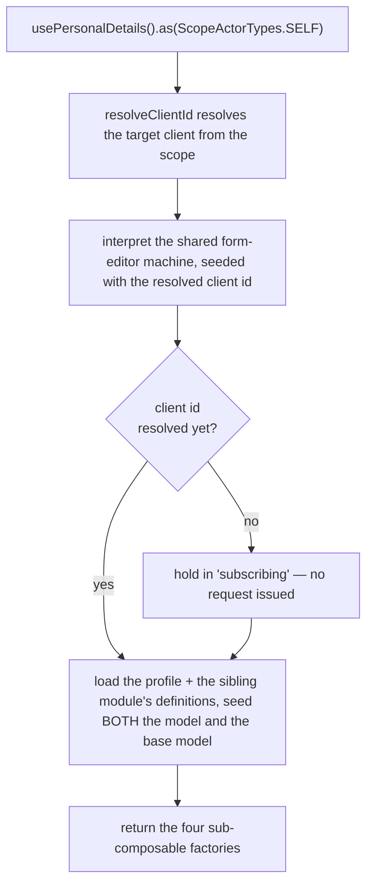
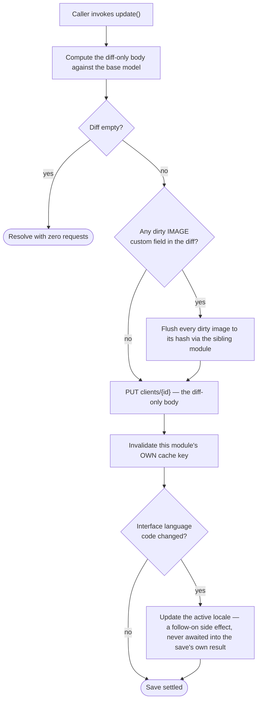
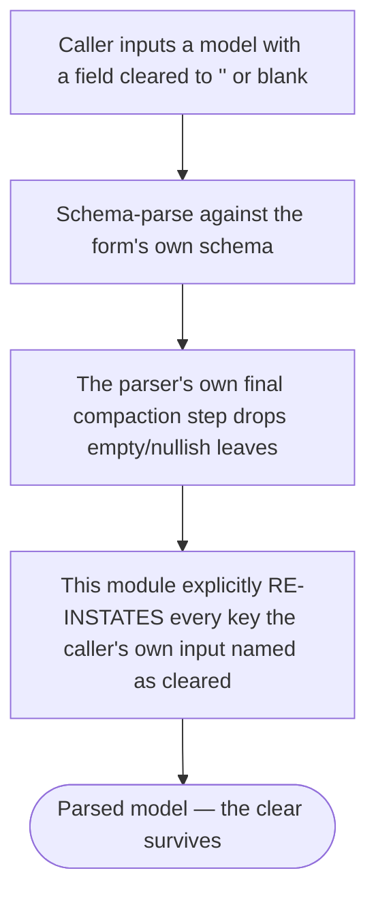

# client-personal-details — Architecture

## Overview

The module ships **one** scoped composable, `usePersonalDetails`, over one services factory. It is backed by the platform's shared form-editor machine, one interpreter per resolved `(actor, context)` scope, and it serves both the display list and the form editor from that one instance.

A client has exactly one profile, so `.as(ScopeActorTypes.SELF)` with no further argument is the _normal_ call and always resolves to the same registry entry. The composable is registered under a single internal name.

The single most important property of this module is that **every request resolves its target client from the scope**, never from a direct session read — one `resolveClientId` function, branching on the resolved context rather than on which actor is calling.

## Data Flow

### Instantiation

```mermaid
flowchart TD
  call["usePersonalDetails().as(ScopeActorTypes.SELF)"] --> resolve["resolveClientId resolves the target client from the scope"]
  resolve --> interpret["interpret the shared form-editor machine, seeded with the resolved client id"]
  interpret --> gate{"client id<br/>resolved yet?"}
  gate -- no --> wait["hold in 'subscribing' — no request issued"]
  gate -- yes --> load["load the profile + the sibling module's definitions, seed BOTH the model and the base model"]
  wait --> load
  load --> ready["return the four sub-composable factories"]
```

A late-resolving client id (a cold boot, where the session hasn't settled yet) tops up the already-interpreting machine through a **self-stopping** watch on the same resolved client id the rest of the module uses — never a second, independent read of the session.

### The save path — diff, image flush, then persist

```mermaid
flowchart TD
  save["Caller invokes update()"] --> diff["Compute the diff-only body against the base model"]
  diff --> empty{"Diff empty?"}
  empty -- yes --> noop(["Resolve with zero requests"])
  empty -- no --> images{"Any dirty IMAGE<br/>custom field in the diff?"}
  images -- yes --> flush["Flush every dirty image to its hash via the sibling module"]
  images -- no --> put
  flush --> put["PUT clients/{id} — the diff-only body"]
  put --> invalidate["Invalidate this module's OWN cache key"]
  invalidate --> locale{"Interface language<br/>code changed?"}
  locale -- yes --> setlocale["Update the active locale — a follow-on side effect, never awaited into the save's own result"]
  locale -- no --> done(["Save settled"])
  setlocale --> done
```

Guarantees the platform holds: the profile update is never issued while a dirty image value is still a pending file — the image upload always resolves first, or the save fails before the profile PUT is ever sent.

Constraints the caller has to plan around: a locale-refresh side effect after a language change is fire-and-forget; a slow or failed locale load never delays or fails a save that has already landed.

### Clearing a field — where the clear survives, and where it doesn't

```mermaid
flowchart TD
  input["Caller inputs a model with a field cleared to '' or blank"] --> parse["Schema-parse against the form's own schema"]
  parse --> compact["The parser's own final compaction step drops empty/nullish leaves"]
  compact --> restore["This module explicitly RE-INSTATES every key the caller's own input named as cleared"]
  restore --> model(["Parsed model — the clear survives"])
```

Guarantees the platform holds: a field the caller explicitly cleared is never silently dropped from the model before the diff step ever sees it — the diff step only ever fails to notice a clear if the caller's own input never named it in the first place.

Constraints the caller has to plan around: this re-instatement only restores what the caller's own input explicitly named as cleared (an empty string or `null`); it invents nothing, so a field the caller never touched is never accidentally treated as cleared.

## Sub-composables

| Sub-composable   | Members                                                                                                                       |
| ---------------- | ----------------------------------------------------------------------------------------------------------------------------- |
| `useActions()`   | 11 members — input, save, revert, clear, field-narrowing, refresh, readiness, lifecycle                                        |
| `useContext()`   | display list and its two finders, model, base model, schema pair, a narrowing helper, custom-field definitions, id, errors, display text |
| `useMeta()`      | 8 flags                                                                                                                       |
| `useInternals()` | 4 — actor scope, raw sender, raw service, raw state                                                                           |

## Services

One services file serves the composable:

| Concern                                  | Where it lives                                                                                                                         |
| ---------------------------------------- | -------------------------------------------------------------------------------------------------------------------------------------- |
| Target-client resolution                 | one function, consumed by every request in the module                                                                                  |
| Addressability predicate                 | one function; its reactive form feeds `isAvailable`                                                                                    |
| The profile record read                  | the module's own one-shot read of `clients/{id}`, under this module's own cache entry — never shared with `client-billing-settings`   |
| The diff-only update body                | pure, no side effects beyond the request itself                                                                                        |
| The machine-services adapter             | takes the already-scoped services instance as an argument, so the machine inherits the same resolved client as the rest of the module  |

The module owns **no machine of its own** — it builds a typed configuration payload for the shared form-editor machine, overriding its actions, guards and invoked services. One guard override is load-bearing: the editor is held out of its loading state until a client id exists, which is what stops it firing an unaddressed request on a cold boot.

## Errors

Errors are **state**, not events. Nothing in this module raises a toast or notification.

| Surface                 | Where a failure lands                                                                                                     |
| ----------------------- | ------------------------------------------------------------------------------------------------------------------------- |
| Profile read            | the machine's context error → `useContext().error` / `.errors`, `useMeta().hasErrors`                                     |
| Save                    | the machine's context error → `useContext().errors`, `useMeta().hasErrors`; the action also rejects with a detailed error |
| Field validation        | the validation errors → `useContext().validationErrors`, `useMeta().isValid`                                              |

## Dependencies

### This module reads from

| Module                                                    | Uses                                                                                                                                             |
| --------------------------------------------------------- | ------------------------------------------------------------------------------------------------------------------------------------------------ |
| The custom-field definitions and value-semantics contract | the definitions themselves, per-type coercion, schema/form-definition generation, and the pre-save image-flush step — consumed, never re-derived |
| Active client session                                     | the acting client's identity when no other context is supplied; whether the session is authenticated                                             |
| Brand configuration                                       | the interface language list                                                                                                                      |
| The shared request layer                                  | the one-shot record read, the diff-only PUT, URL building, cache invalidation                                          |
| Localisation                                              | translated caller-facing text on rejected reads and saves; the active-locale update after a language change                                      |
| The shared form-editor machine                            | interpreted, never redefined                                                                                                                     |

### Modules that read from this one

| Module             | Uses                                                                                                                                        |
| ------------------ | ------------------------------------------------------------------------------------------------------------------------------------------- |
| Presentation layer | the display list and readiness; the model, schema, form definition, and save/input/clear/revert capabilities |

## The profile record cache entry

This module reads `clients/{id}?with=custom_fields,custom_fields.field` under its own cache entry. `client-billing-settings` reads the same client record with a different slice (`accounts,accounts.currency`) under its own entry, so the two entries never collide and a page mounting both issues one request per module. See [gotchas.md](./gotchas.md#3-the-profile-record-read-has-its-own-cache-entry--it-is-not-shared-with-client-billing-settings).

## Module boundary

The barrel is the module's only public surface: one composable and its type, one scope-matrix constant and its matching type, one context enum, three model types, and four sub-composable types. Curated named re-exports only — no `export *`.

Everything else is internal and carries a file-level internal marker: the services, the mappers, the schemas, and the machine-config file. The machine-config file is **not** a machine definition — it is a configuration payload for the platform's shared, unmodified form-editor machine.
