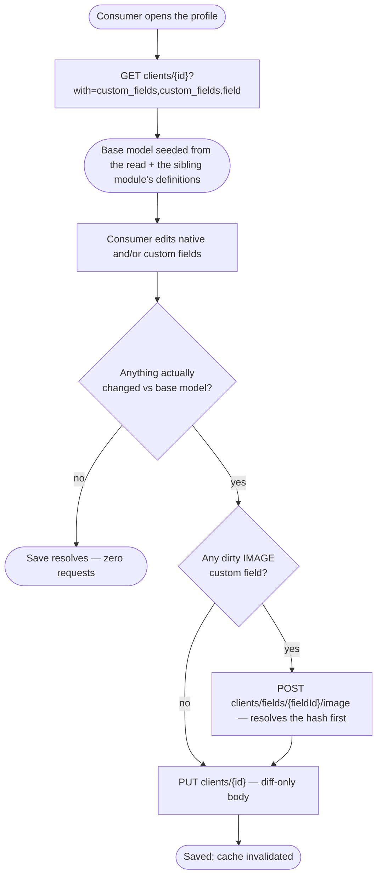
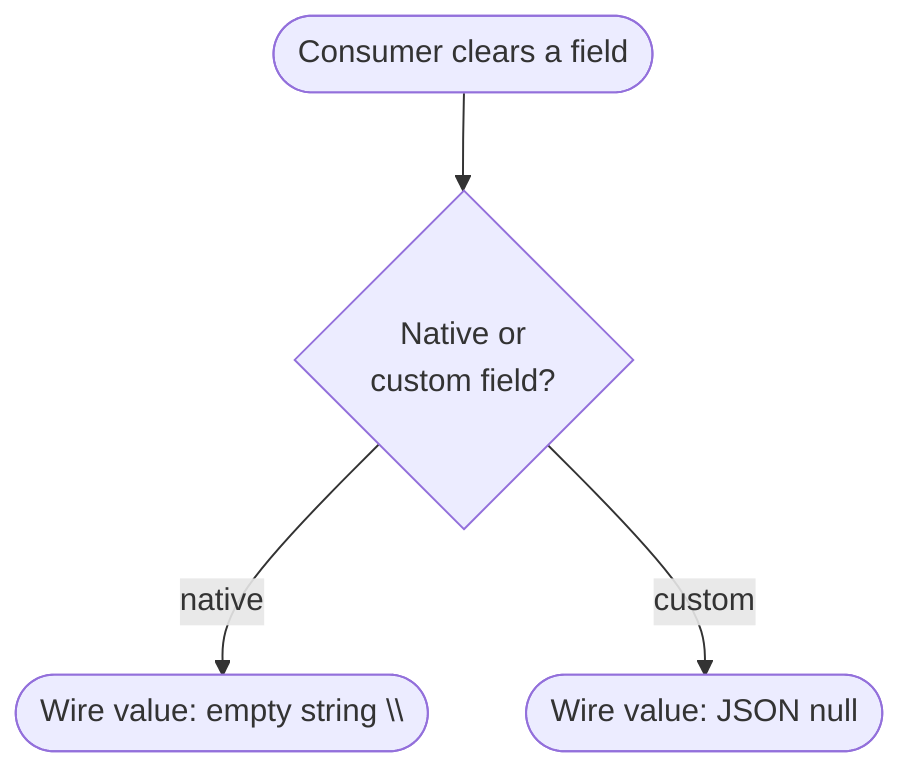

# Module: client-personal-details

## What it is

The **client-personal-details** module covers a client's own profile record: reading it (a handful of native fields, plus the client's own custom field values), editing it through a validated form, and persisting only what actually changed. It is the entity-holding half of a pair — the definitions a client's custom fields answer, the rules for reading and coercing their values, and the image-upload flow for one field type all live in a sibling module; this module consumes that contract rather than re-deriving it, and owns only the client record itself and the persist.

Two working surfaces sit over the same record: a **read view**, for rendering the client's current profile including their custom field values, and a **form editor**, used to change native fields and custom field values together and save only the difference from what was loaded. Both address a profile by its owning client's entity id, usually the caller's own.

## Core concepts

- **Native field** — one of the four profile fields that exist independent of any brand configuration: first name, last name, public/display name, and interface language. Distinct from a custom field, which a brand configures per its own catalogue.
- **Custom field value** — an answer to one of the brand's configured custom field definitions, attached to this client's record. The definitions and the rules for reading/writing a value correctly are owned by the sibling module; this module holds the client's own _answers_.
- **Diff-only update** — the save only ever describes what changed since the form was opened (or since the last save); an unchanged field is never mentioned in the request at all, and a save with nothing dirty issues no request.
- **Clear** — deliberately emptying a field's value, as distinct from never having set it. A cleared field survives to the wire; the value it clears to differs by _which kind_ of field is being cleared (see Lessons).
- **Base model** — the persisted baseline the form was opened against. Reverting restores this; the dirty check compares the current model against it.
- **Constrained-choice fallback** — a client's stored value for a field whose options come from a bounded list (the interface language) can fall outside that list. The schema still surfaces it — as a disabled option, labelled by its resolved display name rather than its raw id — instead of omitting it.
- **Entity id, not actor.** There is no capability anywhere in this contract for one client to act _as_ another, and no capability for staff or a guest to act at all — those surfaces do not exist here. What _does_ exist is narrower and easy to conflate with that: every read and every save is addressed to a profile by a client entity id the caller supplies, and that id is not validated locally against who is calling. A caller can construct a request that names a different client's id; whether the platform actually honours it is decided entirely server-side, not by anything in this contract. Naming an entity and acting as a different party are different things — only the first is mechanically possible here.

## Operations

| #   | Capability                                  | Inputs                  | Outputs                                                                                                                                             |
| --- | ------------------------------------------- | ----------------------- | --------------------------------------------------------------------------------------------------------------------------------------------------- |
| 1   | **Read a client's own profile**             | —                       | The native fields, plus the client's own custom field values                                                                                        |
| 2   | **Project the profile for display**         | —                       | Native fields and custom field values as a single ordered list, each carrying its own permission metadata                                           |
| 3   | **Input a candidate model into the editor** | a partial or full model | The parsed, schema-validated model; invalid fields are reported without rejecting                                                                   |
| 4   | **Save the current (or a supplied) model**  | —                       | The persisted model; issues no request at all when nothing is dirty, and rejects locally — before any request — when the model is dirty but invalid |
| 5   | **Revert to the base model**                | —                       | The model restored to its persisted baseline                                                                                                        |
| 6   | **Clear the editor's form context**         | —                       | The form reset to its starting state                                                                                                                |
| 7   | **Narrow which fields the editor exposes**  | a list of field names   | The schema and form definition rebuilt to only those fields                                                                                         |

**Additional always-on behaviours:**

- Reporting whether the read is addressable at all — whether a client has been resolved to read on behalf of.
- Reporting whether the read is loading, empty, or errored, and resolving once it is settled (bounded — never an unbounded wait).
- Re-reading the profile from the server on demand. A successful save also marks this module's own cached read stale on its own, so the next read reflects it without a separate call.
- Reporting the editor's own progress: available, valid, dirty, saving, complete.

## Data shape

The profile as read:

```ts
type ProfileRecord = {
  id: string;
  firstName?: string;
  lastName?: string;
  publicName?: string;
  language?: string; // the language's id — never its display name
  customFieldValues: Array<{
    id: string;
    field_id: string;
    value: unknown;
    field?: unknown; // the value's own embedded definition, when the read requested it
  }>;
};
```

The display projection — one entry per field, native or custom, in a single ordered list:

```ts
type ProfileFieldDisplay = {
  id: string;
  code: string;
  title: string;
  value: unknown; // for the language row specifically, the display NAME, not the id
  meta: {
    isRequired: boolean;
    isReadOnly: boolean;
    isDisabled: boolean;
    isHidden: boolean;
    isUserOnly: boolean;
    isEditable: boolean;
    showOnOrderForm: boolean;
    showOnInvoice: boolean;
    displayContexts: { invoice: boolean; order_form: boolean };
    isCustomField: boolean;
  };
};
```

The editor's own model — every native field is nullable, because a cleared field must be able to survive as an explicit `null` through the editor's own parsing round trip:

```ts
type ProfileModel = {
  firstName?: string | null;
  lastName?: string | null;
  publicName?: string | null;
  language?: string | null; // the id, matching the read shape — not the display name
  customFields?: Record<string /* field code */, unknown>;
};
```

The update body a save produces — **not** the same shape as the read record. Only the fields that changed are present at all:

```ts
type ProfileUpdateBody = {
  firstname?: string | null;
  lastname?: string | null;
  public_name?: string | null;
  interface_language_id?: string | null;
  document_language_id?: string | null; // present only alongside interface_language_id, and equal to it
  custom_fields?: Record<string, unknown>; // code-keyed — the sibling module's own contract
};
```

## Dependencies

### Dependants — modules that read from this one

| Module             | Weight  | Reads                                                                                                                                  | Why                                                 |
| ------------------ | ------- | -------------------------------------------------------------------------------------------------------------------------------------- | --------------------------------------------------- |
| Presentation layer | 2 files | the profile display list, readiness; the editor's model, schema, form definition, errors, and its input/save/clear/revert capabilities | rendering a client's profile page and its edit form |

This module in turn reads the sibling custom-fields module's definitions and value-semantics contract — see below. The HTTP transport layer and app-level navigation reference this module as they do most others; they are excluded from the table above.

### This module's own dependencies

- **Active client session** — supplies the acting client's id when no other client is named, and gates every read and save on being authenticated.
- **The custom-field definitions and value-semantics contract** — the definitions themselves, per-type value coercion, schema/form-definition generation, and the pre-save image-flush step. This module never re-implements any of this; it consumes the sibling module's published contract.
- **Brand configuration** — the interface language list available on the client's own brand.
- **HTTP transport layer** — bearer-token attachment, URL construction, error normalisation, response caching and invalidation.
- **Localisation** — translates caller-facing text attached to a rejected validation.

## API endpoints

### GET /clients/{clientId}

Role: reads a client's own profile, including their custom field values with each value's own embedded definition.

```bash
curl "$API/clients/25d96e76-3ed0-913d-d52c-417482528340?with=custom_fields,custom_fields.field" \
  -H "Authorization: Bearer $ACCESS_TOKEN" \
  -H "Accept: application/json"
```

Sample response (`200`) — trimmed to the fields this module reads:

```json
{
  "status": "ok",
  "data": {
    "id": "25d96e76-3ed0-913d-d52c-417482528340",
    "firstname": "Checkout",
    "lastname": "Test",
    "public_name": "Checkout T.",
    "interface_language_id": "3825d96e-763e-d091-3dc4-174825283406",
    "custom_fields": [
      {
        "id": "20403869-6e54-721d-e4da-518d9305e7d2",
        "field_id": "20403869-6e54-721d-29f5-18d9305e7d23",
        "value": 44,
        "field": {
          "id": "20403869-6e54-721d-29f5-18d9305e7d23",
          "code": "age",
          "name": "Age",
          "type": 7,
          "type_code": "number"
        }
      },
      {
        "id": "320e4357-95e7-8d18-689b-31643202d986",
        "field_id": "3de78642-de53-9714-7ec2-1208469530d0",
        "value": null,
        "field": {
          "id": "3de78642-de53-9714-7ec2-1208469530d0",
          "code": "profile_picture",
          "name": "Profile Picture",
          "type": 8,
          "type_code": "image"
        }
      }
    ]
  },
  "total": 1,
  "error": null,
  "messages": [],
  "meta": null
}
```

Fixture: `__tests__/fixtures/get-clients-id.json`.

### PUT /clients/{clientId}

Role: persists a diff-only update. Only the fields that changed since the base model are present; an update with nothing dirty is never issued at all.

Request body: see `ProfileUpdateBody` above. Every key is optional and independent — none is required by the shape itself, only by what actually changed.

**Set a custom field value:**

```bash
curl -X PUT "$API/clients/25d96e76-3ed0-913d-d52c-417482528340" \
  -H "Authorization: Bearer $ACCESS_TOKEN" \
  -H "Content-Type: application/json" \
  -d '{ "custom_fields": { "age": "42" } }'
```

**Clear a custom field value:**

```bash
curl -X PUT "$API/clients/25d96e76-3ed0-913d-d52c-417482528340" \
  -H "Authorization: Bearer $ACCESS_TOKEN" \
  -H "Content-Type: application/json" \
  -d '{ "custom_fields": { "age": null } }'
```

**Clear a native field:**

```bash
curl -X PUT "$API/clients/25d96e76-3ed0-913d-d52c-417482528340" \
  -H "Authorization: Bearer $ACCESS_TOKEN" \
  -H "Content-Type: application/json" \
  -d '{ "public_name": "" }'
```

Sample response (`200`) — the full updated client record, in the same shape the read endpoint returns.

Fixtures: `__tests__/fixtures/put-clients-id-case-change-firstname.json` (a native field change), `put-clients-id-case-clear-custom-field.json` (a custom field cleared to `null`), `put-clients-id-case-native-falsy.json` (a native field cleared to `""`), `put-clients-id-case-restore-age.json` (a custom field restored from cleared).

## Failure modes

### An empty diff issues no request — the caller's own responsibility to check

A save invoked with nothing changed since the base model resolves successfully without ever reaching the network. This is not a soft failure from the platform's side — it is a local short-circuit, so there is no request to observe or mock against for this case.

### A required field cleared is rejected before any request

Clearing a field the schema marks as required rejects locally, with the field-level validation error, before anything is sent. This is the one case where "manage" produces zero requests but is **not** the empty-diff no-op above — the model _is_ dirty, but invalid.

### Soft failures

No soft-failure path (a `2xx` response that silently declines part of the update) has been observed on this endpoint's own contract — the mutation either returns the full updated record or rejects with a `4xx`/`5xx`. The historical risk in this domain was not a platform soft failure but a **client-side** one: a diff computed over a value that had already been silently stripped upstream could produce a `PUT` with an effectively empty body that still reported success. That failure mode is closed by keeping emptiness a property of the diff itself, never of whether a value "looks empty" — see Lessons.

### Not captured

The rejection shape for a save whose diff is invalid against the schema (as opposed to a request the platform itself rejects) has not needed a live capture — this module's own validation stops that case locally before any request is issued.

## Flows

### Read, edit, and save a profile

One-line purpose: the end-to-end shape a consumer plans around.



Guarantees the platform holds: a save that changes an image custom field always uploads that image before the profile update is sent, and the profile update carries the uploaded hash, never the pending file.

Constraints the caller has to plan around: an image upload failing stops the save entirely — the profile update is never issued when its own dirty image failed to resolve.

### Clearing a value — the wire representation differs by field kind

One-line purpose: show the single most consumer-visible asymmetry in this pair.



Guarantees the platform holds: whichever kind of field is cleared, the cleared key is always **present** in the update body — never silently omitted, and never confused with "unchanged".

Constraints the caller has to plan around: a caller assembling an update body by hand, rather than through this module's own diff step, must apply the correct one of the two — assuming one rule for both produces a request the platform accepts syntactically but that does not mean what the caller intended.

## Lessons (hard-won)

- **A profile's custom field values can be structurally impossible to read from some upstream sources, and that failure is silent.** A source that is supposed to carry a client's custom field values but was never actually populated with them does not error — every value simply reads as if it had never been set, and a naïve read coercion over that absence renders the literal string `"undefined"` rather than an empty value. A consumer trusting that source has no signal that anything is wrong; the fix is a real, dedicated read of the client record itself, not a patch to the coercion.
- **The wire value a cleared field takes is decided by which side of the read/write contract owns that field, not by one rule applied everywhere.** A native field clears to an empty string; a custom field value clears to `null`. Building an update body without going through this module's own diff step risks applying the wrong one, or applying `null` where the platform only ever demonstrably accepts `""`.
- **A value predicate ("does this look empty?") is the wrong test for whether a field belongs in an update body — only the diff against the base model is.** A generic emptiness check applied to the model before diffing can strip a value the caller deliberately cleared before the diff step ever sees it, at which point the field is indistinguishable from "never touched" and the update silently omits the very thing the caller changed. The wire request that results looks syntactically valid, returns success, and changes nothing — the platform never rejects it, because from its side nothing was ever asked to change.
- **A test that hand-builds the exact input its own production pipeline can never produce proves nothing about that pipeline.** Confirming a mapping function behaves correctly when handed a value directly is not the same as confirming a real edit, through the real form, ever reaches that function with that value intact — an earlier upstream step can silently strip the very thing being tested for, and a unit test that skips that step never notices.
- **A client's current selection for a constrained-choice field can legitimately fall outside the currently-loaded option list** — the option may have been removed, or belong to a different scope than the one currently loaded. A rendered option list built only from the currently-loaded choices, with no accommodation for the stored-but-absent case, blanks the field for the client even though a value still exists on the record.
- **A field's stored identity and its display label can both need representing, in different places, without either one leaking into the other's role.** A language is stored by an opaque id but shown to a person by name — code that resolves the id to a name for display must not accidentally feed that resolved name back into the value the field actually holds, or a subsequent read-modify-write round trip corrupts the stored identity.
