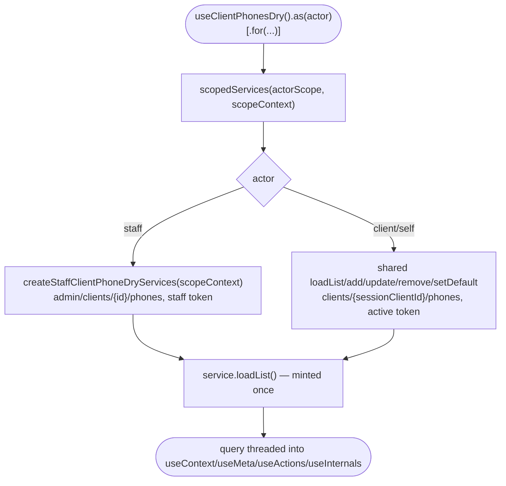

# client-phone-dry Architecture

## Overview

`useClientPhonesDry` is a scoped composable built on the query-variant factory template (`templates/query/`, ADR-001) — a single TanStack Query list query per concrete `(actor, context)` scope, minted once at construction, with mutations composed alongside it. There is no state machine: readiness/loading/error are derived directly off the query's own state. Actor-specific behaviour (client/self vs staff `.for('client', id)`) is injected at exactly two layers — **services** and **actions** — via an opt-in `.staff.ts` arm each; `context`, `meta`, and `schemas` are shared, byte-identical factories with no arm, because no parity row gives either cell an exclusive or overriding member at those layers (`design.md` §7).

## Sub-composables

| Sub-composable   | Purpose                                                                                                                                                                                    |
| ---------------- | ------------------------------------------------------------------------------------------------------------------------------------------------------------------------------------------ |
| `useActions()`   | mutations (`add`/`update`/`remove`/`setDefault`/`ensure`), lifecycle (`refresh`/`nextPage`/`prevPage`/`invalidate`/`destroy`/`isReady`), form helpers (`parse`/`validate`/`filters.query`) |
| `useContext()`   | reactive list (`data`/`default`/`pagination`/`error`/`findOne`/`getOne`), form seed (`model`/`schema`/`uischema`/`lookups`), per-row predicates (`isStaged`/`canEdit`)                     |
| `useMeta()`      | collection state flags (`isLoading`/`isError`/`isEmpty`/`isAvailable`/`isAuthenticated`)                                                                                                   |
| `useInternals()` | `actorScope`, the raw query, the raw (ungated) service object, `queryKey`                                                                                                                  |

## Data flow

1. **Instantiation** — `useClientPhonesDry().as(actor)[.for('client', id)]` resolves the actor via the scope builder (SELF resolution happens there, never inside this module — variance-law clause 4) and calls `createClientPhoneDryForScope(config, session, scopeKey)` once per concrete scope key.
2. **Service resolution** — `createClientPhoneDryServices(actorScope, scopeContext)` calls `scopedServices()`, which routes to `createStaffClientPhoneDryServices(scopeContext)` for `ScopeActorTypes.STAFF` and returns `{}` (shared-only) otherwise. The staff arm's returned `loadList`/`add`/`update`/`remove`/`setDefault` override the shared ones by object-spread; `ensure`/`parse`/`validate` are always the shared implementations, and `ensure` closes over _whichever_ `loadList`/`add` won the resolution (shared or staff-overridden) so a staff `ensure()` never silently falls through to the client's own endpoint.
3. **Query mint** — `service.loadList({ pagination: { limit: 0 } })` is called exactly once, at construction, and the resulting query object is threaded into every sub-composable factory. A sub-composable calling `service.loadList()` again would mint a second, independent query — this does not happen anywhere in the module.
4. **Actions arm** — `createClientPhoneDryActions` builds the shared action set, then spreads `createStaffClientPhoneDryActions(service, query)` last when `actorScope === STAFF`, so the staff arm's conditionally-`undefined` members win over the shared always-present ones for the same keys.
5. **Context/meta** — both are single, armless factories over the resolved query; the staff-vs-client difference the query itself already carries (different URL, different `enabled`/`guard` predicate) is sufficient — no branch is needed at these layers.

## Query lifecycle

Guarantees the platform holds:

- The resolved `(actor, context)` scope is fixed at construction; a single instance never re-targets to a different client mid-life.
- The staff arm's `loadList`/mutations always read `scopeContext.id` (the `.for('client', id)` target), never the active session's own client id.

Constraints the caller has to plan around:

- A staff instance's query is gated (`enabled`/`guard`) on both a resolvable staff token **and** a target id being present; either missing leaves the query permanently unauthenticated rather than retried.
- Re-scoping to a different target client requires a new instance (a new `(actor, context)` scope key), not a mutation of the existing one.

## Services

| Actor                        | File                                 | Retargets                                                                                                                                                |
| ---------------------------- | ------------------------------------ | -------------------------------------------------------------------------------------------------------------------------------------------------------- |
| client/self (shared, no arm) | `client-phone-dry.services.ts`       | `clients/{sessionClientId}/phones[/{id}]`, active-session token                                                                                          |
| `staff` (arm)                | `client-phone-dry.services.staff.ts` | `admin/clients/{scopeContext.id}/phones[/{id}]`, staff session token selected explicitly from the multi-session store (never the active-session default) |

Both list forms carry `with_staged_imports=1` (D4) — the staff arm re-authors `loadList` entirely rather than inheriting the shared list's own query param, so the param is set independently in each.

## Actions

| Actor                             | File                                  | Behaviour                                                                                                                                                                                                  |
| --------------------------------- | ------------------------------------- | ---------------------------------------------------------------------------------------------------------------------------------------------------------------------------------------------------------- |
| client/self + shared write guards | `useClientPhonesDry.actions.ts`       | always-present `add`/`update`/`remove`/`setDefault`/`ensure`/lifecycle; `update`/`setDefault`/`remove` no-op on a staged row; `remove` additionally requires `meta.canDelete`                              |
| `staff` (arm)                     | `useClientPhonesDry.actions.staff.ts` | overrides `refresh`/`add`/`ensure`/`update`/`setDefault`/`remove` to `undefined` unless the staff session carries the matching capability code; re-enforces the staged-row lockout inline where applicable |

The staff arm's capability check (`hasStaffCapability`, `client-phone-dry.utils.ts`) reads a `functionalities` array off the active staff session's user profile, read directly from `session-store`'s multi-session entries rather than through `useActiveSession()` — under multi-session the active session can be a client session even while a staff session is held, so the staff arm always resolves its own identity independent of what is currently active.

## Dependencies

### Depends on

| Module                | Usage                                                       |
| --------------------- | ----------------------------------------------------------- |
| `session-store`       | staff-session lookup (token select, capability-field read)  |
| `query`               | all HTTP (services only, never composables)                 |
| `system`              | country lookup for form seeding/formatting                  |
| `brand`               | active-brand country id, for the D3 brand-country seed      |
| `feedback`            | success/error toasts on mutations                           |
| `system-localisation` | i18n strings for feedback messages                          |
| `scope`               | `createScopedComposable`, `ScopeActorTypes`, scope registry |

### Depended on by

None currently — net-new, no consumer in the tree.

## Integration points

| Boundary           | Contract                                                                                                                                                                                                                                                       |
| ------------------ | -------------------------------------------------------------------------------------------------------------------------------------------------------------------------------------------------------------------------------------------------------------- |
| Self path          | `clients/{sessionClientId}/phones[/{id}]`, active-session bearer                                                                                                                                                                                               |
| Admin (staff) path | `admin/clients/{targetId}/phones[/{id}]`, staff-session bearer selected explicitly, never an acting-as header                                                                                                                                                  |
| Capability gate    | reads `functionalities` off the staff session's mapped user — see [gotchas.md](./gotchas.md) §1 for the field's current wiring status                                                                                                                          |
| Recordings         | none co-located yet for this module's own endpoints (session bootstrap fixtures are reused cross-module from `session-store/__tests__/fixtures`); this module's own phone-endpoint responses in the test suite are hand-authored mocks, not ADR-025 recordings |

> **For Contributors:** the staff services and actions arms are the only two layers that may ever earn a `.staff.ts` file for this module — `context`/`meta`/`schemas` are confirmed armless (`design.md` §7) and should stay that way unless a genuine per-actor override is found; scaffolding an arm without one is `scope-based/no-cosplay-arm`.
