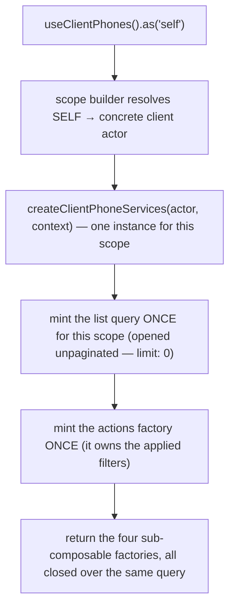
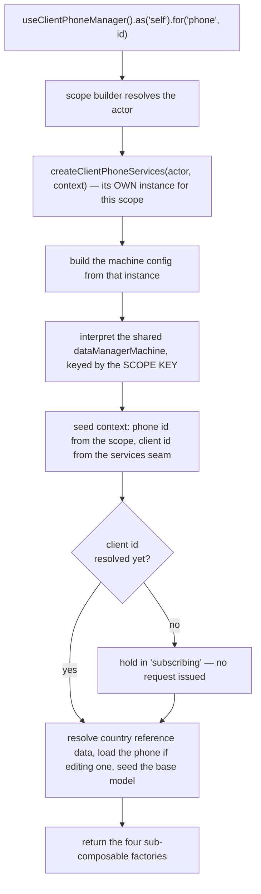
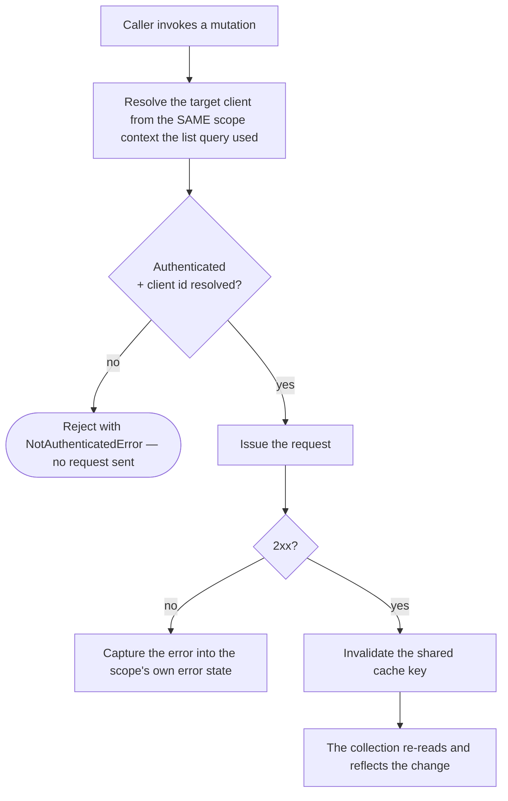
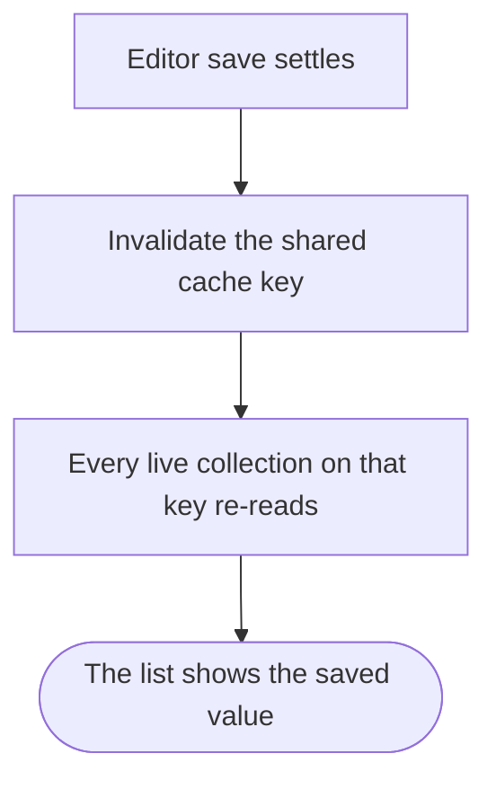

# client-phone — Architecture

## Overview

The module ships **two** scoped composables over one shared data layer:

- **`useClientPhones`** — the collection. Query-backed, no state machine. One list query is minted per resolved `(actor, context)` scope, at construction, so it survives component lifecycles.
- **`useClientPhoneManager`** — the per-phone editor. Backed by the shared `dataManagerMachine`, one interpreter per resolved `(actor, phone)` scope.

Both are registered under the same module name; the composable name and the scope key carry the differentiation. Both build their own services instance from **one factory**, so the two halves share one identity seam, one cache key and one set of request gates.

The single most important property of this module is that **every request URL derives from the resolved scope**, never from a direct session read. `resolveClientId(scopeContext)` in the services layer is the only place a target client is decided, and every request-issuing function in the services file — list, read-one, add, update, ensure, remove, set-default — goes through it. The manager seeds its machine context from that same seam rather than reading the session itself.

Only one actor currently resolves in either scope matrix: the client acting for themself. Both matrices declare the other actors as unreachable at compile time rather than silently omitting them — see "What this module does not do" below and [gotchas.md](./gotchas.md) for what that means in practice.

## Data Flow

### Instantiation — the collection

`useContext()`, `useMeta()` and `useInternals()` are lazy — they build on call. `useActions()` is **not**: it is minted once per scope, because the applied `filters` live inside it. A factory minted per call would give every handle its own filter state.

The collection's list query opens with `pagination: { limit: 0 }` — an intentionally unpaginated read that returns the client's entire phone collection in one response. A consumer of `useContext().data` never needs a second page. This is also why the public `nextPage()` / `prevPage()` members cannot succeed through this composable — see [gotchas.md](./gotchas.md#2-nextpage--prevpage-always-throw--the-collection-already-holds-everything).

### Instantiation — the editor

The interpreter is keyed by the **scope key**, not the phone id. `.fresh()` mints a unique key per call, so two concurrent drafts get two independent editors instead of colliding on one shared identifier.

Like the collection, the editor's `useActions()` is minted once per scope — `input` is debounced, and a debouncer minted per call would give two keystrokes two independent timers and leave `update`'s pre-save flush with nothing to flush.

### Mutation flow

The guard is the **same predicate** the collection's `isAvailable` flag exposes — one function, read by meta, by the actions layer and by every request gate. A consumer cannot render "available" while the wire refuses the call, or vice versa.

Two of the six request-issuing capabilities — `remove` and `setDefault` — additionally raise a user-visible success or failure message, on top of capturing the failure into state. That is a deliberate divergence from this collection's sibling pattern (which raises none from any layer): this module's underlying platform capability already confirms those two actions with a message, so the conversion carried it rather than dropping it. See [gotchas.md](./gotchas.md#8-remove-and-setdefault-raise-feedback--nothing-else-does).

### How a save in the editor reaches the collection

Both halves resolve the same base cache key. The editor never reaches into the collection's query instance — that instance belongs to a different scope key and may not exist in the consumer at all. Instead a settled save invalidates the shared key through the editor's own services instance, and any live collection re-reads.

This invalidation is the **only** mechanism by which a manager save refreshes the collection — there is no direct reference between the two instances.

## Sub-composables

| Sub-composable   | Collection                                                  | Editor                                                                                |
| ---------------- | ----------------------------------------------------------- | ------------------------------------------------------------------------------------- |
| `useActions()`   | 10 members — row mutations, list controls, lifecycle        | 7 members — form input, save, lifecycle                                               |
| `useContext()`   | 6 members — reactive list, lookups, captured error          | 9 members — model, schema pair, id, errors, display text                              |
| `useMeta()`      | 4 flags — `hasError`, `isAvailable`, `isEmpty`, `isLoading` | 8 flat flags — availability, loading, dirty, valid, new, processing, complete, errors |
| `useInternals()` | 2 — actor scope, raw query                                  | 4 — actor scope, raw sender, raw service, raw state                                   |

Both halves return the identical four-layer shape; only the contents differ, because one is query-backed and the other machine-backed.

## Services

One services file serves both halves. There are no per-actor service arms today — the actor switch exists with only a default branch, so the shape is the same whether or not an arm is ever earned.

| Concern                   | Where it lives                                                                                              |
| ------------------------- | ----------------------------------------------------------------------------------------------------------- |
| Target-client resolution  | one function, consumed by every request-issuing function in the file                                        |
| Addressability predicate  | one function; its reactive form is what `isAvailable` exposes                                               |
| Cache key                 | one base key, shared by both halves                                                                         |
| Wire ↔ view-model mapping | pure mappers, no actor awareness                                                                            |
| Machine services adapter  | takes the already-scoped services instance as an argument, so the machine inherits the same resolved client |

The module owns **no machine of its own** — it builds a typed configuration payload for the shared `dataManagerMachine`, whose actions, guards and invoked services it overrides. One guard override is load-bearing: the editor is held out of its loading state until a client id exists, which is what stops it firing an unaddressed request on a cold boot.

The identity-resolution function accepts a context branch for "a client other than the session's own" that is **currently unreachable** from either live scope matrix — both matrices resolve exactly one actor (the client, acting for themself). The branch is kept anyway, deliberately: it is the single point every request gate reads, so a future restoration of a second acting cell becomes an edit to that one function and the scope matrices, not a rewrite of the identity seam. See [gotchas.md](./gotchas.md#13-staff-phone-management-is-not-delivered-here--its-tracked-not-forgotten).

### Arms

Every layer in this module — services, actions, context, meta, schemas — is **armless**: no layer has a member exclusive to one actor, or one that overrides the shared implementation for a genuine actor-vs-actor divergence. That is a direct consequence of only one actor resolving in either scope matrix: with a single resolving actor, there is no second actor for a member to be exclusive against. `meta` is the layer most likely to earn the first arm if a second acting cell is ever restored, because the platform's own staff-facing surface gates its actions on capability flags that would naturally live there.

## Errors

Errors are **state**, not events, on the editor half; the collection half is split (see above).

| Surface                                           | Where a failure lands                                                                                                                    |
| ------------------------------------------------- | ---------------------------------------------------------------------------------------------------------------------------------------- |
| Collection row mutation (`remove` / `setDefault`) | a user-visible failure message, AND the services instance's captured error → `useContext().error`, `useMeta().hasError`                  |
| Collection list read                              | the query's own error → the same two members                                                                                             |
| Editor save                                       | the machine's context error → `useContext().errors`, `useMeta().hasErrors`; the action also rejects with a detailed error for the caller |
| Editor field validation                           | the validation errors → `useContext().validationErrors`, `useMeta().isValid`                                                             |

A consumer that wants user-visible feedback for anything other than `remove()` / `setDefault()` renders it from those members, or from the editor's `onDone()` completion signal — nothing else in this module raises one for you.

## Dependencies

### This module reads from

| Module                | Uses                                                                                                                                                  |
| --------------------- | ----------------------------------------------------------------------------------------------------------------------------------------------------- |
| `session-store`       | the active client identity (the addressed client when no other context is supplied), whether the session is authenticated, and whether it has settled |
| `query`               | the shared request layer — list reads with pagination/filtering, single mutations, URL building, cache invalidation                                   |
| `data-manager`        | the shared form-editor machine the per-phone editor interprets                                                                                        |
| `system`              | brand-agnostic reference data — the country the form resolves and validates against                                                                   |
| `scope`               | the actor-scoping accessor and its instance registry                                                                                                  |
| `system-localisation` | translated caller-facing text on rejected reads and saves, and the two success confirmations `remove()` / `setDefault()` raise                        |
| shared utilities      | schema validation, model parsing, phone-number parsing, collection lookups, state-read helpers, and the typed unauthenticated-access error            |

### Modules that read from this one

| Module                     | Uses                                                                                                         |
| -------------------------- | ------------------------------------------------------------------------------------------------------------ |
| `client-company`           | find-or-create by phone number, the readiness signal, while assembling a client contact record               |
| `basket-billing` (unified) | the client's default number, the full list, and the readiness signal while composing billing contact details |

Both consumers reach the collection only, through `.as('self')` — followed by the mandatory four-layer destructure that shape forces. Neither re-implements the list read or the find-or-create check. A storefront checkout funnel also reads the collection's default-number reporting directly, in its billing-detail step.

## Integration Points

- **Contact-record composition** and **billing-detail composition** both open the collection to reuse or create a phone number as part of building their own records.
- Any consumer rendering the numbers directly — list, delete, set default — drives the collection; any consumer rendering an add/edit **form** drives the editor, which serves its own schema pair. Both surfaces are documented in [usage.md](./usage.md).
- A larger, module-scope-composed schema elsewhere in this codebase (a billing-detail form spanning several inputs) reads this module's schema **not** through the editor's context — no manager instance exists at the point that composition happens — but by importing the underlying schema builder directly, with an explicit internal-use acknowledgement. This is the one consumer of the schema pair that cannot use the documented route in [usage.md](./usage.md#the-form-definition--paste-ready).

## Module boundary

The barrel is the module's only public surface: two composables, two scope matrices, two context enums, three model types and eight sub-composable types. Curated named re-exports only — no `export *`.

Everything else is internal and carries a file-level internal marker: the services, the mappers, the schema factories and the machine configuration. In particular the schema pair is **not** exported. It enters the system in the machine configuration and reaches consumers through the editor's context, because a form rendered from a definition the editor has not adopted validates against a different contract than the one that saves.

## What this module does not do

Two categories of capability are visibly out of scope for this module as it stands, and both are recorded rather than silently absent:

- **Acting on behalf of another client.** Both scope matrices declare exactly one resolving actor. A second acting party managing a client's numbers on their behalf — reading or writing another client's collection — is a real capability the wider platform has elsewhere for this kind of collection, and it is tracked for this one, not delivered. See [gotchas.md](./gotchas.md#13-staff-phone-management-is-not-delivered-here--its-tracked-not-forgotten).
- **Confirming ownership of a number.** No endpoint or action anywhere in this module's recorded history submits a verification code or otherwise moves a number from unverified to verified. `meta.isVerified` is exposed for display because the underlying record carries the flag; nothing here can change it. Unlike the acting-on-behalf-of gap above, this is not a capability being withheld — no version of this collection's data source has ever had one to withhold. See [foundation.md](./foundation.md#not-captured).
