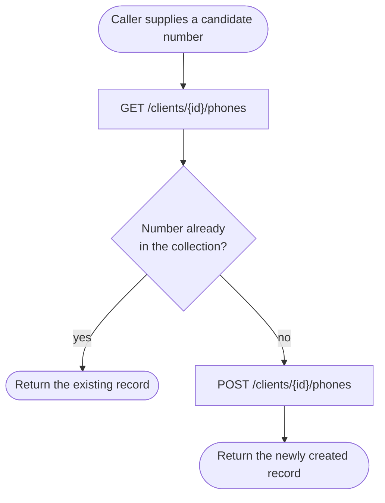
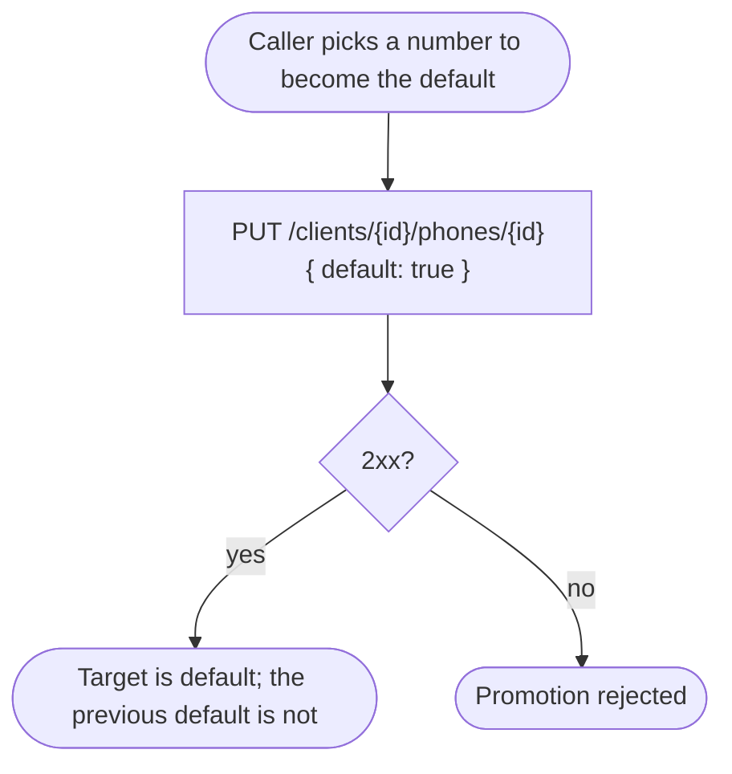
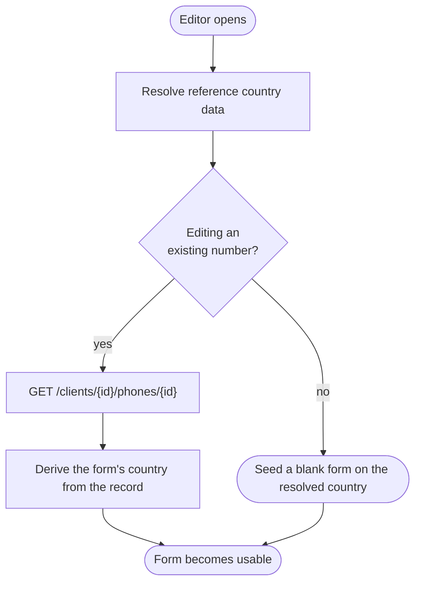

# Module: client-phone

## What it is

The **client-phone** module covers the collection of phone numbers attached to a single client account: read the list, read one entry, add a number, change one, delete one, and mark one as the default. Every operation acts on one client's own collection — the addressed client is fixed when the collection or the editor is opened, and no operation reaches across accounts.

A phone number is stored and returned in parts — the national number, the country calling code, and the two-letter country — rather than as one opaque string, so a caller can render or re-edit any one part without re-parsing the whole value.

Two working surfaces sit over the same data: a **collection**, read and acted on row by row, and a **single-phone editor** used to add or change one number through a validated form that also resolves the number's country. Both address the same client and share one cached read, so a save made through the editor is reflected the next time the collection is read.

## Core concepts

- **Phone record** — one entry in a client's collection: the parsed number plus status flags for default, verification, and deletability, and a numeric category (`type`).
- **Default phone** — the single record flagged as the client's default number. Promoting a different record un-defaults the previous one.
- **Parsed number** — a phone number is carried as four related values: `number` (full international form), `nationalNumber` (without the country's dial code), `countryCallingCode` (the dial code, no leading `+`), and `country` (the two-letter ISO code). All four are derived from one underlying value; a caller edits any one and the others re-resolve around it.
- **Verified** — whether a number has been confirmed as belonging to the client. This collection only ever displays this flag; nothing in this module can change it. See "Not captured" below.
- **Deletability** — a per-record signal for whether a number can currently be removed.
- **Category (`type`)** — a numeric classification (1 mobile, 2 home, 3 office, 4 personal in the platform's own scheme). This collection displays it on every record; nothing in this module can set or change it. See "Not captured".
- **Find-or-create** — resolving a candidate number to a record already in the collection, or creating one when no match exists, as a single step.

## Operations

| #   | Capability                                        | Inputs                                            | Outputs                                                                                      |
| --- | ------------------------------------------------- | ------------------------------------------------- | -------------------------------------------------------------------------------------------- |
| 1   | **List one client's phone numbers**               | optional page size + offset, optional search term | Array of phone records, each carrying its parsed number and status flags, plus a total count |
| 2   | **Read one phone number by id**                   | phone id                                          | The single phone record                                                                      |
| 3   | **Add a phone number**                            | national number, country calling code, country    | The created phone record                                                                     |
| 4   | **Change a phone number**                         | phone id, new number/country                      | The updated record                                                                           |
| 5   | **Delete a phone number**                         | phone id                                          | Confirmation; the record is gone from the collection                                         |
| 6   | **Set a phone number as the default**             | phone id                                          | The updated record; the previously default record is no longer default                       |
| 7   | **Find or create a phone number**                 | candidate number                                  | The matching existing record, or a newly created one                                         |
| 8   | **Filter the collection**                         | a search term                                     | The list narrowed to matching numbers                                                        |
| 9   | **Page through the collection**                   | page size, page direction                         | The next or previous page of the list, at the underlying request layer (see note below)      |
| 10  | **Resolve the country before the form is usable** | (none — reads platform reference data)            | The resolved country, seeded as the form's starting dial country                             |
| 11  | **Parse typed input into its four parts**         | a partially-typed number and a country context    | The same four-part shape, re-resolved                                                        |

> Note on operation 9: the platform genuinely supports `limit` / `offset` pagination on the list endpoint (see the paged variant under "API endpoints" below), and a caller integrating directly against the HTTP surface can page normally. One existing client of this platform surface reads the entire collection in a single unpaginated request instead and does not exercise the platform's paging at all — a choice of that client, not a limit of the platform.

**Additional always-on behaviours:**

- Reporting whether the collection is addressable at all — that is, whether a client has been resolved to read on behalf of.
- Reporting whether the list is loading, empty, or errored, and signalling when it is ready to read.
- Re-reading the collection from the server on demand.
- Marking the cached collection stale so the next read re-fetches it.
- Reporting the editor's own progress: ready, changed, valid, saving, finished, and whether the number being edited is new.

**Not captured by this platform surface, on either side of the conversion this module went through:** setting a number's category (`type`) from a client-facing form, and confirming ownership of a number (a verification flow). Both are recorded facts about the platform's own history, not omissions introduced here — see "Not captured" below.

## Data shape

The record returned for each phone number:

```ts
type PhoneRecord = {
  id: string;
  title?: string; // the platform's own display string for the number
  description?: string; // the number's country code, for display
  phone: {
    number: string | null; // full international form, e.g. "+447911123456"
    nationalNumber: string | null; // without the dial code, e.g. "7911123456"
    countryCallingCode: string | null; // dial code, no "+", e.g. "44"
    country: string | null; // ISO-3166 alpha-2, e.g. "GB"
  };
  type: number; // 1 mobile, 2 home, 3 office, 4 personal — display-only
  meta: {
    isDefault: boolean;
    canDelete: boolean;
    isVerified: boolean;
  };
};
```

The raw wire record this is derived from:

```ts
type WirePhone = {
  id: string;
  import_id: string | null;
  staged_import: boolean;
  external_id: string | null;
  client_id: string;
  user_id: string; // the platform user who created the record; "sys" for system-created
  type: number;
  default: boolean;
  verified: 0 | 1; // numeric flag on the wire — every capture returns 0 or 1, not a JSON boolean
  syntax_valid: boolean;
  phone: string; // the national number, no dial code
  phone_code: string; // the dial code, WITH a leading "+", e.g. "+44"
  international_phone: string; // the platform's formatted display string
  phone_country_code: string; // ISO-3166 alpha-2
  created_at: string; // "YYYY-MM-DD HH:mm:ss", space-separated — not ISO-8601 with a "T"
  updated_at: string;
  deleted_at: string | null;
  full_phone: string;
  can_delete: boolean;
};
```

> The number itself is re-parsed client-side from `phone` + `phone_country_code` (a phone-number-parsing library, not a platform field) into the four-part shape above. `verified` crosses the wire as a numeric `0`/`1`; every capture backing this module returns it that way, never as a JSON boolean.

Every response is wrapped in the same envelope:

```ts
type Envelope<T> = {
  status: "ok" | "error";
  data: T | null;
  related: unknown | null;
  total: number | null; // populated on list reads; matches the x-total-count header
  error: {
    id: string;
    type: number;
    code: number; // mirrors the HTTP status
    message: string;
    data: unknown[] | Record<string, string[]>;
  } | null;
  messages: string[] | null;
  meta: null;
};
```

Request bodies (inputs to the mutation capabilities):

```ts
// Add or change a number (capabilities 3 and 4) — the SAME shape for both
type PhoneBody = {
  phone: string; // national number, WITHOUT the dial code
  phone_code: string; // dial code, WITH a leading "+"
  phone_country_code: string; // ISO-3166 alpha-2
};
// No `type` field is ever sent, on create OR update — see "Not captured".

// Set as default (capability 6)
type SetDefaultBody = { default: true };
```

## Dependencies

### Dependants — collections that read from this one

| Consumer                          | Weight | Reads                                                                   | Why                                                                                       |
| --------------------------------- | ------ | ----------------------------------------------------------------------- | ----------------------------------------------------------------------------------------- |
| Client contact-record composition | 2      | find-or-create by number, the readiness signal                          | reusing or creating a client's own phone number while assembling a related contact record |
| Billing-detail composition        | 2      | the client's default number, the full number list, the readiness signal | the same reuse pattern while composing a client's billing contact details                 |

Storefront checkout also reads this collection's default-number reporting directly, in the payment-detail step of two separate purchase funnels. The HTTP transport layer and app-level navigation reference this collection as they do most others; they are not domain consumers and are excluded from the table.

### This collection's own dependencies

- **Active client session** — supplies the acting client's id when no other client is named, and gates every read and mutation on being authenticated.
- **HTTP transport layer** — bearer-token attachment, URL construction, error normalisation, response caching and invalidation.
- **Reference data (countries)** — resolves the country the editor's form opens on and validates against, before the form becomes usable.
- **Localisation** — translates the caller-facing text attached to a rejected read or save, and the two success confirmations this collection raises (see below).

## API endpoints

### GET /clients/{clientId}/phones

Role: lists one client's phone numbers. Called whenever the collection is opened or re-read. Accepts `limit` and `offset` query parameters; with no page size the whole collection returns in a single response.

```bash
curl "$API/clients/25d96e76-3ed0-913d-d52c-417482528340/phones" \
  -H "Authorization: Bearer $ACCESS_TOKEN" \
  -H "Accept: application/json"
```

Sample response (`200`, PII-masked capture):

```json
{
  "status": "ok",
  "data": [
    {
      "id": "25d96e76-3ed0-913d-357a-417482528340",
      "import_id": null,
      "staged_import": false,
      "external_id": null,
      "client_id": "25d96e76-3ed0-913d-d52c-417482528340",
      "user_id": "sys",
      "type": 1,
      "default": true,
      "verified": 0,
      "syntax_valid": true,
      "phone": "7111111111",
      "phone_code": "+44",
      "international_phone": "mock-phone-1",
      "phone_country_code": "GB",
      "created_at": "2025-06-26 08:32:10",
      "updated_at": "2026-08-08 11:42:14",
      "deleted_at": null,
      "full_phone": "mock-phone-1",
      "can_delete": true
    }
  ],
  "related": null,
  "total": 10,
  "error": null,
  "messages": [],
  "meta": null
}
```

The response also carries an `x-total-count` header with the overall count, which matches the envelope's `total`.

Fixture: `__tests__/fixtures/get-clients-id-phones.json`

**Paged variant** — `?limit=2&offset=0` returns the first two records with `total: 12` and `x-total-count: 12`; `?limit=2&offset=2` returns the next two. Both responses carry the same record shape as above.

Fixtures: `__tests__/fixtures/get-clients-id-phones-case-page-1.json`, `__tests__/fixtures/get-clients-id-phones-case-page-2.json`

### GET /clients/{clientId}/phones/{phoneId}

Role: reads a single phone number by id. Called when one number is opened for editing and the record has to be seeded from the server rather than from an already-loaded collection.

```bash
curl "$API/clients/25d96e76-3ed0-913d-d52c-417482528340/phones/04038696-e547-21d5-206a-518d9305e7d2" \
  -H "Authorization: Bearer $ACCESS_TOKEN" \
  -H "Accept: application/json"
```

Sample response (`200`):

```json
{
  "status": "ok",
  "data": {
    "id": "04038696-e547-21d5-206a-518d9305e7d2",
    "import_id": null,
    "staged_import": false,
    "external_id": null,
    "client_id": "25d96e76-3ed0-913d-d52c-417482528340",
    "user_id": "sys",
    "type": 1,
    "default": false,
    "verified": 0,
    "syntax_valid": true,
    "phone": "7703910793",
    "phone_code": "+44",
    "international_phone": "mock-phone-11",
    "phone_country_code": "GB",
    "created_at": "2026-08-08 12:58:33",
    "updated_at": "2026-08-08 12:58:33",
    "deleted_at": null,
    "full_phone": "mock-phone-11",
    "can_delete": true
  },
  "related": null,
  "total": null,
  "error": null,
  "messages": [],
  "meta": null
}
```

Fixture: `__tests__/fixtures/get-clients-id-phones-id.json`

### POST /clients/{clientId}/phones

Role: adds a new phone number to the client's collection.

Request body: see `PhoneBody` above.

```bash
curl -X POST "$API/clients/25d96e76-3ed0-913d-d52c-417482528340/phones" \
  -H "Authorization: Bearer $ACCESS_TOKEN" \
  -H "Content-Type: application/json" \
  -d '{ "phone": "7703910793", "phone_code": "+44", "phone_country_code": "GB" }'
```

Sample response (`200`):

```json
{
  "status": "ok",
  "data": {
    "id": "04038696-e547-21d5-206a-518d9305e7d2",
    "import_id": null,
    "staged_import": false,
    "external_id": null,
    "client_id": "25d96e76-3ed0-913d-d52c-417482528340",
    "user_id": "sys",
    "type": 1,
    "default": false,
    "verified": 0,
    "syntax_valid": true,
    "phone": "7703910793",
    "phone_code": "+44",
    "international_phone": "mock-phone-11",
    "phone_country_code": "GB",
    "created_at": "2026-08-08 12:58:33",
    "updated_at": "2026-08-08 12:58:33",
    "deleted_at": null,
    "full_phone": "mock-phone-11",
    "can_delete": true
  },
  "related": null,
  "total": null,
  "error": null,
  "messages": [],
  "meta": null
}
```

Fixture: `__tests__/fixtures/post-clients-id-phones.json` (captures the request body as well as the response)

### PUT /clients/{clientId}/phones/{phoneId}

Role: this one endpoint serves two distinct intents, discriminated by the request body.

**Changing the number's value** — request body: see `PhoneBody` above.

```bash
curl -X PUT "$API/clients/25d96e76-3ed0-913d-d52c-417482528340/phones/04038696-e547-21d5-206a-518d9305e7d2" \
  -H "Authorization: Bearer $ACCESS_TOKEN" \
  -H "Content-Type: application/json" \
  -d '{ "phone": "7713910793", "phone_code": "+44", "phone_country_code": "GB" }'
```

Sample response (`200`):

```json
{
  "status": "ok",
  "data": {
    "id": "04038696-e547-21d5-206a-518d9305e7d2",
    "import_id": null,
    "staged_import": false,
    "external_id": null,
    "client_id": "25d96e76-3ed0-913d-d52c-417482528340",
    "user_id": "sys",
    "type": 1,
    "default": false,
    "verified": 0,
    "syntax_valid": true,
    "phone": "7713910793",
    "phone_code": "+44",
    "international_phone": "mock-phone-12",
    "phone_country_code": "GB",
    "created_at": "2026-08-08 12:58:33",
    "updated_at": "2026-08-08 12:58:33",
    "deleted_at": null,
    "full_phone": "mock-phone-12",
    "can_delete": true
  },
  "related": null,
  "total": null,
  "error": null,
  "messages": [],
  "meta": null
}
```

Fixture: `__tests__/fixtures/put-clients-id-phones-id.json`

**Marking the number as the default** — request body: see `SetDefaultBody` above.

```bash
curl -X PUT "$API/clients/25d96e76-3ed0-913d-d52c-417482528340/phones/04038696-e547-21d5-206a-518d9305e7d2" \
  -H "Authorization: Bearer $ACCESS_TOKEN" \
  -H "Content-Type: application/json" \
  -d '{ "default": true }'
```

Sample response (`200`):

```json
{
  "status": "ok",
  "data": {
    "id": "04038696-e547-21d5-206a-518d9305e7d2",
    "import_id": null,
    "staged_import": false,
    "external_id": null,
    "client_id": "25d96e76-3ed0-913d-d52c-417482528340",
    "user_id": "sys",
    "type": 1,
    "default": true,
    "verified": 0,
    "syntax_valid": true,
    "phone": "7713910793",
    "phone_code": "+44",
    "international_phone": "mock-phone-12",
    "phone_country_code": "GB",
    "created_at": "2026-08-08 12:58:33",
    "updated_at": "2026-08-08 12:58:34",
    "deleted_at": null,
    "full_phone": "mock-phone-12",
    "can_delete": true
  },
  "related": null,
  "total": null,
  "error": null,
  "messages": [],
  "meta": null
}
```

Fixture: `__tests__/fixtures/put-clients-id-phones-id-case-set-default.json`

### DELETE /clients/{clientId}/phones/{phoneId}

Role: removes a phone number the platform currently marks deletable.

```bash
curl -X DELETE "$API/clients/25d96e76-3ed0-913d-d52c-417482528340/phones/04038696-e547-21d5-206a-518d9305e7d2" \
  -H "Authorization: Bearer $ACCESS_TOKEN" \
  -H "Accept: application/json"
```

Sample response (`200`):

```json
{
  "status": "ok",
  "data": null,
  "related": null,
  "total": null,
  "error": null,
  "messages": [],
  "meta": null
}
```

Fixture: `__tests__/fixtures/delete-clients-id-phones-id.json`

## Failure modes

### An invalid phone id is rejected — `422`

Trigger: `PUT /clients/{clientId}/phones/{phoneId}` against an id the platform does not recognise as a valid identifier.

Response shape — `status: "error"`, `data: null`, and the reason keyed by field in `error.data`:

```json
{
  "status": "error",
  "data": null,
  "related": null,
  "total": null,
  "error": {
    "id": "1042ac9282b7255d76a760e45d340a16b3187063",
    "type": 0,
    "code": 422,
    "message": "API request invalid!",
    "data": {
      "phone_id": ["The identifier (phone id) is invalid!"]
    }
  },
  "messages": null,
  "meta": null
}
```

Fixture: `__tests__/fixtures/put-clients-id-phones-id-case-error.json`

### No addressable client → no request at all

Every read and mutation resolves the target client first. With no authenticated session, or with a session that authenticates without resolving a client, no request is issued and the operation is rejected locally. This is a hard local stop, not a request that goes out and fails: there is no HTTP exchange to observe.

### Soft failures

The `data: null` response on delete is a plain acknowledgement with `status: "ok"` and no warning channel populated. The one shape divergence to plan around is the same field set on every capture across list, read-one, create, edit and set-default responses — unlike some sibling collections, nothing is trimmed on create.

### Not captured

Two platform behaviours are absent from every capture this module's records are built on, and neither is a gap introduced by this module:

- **Setting a number's category.** The platform accepts and returns a numeric `type` (1 mobile, 2 home, 3 office, 4 personal) on every record, but no capture shows a client-facing form collecting it, and every live caller of the create/update endpoints sends none. The category is display-only here.
- **Confirming ownership of a number.** `verified` is returned and displayed on every record, but no endpoint exists in the recorded history behind this module for submitting a code or otherwise confirming a number — unlike some sibling collections (see the phone glossary entry), there is no request that moves a number from unverified to verified.

## Flows

### Find-or-create a phone number

One-line purpose: resolve a candidate number to a record without creating a duplicate.



Guarantees the platform holds: calling this twice with the same number never produces two records for it.

Constraints the caller has to plan around: the match is decided against whatever the list read returned — the decision waits for that read to complete, and a number created by another session after the read lands is not seen.

### Promote a number to default

One-line purpose: show the request shape a promotion needs.



Guarantees the platform holds: exactly one record in the collection carries the default flag; promoting one demotes the other in the same call.

### Open the editor and resolve the form's country

One-line purpose: show why the form is not immediately usable on a cold open.



Guarantees the platform holds: the form never becomes usable before a country is resolved, so validation always has a country to check the number against.

Constraints the caller has to plan around: resolving reference data is a network-backed step; a caller opening the editor before that data is available sees the form in a loading state rather than immediately usable.

## Lessons (hard-won)

- **`verified` crosses the wire as a numeric flag, not a JSON boolean.** Every capture behind this module returns `0` or `1`. A caller comparing it with `=== true` gets a false negative on a verified record.
- **The national number and the dial code travel separately, and the dial code carries the `+` only going one direction.** The read response's `phone_code` has a leading `+` (`"+44"`); the same value written back to `PhoneBody.phone_code` also carries it. `phone` itself never carries the dial code, on read or on write.
- **No `type` (category) field is ever sent on create or update**, even though every read returns one. A caller wanting to distinguish a mobile number from a home one inside this collection has no field for it on write.
- **Timestamps are space-separated, not ISO-8601.** `"2026-08-08 12:58:33"` parses inconsistently across languages and runtimes compared with the `T`-separated form.
- **The whole collection is read in a single unpaged request unless a page size is asked for.** With no page size the entire collection returns in one response, so most integrations never observe more than one page.
- **Find-or-create only matches against what the list read returned.** The check waits for that read to finish rather than issuing a dedicated lookup, so its answer is exactly as fresh as the list.
- **No request reaches the network without a resolved client.** An integration exercised at an unauthenticated moment, or during the window before the session resolves which client it belongs to, sees an immediate local rejection rather than a request that goes out and fails.
- **The count arrives twice.** List reads carry the total in both the response envelope and an `x-total-count` header; the two agreed in every capture, but a caller has to pick one and stay with it.
- **Deleting and promoting a number are the two capabilities this collection confirms with a user-visible message on success or failure.** No other capability documented here raises one — a caller building a generic "was this saved" indicator off one of the others will see nothing.
