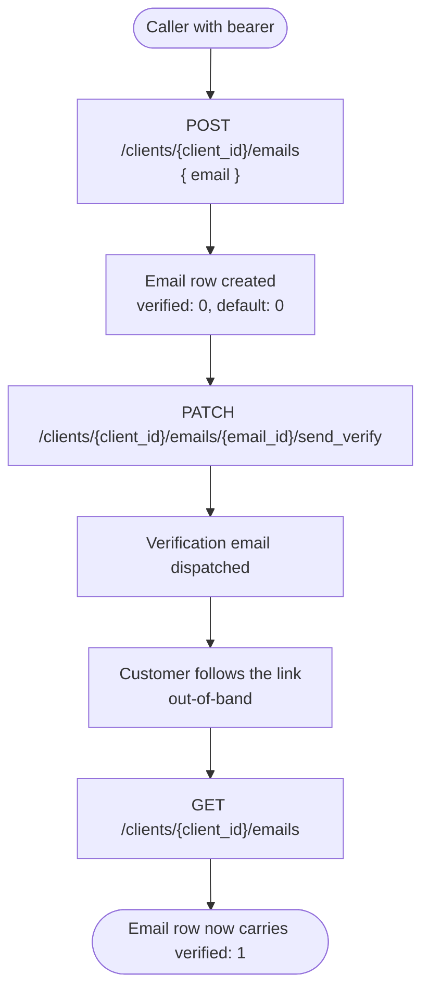
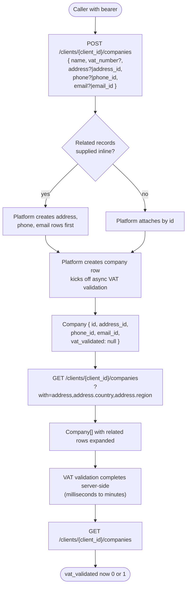
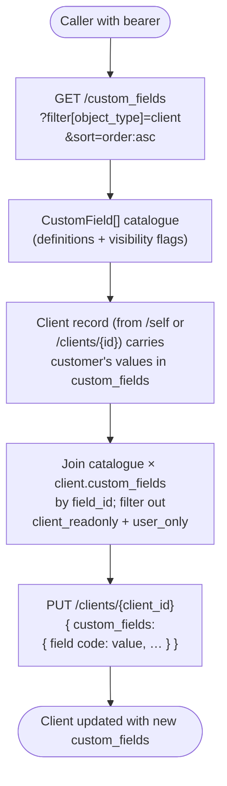

# Module: client

## What it is

Client is the customer record once a visitor has been authenticated as a real person, plus everything that hangs off that record: profile fields, postal addresses, phone numbers, additional email addresses, registered companies, brand-defined custom fields, and the history of emails the platform has sent the customer. Session resolves _who_ the bearer is; client is the editable, multi-shape representation of that person — the data captured at registration and grown over time by the customer panel and the checkout. Every authenticated surface that needs to read or write something about the customer — checkout collecting a billing address, the panel listing companies for VAT, an invoice rendered against a tax-validated company, a registration form picking up brand-defined extension fields — operates on the data this module exposes.

> _Any `meta` field returned by Upmind endpoints is UI-specific to our own client — ignore for spec purposes._

## Core concepts

- **Client record** — the canonical identity row for an authenticated customer. Carries name, language, verification state, fraud signals, custom-field values, and pointers to related sub-records.
- **Sub-record** — a child collection scoped under one client: addresses, phones, emails, companies, sent emails. Each sub-record has its own list endpoint under `/clients/{client_id}/…` and its own default flag.
- **Default flag** — every collection (addresses, phones, emails, companies) carries at most one row flagged `default`. Setting one as default is an explicit mutation; new entries do not become default automatically. The default row is what other surfaces (checkout, billing, dispatch) reach for first.
- **Custom field** — a brand-defined extension to the client record. Each custom field has a code, a typed input (`text`, `select`, `textarea`, `number`, …), a required flag, and visibility flags (`show_on_order_form`, `show_on_invoice`). Values for one client live inside the client record's `custom_fields` array, keyed by `field_id`.
- **Verification state** — addresses, phones, emails, and companies each track their own verified flag. Email verification is an explicit endpoint (`send_verify`); the others are administrative. A row being unverified is informational, not a blocker.
- **Tax validation** — companies carry VAT identity (`vat_number`) and validation outcome (`vat_validated`, `vat_validated_with`, `vat_validation_failed_reason`, `vat_validation_checked_at`). VAT validation is performed asynchronously by the back end; the customer-facing surfaces read the result, they do not trigger it.
- **Sent email** — a record of an email the platform has dispatched to the client. Read-only history; carries subject, body, sender, recipient summary, and delivery status (sent / bounced / errored).

## Operations

| #   | Capability                           | Inputs                                                                                                           | Outputs                                                                                                                                                                                                                  |
| --- | ------------------------------------ | ---------------------------------------------------------------------------------------------------------------- | ------------------------------------------------------------------------------------------------------------------------------------------------------------------------------------------------------------------------ |
| 1   | **Update profile fields**            | `{ firstname?, lastname?, public_name?, interface_language_id?, custom_fields? }`                                | Updated client record. Side effect: when `interface_language_id` changes, downstream locale follows.                                                                                                                     |
| 2   | **Read addresses**                   | —                                                                                                                | List of address rows for the active client, each with country and region expanded, default flag, delete-allowed flag.                                                                                                    |
| 3   | **Create / update / delete address** | address model (lines, city, postcode, country, optional region/state)                                            | Created or updated address row; delete returns nothing.                                                                                                                                                                  |
| 4   | **Set default address**              | `address_id`                                                                                                     | Updated address row with `default: true`. Server-side enforces at most one default.                                                                                                                                      |
| 5   | **Read phones**                      | —                                                                                                                | List of phone rows for the active client, each with parsed national number, calling code, ISO country code, default flag.                                                                                                |
| 6   | **Create / update / delete phone**   | phone model `{ number, nationalNumber, countryCallingCode, country }`                                            | Created or updated phone row; delete returns nothing.                                                                                                                                                                    |
| 7   | **Set default phone**                | `phone_id`                                                                                                       | Updated phone row with `default: 1`.                                                                                                                                                                                     |
| 8   | **Read emails**                      | —                                                                                                                | List of email rows for the active client, each with verification state, bounce state, default flag, delete-allowed flag.                                                                                                 |
| 9   | **Create / update / delete email**   | `{ email }`                                                                                                      | Created or updated email row; delete returns nothing. Adding an email does not mark it verified.                                                                                                                         |
| 10  | **Send verification for email**      | `email_id`                                                                                                       | Triggers an outbound verification email; response is an acknowledgement.                                                                                                                                                 |
| 11  | **Set default email**                | `email_id`                                                                                                       | Updated email row with `default: 1`.                                                                                                                                                                                     |
| 12  | **Read companies**                   | —                                                                                                                | List of company rows for the active client, each with name, registration number, address / phone / email references (expandable), VAT identity and validation outcome, default flag.                                     |
| 13  | **Create / update / delete company** | `{ name, regNumber?, tax?: { number? }, addressId? \| address, emailId? \| email, phoneId? \| phone, default? }` | Created or updated company row. The dependent address / phone / email are either referenced by id or created inline alongside the company.                                                                               |
| 14  | **Set default company**              | `company_id`                                                                                                     | Updated company row with `default: true`.                                                                                                                                                                                |
| 15  | **Read custom-field catalogue**      | —                                                                                                                | List of brand-defined custom field definitions scoped to the client object: id, code, name, type, required, options for select-style fields, visibility flags (`show_on_order_form`, `show_on_invoice`), readonly flags. |
| 16  | **Read sent-email history**          | optional filters / pagination                                                                                    | Paginated list of emails dispatched to the active client, sorted newest first. Each row carries subject, sender, recipient summary, delivery status, sent / bounced / errored timestamps.                                |
| 17  | **Read one sent email**              | `email_id`                                                                                                       | Full rendered email including body content.                                                                                                                                                                              |

> After any mutation against operations 2–14 the corresponding list returns the new state on the next read; the default row is whichever row carries the `default` flag set, or none when the collection is empty.

## Data shape

### Client record (the `actor` block returned by `/self`)

The customer-area surfaces of this module operate against the client whose id is exposed by session. The full client record itself is loaded by session via `/self` (covered in the session foundation doc). Profile mutations write back to `/clients/{id}`; the same id is the path prefix for every sub-record collection below.

```ts
// IClient — the canonical client row. The fields below are the ones a storefront
// commonly reads or writes from the customer-area surfaces. The full record carries
// further admin-adjacent columns: fraud policy, support pin, reseller affiliate
// fields, child-account configuration, package limits, plus invoicing / dunning /
// account-behaviour columns (`tax_type`, `topup_enabled`, `invoice_consolidation_*`,
// `before_due_date_charge_interval`, `secret_code`, `never_cancel`, `never_close`,
// `never_suspend`, `notifications_disabled`).
type Client = {
  id: string;
  org_id: string;
  brand_id: string;
  username: string; // login identifier — typically the email
  email: string; // primary email mirror — sub-record under /emails is authoritative
  firstname: string;
  lastname: string;
  fullname: string; // server-computed
  public_name: string;
  image_url: string | null; // avatar — gravatar URL when no upload
  picture: string;
  interface_language_id: string; // preferred UI language
  interface_language_code: string; // BCP-47 — e.g. "en-US"
  document_language_id: string;
  document_language_code: string;
  custom_fields: CustomFieldValue[]; // brand-defined extension fields, keyed by field_id
  verified: boolean; // account verified
  is_guest: boolean; // true while the actor is a guest_customer
  enabled_2fa: boolean;
  provider_2fa_id: string | null;
  has_login: boolean;
  has_legacy_invoices: boolean;
  location_country_code: string | null; // derived from default address
  location_town: string | null;
  location_source: string;
  default_email: {
    id: string;
    email: string;
    verified: number;
    bounced: boolean;
  } | null;
  default_company?: { id: string; name: string }; // populated when relation expanded
  default_phone?: { id: string; full_phone: string }; // populated when relation expanded
  addresses: Address[]; // populated when relation expanded
  accounts: Account[]; // billing accounts the client owns
  tags: Tag[];
  status_id: string;
  // …plus admin-adjacent fields the customer-area does not write to.
};

type CustomFieldValue = {
  id: string;
  field_id: string;
  value: number | string;
};

// Profile-update body for PUT /clients/{id}.
// Send only the fields you want to change; omitted keys are left untouched.
type ProfileUpdateBody = {
  firstname?: string;
  lastname?: string;
  public_name?: string;
  interface_language_id?: string;
  custom_fields?: Record<string, unknown>; // keyed by field CODE, not field_id
};
```

### Address

```ts
// IAddress — one row in the /clients/{id}/addresses collection.
type Address = {
  id: string;
  client_id: string;
  user_id: string;
  default: boolean; // at most one row per client is default
  type: number | null; // 1=Home, 2=Office, 3=Holiday, 4=Company
  name: string | null; // optional label (e.g. "Head office")
  address_1: string | null;
  address_2: string | null;
  city: string | null;
  county: string | null;
  postcode: string | null;
  country_id: string;
  country?: Country; // populated when expanded
  region_id?: string | null; // "none" when explicitly absent
  region?: Region | null; // populated when expanded
  state: string | null; // free-text alternative to region_id (some countries)
  verified: number | null;
  can_delete: boolean; // server-computed — false when in use elsewhere
  external_id: string | null; // import passthrough (null for client-created addresses)
  import_id: string | null; // import correlation id (null for client-created addresses)
  staged_import: boolean; // true while the row is part of an in-progress data import
  created_at: string | null;
  updated_at: string | null;
  deleted_at: string | null;
};

// Create / update body for POST /clients/{id}/addresses and PUT /clients/{id}/addresses/{address_id}.
type AddressBody = {
  address_1: string;
  address_2?: string;
  city: string;
  postcode: string;
  country_id: string;
  region_id?: string | null;
  state?: string;
  name?: string;
  type?: number;
  default?: boolean;
};
```

### Phone

```ts
// IPhone — one row in the /clients/{id}/phones collection.
type Phone = {
  id: string;
  client_id: string;
  user_id: string;
  type: number | null; // 1=Mobile, 2=Home, 3=Office, 4=Other
  default: number | null; // 0 | 1
  phone: string | null; // national number, no prefix — e.g. "800030303"
  phone_code: string; // calling code, with "+" — e.g. "+27"
  phone_country_code: string; // ISO 3166-1 alpha-2 — e.g. "ZA"
  international_phone: string; // full international form — e.g. "+27800030303"
  full_phone: string; // display variant of international_phone
  syntax_valid: boolean; // server-side parse outcome
  verified: number;
  can_delete: boolean;
  created_at: string | null;
  updated_at: string | null;
  deleted_at: string | null;
};

// Create / update body for POST/PUT /clients/{id}/phones.
type PhoneBody = {
  phone: string; // national number
  phone_code: string; // calling code with "+"
  phone_country_code: string; // ISO alpha-2
  type?: number;
  default?: boolean;
};
```

### Email

```ts
// IEmail — one row in the /clients/{id}/emails collection.
type Email = {
  id: string;
  client_id: string;
  user_id: string;
  email: string;
  type: number; // 1=Account
  default: number; // 0 | 1
  verified: number; // 0 | 1
  bounced: boolean;
  bounced_at: string | null;
  can_delete: boolean;
  created_at: string;
  updated_at: string;
  deleted_at: string | null;
};

// Create / update body for POST/PUT /clients/{id}/emails.
type EmailBody = {
  email: string;
  type?: number;
  default?: boolean;
};
```

### Company

```ts
// ICompany — one row in the /clients/{id}/companies collection.
// Carries the company identity plus references to the address / phone / email
// records used for invoicing and tax correspondence.
type Company = {
  id: string;
  client_id: string;
  user_id: string;
  default: boolean;
  verified: number | null;
  name: string;
  reg_number: string | null;
  // Tax identity and validation outcome — validation runs server-side, asynchronously.
  vat_number: string | null;
  vat_percent: string | null; // numeric string when populated
  vat_validated: 0 | 1 | null;
  vat_validated_with: string | null; // validator backend name when known
  vat_validation_checked_at: string | null;
  vat_validation_failed_reason: string | null;
  // Related-record references — populated when expanded via `with=address,address.country,address.region`.
  address_id: string;
  address?: Address;
  phone_id: string;
  phone?: Phone;
  email_id: string | null;
  email?: Email;
  can_delete: boolean;
  created_at: string;
  updated_at: string;
  deleted_at: string | null;
};

// Create / update body for POST/PUT /clients/{id}/companies.
// Each related record may be referenced by id OR supplied inline; the server creates
// the related row first and then attaches it to the company. The `vat_*` outcome
// fields (`vat_validated`, `vat_validated_with`, `vat_validation_checked_at`,
// `vat_validation_failed_reason`, `vat_percent`) are server-owned and are not part
// of this body — the server populates them after running validation.
type CompanyBody = {
  name: string;
  reg_number?: string | null;
  vat_number?: string | null;
  // One-of for each related record:
  address_id?: string;
  address?: AddressBody;
  email_id?: string;
  email?: { email: string };
  phone_id?: string;
  phone?: PhoneBody;
  default?: boolean;
};
```

### Custom field (catalogue entry)

```ts
// ICustomField — one row in the brand-scoped custom field catalogue
// (returned by GET /custom_fields?filter[object_type]=client).
// The values for one client live inside Client.custom_fields, keyed by field_id.
type CustomField = {
  id: string;
  code: string; // stable machine identifier
  name: string; // display label
  name_translated?: string;
  type: number; // 1=Text 2=Password 3=Select 4=Radio 5=Textarea 6=Date 7=Number 8=Image
  type_code: string;
  object_type: string; // "client" for entries returned by this filter
  required: boolean;
  hidden: boolean;
  editable: boolean;
  client_readonly: boolean; // true means the customer cannot edit
  user_only: boolean; // true means staff-only
  display_type: string;
  display_contexts: {
    order_form: boolean;
    invoice: boolean;
  };
  show_on_order_form: boolean; // mirror of display_contexts.order_form
  show_on_invoice: boolean; // mirror of display_contexts.invoice
  order?: number; // catalogue ordering hint
  value: unknown; // default value when defined at catalogue level
  values: Array<{ value: string; label: string }>; // populated for select-style fields
  created_at: string;
  deleted_at: string | null;
};
```

### Sent email (history)

```ts
// ISentEmail — one row in /self/email_history.
type SentEmail = {
  id: string;
  account_id: string;
  brand_id: string;
  client_id: string;
  template_id: string;
  template_content_id: string;
  language_id: string;
  subject: string;
  from: string;
  to: string;
  cc: string;
  bcc: string;
  body?: string; // populated when loading a single email (with=data)
  sent: boolean;
  sent_at: string;
  bounced: boolean;
  bounced_at: string;
  error_id: string;
  error_message: string;
  resent: boolean;
  resend_email_id: string;
  recipient_id: string;
  recipient_type_id: string;
  recipient_type?: { id: string; code: string; name: string };
  recipient?: {
    // shape depends on recipient_type
    id: string;
    fullname: string;
    email: string;
    image?: { id: string; full_url: string };
  };
  smart_email_id: string | null;
  smart_template_id: string | null;
  reseller_account_id: string | null;
  hook_log_id: string;
  created_at: string;
  updated_at: string;
};
```

## Dependencies

### Dependants — modules that read from this one

| Module             | Weight | Reads                                                                                                                              | Why                                                                                                                                                                         |
| ------------------ | ------ | ---------------------------------------------------------------------------------------------------------------------------------- | --------------------------------------------------------------------------------------------------------------------------------------------------------------------------- |
| `basket`           | 3      | client id, default address, default company, default phone, default email, custom-field values                                     | Checkout requires a billing address, an invoicing company, and a contact phone/email; client custom-field values populate the basket custom-field collection at submission. |
| `invoices`         | 2      | client id, default company, default address, custom-field values                                                                   | Invoices are issued against the client's default company; line-level custom fields draw from the client catalogue entries flagged `show_on_invoice`.                        |
| `system`           | 1      | client locale (type-only reference)                                                                                                | Locale-aware surfaces in system reference the client's `interface_language_code` via type imports.                                                                          |
| Presentation layer | —      | client display name, avatar, default email, default phone, default address, default company, locale, custom-field values for forms | Customer-panel chrome (account menu, profile page, address book, companies list), checkout review screens, and registration forms picking up brand custom fields.           |

### This module's own dependencies

- **HTTP transport layer** — bearer-token attachment (every endpoint is authenticated), locale injection, error shape normalisation, list-pagination conventions (`limit`, `offset`, sort, `with` expand list). The `with` parameter is load-bearing: company queries fetch related address / phone / email inline rather than the consumer issuing follow-up lookups.
- **Session** — supplies the active `client_id` that prefixes every sub-record URL, plus the guard "is the caller authenticated as this client?" that gates every list call. The client record itself is loaded into session at boot via `/self`; this module operates on it after the fact.
- **System** — supplies the country list, region-by-country list, and ISO phone-code metadata that address and phone forms read from. Phone numbers are parsed against the country code returned by system; address country/region selectors validate against the system country and region lookups.
- **Brand** — supplies the `REQUIRE_REGION_IN_ADDRESS` policy (whether the region field is required in address forms) and other address / phone / company validation policy keys.
- **Shared types / enums** — `IClient`, `IAddress`, `IPhone`, `IEmail`, `ICompany`, `ICustomField`, `ICustomFieldValue`, `ISentEmail` from `packages/types/src/models/`; `CustomFieldsMajorTypes`, `CustomFieldsTypes`, `SentEmailStatus`, `RecipientTypeCodes`, `ClientTaxTypes`, `DaysOfWeekTypes`, `InvoiceConsolidationRuleTypes` from `packages/types/src/data/enums/`.

## API endpoints

### `PUT /clients/{client_id}`

Updates the client profile fields. Send only the fields you want to change. Returns the full updated client record.

```bash
curl -s "$API/clients/$CLIENT_ID" \
  -X PUT \
  -H "Authorization: Bearer $ACCESS_TOKEN" \
  -H "Content-Type: application/json" \
  --data '{
    "firstname":"Dom",
    "lastname":"Da Costa",
    "public_name":"Dom D.",
    "interface_language_id":"5d085e69-d562-3719-4eb2-18e940d42370",
    "custom_fields":[
      {"field_id":"5d085e69-d562-3719-4eb2-18e940d42370","value":"GB 000 0000"}
    ]
  }'
```

```json
// stubbed — real capture replaces this
{
  "status": "ok",
  "data": {
    "id": "8d632507-9806-5d1e-48dc-8174e234e98d",
    "firstname": "Dom",
    "lastname": "Da Costa",
    "fullname": "Dom Da Costa",
    "public_name": "Dom D.",
    "interface_language_id": "5d085e69-d562-3719-4eb2-18e940d42370",
    "interface_language_code": "en-US",
    "custom_fields": [
      {
        "id": "78985742-6489-7012-959c-21e325d0ed36",
        "field_id": "5d085e69-d562-3719-4eb2-18e940d42370",
        "value": "GB 000 0000"
      }
    ],
    "verified": true,
    "is_guest": false
  }
}
```

### `GET /clients/{client_id}/addresses?with=region,country`

Lists every address row for the active client. The `with` expand list inlines `country` and `region`; without it the consumer has to issue lookup calls to resolve `country_id` / `region_id`. Paginated by the standard `limit` / `offset` envelope.

```bash
curl -s "$API/clients/$CLIENT_ID/addresses?with=region,country&limit=0&offset=0" \
  -H "Authorization: Bearer $ACCESS_TOKEN"
```

```json
{
  "status": "ok",
  "data": [
    {
      "id": "825d96e7-63ed-0913-46df-417482528340",
      "client_id": "8d632507-9806-5d1e-48dc-8174e234e98d",
      "user_id": "sys",
      "default": false,
      "type": 1,
      "name": "Nathanael TrackXYZ",
      "address_1": "818 Beach Front Avenue",
      "address_2": "Malibu",
      "region_id": "d6325079-8065-d1e5-839b-8174e234e98d",
      "country_id": "2785d26e-9678-3d16-75ec-314502e70439",
      "city": "Solana Palms Beach",
      "county": null,
      "postcode": "92075",
      "state": null,
      "verified": 0,
      "can_delete": false,
      "created_at": "2024-01-17 12:29:24",
      "updated_at": "2025-12-22 14:52:26",
      "deleted_at": null,
      "region": {
        "id": "d6325079-8065-d1e5-839b-8174e234e98d",
        "country_id": "2785d26e-9678-3d16-75ec-314502e70439",
        "code": "CA",
        "name": "California"
      },
      "country": {
        "id": "2785d26e-9678-3d16-75ec-314502e70439",
        "name": "United States",
        "code": "US",
        "phone_code": "+1",
        "vat": "0.00",
        "eea": 0,
        "post_code_regex": "^\\b\\d{5}\\b(?:[- ]{1}\\d{4})?$"
      }
    },
    {
      "id": "7d738248-5079-3153-358f-81e642d59e06",
      "client_id": "8d632507-9806-5d1e-48dc-8174e234e98d",
      "user_id": "sys",
      "default": true,
      "type": 1,
      "name": "Deonte Loop",
      "address_1": "4979 The Coppice Apt. 979",
      "address_2": "55870",
      "region_id": "none",
      "country_id": "2785d26e-9678-3d16-75ec-314502e70439",
      "city": "Milpitas",
      "postcode": "00794-0614",
      "verified": 0,
      "can_delete": false,
      "country": {
        "id": "2785d26e-9678-3d16-75ec-314502e70439",
        "name": "United States",
        "code": "US",
        "phone_code": "+1"
      },
      "region": null
    }
  ],
  "total": 31
}
```

> Sample trimmed — additional rows preserved in the captured fixture. Note `region_id: "none"` is a sentinel for "country has regions, none chosen"; `region_id: null` means the country has no regions to choose from.

### `POST /clients/{client_id}/addresses`

Creates an address row.

```bash
curl -s "$API/clients/$CLIENT_ID/addresses" \
  -X POST \
  -H "Authorization: Bearer $ACCESS_TOKEN" \
  -H "Content-Type: application/json" \
  --data '{
    "address_1":"10 Downing Street",
    "city":"London",
    "postcode":"SW1A 2AA",
    "country_id":"320e4357-95e7-8d18-484f-31643202d986",
    "region_id":"de78642d-e539-7146-295f-21208469530d"
  }'
```

```json
{
  "status": "ok",
  "data": {
    "id": "d085e69d-5623-719e-508a-218e940d4237",
    "client_id": "03679424-d0e7-1099-7e4f-3153698d582e",
    "address_1": "South Park Road",
    "address_2": "",
    "country_id": "320e4357-95e7-8d18-484f-31643202d986",
    "region_id": "de78642d-e539-7146-295f-21208469530d",
    "city": "London",
    "county": null,
    "postcode": "SW19 8TD",
    "name": "South Park Road",
    "type": 1,
    "default": false,
    "verified": 0,
    "user_id": "sys",
    "can_delete": true,
    "created_at": "2026-05-16 10:08:53",
    "updated_at": "2026-05-16 10:08:53"
  }
}
```

### `PUT /clients/{client_id}/addresses/{address_id}`

Updates one address row. Body shape is identical to the create call; passing `{ "default": true }` is the canonical way to set the default address (server clears the prior default).

### `DELETE /clients/{client_id}/addresses/{address_id}`

Removes an address row. Fails when `can_delete` is false (address is in use as a default or as a company address).

### `GET /clients/{client_id}/phones`

Lists every phone row for the active client.

```bash
curl -s "$API/clients/$CLIENT_ID/phones?limit=0&offset=0" \
  -H "Authorization: Bearer $ACCESS_TOKEN"
```

```json
{
  "status": "ok",
  "data": [
    {
      "id": "825d96e7-63ed-0913-043b-417482528340",
      "client_id": "8d632507-9806-5d1e-48dc-8174e234e98d",
      "user_id": "sys",
      "type": 1,
      "default": 1,
      "verified": 0,
      "syntax_valid": true,
      "phone": "800030303",
      "phone_code": "+27",
      "international_phone": "+27800030303",
      "phone_country_code": "ZA",
      "full_phone": "+27800030303",
      "can_delete": true,
      "created_at": "2024-01-29 14:16:34",
      "updated_at": "2024-05-09 11:04:16",
      "deleted_at": null
    },
    {
      "id": "8d632507-9806-5d1e-49da-8174e234e98d",
      "type": 3,
      "default": 0,
      "verified": 0,
      "syntax_valid": true,
      "phone": "8004444443",
      "phone_code": "+1",
      "international_phone": "+18004444443",
      "phone_country_code": "US",
      "full_phone": "+18004444443",
      "can_delete": true
    },
    {
      "id": "5952098d-3de4-0917-83df-31578626e347",
      "type": 2,
      "default": 0,
      "phone": "2087599036",
      "phone_code": "+44",
      "international_phone": "+442087599036",
      "phone_country_code": "GB",
      "full_phone": "+442087599036",
      "can_delete": true
    }
  ],
  "total": 4
}
```

### `POST /clients/{client_id}/phones`

Creates a phone row. The body carries the national `phone`, the ISO country code (`phone_country_code`), and the calling code with leading `+` (`phone_code`); the server returns the canonicalised `international_phone` and `full_phone`.

```bash
curl -s "$API/clients/$CLIENT_ID/phones" \
  -X POST \
  -H "Authorization: Bearer $ACCESS_TOKEN" \
  -H "Content-Type: application/json" \
  --data '{
    "phone":"5551234567",
    "phone_code":"+1",
    "phone_country_code":"US",
    "type":1
  }'
```

```json
{
  "status": "ok",
  "data": {
    "id": "89857426-4897-0120-887b-21e325d0ed36",
    "client_id": "03679424-d0e7-1099-7e4f-3153698d582e",
    "user_id": "sys",
    "type": 1,
    "default": false,
    "verified": 0,
    "syntax_valid": true,
    "phone": "800030301",
    "phone_code": "+44",
    "international_phone": "+44800030301",
    "phone_country_code": "GB",
    "full_phone": "+44800030301",
    "can_delete": true,
    "created_at": "2026-05-16 10:09:03",
    "updated_at": "2026-05-16 10:09:03"
  }
}
```

### `PUT /clients/{client_id}/phones/{phone_id}`

Updates one phone row. Passing `{ "default": true }` is the canonical way to set the default phone.

### `DELETE /clients/{client_id}/phones/{phone_id}`

Removes a phone row.

### `GET /clients/{client_id}/emails`

Lists every email row for the active client.

```bash
curl -s "$API/clients/$CLIENT_ID/emails?limit=0&offset=0" \
  -H "Authorization: Bearer $ACCESS_TOKEN"
```

```json
{
  "status": "ok",
  "data": [
    {
      "id": "0e435795-e78d-1844-d28c-31643202d986",
      "client_id": "03679424-d0e7-1099-7e4f-3153698d582e",
      "user_id": "sys",
      "type": 1,
      "default": true,
      "verified": false,
      "email": "user+61479@test.com",
      "bounced": false,
      "bounced_at": null,
      "can_delete": false,
      "created_at": "2026-05-16 10:04:37",
      "updated_at": "2026-05-16 10:04:37"
    }
  ],
  "total": 1
}
```

### `POST /clients/{client_id}/emails`

Creates an email row.

```bash
curl -s "$API/clients/$CLIENT_ID/emails" \
  -X POST \
  -H "Authorization: Bearer $ACCESS_TOKEN" \
  -H "Content-Type: application/json" \
  --data '{"email":"alt@example.com"}'
```

### `PUT /clients/{client_id}/emails/{email_id}`

Updates one email row. Passing `{ "default": true }` is the canonical way to set the default email.

### `PATCH /clients/{client_id}/emails/{email_id}/send_verify`

Triggers an outbound verification email to the supplied email row. Response is an acknowledgement; the verification result is observed asynchronously via the `verified` flag on the email row.

```bash
curl -s "$API/clients/$CLIENT_ID/emails/$EMAIL_ID/send_verify" \
  -X PATCH \
  -H "Authorization: Bearer $ACCESS_TOKEN"
```

### `DELETE /clients/{client_id}/emails/{email_id}`

Removes an email row.

### `GET /clients/{client_id}/companies?with=address,address.country,address.region`

Lists every company row for the active client. The expand list inlines the related address (with country and region), email, and phone records.

```bash
curl -s "$API/clients/$CLIENT_ID/companies?with=address,address.country,address.region&limit=0&offset=0" \
  -H "Authorization: Bearer $ACCESS_TOKEN"
```

```json
{
  "status": "ok",
  "data": [
    {
      "id": "47d73824-8507-9315-96c8-1e642d59e063",
      "client_id": "8d632507-9806-5d1e-48dc-8174e234e98d",
      "default": false,
      "verified": 1,
      "name": "The Collaboration Studio (PTY) Ltd",
      "reg_number": "ig-34532-4545433",
      "vat_number": null,
      "vat_percent": null,
      "vat_validated": null,
      "vat_validated_with": null,
      "vat_validation_checked_at": null,
      "vat_validation_failed_reason": null,
      "address_id": "d085e69d-5623-7197-258a-218e940d4237",
      "phone_id": "825d96e7-63ed-0913-043b-417482528340",
      "email_id": "3de78642-de53-9714-29ec-21208469530d",
      "can_delete": false,
      "address": {
        "id": "d085e69d-5623-7197-258a-218e940d4237",
        "default": false,
        "type": 1,
        "name": "10 Downing Street",
        "address_1": "10 Downing Street",
        "city": "London",
        "postcode": "SW1A 2AA",
        "country_id": "320e4357-95e7-8d18-484f-31643202d986",
        "region_id": "de78642d-e539-7146-295f-21208469530d",
        "country": {
          "id": "320e4357-95e7-8d18-484f-31643202d986",
          "code": "GB",
          "name": "United Kingdom",
          "phone_code": "+44",
          "vat": "20.00",
          "eea": 1
        },
        "region": {
          "id": "de78642d-e539-7146-295f-21208469530d",
          "code": "LND",
          "name": "Greater London"
        }
      },
      "email": {
        "id": "3de78642-de53-9714-29ec-21208469530d",
        "type": 1,
        "default": 0,
        "verified": false,
        "email": "you@dominicpedro.com",
        "bounced": false
      },
      "phone": {
        "id": "825d96e7-63ed-0913-043b-417482528340",
        "type": 1,
        "default": true,
        "phone": "800030303",
        "phone_code": "+27",
        "international_phone": "+27800030303",
        "phone_country_code": "ZA",
        "full_phone": "+27800030303"
      }
    }
  ],
  "total": 2
}
```

> Sample trimmed — additional company rows preserved in the captured fixture.

### `POST /clients/{client_id}/companies`

Creates a company row. Each related record may be referenced by id (`address_id` / `email_id` / `phone_id`) OR supplied inline (`address` / `email` / `phone`); when supplied inline, the server creates the related row first and then attaches it. Either form is valid; a single create call cannot mix id-reference and inline shape for the _same_ related record but can mix across records (e.g. `address_id` + new inline `phone`).

```bash
curl -s "$API/clients/$CLIENT_ID/companies" \
  -X POST \
  -H "Authorization: Bearer $ACCESS_TOKEN" \
  -H "Content-Type: application/json" \
  --data '{
    "name":"Acme Ltd",
    "reg_number":"12345678",
    "vat_number":"GB123456789",
    "address_id":"d085e69d-5623-7197-258a-218e940d4237",
    "email_id":"3de78642-de53-9714-29ec-21208469530d",
    "phone_id":"825d96e7-63ed-0913-043b-417482528340"
  }'
```

### `PUT /clients/{client_id}/companies/{company_id}`

Updates one company row. Passing `{ "default": true }` is the canonical way to set the default company. Tax validation outcome is server-owned — `vat_validated`, `vat_validated_with`, `vat_validation_checked_at`, `vat_validation_failed_reason` cannot be set by the client; the server populates them after running validation.

```bash
curl -s "$API/clients/$CLIENT_ID/companies/$COMPANY_ID" \
  -X PUT \
  -H "Authorization: Bearer $ACCESS_TOKEN" \
  -H "Content-Type: application/json" \
  --data '{
    "name":"Botsford, Dickens and Ziemann",
    "vat_number":"309-ABC-123",
    "reg_number":"370-3435-2322-123",
    "address_id":"25d96e76-3ed0-9136-945f-417482528340",
    "phone_id":"de78642d-e539-7145-777a-21208469530d"
  }'
```

```json
{
  "status": "ok",
  "data": {
    "id": "320e4357-95e7-8d18-de0b-31643202d986",
    "client_id": "03679424-d0e7-1099-7e4f-3153698d582e",
    "name": "Botsford, Dickens and Ziemann",
    "default": true,
    "verified": 1,
    "vat_number": "309-ABC-123",
    "vat_validated": null,
    "vat_validation_failed_reason": null,
    "vat_validated_with": null,
    "vat_validation_checked_at": null,
    "reg_number": "370-3435-2322-123",
    "address_id": "25d96e76-3ed0-9136-945f-417482528340",
    "phone_id": "de78642d-e539-7145-777a-21208469530d",
    "email_id": "0e435795-e78d-1844-d28c-31643202d986",
    "can_delete": true,
    "user_id": "sys",
    "created_at": "2026-05-16 10:05:13",
    "updated_at": "2026-05-16 10:09:21"
  }
}
```

> Sample trimmed — the full capture also embeds the related `client` record under `data.client` when the response is built from the post-update read.

### `DELETE /clients/{client_id}/companies/{company_id}`

Removes a company row.

### `GET /custom_fields?filter[object_type]=client&sort=order:asc`

Lists the brand-defined custom-field catalogue for the client object. Used both for building the registration form (filter further by `show_on_order_form: true`) and for rendering the customer-area profile-fields surface.

```bash
curl -s "$API/custom_fields?filter%5Bobject_type%5D=client&sort=order:asc" \
  -H "Authorization: Bearer $ACCESS_TOKEN"
```

```json
// stubbed — real capture replaces this
{
  "status": "ok",
  "data": [
    {
      "id": "5d085e69-d562-3719-4eb2-18e940d42370",
      "code": "vat_number",
      "name": "VAT Number",
      "type": 1,
      "type_code": "text",
      "object_type": "client",
      "required": false,
      "hidden": false,
      "editable": true,
      "client_readonly": false,
      "user_only": false,
      "show_on_order_form": true,
      "show_on_invoice": true,
      "display_contexts": { "order_form": true, "invoice": true },
      "values": [],
      "order": 1
    }
  ]
}
```

> Sample stubbed because the staging brand currently has no client-scoped custom fields — the fixture `get--clients_fields.json` returns an empty array. A brand that has configured custom fields returns the shape above with one entry per field.

### `GET /self/email_history?with=recipient,recipient_type,recipient.image`

Paginated history of emails dispatched to the active client. Sorted newest first (`sort=-created_at`). Filters: `filter[sent]`, `filter[bounced]`, `filter[template_id]`, `filter[recipient_id]`, plus the standard `q` free-text search. Returns the list plus a `total` count via the standard split-count envelope.

```bash
curl -s "$API/self/email_history?with=recipient,recipient_type,recipient.image&limit=20&offset=0&sort=-created_at" \
  -H "Authorization: Bearer $ACCESS_TOKEN"
```

```json
// stubbed — real capture replaces this
{
  "status": "ok",
  "data": [
    {
      "id": "5d085e69-d562-3719-4eb2-18e940d42370",
      "subject": "Your invoice is ready",
      "from": "billing@upmind.io",
      "to": "dom.dacosta@gmail.com",
      "sent": true,
      "sent_at": "2026-05-14 11:22:33",
      "bounced": false,
      "error_message": "",
      "template_id": "47d73824-8507-9315-e54f-81e642d59e06",
      "recipient_id": "8d632507-9806-5d1e-48dc-8174e234e98d",
      "recipient_type": { "code": "client", "name": "Client" },
      "recipient": {
        "id": "8d632507-9806-5d1e-48dc-8174e234e98d",
        "fullname": "Dom Da Costa",
        "email": "dom.dacosta@gmail.com",
        "image": {
          "id": "78985742-6489-7012-585a-21e325d0ed36",
          "full_url": "https://www.gravatar.com/avatar/4289a4e6163b9adc987168444774435b?d=blank&s=200"
        }
      },
      "created_at": "2026-05-14 11:22:33"
    }
  ],
  "total": 47
}
```

### `GET /emails/{email_id}?with=data`

Loads one sent email by id, including the rendered body content (`with=data`). Used by the customer-panel "view email" surface.

```bash
curl -s "$API/emails/$EMAIL_ID?with=data" \
  -H "Authorization: Bearer $ACCESS_TOKEN"
```

```json
// stubbed — real capture replaces this
{
  "status": "ok",
  "data": {
    "id": "5d085e69-d562-3719-4eb2-18e940d42370",
    "subject": "Your invoice is ready",
    "from": "billing@upmind.io",
    "to": "dom.dacosta@gmail.com",
    "body": "<html>…</html>",
    "sent": true,
    "sent_at": "2026-05-14 11:22:33",
    "bounced": false,
    "template_id": "47d73824-8507-9315-e54f-81e642d59e06"
  }
}
```

## Flows

Most of what the client module exposes is one-call CRUD against a sub-record collection. A handful of interactions are genuinely multi-step — the platform performs work in stages, or the caller has to join data from more than one endpoint to render a single surface. Those are described below.

### Add an email and verify it

Adding an email row and getting it verified are two discrete platform calls, with the actual verification completing asynchronously after the customer follows the link in the dispatched email.



Guarantees the platform holds:

- Creating the email row and dispatching the verification message are separate operations. The create call returns a row with `verified: 0` and never dispatches an email by itself.
- The verification link in the dispatched email is what flips `verified` to `1`; the platform owns that flip end-to-end.
- The same email row can be sent a fresh verification message repeatedly — `send_verify` is idempotent in the sense that each call dispatches afresh.

Constraints the caller has to plan around:

- A signal that the verification has completed. The flip is observed only by re-reading the email list (or the next list refresh); no callback, no webhook on the caller side.
- A way to set an unverified email as default and have it accepted as primary. Verification state and default flag are independent on the row, but downstream consumers (notifications, invoicing) may behave differently against an unverified default.

### Create a company with inline related records

A company carries an address, a phone, and an email. Each can be supplied by id (referencing existing sub-records) or inline (new sub-records created alongside the company). When supplied inline, the platform creates the related row first, then the company — and a validation error on the related row surfaces as a child-record error path inside the company-create response.



Guarantees the platform holds:

- Inline and id-reference shapes are interchangeable per related record within a single create call. A company can mix (e.g. existing `address_id` plus a new inline `phone`).
- When the company is created, the related-record ids it returns (`address_id`, `phone_id`, `email_id`) are stable — the same ids appear in the `/addresses`, `/phones`, `/emails` collections.
- VAT validation runs server-side, asynchronously, after the create returns. The result is read from the company row's `vat_validated`, `vat_validated_with`, `vat_validation_checked_at`, `vat_validation_failed_reason` fields on a later read.

Constraints the caller has to plan around:

- A flat error path on validation failure. An invalid inline address surfaces as a company-create failure with a nested error referencing `address.*` — not a top-level address error and not a separate address-create response.
- A synchronous VAT validation outcome. The create response always carries `vat_validated: null`; treating it as "not validated" mislabels rows that are simply pending.
- The platform clearing `vat_*` fields on the client side if `vat_number` is edited later. A PUT that changes `vat_number` resets validation state to pending and re-runs validation server-side.

### Discover custom fields, then write values

The brand-defined custom fields the customer can edit live in a separate catalogue endpoint; the values themselves live inside the client record. Rendering a profile-fields form requires reading both and joining them client-side by `field_id`.



Guarantees the platform holds:

- The catalogue is brand-scoped — the same brand returns the same catalogue for every client. Visibility flags (`show_on_order_form`, `show_on_invoice`, `client_readonly`, `user_only`) are stable per field.
- Writing `custom_fields` on a profile PUT is an object keyed by field CODE; it replaces the values for the supplied codes only, and omitted fields retain their prior values.
- The values are typed by the catalogue entry's `type` / `type_code`; the platform validates server-side and rejects values that don't match (e.g. a string for a `number` field).

Constraints the caller has to plan around:

- A combined endpoint that returns the catalogue _and_ the customer's values. The two have to be joined client-side.
- A guarantee that every catalogue entry has a value on the client record. A field newly added by the brand is absent from the client's `custom_fields` array until the customer (or staff) writes it.
- The catalogue ordering being meaningful in the response payload. The `order` field is the rendering hint; field-list order in the response is not stable.

### Update profile (with locale side-effect)

Profile updates are a single PUT, but changing `interface_language_id` shifts the language the platform answers in on the next request — affecting every downstream module that depends on locale.

```mermaid
flowchart TD
    A([Caller with bearer]) --> B["PUT /clients/{client_id}<br/>{ firstname?, lastname?,<br/>public_name?,<br/>interface_language_id?,<br/>custom_fields? }"]
    B --> C["Client (updated)"]
    C --> D{interface_language_id<br/>changed?}
    D -->|yes| E["Server switches locale<br/>for the bearer on next request"]
    D -->|no| F["GET /clients/{client_id}/addresses"]
    E --> F
    F --> G([Address[] with country / region<br/>names in current locale])
```

Guarantees the platform holds:

- A single PUT covers every profile field; omitted keys are left untouched.
- The token is unchanged by the locale switch — the same bearer continues to work; only the server's interpretation of which language to answer in changes.
- The new locale is in effect from the very next request. There is no propagation delay on the platform side.

Constraints the caller has to plan around:

- The platform to retroactively re-localise responses already in flight. Requests fired before the PUT returns will complete in the prior locale.
- The platform to invalidate caches keyed off the prior locale on your behalf. Downstream consumers (system country list, brand strings, email templates) carry their own caches.

## Lessons (hard-won)

- **A client is one row plus five collections, and writes can land out of order.** Editing the profile, adding an address, and creating a company all hit different endpoints; the dependent reads (companies-with-address, basket-billing-address) cache against different keys. A storefront that mutates one collection and then reads another without invalidating the right cache shows stale data — the customer adds a phone in the panel, then opens checkout to find the new phone missing from the dropdown.

- **"Default" is a server-side singleton constraint, not a client-side hint.** Setting an address as default succeeds only because the server clears the prior default in the same call; two parallel "set default" mutations against the same client can race and leave the list with two default rows briefly visible in the cached list before the next list call reconciles. A panel UI that toggles default on a row optimistically without re-fetching the full list will desynchronise from the back end.

- **Companies are composite — an inline create can succeed for the company and fail for the related record.** The server creates address / phone / email first when supplied inline, then the company; a validation error on the inline address surfaces as a company-create failure with a child-record error path, not a top-level address error. A consumer that treats company-create errors as "company errors" hides the real cause from the user.

- **VAT validation outcome is asynchronous and read-only.** The customer-facing surfaces post a `vat_number` and observe `vat_validated` / `vat_validation_failed_reason` later; the validation itself runs on a worker and finishes any time from milliseconds to minutes after the create call returns. A panel that renders the validation banner from the immediate response shows "validating…" until the customer reloads — or worse, shows the prior validation outcome on the row that was just edited.

- **`region_id: "none"` and `region_id: null` are different states.** `null` means the country has no regions to choose from (e.g. small territories); `"none"` is the sentinel for "country has regions but none selected on this row". A form that coerces both to falsy and silently re-binds either to "first region in the list" produces wrong addresses for both cases. The brand config key controlling whether a region is required (`invoices.common.required_region_in_address`) further complicates this — the same row may be valid for one brand and invalid for another.

- **Phone numbers are stored in three forms and a storefront can pick the wrong one.** `phone` (national), `phone_code` + `phone_country_code` (calling-code + ISO country), and `international_phone` / `full_phone` (canonicalised). The server validates and re-canonicalises on every write; a form that round-trips a stored row by sending back `full_phone` as the `phone` field will fail validation in unpredictable ways depending on country. Round-tripping requires sending the same three input fields the form collected, not a recombination of the server-rendered display fields.

- **Email verification is decoupled from email creation.** Adding an email returns a row with `verified: 0`; the verified flag flips later, asynchronously, after the customer clicks the link in the verification email — which is dispatched by an _explicit second call_ to `send_verify`, not by the create. A panel that adds an email and then renders a "click the link in your inbox" banner without firing `send_verify` leaves the customer waiting for an email that never sends.

- **Custom fields are brand-defined and orthogonal to the profile fields.** The profile-fields surface and the registration form both read the catalogue but for different reasons: registration shows fields flagged `show_on_order_form`, the profile-fields surface shows everything the customer is allowed to edit (driven by `client_readonly` and `user_only`). A storefront that conflates the two — e.g. by treating "any field in the catalogue" as a registration-form field — produces over-long registration forms that include staff-only or invoice-only fields.

- **The default-record helpers are derived, not stored.** "Default address", "default phone", "default email", "default company" are each computed by filtering the relevant list for `default === true`. When the list is empty (newly-registered client; admin deleted the last row), the default is `undefined`. Downstream surfaces (checkout, billing) that assume the default is always present produce undefined-access errors on first-time customers and on edge accounts where defaults have been cleared.

- **The client record sub-records are five separate API contracts that look similar but aren't.** The default flag is `boolean` on addresses and companies, but `number` (`0 | 1`) on phones and emails. `verified` is `boolean` on emails and `number` on phones and addresses. `type` is enum-by-integer on phones and addresses (with different value spaces), and absent on emails. A consumer that types these uniformly will be surprised by runtime values.

- **Custom-field values live inside the client record, not on the field definition.** Reading the catalogue (`/custom_fields?filter[object_type]=client`) gives the definitions; reading the client's values requires the client's `custom_fields` array (delivered as part of `/self` or `/clients/{id}`). The two have to be joined client-side by `field_id`. A surface that reads the catalogue and treats the `value` column on the definition as the customer's value will render every customer with the catalogue defaults.

- **Sub-record deletes can fail for non-obvious reasons.** `can_delete: false` covers more than "the row is the default" — addresses attached to a company, phones attached to a verified company, emails on the verified-default path all surface as `can_delete: false`. The reason is not in the response; the storefront has to compute it ("this address is used by company X") by cross-referencing the company list. A naive delete UI that hides the delete button only when `default: true` leaves the button visible on rows the back end will reject.

- **Profile updates carry a side-effect on locale.** Changing `interface_language_id` on the profile changes the language the platform answers in on the next request — affecting every downstream module that depends on locale (system, brand, basket totals, email templates). A storefront that updates the profile and continues fetching without re-issuing localisation on the open requests will render half-translated screens for a few seconds. The interaction with the cookie-stored token is invisible from the client side because the token doesn't change — only the server's interpretation of what locale to respond in does.

- **Sent-email history is per-client but rendered against current data.** The email body stored on `ISentEmail` is a snapshot at send time; the rendered subject and recipient names are not. A renamed client appears under their _current_ name in the history list, even on emails sent years ago. A storefront that uses the history as a paper trail (e.g. for support disputes) needs to surface the snapshot via the email body and explicitly mark the recipient name as "current" — not historical.

- **`/self/email_history` and `/admin/self/email_history` are sibling endpoints that diverge by visibility, not by shape.** The client-area version is filtered to emails the customer is permitted to see; the admin version returns the same shape but includes internal notifications and staff-only correspondence. A consumer that switches between actor types without re-keying the cache will leak admin-visible records into the customer-area surface on actor transition.
