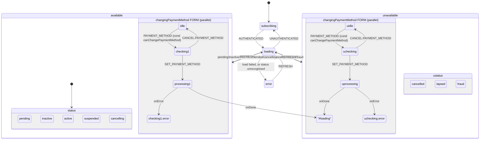

# contract Architecture

## Overview

The module ships two scoped composables under one module name: `useContracts` (a TanStack-query-backed collection, no machine) and `useContract` (a bespoke XState machine, one instance per contract). Both are armless — the parity table carries the one cell `client×self`, so there is no per-actor `.client.ts`/`.staff.ts` split. The two matrices resolve differently: the collection resolves a context for `client` alone (no `.for()` id — it is a plain list); the manager declares no context at all and takes its contract id from `.withId(id)`, which the scope key folds in as `id:<value>` (D95). One services file, `contract.services.ts`, backs both composables and owns the module's cache key, `["contracts"]` — the same root the sibling `contract-product` module writes through, so a write on either module refreshes both.

## State Machine (`useContract`)

`contract.machine.ts` follows the house write-spine convention: `available` and `unavailable` are each `type: "parallel"` over a `status` region and a `changingPaymentMethod` form region, so opening the payment-method form never leaves the contract's current status node. The form is its own parallel region under BOTH parents, not a single region shared across them. Both copies guard the open event with `canChangePaymentMethod`: not `fraud`, a subscription (`billingCycleMonths > 0`), and no product delegated to the client.



The `loading` state's `onDone` is an ordered list of guarded transitions over the record the settled read returned (the event, never the previous context). The order is cancelled → lapsed → fraud → cancelling → pending → inactive → suspended → active; each guard is a one-line check on a raw wire field. A record that matches none takes the last entry, records a status error and lands on `error`.

The form region's own `checking`/`valid`/`invalid`/`error` children validate the model against the payment-method schema on every open and every `SET.PAYMENT_METHOD`; the form's own `processing` child re-validates before sending the write, so a model that became invalid between "opened" and "submitted" is still caught. A failed submit returns to that form's own `error` child with the model kept, never to a machine-wide error state — the contract never leaves its status node.

## Data Flow

```text
┌──────────────┐     ┌────────────────────┐     ┌───────────────────┐
│  useActions  │────▶│  contractMachine    │────▶│ contract.services  │
│ (send event) │     │  (changingPayment   │     │ (PATCH payment_    │
│              │     │   Method.processing)│     │  details)          │
└──────────────┘     └───────────┬─────────┘     └─────────┬──────────┘
                                  │  onDone (raw record)      │
                                  ▼                            │
                         setContract (assign)◀─────────────────┘
                                  │
                                  ▼
                    context.rawContract / context.contract
                                  │
                                  ▼
                        useMeta() / useContext() (readers)
```

1. **`useActions().setPaymentMethod(model)`** (or the raw `openPaymentMethod()` → `input()` → `update()` flow) sends events to the machine and waits for it to settle back on `available`/`unavailable`, unless the model is a no-op (see gotchas.md).
2. **The form's own `processing` child** invokes `setPaymentMethod` from `contract.services.ts`, which issues the `PATCH`, invalidates the `["contracts"]` cache key, and returns the raw updated record.
3. **`setContract`** maps the raw record through `contract.mappers.ts` and assigns both the raw record and the mapped view model onto context; the form's `paymentMethod` slot is untouched by this transition — it survives a successful submit, and only `CANCEL.PAYMENT_METHOD` (`clear()`) empties it.
4. **`useMeta()`/`useContext()`** read the settled state and context reactively; every published flag is a `computed` over `state`/`context`, never a snapshot.

## Sub-Composables

| Sub-composable | `useContracts` | `useContract` |
|----------------|------------------------|------------------------|
| `useActions()` | `isReady`, `refresh`, `filterBy`, `sortBy`, `setCriteria`, `nextPage`, `prevPage`, `invalidate`, `reset`, `destroy` (`invalidate`/`reset` are `@scenario-exclude` internal) | `openPaymentMethod`, `input`, `clear`, `update`, `setPaymentMethod`, `onDone`, `isReady`, `refresh`, `stop`, `destroy`, `reset` |
| `useContext()` | `data`, `error`, `findOne`, `getOne`, `pagination`, `query`, `schemas` | `cancellationRequestStatus`, `cancellationRequestStatusCode`, `contract`, `context`, `contractStatus`, `contractStatusCode`, `error`, `errors`, `id`, `lookups`, `paymentMethod`, `rawContract`, `title`, `validationErrors` |
| `useMeta()` | `isAvailable`, `isLoading`, `isEmpty`, `isFiltered`, `hasPages`, `hasNextPage`, `hasPrevPage`, `hasError` | the eight status/unavailable node flags, `isAvailable`, `isLoading`, `isProcessing`, `isPaymentMethodOpen`, `isValid`, `hasError` |
| `useInternals()` | raw query access | raw machine-state access |

## Services

The collection (`useContracts`) resolves its requests through `createContractServices`. The manager (`useContract`) does not call that factory — it interprets `contract.machine.ts`, whose services import `contractMachineServices` directly. Both sides come from the one services file, `contract.services.ts`; there is no per-actor split.

| Concern | Function | Endpoint |
|---------|----------|----------|
| Collection list | `loadList` | `GET contracts` (full criteria — filters, sort and pagination; `products` not requested) |
| Contracts picker lookup | `loadContractLookup` | `GET contracts?with=status` — a `listInfinite` query searched via `filters.name.like`, keyed separately from the list so a picker search never evicts the listing's own rows |
| Manager read | `load` | `GET contracts/{id}` (plus the reused stored-payment-methods lookup, degrading to an empty form on failure) |
| Payment-method form validation | `validatePaymentMethod` | none (local — rejects with a 422 on an invalid model) |
| Set payment method | `setPaymentMethod` | `PATCH contracts/{id}/payment_details` |

## Dependencies

### contract Depends On

| Module | Usage |
|--------|-------|
| `session-store` | `resolveClientId`, `useActiveSession`, `authSubscription` — identity resolution and the auth-lifecycle actor the machine spawns |
| `contract-product` | Not imported for the embedded `products` relation — that maps to its own id/name-stub type. A caller reaches this module directly to load one product in full once the stub names its id. |
| `payment-details` | The client's stored payment methods (`usePaymentDetails().data`, awaited via its own `isReady()`, no duplicate request), and the stored-card schema/uischema pair reused to build the payment-method form control |
| `query` | `useQuery`, cache invalidation — the whole HTTP/query layer |
| `system-localisation` | `useI18n` — write-failure messages |
| `scope` | `createScopedComposable`, `ScopeActorTypes`, `ScopeContext`, the scope registry |

### Modules That Depend On contract

None found — no other module in this codebase imports from `contract`.

## Integration Points

| System | Integration |
|--------|-------------|
| **TanStack Query** | The collection's list query; keyed on `["contracts", { client }]` |
| **XState** | `contractMachine`, one spawned instance per `useContract` scope |
| **JSON Schema (jsonforms)** | The collection's query schema (filters, sort and pagination), the contracts-picker schema/uischema pair, and the manager's one payment-method write schema |
