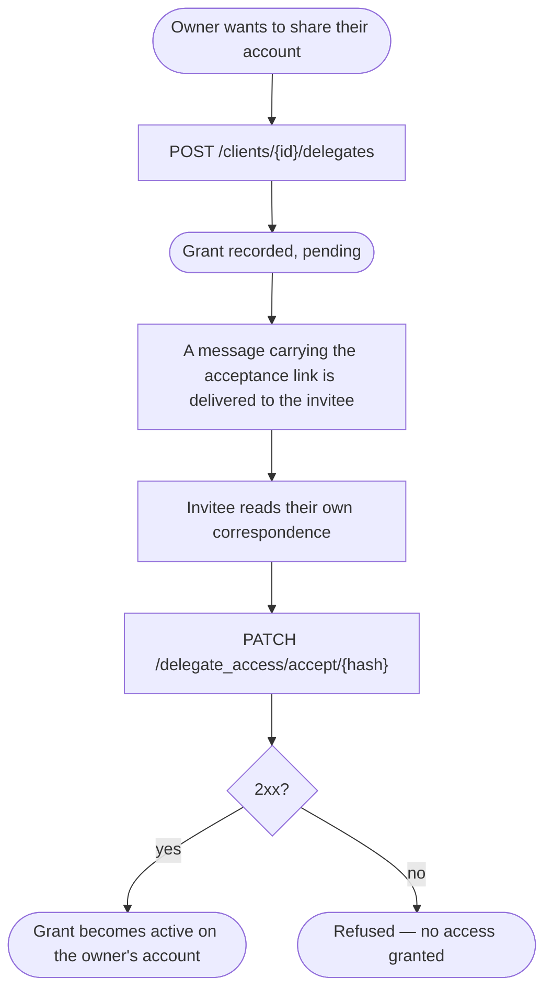

# Module: delegates

## What it is

Delegate access lets one account holder share their account with another
party. The owner invites someone by email; that person accepts the
invitation; once accepted, the invitee holds delegated access to the owner's
account. Today's capability is the granting side of that exchange: an owner
can see who holds access to their account — including invitations not yet
taken up — invite a new party by email, and an invitee can accept an
invitation that was sent to them. Removing a grant, narrowing a grant to a
single record rather than the whole account, and an equivalent acting on
someone else's behalf are not implemented yet.

## Core concepts

- **Grant** — one record naming a party who has been invited to, or holds,
  access to an owner's account.
- **Owner** — the account holder who created the grant.
- **Invitee** — the party invited. They need not already hold an account of
  their own.
- **Acceptance link** — the one-time credential the invitation carries. It is
  the invitee's only proof they were the one invited, and the only way a
  grant moves from pending to active.
- **Pending vs. active** — a grant's two states. Pending means invited but
  not yet accepted; a pending grant is a normal, expected state the owner can
  see and act on, not an absence or an error.

## Operations

| # | Capability | Inputs | Outputs |
| --- | --- | --- | --- |
| 1 | **List the grants on an account** | the account's id | every grant on that account, accepted and pending alike |
| 2 | **Invite a party to hold access** | the account's id, the invitee's email, optionally a whole-account flag (and optionally lists of specific records — see Lessons) | the created grant, pending |
| 3 | **Accept an invitation** | the acceptance credential from the invitation | the grant, now active |

- No method names, no lifecycle capabilities (readiness / refresh /
  invalidate) exist beyond these three requests — there is no cache or
  reactive state layered over them today.
- Reading the grants on an account takes the account's id as an explicit
  input; naming a different account reads that account, not "my own."

## Data shape

The grant record returned by every one of the three operations — the list,
the freshly-created invitation, and the accepted result all share this exact
shape:

```ts
type Grant = {
  id: string;
  owner_client_id: string; // the account this grant lives on
  invite_email: string; // the address invited
  email: string; // the same address, mirrored under this key
  public_name: string | null; // the invitee's display name; observed populated once accepted
  image_url: string | null;
  is_full_delegate: boolean; // true = grants the whole account (the only path observed so far)
  active: boolean; // false = invited, not yet accepted; true = accepted — see Lessons
  num_delegated_cps: number; // count of individually-shared records of one kind
  num_delegated_tickets: number; // count of individually-shared records of another kind
  created_at: string;
  updated_at: string;
};
```

Every response is wrapped in the platform's standard envelope:

```ts
type Envelope<T> = {
  status: "ok" | "error";
  data: T | null;
  related: unknown | null;
  total: number | null;
  error: {
    id: string;
    type: number;
    code: number; // mirrors the HTTP status
    message: string;
    data: unknown;
  } | null;
  messages: string[] | null;
  meta: null;
};
```

The invitation request itself is a plain wire body, not a typed shape this
capability publishes:

```ts
type InviteBody = {
  delegate_email: string; // required
  full_delegate?: boolean; // grant the whole account
  contract_product_ids?: string[]; // accepted on the wire — see Lessons
  ticket_ids?: string[]; // accepted on the wire — see Lessons
};
```

Only the keys actually set are sent — an omitted list is left off the
request entirely, never sent as an empty array.

## Dependencies

### Dependants — modules that read from this one

None today. Nothing outside this capability's own test suite consumes it yet.

### This module's own dependencies

- **A request/transport layer** — attaches the caller's credential to every
  call, builds the URL, and normalises the response. This capability does
  not resolve an account id from anywhere itself; the caller supplies it
  explicitly on every call.
- **The account's own correspondence** — the acceptance link is delivered as
  a message in the invitee's own sent history, a separate reading capability
  this module does not re-expose (see Lessons and Flows).

## API endpoints

### GET /clients/{clientId}/delegates

Role: lists every grant the named account has made, accepted and pending
alike. The id is an explicit path parameter — the account read is always the
one named, never resolved from anywhere else.

```bash
curl "$API/clients/$CLIENT_ID/delegates" \
  -H "Authorization: Bearer $ACCESS_TOKEN" \
  -H "Accept: application/json"
```

Sample response (`200`, one accepted row):

```json
{
  "status": "ok",
  "data": [
    {
      "id": "825d96e7-63ed-0913-7da4-174825283406",
      "owner_client_id": "63250798-065d-1ed5-685c-8174e234e98d",
      "invite_email": "mock-email-2@example.com",
      "is_full_delegate": true,
      "active": true,
      "created_at": "2026-09-14 07:29:12",
      "updated_at": "2026-09-14 07:29:20",
      "public_name": "Delegate M.",
      "email": "mock-email-2@example.com",
      "image_url": "https://www.gravatar.com/avatar/a925eb218fa3f6a55761d04674c380fb?d=blank&s=200",
      "num_delegated_cps": 0,
      "num_delegated_tickets": 0
    }
  ],
  "related": null,
  "total": 1,
  "error": null,
  "messages": [],
  "meta": null
}
```

Fixture: `get-clients-id-delegates-case-accepted.json`

**Pending variant** — an outstanding invitation reads `"active": false` and
`"public_name": null`, with every other field populated the same way.
Fixture: `get-clients-id-delegates-case-pending.json`

**Empty variant** — an account that has granted nobody access returns
`"data": []` and `"total": 0` — a real recorded result, not an inferred one.
Fixture: `get-clients-id-delegates-case-no-delegates.json`

**Refused variants** — a caller with no claim on the named account gets
`403`; a bearer the platform rejects gets `401`; a temporarily unavailable
service gets `503`. All three reject rather than returning an empty list.
Fixtures: `get-clients-id-delegates-case-not-the-owner.json`,
`get-clients-id-delegates-case-rejected-bearer.json`,
`get-clients-id-delegates-case-service-unavailable.json`

### POST /clients/{clientId}/delegates

Role: invite a party by email to hold access to the named account. The
invitee need not already hold an account — the API sends them an invitation
carrying the acceptance link, and the grant does not take effect until they
use it.

```bash
curl -X POST "$API/clients/$CLIENT_ID/delegates" \
  -H "Authorization: Bearer $ACCESS_TOKEN" \
  -H "Content-Type: application/json" \
  -d '{
    "delegate_email": "invitee@example.com",
    "full_delegate": true
  }'
```

Sample response (`200`, pending):

```json
{
  "status": "ok",
  "data": {
    "id": "825d96e7-63ed-0913-7da4-174825283406",
    "owner_client_id": "63250798-065d-1ed5-685c-8174e234e98d",
    "invite_email": "mock-email-2@example.com",
    "is_full_delegate": true,
    "active": false,
    "created_at": "2026-09-14 07:29:12",
    "updated_at": "2026-09-14 07:29:12",
    "public_name": null,
    "email": "mock-email-2@example.com",
    "image_url": "https://www.gravatar.com/avatar/a925eb218fa3f6a55761d04674c380fb?d=blank&s=200",
    "num_delegated_cps": 0,
    "num_delegated_tickets": 0
  },
  "related": null,
  "total": null,
  "error": null,
  "messages": [],
  "meta": null
}
```

Fixture: `post-clients-id-delegates.json`

**Refused variant** — inviting an address that already holds accepted access
is refused (`409`), not recorded as a second grant. Fixture:
`post-clients-id-delegates-case-already-a-delegate.json`

**Unavailable variant** — a temporarily unavailable service returns `503`
rather than reporting the invitation as sent. Fixture:
`post-clients-id-delegates-case-service-unavailable.json`

### PATCH /delegate_access/accept/{hash}

Role: called by the invitee, authenticated as themselves, using the hash
carried in the invitation they received. On success, the owner's pending
grant becomes active.

```bash
curl -X PATCH "$API/delegate_access/accept/$ACCEPT_HASH" \
  -H "Authorization: Bearer $ACCESS_TOKEN" \
  -H "Accept: application/json"
```

Sample response (`200`, now active — the SAME record the owner's list
already carries):

```json
{
  "status": "ok",
  "data": {
    "id": "825d96e7-63ed-0913-7da4-174825283406",
    "owner_client_id": "63250798-065d-1ed5-685c-8174e234e98d",
    "invite_email": "mock-email-2@example.com",
    "is_full_delegate": true,
    "active": true,
    "created_at": "2026-09-14 07:29:12",
    "updated_at": "2026-09-14 07:29:20",
    "public_name": "Delegate M.",
    "email": "mock-email-2@example.com",
    "image_url": "https://www.gravatar.com/avatar/a925eb218fa3f6a55761d04674c380fb?d=blank&s=200",
    "num_delegated_cps": 0,
    "num_delegated_tickets": 0
  },
  "related": null,
  "total": null,
  "error": null,
  "messages": [],
  "meta": null
}
```

Fixture: `patch-delegate-access-accept-{hash}.json` (the filename carries the
real, now-spent hash the recording used)

**Refused variant** — a hash that was never issued is refused (`404`), not
resolved as if access were granted. Fixture:
`patch-delegate-access-accept-notarealinvitehash.json`

**Unavailable variant** — `503` rather than reporting acceptance as
succeeded. Fixture:
`patch-delegate-access-accept-notarealinvitehash-case-service-unavailable.json`

## Side effects

Inviting a party sends them a message containing the acceptance link. This
is the ONLY route to that link at all — it is not returned on the grant
record to either the owner or the invitee (see Lessons) — so an equivalent
implementation must also deliver it this way; there is no alternative
channel to substitute.

## Flows

### Granting and accepting access

One-line purpose: show the full path from invitation to active access,
including the side-channel the acceptance credential travels through.



Guarantees the platform holds: the record returned on acceptance is the SAME
record the owner's list already shows, only with `active` now `true`;
refusing an unissued or already-used credential grants nothing.

Constraints the caller has to plan around: the acceptance link cannot be
read from either the owner's or the invitee's own view of the grant — the
only way to obtain it is to read the invitee's own correspondence and open
the specific message it arrived in, which is a separate reading capability
from this one. There is no capability here to resend or regenerate the
link if it is lost.

## Lessons (hard-won)

- **The acceptance credential is never exposed on the grant record itself.**
  Not to the owner, and not to the invitee reading their own row back. The
  one and only place it exists is inside the body of the message the
  invitation sends. A rebuild has to treat "deliver a message with an
  embedded link" as part of this capability's own contract, not an
  unrelated notification side-channel bolted on afterward.
- **Accepting returns the same shape the owner already sees when
  listing — there is no separate "you now have access" record.** What
  changes is that one flag flips and a couple of counters populate; nothing
  in the response names WHAT was granted (the whole account, or one named
  record). A caller that needs to know that has nowhere to read it from this
  response.
- **The flag that looks like an on/off switch on the wire only records
  whether the invitation has been taken up.** A grant read with that flag
  `false` is a normal, expected state — an invitation still outstanding —
  not a disabled or broken record.
- **None of the three operations substitutes a default outcome when the
  underlying service cannot answer.** A read that fails never resolves as
  "no grants"; an invite or an accept that fails never resolves as if it
  had gone through. Every one of them either returns the shape the caller
  asked for, or rejects.
- **A temporary server failure is not treated the same on every
  operation.** The read is retried automatically a few times before the
  caller is told it failed; inviting and accepting are not retried at all —
  the first failure either of them hits is the one the caller sees.
- **Inviting accepts optional lists of specific records to grant, alongside
  the whole-account flag — but every observed example grants the whole
  account.** Whether supplying either list actually narrows the resulting
  access, rather than the platform granting the whole account regardless,
  has not been exercised against a live response. Treat narrowed grants as
  unproven until an example exists.
- **Reading the grants on an account takes an explicit account id, with no
  notion of "my own grants" built in.** Naming a different account reads
  that account; naming an account the caller has no claim on is refused
  rather than quietly substituted with the caller's own.
