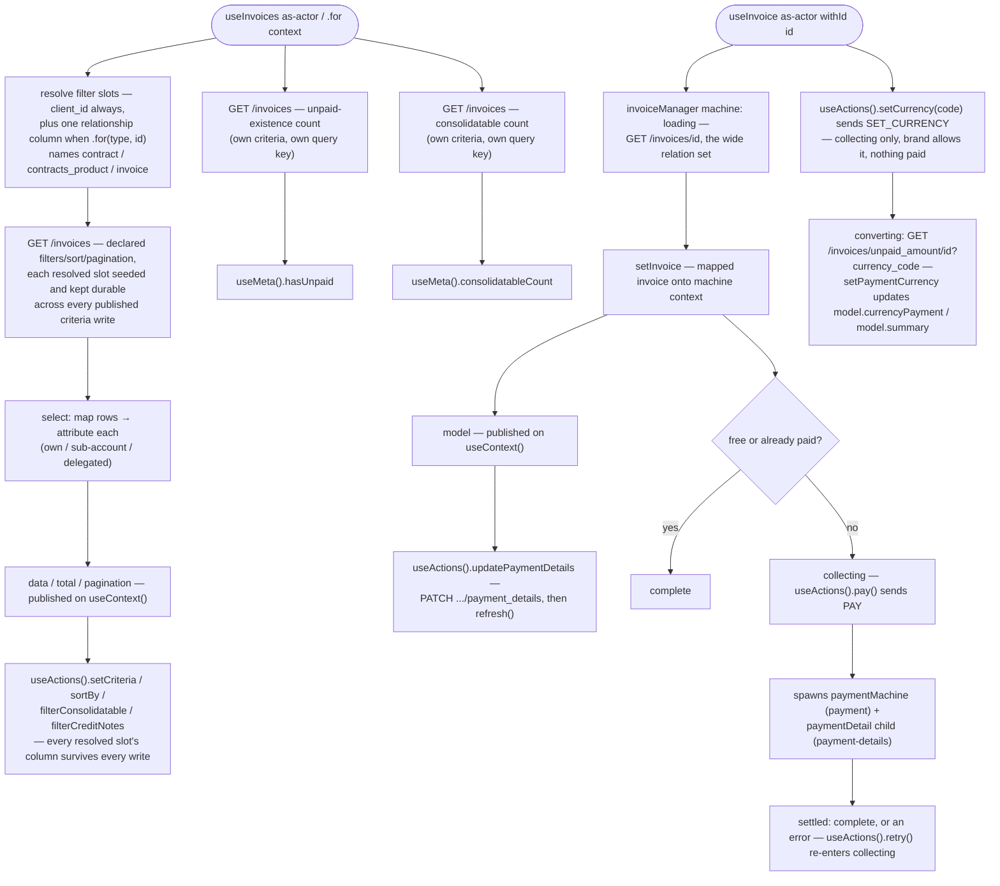

# Invoices Architecture

## Overview

Invoices ships two separately-exported composables: `useInvoices` (the collection) and `useInvoice` (one invoice, read AND paid). They are shaped differently on purpose. `useInvoices` is **query-backed** — no state machine, the query handle is the state. `useInvoice` is **machine-backed** — an XState orchestrator (`invoiceManager`) that loads the invoice, then drives its payment lifecycle: triggering a pay attempt, retrying a decline, rendering an inline gateway challenge, and observing settlement. The machine spawns the platform's `payment` machine as a child to submit and observe each attempt, and spawns a `paymentDetail` child (from `payment-details`) to drive the method picker. This merges what was previously a separate `orders` module's payment orchestration into this module's own single-invoice composable — there is no `orders` module in this codebase.

`ScopeActorTypes.STAFF` resolves to `never` on both scope matrices (deprecated for this resource) — the only live actor is `client`. The collection's matrix carries four context members off the `client` cell: `client` (an entitled other client's own invoices, via `.for('client', id)`), and three relationships — `contract`, `contracts_product`, `invoice` — each narrowing to that relationship's invoices or credit notes. Every context is resolved and kept durable through the same seam (`resolveFilterSlots` / `seedFilterSlots` / `withDurableFilterSlots` in `invoices.utils.ts` and `invoices.services.ts`), so a collection scope and a single-read scope addressing the same target can never disagree, and no published criteria write can silently drop a scoped column. The single read's matrix stays all-`never` — `.for(type, id)` is unspellable on `useInvoice`.

## Pay currency

The invoice machine owns the pay currency. There is no basket in the pay path: `useInvoice` does not read, stage or write a basket currency, and it exposes no separate unpaid-amount query. `setCurrency(code)` sends `SET_CURRENCY`. The event is accepted in `available.collecting` only, and only when the brand allows a different pay currency and nothing is paid. The machine enters `available.converting`, which invokes `convertCurrency`. On success, `setPaymentCurrency` writes the pay currency and the converted unpaid amount onto the raw invoice and re-maps it, so `model.currencyPayment` and `model.summary` carry them. On failure, `setConversionError` stores `conversionError` and the invoice stays as it was. Either way the machine returns to `collecting`, which respawns the payment form. The payment child receives the pay currency (else the invoice currency) and sends it as `currency_code`.

## Data flow

## Sub-units

| File                       | Purpose                                                                                                                                                                                                                                                                     |
| -------------------------- | --------------------------------------------------------------------------------------------------------------------------------------------------------------------------------------------------------------------------------------------------------------------------- |
| `invoices.types.ts`        | Scope matrices (collection + single-read), the `InvoicesContextTypes` context enum and its wire-key map, the query model, `Invoice`/`Payment` view types, service contract types.                                                                                           |
| `invoices.services.ts`     | The collection's services factory — list/count reads, target-client resolution, and `withDurableFilterSlots` (keeps every resolved slot's column present on every published criteria write).                 |
| `invoices.utils.ts`        | `resolveFilterSlots` (which filter columns a scope seeds — `client_id` always, one relationship column when `.for()` names one) and `seedFilterSlots` (writes each slot's column onto the query handle and keeps it tracking its source); the PDF-download browser trigger. |
| `invoices.schemas.ts`      | The collection's query schema (filters/sort/pagination as one declared model) and its criteria presets.                                                                                                                                                                     |
| `invoices.mappers.ts`      | Wire → view-model mapping: the invoice itself, payments, co-mingled attribution, bundle/large-flag derivation.                                                                                                                                                              |
| `useInvoices.ts`           | Collection composable: mints the list query, the unpaid-existence count query, and the consolidatable-count query once per scope.                                                                                                                                           |
| `useInvoices.actions.ts`   | Collection actions — criteria writes, sort, presets, lifecycle. List-only: no payment-method write.                                                                                                                                                                          |
| `useInvoices.context.ts`   | Collection context — the reactive list, its total, pagination, published criteria, schemas.                                                                                                                                                                                 |
| `useInvoices.meta.ts`      | Collection state flags — including the two dedicated count reads.                                                                                                                                                                                                           |
| `useInvoices.internals.ts` | Debugging: the raw query object, the resolved target client, the wire the live criteria builds.                                                                                                                                                                             |
| `invoice.machine.ts`       | The single-invoice XState orchestrator (`invoiceManager`) — loads the invoice, spawns `payment` and `paymentDetail` children, and drives pay/retry/challenge/settle and the pay-currency switch (`available.converting`).                                                                                                        |
| `invoice.services.ts`      | The single-invoice services — the item load, the pay-currency conversion (`GET /invoices/unpaid_amount/{id}?currency_code=`), the PDF download (`useQuery().download()`, a `Blob` body), and the payment-method write (`PATCH /invoices/{id}/payment_details`).                                                                                                               |
| `useInvoice.ts`            | Single-invoice composable: interprets `invoice.machine.ts` once per scope, exposes the four sub-composables.                                                                                                                                                                |
| `useInvoice.actions.ts`    | Single-invoice actions — pay, retry, the challenge controls, PDF download, the payment-method write (`input()` + `updatePaymentDetails()`), the pay-currency switch, readiness, lifecycle.                                                                                  |
| `useInvoice.context.ts`    | Single-invoice context — the mapped invoice (`model`, carrying `currencyPayment` and `summary`) and the captured error.                                                                                                                                                                          |
| `useInvoice.meta.ts`       | Single-invoice state flags — availability, loading, payment-progress and challenge flags. No single discriminated payment-state value.                                                                                                                                     |
| `useInvoice.internals.ts`  | Debugging: the raw machine send/service/state, plus the delegated `gateway` / `paymentDetail` composables the pay UI provides/injects.                                                                                                                   |
| `index.ts`                 | Public barrel: `useInvoices`, `useInvoice`, the collection's scope matrix/context enum, public model types, curated `mapInvoice`/`mapInvoices` re-exports.                                                                                                                  |

No `.{actor}.ts` arm exists on either composable's layers — the `client`/`client` context difference on the collection is resolved inside its shared factory, and the staff actor resolves to `never` on both.

## Dependencies

### Invoices depends on

| Module                                   | Usage                                                                                 |
| ---------------------------------------- | ------------------------------------------------------------------------------------- |
| `query`                                  | list/single-item queries, criteria validation and translation, `invalidateQueryByKey` |
| `scope`                                  | the scoped-composable factory, scope-key generation, registry removal                 |
| `session-store`                          | `useActiveSession` — auth guard and the reading client's own id fall-through          |
| `client` / `client-address` / `currency` | snapshot mappers                                                                      |
| `basket` / `basket-product`              | shared line-item and tax parse                                                        |
| `payment`                                | `paymentMachine`, invoked as a child of the single-invoice machine to submit and observe a payment attempt |
| `payment-details`                        | `spawnInvoicePaymentDetail`, `usePaymentDetail`, `usePaymentGateway` — the spawned payment-method picker and its delegated composables |
| `brand`                                  | `ensureConfig` for the different-currency-payment key; `currencies` for the pay-currency lookup |

### Modules that depend on invoices

| Module             | Usage                                                                                                |
| ------------------ | ------------------------------------------------------------------------------------------------------ |
| Presentation layer | renders list / detail / receipt / dunning off the invoice shape, including co-mingled attribution     |

No module in this codebase's own dependency graph currently reads from invoices — the single prior consumer, a separate `orders` module, is merged into this module rather than reading from it.

## Integration points

| System         | Integration                                                                                                                                                                                                     |
| -------------- | --------------------------------------------------------------------------------------------------------------------------------------------------------------------------------------------------------------- |
| HTTP transport | bearer attach, request validation, filter/sort/pagination translation to the wire, error normalisation                                                                                                          |
| Session        | both composables' fetches gate on an authenticated session with a resolved target client id                                                                                                                     |
| Scope registry | one scoped instance per `(actor, context, id?)` key; the collection and the single read share the module name but never collide, because the single read always carries an id segment the collection never does |
