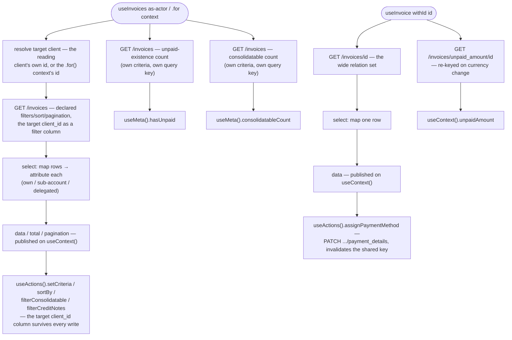

# Invoices Architecture

## Overview

Invoices is a scoped, query-backed module with two separately-exported composables sharing one services factory: `useInvoices` (the collection) and `useInvoice` (one invoice by id). There is no state machine — the query handle is the state. One services file resolves the identity seam for both composables, so a collection scope and a single-read scope addressing the same client can never disagree about who that client is.

`ScopeActorTypes.STAFF` resolves to `never` on both scope matrices (deprecated for this resource) — the only live actor is `client`, in two contexts: `self` (the reading client's own invoices) and `client` (an entitled other client's, via `.for('client', id)`). The `self` / `client` difference is resolved inside the shared services factory, not by a per-actor file — no `.{actor}.ts` arm exists anywhere in this module.

## Data flow

## Sub-units

| File                       | Purpose                                                                                                                                                    |
| -------------------------- | ---------------------------------------------------------------------------------------------------------------------------------------------------------- |
| `invoices.types.ts`        | Scope matrices (collection + single-read), the query model, `Invoice`/`Payment` view types, service contract types.                                        |
| `invoices.services.ts`     | The ONE services factory both composables consume — list/single/unpaid-amount/count reads, the payment-method write, target-client resolution.             |
| `invoices.schemas.ts`      | The collection's query schema (filters/sort/pagination as one declared model) and its criteria presets.                                                    |
| `invoices.mappers.ts`      | Wire → view-model mapping: the invoice itself, payments, co-mingled attribution, bundle/large-flag derivation.                                             |
| `useInvoices.ts`           | Collection composable: mints the list query, the unpaid-existence count query, and the consolidatable-count query once per scope.                          |
| `useInvoices.actions.ts`   | Collection actions — criteria writes, sort, presets, the payment-method write, lifecycle.                                                                  |
| `useInvoices.context.ts`   | Collection context — the reactive list, its total, pagination, published criteria, schemas.                                                                |
| `useInvoices.meta.ts`      | Collection state flags — including the two dedicated count reads.                                                                                          |
| `useInvoices.internals.ts` | Debugging: the raw query object, the resolved target client, the wire the live criteria builds.                                                            |
| `useInvoice.ts`            | Single-read composable: mints the item query and the unpaid-amount query once per scope.                                                                   |
| `useInvoice.actions.ts`    | Single-read actions — lifecycle, the unpaid-amount re-read.                                                                                                |
| `useInvoice.context.ts`    | Single-read context — the mapped invoice and the live unpaid amount.                                                                                       |
| `useInvoice.meta.ts`       | Single-read state flags, including the discriminated payment state.                                                                                        |
| `useInvoice.internals.ts`  | Debugging: the raw query object.                                                                                                                           |
| `index.ts`                 | Public barrel: `useInvoices`, `useInvoice`, the collection's scope matrix/context enum, public model types, curated `mapInvoice`/`mapInvoices` re-exports. |

No `.{actor}.ts` arm exists on any of the five layers (services, actions, context, meta, schemas) — the `client`/`client` context difference is resolved inside the shared factory, and the staff actor resolves to `never`.

## Dependencies

### Invoices depends on

| Module                                   | Usage                                                                                 |
| ---------------------------------------- | ------------------------------------------------------------------------------------- |
| `query`                                  | list/single-item queries, criteria validation and translation, `invalidateQueryByKey` |
| `scope`                                  | the scoped-composable factory, scope-key generation, registry removal                 |
| `session-store`                          | `useActiveSession` — auth guard and the reading client's own id fall-through          |
| `client` / `client-address` / `currency` | snapshot mappers                                                                      |
| `basket` / `basket-product`              | shared line-item and tax parse                                                        |

### Modules that depend on invoices

| Module             | Usage                                                                                                                                                                                     |
| ------------------ | ----------------------------------------------------------------------------------------------------------------------------------------------------------------------------------------- |
| `orders`           | imports the curated `mapInvoice` re-export and the `Invoice` type from the barrel to attach a completed order's resulting invoice; does not read the collection, the counts, or the write |
| Presentation layer | renders list / detail / receipt / dunning off the invoice shape, including co-mingled attribution                                                                                         |

## Integration points

| System         | Integration                                                                                                                                                                                                     |
| -------------- | --------------------------------------------------------------------------------------------------------------------------------------------------------------------------------------------------------------- |
| HTTP transport | bearer attach, request validation, filter/sort/pagination translation to the wire, error normalisation                                                                                                          |
| Session        | both composables' fetches gate on an authenticated session with a resolved target client id                                                                                                                     |
| Scope registry | one scoped instance per `(actor, context, id?)` key; the collection and the single read share the module name but never collide, because the single read always carries an id segment the collection never does |
