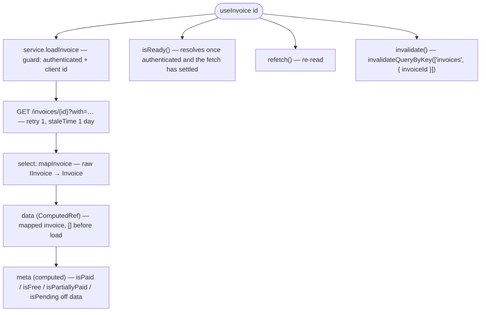

# Invoices Architecture

## Overview

Invoices is a flat, read-only data module. `useInvoice(id)` runs one cached query
(`GET /invoices/{id}`), maps the raw record to the customer-facing shape via a
`select` transform, and exposes a derived settlement view. There is no state machine
and no actor scoping — a single authenticated-client read path.

## Data flow

## Sub-units

| File                  | Purpose                                                                                     |
| --------------------- | ------------------------------------------------------------------------------------------- |
| `useInvoice.ts`       | The composable: query wiring, `meta` derivation, `isReady`, `invalidate`.                   |
| `invoices.service.ts` | `loadInvoice` — the guarded `GET /invoices/{id}` query with `select: mapInvoice`.           |
| `invoices.mappers.ts` | `mapInvoice` (raw → customer shape) and `mapPayments` (ordering + pending/card derivation). |
| `invoices.types.ts`   | `Invoice`, `Payment`, `PAYMENT_STATE`.                                                      |
| `index.ts`            | Public barrel: `useInvoice`, `mapInvoice`, types.                                           |

There is no `.actions` / `.context` / `.meta` / `.services.{actor}` split — the module is flat.

## Dependencies

### Invoices depends on

| Module                                   | Usage                                                |
| ---------------------------------------- | ---------------------------------------------------- |
| `query`                                  | cached query wrapper, `invalidateQueryByKey`         |
| `session-store`                          | `useActiveSession` — auth guard and active client id |
| `client` / `client-address` / `currency` | snapshot mappers                                     |
| `basket` / `basket-product`              | shared line-item and tax parse                       |

### Modules that depend on invoices

| Module             | Usage                                                                           |
| ------------------ | ------------------------------------------------------------------------------- |
| `orders`           | loads the invoice, then orchestrates payment capture + submission and refreshes |
| Presentation layer | renders list / detail / receipt / dunning off the invoice shape                 |

## Integration points

| System         | Integration                                                         |
| -------------- | ------------------------------------------------------------------- |
| HTTP transport | bearer attach, query cache keyed by invoice id, error normalisation |
| Session        | fetch gated on an authenticated session with a resolved client id   |
