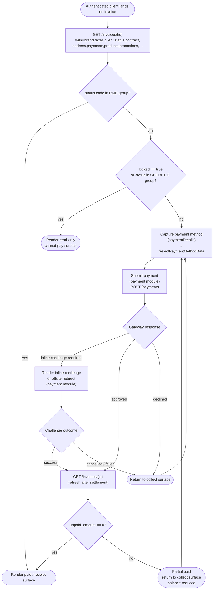
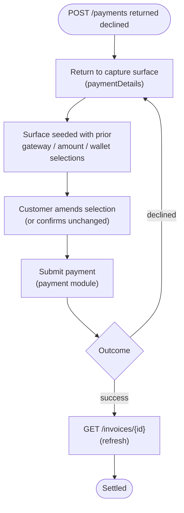
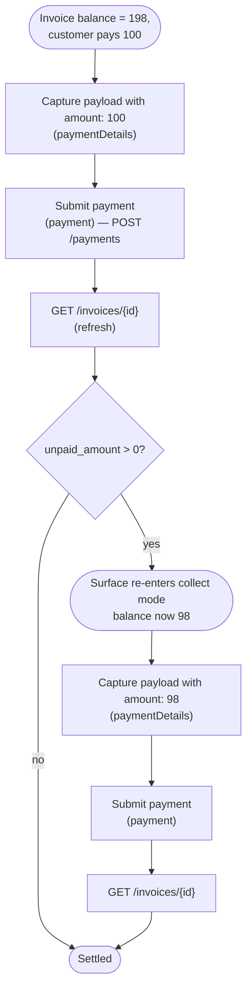

# Module: invoices

## What it is

Invoices owns the customer-facing read view of a single invoice and the multi-step interaction of paying it down. An invoice is the platform's billing document — produced once a basket converts, frozen at the moment of conversion, with a brand-prefixed number, an immutable snapshot of the client and billing address, a frozen list of line items, a list of recorded payments, and a financial summary that nets paid against unpaid to surface the current balance. The customer panel reads this module to render the invoice list, the invoice detail page, the receipt for a completed payment, and the dunning surfaces that ask the customer to settle an outstanding balance. The same record drives the payment surface itself — paying an invoice is a multi-step interaction across this module (load + observe), `paymentDetails` (capture the payment intent), and `payment` (submit it asynchronously).

A single invoice may take several payment attempts to settle. The same surface handles a freshly-converted invoice, a renewal invoice the platform issued automatically, a retry after a declined attempt, and a partial payment against an open balance. The invoice id is stable across every attempt — it is the join key for the entire payment lifecycle.

**Scope boundaries with sibling modules:**

- Conversion (basket → invoice) lives in [`basket`](../../basket/docs/foundation.md) — invoices picks up the resulting record by id.
- Payment intent capture (gateway eligibility, method picker, SDK handshake, payload assembly) lives in [`paymentDetails`](../../paymentDetails/docs/foundation.md).
- Submission to `POST /payments`, response parsing, inline-challenge rendering, and offsite-redirect handling live in [`payment`](../../payment/docs/foundation.md).
- The contract record embedded on every renewal-bearing invoice (`invoice.contract`) is read here as a cross-reference; mutations to the contract (cancellation request, suspension) are separate writes that do not flow through this module.

Invoices coordinates: it loads the invoice, surfaces the payment-collection state, hands off to `paymentDetails` + `payment` for the actual transaction, then refreshes after each attempt. It does not call `POST /payments` itself.

## Core concepts

- **Invoice** — the immutable billing document. Backed by `GET /invoices/{id}`. Carries an invoice number, a status, a frozen client / address / company / phone snapshot, a frozen product list, recorded payments, taxes, promotions, and a financial summary.
- **Invoice number** — a brand-prefixed human-readable identifier (e.g. `CS-INV-02642`). Assigned by the back end at conversion. Distinct from the `id` UUID; the number is what surfaces in customer-visible documents and emails.
- **Status** — a platform-defined lifecycle value returned on every invoice (`invoice_unpaid`, `invoice_paid`, `invoice_overdue`, `invoice_cancelled`, `invoice_refunded`, `invoice_adjusted`, `invoice_replaced`, `invoice_draft`, `invoice_cancellation_request`). Driven by back-end transitions; the customer-facing surfaces observe it.
- **Payment** — a recorded settlement against the invoice. Each payment carries an amount, a captured flag, a pending flag, an optional card brand / last-four snapshot, and a transaction id. The list is append-only from the read perspective.
- **Payment attempt** — one `POST /payments` call against the invoice. The platform allows many attempts against the same invoice — a declined attempt does not close the invoice; it bumps `payment_failed_attempts` and leaves the status unchanged.
- **Partial payment** — a payment with `amount < unpaid_amount`. The platform accepts it, applies it, and leaves the invoice in an unpaid lifecycle with a smaller `unpaid_amount`. Subsequent attempts target the remaining balance.
- **Wallet draw** — a portion of the payment funded from the client's account wallet credit. Reduces the gateway-facing charge; the wallet portion and the gateway portion are recorded as separate payment rows on the invoice.
- **Balance / paid / unpaid** — three server-computed money fields. `paid_amount` is what's captured; `unpaid_amount` is what remains; `balance` is the same as `unpaid_amount` for an in-flight invoice but reflects credit-note offsets after consolidation. All three carry `_formatted` (locale + currency-symbol) and `_converted` (display-currency) twins.
- **Invoice category** — every invoice carries a `category.slug`: `new_contract`, `renewal`, `upgrade`, `downgrade`, `addon`, `cancellation_request`. The slug is informational (it routes copy and analytics); the payment mechanics are identical across categories.
- **Consolidation** — an admin-side workflow that merges multiple unpaid invoices into a single consolidation invoice. The customer-facing surface reads `consolidation_status`, `consolidation_invoice_id`, `is_consolidation`, and `credit_invoice_id`. Triggering consolidation is not exposed here.
- **Credit / refund context** — an invoice carries `partial_amount_credited`, `partial_amount_to_credit`, `to_be_credited`, `refund_status`, `refund_request`, and `refund_changed`. These reflect the credit / refund flow's progress against the document; initiating credit or refund happens through other surfaces.
- **Contract linkage** — an invoice that converted a recurring product carries `contract_id` and an embedded `contract` record (when expanded). The contract carries subscription state (next*due_date, activation_date, cancellation_date, cancel_anytime, total_recurrent_amount). Cancellation, suspension, and the "cancel anytime" flag are all fields on the contract — \_not* on the invoice; the act of cancelling itself is a separate write against the contract.

## State model

The invoice's `status` is a platform-defined enum driven by back-end transitions. The customer-facing surfaces observe these values to switch between dunning, receipt, payment-collection, and credit-note presentations.

| Status code                    | Meaning                                                              | What triggers entry                                                                        |
| ------------------------------ | -------------------------------------------------------------------- | ------------------------------------------------------------------------------------------ |
| `invoice_draft`                | Pre-conversion — the document exists but has not yet been finalised. | `PATCH /orders/{id}/convert` enters this transiently before settling to `invoice_unpaid`.  |
| `invoice_unpaid`               | Finalised, awaiting payment.                                         | Conversion completes with non-zero `unpaid_amount`.                                        |
| `invoice_overdue`              | Past `due_date` without full payment.                                | Back-end dunning timer fires at `pre_due_notification_date` / `overdue_notification_date`. |
| `invoice_paid`                 | Fully settled.                                                       | A payment lands with `captured > 0` such that `paid_amount === total_amount`.              |
| `invoice_adjusted`             | Manually adjusted by staff (write-down / write-off).                 | Admin action — surface is read-only from the customer side.                                |
| `invoice_cancelled`            | Cancelled before payment.                                            | Admin or auto-cancel timer at `auto_cancel_date`.                                          |
| `invoice_refunded`             | Payment(s) refunded in full.                                         | Refund processing through `payment`.                                                       |
| `invoice_replaced`             | Imported-only — superseded by a new invoice.                         | Data migration; not produced by the live storefront.                                       |
| `invoice_cancellation_request` | Customer has requested cancellation; staff approval pending.         | Submitted via the cancellation flow against the contract.                                  |

Reference: `InvoiceStatus` and `InvoiceStatusGroups` in `packages/types/src/data/enums/invoice.ts`. Three groups collapse the nine codes for list-view filters and surface routing:

- **PAID** — `[invoice_paid]`. Terminal for the payment flow; the surface renders the receipt / paid state.
- **UNPAID** — `[invoice_unpaid, invoice_overdue, invoice_adjusted]`. The collect-payment surface fires here (subject to `locked` not being set).
- **CREDITED** — `[invoice_refunded, invoice_cancelled]`. Read-only "this invoice was credited" state.

The platform performs the transitions; the caller never PATCHes a status. Payment success moves `invoice_unpaid → invoice_paid`; expiry of `auto_cancel_date` moves `invoice_unpaid → invoice_cancelled`; refund moves `invoice_paid → invoice_refunded`.

## Operations

| #   | Capability                                      | Inputs                       | Outputs                                                                                                                                                                                                                                                                                                                                                                                                    |
| --- | ----------------------------------------------- | ---------------------------- | ---------------------------------------------------------------------------------------------------------------------------------------------------------------------------------------------------------------------------------------------------------------------------------------------------------------------------------------------------------------------------------------------------------- |
| 1   | **Read an invoice**                             | `invoiceId`                  | The invoice document with its embedded client snapshot, frozen billing address, currency, line items (products + sub-products), payments, taxes, promotions, contract, status, and full financial summary. Requires an authenticated client whose token is permitted to read the requested id; guest tokens are rejected. `GET /invoices/{id}`.                                                            |
| 2   | **Determine the payment surface**               | loaded invoice               | One of: _paid_ (status group `PAID`), _collectable_ (status group `UNPAID` AND `balance > 0` AND `locked !== true`), _pending_ (an in-flight payment with `pending: true` exists in `payments[]`), _credited_ (status group `CREDITED`), _locked_ (`locked === true`), _unavailable_ (load error, or invoice not addressable by the calling token). Derived from the loaded invoice — no separate BE call. |
| 3   | **Derive payment state**                        | invoice record               | A computed view of settlement: whether the invoice is fully paid, partially paid, pending (no captured payments yet but an attempt exists), free (no payments and unpaid is zero), or in flight. Computed off `paid_amount`, `unpaid_amount`, and the `payments` array.                                                                                                                                    |
| 4   | **Refresh after a payment lands**               | `invoiceId`                  | Re-read the invoice. Used after a payment settles, after a 3DS return lands, and after a partial payment so `payments[]`, `paid_amount`, `unpaid_amount`, and `status` re-settle to authoritative values.                                                                                                                                                                                                  |
| 5   | **Read the post-redirect outcome from the URL** | the storefront's current URL | The `payment_success` query parameter (`true` / `false`) set by the gateway-return deep link, mapped to a surface signal that decides whether the next render shows "Settled" or "Declined" before the refresh confirms.                                                                                                                                                                                   |

Additional always-on behaviours (not endpoints):

- **Readiness signal** — resolves once the authenticated session has settled and the invoice fetch has completed (success or error). Surfaces as a single boolean for caller staging.
- **Refresh** — re-fetch the invoice. Used after a payment lands, after a refund records, or after the caller knows the document changed server-side.
- **Invalidate** — drop the cached invoice fetch.

> **Submission, retry, inline-challenge handling, and the payment payload are not invoices' capabilities.** `POST /payments` is owned by `payment`; the `SelectPaymentMethodData` payload that drives the submit call is owned by `paymentDetails`. Invoices loads + observes + refreshes; the actual charge attempt flows through the sibling modules. See the Flows section below for the end-to-end shape.

## Data shape

### Invoice — `IInvoice`

```ts
// Returned by GET /invoices/{id}. The same record id is what the basket had
// pre-conversion — `PATCH /orders/{id}/convert` is the transition from basket
// shape to invoice shape against a stable id.
type Invoice = {
  id: string;
  number: string; // brand-prefixed e.g. "CS-INV-02642"
  status: InvoiceStatus; // enum — see State model
  status_id: string;
  display_status: string; // server-computed label ("Paid", "Unpaid")
  locked: boolean | null; // true → payments rejected server-side (consolidation in progress, fraud hold, etc.)

  brand_id: string;
  account_id: string; // billing account
  client_id: string;
  user_id: string; // "sys" for self-service invoices
  reseller_account_id: string | null;
  contract_id: string | null; // populated for any invoice that billed a recurring product

  category: InvoiceCategory; // category slug + name
  category_id: string;

  // Frozen snapshots — captured at conversion time, do not follow live edits
  // to the customer's client / address records.
  client: Client; // embedded client at time of conversion
  address: Address | null;
  address_id: string | null;
  company: Company | null; // null when no company was selected
  company_id: string | null;
  phone: Phone | null;
  phone_id: string | null;

  // Line items — frozen at conversion
  products: InvoiceProduct[];
  promotions: BasketPromotion[]; // any promotions applied at conversion
  custom_fields: CustomFieldValue[];
  taxes: AppliedTax[]; // one entry per tax tag, per-line breakdown inside
  warning_notes: WarningNote[];

  // Currency
  currency: Currency;
  currency_id: string;
  currency_exchange_rate: number;
  today_exchange_rate: string;
  payment_currency: Currency | null; // distinct from invoice currency when the gateway settles in another
  payment_currency_id: string | null;
  payment_currency_exchange_rate: number | null;

  // Financial summary — server-computed, dual-currency
  net_amount: number;
  net_amount_formatted: string;
  net_amount_converted: number;
  net_selling_price: number;
  net_selling_price_formatted: string;

  net_discount_amount: number;
  net_discount_amount_formatted: string;
  net_global_discount_amount: number;
  net_global_discount_amount_formatted: string;
  net_product_discount_amount: number;
  net_product_discount_amount_formatted: string;
  total_discount_amount: number;
  total_discount_amount_formatted: string;

  tax_amount: number;
  tax_amount_formatted: string;
  tax_amount_converted: number;
  grouped_taxes: AppliedTax[] | null;

  total_amount: number; // grand total in invoice currency
  total_amount_formatted: string;
  total_amount_converted: number; // in customer's display currency

  paid_amount: number; // settled so far across all captured payments
  paid_amount_formatted: string;
  paid_amount_converted: number;
  unpaid_amount: number; // total_amount - paid_amount (excluding pending attempts)
  unpaid_amount_formatted: string;
  unpaid_amount_converted: number;
  balance: number; // alias of unpaid_amount in the simple case; differs on consolidations
  balance_formatted: string;

  // Payments captured against this invoice (append-only from the read side;
  // includes failed, pending, and refunded rows alongside the captured ones)
  payments: Payment[];

  // Dates — all server-formatted strings
  due_date: string | null;
  paid_datetime: string | null;
  create_datetime: string | null;
  created_at: string;
  updated_at: string;
  deleted_at: string | null;
  pre_due_notification_date: string | null;
  overdue_notification_date: string | null;
  overdue_left_attempts: number | null;
  next_charge_date: string | null; // next renewal invoice date (lives on the contract, mirrored here)
  abandoned: boolean;
  abandon_date: string | null;
  auto_cancel_date: string | null; // when the BE will auto-cancel an unpaid invoice
  auto_cancel_pro_rata_date: string | null;
  cancellation_datetime: string | null;
  cancellation_reason: string | null;

  // Consolidation / credit / refund — pointers and flags driven by admin flows
  consolidation_status: number;
  consolidation_invoice_id: string | null; // merged-into-this-id when consolidated
  is_consolidation: boolean; // true on the merged document itself
  credit_invoice_id: string | null; // credit-note partner
  credited: number;
  partial_amount_credited: number;
  partial_amount_credited_formatted: string;
  partial_amount_credited_converted: number;
  partial_amount_to_credit: number; // queued for credit on next consolidation
  partial_amount_to_credit_formatted: string;
  partial_amount_to_credit_converted: number;
  to_be_credited: boolean;
  refund_status: number;
  refund_request: string | null;
  refund_changed: string | null;
  allow_product_credit: boolean;

  // Fraud assessment (read-only; admin surfaces drive the workflow)
  fraud_score: number | null;
  fraud_status: number;
  fraud_policy: number;
  payment_failed_attempts: number; // increments per declined POST /payments

  // Pricing context
  pricelist_id: string;

  // Pro-forma variant
  proforma: boolean;
  proforma_number: string | null;
  proforma_create_datetime: string | null;

  // Document-history pointer — the current frozen `content` blob the BE has
  // rendered for the document. Used by PDF / email rendering, not consumed
  // by the customer panel.
  current_data: InvoiceContent;
  data: InvoiceContent[]; // historical content snapshots

  // Import / migration context (admin-adjacent)
  import_id: string | null;
  staged_import: boolean;
  external_id: string | null;
  external_contract_id: string | null;
  duplicate_from_invoice_id: string | null;
  duplicated_with_invoice_id: string | null;
  legacy: number;
  delegate_related: boolean;

  // Conversion-time runtime context
  ip: string;
  notes: string;
  temp_token_id: string | null;
  gateway_id: string | null; // populated once a gateway processed a payment
  payment_details_id: string | null; // populated when a saved method was used

  // Related records (expanded via the `with` query param)
  brand?: Brand;
  contract?: Contract; // subscription record — see Contract below
  affiliate_commissions?: AffiliateCommission[];
  account?: Account & {
    affiliate_referral?: { affiliate_account: { account: { client: Client } } };
  };
};

type InvoiceCategory = {
  id: string;
  name: string; // human label, e.g. "New Contract"
  slug:
    | "new_contract"
    | "additional_service"
    | "one_time_service"
    | "migration_pro_rata"
    | "recurrent"
    | "credit_note"
    | "credit_note_for_refund"
    | "consolidation"
    | "renewal"
    | "upgrade"
    | "downgrade"
    | "addon"
    | "cancellation_request"
    | string;
};
```

### Invoice product line — `IInvoiceProduct`

```ts
// Extends IBasketProduct with credit-tracking fields. The per-line product
// shape is the same as a basket line item (catalogue link, configuration,
// pricing, taxes, embedded product snapshot); see basket/docs/foundation.md
// for the full field-by-field breakdown.
type InvoiceProduct = BasketProduct & {
  client_label: string | null; // optional label set per-line for the customer

  // Credit / refund accounting — per-line
  partial_amount_credited: number;
  partial_amount_credited_formatted: string;
  partial_amount_credited_converted: number;
  partial_amount_to_credit_formatted: string;
  partial_amount_to_credit_converted: number;

  // Sub-products on this line — same recursive shape
  attributes: InvoiceProduct[];
  options: InvoiceProduct[];

  // Contract link — present once the conversion has provisioned the recurring product
  contracts_product_id: string | null;
  contract_id: string | null;
  invoice_create_datetime: string;
  invoice_total_amount: number;
  invoice_total_amount_converted: number;
  invoice_total_amount_formatted: string;
  invoice_status: {
    id: string;
    object_type: "invoice";
    code: InvoiceStatus;
    order: number;
    name: string;
  };
  invoice_number: string;
  can_cancel: boolean | null; // server-side eligibility for the cancel flow

  // Payment-aware mirrors — populated once payments exist
  payment_currency_id: string | null;
  payment_currency_exchange_rate: number | null;
  payment_total_amount_converted: number;
  payment_total_amount_formatted: string | null;
  payment_partial_amount_credited_converted: number;
  payment_partial_amount_credited_formatted: string | null;
  payment_partial_amount_to_credit_converted: number;
  payment_partial_amount_to_credit_formatted: string | null;
};
```

### Payment — `IPayment`

```ts
type Payment = {
  id: string;
  invoice_id: string;
  payment_details_id: string | null; // saved-card pointer when used; null for wallet / one-off
  payment_type_id: string; // payment-type enum row
  voucher_id: string | null;
  currency_id: string;
  currency: Currency;
  amount: number;
  amount_formatted: string;
  amount_captured: string; // string-encoded decimal
  amount_converted: number;
  amount_refunded: number;
  amount_refunded_formatted: string;
  amount_refunded_converted: number;
  amount_for_refund_formatted: string; // remaining refundable balance
  amount_for_refund_converted: number;
  transaction_id: string; // gateway's transaction reference
  pending: boolean; // true while awaiting capture
  captured: number; // 0 = not captured, 1 = captured
  first_date_time_captured: string | null;
  refunded: number;
  parent_id: string | null; // parent payment for partial refunds
  currency_exchange_rate: string;
  shared_resource_token: string | null; // for wallet-funded portions
  document_currency_id: string;
  document_currency_exchange_rate: number;
  document_currency: Currency;
  document_amount_converted: number;
  document_amount_converted_formatted: string;
  payment_method_type: string | null; // e.g. "card", "wallet"
  payment_details: PaymentDetails | null; // embedded saved-card details when expanded
  payment_log_id: string;
  created_at: string;
  updated_at: string;
};
```

### Contract — `IContract`

The subscription record embedded on every recurring-product invoice. Read-only from this module — the act of cancelling a subscription is a separate write against the contract, not against the invoice.

```ts
type Contract = {
  id: string;
  name: string | null;
  notes: string | null;
  start_date: string;
  end_date: string; // "0000-00-00" for open-ended contracts
  next_due_date: string; // when the next renewal invoice will be issued
  next_invoice_date: string;
  cancellation_date: string | null; // when the customer cancelled (null = active)
  cancellation_reason: string | null;
  activation_date: string;
  status_id: string; // contract status (active, suspended, cancelled, …)
  total_recurrent_amount: number; // recurring charge per billing cycle
  total_recurrent_amount_formatted: string;
  total_amount: number; // total billed to date
  total_amount_formatted: string;
  account_id: string;
  brand_id: string;
  company_id: string | null;
  phone_id: string | null;
  address_id: string | null;
  billing_cycle_months: number;
  billing_cycle_days: number;
  currency_id: string;
  currency: Currency;
  currency_exchange_rate: string;
  main_invoice_id: string; // first invoice on this contract
  main_invoice_number: string;
  gateway_id: string | null;
  payment_details_id: string | null;
  promotion_id: string | null;
  promotion_code: string | null;
  pricelist_id: string;
  fraud_status: number;
  locked: boolean | null;
  reconciliation_strict: number;
  tax_type: number;
  moved_from_contract_id: string | null; // populated on contract migrations (upgrade/downgrade)
  moved_to_contract_id: string | null;
  moved: boolean;
  partially_moved: boolean;
  cancel_anytime: boolean; // false → cancellation goes via a request workflow
  created_at: string;
  updated_at: string;
};
```

### Applied tax — `IAppliedTax`

Same shape as basket's applied tax: one entry per tax tag with a per-line breakdown under `tax_tag_data`. See [`basket/docs/foundation.md`](../../basket/docs/foundation.md) for the field list.

### Invoice content snapshot — `IInvoiceContent`

```ts
// A frozen rendering blob captured by the BE each time the invoice's
// presentation-relevant data changes. The PDF / email rendering pipeline
// consumes this; the customer panel reads the live top-level fields instead.
type InvoiceContent = {
  id: string;
  invoice_id: string;
  created_at: string;
  updated_at: string;
  partial_amount_credited: number;
  partial_amount_credited_converted: number;
  partial_amount_credited_formatted: string;
  partial_amount_to_credit_converted: number;
  partial_amount_to_credit_formatted: string;
  content: {
    id: string;
    number: string;
    image: string; // brand logo URL captured at snapshot time
    brand: Brand; // frozen brand record
    client: Client; // frozen client record
    client_email: string;
    client_address: Address;
    client_company: Company | null;
    client_phone: Phone;
    client_fields: CustomFieldValue[];
    custom_fields: CustomFieldValue[];
    products: InvoiceProduct[];
    promotions: Promotion[];
    invoice_meta: unknown | null;
  };
};
```

## Dependencies

### Dependants — modules that read from this one

| Module             | Weight | Reads                                                                                                                                                                                                                   | Why                                                                                                                                                                                                                                                                                                                                       |
| ------------------ | ------ | ----------------------------------------------------------------------------------------------------------------------------------------------------------------------------------------------------------------------- | ----------------------------------------------------------------------------------------------------------------------------------------------------------------------------------------------------------------------------------------------------------------------------------------------------------------------------------------- |
| Presentation layer | —      | invoice id, invoice number, status, line items, payments list, paid / unpaid / balance, due date, paid date, billing address snapshot, currency, contract linkage, payment-surface signal, retry / cancel / pay actions | The customer panel's invoice list view, invoice detail page, receipt confirmation, dunning banners, post-payment confirmation, payment-collection surface, partial-pay / retry surface, and "your subscription is active" surfaces all consume the invoice shape directly. This is the terminal read for the customer-panel surface area. |

> No other headless module reads from invoices. Cross-module edges that appear in graph extractions trace to the `IOrder` (alias of `IInvoice`) type re-export in `packages/types` and to co-references through the shared `IBasketProduct` interface — not to runtime reads.
>
> `query` (HTTP transport) and `routing` (URL parameter access for `payment_success`) are foundational dependencies of every customer-facing module and are excluded from the table per the standard exclusion rule.

### This module's own dependencies

- **HTTP transport layer** — bearer-token attachment (a client can only see their own invoices; the bearer is the authorisation), query-key caching keyed by invoice id, error normalisation. The transport layer has no awareness of which invoice id is being read; this module supplies it per call.
- **Session readiness** — invoice fetches gate on the session being authenticated and a `client.id` being present. Invoices are not addressable by guest tokens. Logout invalidates the cached invoice; a session change re-enters the load.
- **`paymentDetails` module** — owns the payment-method picker (gateway eligibility, SDK handshake, payload assembly). The invoice surface starts a fresh `paymentDetails` picker each time it enters the collect-payment surface (so retry / partial loops start with fresh validation state) and consumes the picker's resolved `SelectPaymentMethodData` payload to drive the next payment submission.
- **`payment` module** — owns `POST /payments`, the gateway response decision tree, and inline-challenge rendering. The invoice surface hands the captured payload + the invoice id to payment, observes the outcome, then refreshes the invoice.
- **`basket` utilities** — the per-tax-tag summary parsing shared with basket (one `taxes[]` entry per tag, per-line breakdown inside) and the per-line parse routine that turns the BE's wide product row into the customer-facing line-item shape.
- **`client` / `currency` mappers** — the frozen embedded client, address, and currency snapshots are mapped through the same routines used elsewhere so the customer panel renders them consistently with the live records.
- **`routing` query params** — `payment_success=true|false` is read from the URL on entry (so a redirect back from offsite 3DS lands in the correct state) and written on outcome (so a reload preserves the success / failure surface).
- **Shared types / enums** — `IInvoice`, `IInvoiceProduct`, `IInvoiceContent` from `packages/types/src/models/invoices.ts`; `IOrder` (alias of `IInvoice`) from `packages/types/src/models/orders.ts`; `IContract` from `packages/types/src/models/contracts.ts`; `IPayment` from `packages/types/src/models/payment.ts`; `IBasket`, `IBasketProduct` from `packages/types/src/models/baskets.ts`; `IClient`, `IAddress`, `ICompany` from `packages/types/src/models/`; `ICurrency` from `packages/types/src/data/constants.ts`; `InvoiceStatus`, `InvoiceStatusGroups` from `packages/types/src/data/enums/invoice.ts`.

## API endpoints

### `GET /invoices/{id}`

Read one invoice by id. Returns the full invoice document with relations expanded inline. The `with` query parameter selects which relations are eagerly joined; the customer-facing payment surface expands brand, client (+ tags), status, contract, address (+ country), payments (+ payment_details), products (+ tags, + product.image), promotions, taxes (+ tax_tag_data), custom_fields (+ field), affiliate_commissions, and the affiliate-referral chain. The wide expansion is by design — the same load serves the receipt, the payment surface, the post-pay confirmation, and the dunning state without re-fetching.

```bash
curl -s "$API/invoices/{invoiceId}?with=brand,taxes,client,status,contract,address,address.country,payments,payments.payment_details,products,promotions,client.tags,products.tags,taxes.tax_tag_data,custom_fields.field,affiliate_commissions,products.product.image,account.affiliate_referral.affiliate_account.account.client&lang=en-US" \
  -H "Authorization: Bearer $ACCESS_TOKEN"
```

```json
{
  "status": "ok",
  "data": {
    "id": "63250798-065d-1e20-388f-8174e234e98d",
    "number": "CS-INV-02642",
    "status_id": "73de7864-2de5-3971-4ef2-1208469530d0",
    "display_status": "Paid",
    "brand_id": "47d73824-8507-9315-e54f-81e642d59e06",
    "account_id": "320e4357-95e7-8d18-699a-31643202d986",
    "client_id": "8d632507-9806-5d1e-48dc-8174e234e98d",
    "currency_id": "e47d7382-4850-7931-56c8-1e642d59e063",
    "contract_id": "89857426-4897-0123-d94f-21e325d0ed36",
    "category_id": "3825d96e-763e-d091-3dc4-174825283406",
    "due_date": "2026-05-15",
    "paid_datetime": "2026-05-15 19:40:00",
    "auto_cancel_date": "2026-05-22 00:00:00",
    "total_amount": 198,
    "total_amount_formatted": "$198.00",
    "paid_amount": 198,
    "paid_amount_formatted": "$198.00",
    "unpaid_amount": 0,
    "balance": 0,
    "balance_formatted": "$0.00",
    "payment_failed_attempts": 0,
    "locked": null,
    "currency": {
      "id": "e47d7382-...",
      "code": "USD",
      "name": "US Dollar",
      "prefix": "$",
      "suffix": "",
      "base": true,
      "decimals": true
    },
    "category": {
      "id": "3825d96e-...",
      "name": "New Contract",
      "slug": "new_contract"
    },
    "status": { "code": "invoice_paid", "name": "Paid", "order": 3 },
    "contract": {
      "id": "89857426-...",
      "start_date": "2026-05-15",
      "end_date": "0000-00-00",
      "next_invoice_date": "2026-05-15",
      "activation_date": "2026-05-15",
      "cancellation_date": null,
      "total_recurrent_amount": 0,
      "total_amount": 198,
      "main_invoice_id": "63250798-...",
      "main_invoice_number": "CS-INV-02642",
      "moved": false
    },
    "payments": [
      {
        "id": "25d96e76-...",
        "invoice_id": "63250798-...",
        "amount": 198,
        "amount_formatted": "$198.00",
        "transaction_id": "WAL_he65cikw4pCJe5A55yjtx18Bf",
        "pending": false,
        "captured": 1,
        "first_date_time_captured": "2026-05-15 19:40:00",
        "refunded": 0,
        "payment_details": null,
        "created_at": "2026-05-15 19:40:00"
      }
    ],
    "products": [
      {
        "id": "98574264-...",
        "product_id": "47d73824-...",
        "name": "Logo Design",
        "quantity": 2,
        "selling_price": 99,
        "total_amount": 198,
        "contract_id": "89857426-...",
        "invoice_status": { "code": "invoice_paid", "name": "Paid" }
      }
    ],
    "promotions": [],
    "taxes": [
      {
        "id": "52098d3d-...",
        "tax_tag_id": "20403869-...",
        "amount": 0,
        "tax_tag_data": [
          {
            "tax_tag_name": "VAT 0%",
            "tax_tag_amount": 0,
            "reason": ["location_country", "location_region"],
            "amount": 0
          }
        ]
      }
    ]
  }
}
```

> Sample trimmed for readability — the full captured payload at [`tests/fixtures/recordings/get-invoices-63250798-065d-1e20-388f-8174e234e98d.json`](../../../../../../tests/fixtures/recordings/get-invoices-63250798-065d-1e20-388f-8174e234e98d.json) carries the full `current_data` snapshot, full brand and account expansions (with affiliate referral chain), and the full embedded catalogue product on each line.

**Delegated endpoints (referenced by this module's flows):**

- `POST /payments` — submit a payment attempt. Owned by [`payment`](../../payment/docs/foundation.md).
- `PATCH /orders/{id}/convert` — basket-to-invoice conversion that produces the invoice this module subsequently loads. Owned by [`basket`](../../basket/docs/foundation.md).
- `GET /clients/{id}/payment_details` / `GET /brands/{id}/gateways` / `POST /gateway/frontend/tokenize-*` — payment-method capture. Owned by [`paymentDetails`](../../paymentDetails/docs/foundation.md).

## Flows

The invoice surface exposes three multi-step interactions a caller plans around. Each is a sequence of calls between the caller and the platform — the _what_ and the _order_, not how to drive it.

### Pay an invoice end-to-end

The customer arrives on an invoice — either just produced by conversion or issued by the platform as a renewal / upgrade / downgrade / addon. The surface loads the invoice, captures a payment method (via `paymentDetails`), submits the payment (via `payment`), handles any inline challenge, and refreshes to confirm settlement.



Guarantees the platform holds:

- The invoice id is stable across conversion, payment attempts, partial payments, and refunds. The same id resolves the same invoice for the lifetime of the record.
- Multiple attempts against the same invoice are allowed and stack on `invoice.payments`. A failed attempt does not close the invoice; it bumps `payment_failed_attempts` and leaves the status unchanged.
- The refresh after a settled payment returns the authoritative `paid_amount` / `unpaid_amount` / `status`. The gateway response alone is not authoritative — only the next `GET /invoices/{id}` is.

Constraints the caller has to plan around:

- The gateway response to be inline. Some gateways redirect off-site for 3DS; the caller has to handle the return-from-redirect path (typically via a deep link with `payment_success=true|false` that re-enters the same invoice surface).
- The payment to settle synchronously. Some payment types (bank transfers, manually-approved wallets) leave the payment in a `pending: true` state for minutes or hours; the surface has to distinguish "pending approval" from "approved" without polling aggressively.
- The platform to surface a failure reason on the invoice. Decline reasons live on the payment log accessed via the gateway, not on the invoice record. The caller's error envelope from `POST /payments` is the only signal of _why_ an attempt failed.

### Retry after a declined attempt

A declined payment leaves the invoice unpaid. The customer chooses a different method (or fixes the same one) and submits again. The previous selections (gateway id, amount, wallet allocation) are preserved in the caller's surface so the customer doesn't re-enter them.



Guarantees the platform holds:

- `payment_failed_attempts` counts unique attempts. The platform does not block further attempts unless `overdue_left_attempts` reaches zero.
- The invoice's `auto_cancel_date` is not advanced by retries within the window — only the elapsed wall-clock time matters.
- A successful retry settles the same balance the original attempt was due to settle (or the remaining balance after a prior partial payment).

Constraints the caller has to plan around:

- The platform to surface a "too many retries" signal. The caller reads `overdue_left_attempts` and short-circuits the surface when it reaches zero — submitting again would fail server-side.
- The same gateway to remain available. A previously-selected gateway can be disabled (admin action) between attempts; the next capture surface re-validates the selection against the current gateway list.
- The retained selections to survive a page reload. They are caller-side, in-memory only — there is no platform-side "your last selections" endpoint. A reload starts the retry loop with empty selections.

### Partial payment and remainder

The customer settles part of the balance, leaving the invoice in an unpaid status with reduced balance. Subsequent payments target the remainder.



Guarantees the platform holds:

- The invoice accepts partial payments without prior agreement. Any amount less than `unpaid_amount` settles for that amount and leaves the remainder owed.
- The wallet draw can fund part of a partial payment. The wallet portion and the gateway portion are recorded as separate payments on the invoice.
- The remainder is the prior `unpaid_amount` minus the new payment's settled amount, recomputed server-side after the refresh.

Constraints the caller has to plan around:

- The platform to reject zero-amount payments. Submitting `amount: 0` is not a valid no-op — the caller guards the surface so submit is disabled until a positive amount is selected.
- The remaining balance to be exactly reducible. Floating-point arithmetic on the client side can produce `unpaid_amount - paid_so_far ≠ next_payment_amount`; the caller sources the next-payment amount from `unpaid_amount` on the refreshed invoice, not from local arithmetic.
- The platform to flag "this is a partial" vs "this is the remainder". The distinction is derived from `paid_amount > 0 && unpaid_amount > 0` on the loaded invoice — no server-side flag distinguishes them.

## Lessons (hard-won)

- **The same id can mean two different things at different times.** Before `PATCH /orders/{id}/convert`, the id resolves a basket via `GET /orders/{id}`; after conversion, the same id resolves an invoice via `GET /invoices/{id}`. A surface that remembers the id and re-enters via the wrong endpoint after conversion gets a 404 or fetches stale basket-shaped data. The customer-facing surface needs to know which lifecycle stage the id is currently in to route correctly.

- **Status, paid_amount, and the `payments[]` list disagree at the millisecond a payment lands.** When a gateway capture posts, the back end updates `paid_amount` and `unpaid_amount` in one place, appends to `payments[]` in another, and recomputes `status` in a third. A read that hits the BE mid-write can return any combination — e.g. `status === "invoice_unpaid"` while `unpaid_amount === 0`, or `payments.length === 1` while `paid_amount` still reads zero. The customer-facing "is this paid?" view has to either trust `status` alone (eventual-consistency wins) or compute its own truth from `paid_amount` vs `total_amount` (numerical truth, status lags). Picking the wrong one shows a receipt before the BE agrees, or hides one after the BE agrees.

- **The gateway response is not authoritative.** A `POST /payments` that returns `approved` is not the same thing as `invoice.status.code === "invoice_paid"`. Settlement is only confirmed by re-reading the invoice. Race conditions exist where the gateway has authorised but the platform has not yet posted the payment to the invoice — the surface that trusts the gateway response and skips the refresh shows "paid" to a customer whose invoice is still unpaid for the next few seconds.

- **`paid_amount === 0` does not mean "no payments attempted".** A pending authorisation (gateway returned `pending: true`) appears in `payments[]` with `captured === 0` and contributes nothing to `paid_amount`. A customer who refreshes mid-3DS sees both "Unpaid" and a payment row simultaneously. Surfaces that gate "pay now" on `paid_amount === 0` re-prompt for payment while one is already in flight.

- **The payment list grows across attempts and includes failures.** Each `POST /payments` adds a row to `invoice.payments` — including declined and abandoned attempts and pending ones. A surface that renders the list naively shows declined attempts to the customer alongside the successful one; the surface needs to filter on `captured: 1 && refunded: 0` (or the equivalent) to render only authoritative payments.

- **Wallet draws are separate ledger entries.** A payment funded partly from wallet and partly from a gateway is recorded as two payment rows on the invoice, not one row with a wallet portion. The customer-facing "you paid 100, 50 from wallet, 50 on card" view is composed client-side from two payment rows that share a logical attempt but differ in `payment_type_id`.

- **Payment-row `payment_details: null` is the common case, not the edge.** `payment_details_id` may be null when the customer paid with a wallet, a one-off card not stored on the account, or a non-card method. Surfaces that render "card ending 4242" off `payment_details.card_last4` without first checking that `payment_details` exists crash on the most common production payment shape (wallet captures and guest-card captures both return `payment_details: null`).

- **The embedded client / address / company / phone on an invoice is frozen at conversion time, not a live join.** A customer who renames themselves, edits an address, or swaps their default company after an invoice is created continues to see the _old_ values on that invoice forever. This is correct (the invoice is a legal document), but consumers who assume the embedded client follows the live client record show inconsistent data — e.g. an admin who fixed a typo in the customer's surname yesterday still sees the old surname on yesterday's invoice.

- **One invoice exposes multiple identifiers — id, number, contract id, consolidation id, credit-note id — and consumers mix them up.** `id` is the UUID for back-end reads; `number` (e.g. `CS-INV-02642`) is the customer-visible string used in URLs, emails, and PDFs; `contract_id` points at the subscription this invoice billed for; `consolidation_invoice_id` points at the merged document this invoice was rolled into; `credit_invoice_id` points at the credit-note partner. A link built off the wrong identifier 404s or opens a sibling invoice.

- **The `with` query parameter shapes the payload — a thin request hides fields callers reach for.** Without `with=payments`, the `payments[]` array is absent (not empty). Without `with=taxes.tax_tag_data`, each tax row is a header with no per-line breakdown. Without `with=contract`, the embedded contract is absent. Consumers who copy a curl from one surface to another and trim the `with` chain produce undefined-field bugs that only fire on accounts with the relevant data.

- **Money fields come in three flavours — base, formatted, converted — and they are not interchangeable.** `paid_amount` is a number in the invoice's currency; `paid_amount_formatted` is the same number with the locale's currency symbol; `paid_amount_converted` is the same value in the customer's _display_ currency. Doing arithmetic on `_formatted` strings produces nonsense; rendering the raw number without symbol drops currency context; rendering `_converted` next to a non-converted total mixes currencies in one cell. Each field has exactly one correct use.

- **`balance` and `unpaid_amount` agree for a straightforward unpaid invoice, then diverge.** Once consolidation runs (the invoice is rolled into a parent document) or a partial credit lands (`partial_amount_credited > 0`), `balance` reflects the net the customer is now expected to pay while `unpaid_amount` still tracks the original gross. Surfaces that key dunning off `unpaid_amount` chase a customer for money the back end has already credited.

- **Invoices read while still `invoice_draft` flicker.** During the conversion transition the BE briefly returns the record with `status: "invoice_draft"` before settling to `invoice_unpaid`. A customer who lands on the success page within milliseconds of conversion can see "Draft" once, then "Unpaid" on refresh. Surfaces that branch presentation on the status enum need to either tolerate the transient draft or hold rendering until the readiness signal settles.

- **The 3DS / SCA return is via a deep link.** Offsite challenges land the customer back on the storefront via a URL the gateway controls — typically `/invoices/{id}?payment_success=true|false`. The surface re-enters the same invoice and reads the query param to decide whether to render a success or failure state immediately, then refreshes the invoice to confirm. A surface that skips the query-param read shows a flicker of the collect-payment state before the refresh resolves.

- **The auth state can drop mid-flow.** A long inline challenge or a slow 3DS redirect can outlive the access token. The surface needs to observe session state continuously — losing the token mid-flow has to return the surface to a pre-load state and re-enter loading after the user re-authenticates. A surface that holds onto the loaded invoice across an `UNAUTHENTICATED` transition will issue payment calls with a stale bearer that the platform rejects.

- **An invoice can be locked.** A `locked: true` flag (set during consolidation in progress, certain admin operations, or fraud holds) blocks `POST /payments` server-side. A surface that doesn't surface the locked state distinctly from "unpaid but collectable" shows a pay button that fails the call rather than a "cannot pay this invoice right now" surface.

- **Subscription state lives on the contract, not the invoice.** Cancellation, suspension, `cancel_anytime`, and the next-renewal date are all fields on `invoice.contract` — not on the invoice itself. The customer-facing surface for "cancel my subscription" reads from the contract record; the act of cancelling is a separate write against the contract that does not flow through this module.

- **A cancellation request creates an invoice in `invoice_cancellation_request` status.** For contracts where `cancel_anytime: false`, a customer's request to cancel doesn't terminate the subscription immediately — it creates a request that the platform represents as an invoice with the special `invoice_cancellation_request` status. The invoice surface treats this like any other invoice: it just renders a read-only state explaining that the request is in review. There is no payment to collect against it.

- **Upgrade / downgrade / addon do not start here — they end here.** A customer who wants to upgrade their subscription drives a new basket of category `upgrade` via the basket module — that basket converts to an invoice of the same category, which this surface then pays. The mid-life-of-a-subscription transition is owned by `basket`; this module sees only the resulting invoice. A surface that conflates "I want to upgrade" with "I want to pay this upgrade invoice" mis-routes the customer.

- **The contract `moved_from_contract_id` / `moved_to_contract_id` fields carry migration history.** When an upgrade or downgrade results in a contract being closed and a new one opened, the new contract carries `moved_from_contract_id` pointing at the old, and the old carries `moved_to_contract_id` pointing at the new. A surface that lists "your subscriptions" without resolving these links shows the customer two subscriptions where they should see one (with a transition).

- **`category.slug` is informational here but load-bearing for copy.** The payment flow is identical across `new_contract`, `renewal`, `upgrade`, `downgrade`, `addon`, but the customer-facing copy is not — "complete your order", "renew now", "confirm your upgrade", and "add to your subscription" are all the same call to the same endpoint, differing only in framing. A surface that ignores the slug ships generic "pay now" copy on every invoice and loses the customer-facing context.

- **The conversion-time snapshot lives on the invoice forever.** `invoice.current_data.content` captures the invoice as it was at the moment of conversion — products, prices, addresses, brand. Subsequent edits to the catalogue, the client's address, or the brand do not propagate into the snapshot. The customer-area surfaces should read the _live_ top-level fields (`number`, `status`, `total_amount`, `payments[]`) and reach into `current_data.content` only for historical PDF / email re-rendering. Consumers who render the in-app view from the snapshot show a stale snapshot whenever a payment lands without a re-snapshot trigger.

- **The same load shape serves every customer-panel surface.** Order summary, payment surface, receipt, post-pay confirmation, and the "your subscription is active" rendering all read from the same `GET /invoices/{id}` response. There is no smaller "just give me the balance" endpoint — the customer-facing read is large by design so the surface can switch between sub-views without re-fetching. A surface that re-fetches per sub-view multiplies the load cost without changing the data it sees.
