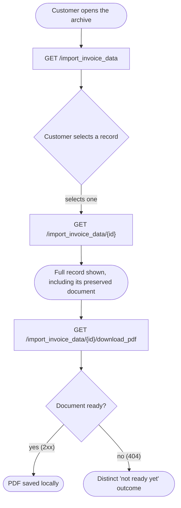

# Module: legacy-invoices

## What it is

This module gives a signed-in customer read-only access to invoices that were
issued by a predecessor billing system before the customer's account moved
onto this platform. Each invoice was carried over as an archived, imported
record: the platform stores the original bill exactly as the predecessor
system produced it, alongside a small set of top-level fields (its own
number, total, and dates) that the platform re-derives for listing, filtering
and sorting. A customer can browse the archive, open one record in full, and
download its PDF. Nothing in the archive can be paid, cancelled, refunded,
edited, or shared — it exists purely as a historical record. Staff-side
administration of the same archive is a separate surface, not covered here.

*Any `object_meta` field returned on a preserved invoice document is
UI-specific to the source client that originally rendered it — ignore for
spec purposes.*

## Core concepts

- **Imported invoice** — a bill originally issued by a predecessor system,
  carried into this platform as a read-only archived record. It is distinct
  from an invoice the platform itself raises.
- **Preserved document** — the original bill content, kept intact rather than
  reshaped by the platform. It is the archive's only source for line items,
  billing addresses, and computed totals.
- **Record id** — an opaque identifier for one imported invoice. It does not
  identify an account, contract, or any other entity — an imported invoice
  hangs off no parent entity of its own.

## Operations

| # | Capability | Inputs | Outputs |
| --- | --- | --- | --- |
| 1 | **List imported invoices** | filter (by number, total, or creation date), sort order, page window | a page of records plus the archive's total row count |
| 2 | **Read one imported invoice** | record id | the full record, including its preserved document |
| 3 | **Download an imported invoice's PDF** | record id | a PDF file, saved locally under the invoice's own number |

**Additional always-on behaviours** (not separate BE calls):

- **Readiness signal** — resolves once the first read has settled, for both the list and the single record.
- **Refresh** — re-issues the current read against the server.
- **Drop cached pages** — discards previously-fetched pages so the next read starts clean from the server (list only).
- **Narrow / re-order the list** — apply a filter or a sort order; either one merges into its own slice of the one live request state and returns the list to its first page.
- **Move to another page** — merges only the page window into the one live request state and leaves the current filter and sort standing.

**Derived from a loaded record** (computed client-side, not a BE call):

| Condition | Meaning |
| --- | --- |
| paid | the preserved document's status matches the platform's "paid" status |
| overdue | the preserved document's status matches the platform's "overdue" status |
| credited | the preserved document shows a non-zero credited amount |
| staged | the record itself is still a staged import, not yet finalised |
| proforma | the preserved document is marked as a proforma bill (optional on the wire; treated as `false` when absent) |

## Data shape

```ts
type ImportedInvoiceListResponse = {
  status: "ok";
  data: ImportedInvoice[];
  total: number; // server-reported row count for the current filter/sort criteria, not just this page's length
};

type ImportedInvoiceResponse = {
  status: "ok";
  data: ImportedInvoice;
};

type ImportedInvoice = {
  id: string;
  import_id: string;
  /** True while the record is still a staged, not-yet-finalised import. */
  staged_import: boolean;
  external_id: string | null;
  brand_id: string;
  org_id: string;
  client_id: string;
  account_id: string;
  user_id: string | null;
  /** Set once the import is promoted to a live invoice on this platform; null while it remains import-only. */
  invoice_id: string | null;
  contract_id: string | null;
  /** The record's own number — used as the downloaded PDF's file name. */
  number: string;
  total_amount: number | null;
  total_amount_formatted: string | null;
  /** A second, differently-formatted numeric total. Not read by any derived condition. */
  total_amount_converted: number | string | null;
  currency_id: string;
  /** The full currency record, embedded rather than referenced by id alone. */
  currency: Currency;
  status_id: string;
  create_datetime: string | null;
  created_at: string;
  updated_at: string;
  /** Requested via a relation include on the read; observed `null` on every captured record to date. */
  import: unknown;
  /** The original bill, passed through unmodified. See PreservedInvoiceDocument. */
  content: PreservedInvoiceDocument;
};

type Currency = {
  id: string;
  name: string;
  code: string;
  prefix: string;
  suffix: string;
  base: boolean;
  decimals: boolean;
  /** Numeric flag, not a boolean — observed `0` on every captured record. */
  manual: number;
  created_at: string;
  updated_at: string;
};

/**
 * The invoice document as the predecessor system produced it. Its shape is
 * not owned by this platform, and it can carry fields beyond the ones below.
 * The fields below are the paths this platform's own derived state and its
 * known consumers read; everything else on the document survives untouched
 * but undocumented here.
 */
type PreservedInvoiceDocument = {
  /** The document's own number — can differ from the record's top-level `number`. */
  number: string;
  create_datetime: string | null;
  paid_datetime: string | null;
  /** Compared against the platform's shared invoice-status vocabulary for the paid/overdue conditions. */
  status: { code: string; [key: string]: unknown };
  net_amount_formatted: string; // rendered as the subtotal
  tax_amount_formatted: string;
  net_global_discount_amount_formatted: string;
  total_amount_formatted: string;
  /** Non-zero => the credited condition. A sibling formatted string also exists; the numeric field is the one read. */
  partial_amount_credited_converted: number;
  /** The invoice's line items, in the document's own per-line shape. */
  products: Array<Record<string, unknown>>;
  /** Optional. Absent means "not a proforma bill". Observed `true` only on a
   * derived capture (a real recording with this one field edited from absent
   * to `true`); no raw recording to date carries it `true`. */
  proforma?: boolean;
  brand: {
    company_name: string;
    company_address: string;
    vat_number: string;
  };
  client: {
    fullname: string;
  };
  /** Observed absent on every captured record to date. */
  client_company?: {
    name: string;
    vat_number: string;
    reg_number: string;
  };
  /** Observed `null` on every captured record to date. */
  client_address: Record<string, unknown> | null;
};
```

## Dependencies

### Dependants — modules that read from this one

None yet. This is a newly built archive: nothing else in this codebase reads
from it today, and its own client-facing pages have not landed either.

### This module's own dependencies

- **HTTP transport layer** — authentication token attachment, error normalisation.
- **Signed-in session / identity context** — supplies the addressable client id, the access token used for the PDF download, and the archive-availability signal read off the signed-in customer's own record.
- **Shared types / enums** — the record's canonical shape and the shared invoice-status vocabulary used for the paid/overdue conditions.
- **A generic file-save helper**, shared with this platform's own (non-imported) invoices — the only piece of that sibling capability this module reuses; the PDF request itself is this module's own.

## API endpoints

### `GET /import_invoice_data`

List the signed-in customer's imported invoices, filtered, sorted and paged.

**Query parameters** (via a declared filter/sort/pagination criteria, not free-form):

- `filter[number|eq]` / `filter[number|neq]` / `filter[number|like]` — exact, not-equal, or contains match on the invoice number, one key per operator (pipe-separated inside a single bracket, not a second bracket). `like` wraps the value on both sides (`%value%`); there is no anchored-prefix or anchored-suffix form.
- `filter[total_amount|eq]` / `filter[total_amount|neq]` / `filter[total_amount|gt]` / `filter[total_amount|gte]` / `filter[total_amount|lt]` / `filter[total_amount|lte]` — numeric comparison on the invoice total, one key per operator.
- `filter[create_datetime|eq]` / `filter[create_datetime|gt]` / `filter[create_datetime|gte]` / `filter[create_datetime|lt]` / `filter[create_datetime|lte]` / `filter[create_datetime|before]` / `filter[create_datetime|after]` — date comparison on the creation date, one key per operator; `before`/`after` accept a relative expression rather than a fixed date-time format.
- `order` — a single field name, `create_datetime` or `total_amount`, optionally prefixed with `-` for descending; there is no separate direction parameter. Defaults to `-create_datetime` (newest first) when omitted.
- `limit` / `offset` — page window; defaults to `limit=10` / `offset=0` when omitted.

```bash
curl "$API/import_invoice_data?filter[number|like]=%25INV%25&order=-create_datetime&limit=10&offset=0" \
  -H "Authorization: Bearer $ACCESS_TOKEN"
```

**Sample response** (trimmed; source: `get-import-invoice-data.json`):

```json
{
  "status": "ok",
  "data": [
    {
      "id": "68d63250-7980-65d1-e6f8-174e234e98d2",
      "import_id": "825d96e7-63ed-0913-edb4-174825283406",
      "staged_import": false,
      "external_id": "4",
      "invoice_id": null,
      "contract_id": "98574264-8970-1200-557f-21e325d0ed36",
      "number": "C-INV-00014",
      "created_at": "2023-02-01 09:14:57",
      "updated_at": "2026-09-23 06:55:39",
      "content": {
        "number": "C-INV-00014",
        "create_datetime": "2023-02-01 09:14:57",
        "status": { "code": "invoice_unpaid" },
        "net_amount_formatted": "£20.00",
        "total_amount_formatted": "£20.00",
        "partial_amount_credited_converted": 0
      }
    }
  ],
  "total": 1
}
```

### `GET /import_invoice_data/{id}`

Read one imported invoice in full. Always requests the platform's staged-import
and import-source relations, so the returned record's preserved document is
complete.

```bash
curl "$API/import_invoice_data/68d63250-7980-65d1-e6f8-174e234e98d2?with_staged_imports=1&with=import.credentials,import.source" \
  -H "Authorization: Bearer $ACCESS_TOKEN"
```

**Sample response**: same `ImportedInvoice` shape as the list, wrapped as
`{ "status": "ok", "data": { ... } }`. Source: `get-import-invoice-data-id-with-staged-imports-1.json`
— a raw recording. The proforma condition's true branch has no raw recording
to prove against; it is instead proven against a **derived** capture
(`get-import-invoice-data-id-case-proforma.json`, this same recording with
`content.proforma` hand-edited from absent to `true`) — see Lessons.

### `GET /import_invoice_data/{id}/download_pdf`

Fetches the record's PDF as a binary file. Accepts an optional `lang` query
parameter carrying the caller's locale.

```bash
curl "$API/import_invoice_data/68d63250-7980-65d1-e6f8-174e234e98d2/download_pdf?lang=en" \
  -H "Authorization: Bearer $ACCESS_TOKEN" \
  -o invoice.pdf
```

Source: `get-import-invoice-data-id-download-pdf.json`.

## Failure modes

The document-download endpoint returns two distinct failure shapes that a
caller must tell apart by status code, never by message text:

1. **Not found / not ready (404)** — the document has not finished being
   generated yet. The response carries the platform's standard error
   envelope with `code: 404` and a human-readable message. Source:
   `get-import-invoice-data-id-download-pdf-case-not-ready.json` — a
   **derived** capture: the real 200 recording for this endpoint
   (`get-import-invoice-data-id-download-pdf.json`) with the status changed
   to `404` and the body replaced by the platform's error envelope.
2. **Any other non-2xx** — an ordinary failure; the response's error envelope
   carries whatever category and message the platform assigned.

The list and single-record reads have no soft-failure path: an empty archive
returns `200` with `data: []` and `total: 0` (source:
`get-import-invoice-data-case-empty.json` — a **derived** capture: the real
list recording with its `data` array emptied and `total` set to `0`), and a
missing record id returns the platform's standard not-found error.

## Flows

### Browse the archive, then open and download one record



Guarantees the platform holds:

- The list and the single-record read address the same archive through the same identity; a record reachable from the list is reachable by id.
- A record's own number is stable and can be used to name its downloaded file.

Constraints the caller has to plan around:

- Narrowing or re-ordering the list always returns the read to the first
  page; the previously-viewed page is not preserved. Moving to another page
  is honoured as requested and does not disturb the current filter or sort.
- Asking for a page beyond the last one recovers onto the **last** valid
  page, not the first.
- The document download can legitimately 404 while the document is still
  being prepared; this is a normal, retryable outcome, not a missing record.

## Lessons (hard-won)

- **The preserved document has no enforced shape.** Two of the fields a
  consumer might expect on a company-level invoice (a client's own company
  name and tax id) are consistently absent on every captured record, and the
  client-address block consistently resolves to `null`. A rebuilder should
  treat "key present, value empty" — or the key missing outright — as the
  normal case for this document, not a defect.
- **Two near-identical numeric fields exist for the credited condition; only
  one is meaningful.** The document carries both a formatted string and a
  converted numeric value for the credited amount. Reading the formatted
  string, or a field that does not exist, produces a plausible-looking but
  wrong truthiness check that only shows up once a genuinely credited record
  is captured.
- **A write that narrows or re-orders the list cannot keep the caller's
  current page.** This platform's list-reading layer resets to the first
  page on any filter or sort write; there is no way to suppress that from
  outside the list layer. A rebuilder that wants "narrow without losing my
  place" has to solve it above this contract, not within it.
- **An over-shot page recovers onto the last page, not the first.** When a
  caller asks for a page beyond the end of the archive, the corrective
  follow-up request the platform's list layer issues lands on the last valid
  page. A rebuilder expecting "recover to the start" will be surprised.
  Where an equivalent platform recovers to the first page instead, this is a
  genuine behavioural difference worth flagging to product owners, not a bug
  in either system.
- **The `like` filter operator matches anywhere in the string.** There is no
  anchored "starts with" or "ends with" form for the number column, only
  "contains".
- **An availability flag can read false even for a customer who does own
  imported invoices.** The flag is read off the signed-in customer's own
  identity record, and that identity read does not request the specific
  relation that would make the flag fully reliable. A `false` reading should
  be treated as inconclusive rather than authoritative until the underlying
  identity read is confirmed to include that relation.
- **The proforma condition's true branch is proven only against a derived
  capture, never a raw recording.** It is derived defensively (optional
  field, default `false`); every raw recording captured to date carries it
  absent. The one capture that carries it `true` is a real recording with
  that single field hand-edited — a rebuilder should treat the true branch as
  proven in shape only, not as observed on an unmodified document.
- **The platform's own typed contract for this record leaves the preserved
  document entirely untyped.** Nothing at the type level catches a wrong
  field-name on that document; every path a consumer reads off it needs to
  be verified against a real captured document, not against the type
  declaration.
