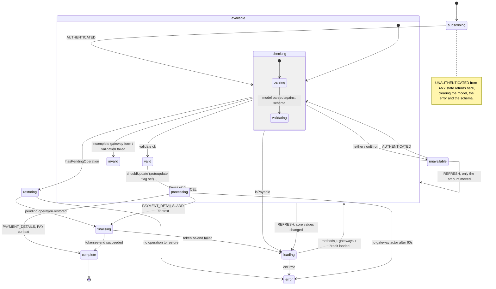
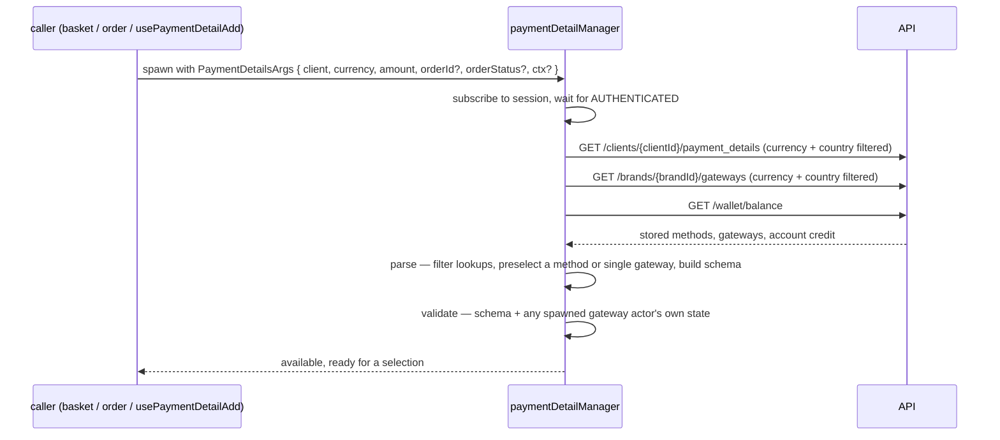
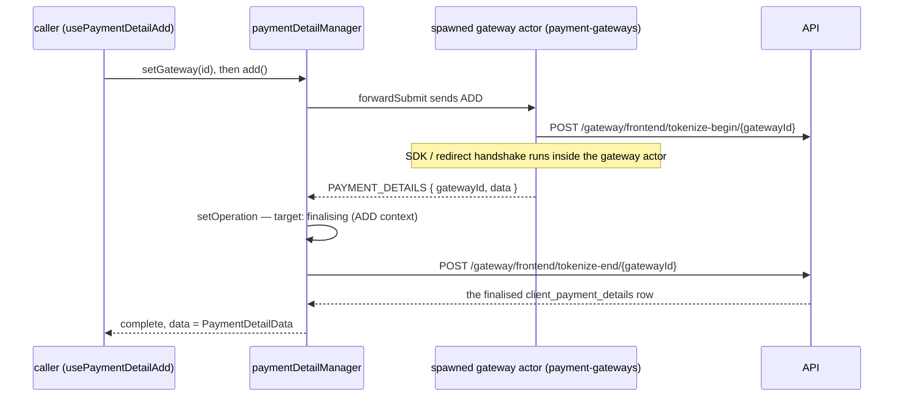

# payment-details Architecture

## Overview

One `paymentDetailManager` XState machine, five services over four endpoints, a JSONForms schema layer, and three composables built around it — `usePaymentDetail` (a lens onto an actor someone else spawned), `usePaymentDetailAdd` (spawns its own actor, pinned to ADD context) and `usePaymentDetails` (a plain query, no actor at all). There is no scope builder and no actor arm — the module takes the client it acts for as a plain argument.

```
usePaymentDetail.ts       interprets a GIVEN actor, exposes refs + methods + schema
usePaymentDetailAdd.ts    spawns its OWN actor pinned to ADD, wraps usePaymentDetail
usePaymentDetails.ts      a flat query — the active session's own stored methods
payment-detail.machine.ts paymentDetailManager — the whole capture lifecycle
payment-details.services.ts  loadLookups · parse · validate · restoreOperation · endSetup
payment-details.mappers.ts   mapPaymentDetail(s) · mapGateway(s) · mapAccountCredit · mapPaymentData
payment-details.utils.ts     spawnGateway · filter* · state-flag helpers · sessionStorage operation registry
payment-details.schemas.ts   useSchema/useUischema for PAY and ADD, plus four narrower pairs
```

`index.ts` publishes the three composables, `paymentDetailsMachine`, the module's types, and re-exports `usePaymentGateway` and its types from the sibling `payment-gateways` module. Everything else is internal.

## State Machine



### The `PAY` event's branches

`valid` evaluates `PAY` against four guards, in order:

| Guard               | Condition                                                                                         | Target                                           |
| ------------------- | ------------------------------------------------------------------------------------------------- | ------------------------------------------------ |
| `isAddContext`      | Free order, brand requires a method captured anyway                                               | `processing`                                     |
| `needsNoPayment`    | Not ADD context, and (nothing to pay, or wallet covers it, or the client chose pay-later)         | `complete` (payload set from the existing model) |
| `hasPaymentDetails` | A `PaymentDetailData` payload already sits in context (a stored-method choice was already parsed) | `complete`                                       |
| `hasBasket`         | An `orderId` is present                                                                           | `processing`                                     |

`processing` is where a **fresh gateway's own SDK/redirect capture** runs; the three branches above it are the ways a capture can finish without ever spawning one — nothing to pay, credit covers it, pay-later, or a stored method that needed no further handshake.

### Terminal / re-entrant states

- `complete` — `type: "final"`, `data` returns the `PaymentDetailData` payload. Entry fires `providePaymentDetails`.
- `error` — not final. `UNAUTHENTICATED` still returns the whole machine to `subscribing` from here.
- `unavailable` — reached when the pre-flight `isPayable` guard fails (a non-draft, non-payable order status outside ADD context). Re-entrant on `AUTHENTICATED`.

### Handing up to a parent

Two actions send to a parent, both guarded — but by a boolean flag, not a name:

```ts
providePaymentDetails: pure(({ isInvoked, paymentDetail }) => {
  if (!isInvoked) return [];
  return [sendParent(() => ({ type: "PAYMENT_DETAILS", data: paymentDetail }))];
});
```

`isInvoked: true` is set by whoever spawns the machine (`basket.utils.ts`'s `spawnPaymentDetail`; `orders` does the same). This is the same "guard `sendParent` or it throws at a root" shape the sibling `payment` module documents under `parentId` — this module's version is a plain boolean rather than a named id, because nothing here needs to route a message to a _specific_ parent, only to know whether one exists.

## Data Flow

### Loading a capture



### Storing a card (ADD context)



A redirect mid-handshake leaves the page; `registerOperation`/`getOperationReturnUrl` (in `payment-details.utils.ts`) persist the pending operation to `sessionStorage` before it does, keyed by nothing but its own presence. On return, `checking`'s `hasPendingOperation` guard reads it back and routes straight to `restoring` → `finalising`, skipping `loading` entirely.

## Sub-Composables

No `.as(actor)` scope split, and no `useMeta()`/`useContext()`/`useActions()` layering within a single composable. Instead the module splits across **three independent composables** sharing one machine:

- `usePaymentDetail` is the base — a lens over whatever actor it's given.
- `usePaymentDetailAdd` spawns an actor itself, then calls `usePaymentDetail` internally and re-exports a trimmed subset of its surface (drops the PAY-only members).
- `usePaymentDetails` shares no machine at all — it is a separate TanStack Query wrapper over the unfiltered listing endpoint.

## Services

| Service            | Endpoint(s)                                                                                        | Notes                                                                                                                                                                                                                                                                                                                                   |
| ------------------ | -------------------------------------------------------------------------------------------------- | --------------------------------------------------------------------------------------------------------------------------------------------------------------------------------------------------------------------------------------------------------------------------------------------------------------------------------------- |
| `loadLookups`      | `GET /clients/{clientId}/payment_details`, `GET /brands/{brandId}/gateways`, `GET /wallet/balance` | Three parallel reads, resolved together. Guest clients get gateways filtered to drop any `store_type: ALWAYS` provider (mirrors the legacy checkout provider). Pay-later is force-disabled in the returned config when the order isn't a draft.                                                                                         |
| `parse`            | none                                                                                               | Local. Reconciles the model against the freshly-loaded (or refreshed) lookups — clamps the wallet amount, preselects a method/gateway when exactly one option exists, strips whichever of `gateway_id`/`payment_details_id` the client didn't pick, and produces the `PaymentDetailData` payload when a stored method resolves cleanly. |
| `validate`         | none                                                                                               | Local schema validation, plus (if a gateway actor is spawned) waits for it to leave `loading`/`rendering`/`checking` and folds its `unavailable`/`error`/`invalid` state into the same error list.                                                                                                                                      |
| `restoreOperation` | none                                                                                               | Reads the pending operation out of `sessionStorage`; throws if the redirect's `operation_id` query param or the stored envelope is missing.                                                                                                                                                                                             |
| `endSetup`         | `POST /gateway/frontend/tokenize-end/{gatewayId}`                                                  | The single place every ADD flow — normal or resumed after a redirect — finalises a stored method. Invalidates the stored-methods query on success.                                                                                                                                                                                      |

`loadLookups`' gateway list is also where account credit gets its total: `useCalculate().calculate()` sums the owned + negative-allowance buckets and formats them, with the raw value used as a fallback if formatting fails.

## Dependencies

### payment-details Depends On

| Module                     | Why                                                                                                                                                                                                                                                         |
| -------------------------- | ----------------------------------------------------------------------------------------------------------------------------------------------------------------------------------------------------------------------------------------------------------- |
| `session-store`            | `authSubscription` gates every network call behind a live session; `usePaymentDetails` reads the active session's own client id directly.                                                                                                                   |
| `brand`                    | `brandId`, default currency, and `ensureConfig` for the four brand-config keys the module reads (partial payments, pay later, forced card storage, forced auto-payment).                                                                                    |
| `query`                    | The HTTP layer (`useQuery().get/post`, `useUrl`), cache keys, and `invalidateQueryByKey`.                                                                                                                                                                   |
| `routing`                  | `useQueryParams` — reading and clearing the `operation_id` / Stripe redirect query params.                                                                                                                                                                  |
| `system-localisation`      | `useI18n` for error copy and a couple of form labels.                                                                                                                                                                                                       |
| `payment-gateways`         | `spawnGateway` embeds a per-provider gateway machine as a child actor; the module also imports its `GatewayParams` type and a few shared utils (`canBeStored`, `zeroDecimalCurrencies`, `generateResponseUrls`).                                            |
| `@upmind-automation/types` | `PaymentType`, `GatewayContext`, `GatewayTypes`, `GatewayStoreType`, `GatewayProviderCodes`, `BrandConfigKeys`, `InvoiceStatus`, `QUERY_PARAMS`, and the model types (`IPaymentDetail`, `IBrandGateway`, `IWalletBalance`, `SelectPaymentMethodData`, …).   |
| headless `utils`           | `stateMatches`/`useContext`/`contextValue`/`contextMatches`, `mapToHeadlessError`, `useValidationParser`, `useModelParser`, `useTime`, `useSessionStorage`, `useCalculate`, `calculateActor`, `stopService`, `DetailedError`/`ErrorOrigin`/`responseCodes`. |

### Modules That Depend On payment-details

| Module             | How                                                                                                                                                                                                                                                                                                                                                                                         |
| ------------------ | ------------------------------------------------------------------------------------------------------------------------------------------------------------------------------------------------------------------------------------------------------------------------------------------------------------------------------------------------------------------------------------------- |
| `basket`           | `basket.utils.ts`'s `spawnPaymentDetail` spawns `paymentDetailsMachine` as the basket's `paymentDetail` child actor with `isInvoked: true`; `useBasketPaymentDetails` wraps it in `usePaymentDetail`.                                                                                                                                                                                       |
| `orders`           | Spawns the same machine for an existing order, and `useOrder.ts` calls `usePaymentDetail`/`usePaymentGateway` directly; `order.types.ts` types against `PaymentDetailData`/`PaymentDetailModel`.                                                                                                                                                                                            |
| `payment`          | Imports `PaymentDetailData` (type-only) — the payload shape it submits to `POST /payments`.                                                                                                                                                                                                                                                                                                 |
| `payment-gateways` | Imports `PaymentDetailData` and `GatewayContext` (type-only) — a spawned gateway actor's own context ends up carrying a `paymentDetail` field of this shape once its capture completes. This is a genuine two-way relationship: `payment-details` spawns and drives `payment-gateways`' machines; `payment-gateways` in turn types its own output against `payment-details`' payload shape. |

## Integration Points

- **`payment-details` → `payment-gateways`.** `spawnGateway` is the single place that turns a chosen `IBrandGateway` into a running actor, keyed by `GatewayProviderCodes`. `forwardSubmit` sends that actor `ADD` or `PAY`; `render`/`cancelChallenge` forward capture-time challenge control to it. This module never reads the gateway SDK's own state beyond what it needs to fold into `validate` and never renders the SDK itself.
- **`payment-details` → `payment`.** The hand-off is the `PaymentDetailData` sitting at `context.paymentDetail` once `complete` is reached. This module never calls `POST /payments`; submission, the post-submit challenge, and the offsite-redirect outcome are `payment`'s surface.
- **`payment-details` → `basket` / `orders`.** The spawning parent supplies `isInvoked: true` and receives `PAYMENT_DETAILS` (on complete) or `CANCEL` (on the client backing out of `processing`) back via `sendParent`.
- **`payment-details` → `sessionStorage`.** `registerOperation`/`clearOperation`/`getOperationReturnUrl` (in `payment-details.utils.ts`) persist the pending ADD operation across an off-site redirect; `restoreOperation` and `checking`'s `hasPendingOperation` guard read it back on return.
